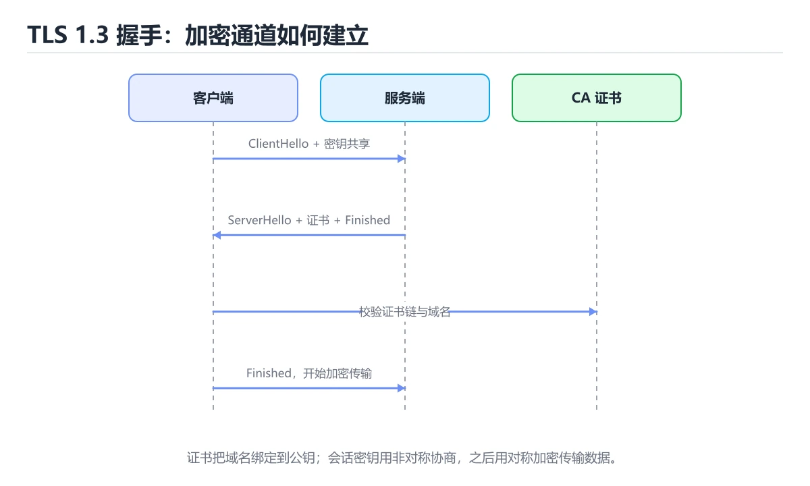
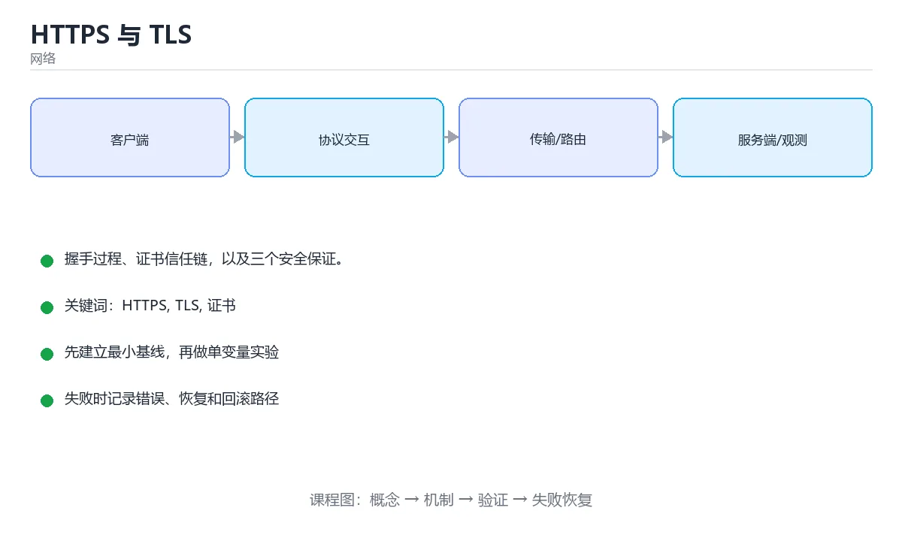

# HTTPS 与 TLS





> 内容更新时间：2026-10-06 · 学习阶段：进阶 · 预计用时：30 分钟

## 学习目标

- 能用自己的话解释HTTPS 与 TLS解决了什么问题，而不是只背术语。
- 能说清 「HTTPS」、「TLS」、「证书」、「CA」 之间的关系，并分别举出一个例子。
- 能把本课知识放回「网络」的知识体系，说明它和相邻主题的边界。
- 能完成本课练习，并用验收标准检查自己的结果。

> 一句话摘要：握手过程、证书信任链，以及三个安全保证。

## 前置知识

- 先完成上一课《DNS 域名解析》；如果已经掌握，可以直接用本课练习自测。
- 开始前先复习：HTTPS、TLS、证书。
- 如果某一步看不懂，先记录具体卡点，完成练习后再回头读一遍。

## HTTPS 解决了什么

HTTP 是明文传输，中间人可以窃听、篡改、冒充服务器。HTTPS = HTTP + TLS，提供三个保证：

- **机密性**：数据加密，抓包看不到明文。
- **完整性**：内容被篡改会被检测出来。
- **身份认证**：通过证书确认「对方确实是这个域名」。

## 握手过程（简化）

```text
客户端 -> ClientHello（支持的版本与密码套件、随机数）
服务器 -> ServerHello + 证书（含公钥）
客户端    验证证书链，生成预主密钥并用服务器公钥加密
双方      用随机数推导出会话密钥（对称加密）
客户端 -> Finished（之后用对称密钥通信）
```

关键在于：**非对称加密只用于协商密钥，真正的数据传输用对称加密**（如 AES-GCM），兼顾安全与性能。

## 证书与信任链

```text
根 CA（预装在系统/浏览器）
  └─ 中间 CA
       └─ 服务器证书（example.com）
```

客户端逐级验签，直到信任的根证书；同时检查域名、有效期与吊销状态（OCSP / CRL）。

## 常见概念

| 概念 | 说明 |
| --- | --- |
| TLS 1.2 / 1.3 | 1.3 握手更快、默认更安全，废弃了弱算法 |
| SNI | 握手时携带域名，让一台服务器托管多个 HTTPS 站点 |
| HSTS | 强制浏览器只用 HTTPS 访问该域名 |
| 证书透明度（CT） | 公开记录证书签发，便于发现伪造 |
| 自签名证书 | 不在信任链中，会触发浏览器警告，仅适合内网测试 |

## 实践建议

1. 使用 Let's Encrypt 等免费证书并开启自动续期。
2. 全站 HTTPS，HTTP 请求 301 跳转。
3. 开启 HSTS，避免降级攻击。
4. 用 `openssl` 或在线工具检查证书链与协议版本。

```bash
openssl s_client -connect example.com:443 -servername example.com
curl -vI https://example.com
```

## 证书链验证的五步

客户端拿到服务器证书后依次检查：

1. **签名链**：服务器证书 → 中间 CA → 根 CA，逐级验签，直到命中本地信任库中的根证书。
2. **域名匹配**：证书的 SAN 字段是否包含访问的域名（通配符只匹配一级子域）。
3. **有效期**：是否在 notBefore 与 notAfter 之间（服务器时间错误也会导致验证失败）。
4. **吊销状态**：OCSP / CRL 查询证书是否被提前吊销。
5. **用途与算法**：扩展密钥用途是否允许服务器认证，签名算法是否被策略禁用。

任一步失败，浏览器就报警告或直接拒绝连接。

## 握手失败排查表

| 报错关键词 | 常见原因 | 处理 |
| --- | --- | --- |
| `certificate has expired` | 证书过期或服务器时间错误 | 续期证书；校准服务器 NTP |
| `unable to get local issuer certificate` | 缺少中间证书（只装了站点证书） | 配置 fullchain（站点+中间证书） |
| `hostname mismatch` | 证书域名与实际访问域名不一致 | 换证书或改用正确域名 |
| `unable to verify the first certificate` | 客户端信任库缺根证书（自签或内网 CA） | 导入企业根证书，或改用受信 CA |
| `wrong version number` | 用 HTTPS 访问了纯 HTTP 端口 | 检查协议与端口 |
| `ssl3_get_record:wrong version number` / 握手超时 | 中间设备拦截或端口被墙 | 抓包看 ClientHello 是否有响应 |

排查顺序：`openssl s_client -connect host:443 -servername host` 看证书链 → `curl -vI https://host` 看具体报错 → 再对比系统时间与本地信任库。

## 本课小结

HTTPS 的安全性来自**证书信任链 + 密钥协商 + 对称加密**。抓包工具能解密，是因为你在系统里主动信任了它的根证书。

## 加密套件与握手速查

| 阶段 | 明文 / 加密 | 内容 |
| --- | --- | --- |
| ClientHello | 明文 | 支持的版本、密码套件、随机数、SNI |
| ServerHello + 证书 | 明文 | 选定套件、服务端随机数、证书链 |
| 密钥协商 | 非对称 / ECDHE | 双方计算共享密钥，支持前向保密 |
| Finished | 加密 | 校验握手完整性 |
| 应用数据 | 对称加密（AES-GCM / ChaCha20） | 真正传输业务数据 |

| 版本 | 特点 |
| --- | --- |
| TLS 1.2 | 支持广泛，握手 2-RTT，可配置 RSA 或 ECDHE |
| TLS 1.3 | 强制前向保密，握手 1-RTT，0-RTT 会话恢复，移除弱算法 |
| SSL 3.0 / TLS 1.0 / 1.1 | 已废弃，禁止在生产使用 |

证书要点：

| 项 | 说明 |
| --- | --- |
| 证书链 | 服务器应下发「中间证书 + 站点证书」，根证书预置在系统 |
| SNI | 一个 IP 部署多个 HTTPS 站点时靠 SNI 区分证书 |
| 通配符 | `*.example.com` 只匹配一级子域 |
| 有效期 | 越来越短，需自动续期（如 ACME） |
| 吊销 | CRL / OCSP，移动端兼容性差，通常靠短有效期 |

## 排查命令速查

| 目的 | 命令 |
| --- | --- |
| 查看证书与协议 | `openssl s_client -connect example.com:443 -servername example.com` |
| 查看有效期 | `openssl s_client -connect h:443 </dev/null 2>/dev/null \| openssl x509 -noout -dates` |
| 查看 SAN | `openssl x509 -noout -text \| grep -A1 "Subject Alternative Name"` |
| 测 TLS 版本支持 | `nmap --script ssl-enum-ciphers -p 443 host` |
| curl 详细握手 | `curl -vI https://example.com` |
| 检查链路与耗时 | `curl -w "%{time_connect} %{time_appconnect} %{time_total}\n" -o /dev/null -s https://example.com` |

## 常见错误与排查

| 现象 | 常见原因 | 处理方式 |
| --- | --- | --- |
| `certificate has expired` | 证书过期 | 配置自动续期并加到期告警 |
| `unable to get local issuer certificate` | 中间证书缺失或客户端信任库过旧 | 服务端下发完整链，客户端更新根证书 |
| 域名不匹配 | 证书 SAN 未包含访问域名 | 用正确的域名或补全 SAN |
| 只在部分客户端失败 | 客户端不支持所选套件或版本 | 兼容 TLS 1.2，检查加密套件顺序 |
| 抓包能看到明文 URL | TLS 只加密内容，域名与 SNI 仍可见 | 敏感信息不要放路径与查询串，或用 ECH |
| 混合内容告警 | HTTPS 页面加载 HTTP 资源 | 全部资源改用 HTTPS 或协议相对地址 |
| 证书私钥泄露 | 无法真正吊销 | 立即换证书与密钥，启用前向保密减少影响 |
| 自签证书用于生产 | 用户看到安全警告 | 使用受信任 CA，内网用私有 CA 并分发根证书 |
| 强制 HTTPS 后接口 502 | 回源仍走 HTTP 或端口不对 | 检查反向代理与回源配置 |

## 复习与自测

- [ ] 能画出 TLS 1.3 的握手流程并说明 1-RTT 的含义。
- [ ] 知道对称加密保护数据、非对称用于密钥协商与身份验证。
- [ ] 会用 `openssl s_client` 检查证书链与有效期。
- [ ] 服务器下发完整证书链，并配置自动续期。
- [ ] 明白前向保密的价值与实现方式（ECDHE）。

## 动手练习

> 本课练习重点：围绕「HTTPS、TLS、证书」完成复述、实验和交付，每个结果都要能被别人检查。

先抓一次真实请求或画出协议交互，再注入延迟或丢包，最后解释每层变化。

### 练习 1：建立心智模型（10 分钟）

合上教程，用 3～5 句话回答：

1. HTTPS 与 TLS解决了什么问题？
2. 如果没有它，会出现什么具体后果？
3. 它和「TLS」是什么关系？

**验收标准**：至少出现一个本课关键词，并写出一个反例、边界条件或失效场景。

### 练习 2：做一次可控实验（20 分钟）

从正文中选一个最小示例，完成以下操作：

1. 先预测修改一个参数、输入或步骤后的结果。
2. 再实际执行或逐步推演，记录真实结果。
3. 如果结果与预测不同，写出差异原因。

**验收标准**：留下「原例 → 改动 → 预测 → 结果 → 原因」五步记录。

### 练习 3：交付一个小结果（30 分钟）

画出一张报文或时序图，标出每一跳的地址、协议、状态和可能失败点。

任务要求：

- 结果必须能被别人检查，不能只写“我已经理解了”。
- 至少覆盖「HTTPS」和「TLS」两个关键词。
- 写出 1 个仍然不确定的问题，以及下一步如何验证。

> 提示：时间有限时优先做练习 1 和练习 2；练习 3 可以拆成两次完成。

## 可运行练习

本节围绕HTTPS 与 TLS安排 3 个可交付任务，每个任务都要求留下可以复查的记录。

### 任务 1：用自己的话画出结构

不看书，用一张图说清「HTTPS 与 TLS」的结构，画完再对照骨架：

- 主干：HTTPS 解决了什么 → 握手过程（简化） → 证书与信任链 → 常见概念
- 连接线：在每条边上标出输入、输出与失败路径。
- 自检：能否用一句话说明HTTPS与TLS的关系？

### 任务 2：做一次对比实验

**验收标准**：表格里两个方案的结论不能完全一样；写下“在什么条件下应该换方案”。

### 任务 3：迁移到自己的场景

**验收标准**：至少有一个可复现的命令、代码片段或数据样例；结论能被别人独立检查。

## 故障现场

### 现场 1：本课的 HTTPS 常规用例通过，但边界用例失败

**症状**：在本课的练习或生产场景里出现“本课的 HTTPS 常规用例通过，但边界用例失败”。

**复现**：准备一组最小输入，只保留触发“本课的 HTTPS 常规用例通过，但边界用例失败”的必要条件，连续运行两次确认结果稳定。

**定位**：围绕“HTTPS 的前置条件与取值边界没有写进代码，默认值掩盖了空值和极值”检查调用链、输入数据和环境配置，先验证假设再改代码。

**预防**：把“本课的 HTTPS 常规用例通过，但边界用例失败”写成一条自动化用例，并在本课的验收清单里保留对应检查项。

### 现场 2：本课的 TLS 结果在两次运行之间不一致

**症状**：在本课的练习或生产场景里出现“本课的 TLS 结果在两次运行之间不一致”。

**复现**：准备一组最小输入，只保留触发“本课的 TLS 结果在两次运行之间不一致”的必要条件，连续运行两次确认结果稳定。

**定位**：围绕“TLS 依赖了当前版本、执行顺序或共享状态，单次运行无法暴露差异”检查调用链、输入数据和环境配置，先验证假设再改代码。

**预防**：把“本课的 TLS 结果在两次运行之间不一致”写成一条自动化用例，并在本课的验收清单里保留对应检查项。

### 现场 3：请求偶发超时，但服务端监控看起来正常

**症状**：在本课的练习或生产场景里出现“请求偶发超时，但服务端监控看起来正常”。

## 深入补充：HTTPS 与 TLS 的取舍与边界

### 一、把概念放回真实约束

学习HTTPS 与 TLS时，最容易只记住结论而忽略前提。先写出三个约束：数据规模、时间预算、可接受的失败方式；再判断 HTTPS 与 TLS 在这些约束下是否仍然成立。只要约束改变，原来的最优解就可能变成错误解。

| 场景 | 协议或方案 | 延迟与可靠性 | 排障入口 |
| --- | --- | --- | --- |
| 强一致请求 | TCP / HTTP | 可靠但可能队头阻塞 | 连接与重传指标 |
| 实时音视频 | UDP / QUIC | 低延迟但允许丢包 | 抖动与丢包率 |
| 大规模分发 | CDN 与缓存 | 就近命中 | 命中率与回源 |
| 服务间调用 | RPC 或消息队列 | 取决于确认机制 | 超时、重试与幂等 |

### 二、三个容易混淆的边界

1. 澄清输入与目标。先写清「HTTPS 与 TLS」要解决的问题、合法输入范围和成功标准，再进入后续步骤。
2. **把“平均值”当成“全部”**：HTTPS 的指标好看，不代表尾部请求、冷启动或失败重试也好看。
3. **把“当前版本”当成“永久行为”**：TLS 依赖的默认值、API 或性能特征都可能随版本变化，需要固定版本并保留回归用例。

### 三、一个生产场景

假设团队要在真实系统里使用HTTPS 与 TLS：第一周先做小流量验证，记录 HTTPS 的基线与异常；第二周扩大输入规模，观察 TLS 是否成为瓶颈；第三周再做故障演练，主动注入超时、重复请求和依赖不可用，确认系统能降级、能重试、能恢复。每一步都要留下指标、日志和结论，而不是只留下“感觉更快了”。

### 四、自测清单

- 能否用一句话说出HTTPS 与 TLS解决的核心问题与不适用场景？
- 能否画出 HTTPS 的数据流或状态变化，并标出失败路径？
- 能否给出一个反例，证明某个看似合理的结论在边界条件下不成立？
- 能否写出一条可复现的验证命令，让别人独立得到相同结论？

## 本课复习清单

离开本课前，逐项确认：

- [ ] 不看解析，能说出「HTTPS 相比 HTTP 提供的保证不包括？」的判断依据。
- [ ] 不看解析，能说出「TLS 数据传输阶段使用哪种加密？」的判断依据。
- [ ] 不看解析，能说出「浏览器如何确认服务器证书可信？」的判断依据。
- [ ] 不看解析，能说出「浏览器如何信任证书链中的根证书？」的判断依据。
- [ ] 不看解析，能说出「TLS 1.3 相比 TLS 1.2 在连接建立上的改进是？」的判断依据。
- [ ] 至少运行一次本课示例，记录输入、输出和一个边界情况。
- [ ] 把本课最容易混淆的两个概念写成一句话对照。

| 复盘项 | 记录 |
| --- | --- |
| 已经能独立解释的考点 |  |
| 仍然说不清的概念 |  |
| 下一步验证动作 |  |

## 术语速查

把「HTTPS 与 TLS」里反复出现的术语集中放在一起。复习时先遮住右列，尝试用自己的话解释，再回到正文核对。

| 术语 | 一句话说明 |
| --- | --- |
| `HTTPS` | 排查顺序：openssl sclient -connect host:443 -servername host 看证书链 → curl -vI https://host 看具体报错 → 再对比系统时间与本地信任库。 |
| `TLS` | 围绕“TLS 依赖了当前版本、执行顺序或共享状态，单次运行无法暴露差异”检查调用链、输入数据和环境配置，先验证假设再改代码。 |
| `证书` | “HTTPS 与 TLS”中的 HTTPS、TLS、证书，下列哪两项是本课强调的实践判断。 |
| `CA` | 签名链：服务器证书 → 中间 CA → 根 CA，逐级验签，直到命中本地信任库中的根证书。 |
| `握手` | 它在「HTTPS 与 TLS」里是理解「握手」的关键术语，用来解释定义、适用条件与失败路径；它与HTTPS、TLS共同决定这一节的判断边界。复习时回到正文示例核对输入、输出和验证方式。 |
| `加密` | 它在「HTTPS 与 TLS」里是理解「加密」的关键术语，用来解释定义、适用条件与失败路径；它与HTTPS、TLS共同决定这一节的判断边界。复习时回到正文示例核对输入、输出和验证方式。 |

## 考点精讲

### 考点 1：概念判断·HTTPS

- **题目**：HTTPS 相比 HTTP 提供的保证不包括？
- **判断依据**：HTTPS 提供加密、防篡改与身份认证。其他选项：HTTPS 提供机密性、完整性与身份认证，但不压缩传输内容（压缩属于另外的层面）。在「HTTPS 与 TLS」里判断这道题，要把HTTPS、TLS、证书的条件、过程与失败路径逐项对齐，换成“HTTPS 相比 HTTP 提供的保”这个场景，只有满足前提的结论才成立。

### 考点 2：概念判断·HTTPS

- **题目**：TLS 数据传输阶段使用哪种加密？
- **判断依据**：握手用非对称加密协商密钥，之后用对称加密传输，兼顾安全与性能。其他选项：数据传输阶段使用对称加密（如 AES-GCM、ChaCha20）。「HTTPS 与 TLS」要求先交代HTTPS、TLS、证书的前提再下结论，所以“对称加密”只在题干“TLS 数据传输阶段使用哪种加密”给定的条件下成立。

### 考点 3：代码补全·HTTPS

- **题目**：阅读「HTTPS 与 TLS」正文里的这段代码，下面哪一项判断是正确的？
- **判断依据**：题干的正确项是这段代码只做静态声明，没有循环、分支或可观察输出，在「HTTPS 与 TLS」里它只能证明HTTPS相关约束存在，不能替代真实运行证据。这段代码出自「HTTPS 与 TLS」的正文示例，围绕HTTPS、TLS、证书展开；把输入或边界换成空值、极值或失败情况后，结论要以「HTTPS 与 TLS」的实际运行结果为准。“阅读HTTPS”与「HTTPS 与 TLS」的术语表相呼应，只有符合HTTPS、TLS、证书约束的“这段代码只做静态声明，没有循环”才是正文支持的结论。

### 考点 4：多选辨析·HTTPS

- **题目**：围绕“HTTPS 与 TLS”中的 HTTPS、TLS、证书，下列哪两项是本课强调的实践判断？
- **判断依据**：结论应落在验证 TLS 时要固定版本并覆盖边界输入。本课把HTTPS 与 TLS拆成概念、示例与故障现场三部分，因此判断 HTTPS 时必须同时交代输入、输出和失败路径，这使“学习 HTTPS 时要同时说明输入、输出和失败路径，不能只看正常流程”成立。在HTTPS 与 TLS里，判断 TLS 时要固定版本与边界输入，所以“验证 TLS 时要固定版本并覆盖边界输入，结论才可复现”才可复现。

### 考点 5：概念判断·HTTPS

- **题目**：TLS 1.3 相比 TLS 1.2 在连接建立上的改进是？
- **判断依据**：TLS 1.3 还移除了大量过时算法，默认使用前向保密的密钥交换。在「HTTPS 与 TLS」里，其他选项：TLS 1.3 把密钥协商与握手合并，缩短到 1-RTT（会话复用可 0-RTT），并且默认支持前向保密。回到「HTTPS 与 TLS」的正文示例，用“TLS 1.3 相比 TLS 1.2”走一遍HTTPS、TLS、证书的完整流程，能复现的结论才可以保留。

### 考点 6：填空·HTTPS

- **题目**：补全代码：「HTTPS 与 TLS」示例中，下面这行代码缺少哪个关键字或函数名？请填入 ____。 `客户端 -> ____（支持的版本与密码套件、随机数）`
- **判断依据**：在「HTTPS 与 TLS」里，ClientHello。回到「HTTPS 与 TLS」的正文示例，用“补全代码”走一遍HTTPS、TLS、证书的完整流程，能复现的结论才可以保留。回到HTTPS、TLS、证书本身再看一遍：只有“ClientHello”与题干“HTTPS”的前提一致，结论才成立。

## English Overview

**Title:** HTTPS & TLS

**Summary:** Handshake, certificate chains and security guarantees.

**Category:** Networking
**Level:** 高级
**Key terms:** HTTPS, TLS, 证书, CA, 握手, 加密

## 内容元数据

- 内容版本：v2.0
- 最后更新：2026-10-06
- 学习阶段：进阶
- 适用环境：TCP/IP、HTTP/2、HTTP/3 与现代网络栈
- 内容来源：内置结构化课程与工程实践整理
- 相关主题：HTTPS、TLS、证书、CA、握手、加密
- 质量版本：P0 测验标准 + P1 覆盖扩展 + P2 体验补全

## 参考资料与复核

- 最后复核：2026-10-04
- 下次复核：2027-04-04
- 复核范围：版本兼容、API 行为、安全建议与工程实践
- 来源性质：官方文档、标准或权威教材；正文为离线教学重组

| 参考资料 | 本课用途 |
| --- | --- |
| [RFC 8446 TLS 1.3](https://www.rfc-editor.org/rfc/rfc8446) | TLS 握手与加密 |
| [Cloudflare Learning](https://www.cloudflare.com/learning/) | 网络概念与安全解释 |
| [RFC 9110 HTTP 语义](https://www.rfc-editor.org/rfc/rfc9110) | HTTP 方法、状态与缓存 |

> 「HTTPS 与 TLS」的链接用于离线阅读后的延伸核对；App 不会自动联网。

## 复习与迁移

复习目标：把「HTTPS 与 TLS」的判断标准放回可复现的例子里。先自己作答，再对照依据；如果结论正确但理由不完整，回到正文补足前提。

### 概念复述

- 用一句话说明「HTTPS 与 TLS」解决什么问题：握手过程、证书信任链，以及三个安全保证。
- 写出HTTPS、TLS、证书之间的关系，并各举一个例子。
- 说出本课最容易混淆的两个概念，以及区分它们的判据。

### 正文逐节复核

- **握手过程（简化）**：关键在于：**非对称加密只用于协商密钥，真正的数据传输用对称加密**（如 AES-GCM），兼顾安全与性能。
- **证书与信任链**：客户端逐级验签，直到信任的根证书；同时检查域名、有效期与吊销状态（OCSP / CRL）。
- **握手失败排查表**：排查顺序：`openssl s_client -connect host:443 -servername host` 看证书链 → `curl -vI https://host` 看具体报错 → 再对比系统时间与本地信任库。
- **实践任务**：本节围绕HTTPS 与 TLS安排 3 个可交付任务，每个任务都要求留下可以复查的记录。
- **深入补充：HTTPS 与 TLS 的取舍与边界**：学习HTTPS 与 TLS时，最容易只记住结论而忽略前提。

### 测验回顾

1. HTTPS 相比 HTTP 提供的保证不包括？
   - 依据：HTTPS 提供加密、防篡改与身份认证。其他选项：HTTPS 提供机密性、完整性与身份认证，但不压缩传输内容（压缩属于另外的层面）。在「HTTPS 与 TLS」里判断这道题，要把HTTPS、TLS、证书的条件、过程与失败路径逐项对齐，换成“HTTPS 相比 HTTP 提供的保”这个场景，只有满足前提的结论才成立。
2. TLS 数据传输阶段使用哪种加密？
   - 依据：握手用非对称加密协商密钥，之后用对称加密传输，兼顾安全与性能。其他选项：数据传输阶段使用对称加密（如 AES-GCM、ChaCha20）。「HTTPS 与 TLS」要求先交代HTTPS、TLS、证书的前提再下结论，所以“对称加密”只在题干“TLS 数据传输阶段使用哪种加密”给定的条件下成立。
3. 阅读「HTTPS 与 TLS」正文里的这段代码，下面哪一项判断是正确的？
   - 依据：题干的正确项是这段代码只做静态声明，没有循环、分支或可观察输出，在「HTTPS 与 TLS」里它只能证明HTTPS相关约束存在，不能替代真实运行证据。这段代码出自「HTTPS 与 TLS」的正文示例，围绕HTTPS、TLS、证书展开；把输入或边界换成空值、极值或失败情况后，结论要以「HTTPS 与 TLS」的实际运行结果为准。“阅读HTTPS”与「HTTPS 与 TLS」的术语表相呼应，只有符合HTTPS、TLS、证书约束的“这段代码只做静态声明，没有循环”才是正文支持的结论。
4. 围绕“HTTPS 与 TLS”中的 HTTPS、TLS、证书，下列哪两项是本课强调的实践判断？
   - 依据：结论应落在验证 TLS 时要固定版本并覆盖边界输入。本课把HTTPS 与 TLS拆成概念、示例与故障现场三部分，因此判断 HTTPS 时必须同时交代输入、输出和失败路径，这使“学习 HTTPS 时要同时说明输入、输出和失败路径，不能只看正常流程”成立。在HTTPS 与 TLS里，判断 TLS 时要固定版本与边界输入，所以“验证 TLS 时要固定版本并覆盖边界输入，结论才可复现”才可复现。
5. TLS 1.3 相比 TLS 1.2 在连接建立上的改进是？
   - 依据：TLS 1.3 还移除了大量过时算法，默认使用前向保密的密钥交换。在「HTTPS 与 TLS」里，其他选项：TLS 1.3 把密钥协商与握手合并，缩短到 1-RTT（会话复用可 0-RTT），并且默认支持前向保密。回到「HTTPS 与 TLS」的正文示例，用“TLS 1.3 相比 TLS 1.2”走一遍HTTPS、TLS、证书的完整流程，能复现的结论才可以保留。
6. 补全代码：「HTTPS 与 TLS」示例中，下面这行代码缺少哪个关键字或函数名？请填入 ____。

`客户端 -> ____（支持的版本与密码套件、随机数）`
   - 依据：在「HTTPS 与 TLS」里，ClientHello。回到「HTTPS 与 TLS」的正文示例，用“补全代码”走一遍HTTPS、TLS、证书的完整流程，能复现的结论才可以保留。回到HTTPS、TLS、证书本身再看一遍：只有“ClientHello”与题干“HTTPS”的前提一致，结论才成立。

### 迁移练习

把「HTTPS 与 TLS」的结论迁移到相邻主题，每次迁移都写清预测与证据：

1. 换输入：用HTTPS处理一组你自己的数据，对比教材示例的结果差异。
2. 换失败条件：制造一个TLS相关的错误，说明如何从错误信息定位根因。
3. 换规模：把数据量或并发度提高一个数量级，说明「HTTPS 与 TLS」的结论是否仍成立。
