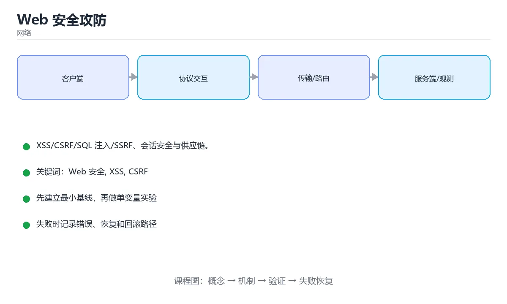

# Web 安全攻防

> 内容更新时间：2026-10-06 · 学习阶段：进阶 · 预计用时：25 分钟




## 学习目标

- 能用自己的话解释Web 安全攻防解决了什么问题，而不是只背术语。
- 能说清 「Web 安全」、「XSS」、「CSRF」、「SQL 注入」 之间的关系，并分别举出一个例子。
- 能把本课知识放回「网络」的知识体系，说明它和相邻主题的边界。
- 能完成本课练习，并用验收标准检查自己的结果。

> 一句话摘要：XSS/CSRF/SQL 注入/SSRF、会话安全与供应链。

## 前置知识

- 先完成上一课《Socket 编程实战》；如果已经掌握，可以直接用本课练习自测。
- 本课阶段：进阶。建议先掌握同一分类的基础课程，并能独立运行正文中的最小示例。
- 开始前先复习：Web 安全、XSS、CSRF。
- 如果某一步看不懂，先记录具体卡点，完成练习后再回头读一遍。

## OWASP 常见风险与防护

| 漏洞 | 原理 | 防护 |
| --- | --- | --- |
| XSS | 把脚本注入页面执行 | 输出转义、CSP、避免 innerHTML、HttpOnly Cookie |
| CSRF | 借用已登录身份发起请求 | SameSite Cookie、CSRF Token、校验 Origin |
| SQL 注入 | 拼接用户输入进 SQL | 参数化查询、最小权限、ORM 白名单 |
| SSRF | 诱导服务端请求内网地址 | 出站白名单、禁跳转、屏蔽元数据地址 |
| 越权 | 未校验资源归属 | 每次请求服务端鉴权、ID 不可枚举 |
| 文件上传 | 上传可执行脚本 | 类型白名单、重命名、存储与执行分离 |
| 反序列化 | 恶意数据触发对象构造 | 避免不可信数据反序列化、签名校验 |

## XSS 的三种形态

存储型（恶意内容入库，所有访问者中招）、反射型（通过链接参数回显）、DOM 型（前端 JS 直接把不可信数据写入 DOM）。防御核心是「**永不信任输入，按上下文转义输出**」，并配合 CSP 限制脚本来源。

## 认证与会话

1. 口令用 Argon2/bcrypt 加盐存储，禁止明文与可逆加密。
2. 会话 Cookie 设置 HttpOnly + Secure + SameSite。
3. 登录失败要限速与告警，支持多因素认证。
4. Token（JWT）要校验签名、过期与受众，不要放敏感数据在载荷里。
5. 注销与改密后要失效旧会话。

## 安全响应头

`Content-Security-Policy`（限制脚本来源）、`Strict-Transport-Security`（强制 HTTPS）、`X-Content-Type-Options: nosniff`、`Referrer-Policy`、`Permissions-Policy`。它们成本低、收益高，应作为基线配置。

## 供应链与依赖

第三方依赖是主要风险面：锁定版本与哈希、开启 SCA 扫描（Dependabot/Snyk）、审查新增依赖的维护活跃度、构建产物做签名与 SBOM 清单。

## 安全开发流程

威胁建模（识别资产与攻击面）→ 安全编码规范 → 代码审计与 SAST → DAST/渗透测试 → 上线前检查 → 运行时监控与应急响应。把安全左移，比出事后再补便宜得多。

## 本课小结

Web 安全的三条主线：**输入不可信（转义与参数化）、权限最小化（服务端逐次鉴权）、纵深防御（CSP + 头 + 扫描 + 监控）**。

## 漏洞与防护速查

| 漏洞 | 成因 | 防护 |
| --- | --- | --- |
| SQL 注入 | 拼接 SQL | 参数化查询、最小权限账号 |
| XSS | 未转义地插入用户输入 | 输出编码、CSP、`textContent` |
| CSRF | 浏览器自动携带凭证 | CSRF Token、SameSite Cookie、校验 Origin |
| SSRF | 服务端按用户输入请求地址 | 白名单、禁止访问内网段与元数据地址 |
| 越权（IDOR） | 只校验登录不校验归属 | 每次访问校验资源归属与角色 |
| 命令注入 | 拼接系统命令 | 避免 shell，用参数数组与白名单 |
| 路径穿越 | 拼接文件路径 | 规范化路径并校验前缀 |
| 反序列化 | 反序列化不可信数据 | 避免不可信数据反序列化，或严格白名单 |
| 文件上传 | 未校验类型与内容 | 白名单后缀、内容检测、重命名、隔离存储 |
| 敏感信息泄漏 | 日志与响应包含隐私 | 脱敏、最小返回字段 |

## 浏览器安全头速查

| 头部 | 作用 |
| --- | --- |
| `Content-Security-Policy` | 限制脚本与资源来源，缓解 XSS |
| `Strict-Transport-Security` | 强制后续使用 HTTPS |
| `X-Content-Type-Options: nosniff` | 禁止 MIME 嗅探 |
| `Referrer-Policy` | 控制 Referer 泄漏 |
| `Permissions-Policy` | 限制摄像头、定位等能力 |
| `X-Frame-Options` / `frame-ancestors` | 防点击劫持 |
| `Cross-Origin-Opener-Policy` | 隔离窗口上下文 |

Cookie 安全属性：

| 属性 | 作用 |
| --- | --- |
| `HttpOnly` | 禁止 JS 读取，缓解 XSS 窃取 |
| `Secure` | 仅通过 HTTPS 传输 |
| `SameSite=Lax` | 默认值，跨站 POST 不带 Cookie |
| `SameSite=Strict` | 最严格，跨站导航也不带 |
| `Path` / `Domain` | 限定作用范围，尽量收窄 |
| `Max-Age` / `Expires` | 控制有效期 |

```python
import html
import re
from urllib.parse import urlparse

ALLOWED_HOSTS = {"cdn.example.com", "api.example.com"}
PRIVATE_PREFIXES = ("10.", "192.168.", "172.16.", "127.", "169.254.")

def safe_html(user_input: str) -> str:
    """输出编码：把用户输入插入 HTML 前先转义。"""
    return html.escape(user_input, quote=True)

def safe_redirect_target(url: str) -> bool:
    """防开放重定向：只允许白名单域名。"""
    parsed = urlparse(url)
    return parsed.scheme in {"https"} and parsed.hostname in ALLOWED_HOSTS

def is_internal_address(url: str) -> bool:
    """SSRF 防护：识别是否指向内网或元数据地址。"""
    host = urlparse(url).hostname or ""
    if host in {"localhost", "metadata.google.internal"}:
        return True
    return host.startswith(PRIVATE_PREFIXES)

def sanitize_filename(name: str) -> str:
    """防路径穿越：只保留安全字符，去掉任何目录成分。"""
    cleaned = re.sub(r"[^A-Za-z0-9._-]", "_", name)
    cleaned = cleaned.lstrip(".") or "file"
    return cleaned[:100]

print(safe_html('<script>alert(1)</script>'))
print(safe_redirect_target("https://cdn.example.com/a.js"))
print(is_internal_address("http://169.254.169.254/latest/meta-data"))
print(sanitize_filename("../../etc/passwd"))
```

## 常见错误与排查

| 容易踩的做法 | 实际现象 | 原因与正确做法 |
| --- | --- | --- |
| 用黑名单过滤输入 | 总有绕过方式 | 采用白名单 + 输出编码 |
| 只在客户端校验 | 直接调接口即可绕过 | 服务端必须独立校验 |
| 用 `innerHTML` 插值 | XSS | 用 `textContent` 或转义 |
| 同源策略当作授权 | 越权漏洞 | 每次请求校验资源归属 |
| Cookie 不带 `HttpOnly` | XSS 可窃取会话 | 会话 Cookie 加 `HttpOnly` + `Secure` + `SameSite` |
| CORS 设为 `*` 且带凭证 | 浏览器会拒绝或造成风险 | 明确来源白名单，避免通配加凭证 |
| 直接把用户 URL 拿去请求 | SSRF | 白名单 + 禁止内网地址 |
| 上传文件用原名存储 | 路径穿越或覆盖 | 重命名并隔离目录，禁止执行权限 |
| 错误信息返回堆栈 | 泄漏内部实现 | 生产只返回通用错误与追踪 ID |
| 无 CSP | XSS 影响扩大 | 配置 CSP 并逐步收紧 |

## 复习与自测

- [ ] 后端对所有输入做白名单校验并对输出编码。
- [ ] 会话 Cookie 具备 `HttpOnly`、`Secure`、`SameSite`。
- [ ] 所有资源访问都校验归属权限（防越权）。
- [ ] 出站请求做 SSRF 防护（禁内网与元数据地址）。
- [ ] 配置了 CSP、HSTS 等安全响应头。

## 动手练习

> 本课练习重点：围绕「Web 安全、XSS、CSRF」完成复述、实验和交付，每个结果都要能被别人检查。

先抓一次真实请求或画出协议交互，再注入延迟或丢包，最后解释每层变化。

### 练习 1：建立心智模型（10 分钟）

合上教程，用 3～5 句话回答：

1. Web 安全攻防解决了什么问题？
2. 如果没有它，会出现什么具体后果？
3. 它和「XSS」是什么关系？

**验收标准**：至少出现一个本课关键词，并写出一个反例、边界条件或失效场景。

### 练习 2：做一次可控实验（20 分钟）

从正文中选一个最小示例，完成以下操作：

1. 先预测修改一个参数、输入或步骤后的结果。
2. 再实际执行或逐步推演，记录真实结果。
3. 如果结果与预测不同，写出差异原因。

**验收标准**：留下「原例 → 改动 → 预测 → 结果 → 原因」五步记录。

### 练习 3：交付一个小结果（30 分钟）

画出一张报文或时序图，标出每一跳的地址、协议、状态和可能失败点。

任务要求：

- 结果必须能被别人检查，不能只写“我已经理解了”。
- 至少覆盖「Web 安全」和「XSS」两个关键词。
- 写出 1 个仍然不确定的问题，以及下一步如何验证。

> 提示：时间有限时优先做练习 1 和练习 2；练习 3 可以拆成两次完成。

## 可运行练习

### 任务 1：先跑通，再解释

```python
import html
import re
from urllib.parse import urlparse

ALLOWED_HOSTS = {"cdn.example.com", "api.example.com"}
PRIVATE_PREFIXES = ("10.", "192.168.", "172.16.", "127.", "169.254.")

def safe_html(user_input: str) -> str:
    """输出编码：把用户输入插入 HTML 前先转义。"""
    return html.escape(user_input, quote=True)

def safe_redirect_target(url: str) -> bool:
    """防开放重定向：只允许白名单域名。"""
    parsed = urlparse(url)
    return parsed.scheme in {"https"} and parsed.hostname in ALLOWED_HOSTS

def is_internal_address(url: str) -> bool:
    """SSRF 防护：识别是否指向内网或元数据地址。"""
    host = urlparse(url).hostname or ""
    if host in {"localhost", "metadata.google.internal"}:
        return True
    return host.startswith(PRIVATE_PREFIXES)

def sanitize_filename(name: str) -> str:
    """防路径穿越：只保留安全字符，去掉任何目录成分。"""
    cleaned = re.sub(r"[^A-Za-z0-9._-]", "_", name)
    cleaned = cleaned.lstrip(".") or "file"
    return cleaned[:100]

print(safe_html('<script>alert(1)</script>'))
print(safe_redirect_target("https://cdn.example.com/a.js"))
print(is_internal_address("http://169.254.169.254/latest/meta-data"))
print(sanitize_filename("../../etc/passwd"))
```

### 任务 2：只改一个条件

把「Web 安全攻防」的最小示例复制一份，只改一个条件再跑一次：

- 改动点：只把Web 安全的输入换成空值、极值或错误输入，其余保持不变。
- 预测：先写下「Web 安全攻防」在改动后的输出或错误信息，再运行。
- 记录：对照改动前后的结果，指出差异出在哪一步。
- 验收：换回原条件能复现原结果，改动只影响Web 安全。

### 任务 3：迁移到自己的数据

用同一套思路处理一组你自己的数据或场景，保持输出格式与任务 1 一致。

## 故障现场

### 现场 1：本课的 Web 安全 常规用例通过，但边界用例失败

**症状**：在本课的练习或生产场景里出现“本课的 Web 安全 常规用例通过，但边界用例失败”。

**复现**：准备一组最小输入，只保留触发“本课的 Web 安全 常规用例通过，但边界用例失败”的必要条件，连续运行两次确认结果稳定。

**定位**：围绕“Web 安全 的前置条件与取值边界没有写进代码，默认值掩盖了空值和极值”检查调用链、输入数据和环境配置，先验证假设再改代码。

**预防**：把“本课的 Web 安全 常规用例通过，但边界用例失败”写成一条自动化用例，并在本课的验收清单里保留对应检查项。

### 现场 2：本课的 XSS 结果在两次运行之间不一致

**症状**：在本课的练习或生产场景里出现“本课的 XSS 结果在两次运行之间不一致”。

**复现**：准备一组最小输入，只保留触发“本课的 XSS 结果在两次运行之间不一致”的必要条件，连续运行两次确认结果稳定。

**定位**：围绕“XSS 依赖了当前版本、执行顺序或共享状态，单次运行无法暴露差异”检查调用链、输入数据和环境配置，先验证假设再改代码。

**预防**：把“本课的 XSS 结果在两次运行之间不一致”写成一条自动化用例，并在本课的验收清单里保留对应检查项。

### 现场 3：请求偶发超时，但服务端监控看起来正常

**症状**：在本课的练习或生产场景里出现“请求偶发超时，但服务端监控看起来正常”。

## 深入补充：Web 安全攻防 的取舍与边界

### 一、把概念放回真实约束

学习Web 安全攻防时，最容易只记住结论而忽略前提。先写出三个约束：数据规模、时间预算、可接受的失败方式；再判断 Web 安全 与 XSS 在这些约束下是否仍然成立。只要约束改变，原来的最优解就可能变成错误解。

| 场景 | 协议或方案 | 延迟与可靠性 | 排障入口 |
| --- | --- | --- | --- |
| 强一致请求 | TCP / HTTP | 可靠但可能队头阻塞 | 连接与重传指标 |
| 实时音视频 | UDP / QUIC | 低延迟但允许丢包 | 抖动与丢包率 |
| 大规模分发 | CDN 与缓存 | 就近命中 | 命中率与回源 |
| 服务间调用 | RPC 或消息队列 | 取决于确认机制 | 超时、重试与幂等 |

### 二、三个容易混淆的边界

1. 澄清输入与目标。先写清「Web 安全攻防」要解决的问题、合法输入范围和成功标准，再进入后续步骤。
2. **把“平均值”当成“全部”**：Web 安全 的指标好看，不代表尾部请求、冷启动或失败重试也好看。
3. **把“当前版本”当成“永久行为”**：XSS 依赖的默认值、API 或性能特征都可能随版本变化，需要固定版本并保留回归用例。

### 三、一个生产场景

假设团队要在真实系统里使用Web 安全攻防：第一周先做小流量验证，记录 Web 安全 的基线与异常；第二周扩大输入规模，观察 XSS 是否成为瓶颈；第三周再做故障演练，主动注入超时、重复请求和依赖不可用，确认系统能降级、能重试、能恢复。每一步都要留下指标、日志和结论，而不是只留下“感觉更快了”。

### 四、自测清单

- 能否用一句话说出Web 安全攻防解决的核心问题与不适用场景？
- 能否画出 Web 安全 的数据流或状态变化，并标出失败路径？
- 能否给出一个反例，证明某个看似合理的结论在边界条件下不成立？
- 能否写出一条可复现的验证命令，让别人独立得到相同结论？

## 本课复习清单

离开本课前，逐项确认：

- [ ] 不看解析，能说出「防御 SQL 注入最有效的做法是？」的判断依据。
- [ ] 不看解析，能说出「防御 CSRF 的常用组合是？」的判断依据。
- [ ] 不看解析，能说出「防御 XSS 的核心思路是？」的判断依据。
- [ ] 不看解析，能说出「浏览器的同源策略包含哪三个要素？」的判断依据。
- [ ] 不看解析，能说出「CSP（内容安全策略）的主要作用是？」的判断依据。
- [ ] 至少运行一次本课示例，记录输入、输出和一个边界情况。
- [ ] 把本课最容易混淆的两个概念写成一句话对照。

| 复盘项 | 记录 |
| --- | --- |
| 已经能独立解释的考点 |  |
| 仍然说不清的概念 |  |
| 下一步验证动作 |  |

## 术语速查

把「Web 安全攻防」里反复出现的术语集中放在一起。复习时先遮住右列，尝试用自己的话解释，再回到正文核对。

| 术语 | 本课语境 |
| --- | --- |
| `Web 安全` | 围绕“Web 安全 的前置条件与取值边界没有写进代码，默认值掩盖了空值和极值”检查调用链、输入数据和环境配置，先验证假设再改代码。 |
| `XSS` | 围绕“XSS 依赖了当前版本、执行顺序或共享状态，单次运行无法暴露差异”检查调用链、输入数据和环境配置，先验证假设再改代码。 |
| `CSRF` | Summary: XSS, CSRF, injection, sessions and supply chain.。 |
| `SQL 注入` | 它在「Web 安全攻防」里是理解「SQL 注入」的关键术语，用来解释定义、适用条件与失败路径；它与Web 安全、XSS共同决定这一节的判断边界。复习时回到正文示例核对输入、输出和验证方式。 |
| `CSP` | Web 安全的三条主线：输入不可信（转义与参数化）、权限最小化（服务端逐次鉴权）、纵深防御（CSP + 头 + 扫描 + 监控）。 |

## 考点精讲

### 考点 1：概念判断·Web 安全

- **题目**：防御 SQL 注入最有效的做法是？
- **判断依据**：在「Web 安全攻防」里，使用参数化查询（预编译语句）。参数与 SQL 结构分离，从根本上消除拼接注入。这道题的关键在「Web 安全攻防」的Web 安全、XSS、CSRF：先确认题干“防御 SQL 注入最有效的做法是”问的是哪一步，再排除偷换前提的选项。

### 考点 2：概念判断·Web 安全

- **题目**：防御 CSRF 的常用组合是？
- **判断依据**：在「Web 安全攻防」里，SameSite Cookie + CSRF Token。SameSite 阻止跨站携带 Cookie，Token 校验请求来源合法性。把“SameSite Cookie + CS”代回「Web 安全攻防」里“防御 CSRF 的常用组合是”的例子核对，条件一旦改变，结论就要用Web 安全、XSS、CSRF重新推导。

### 考点 3：多选辨析·Web 安全

- **题目**：围绕“Web 安全攻防”中的 Web 安全、XSS、CSRF，下列哪两项是本课强调的实践判断？
- **判断依据**：本课把Web 安全攻防拆成概念、示例与故障现场三部分，因此判断 Web 安全 时必须同时交代输入、输出和失败路径，这使“学习 Web 安全 时要同时说明输入、输出和失败路径，不能只看正常流程”成立。在Web 安全攻防里，判断 XSS 时要固定版本与边界输入，所以“验证 XSS 时要固定版本并覆盖边界输入，结论才可复现”才可复现。

### 考点 4：代码补全·Web 安全

- **题目**：阅读「Web 安全攻防」正文里的这段 Python 代码，下面哪一项判断是正确的？
- **判断依据**：在「Web 安全攻防」里，题干的正确项是这段代码把主要逻辑封装在函数或方法里，需要被调用才会执行，在「Web 安全攻防」里封装边界决定Web 安全从哪一步开始生效。把输入或边界换成空值、极值或失败情况后，结论要以「Web 安全攻防」的实际运行结果为准。把“这段代码把主要逻辑封装在函数或方法里”代回「Web 安全攻防」里“阅读Web 安全攻防正文里的这段 Python 代码”的例子核对，条件一旦改变，结论就要用Web 安全、XSS、CSRF重新推导。

### 考点 5：概念判断·Web 安全

- **题目**：CSP（内容安全策略）的主要作用是？
- **判断依据**：在「Web 安全攻防」里，限制页面可加载/执行的脚本来源。CSP 是纵深防御的一层，仍不能替代输出编码与输入校验。在「Web 安全攻防」里判断这道题，要把Web 安全、XSS、CSRF的条件、过程与失败路径逐项对齐，换成“CSP（内容安全策略）的主要作用是”这个场景，只有满足前提的结论才成立。

### 考点 6：填空·Web 安全

- **题目**：补全代码：「Web 安全攻防」示例中，下面这行代码缺少哪个关键字或函数名？请填入 ____。 `print(safe_redirect_target("https://cdn.____.com/a.js"))`
- **判断依据**：在「Web 安全攻防」里，example。在「Web 安全攻防」里判断这道题，要把Web 安全、XSS、CSRF的条件、过程与失败路径逐项对齐，换成“补全代码”这个场景，只有满足前提的结论才成立。回到「Web 安全攻防」的正文示例，用“补全代码”走一遍Web 安全、XSS、CSRF的完整流程，能复现的结论才可以保留。

## English Overview

**Title:** Web Security

**Summary:** XSS, CSRF, injection, sessions and supply chain.

**Category:** Networking
**Level:** 进阶
**Key terms:** Web 安全, XSS, CSRF, SQL 注入, CSP

## 内容元数据

- 内容版本：v2.0
- 最后更新：2026-10-06
- 学习阶段：进阶
- 适用环境：TCP/IP、HTTP/2、HTTP/3 与现代网络栈
- 内容来源：内置结构化课程与工程实践整理
- 相关主题：Web 安全、XSS、CSRF、SQL 注入、CSP
- 质量版本：P0 测验标准 + P1 覆盖扩展 + P2 体验补全

## 参考资料与复核

- 最后复核：2026-10-04
- 下次复核：2027-04-04
- 复核范围：版本兼容、API 行为、安全建议与工程实践
- 来源性质：官方文档、标准或权威教材；正文为离线教学重组

| 参考资料 | 本课用途 |
| --- | --- |
| [MDN HTTP](https://developer.mozilla.org/docs/Web/HTTP) | 浏览器视角的 HTTP |
| [RFC 9000 QUIC](https://www.rfc-editor.org/rfc/rfc9000) | QUIC 传输与连接迁移 |
| [RFC 9112 HTTP/1.1](https://www.rfc-editor.org/rfc/rfc9112) | HTTP/1.1 报文与连接 |

> 「Web 安全攻防」的链接用于离线阅读后的延伸核对；App 不会自动联网。
