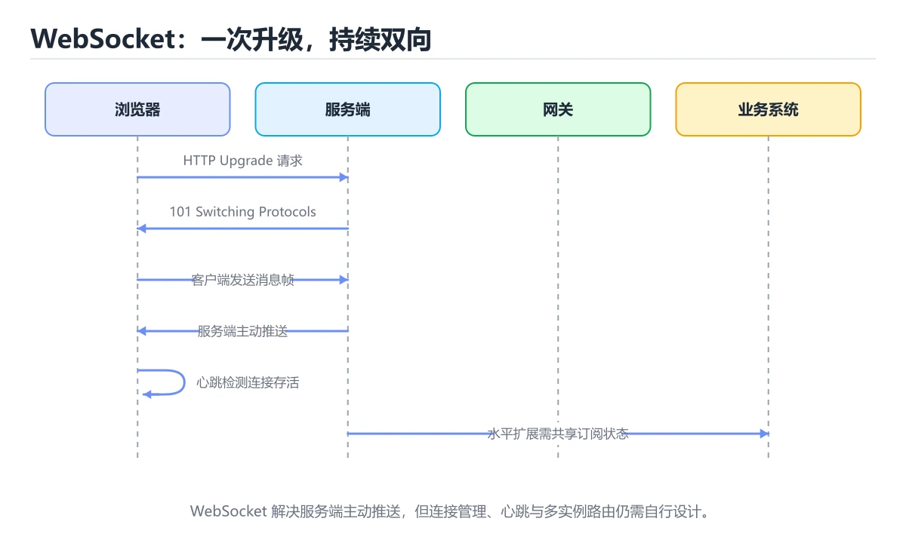
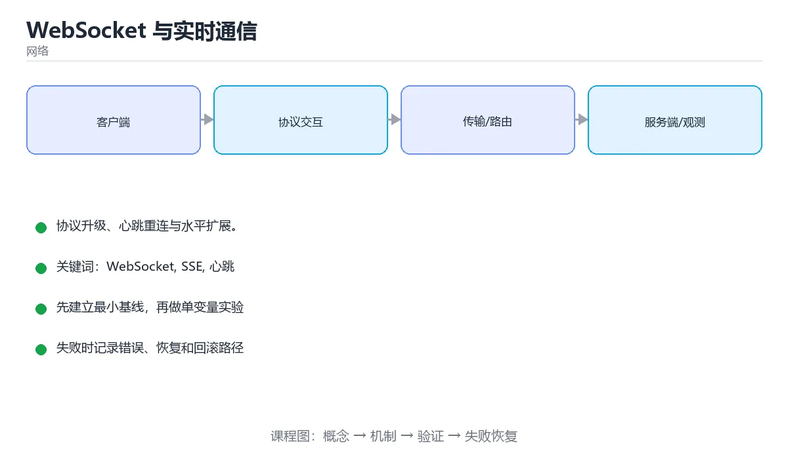

# WebSocket 与实时通信





> 内容更新时间：2026-10-03 · 学习阶段：高级 · 预计用时：15 分钟

## 学习目标

- 能用自己的话解释WebSocket 与实时通信解决了什么问题，而不是只背术语。
- 能说清 「WebSocket」、「SSE」、「心跳」、「重连」 之间的关系，并分别举出一个例子。
- 能把本课知识放回「网络」的知识体系，说明它和相邻主题的边界。
- 能完成本课练习，并用验收标准检查自己的结果。

> 一句话摘要：协议升级、心跳重连与水平扩展。

## 前置知识

- 先完成上一课《CDN、代理与缓存》；如果已经掌握，可以直接用本课练习自测。
- 开始前先复习：WebSocket、SSE、心跳。
- 如果某一步看不懂，先记录具体卡点，完成练习后再回头读一遍。

## 为什么需要 WebSocket

HTTP 是请求-响应模式，服务器无法主动推送。轮询（不停发请求）浪费资源，长轮询（挂起请求）实现复杂。WebSocket 通过一次 HTTP 握手升级协议，之后在**同一条 TCP 连接**上双向通信。

```text
客户端 GET /chat HTTP/1.1
       Upgrade: websocket
       Connection: Upgrade
       Sec-WebSocket-Key: dGhlIHNhbXBsZSBub25jZQ==

服务器 HTTP/1.1 101 Switching Protocols
       Upgrade: websocket
       Connection: Upgrade
       Sec-WebSocket-Accept: ...
```

## 与 HTTP、SSE 的对比

| 方式 | 方向 | 延迟 | 适用 |
| --- | --- | --- | --- |
| HTTP 轮询 | 客户端拉 | 高 | 低频状态检查 |
| 长轮询 | 半推送 | 中 | 兼容性要求极高的场景 |
| SSE | 服务器单向推 | 低 | 通知、日志流、AI 流式输出 |
| WebSocket | 双向 | 最低 | 聊天、协作、游戏、行情 |

## 前端使用

```javascript
const ws = new WebSocket('wss://example.com/chat');
ws.onopen = () => ws.send(JSON.stringify({ type: 'join', room: '42' }));
ws.onmessage = event => {
  const message = JSON.parse(event.data);
  console.log('收到', message);
};
ws.onerror = error => console.error('连接异常', error);
ws.onclose = event => {
  console.warn('连接关闭', event.code, event.reason);
  setTimeout(connect, Math.min(30000, 1000 * 2 ** retries++));   // 指数退避重连
};
```

前端必须实现：**心跳、重连、消息去重与顺序处理**。断线后要能补齐漏掉的消息（用序号或游标）。

## 服务端要点

```python
# FastAPI 示例
from fastapi import FastAPI, WebSocket, WebSocketDisconnect

app = FastAPI()
rooms: dict[str, set[WebSocket]] = {}

@app.websocket("/chat/{room}")
async def chat(websocket: WebSocket, room: str):
    await websocket.accept()
    rooms.setdefault(room, set()).add(websocket)
    try:
        while True:
            text = await websocket.receive_text()      # 心跳也在这里处理
            for client in rooms[room]:
                if client is not websocket:
                    await client.send_text(text)       # 广播
    except WebSocketDisconnect:
        rooms[room].discard(websocket)
```

生产环境还要考虑：

1. **水平扩展**：多实例之间用 Redis Pub/Sub、NATS 或 Kafka 转发消息。
2. **连接数**：单机连接数受文件描述符与内存限制，需要容量规划与压测。
3. **背压**：慢客户端会拖垮服务，应限制发送队列并在超限时断开。
4. **鉴权**：握手阶段校验 Token，避免连接后长时间占用资源。
5. **心跳与超时**：定期 ping/pong，清理半开连接。

## 常见问题

| 现象 | 原因与对策 |
| --- | --- |
| 连接频繁断开 | 中间代理超时，需心跳或调整 idle timeout |
| 消息丢失 | 未做确认与重发，应加序号 + ACK 或改用可靠消息队列 |
| 消息乱序 | 多路并发发送，需服务端统一排序并带序号 |
| 内存持续增长 | 连接未清理或发送队列堆积，检查断连处理与背压 |

## 本课小结
WebSocket 只提供「双向管道」，可靠性要靠自己补齐：**心跳、重连、序号、ACK、背压与鉴权**。需要更高实时性或音视频时再考虑 WebRTC。

## 协议选型速查

| 方案 | 方向 | 底层 | 适用 |
| --- | --- | --- | --- |
| 轮询 | 客户端拉 | HTTP | 更新频率低、实现最简 |
| 长轮询 | 客户端拉（挂起） | HTTP | 兼容性要求高 |
| SSE | 服务器推 | HTTP | 单向推送（通知、进度） |
| WebSocket | 双向 | HTTP 升级后 TCP | 聊天、协作、游戏 |
| WebRTC | 双向（音视频与数据） | UDP | 实时音视频、P2P |
| gRPC 流 | 双向 | HTTP/2 | 服务间流式通信 |

## WebSocket 生命周期速查

| 阶段 | 说明 |
| --- | --- |
| 握手 | 一次带 `Upgrade: websocket` 的 HTTP 请求 |
| 建立 | 服务端返回 101 Switching Protocols |
| 数据帧 | 文本帧、二进制帧、控制帧（ping、pong、close） |
| 保活 | 客户端或服务端定期发送 ping，收到 pong 确认存活 |
| 关闭 | 一方发 close 帧，另一方回应后关闭 TCP |

```javascript
// 带心跳、指数退避重连与消息队列的客户端封装
class ReconnectingSocket {
  constructor(url, { maxDelay = 30000, pingInterval = 25000 } = {}) {
    this.url = url;
    this.maxDelay = maxDelay;
    this.pingInterval = pingInterval;
    this.attempt = 0;
    this.queue = [];
    this.connect();
  }

  connect() {
    this.ws = new WebSocket(this.url);

    this.ws.onopen = () => {
      this.attempt = 0;
      this.flushQueue();
      this.startHeartbeat();
    };

    this.ws.onmessage = (event) => {
      if (event.data === "pong") return;      // 心跳响应，不交给业务
      this.onMessage?.(event.data);
    };

    this.ws.onclose = () => {
      this.stopHeartbeat();
      this.scheduleReconnect();
    };

    this.ws.onerror = () => this.ws.close();
  }

  startHeartbeat() {
    this.stopHeartbeat();
    this.timer = setInterval(() => this.send("ping"), this.pingInterval);
  }

  stopHeartbeat() {
    if (this.timer) clearInterval(this.timer);
  }

  scheduleReconnect() {
    const delay = Math.min(this.maxDelay, 1000 * 2 ** this.attempt++);
    const jitter = Math.random() * 0.3 * delay;   // 抖动避免同时重连
    setTimeout(() => this.connect(), delay + jitter);
  }

  send(payload) {
    if (this.ws?.readyState === WebSocket.OPEN) {
      this.ws.send(typeof payload === "string" ? payload : JSON.stringify(payload));
    } else {
      this.queue.push(payload);                   // 断线期间先入队
    }
  }

  flushQueue() {
    const pending = this.queue.splice(0);
    pending.forEach((item) => this.send(item));
  }
}
```

## 多实例部署速查

| 问题 | 方案 |
| --- | --- |
| 连接落在不同实例 | 用 Redis 发布订阅或消息队列广播 |
| 会话状态 | 存入共享存储（Redis），不放在单机内存 |
| 负载均衡 | 需要会话粘性时用一致性哈希或 `ip_hash` |
| 连接数上限 | 按内存与文件描述符调优，控制单机连接数 |
| 消息顺序 | 同一会话串行处理，避免并发写同一连接 |
| 广播风暴 | 分级主题订阅，避免全量广播 |
| 断线补偿 | 客户端带 `last_event_id` 拉取缺失消息 |

## 常见错误对照表

| 容易踩的做法 | 实际现象 | 原因与正确做法 |
| --- | --- | --- |
| 不做心跳 | 半开连接长期占用 | 定期 ping/pong 并设置超时断开 |
| 重连不做退避 | 服务端被重连风暴打垮 | 指数退避 + 随机抖动 |
| 只靠 WebSocket 无兜底 | 代理阻断时完全不可用 | 提供轮询或 SSE 降级 |
| 把状态放单机内存 | 扩容后消息丢失 | 状态外置到共享存储 |
| 不做鉴权 | 任何人可连 | 握手时校验令牌并绑定用户 |
| 不限制消息大小 | 大消息打爆内存 | 限制帧大小与频率 |
| 忽略代理超时 | 连接被中间设备断开 | 心跳间隔小于空闲超时 |
| 不处理 `onclose` 清理 | 定时器与监听泄漏 | 关闭时释放资源 |
| 假设消息一定有序到达 | 逻辑错乱 | 用序号与时间戳校验，必要时重排 |
| 无消息持久化 | 断线期间消息丢失 | 离线消息落库并支持拉取 |

## 自测清单

- [ ] 能按方向与延迟要求选对推送方案。
- [ ] 客户端实现心跳、退避重连与消息队列。
- [ ] 握手阶段完成鉴权与用户绑定。
- [ ] 多实例部署用共享存储或消息广播同步。
- [ ] 有断线补偿机制（离线消息或事件重放）。

## 动手练习

> 本课练习重点：围绕「WebSocket、SSE、心跳」完成复述、实验和交付，每个结果都要能被别人检查。

先抓一次真实请求或画出协议交互，再注入延迟或丢包，最后解释每层变化。

### 练习 1：建立心智模型（10 分钟）

合上教程，用 3～5 句话回答：

1. WebSocket 与实时通信解决了什么问题？
2. 如果没有它，会出现什么具体后果？
3. 它和「SSE」是什么关系？

**验收标准**：至少出现一个本课关键词，并写出一个反例、边界条件或失效场景。

### 练习 2：做一次可控实验（20 分钟）

从正文中选一个最小示例，完成以下操作：

1. 先预测修改一个参数、输入或步骤后的结果。
2. 再实际执行或逐步推演，记录真实结果。
3. 如果结果与预测不同，写出差异原因。

**验收标准**：留下「原例 → 改动 → 预测 → 结果 → 原因」五步记录。

### 练习 3：交付一个小结果（30 分钟）

画出一张报文或时序图，标出每一跳的地址、协议、状态和可能失败点。

任务要求：

- 结果必须能被别人检查，不能只写“我已经理解了”。
- 至少覆盖「WebSocket」和「SSE」两个关键词。
- 写出 1 个仍然不确定的问题，以及下一步如何验证。

> 提示：时间有限时优先做练习 1 和练习 2；练习 3 可以拆成两次完成。

## 可运行练习

### 任务 1：先跑通，再解释

```javascript
const ws = new WebSocket('wss://example.com/chat');
ws.onopen = () => ws.send(JSON.stringify({ type: 'join', room: '42' }));
ws.onmessage = event => {
  const message = JSON.parse(event.data);
  console.log('收到', message);
};
ws.onerror = error => console.error('连接异常', error);
ws.onclose = event => {
  console.warn('连接关闭', event.code, event.reason);
  setTimeout(connect, Math.min(30000, 1000 * 2 ** retries++));   // 指数退避重连
};
```

### 任务 2：只改一个条件

### 任务 3：迁移到自己的数据

用同一套思路处理一组你自己的数据或场景，保持输出格式与任务 1 一致。

## 故障现场

### 现场 1：本课的 WebSocket 常规用例通过，但边界用例失败

**症状**：在本课的练习或生产场景里出现“本课的 WebSocket 常规用例通过，但边界用例失败”。

**复现**：准备一组最小输入，只保留触发“本课的 WebSocket 常规用例通过，但边界用例失败”的必要条件，连续运行两次确认结果稳定。

**定位**：围绕“WebSocket 的前置条件与取值边界没有写进代码，默认值掩盖了空值和极值”检查调用链、输入数据和环境配置，先验证假设再改代码。

**预防**：把“本课的 WebSocket 常规用例通过，但边界用例失败”写成一条自动化用例，并在本课的验收清单里保留对应检查项。

### 现场 2：本课的 SSE 结果在两次运行之间不一致

**症状**：在本课的练习或生产场景里出现“本课的 SSE 结果在两次运行之间不一致”。

**复现**：准备一组最小输入，只保留触发“本课的 SSE 结果在两次运行之间不一致”的必要条件，连续运行两次确认结果稳定。

**定位**：围绕“SSE 依赖了当前版本、执行顺序或共享状态，单次运行无法暴露差异”检查调用链、输入数据和环境配置，先验证假设再改代码。

**预防**：把“本课的 SSE 结果在两次运行之间不一致”写成一条自动化用例，并在本课的验收清单里保留对应检查项。

### 现场 3：请求偶发超时，但服务端监控看起来正常

**症状**：在本课的练习或生产场景里出现“请求偶发超时，但服务端监控看起来正常”。

## 深入补充：WebSocket 与实时通信 的取舍与边界

### 一、把概念放回真实约束

学习WebSocket 与实时通信时，最容易只记住结论而忽略前提。先写出三个约束：数据规模、时间预算、可接受的失败方式；再判断 WebSocket 与 SSE 在这些约束下是否仍然成立。只要约束改变，原来的最优解就可能变成错误解。

| 场景 | 协议或方案 | 延迟与可靠性 | 排障入口 |
| --- | --- | --- | --- |
| 强一致请求 | TCP / HTTP | 可靠但可能队头阻塞 | 连接与重传指标 |
| 实时音视频 | UDP / QUIC | 低延迟但允许丢包 | 抖动与丢包率 |
| 大规模分发 | CDN 与缓存 | 就近命中 | 命中率与回源 |
| 服务间调用 | RPC 或消息队列 | 取决于确认机制 | 超时、重试与幂等 |

### 二、三个容易混淆的边界

2. **把“平均值”当成“全部”**：WebSocket 的指标好看，不代表尾部请求、冷启动或失败重试也好看。
3. **把“当前版本”当成“永久行为”**：SSE 依赖的默认值、API 或性能特征都可能随版本变化，需要固定版本并保留回归用例。

### 三、一个生产场景

假设团队要在真实系统里使用WebSocket 与实时通信：第一周先做小流量验证，记录 WebSocket 的基线与异常；第二周扩大输入规模，观察 SSE 是否成为瓶颈；第三周再做故障演练，主动注入超时、重复请求和依赖不可用，确认系统能降级、能重试、能恢复。每一步都要留下指标、日志和结论，而不是只留下“感觉更快了”。

### 四、自测清单

- 能否用一句话说出WebSocket 与实时通信解决的核心问题与不适用场景？
- 能否画出 WebSocket 的数据流或状态变化，并标出失败路径？
- 能否给出一个反例，证明某个看似合理的结论在边界条件下不成立？
- 能否写出一条可复现的验证命令，让别人独立得到相同结论？

## 本课复习清单

离开本课前，逐项确认：

- [ ] 不看解析，能说出「WebSocket 与 HTTP 的关键区别是？」的判断依据。
- [ ] 不看解析，能说出「WebSocket 断线后必须实现？」的判断依据。
- [ ] 不看解析，能说出「多实例部署时消息如何跨节点广播？」的判断依据。
- [ ] 不看解析，能说出「WebSocket 建立连接的握手阶段使用什么协议？」的判断依据。
- [ ] 不看解析，能说出的判断依据。
- [ ] 至少运行一次本课示例，记录输入、输出和一个边界情况。
- [ ] 把本课最容易混淆的两个概念写成一句话对照。

| 复盘项 | 记录 |
| --- | --- |
| 已经能独立解释的考点 |  |
| 仍然说不清的概念 |  |
| 下一步验证动作 |  |

## 术语速查

| 术语 | 本课语境 |
| --- | --- |
| `Upgrade: websocket` | \| 握手 \| 一次带 `Upgrade: websocket` 的 HTTP 请求 \| |
| `ip_hash` | \| 负载均衡 \| 需要会话粘性时用一致性哈希或 `ip_hash` \| |
| `last_event_id` | \| 断线补偿 \| 客户端带 `last_event_id` 拉取缺失消息 \| |
| `onclose` | \| 不处理 `onclose` 清理 \| 定时器与监听泄漏 \| 关闭时释放资源 \| |

## 考点精讲

### 考点 1：WebSocket 与 HTTP 的关键区别是？

- **判断依据**：在「WebSocket 与实时通信」里，一次握手后在同一条连接上双向通信。HTTP 是请求-响应，WebSocket 支持服务端主动推送。回到「WebSocket 与实时通信」的正文示例，用“WebSocket 与 HTTP 的”走一遍WebSocket、SSE、心跳的完整流程，能复现的结论才可以保留。

### 考点 2：WebSocket 断线后必须实现？

- **判断依据**：长连接会因网络与代理超时断开，客户端要能自愈并补齐消息。在「WebSocket 与实时通信」里，其他选项：断线后要实现心跳、指数退避重连与消息序号补齐。这道题的关键在「WebSocket 与实时通信」的WebSocket、SSE、心跳：先确认题干“WebSocket 断线后必须实现”问的是哪一步，再排除偷换前提的选项。

### 考点 3：围绕“WebSocket 与实时通信”中的 WebSocket、SSE、心跳，下列哪两项是本课强调的实践判断？

- **判断依据**：本课把WebSocket 与实时通信拆成概念、示例与故障现场三部分，因此判断 WebSocket 时必须同时交代输入、输出和失败路径，这使“学习 WebSocket 时要同时说明输入、输出和失败路径，不能只看正常流程”成立。在WebSocket 与实时通信里，判断 SSE 时要固定版本与边界输入，所以“验证 SSE 时要固定版本并覆盖边界输入，结论才可复现”才可复现。

### 考点 4：下面这段 JavaScript 代码摘自「WebSocket 与实时通信」的正文示例。关于这段代码，下面哪一项说法与实际内容相符？

- **判断依据**：在「WebSocket 与实时通信」里，这段代码把主要逻辑封装在函数或方法里，需要被调用才会执行。这段代码出自「WebSocket 与实时通信」的正文示例，围绕WebSocket、SSE、心跳展开；把输入或边界换成空值、极值或失败情况后，结论要以「WebSocket 与实时通信」的实际运行结果为准。

### 考点 5：SSE（Server-Sent Events）与 WebSocket 的主要区别是？

- **判断依据**：只需要服务器推送（如通知、进度）时 SSE 更简单，且能自动重连。在「WebSocket 与实时通信」里，其他选项：SSE 是服务器到客户端的单向文本流（基于 HTTP），WebSocket 是全双工，两者并不等价。“SSE（Server-Sent”与「WebSocket 与实时通信」的术语表相呼应，只有符合WebSocket、SSE、心跳约束的“SSE 是服务器到客户端的单向文本流（基”才是正文支持的结论。

### 考点 6：补全代码：「WebSocket 与实时通信」示例中，下面这行代码缺少哪个关键字或函数名？请填入 ____。

`this.ws = new ____(this.url);`

- **判断依据**：在「WebSocket 与实时通信」里，WebSocket。回到「WebSocket 与实时通信」的正文示例，用“补全代码”走一遍WebSocket、SSE、心跳的完整流程，能复现的结论才可以保留。回到「WebSocket 与实时通信」的正文示例，用“WebSocket”走一遍WebSocket、SSE、心跳的完整流程，能复现的结论才可以保留。

## English Overview

**Title:** WebSocket & Realtime

**Summary:** Upgrade, heartbeats, reconnects and scaling.

**Category:** Networking
**Level:** 高级
**Key terms:** WebSocket, SSE, 心跳, 重连, 实时通信

## 内容元数据

- 内容版本：v2.0
- 最后更新：2026-10-03
- 学习阶段：高级
- 适用环境：TCP/IP、HTTP/2、HTTP/3 与现代网络栈
- 内容来源：内置结构化课程与工程实践整理
- 相关主题：WebSocket、SSE、心跳、重连、实时通信
- 质量版本：P0 测验标准 + P1 覆盖扩展 + P2 体验补全

## 参考资料与复核

- 最后复核：2026-10-04
- 下次复核：2027-04-04
- 复核范围：版本兼容、API 行为、安全建议与工程实践
- 来源性质：官方文档、标准或权威教材；正文为离线教学重组

| 参考资料 | 本课用途 |
| --- | --- |
| [IANA 协议注册表](https://www.iana.org/protocols) | 端口、协议号与参数 |
| [MDN HTTP](https://developer.mozilla.org/docs/Web/HTTP) | 浏览器视角的 HTTP |
| [RFC 9113 HTTP/2](https://www.rfc-editor.org/rfc/rfc9113) | HTTP/2 多路复用与流 |

> 「WebSocket 与实时通信」的链接用于离线阅读后的延伸核对；App 不会自动联网。
