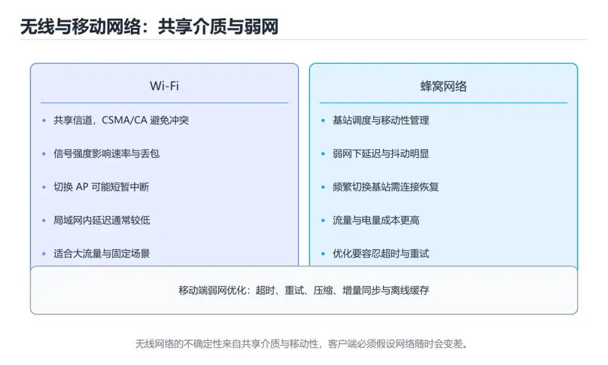
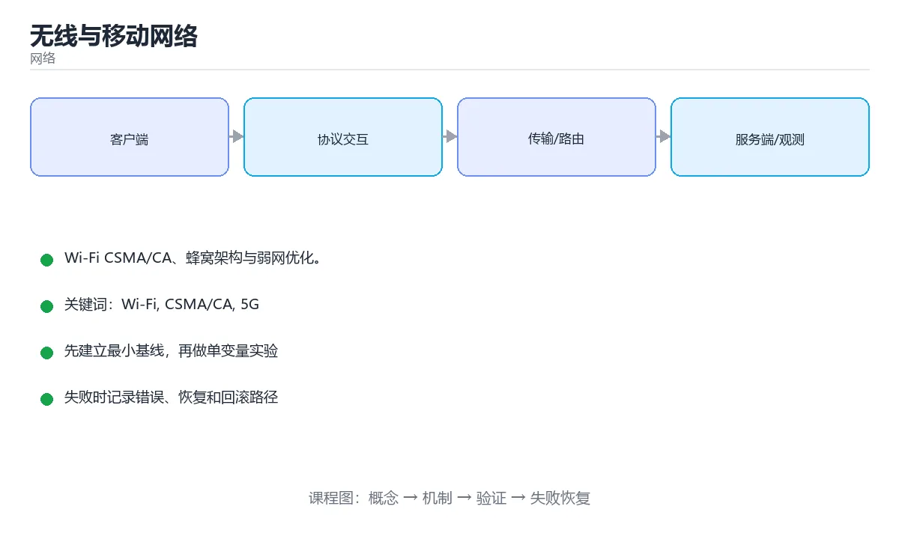

# 无线与移动网络

> 内容更新时间：2026-10-06 · 学习阶段：进阶 · 预计用时：50 分钟





## 本节知识框架

**课程定位**：所属分类 `network`（网络），课程主题 `无线与移动网络`，学习阶段 进阶，建议用时 45 分钟。

本课主线：Wi-Fi CSMA/CA、蜂窝架构与弱网优化。

**学完本课应当能够**
- 说清 `Wi-Fi` 与 `漫游` 的含义与区别，并各举一个正例和一个反例。
- 用本课示例验证 `弱网` 的行为，记录输入、输出与失败条件。
- 遇到「把无线丢包都归因于拥塞」这类问题时，能说出触发条件与修复顺序。

### 从概念到验证的学习链条

1. `Wi-Fi`：先掌握 Wi-Fi 用共享介质，无法像以太网那样「边发边听」，因此采用 CSMA/CA（冲突避免）：先监听、随机退避、发送前用 RTS/CTS 预约信道，收到 ACK 才算成功，再用它解释 `漫游` 为什么会出现。
2. `漫游`：先掌握 无线客户端在不同接入点之间移动时保持会话或快速重新建立连接，再用它解释 `弱网` 为什么会出现。
3. `弱网`：先掌握 弱网：高丢包、抖动与带宽波动，需要自适应码率、前向纠错（FEC）、重传与拥塞控制调整，再用它解释 `无线与移动网络` 为什么会出现。
4. `无线与移动网络`：先掌握 无线与移动网络使用共享介质传输数据，必须处理信号衰减、干扰、切换和移动性，再用它解释 本课示例的观察结果 为什么会出现。

**先修与衔接**：本课是「网络」分类的第 11 课。先修内容：《链路层：以太网、ARP 与交换机》。《链路层：以太网、ARP 与交换机》里的 `arp -a`、`链路层` 是本课的前提。相关或后续课程：《网络攻击与防护》。

### 完成判据

- **定义关**：不看正文也能说明 `Wi-Fi` 是 Wi-Fi 用共享介质，无法像以太网那样「边发边听」，因此采用 CSMA/CA（冲突避免）：先监听、随机退避、发送前用 RTS/CTS 预约信道，收到 ACK 才算成功，并指出一个反例。
- **机制关**：能按“输入 → 转换 → 输出 → 验证”复述 `无线与移动网络`，而不是只背结论。
- **示例关**：能运行或推演 `无线与移动网络` 的 `text` 示例，并说明一个真实出现的标识符或字面量。
- **证据关**：能指出 `无线与移动网络` 示例里的 调用了 `channel_recommendation()`，并说明它支持或反驳了本课的哪一条结论。
- **排错关**：能复现 把无线丢包都归因于拥塞，记录现象并按 同时检查信号质量、重传和干扰 修复。
- **迁移关**：能把 `Wi-Fi`、`CSMA/CA`、`5G`、`漫游` 放进一个与 `无线与移动网络` 不同的项目场景，并保持输入与验证条件可追踪。
- **复盘关**：学完 `无线与移动网络` 后，用一句话写下仍然不确定的结论，并列出下一次验证需要的输入、环境和成功判据。

### 复习清单

- [ ] 能不看正文复述本课核心术语，并指出一个边界或反例。
- [ ] 能运行或推演本课示例，记录输入、输出与失败现象。
- [ ] 能完成一次自测，并把错题对照错误表定位原因。

## 核心概念定义

| 术语 | 操作性定义 | 常见边界与风险 |
| --- | --- | --- |
| Wi-Fi | Wi-Fi 用共享介质，无法像以太网那样「边发边听」，因此采用 CSMA/CA（冲突避免）：先监听、随机退避、发送前用 RTS/CTS 预约信道，收到 ACK 才算成功。 | 易错：用户流量被大量消耗；正确做法是提供「仅 Wi-Fi 下载」选项。 |
| 漫游 | 无线客户端在不同接入点之间移动时保持会话或快速重新建立连接。 | 易错：走动时视频中断；正确做法是部署 802.11r/k/v 并统一 SSID 与加密。 |
| 弱网 | 弱网：高丢包、抖动与带宽波动，需要自适应码率、前向纠错（FEC）、重传与拥塞控制调整。 | 易错：大量请求失败；正确做法是提高超时容忍、支持重试与断点续传。 |
| 无线与移动网络 | 无线与移动网络使用共享介质传输数据，必须处理信号衰减、干扰、切换和移动性。 | 共享状态与调度顺序会改变结论，单线程或串行测试通过不等于并发下成立。 |
| SSID / BSSID | 网络名 / AP 的 MAC 标识 | 网络延迟、超时与版本协商会改变行为，只在真实链路或多版本客户端上验证才算数。 |
| 漫游 | 在多 AP 间切换并保持连接，需 802.11r/k/v 支持 | 易错：走动时视频中断；正确做法是部署 802.11r/k/v 并统一 SSID 与加密。 |
| MIMO / MU-MIMO | 多天线并行，后者支持多用户同时传输 | 只在「多天线并行，后者支持多用户同时传输」这一前提下成立，换输入或换环境要重新验证。 |
| OFDMA | 把信道切成子载波分配给多用户（Wi-Fi 6 起） | 只在「把信道切成子载波分配给多用户（Wi-Fi 6 起）」这一前提下成立，换输入或换环境要重新验证。 |
| SSID / BSSID | 网络名 / 接入点 MAC | 网络延迟、超时与版本协商会改变行为，只在真实链路或多版本客户端上验证才算数。 |
| 频段 | 2.4GHz 穿墙好干扰多；5GHz 速率高覆盖差；6GHz 干扰少 | 易错：远端设备频繁掉线；正确做法是远距离用 2.4G，近处用 5G。 |
| 信道 | 2.4GHz 常用 1、6、11 互不重叠 | 易错：邻居干扰严重；正确做法是只选 1、6、11。 |
| CSMA/CA | 先听后发 + 随机退避，避免冲突 | 只在「先听后发 + 随机退避，避免冲突」这一前提下成立，换输入或换环境要重新验证。 |
| RTS/CTS | 解决隐藏节点问题 | 只在「解决隐藏节点问题」这一前提下成立，换输入或换环境要重新验证。 |
| 漫游 | 客户端在 AP 间切换，需 802.11r/k/v 支持 | 易错：走动时视频中断；正确做法是部署 802.11r/k/v 并统一 SSID 与加密。 |
| 认证 | WPA2/WPA3 个人版（PSK）与企业版（802.1X） | 只在「WPA2/WPA3 个人版（PSK）与企业版（802.1X）」这一前提下成立，换输入或换环境要重新验证。 |

## 原理与运行机制

### 机制总览

**教材衔接：Wi-Fi（802.11）基础**

Wi-Fi 用共享介质，无法像以太网那样「边发边听」，因此采用 **CSMA/CA**（冲突避免）：先监听、随机退避、发送前用 RTS/CTS 预约信道，收到 ACK 才算成功。

频段：2.4 GHz 穿墙强但信道少、干扰大；5 GHz 速率高但穿墙弱；6 GHz（Wi-Fi 6E/7）更干净。信道宽度越大速率越高，但可用信道更少、干扰更重。

**教材衔接：移动性带来的问题**

1. **切换**：跨基站时 IP 可能变化，需要隧道或锚点保持会话（移动 IP、5G 会话连续性）。
2. **弱网**：高丢包、抖动与带宽波动，需要自适应码率、前向纠错（FEC）、重传与拥塞控制调整。
3. **功耗**：无线模块是耗电大户，移动端要减少心跳频率、合并请求、用推送替代轮询。

**失败路径（来自本课错误表）**
- 把无线丢包都归因于拥塞 → 优化方向错误 → 同时检查信号质量、重传和干扰。
- 只看标称速率 → 实际吞吐远低于预期 → 测量真实吞吐和延迟分布。
- 忽略切换开销 → 移动过程中连接中断 → 为实时业务增加重连和缓冲策略。
- 在开放网络明文传输 → 数据被窃听或篡改 → 使用 TLS、VPN 和证书校验。
### 机制拆解：每一步的输入、动作与输出

#### 1. `Wi-Fi`
- 输入：`Wi-Fi`；本步把 Wi-Fi 用共享介质，无法像以太网那样「边发边听」，因此采用 CSMA/CA（冲突避免）：先监听、随机退避、发送前用 RTS/CTS 预约信道，收到 ACK 才算成功 当作判断规则。
- 动作：围绕 `Wi-Fi` 保留中间状态，并记录它与 `漫游` 的对应关系。
- 输出：`漫游`，它可以被下一段代码、测试或记录继续使用。
- `Wi-Fi` 的失败条件：当不区分计费网络时，会出现用户流量被大量消耗。

#### 2. `漫游`
- 输入：`Wi-Fi`；本步把 无线客户端在不同接入点之间移动时保持会话或快速重新建立连接 当作判断规则。
- 动作：围绕 `漫游` 保留中间状态，并记录它与 `弱网` 的对应关系。
- 输出：`弱网`，它可以被下一段代码、测试或记录继续使用。
- `漫游` 的失败条件：当忽略漫游配置时，会出现走动时视频中断。

#### 3. `弱网`
- 输入：`漫游`；本步把 弱网：高丢包、抖动与带宽波动，需要自适应码率、前向纠错（FEC）、重传与拥塞控制调整 当作判断规则。
- 动作：围绕 `弱网` 保留中间状态，并记录它与 `无线与移动网络` 的对应关系。
- 输出：`无线与移动网络`，它可以被下一段代码、测试或记录继续使用。
- `弱网` 的失败条件：当弱网下用固定超时时，会出现大量请求失败。

#### 4. `无线与移动网络`
- 输入：`弱网`；本步把 无线与移动网络使用共享介质传输数据，必须处理信号衰减、干扰、切换和移动性 当作判断规则。
- 动作：围绕 `无线与移动网络` 保留中间状态，并记录它与 `channel_recommendation` 的对应关系。
- 输出：`channel_recommendation`，它可以被下一段代码、测试或记录继续使用。
- `无线与移动网络` 的失败条件：共享状态与调度顺序会改变结论，单线程或串行测试通过不等于并发下成立。

### 示例中的可观察事实

1. 调用了 `channel_recommendation()`；它对应的课程主题是 `无线与移动网络`。
2. 调用了 `min()`；它对应的课程主题是 `无线与移动网络`。
3. 调用了 `get()`；它对应的课程主题是 `无线与移动网络`。
4. 调用了 `ValueError()`；它对应的课程主题是 `无线与移动网络`。
5. 调用了 `print()`；它对应的课程主题是 `无线与移动网络`。
6. 出现字面量 `2.4G`；它对应的课程主题是 `无线与移动网络`。
7. 出现字面量 `band`；它对应的课程主题是 `无线与移动网络`。
8. 出现字面量 `recommended`；它对应的课程主题是 `无线与移动网络`。

### 复现实验记录

- 环境：`无线与移动网络` 使用 `text` 示例，固定 `Wi-Fi`、`CSMA/CA`、`5G`、`漫游` 作为第一组条件。
- 首轮输入：先确认 调用了 `channel_recommendation()`，预测 `Wi-Fi` 会怎样变化。
- 基线观察：记录命令、输入、输出和错误原文，不用截图代替可复制的文本。
- 单变量修改：只改变 `Wi-Fi`，观察 `无线与移动网络` 是否仍满足定义。
- 失败注入：复现 把无线丢包都归因于拥塞，确认现象是 优化方向错误。
- 记录结论：把“修改前、修改后、预期变化、实际变化”写成四列表，这样复盘 `无线与移动网络` 时才能区分概念错误与实现错误。

## 典型应用场景

- **把无线丢包都归因于拥塞**：典型现象是优化方向错误；正确做法是同时检查信号质量、重传和干扰。
- **只看标称速率**：典型现象是实际吞吐远低于预期；正确做法是测量真实吞吐和延迟分布。
- **忽略切换开销**：典型现象是移动过程中连接中断；正确做法是为实时业务增加重连和缓冲策略。
- **在开放网络明文传输**：典型现象是数据被窃听或篡改；正确做法是使用 TLS、VPN 和证书校验。

### 最小验证场景

- 准备：保留 `text` 示例的原始输入，先记录 `无线与移动网络` 的基线输出和完整运行命令。
- 观察：先核对 调用了 `channel_recommendation()`，再改变一个与 `Wi-Fi` 相关的条件。
- 判定：新结果与 `无线与移动网络` 的基线不同不等于错误；只有当差异破坏了 `Wi-Fi` 的定义或错误表中的约束，才判定为失败。

### 选择与边界

- 使用 `Wi-Fi` 时，先满足它的定义：Wi-Fi 用共享介质，无法像以太网那样「边发边听」，因此采用 CSMA/CA（冲突避免）：先监听、随机退避、发送前用 RTS/CTS 预约信道，收到 ACK 才算成功；易错：用户流量被大量消耗；正确做法是提供「仅 Wi-Fi 下载」选项。
- 使用 `漫游` 时，先满足它的定义：无线客户端在不同接入点之间移动时保持会话或快速重新建立连接；易错：走动时视频中断；正确做法是部署 802.11r/k/v 并统一 SSID 与加密。
- 使用 `弱网` 时，先满足它的定义：弱网：高丢包、抖动与带宽波动，需要自适应码率、前向纠错（FEC）、重传与拥塞控制调整；易错：大量请求失败；正确做法是提高超时容忍、支持重试与断点续传。
- 使用 `无线与移动网络` 时，先满足它的定义：无线与移动网络使用共享介质传输数据，必须处理信号衰减、干扰、切换和移动性；共享状态与调度顺序会改变结论，单线程或串行测试通过不等于并发下成立。

## 代码/协议/SQL 示例

### 最小可验证示例

```text
手机 → 基站（gNB/eNB）→ 接入网 → 核心网（会话管理、用户面）→ 互联网
```

**教材衔接：蜂窝网络**

```text
手机 → 基站（gNB/eNB）→ 接入网 → 核心网（会话管理、用户面）→ 互联网
```

4G（LTE）与 5G 的核心差异：5G 采用服务化架构、网络切片（同一物理网划分多个逻辑网）、边缘计算（MEC，把计算下沉到基站侧降低延迟）。SIM/eSIM 负责身份认证与密钥。

**教材衔接：移动网络速查**

| 概念 | 说明 |
| --- | --- |
| 网络切片 | 在同一物理网络上划分不同 SLA 的逻辑网络 |
| 边缘计算（MEC） | 把算力下沉到基站侧，降低延迟 |
| 切换（Handover） | 移动中在基站间转移会话 |
| 弱网特征 | 高延迟、高抖动、丢包、频繁切换 |
| 优化方向 | 减少往返、加大超时容忍、使用 QUIC、支持断点续传 |

```python
def channel_recommendation(band: str, congestion: dict) -> dict:
    """按频段给出信道建议：2.4G 只推荐 1/6/11，5G 选最空闲信道。"""
    if band == "2.4G":
        candidates = [1, 6, 11]
        return {
            "band": band,
            "recommended": min(candidates, key=lambda c: congestion.get(c, 0)),
            "candidates": candidates,
            "reason": "2.4G 只有 1/6/11 互不重叠",
        }
    if band == "5G":
        best = min(congestion, key=lambda c: congestion[c])
        return {"band": band, "recommended": best, "reason": "选择占用最少的信道"}
    raise ValueError("仅支持 2.4G 与 5G")

print(channel_recommendation("2.4G", {1: 5, 6: 2, 11: 9}))
print(channel_recommendation("5G", {36: 1, 44: 8, 149: 3}))
```

**教材衔接：深入补充：无线与移动网络**

前面已经建立了基本概念。这一节换一个角度，把无线与移动网络放进真实工程里，
重点回答三件事：Wi-Fi 为什么存在、内部如何运转、什么时候会失效。

### 一、核心模型

无线与移动网络使用共享介质传输数据，必须处理信号衰减、干扰、切换和移动性；链路层的重传、速率自适应和网络层的移动管理共同维持连接。

```text
设备扫描/关联 → 认证与加密 → 分配地址 → 通过基站/AP 转发 → 信号变化触发速率或切换 → 重新建立路径
```

### 二、关键机制拆解

1. Wi-Fi 使用 CSMA/CA 避免冲突，发送前先监听，并通过确认和重传处理丢包。
2. 无线信号受距离、墙体、干扰和并发设备影响，实际速率远低于标称速率。
3. 移动网络通过蜂窝基站提供广覆盖，切换时要在新旧基站之间转移会话。
4. 无线链路的丢包不一定是拥塞，可能是信号弱或干扰，TCP 误判后减速会放大问题。
5. 移动 IP 和代理机制用于保持地址或会话连续性，但会增加延迟和路径复杂度。
6. 省电策略会周期性休眠，导致延迟抖动；实时应用需要权衡功耗和响应。
7. 安全性依赖 WPA、认证、加密和证书，开放网络必须叠加 VPN 或应用层加密。

### 三、对照表：抓住容易混淆的边界

| 维度 | 一侧 | 另一侧 |
| --- | --- | --- |
| 有线链路 | 介质稳定、冲突可控 | 延迟低但移动性差 |
| 无线链路 | 共享介质、信号波动 | 移动方便但丢包和干扰多 |
| Wi-Fi | 局域覆盖、成本低 | 切换和覆盖受 AP 影响 |
| 蜂窝网络 | 广覆盖、运营商管理 | 延迟和资费更复杂 |

### 四、工作示例

视频会议在 Wi-Fi 边缘区域频繁卡顿，抓包发现重传率高但带宽未跑满。原因是信号弱导致丢包，TCP 误判拥塞后降低发送速率。解决方式是改善覆盖或切换到更稳定的网络，而不是单纯增大带宽。

### 五、常见误区与失效边界

| 错误做法或假设 | 后果 | 正确做法 |
| --- | --- | --- |
| 把无线丢包都归因于拥塞 | 优化方向错误 | 同时检查信号质量、重传和干扰 |
| 只看标称速率 | 实际吞吐远低于预期 | 测量真实吞吐和延迟分布 |
| 忽略切换开销 | 移动过程中连接中断 | 为实时业务增加重连和缓冲策略 |
| 在开放网络明文传输 | 数据被窃听或篡改 | 使用 TLS、VPN 和证书校验 |

### 六、场景推演

移动 App 在电梯里断网后恢复，请求大量重试并造成服务端压力。客户端应使用指数退避、网络状态监听和请求幂等；服务端则限制重试频率并返回明确错误。

### 七、自测问答

**Q1：无线丢包为什么不能直接认为拥塞？**

信号弱、干扰和切换都会丢包，网络并未真正拥塞。

**Q2：CSMA/CA 解决什么问题？**

在共享介质上尽量避免多个设备同时发送造成冲突。

**Q3：移动切换的主要挑战是什么？**

在新旧基站之间保持会话、地址和低延迟。

**Q4：省电策略为什么影响延迟？**

设备周期性休眠会让消息无法立即被接收。

### 八、小项目：把知识变成可检查的产出

用手机在不同位置测试同一服务的延迟、丢包和重传率，记录信号强度与吞吐关系；再模拟一次切换或断网，验证客户端的退避、幂等和恢复逻辑。

### 九、适用边界

无线网络的知识解释链路波动和移动性，不替代应用层的重试、缓存和离线策略。移动应用必须假设网络随时会变差或中断。

### 十、完成检查清单

- [ ] 能解释 CSMA/CA 与确认重传
- [ ] 能区分信号问题和拥塞问题
- [ ] 能说明移动切换的代价
- [ ] 能为移动场景设计退避和幂等
- [ ] 能评估无线链路的真实吞吐

### 十一、复习顺序

1. 用自己的话说明 ValueError 的作用，再说出它不适用的情况。
2. 再对照表逐行解释容易混淆的概念，每个概念补一个反例。
3. 跟着工作示例做一遍，改变一个条件并预测结果。
4. 用自测问答检查理解，错题回到对应小节重新阅读。
5. 用 ValueError 做一个最小交付，附上运行命令与失败样例。

> 复习不是重读一遍，而是离开原文重新产出：复述、改写、验证、复盘。

**教材衔接：深挖「Wi-Fi」的边界与代价**

### 一、Wi-Fi 的关键句与适用条件

| 正文出处 | 原句 | 用之前先确认 |
| --- | --- | --- |
| Wi-Fi（802.11）基础 | Wi-Fi 用共享介质，无法像以太网那样「边发边听」，因此采用 CSMA/CA（冲突避免）：先监听、随机退避、发送前用 RTS/CTS 预约信道，收到 ACK 才算成功。 | 把 Wi-Fi 换成边界值时，这一步是否仍然成立 |
| Wi-Fi（802.11）基础 | 6 GHz（Wi-Fi 6E/7）更干净。 | 把 Wi-Fi 换成边界值时，这一步是否仍然成立 |
| 蜂窝网络 | G（LTE）与 5G 的核心差异：5G 采用服务化架构、网络切片（同一物理网划分多个逻辑网）、边缘计算（MEC，把计算下沉到基站侧降低延迟）。 | 把 5G 换成边界值时，这一步是否仍然成立 |
| 移动性带来的问题 | 切换：跨基站时 IP 可能变化，需要隧道或锚点保持会话（移动 IP、5G 会话连续性）。 | 把 5G 换成边界值时，这一步是否仍然成立 |
| 移动性带来的问题 | 弱网：高丢包、抖动与带宽波动，需要自适应码率、前向纠错（FEC）、重传与拥塞控制调整。 | 把 弱网 换成边界值时，这一步是否仍然成立 |

### 二、把 无线与移动网络 推到边界

下面是本课第一段代码（text），先原样运行一次作为基线：

```text
手机 → 基站（gNB/eNB）→ 接入网 → 核心网（会话管理、用户面）→ 互联网
```

| 变式 | 怎么改 | 先写下什么 | 观察点 |
| --- | --- | --- | --- |
| 边界输入 | 把 无线与移动网络 的输入换成空值或最大值 | 预测输出 | 是否报错、是否静默返回 |
| 只改一处 | 把 无线与移动网络 的一个参数改成另一档 | 预测差异来源 | 输出变化能否用本课结论解释 |
| 去掉一步 | 注释掉 无线与移动网络 之后的一行 | 预测哪一步先失败 | 错误位置是否与预期一致 |


### 四、测验复盘

| 题号 | 正确答案 | 最容易选错的干扰项 | 复盘动作 |
| --- | --- | --- | --- |
| 1 | 只改一个变量，记录边界与失败路径的变化 | 固定版本与证据，把“无线与移动网络”的结论写成可复现记录 | 把干扰项改写成一句反例，再说明它违反本课哪条前提 |
| 2 | 在同一物理网络上划分多个逻辑网络 | 把 SIM 卡分区 | 把干扰项改写成一句反例，再说明它违反本课哪条前提 |
| 3 | HTTP/3（QUIC） | HTTP/2 over TCP | 把干扰项改写成一句反例，再说明它违反本课哪条前提 |
| 4 | 这段代码把主要逻辑封装在函数或方法里，需要被调用才会执行。 | 这段代码包含循环结构，同一段逻辑会被重复执行。 | 把干扰项改写成一句反例，再说明它违反本课哪条前提 |
| 5 | 2.4G 穿墙好但干扰多，速率低 | 两者完全相同 | 把干扰项改写成一句反例，再说明它违反本课哪条前提 |
| 6 | Wi-Fi | 守卫 | 把干扰项改写成一句反例，再说明它违反本课哪条前提 |


### 示例精读：先找证据，再改一个条件

1. 调用了 `channel_recommendation()`；它出现在 `无线与移动网络` 的示例中，阅读时先确认它前后各发生了什么。
2. 调用了 `min()`；它出现在 `无线与移动网络` 的示例中，阅读时先确认它前后各发生了什么。
3. 调用了 `get()`；它出现在 `无线与移动网络` 的示例中，阅读时先确认它前后各发生了什么。
4. 调用了 `ValueError()`；它出现在 `无线与移动网络` 的示例中，阅读时先确认它前后各发生了什么。
5. 调用了 `print()`；它出现在 `无线与移动网络` 的示例中，阅读时先确认它前后各发生了什么。
6. 出现字面量 `2.4G`；它出现在 `无线与移动网络` 的示例中，阅读时先确认它前后各发生了什么。
7. 出现字面量 `band`；它出现在 `无线与移动网络` 的示例中，阅读时先确认它前后各发生了什么。
8. 出现字面量 `recommended`；它出现在 `无线与移动网络` 的示例中，阅读时先确认它前后各发生了什么。
- 在 `无线与移动网络` 中与 `Wi-Fi` 对照：示例必须能支持 Wi-Fi 用共享介质，无法像以太网那样「边发边听」，因此采用 CSMA/CA（冲突避免）：先监听、随机退避、发送前用 RTS/CTS 预约信道，收到 ACK 才算成功，否则说明这一段还缺少实现或验证步骤。
- 在 `无线与移动网络` 中与 `漫游` 对照：示例必须能支持 无线客户端在不同接入点之间移动时保持会话或快速重新建立连接，否则说明这一段还缺少实现或验证步骤。
- 在 `无线与移动网络` 中与 `弱网` 对照：示例必须能支持 弱网：高丢包、抖动与带宽波动，需要自适应码率、前向纠错（FEC）、重传与拥塞控制调整，否则说明这一段还缺少实现或验证步骤。
- 在 `无线与移动网络` 中与 `无线与移动网络` 对照：示例必须能支持 无线与移动网络使用共享介质传输数据，必须处理信号衰减、干扰、切换和移动性，否则说明这一段还缺少实现或验证步骤。

## 时间/空间复杂度或性能分析

**性能关注点（无线与移动网络）**：往返延迟与带宽是主要成本：记录 RTT、吞吐与重传率，区分局域网与真实链路。

**本课特有开销（无线与移动网络 · Wi-Fi）**：缓存命中率比缓存实现本身更关键，先记录命中率与失效策略再谈优化。

**测量方法**：以 `无线与移动网络` 的 `Wi-Fi` 场景为对象，固定输入跑一遍记录基线，再把规模或并发度提高一个数量级复测；两次结果的差值与波动范围才是结论依据。

### 需要控制的变量与记录项

- `无线与移动网络` 的 `Wi-Fi`：固定它的版本、输入范围和资源上限，分别记录速度、内存与失败率的变化。
- `无线与移动网络` 的 `CSMA/CA`：固定它的版本、输入范围和资源上限，分别记录速度、内存与失败率的变化。
- `无线与移动网络` 的 `5G`：固定它的版本、输入范围和资源上限，分别记录速度、内存与失败率的变化。
- `无线与移动网络` 的 `漫游`：固定它的版本、输入范围和资源上限，分别记录速度、内存与失败率的变化。
- `无线与移动网络` 的 `弱网`：固定它的版本、输入范围和资源上限，分别记录速度、内存与失败率的变化。
- `无线与移动网络` 中 `Wi-Fi` 的边界：易错：用户流量被大量消耗；正确做法是提供「仅 Wi-Fi 下载」选项。达到边界时不要外推，必须重新测量。
- `无线与移动网络` 中 `漫游` 的边界：易错：走动时视频中断；正确做法是部署 802.11r/k/v 并统一 SSID 与加密。达到边界时不要外推，必须重新测量。
- `无线与移动网络` 中 `弱网` 的边界：易错：大量请求失败；正确做法是提高超时容忍、支持重试与断点续传。达到边界时不要外推，必须重新测量。
- `无线与移动网络` 中 `无线与移动网络` 的边界：共享状态与调度顺序会改变结论，单线程或串行测试通过不等于并发下成立。达到边界时不要外推，必须重新测量。
- `无线与移动网络` 的代码证据：先验证 调用了 `channel_recommendation()`，再记录该路径的输入规模与耗时；只看代码行数不能推出复杂度。

## 常见误区与易错点

| 容易写错的做法 | 实际现象 | 原因与正确做法 |
| --- | --- | --- |
| 把无线丢包都归因于拥塞 | 优化方向错误 | 同时检查信号质量、重传和干扰 |
| 只看标称速率 | 实际吞吐远低于预期 | 测量真实吞吐和延迟分布 |
| 忽略切换开销 | 移动过程中连接中断 | 为实时业务增加重连和缓冲策略 |
| 在开放网络明文传输 | 数据被窃听或篡改 | 使用 TLS、VPN 和证书校验 |
| 2.4G 信道随便选 | 邻居干扰严重 | 只选 1、6、11 |
| 只看信号强度不看干扰 | 信号满格但很慢 | 用分析工具看信道占用与噪声 |
| 认为 5G 频段一定能穿墙 | 远端设备频繁掉线 | 远距离用 2.4G，近处用 5G |
| 忽略漫游配置 | 走动时视频中断 | 部署 802.11r/k/v 并统一 SSID 与加密 |
| 弱网下用固定超时 | 大量请求失败 | 提高超时容忍、支持重试与断点续传 |
| 用 TCP 长连接不做保活 | 切网后连接假死 | 加心跳并检测连接有效性 |
| 移动端频繁重连 | 耗电与流量增加 | 指数退避并监听网络变化事件 |
| 认为 5G 就代表低延迟 | 端到端仍受服务端与骨干影响 | 综合评估全链路延迟 |
| 忽略运营商 NAT | 无法被外部主动连接 | 用长连接或中继服务 |
| 不区分计费网络 | 用户流量被大量消耗 | 提供「仅 Wi-Fi 下载」选项 |

### 现场 1：把无线丢包都归因于拥塞

**症状**：优化方向错误。

**根因与修复**：同时检查信号质量、重传和干扰。

**自检**：在本课示例里复现「把无线丢包都归因于拥塞」，改成同时检查信号质量、重传和干扰后重跑；如果症状消失且失败路径按预期变化，说明定位正确。

### 现场 2：只看标称速率

**症状**：实际吞吐远低于预期。

**根因与修复**：测量真实吞吐和延迟分布。

**自检**：在本课示例里复现「只看标称速率」，改成测量真实吞吐和延迟分布后重跑；如果症状消失且失败路径按预期变化，说明定位正确。

### 现场 3：忽略切换开销

**症状**：移动过程中连接中断。

**根因与修复**：为实时业务增加重连和缓冲策略。

**自检**：在本课示例里复现「忽略切换开销」，改成为实时业务增加重连和缓冲策略后重跑；如果症状消失且失败路径按预期变化，说明定位正确。

### 现场 4：在开放网络明文传输

**症状**：数据被窃听或篡改。

**根因与修复**：使用 TLS、VPN 和证书校验。

**自检**：在本课示例里复现「在开放网络明文传输」，改成使用 TLS、VPN 和证书校验后重跑；如果症状消失且失败路径按预期变化，说明定位正确。

### 现场 5：2.4G 信道随便选

**症状**：邻居干扰严重。

**根因与修复**：只选 1、6、11。

**自检**：在本课示例里复现「2.4G 信道随便选」，改成只选 1、6、11后重跑；如果症状消失且失败路径按预期变化，说明定位正确。

### 现场 6：只看信号强度不看干扰

**症状**：信号满格但很慢。

**根因与修复**：用分析工具看信道占用与噪声。

**自检**：在本课示例里复现「只看信号强度不看干扰」，改成用分析工具看信道占用与噪声后重跑；如果症状消失且失败路径按预期变化，说明定位正确。

### 现场 7：认为 5G 频段一定能穿墙

**症状**：远端设备频繁掉线。

**根因与修复**：远距离用 2.4G，近处用 5G。

**自检**：在本课示例里复现「认为 5G 频段一定能穿墙」，改成远距离用 2.4G，近处用 5G后重跑；如果症状消失且失败路径按预期变化，说明定位正确。

### 现场 8：忽略漫游配置

**症状**：走动时视频中断。

**根因与修复**：部署 802.11r/k/v 并统一 SSID 与加密。

**自检**：在本课示例里复现「忽略漫游配置」，改成部署 802.11r/k/v 并统一 SSID 与加密后重跑；如果症状消失且失败路径按预期变化，说明定位正确。

### 现场 9：弱网下用固定超时

**症状**：大量请求失败。

**根因与修复**：提高超时容忍、支持重试与断点续传。

**自检**：在本课示例里复现「弱网下用固定超时」，改成提高超时容忍、支持重试与断点续传后重跑；如果症状消失且失败路径按预期变化，说明定位正确。

## 与其他知识点的关系

**教材衔接：无线技术对照**

| 技术 | 覆盖 | 速率 | 功耗 | 典型用途 |
| --- | --- | --- | --- | --- |
| Wi-Fi 6 | 数十米 | 数百 Mbps 到 Gbps | 高 | 局域网接入 |
| 蓝牙 BLE | 约 10 米 | 1 到 2 Mbps | 低 | 穿戴、传感器 |
| Zigbee | 网状多跳 | 250 kbps | 极低 | 智能家居 |
| LoRa | 数公里 | 几十 kbps | 极低 | 远距离物联网 |
| 4G LTE | 广域 | 几十 Mbps | 中 | 移动上网 |
| 5G | 广域 | 数百 Mbps 到 Gbps | 中高 | 低延迟与高带宽 |
| NB-IoT | 广域 | 约 100 kbps | 极低 | 抄表、共享设备 |

- **先修**：`链路层：以太网、ARP 与交换机`。本课默认这些内容已经掌握。
- **相关或后续**：`网络攻击与防护`。本课术语会在这些课程里继续使用。
- **术语归属**：`Wi-Fi`、`漫游`、`弱网` 的定义以本课「核心概念定义」为准，换到其他课程时先确认定义是否被改写。

### 先修与后续术语接口

- `链路层：以太网、ARP 与交换机`：两者通过本分类的学习顺序衔接，阅读时重点比较各自的输入与失败条件。
- `网络攻击与防护`：两者通过本分类的学习顺序衔接，阅读时重点比较各自的输入与失败条件。

### 容易混淆的相邻概念

- `Wi-Fi` 与 `漫游`：前者强调 Wi-Fi 用共享介质，无法像以太网那样「边发边听」，因此采用 CSMA/CA（冲突避免）：先监听、随机退避、发送前用 RTS/CTS 预约信道，收到 ACK 才算成功；后者强调 无线客户端在不同接入点之间移动时保持会话或快速重新建立连接。判断时分别检查两条定义的适用范围，不要只看名称相似就互换。
- `漫游` 与 `弱网`：前者强调 无线客户端在不同接入点之间移动时保持会话或快速重新建立连接；后者强调 弱网：高丢包、抖动与带宽波动，需要自适应码率、前向纠错（FEC）、重传与拥塞控制调整。判断时分别检查两条定义的适用范围，不要只看名称相似就互换。
- `弱网` 与 `无线与移动网络`：前者强调 弱网：高丢包、抖动与带宽波动，需要自适应码率、前向纠错（FEC）、重传与拥塞控制调整；后者强调 无线与移动网络使用共享介质传输数据，必须处理信号衰减、干扰、切换和移动性。判断时分别检查两条定义的适用范围，不要只看名称相似就互换。

## 自测题与参考答案

> 先独立作答，再对照参考答案；答案都能在本课正文、术语表或错误表里找到依据。

### 自测 1（概念复述）

不看正文，写出 `Wi-Fi` 的操作性定义，并说明它与 `漫游` 的区别。

**参考答案**：Wi-Fi 用共享介质，无法像以太网那样「边发边听」，因此采用 CSMA/CA（冲突避免）：先监听、随机退避、发送前用 RTS/CTS 预约信道，收到 ACK 才算成功。

`漫游` 的定位是：无线客户端在不同接入点之间移动时保持会话或快速重新建立连接；两者的差别要从适用对象与失败模式上说明。

### 自测 2（排错）

本课错误表记录了「把无线丢包都归因于拥塞」这类做法。请写出它会出现的现象、根因，以及修复顺序。

**参考答案**：现象是优化方向错误；正确做法是同时检查信号质量、重传和干扰。修复时先复现现象并保留证据，再改动一处假设重跑，确认现象消失。

### 自测 3（动手验证）

运行本课的 `text` 示例，改动其中一个输入后重新运行，记录输出与错误信息。

**参考答案**：正常输入下 `text` 示例应当复现正文给出的结果；改动输入后，如果结果改变或报错，先核对它是否满足 `无线与移动网络` 中`Wi-Fi` 的适用范围，再检查错误表里是否有同类现象。

### 自测 4（代码阅读）

阅读本课开头的 `text` 示例，说明它体现了`Wi-Fi` 的哪一条性质，并指出改动哪个输入会让这条性质不再成立。

**参考答案**：`Wi-Fi` 的定义是 Wi-Fi 用共享介质，无法像以太网那样「边发边听」，因此采用 CSMA/CA（冲突避免）：先监听、随机退避、发送前用 RTS/CTS 预约信道，收到 ACK 才算成功，示例正是在实现这条定义。改动与 `Wi-Fi` 有关的一个输入后，如果结果不再符合 `无线与移动网络` 的正文描述，就说明该性质只在当前前提成立。

### 自测 5（迁移）

把 `无线与移动网络` 的方法迁移到自己的项目：围绕 `Wi-Fi` 写出一个与错误表同类的风险点，并说明触发条件和检验方式。

**参考答案**：例如「不区分计费网络」，它会导致用户流量被大量消耗；检验方式是按提供「仅 Wi-Fi 下载」选项改一处再复现，确认现象消失且没有引入新的失败分支。

### 自测 6（对比）

用一个表格对比 `Wi-Fi` 与 `漫游`：各写一行适用场景、一行失败表现。

**参考答案**：`Wi-Fi` 的定义是Wi-Fi 用共享介质，无法像以太网那样「边发边听」，因此采用 CSMA/CA（冲突避免）：先监听、随机退避、发送前用 RTS/CTS 预约信道，收到 ACK 才算成功；`漫游` 的定义是无线客户端在不同接入点之间移动时保持会话或快速重新建立连接。两者的失败表现分别对应本课错误表里与本术语相关的行。

### 自测 7（排错顺序）

面对「把无线丢包都归因于拥塞」引发的问题，请把“复现 优化方向错误 → 保留证据 → 同时检查信号质量、重传和干扰 → 回归验证”四步写成可执行的检查清单。

**参考答案**：第一步按优化方向错误复现；第二步记录输入、版本与完整报错；第三步按同时检查信号质量、重传和干扰只改一处；第四步重跑并确认失败路径也按预期变化。

### 自测 8（边界判断）

针对 `无线与移动网络`，分别写出“可以使用”的条件和“结论不再成立”的条件。

**参考答案**：共享状态与调度顺序会改变结论，单线程或串行测试通过不等于并发下成立。 同时要把 `无线与移动网络` 的定义 无线与移动网络使用共享介质传输数据，必须处理信号衰减、干扰、切换和移动性 与实际输入逐项对照。

### 自测 9（机制重建）

不看正文，按输入、转换、输出、验证四段重建 `Wi-Fi` → `漫游` → `弱网` → `无线与移动网络` 的作用链。

**参考答案**：起点是 `Wi-Fi` 的定义 Wi-Fi 用共享介质，无法像以太网那样「边发边听」，因此采用 CSMA/CA（冲突避免）：先监听、随机退避、发送前用 RTS/CTS 预约信道，收到 ACK 才算成功；中间每一步都保留可观察状态；终点由 `无线与移动网络` 检查，失败时回到错误表定位第一个偏离定义的步骤。

### 自测 10（综合排错）

在 `无线与移动网络` 中，现象是 用户流量被大量消耗。请围绕 不区分计费网络 写出最小复现、关键证据、修复动作和回归验证，并说明为什么不能只凭一次运行下结论。

**参考答案**：先复现 不区分计费网络，记录输入与完整错误；再按 提供「仅 Wi-Fi 下载」选项 只改一处。回归时同时跑正常路径和边界路径，只有两次结果都可解释，才把修复视为完成。

### 自测 11（一分钟复述）

用每分钟约 200 字的速度复述 `无线与移动网络`：先给主问题，再按顺序说出 `Wi-Fi`、`漫游`、`弱网`、`无线与移动网络`，最后给一个失败案例。

**自评标准**：主问题必须对应 Wi-Fi CSMA/CA、蜂窝架构与弱网优化；每个术语都要能接上一句定义或边界；失败案例必须写成可观察现象，不能用“可能有风险”代替证据。

## 术语速查

| 术语 | 一句话说明 |
| --- | --- |
| `Wi-Fi` | Wi-Fi 用共享介质，无法像以太网那样「边发边听」，因此采用 CSMA/CA（冲突避免）：先监听、随机退避、发送前用 RTS/CTS 预约信道，收到 ACK 才算成功。 |
| `漫游` | 无线客户端在不同接入点之间移动时保持会话或快速重新建立连接。 |
| `弱网` | 弱网：高丢包、抖动与带宽波动，需要自适应码率、前向纠错（FEC）、重传与拥塞控制调整。 |
| `无线与移动网络` | 无线与移动网络使用共享介质传输数据，必须处理信号衰减、干扰、切换和移动性。 |

**术语关系**：`Wi-Fi`（Wi-Fi 用共享介质） → `漫游`（无线客户端在不同接入点之间移动时保持会话或快速重新建立连接） → `弱网`（弱网：高丢包、抖动与带宽波动） → `无线与移动网络`（无线与移动网络使用共享介质传输数据）。

## 考点精讲

`无线与移动网络` 的题库有 6 道题，下面逐题给出题干、正确项与判断依据：先自己作答，再核对正确项，最后回到正文对应小节复核。

### 考点 1：第 1 题

- **题目**：按“无线与移动网络”中 Wi-Fi、CSMA/CA、5G 的实践顺序，把四个步骤排成从准备到复盘的合理顺序。
- **正确项**：先明确 Wi-Fi 的输入、输出与约束 → 写出最小示例并核对 CSMA/CA 的基线结果 → 只改一个变量，记录边界与失败路径的变化 → 固定版本与证据，把“无线与移动网络”的结论写成可复现记录
- **判断依据**：这道题落在术语 `Wi-Fi` 上：Wi-Fi 用共享介质，无法像以太网那样「边发边听」，因此采用 CSMA/CA（冲突避免）：先监听、随机退避、发送前用 RTS/CTS 预约信道，收到 ACK 才算成功。复习时把 `Wi-Fi` 的定义、适用边界和一个反例一起说清楚，再回到「核心概念定义」核对原文。

### 考点 2：第 2 题

- **题目**：5G 网络切片的含义是？
- **正确项**：在同一物理网络上划分多个逻辑网络
- **判断依据**：这道题检验本课主问题：Wi-Fi CSMA/CA、蜂窝架构与弱网优化。复习时先复述本课主问题，再举一个会让结论失效的输入。

### 考点 3：第 3 题

- **题目**：弱网环境下优先采用的传输协议是？
- **正确项**：HTTP/3（QUIC）
- **判断依据**：这道题落在术语 `弱网` 上：弱网：高丢包、抖动与带宽波动，需要自适应码率、前向纠错（FEC）、重传与拥塞控制调整。复习时把 `弱网` 的定义、适用边界和一个反例一起说清楚，再回到「核心概念定义」核对原文。

### 考点 4：第 4 题

- **题目**：阅读 `无线与移动网络` 的 `Wi-Fi` 示例。它服务于Wi-Fi CSMA/CA、蜂窝架构与弱网优化。代码中实际包含下列哪一项？
- **正确项**：出现字面量 `仅支持 2.4G 与 5G`
- **判断依据**：这道题落在术语 `Wi-Fi` 上：Wi-Fi 用共享介质，无法像以太网那样「边发边听」，因此采用 CSMA/CA（冲突避免）：先监听、随机退避、发送前用 RTS/CTS 预约信道，收到 ACK 才算成功。复习时把 `Wi-Fi` 的定义、适用边界和一个反例一起说清楚，再回到「核心概念定义」核对原文。

### 考点 5：第 5 题

- **题目**：2.4GHz 与 5GHz 频段的取舍是？
- **正确项**：2.4G 穿墙好但干扰多，速率低
- **判断依据**：这道题检验本课主问题：Wi-Fi CSMA/CA、蜂窝架构与弱网优化。复习时先复述本课主问题，再举一个会让结论失效的输入。

### 考点 6：第 6 题

- **题目**：课程 `Wi-Fi CSMA/CA、蜂窝架构与弱网优化。`。在 `无线与移动网络` 里，`Wi-Fi`、`漫游` 与下面哪些选项属于同一层概念？（多选）
- **正确项**：Wi-Fi；CSMA/CA
- **判断依据**：这道题落在术语 `Wi-Fi` 上：Wi-Fi 用共享介质，无法像以太网那样「边发边听」，因此采用 CSMA/CA（冲突避免）：先监听、随机退避、发送前用 RTS/CTS 预约信道，收到 ACK 才算成功。复习时把 `Wi-Fi` 的定义、适用边界和一个反例一起说清楚，再回到「核心概念定义」核对原文。

### 考点 7：`Wi-Fi`

- **要点**：Wi-Fi 用共享介质，无法像以太网那样「边发边听」，因此采用 CSMA/CA（冲突避免）：先监听、随机退避、发送前用 RTS/CTS 预约信道，收到 ACK 才算成功。
- **Wi-Fi 的边界**：易错：用户流量被大量消耗；正确做法是提供「仅 Wi-Fi 下载」选项。

### 考点 8：`漫游`

- **要点**：无线客户端在不同接入点之间移动时保持会话或快速重新建立连接。
- **漫游 的边界**：易错：走动时视频中断；正确做法是部署 802.11r/k/v 并统一 SSID 与加密。

### 考点 9：`弱网`

- **要点**：弱网：高丢包、抖动与带宽波动，需要自适应码率、前向纠错（FEC）、重传与拥塞控制调整。
- **弱网 的边界**：易错：大量请求失败；正确做法是提高超时容忍、支持重试与断点续传。

### 考点 10：`无线与移动网络`

- **要点**：无线与移动网络使用共享介质传输数据，必须处理信号衰减、干扰、切换和移动性。
- **无线与移动网络 的边界**：共享状态与调度顺序会改变结论，单线程或串行测试通过不等于并发下成立。

### 考点 11：排错——把无线丢包都归因于拥塞

- **现象**：优化方向错误。
- **处理**：同时检查信号质量、重传和干扰。

### 考点 12：排错——只看标称速率

- **现象**：实际吞吐远低于预期。
- **处理**：测量真实吞吐和延迟分布。

### 考点 13：综合辨析——`Wi-Fi` 与 `无线与移动网络`

- **辨析点**：`Wi-Fi` 的定义是 Wi-Fi 用共享介质，无法像以太网那样「边发边听」，因此采用 CSMA/CA（冲突避免）：先监听、随机退避、发送前用 RTS/CTS 预约信道，收到 ACK 才算成功；`无线与移动网络` 的定义是 无线与移动网络使用共享介质传输数据，必须处理信号衰减、干扰、切换和移动性。
- **答题要求**：面对 `无线与移动网络` 的题目，先判断描述的是 `Wi-Fi` 还是 `无线与移动网络`，再归到对应定义，最后写出一个会让该定义失效的边界输入。

### 考点 14：排错评分点

- **现象分**：能写出 优化方向错误，而不是只写“程序有错”。
- **证据分**：保留触发 把无线丢包都归因于拥塞 的输入、版本和错误原文。
- **修复分**：按 同时检查信号质量、重传和干扰 只改一处，并同时回归正常路径与边界路径。

## 内容元数据

- 内容版本：v2.0
- 最后更新：2026-10-06
- 学习阶段：进阶
- 适用环境：主流网络栈；本课讨论 ValueError 在其中的位置。
- 内容来源：内置结构化课程与工程实践整理
- 相关主题：Wi-Fi、CSMA/CA、5G、漫游、弱网
- 质量版本：P0 测验标准 + P1 覆盖扩展 + P2 体验补全

## 参考资料与复核

- 最后复核：2026-10-04
- 下次复核：2027-06-24
- 复核范围：版本兼容、API 行为、安全建议与工程实践
- 来源性质：官方文档、标准或权威教材；本课核对关键词：Wi-Fi、CSMA/CA、5G、漫游、弱网。

| 参考资料 | 本课用途 |
| --- | --- |
| [Cloudflare Learning](https://www.cloudflare.com/learning/) | 网络概念与安全解释 |
| [IANA 协议注册表](https://www.iana.org/protocols) | 端口、协议号与参数 |
| [RFC 8446 TLS 1.3](https://www.rfc-editor.org/rfc/rfc8446) | TLS 握手与加密 |

| [本课术语索引：无线与移动网络](#核心概念定义) | 按本课输入、术语边界和错误表现逐项核对 |
> 「无线与移动网络」的链接用于离线阅读后的延伸核对；App 不会自动联网。

<!-- p1-deep-dive:start -->