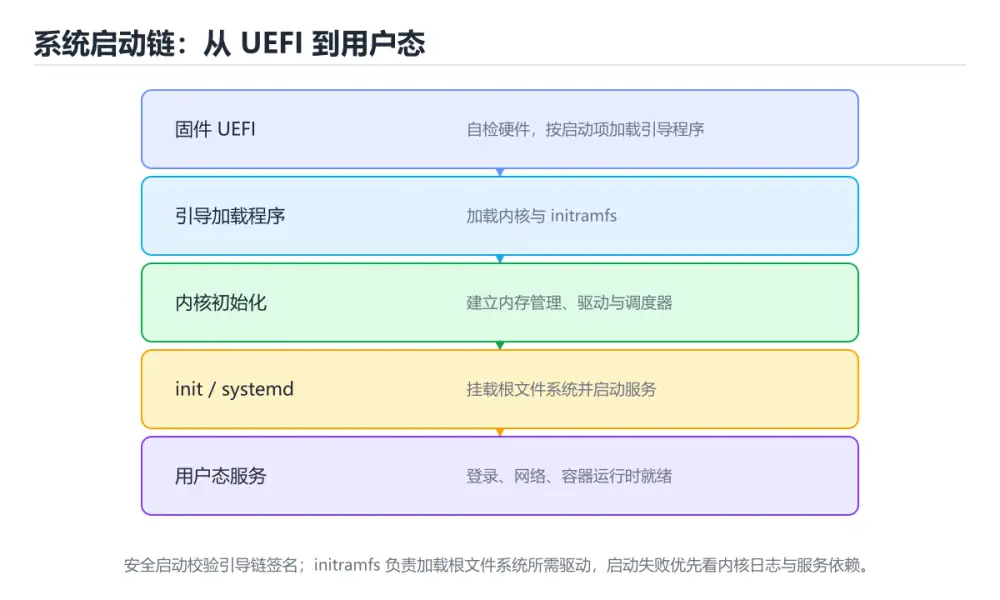
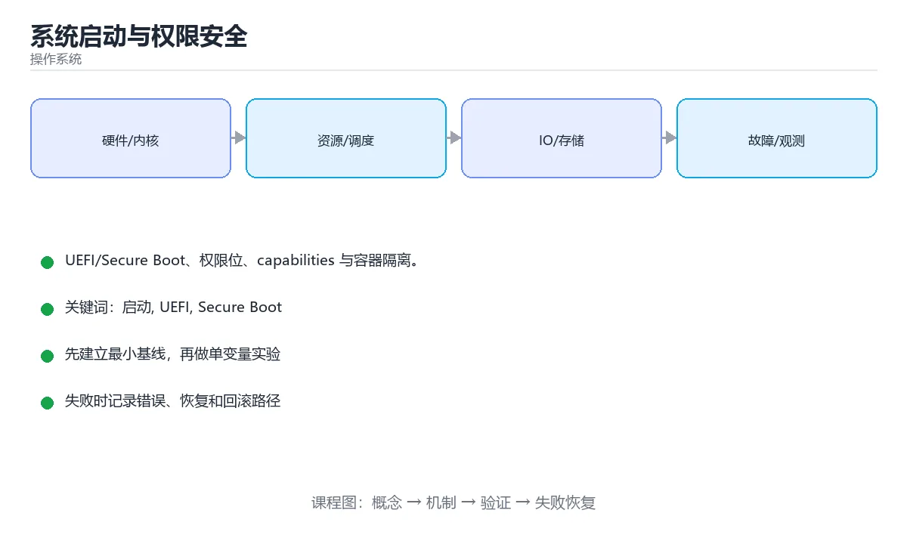

# 系统启动与权限安全

> 内容更新时间：2026-10-06 · 学习阶段：进阶 · 预计用时：40 分钟





## 本节知识框架

**课程定位**：所属分类 `os`（操作系统），课程主题 `系统启动与权限安全`，学习阶段 进阶，建议用时 40 分钟。

本课主线：UEFI/Secure Boot、权限位、capabilities 与容器隔离。

**学完本课应当能够**
- 说清 `namespace` 与 `Secure Boot` 的含义与区别，并各举一个正例和一个反例。
- 用本课示例验证 `SELinux` 的行为，记录输入、输出与失败条件。
- 遇到「卡在固件界面」这类问题时，能说出触发条件与修复顺序。

### 从概念到验证的学习链条

1. `namespace`：先掌握 把标识符组织到独立作用域、避免命名冲突的语言结构，再用它解释 `Secure Boot` 为什么会出现。
2. `Secure Boot`：先掌握 固件逐级校验引导程序与内核的签名，阻止被篡改的启动链加载，再用它解释 `SELinux` 为什么会出现。
3. `SELinux`：先掌握 内核的强制访问控制，按策略限制进程能碰哪些文件和端口，缩小漏洞的影响面，再用它解释 `SUID` 为什么会出现。
4. `SUID`：先掌握 让普通用户以文件属主权限执行的位，是最小权限原则下要重点审查的对象，再用它解释 本课示例的观察结果 为什么会出现。

**先修与衔接**：本课是「操作系统」分类的第 10 课。先修内容：《文件系统实现与 RAID》。《文件系统实现与 RAID》里的 `inode`、`日志` 是本课的前提。相关或后续课程：《实战：实现一个多线程任务队列》。

### 完成判据

- **定义关**：不看正文也能说明 `namespace` 是 把标识符组织到独立作用域、避免命名冲突的语言结构，并指出一个反例。
- **机制关**：能按“输入 → 转换 → 输出 → 验证”复述 `系统启动与权限安全`，而不是只背结论。
- **示例关**：能运行或推演 `系统启动与权限安全` 的 `bash` 示例，并说明一个真实出现的标识符或字面量。
- **证据关**：能指出 `系统启动与权限安全` 示例里的 出现字面量 `无 mokutil`，并说明它支持或反驳了本课的哪一条结论。
- **排错关**：能复现 卡在固件界面，记录现象并按 进 UEFI 检查启动项与磁盘 修复。
- **迁移关**：能把 `启动`、`UEFI`、`Secure Boot`、`SUID` 放进一个与 `系统启动与权限安全` 不同的项目场景，并保持输入与验证条件可追踪。
- **复盘关**：学完 `系统启动与权限安全` 后，用一句话写下仍然不确定的结论，并列出下一次验证需要的输入、环境和成功判据。

### 复习清单

- [ ] 能不看正文复述本课核心术语，并指出一个边界或反例。
- [ ] 能运行或推演本课示例，记录输入、输出与失败现象。
- [ ] 能完成一次自测，并把错题对照错误表定位原因。

## 核心概念定义

| 术语 | 操作性定义 | 常见边界与风险 |
| --- | --- | --- |
| namespace | 把标识符组织到独立作用域、避免命名冲突的语言结构。 | 只在「把标识符组织到独立作用域、避免命名冲突的语言结构」这一前提下成立，换输入或换环境要重新验证。 |
| Secure Boot | 固件逐级校验引导程序与内核的签名，阻止被篡改的启动链加载。 | 易错：自编译内核或第三方模块未签名；正确做法是签名模块或临时关闭 Secure Boot 定位。 |
| SELinux | 内核的强制访问控制，按策略限制进程能碰哪些文件和端口，缩小漏洞的影响面。 | 易错：失去强制访问控制；正确做法是用策略调试而不是直接关闭。 |
| SUID | 让普通用户以文件属主权限执行的位，是最小权限原则下要重点审查的对象。 | 易错：提权漏洞面变大；正确做法是定期审计并移除不必要的 SUID。 |
| 用户 / 组 | 主体身份（UID / GID） | 只在「主体身份（UID / GID）」这一前提下成立，换输入或换环境要重新验证。 |
| 文件权限 | rwx 分别作用于属主、组、其他 | 只在「rwx 分别作用于属主、组、其他」这一前提下成立，换输入或换环境要重新验证。 |
| umask | 创建文件时屏蔽权限位 | 易错：新建文件全局可写；正确做法是一般用 022 或 027。 |
| SUID | 执行时以文件属主身份运行（高风险） | 易错：提权漏洞面变大；正确做法是定期审计并移除不必要的 SUID。 |
| SGID | 目录中新建文件继承目录组 | 只在「目录中新建文件继承目录组」这一前提下成立，换输入或换环境要重新验证。 |
| Sticky bit | 目录内只能删除自己的文件 | 只在「目录内只能删除自己的文件」这一前提下成立，换输入或换环境要重新验证。 |
| capabilities | 细粒度特权（如绑定低端口） | 易错：漏洞影响面最大；正确做法是专用低权限账号 + capabilities。 |
| sudo | 受控提权并记录审计 | 只在「受控提权并记录审计」这一前提下成立，换输入或换环境要重新验证。 |
| SELinux / AppArmor | 强制访问控制 | 只在「强制访问控制」这一前提下成立，换输入或换环境要重新验证。 |

## 原理与运行机制

### 机制总览

**教材衔接：强制访问控制**

| 机制 | 特点 |
| --- | --- |
| SELinux | 基于标签的策略，细粒度，RHEL 系默认 |
| AppArmor | 基于路径的配置，简单易用，Ubuntu 系默认 |
| Seccomp | 限制进程可用的系统调用，容器常用 |

**教材衔接：隔离：命名空间与 cgroups**

容器不是虚拟机，它靠内核特性实现隔离：**命名空间**隔离视图（PID、网络、挂载、UTS、IPC、用户），**cgroups** 限制资源（CPU、内存、IO、进程数）。理解这点就能解释「容器里看到的进程号是 1」「内存超限被 OOM Kill」等现象。

**教材衔接：安全加固清单**

1. 禁用 root 远程登录，改用密钥 + sudo。
2. 最小化开放端口，防火墙默认拒绝。
3. 及时打补丁，关注 CVE 与内核漏洞。
4. 启用审计（auditd）与日志集中化。
5. 容器以非 root 运行、只读根文件系统、限制 capabilities。
6. 关键系统启用 Secure Boot 与磁盘加密（LUKS）。

**教材衔接：启动流程速查**

| 阶段 | 动作 | 关键组件 |
| --- | --- | --- |
| 上电自检 | 硬件初始化与检测 | UEFI / BIOS |
| 引导加载 | 加载内核与 initrd | GRUB、systemd-boot |
| 内核初始化 | 驱动、内存与调度就绪 | 内核 |
| 挂载根文件系统 | 切换到真实根 | initramfs |
| 启动用户态 | 拉起服务与登录 | systemd（PID 1） |
| 服务就绪 | 对外提供服务 | 目标（target）与依赖 |

| 安全机制 | 作用 |
| --- | --- |
| Secure Boot | 校验引导链签名，防篡改 |
| TPM | 存储密钥与度量值，支持可信启动 |
| 全盘加密 | 静态数据加密，防物理窃取 |
| 内核锁定与模块签名 | 限制内核模块加载 |
| 度量与远程证明 | 证明启动状态可信 |

**教材衔接：加固清单速查**

| 项 | 建议 |
| --- | --- |
| SSH | 禁用口令登录、禁用 root 直登、改端口加白名单 |
| 账号 | 删除无用账号、锁定默认账号、强制强密码策略 |
| 提权 | 最小化 sudo 权限，审计 SUID 文件 |
| 服务 | 只开必要端口与服务，关闭调试接口 |
| 更新 | 定期打补丁，订阅安全公告 |
| 日志 | 集中收集并防篡改 |
| 备份 | 离线备份 + 恢复演练 |
| 强制访问控制 | 启用 SELinux / AppArmor |

### 机制拆解：每一步的输入、动作与输出

#### 1. `namespace`
- 输入：`启动`；本步把 把标识符组织到独立作用域、避免命名冲突的语言结构 当作判断规则。
- 动作：围绕 `namespace` 保留中间状态，并记录它与 `Secure Boot` 的对应关系。
- 输出：`Secure Boot`，它可以被下一段代码、测试或记录继续使用。
- `namespace` 的失败条件：只在「把标识符组织到独立作用域、避免命名冲突的语言结构」这一前提下成立，换输入或换环境要重新验证。

#### 2. `Secure Boot`
- 输入：`namespace`；本步把 固件逐级校验引导程序与内核的签名，阻止被篡改的启动链加载 当作判断规则。
- 动作：围绕 `Secure Boot` 保留中间状态，并记录它与 `SELinux` 的对应关系。
- 输出：`SELinux`，它可以被下一段代码、测试或记录继续使用。
- `Secure Boot` 的失败条件：当Secure Boot 报签名失败时，会出现自编译内核或第三方模块未签名。

#### 3. `SELinux`
- 输入：`Secure Boot`；本步把 内核的强制访问控制，按策略限制进程能碰哪些文件和端口，缩小漏洞的影响面 当作判断规则。
- 动作：围绕 `SELinux` 保留中间状态，并记录它与 `SUID` 的对应关系。
- 输出：`SUID`，它可以被下一段代码、测试或记录继续使用。
- `SELinux` 的失败条件：当关闭 SELinux 图省事时，会出现失去强制访问控制。

#### 4. `SUID`
- 输入：`SELinux`；本步把 让普通用户以文件属主权限执行的位，是最小权限原则下要重点审查的对象 当作判断规则。
- 动作：围绕 `SUID` 保留中间状态，并记录它与 `无 mokutil` 的对应关系。
- 输出：`无 mokutil`，它可以被下一段代码、测试或记录继续使用。
- `SUID` 的失败条件：当随意保留 SUID 文件时，会出现提权漏洞面变大。

### 示例中的可观察事实

1. 出现字面量 `无 mokutil`；它对应的课程主题是 `系统启动与权限安全`。
2. 出现字面量 `secure boot\|taint`；它对应的课程主题是 `系统启动与权限安全`。
3. 出现字面量 `未启用强制访问控制`；它对应的课程主题是 `系统启动与权限安全`。
4. 调用了 `describe_mode()`；它对应的课程主题是 `系统启动与权限安全`。
5. 调用了 `stat()`；它对应的课程主题是 `系统启动与权限安全`。
6. 调用了 `oct()`；它对应的课程主题是 `系统启动与权限安全`。
7. 调用了 `S_IMODE()`；它对应的课程主题是 `系统启动与权限安全`。
8. 调用了 `bool()`；它对应的课程主题是 `系统启动与权限安全`。

### 复现实验记录

- 环境：`系统启动与权限安全` 使用 `bash` 示例，固定 `启动`、`UEFI`、`Secure Boot`、`SUID` 作为第一组条件。
- 首轮输入：先确认 出现字面量 `无 mokutil`，预测 `namespace` 会怎样变化。
- 基线观察：记录命令、输入、输出和错误原文，不用截图代替可复制的文本。
- 单变量修改：只改变 `启动`，观察 `SUID` 是否仍满足定义。
- 失败注入：复现 卡在固件界面，确认现象是 硬盘未被识别、引导顺序错误。
- 记录结论：把“修改前、修改后、预期变化、实际变化”写成四列表，这样复盘 `系统启动与权限安全` 时才能区分概念错误与实现错误。

## 典型应用场景

- **卡在固件界面**：典型现象是硬盘未被识别、引导顺序错误；正确做法是进 UEFI 检查启动项与磁盘。
- **GRUB 提示找不到内核**：典型现象是内核升级后未更新 grub 配置；正确做法是用安装介质进入救援模式重建引导。
- **启动后进入 emergency mode**：典型现象是/etc/fstab 中挂载项错误；正确做法是检查 fstab 与磁盘 UUID（`blkid`）。
- **Secure Boot 报签名失败**：典型现象是自编译内核或第三方模块未签名；正确做法是签名模块或临时关闭 Secure Boot 定位。

### 最小验证场景

- 准备：保留 `bash` 示例的原始输入，先记录 `系统启动与权限安全` 的基线输出和完整运行命令。
- 观察：先核对 出现字面量 `无 mokutil`，再改变一个与 `namespace` 相关的条件。
- 判定：新结果与 `系统启动与权限安全` 的基线不同不等于错误；只有当差异破坏了 `namespace` 的定义或错误表中的约束，才判定为失败。

### 选择与边界

- 使用 `namespace` 时，先满足它的定义：把标识符组织到独立作用域、避免命名冲突的语言结构；只在「把标识符组织到独立作用域、避免命名冲突的语言结构」这一前提下成立，换输入或换环境要重新验证。
- 使用 `Secure Boot` 时，先满足它的定义：固件逐级校验引导程序与内核的签名，阻止被篡改的启动链加载；易错：自编译内核或第三方模块未签名；正确做法是签名模块或临时关闭 Secure Boot 定位。
- 使用 `SELinux` 时，先满足它的定义：内核的强制访问控制，按策略限制进程能碰哪些文件和端口，缩小漏洞的影响面；易错：失去强制访问控制；正确做法是用策略调试而不是直接关闭。
- 使用 `SUID` 时，先满足它的定义：让普通用户以文件属主权限执行的位，是最小权限原则下要重点审查的对象；易错：提权漏洞面变大；正确做法是定期审计并移除不必要的 SUID。

## 代码/协议/SQL 示例

**教材衔接：启动流程**

```text
通电 → CPU 执行固件（BIOS/UEFI）→ POST 自检 → 选择启动设备
→ 加载 bootloader（GRUB）→ 加载内核与 initramfs
→ 内核初始化（内存、调度、驱动）→ 挂载根文件系统
→ 启动 init/systemd（PID 1）→ 启动服务与登录界面
```

UEFI 取代 BIOS 的关键改进：GPT 分区、启动更快、支持 Secure Boot（校验 bootloader 与内核签名，防止引导链被篡改）。initramfs 是临时根文件系统，内含挂载真正根分区所需的驱动与脚本。

**教材衔接：权限加固的实操命令**

| 目标 | 命令要点 |
| --- | --- |
| 查看文件权限与特殊位 | `ls -l` 看 rwx 与 s/t 标记；`stat -c '%a %n' <file>` 看八进制 |
| 修正目录与文件权限 | 目录 755、普通文件 644；可执行脚本 755，绝不整目录 777 |
| 查找危险的 SUID 文件 | `find / -perm -4000 -type f 2>/dev/null`，逐个确认是否必要 |
| 限制服务权限 | systemd 单元中加 `User=`、`NoNewPrivileges=true`、`ProtectSystem=strict` |
| 查看进程可用能力 | `getpcaps <pid>` 或 `capsh --print` |
| 容器最小权限 | `--read-only --cap-drop=ALL --user 1000:1000`，仅按需 `--cap-add` |

排查思路：先用审计工具（`lynis`、`auditd`）找出配置偏差，再逐项收敛；**每次改动都要在测试环境验证服务仍能启动**，权限过紧会直接导致启动失败。

```bash
# 启动与引导排查
systemd-analyze blame | head            # 各服务启动耗时
systemd-analyze critical-chain          # 关键启动链路
journalctl -b -p err                    # 本次启动的错误日志
systemctl --failed                      # 启动失败的服务

# Secure Boot 与内核模块签名状态
mokutil --sb-state 2>/dev/null || echo "无 mokutil"
dmesg | grep -i 'secure boot\|taint'

# 权限与提权审计
find / -perm -4000 -type f 2>/dev/null | head   # 查找 SUID 文件
getenforce 2>/dev/null || aa-status 2>/dev/null || echo "未启用强制访问控制"
last -n 5                                # 最近登录记录
journalctl -u ssh -n 50                  # SSH 相关审计
```

```python
import os
import stat

def describe_mode(path: str) -> dict:
    """解读文件权限位与特殊位。"""
    mode = os.stat(path).st_mode
    return {
        "octal": oct(stat.S_IMODE(mode)),
        "owner": bool(mode & stat.S_IRWXU),
        "suid": bool(mode & stat.S_ISUID),      # 提权风险点
        "sgid": bool(mode & stat.S_ISGID),
        "sticky": bool(mode & stat.S_ISVTX),
    }

def is_world_writable(mode: int) -> bool:
    """全局可写是常见的安全弱配置。"""
    return bool(mode & stat.S_IWOTH)

def audit_critical_paths(paths: list) -> list:
    """巡检关键路径的危险权限。"""
    findings = []
    for path in paths:
        try:
            info = describe_mode(path)
        except OSError:
            continue
        if info["suid"]:
            findings.append((path, "SUID 位开启，需确认是否必要"))
        if is_world_writable(os.stat(path).st_mode):
            findings.append((path, "全局可写，建议收紧权限"))
    return findings

print(audit_critical_paths(["/etc", "/usr/bin/passwd"]))
```

**运行方式**：运行 `系统启动与权限安全` 的示例时，用 `bash 文件名.sh` 运行；先 `bash -n` 做语法检查更稳妥。

### 示例精读：先找证据，再改一个条件

1. 出现字面量 `无 mokutil`；它出现在 `系统启动与权限安全` 的示例中，阅读时先确认它前后各发生了什么。
2. 出现字面量 `secure boot\|taint`；它出现在 `系统启动与权限安全` 的示例中，阅读时先确认它前后各发生了什么。
3. 出现字面量 `未启用强制访问控制`；它出现在 `系统启动与权限安全` 的示例中，阅读时先确认它前后各发生了什么。
4. 调用了 `describe_mode()`；它出现在 `系统启动与权限安全` 的示例中，阅读时先确认它前后各发生了什么。
5. 调用了 `stat()`；它出现在 `系统启动与权限安全` 的示例中，阅读时先确认它前后各发生了什么。
6. 调用了 `oct()`；它出现在 `系统启动与权限安全` 的示例中，阅读时先确认它前后各发生了什么。
7. 调用了 `S_IMODE()`；它出现在 `系统启动与权限安全` 的示例中，阅读时先确认它前后各发生了什么。
8. 调用了 `bool()`；它出现在 `系统启动与权限安全` 的示例中，阅读时先确认它前后各发生了什么。
- 在 `系统启动与权限安全` 中与 `namespace` 对照：示例必须能支持 把标识符组织到独立作用域、避免命名冲突的语言结构，否则说明这一段还缺少实现或验证步骤。
- 在 `系统启动与权限安全` 中与 `Secure Boot` 对照：示例必须能支持 固件逐级校验引导程序与内核的签名，阻止被篡改的启动链加载，否则说明这一段还缺少实现或验证步骤。
- 在 `系统启动与权限安全` 中与 `SELinux` 对照：示例必须能支持 内核的强制访问控制，按策略限制进程能碰哪些文件和端口，缩小漏洞的影响面，否则说明这一段还缺少实现或验证步骤。
- 在 `系统启动与权限安全` 中与 `SUID` 对照：示例必须能支持 让普通用户以文件属主权限执行的位，是最小权限原则下要重点审查的对象，否则说明这一段还缺少实现或验证步骤。

## 时间/空间复杂度或性能分析

**性能关注点（系统启动与权限安全）**：系统调用与上下文切换是主要成本：记录 CPU 占用、切换次数与内存映射规模。

**本课特有开销（系统启动与权限安全 · 启动）**：小文件看元数据开销，大文件看吞吐，两者要分别测量。

**测量方法**：以 `系统启动与权限安全` 的 `启动` 场景为对象，固定输入跑一遍记录基线，再把规模或并发度提高一个数量级复测；两次结果的差值与波动范围才是结论依据。

### 需要控制的变量与记录项

- `系统启动与权限安全` 的 `启动`：固定它的版本、输入范围和资源上限，分别记录速度、内存与失败率的变化。
- `系统启动与权限安全` 的 `UEFI`：固定它的版本、输入范围和资源上限，分别记录速度、内存与失败率的变化。
- `系统启动与权限安全` 的 `Secure Boot`：固定它的版本、输入范围和资源上限，分别记录速度、内存与失败率的变化。
- `系统启动与权限安全` 的 `SUID`：固定它的版本、输入范围和资源上限，分别记录速度、内存与失败率的变化。
- `系统启动与权限安全` 的 `capabilities`：固定它的版本、输入范围和资源上限，分别记录速度、内存与失败率的变化。
- `系统启动与权限安全` 中 `namespace` 的边界：只在「把标识符组织到独立作用域、避免命名冲突的语言结构」这一前提下成立，换输入或换环境要重新验证。达到边界时不要外推，必须重新测量。
- `系统启动与权限安全` 中 `Secure Boot` 的边界：易错：自编译内核或第三方模块未签名；正确做法是签名模块或临时关闭 Secure Boot 定位。达到边界时不要外推，必须重新测量。
- `系统启动与权限安全` 中 `SELinux` 的边界：易错：失去强制访问控制；正确做法是用策略调试而不是直接关闭。达到边界时不要外推，必须重新测量。
- `系统启动与权限安全` 中 `SUID` 的边界：易错：提权漏洞面变大；正确做法是定期审计并移除不必要的 SUID。达到边界时不要外推，必须重新测量。
- `系统启动与权限安全` 的代码证据：先验证 出现字面量 `无 mokutil`，再记录该路径的输入规模与耗时；只看代码行数不能推出复杂度。

## 常见误区与易错点

| 容易写错的做法 | 实际现象 | 原因与正确做法 |
| --- | --- | --- |
| 卡在固件界面 | 硬盘未被识别、引导顺序错误 | 进 UEFI 检查启动项与磁盘 |
| GRUB 提示找不到内核 | 内核升级后未更新 grub 配置 | 用安装介质进入救援模式重建引导 |
| 启动后进入 emergency mode | /etc/fstab 中挂载项错误 | 检查 fstab 与磁盘 UUID（`blkid`） |
| Secure Boot 报签名失败 | 自编译内核或第三方模块未签名 | 签名模块或临时关闭 Secure Boot 定位 |
| 服务起不来但系统正常 | systemd 单元配置错误 | `systemctl status <svc>` + `journalctl -u <svc> -n 50` |
| 认为 Secure Boot 能防一切 | 仍被应用层攻击 | 它只保证引导链完整性 |
| 关闭 SELinux 图省事 | 失去强制访问控制 | 用策略调试而不是直接关闭 |
| 随意保留 SUID 文件 | 提权漏洞面变大 | 定期审计并移除不必要的 SUID |
| umask 设为 000 | 新建文件全局可写 | 一般用 022 或 027 |
| 用 root 跑应用 | 漏洞影响面最大 | 专用低权限账号 + capabilities |
| 不做启动耗时分析 | 启动慢且不知原因 | 用 `systemd-analyze` 定位 |
| 只看内核日志不看服务日志 | 漏掉应用错误 | 结合 `journalctl -u` 与业务日志 |
| 无登录审计 | 入侵无法追溯 | 集中日志 + 告警 |
| 全盘加密不给恢复方案 | 密钥丢失数据不可恢复 | 备份恢复密钥 |
| 不做恢复演练 | 真故障时无法启动 | 定期演练救援模式 |

### 现场 1：卡在固件界面

**症状**：硬盘未被识别、引导顺序错误。

**根因与修复**：进 UEFI 检查启动项与磁盘。

**自检**：在本课示例里复现「卡在固件界面」，改成进 UEFI 检查启动项与磁盘后重跑；如果症状消失且失败路径按预期变化，说明定位正确。

### 现场 2：GRUB 提示找不到内核

**症状**：内核升级后未更新 grub 配置。

**根因与修复**：用安装介质进入救援模式重建引导。

**自检**：在本课示例里复现「GRUB 提示找不到内核」，改成用安装介质进入救援模式重建引导后重跑；如果症状消失且失败路径按预期变化，说明定位正确。

### 现场 3：启动后进入 emergency mode

**症状**：/etc/fstab 中挂载项错误。

**根因与修复**：检查 fstab 与磁盘 UUID（`blkid`）。

**自检**：在本课示例里复现「启动后进入 emergency mode」，改成检查 fstab 与磁盘 UUID（`blkid`）后重跑；如果症状消失且失败路径按预期变化，说明定位正确。

### 现场 4：Secure Boot 报签名失败

**症状**：自编译内核或第三方模块未签名。

**根因与修复**：签名模块或临时关闭 Secure Boot 定位。

**自检**：在本课示例里复现「Secure Boot 报签名失败」，改成签名模块或临时关闭 Secure Boot 定位后重跑；如果症状消失且失败路径按预期变化，说明定位正确。

### 现场 5：服务起不来但系统正常

**症状**：systemd 单元配置错误。

**根因与修复**：`systemctl status <svc>` + `journalctl -u <svc> -n 50`。

**自检**：在本课示例里复现「服务起不来但系统正常」，改成`systemctl status <svc>` + `journalctl -u <svc> -n 50`后重跑；如果症状消失且失败路径按预期变化，说明定位正确。

### 现场 6：认为 Secure Boot 能防一切

**症状**：仍被应用层攻击。

**根因与修复**：它只保证引导链完整性。

**自检**：在本课示例里复现「认为 Secure Boot 能防一切」，改成它只保证引导链完整性后重跑；如果症状消失且失败路径按预期变化，说明定位正确。

### 现场 7：关闭 SELinux 图省事

**症状**：失去强制访问控制。

**根因与修复**：用策略调试而不是直接关闭。

**自检**：在本课示例里复现「关闭 SELinux 图省事」，改成用策略调试而不是直接关闭后重跑；如果症状消失且失败路径按预期变化，说明定位正确。

### 现场 8：随意保留 SUID 文件

**症状**：提权漏洞面变大。

**根因与修复**：定期审计并移除不必要的 SUID。

**自检**：在本课示例里复现「随意保留 SUID 文件」，改成定期审计并移除不必要的 SUID后重跑；如果症状消失且失败路径按预期变化，说明定位正确。

### 现场 9：umask 设为 000

**症状**：新建文件全局可写。

**根因与修复**：一般用 022 或 027。

**自检**：在本课示例里复现「umask 设为 000」，改成一般用 022 或 027后重跑；如果症状消失且失败路径按预期变化，说明定位正确。

## 与其他知识点的关系

- **先修**：`文件系统实现与 RAID`。本课默认这些内容已经掌握。
- **相关或后续**：`实战：实现一个多线程任务队列`。本课术语会在这些课程里继续使用。
- **术语归属**：`namespace`、`Secure Boot`、`SELinux` 的定义以本课「核心概念定义」为准，换到其他课程时先确认定义是否被改写。
- 同一分类的《cgroups、namespaces 与容器》也涉及 `namespace`；两课衔接时先确认这个术语的定义是否一致。

### 先修与后续术语接口

- `文件系统实现与 RAID`：两者通过本分类的学习顺序衔接，阅读时重点比较各自的输入与失败条件。
- `实战：实现一个多线程任务队列`：两者通过本分类的学习顺序衔接，阅读时重点比较各自的输入与失败条件。

### 容易混淆的相邻概念

- `namespace` 与 `Secure Boot`：前者强调 把标识符组织到独立作用域、避免命名冲突的语言结构；后者强调 固件逐级校验引导程序与内核的签名，阻止被篡改的启动链加载。判断时分别检查两条定义的适用范围，不要只看名称相似就互换。
- `Secure Boot` 与 `SELinux`：前者强调 固件逐级校验引导程序与内核的签名，阻止被篡改的启动链加载；后者强调 内核的强制访问控制，按策略限制进程能碰哪些文件和端口，缩小漏洞的影响面。判断时分别检查两条定义的适用范围，不要只看名称相似就互换。
- `SELinux` 与 `SUID`：前者强调 内核的强制访问控制，按策略限制进程能碰哪些文件和端口，缩小漏洞的影响面；后者强调 让普通用户以文件属主权限执行的位，是最小权限原则下要重点审查的对象。判断时分别检查两条定义的适用范围，不要只看名称相似就互换。

## 自测题与参考答案

> 先独立作答，再对照参考答案；答案都能在本课正文、术语表或错误表里找到依据。

### 自测 1（概念复述）

不看正文，写出 `namespace` 的操作性定义，并说明它与 `Secure Boot` 的区别。

**参考答案**：把标识符组织到独立作用域、避免命名冲突的语言结构。

`Secure Boot` 的定位是：固件逐级校验引导程序与内核的签名，阻止被篡改的启动链加载；两者的差别要从适用对象与失败模式上说明。

### 自测 2（排错）

本课错误表记录了「卡在固件界面」这类做法。请写出它会出现的现象、根因，以及修复顺序。

**参考答案**：现象是硬盘未被识别、引导顺序错误；正确做法是进 UEFI 检查启动项与磁盘。修复时先复现现象并保留证据，再改动一处假设重跑，确认现象消失。

### 自测 3（动手验证）

运行本课的 `bash` 示例，把其中的 `"无 mokutil"` 换成一个边界值后重新运行，记录输出与错误信息。

**参考答案**：正常输入下 `bash` 示例应当复现正文给出的结果；把 `"无 mokutil"` 换成边界值后，如果结果改变或报错，先核对它是否满足 `系统启动与权限安全` 中`namespace` 的适用范围，再检查错误表里是否有同类现象。

### 自测 4（代码阅读）

阅读本课开头的 `bash` 示例，说明它体现了`namespace` 的哪一条性质，并指出改动哪个输入会让这条性质不再成立。

**参考答案**：`namespace` 的定义是 把标识符组织到独立作用域、避免命名冲突的语言结构，示例正是在实现这条定义。改动与 `namespace` 有关的一个输入后，如果结果不再符合 `系统启动与权限安全` 的正文描述，就说明该性质只在当前前提成立。

### 自测 5（迁移）

把 `系统启动与权限安全` 的方法迁移到自己的项目：围绕 `namespace` 写出一个与错误表同类的风险点，并说明触发条件和检验方式。

**参考答案**：例如「不做恢复演练」，它会导致真故障时无法启动；检验方式是按定期演练救援模式改一处再复现，确认现象消失且没有引入新的失败分支。

### 自测 6（对比）

用一个表格对比 `namespace` 与 `Secure Boot`：各写一行适用场景、一行失败表现。

**参考答案**：`namespace` 的定义是把标识符组织到独立作用域、避免命名冲突的语言结构；`Secure Boot` 的定义是固件逐级校验引导程序与内核的签名，阻止被篡改的启动链加载。两者的失败表现分别对应本课错误表里与本术语相关的行。

### 自测 7（排错顺序）

面对「卡在固件界面」引发的问题，请把“复现 硬盘未被识别、引导顺序错误 → 保留证据 → 进 UEFI 检查启动项与磁盘 → 回归验证”四步写成可执行的检查清单。

**参考答案**：第一步按硬盘未被识别、引导顺序错误复现；第二步记录输入、版本与完整报错；第三步按进 UEFI 检查启动项与磁盘只改一处；第四步重跑并确认失败路径也按预期变化。

### 自测 8（边界判断）

针对 `SUID`，分别写出“可以使用”的条件和“结论不再成立”的条件。

**参考答案**：易错：提权漏洞面变大；正确做法是定期审计并移除不必要的 SUID。 同时要把 `SUID` 的定义 让普通用户以文件属主权限执行的位，是最小权限原则下要重点审查的对象 与实际输入逐项对照。

### 自测 9（机制重建）

不看正文，按输入、转换、输出、验证四段重建 `namespace` → `Secure Boot` → `SELinux` → `SUID` 的作用链。

**参考答案**：起点是 `namespace` 的定义 把标识符组织到独立作用域、避免命名冲突的语言结构；中间每一步都保留可观察状态；终点由 `SUID` 检查，失败时回到错误表定位第一个偏离定义的步骤。

### 自测 10（综合排错）

在 `系统启动与权限安全` 中，现象是 真故障时无法启动。请围绕 不做恢复演练 写出最小复现、关键证据、修复动作和回归验证，并说明为什么不能只凭一次运行下结论。

**参考答案**：先复现 不做恢复演练，记录输入与完整错误；再按 定期演练救援模式 只改一处。回归时同时跑正常路径和边界路径，只有两次结果都可解释，才把修复视为完成。

### 自测 11（一分钟复述）

用每分钟约 200 字的速度复述 `系统启动与权限安全`：先给主问题，再按顺序说出 `namespace`、`Secure Boot`、`SELinux`、`SUID`，最后给一个失败案例。

**自评标准**：主问题必须对应 UEFI/Secure Boot、权限位、capabilities 与容器隔离；每个术语都要能接上一句定义或边界；失败案例必须写成可观察现象，不能用“可能有风险”代替证据。

## 术语速查

| 术语 | 一句话说明 |
| --- | --- |
| `namespace` | 把标识符组织到独立作用域、避免命名冲突的语言结构。 |
| `Secure Boot` | 固件逐级校验引导程序与内核的签名，阻止被篡改的启动链加载。 |
| `SELinux` | 内核的强制访问控制，按策略限制进程能碰哪些文件和端口，缩小漏洞的影响面。 |
| `SUID` | 让普通用户以文件属主权限执行的位，是最小权限原则下要重点审查的对象。 |

**术语关系**：`namespace`（把标识符组织到独立作用域、避免命名冲突的语言结构） → `Secure Boot`（固件逐级校验引导程序与内核的签名） → `SELinux`（内核的强制访问控制） → `SUID`（让普通用户以文件属主权限执行的位）。

## 考点精讲

`系统启动与权限安全` 的题库有 6 道题，下面逐题给出题干、正确项与判断依据：先自己作答，再核对正确项，最后回到正文对应小节复核。

### 考点 1：第 1 题

- **题目**：Secure Boot 的核心作用是？
- **正确项**：校验引导链各环节的数字签名，防止被篡改
- **判断依据**：这道题落在术语 `Secure Boot` 上：固件逐级校验引导程序与内核的签名，阻止被篡改的启动链加载。复习时把 `Secure Boot` 的定义、适用边界和一个反例一起说清楚，再回到「核心概念定义」核对原文。

### 考点 2：第 2 题

- **题目**：容器实现隔离依赖的内核特性是？
- **正确项**：命名空间 + cgroups
- **判断依据**：这道题检验本课主问题：UEFI/Secure Boot、权限位、capabilities 与容器隔离。复习时先复述本课主问题，再举一个会让结论失效的输入。

### 考点 3：第 3 题

- **题目**：围绕“系统启动与权限安全”中的 启动、UEFI、Secure Boot，下列哪两项是本课强调的实践判断？
- **正确项**：学习 启动 时要同时说明输入、输出和失败路径，不能只看正常流程；验证 UEFI 时要固定版本并覆盖边界输入，结论才可复现
- **判断依据**：这道题落在术语 `Secure Boot` 上：固件逐级校验引导程序与内核的签名，阻止被篡改的启动链加载。复习时把 `Secure Boot` 的定义、适用边界和一个反例一起说清楚，再回到「核心概念定义」核对原文。

### 考点 4：第 4 题

- **题目**：UEFI/BIOS 在上电后的主要职责是？
- **正确项**：自检硬件
- **判断依据**：这道题检验本课主问题：UEFI/Secure Boot、权限位、capabilities 与容器隔离。复习时先复述本课主问题，再举一个会让结论失效的输入。

### 考点 5：第 5 题

- **题目**：下面这段 `bash` 代码来自 `系统启动与权限安全`。课程主线是UEFI/Secure Boot、权限位、capabilities 与容器隔离。代码与 `namespace` 有关。哪一项是代码里真实出现的内容？
- **正确项**：出现字面量 `未启用强制访问控制`
- **判断依据**：这道题落在术语 `namespace` 上：把标识符组织到独立作用域、避免命名冲突的语言结构。复习时把 `namespace` 的定义、适用边界和一个反例一起说清楚，再回到「核心概念定义」核对原文。

### 考点 6：第 6 题

- **题目**：填空：补齐下面这段术语说明中的空缺。课程 `UEFI/Secure Boot、权限位、capabilities 与容器隔离。`，这段说明是：`____`：让普通用户以文件属主权限执行的位，是最小权限原则下要重点审查的对象。空缺处应填哪个术语？
- **正确项**：SUID
- **判断依据**：这道题落在术语 `Secure Boot` 上：固件逐级校验引导程序与内核的签名，阻止被篡改的启动链加载。复习时把 `Secure Boot` 的定义、适用边界和一个反例一起说清楚，再回到「核心概念定义」核对原文。

### 考点 7：`namespace`

- **要点**：把标识符组织到独立作用域、避免命名冲突的语言结构。
- **namespace 的边界**：只在「把标识符组织到独立作用域、避免命名冲突的语言结构」这一前提下成立，换输入或换环境要重新验证。

### 考点 8：`Secure Boot`

- **要点**：固件逐级校验引导程序与内核的签名，阻止被篡改的启动链加载。
- **Secure Boot 的边界**：易错：自编译内核或第三方模块未签名；正确做法是签名模块或临时关闭 Secure Boot 定位。

### 考点 9：`SELinux`

- **要点**：内核的强制访问控制，按策略限制进程能碰哪些文件和端口，缩小漏洞的影响面。
- **SELinux 的边界**：易错：失去强制访问控制；正确做法是用策略调试而不是直接关闭。

### 考点 10：`SUID`

- **要点**：让普通用户以文件属主权限执行的位，是最小权限原则下要重点审查的对象。
- **SUID 的边界**：易错：提权漏洞面变大；正确做法是定期审计并移除不必要的 SUID。

### 考点 11：排错——卡在固件界面

- **现象**：硬盘未被识别、引导顺序错误。
- **处理**：进 UEFI 检查启动项与磁盘。

### 考点 12：排错——GRUB 提示找不到内核

- **现象**：内核升级后未更新 grub 配置。
- **处理**：用安装介质进入救援模式重建引导。

### 考点 13：综合辨析——`namespace` 与 `SUID`

- **辨析点**：`namespace` 的定义是 把标识符组织到独立作用域、避免命名冲突的语言结构；`SUID` 的定义是 让普通用户以文件属主权限执行的位，是最小权限原则下要重点审查的对象。
- **答题要求**：面对 `系统启动与权限安全` 的题目，先判断描述的是 `namespace` 还是 `SUID`，再归到对应定义，最后写出一个会让该定义失效的边界输入。

### 考点 14：排错评分点

- **现象分**：能写出 硬盘未被识别、引导顺序错误，而不是只写“程序有错”。
- **证据分**：保留触发 卡在固件界面 的输入、版本和错误原文。
- **修复分**：按 进 UEFI 检查启动项与磁盘 只改一处，并同时回归正常路径与边界路径。

## 内容元数据

- 内容版本：v2.0
- 最后更新：2026-10-06
- 学习阶段：进阶
- 适用环境：Linux 6.x / POSIX
；本课聚焦 启动。
- 内容来源：内置结构化课程与工程实践整理
- 相关主题：启动、UEFI、Secure Boot、SUID、capabilities、namespace
- 质量版本：P0 测验标准 + P1 覆盖扩展 + P2 体验补全

## 参考资料与复核

- 最后复核：2026-10-04
- 下次复核：2027-07-24
- 复核范围：版本兼容、API 行为、安全建议与工程实践
- 来源性质：官方文档、标准或权威教材；本课核对关键词：启动、UEFI、Secure Boot、SUID、capabilities、namespace。

| 参考资料 | 本课用途 |
| --- | --- |
| [Linux 内核文档](https://docs.kernel.org/) | 调度、内存、文件系统与 I/O |
| [Linux 性能事件](https://perf.wiki.kernel.org/) | 性能分析与内核事件 |
| [MIT xv6](https://pdos.csail.mit.edu/6.828/2023/xv6.html) | 教学内核与系统调用 |

| [本课术语索引：系统启动与权限安全](#核心概念定义) | 按本课输入、术语边界和错误表现逐项核对 |
> 「系统启动与权限安全」的链接用于离线阅读后的延伸核对；App 不会自动联网。