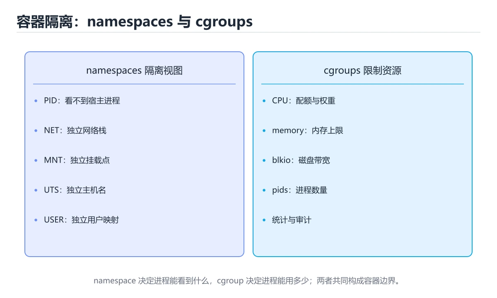
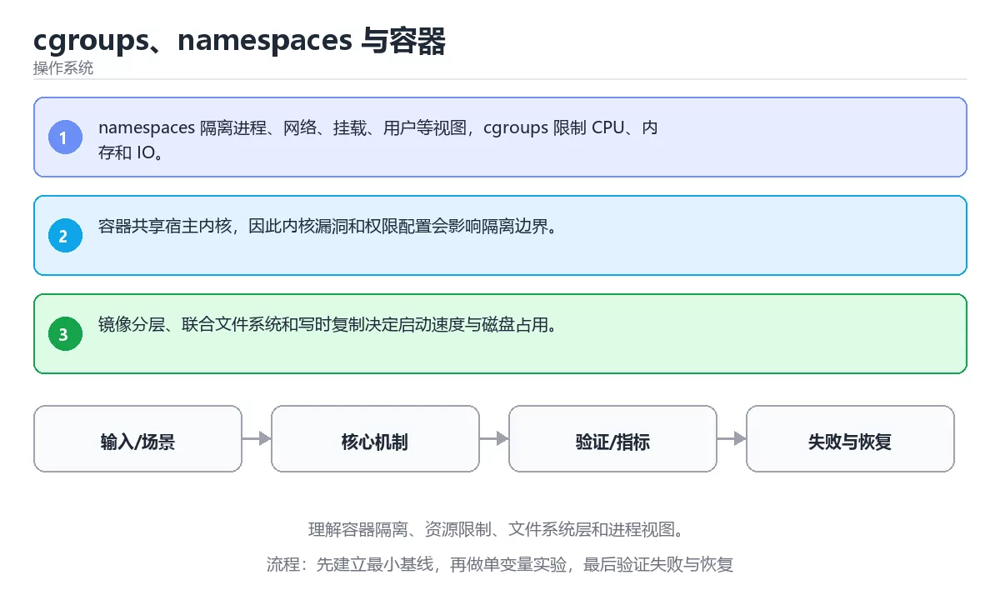

# cgroups、namespaces 与容器

> 内容更新时间：2026-10-03





## 学习目标

- 能用自己的话解释：namespaces 隔离进程、网络、挂载、用户等视图，cgroups 限制 CPU、内存和 IO。
- 能用自己的话解释：容器共享宿主内核，因此内核漏洞和权限配置会影响隔离边界。
- 能用自己的话解释：镜像分层、联合文件系统和写时复制决定启动速度与磁盘占用。
- 能把本课知识放回「操作系统」，并完成练习与测验。

## 前置知识

- 已完成「操作系统」的基础课程，能运行正文中的最小示例。
- 本课关键词：容器、namespace、cgroups、隔离。
- 遇到不熟悉的术语先记录问题，完成练习后再回读。

## 核心知识

### 1. namespaces 隔离进程、网络、挂载、用户等视图，cgroups 限制 CPU、内存和 IO。

- 关键做法：先用最小示例建立基线，再逐步加入边界、失败和性能条件。
- 验证标准：结果可复现、错误可解释、边界有测试、失败能恢复。

### 2. 容器共享宿主内核，因此内核漏洞和权限配置会影响隔离边界。

### 3. 镜像分层、联合文件系统和写时复制决定启动速度与磁盘占用。

## 关键流程

```text
输入 → 校验 → 核心处理 → 验证 → 记录指标 → 失败恢复
```

## 实践路径

1. 用一句话复述本课要解决的问题。
2. 跑通正文中的最小示例并记录基线。
3. 只改变一个输入或参数，预测并验证结果。
4. 补一个失败路径，记录错误、恢复和指标。
5. 把结论写成可复现的笔记或测试。

## 常见误区

| 误区 | 后果 | 修正 |
| --- | --- | --- |
| 只记术语不做实验 | 遇到真实问题无法判断 | 用最小输入跑通并记录结果 |
| 只测正常路径 | 边界和故障上线才暴露 | 补空值、极值和依赖失败 |
| 没有基线就优化 | 无法证明改进有效 | 先测量再修改 |
| 忽略成本与安全 | 性能和风险失控 | 同时记录资源、权限与失败代价 |

## 动手练习

1. 合上教程，用 3～5 句话解释cgroups、namespaces 与容器。
2. 从正文选一个例子，改变一个条件并预测结果。
3. 设计一个失败场景，写出止损与恢复步骤。

**验收标准**：留下输入、命令、输出、差异和下一步问题。

## 本课小结

- 本课属于「操作系统」，核心关键词是 容器、namespace、cgroups、隔离。
- 先保证正确与可复现，再讨论性能和扩展。
- 完成练习和测验后，把仍然不确定的问题写成下一轮验证清单。

> 本课由 P1 内容扩展生成，重点补充原有课程缺失的主题与工程边界。

## 可运行练习

### 任务 1：先跑通，再解释

```python
import os

print("pid>0:", os.getpid() > 0)
```

### 任务 2：只改一个条件

### 任务 3：迁移到自己的数据

用同一套思路处理一组你自己的数据或场景，保持输出格式与任务 1 一致。

## 故障现场

### 现场 1：本课的 容器 常规用例通过，但边界用例失败

**症状**：在本课的练习或生产场景里出现“本课的 容器 常规用例通过，但边界用例失败”。

**复现**：准备一组最小输入，只保留触发“本课的 容器 常规用例通过，但边界用例失败”的必要条件，连续运行两次确认结果稳定。

**定位**：围绕“容器 的前置条件与取值边界没有写进代码，默认值掩盖了空值和极值”检查调用链、输入数据和环境配置，先验证假设再改代码。

**预防**：把“本课的 容器 常规用例通过，但边界用例失败”写成一条自动化用例，并在本课的验收清单里保留对应检查项。

### 现场 2：本课的 namespace 结果在两次运行之间不一致

**症状**：在本课的练习或生产场景里出现“本课的 namespace 结果在两次运行之间不一致”。

**复现**：准备一组最小输入，只保留触发“本课的 namespace 结果在两次运行之间不一致”的必要条件，连续运行两次确认结果稳定。

**定位**：围绕“namespace 依赖了当前版本、执行顺序或共享状态，单次运行无法暴露差异”检查调用链、输入数据和环境配置，先验证假设再改代码。

**预防**：把“本课的 namespace 结果在两次运行之间不一致”写成一条自动化用例，并在本课的验收清单里保留对应检查项。

### 现场 3：程序在开发机很快，换到目标机器后延迟飙升

**症状**：在本课的练习或生产场景里出现“程序在开发机很快，换到目标机器后延迟飙升”。

**复现**：准备一组最小输入，只保留触发“程序在开发机很快，换到目标机器后延迟飙升”的必要条件，连续运行两次确认结果稳定。

**定位**：围绕“调度、缺页、锁竞争与缓存命中率共同变化，容器 的局部结论被搬到了完全不同的资源约束下”检查调用链、输入数据和环境配置，先验证假设再改代码。

**修复**：为cgroups、namespaces 与容器记录 CPU、内存、上下文切换和 I/O 等待指标，用火焰图或采样把瓶颈定位到具体阶段

**预防**：把“程序在开发机很快，换到目标机器后延迟飙升”写成一条自动化用例，并在本课的验收清单里保留对应检查项。

## 本课复习清单

离开本课前，逐项确认：

- [ ] 不看解析，能说出「关于，下列说法正确的是？」的判断依据。
- [ ] 不看解析，能说出「本课的核心学习目标是什么？」的判断依据。
- [ ] 至少运行一次本课示例，记录输入、输出和一个边界情况。
- [ ] 把本课最容易混淆的两个概念写成一句话对照。

| 复盘项 | 记录 |
| --- | --- |
| 已经能独立解释的考点 |  |
| 仍然说不清的概念 |  |
| 下一步验证动作 |  |

## 逐节复习与自检

下面按正文顺序回顾每一节，并给出一个自检问题；说不清的地方回到原章节补课。

### 核心知识

自检：这一节与相邻主题的边界在哪里？

### 动手练习

自检：如果去掉这一节里的一个前提，结论会怎样变化？

### 验证步骤

制造一次错误输入，记录错误信息与修复方式。

## 易错点回顾

- **关于，下列说法正确的是？**：正确答案是「容器共享宿主内核，因此内核漏洞和权限配置会影响隔离边界。
- **关于，下列说法正确的是？**：正确答案是「镜像分层、联合文件系统和写时复制决定启动速度与磁盘占用。
- **本课的核心学习目标是什么？**：正确答案是「理解容器隔离、资源限制、文件系统层和进程视图。

## 深度追问与自测

### 追问 1：关于，下列说法正确的是？

- 先写下判断，再对照：namespaces 隔离进程，网络，挂载，用户等视图，cgroups 限制 CPU
- 检查点：如果输入换成边界值，这个结论还需要补充哪个前提？

### 追问 2：关于，下列说法正确的是？

- 先写下判断，再对照：容器共享宿主内核，因此内核漏洞和权限配置会影响隔离边界。

### 追问 3：关于，下列说法正确的是？

- 先写下判断，再对照：镜像分层、联合文件系统和写时复制决定启动速度与磁盘占用。

## 术语速查

| 术语 | 本课语境 |
| --- | --- |
| `容器` | 本课围绕该主题展开，结合正文与代码示例理解它的适用边界。 |
| `namespace` | 本课围绕该主题展开，结合正文与代码示例理解它的适用边界。 |
| `cgroups` | 本课围绕该主题展开，结合正文与代码示例理解它的适用边界。 |
| `隔离` | 本课围绕该主题展开，结合正文与代码示例理解它的适用边界。 |

## 零基础精讲：把cgroups、namespaces 与容器真正讲透

### 先建立一个直觉

把操作系统看成一座资源调度中心：CPU、内存、文件和设备都是有限资源，进程提出申请，内核负责隔离、分配、回收和记账。

本课的摘要可以当作一张地图：理解容器隔离、资源限制、文件系统层和进程视图。

### 逐步拆解

2. 描述处理过程。把「容器、namespace、cgroups、隔离」映射到具体步骤，每步都要求能单独验证。
3. 定义输出。输出不仅包括正常结果，还包括错误码、日志、指标和资源释放状态。
4. 找出一条失败路径。让错误尽早暴露，并说明重试、降级、回滚或人工处理的边界。
5. 用一个小例子贯穿全过程。先手算或预测结果，再运行代码或实验，最后解释差异。

### 把正文串成一条执行链

- **1. namespaces 隔离进程、网络、挂载、用户等视图，cgroups 限制 CPU、内存和 IO。**：1. namespaces 隔离进程、网络、挂载、用户等视图，cgroups 限制 CPU、内存和 IO
- **2. 容器共享宿主内核，因此内核漏洞和权限配置会影响隔离边界。**：2. 容器共享宿主内核，因此内核漏洞和权限配置会影响隔离边界
- **3. 镜像分层、联合文件系统和写时复制决定启动速度与磁盘占用。**：3. 镜像分层、联合文件系统和写时复制决定启动速度与磁盘占用
- **考点 1：关于，下列说法正确的是？**：考点 1：关于，下列说法正确的是
- **考点 2：关于，下列说法正确的是？**：考点 2：关于，下列说法正确的是
- **考点 3：关于，下列说法正确的是？**：考点 3：关于，下列说法正确的是

### 从测验反推易错点

**检查点 1：关于，下列说法正确的是？**

- 参考判断：namespaces 隔离进程，网络，挂载，用户等视图，cgroups 限制 CPU
- 自问：如果去掉题干里的一个限定词，结论还成立吗？

**检查点 2：关于，下列说法正确的是？**

- 参考判断：容器共享宿主内核，因此内核漏洞和权限配置会影响隔离边界。

**检查点 3：关于，下列说法正确的是？**

- 参考判断：镜像分层、联合文件系统和写时复制决定启动速度与磁盘占用。

**检查点 4：本课的核心学习目标是什么？**

- 参考判断：理解容器隔离、资源限制、文件系统层和进程视图。

**检查点 5：以下哪些术语与cgroups、namespaces 与容器直接相关？（多选）**

- 参考判断：容器、namespace

### 工程排错顺序

| 先查什么 | 要得到的证据 | 判断标准 |
| --- | --- | --- |
| 资源由谁创建、谁释放、何时回收？ | 日志、输入样例、测试或指标 | 能复现并解释，才算定位 |
| 用户态与内核态边界在哪里？ | 日志、输入样例、测试或指标 | 能复现并解释，才算定位 |
| 并发访问是否需要锁或无锁结构？ | 日志、输入样例、测试或指标 | 能复现并解释，才算定位 |
| 指标是吞吐、延迟还是尾延迟？ | 日志、输入样例、测试或指标 | 能复现并解释，才算定位 |

### 变式训练

1. 把它放进一个只有单机、没有额外依赖的小项目，先保证正确，再考虑扩展。
2. 把输入规模扩大十倍，记录时间、内存和失败路径，找出第一个真正瓶颈。
3. 制造一次依赖超时或错误输入，要求系统给出可解释错误并且不留下半完成状态。
5. 删掉一个看似必要的步骤，观察哪个测试或指标先失败，用证据说明它为什么必要。
6. 把方案切换到低资源设备，重新评估默认参数、超时和降级策略。

### 本课自测

- [ ] 能用一句话解释「容器」在本课中的角色与边界。
- [ ] 能举出一个正常例子和一个失败例子。
- [ ] 能说出最小验证步骤，以及需要记录的证据。
- [ ] 能用一句话解释「namespace」在本课中的角色与边界。
- [ ] 能用一句话解释「cgroups」在本课中的角色与边界。
- [ ] 能用一句话解释「隔离」在本课中的角色与边界。

### 迁移案例库

下面用不同约束重复同一套方法。每完成一轮，都把结论写进笔记，并只改变一个变量。

#### 迁移案例 1：围绕「容器」做一次小实验

**目标**：在不改变课程主体的前提下，验证cgroups、namespaces 与容器中的一个关键判断。

**步骤**：
1. 复述当前方案对「容器」的假设，写成一句可证伪的话。
2. 设计一个正常输入和一个边界输入，分别预测输出。
3. 运行或逐步演算，记录实际输出、耗时和失败信息。
4. 只调整一个参数，比较前后差异并解释原因。
5. 补充一条测试或复习卡，确保下次能更快复现。

**验收**：结论有证据、差异可解释、失败可恢复；如果做不到，说明还需要缩小问题范围。

#### 迁移案例 2：围绕「namespace」做一次小实验

**步骤**：
1. 复述当前方案对「namespace」的假设，写成一句可证伪的话。

#### 迁移案例 3：围绕「cgroups」做一次小实验

**步骤**：
1. 复述当前方案对「cgroups」的假设，写成一句可证伪的话。

#### 迁移案例 4：围绕「隔离」做一次小实验

**步骤**：
1. 复述当前方案对「隔离」的假设，写成一句可证伪的话。

#### 迁移案例 5：围绕「容器」做一次小实验

**步骤**：

#### 迁移案例 6：围绕「namespace」做一次小实验

**步骤**：

#### 迁移案例 7：围绕「cgroups」做一次小实验

**步骤**：

#### 迁移案例 8：围绕「隔离」做一次小实验

**步骤**：

#### 迁移案例 9：围绕「容器」做一次小实验

**步骤**：

#### 迁移案例 10：围绕「namespace」做一次小实验

**步骤**：

#### 迁移案例 11：围绕「cgroups」做一次小实验

**步骤**：

#### 迁移案例 12：围绕「隔离」做一次小实验

**步骤**：

#### 迁移案例 13：围绕「容器」做一次小实验

**步骤**：

#### 迁移案例 14：围绕「namespace」做一次小实验

**步骤**：

#### 迁移案例 15：围绕「cgroups」做一次小实验

**步骤**：

#### 迁移案例 16：围绕「隔离」做一次小实验

**步骤**：

<!-- p0-depth-v2:end -->

## 考点精讲

### 考点 1：阅读「cgroups、namespaces 与容器」正文里的这段 Python 代码，下面哪一项判断是正确的？

- **判断依据**：在「cgroups、namespaces 与容器」里，这段代码会产生可观察的输出，运行后能看到结果。这段代码出自「cgroups、namespaces 与容器」的正文示例，围绕容器、namespace、cgroups展开；把输入或边界换成空值、极值或失败情况后，结论要以「cgroups、namespaces 与容器」的实际运行结果为准。

### 考点 2：关于「容器共享宿主内核，因此内核漏洞和权限配置会影响隔离边界。」，下列说法正确的是？

- **判断依据**：在「cgroups、namespaces 与容器」里，容器共享宿主内核，因此内核漏洞和权限配置会影响隔离边界。这道题的关键在「cgroups、namespaces 与容器」的容器、namespace、cgroups：先确认题干“关于容器共享宿主内核”问的是哪一步，再排除偷换前提的选项。

### 考点 3：关于「镜像分层、联合文件系统和写时复制决定启动速度与磁盘占用。」，下列说法正确的是？

- **判断依据**：在「cgroups、namespaces 与容器」里，镜像分层、联合文件系统和写时复制决定启动速度与磁盘占用。回到「cgroups、namespaces 与容器」的正文示例，用“关于镜像分层、联合文件系统和写时复制”走一遍容器、namespace、cgroups的完整流程，能复现的结论才可以保留。

### 考点 4：「cgroups、namespaces 与容器」的核心学习目标是什么？

- **判断依据**：在「cgroups、namespaces 与容器」里，结论应落在「理解容器隔离、资源限制、文件系统层和进程视图」。在「cgroups、namespaces 与容器」里，结论应落在理解容器隔离、资源限制、文件系统层和进程视图。在「cgroups、namespaces 与容器」里，这道题要求区分概念与边界，理解容器隔离、资源限制、文件系统层和进程视图。

### 考点 5：以下哪些术语与「cgroups、namespaces 与容器」直接相关？（多选）

- **判断依据**：在「cgroups、namespaces 与容器」里，namespace代入边界条件核对，结论才能复现。在「cgroups、namespaces 与容器」里判断这道题，要把容器、namespace、cgroups的条件、过程与失败路径逐项对齐，换成“以下哪些术语与cgroups、nam”这个场景，只有满足前提的结论才成立。

### 考点 6：按照「cgroups、namespaces 与容器」从概念到实践的讲解顺序排列下列主题。

- **判断依据**：结合容器、namespace来看，正确的执行顺序是「核心知识 → 关键流程 → 实践路径 → 常见误区」。本课围绕理解容器隔离、资源限制、文件系统层和进程视图。这道题的关键在「cgroups、namespaces 与容器」的容器、namespace、cgroups：先确认题干“按照cgroups、namespac”问的是哪一步，再排除偷换前提的选项。

## English Overview

**Title:** cgroups, Namespaces and Containers

**Summary:** Understand container isolation, resource limits, layered file systems and process views.

**Category:** Operating Systems
**Level:** 高级
**Key terms:** 容器, namespace, cgroups, 隔离

## 内容元数据

- 内容版本：v2.0
- 最后更新：2026-10-03
- 学习阶段：高级
- 适用环境：Linux 6.x / POSIX
- 内容来源：内置结构化课程与工程实践整理
- 相关主题：容器、namespace、cgroups、隔离
- 质量版本：P0 测验标准 + P1 覆盖扩展 + P2 体验补全

## 最小可运行示例

下面示例用于验证本课的最小输入、处理和输出。先原样运行，再只修改一个值：

```python
import os

print("pid>0:", os.getpid() > 0)
```

## 预期输出

```text
pid>0: True
```

## 验证步骤

1. 记录运行环境、命令和真实输出。
2. 修改一个输入，先写预测再运行。
4. 把结论写回本课笔记或测试用例。

## 参考资料与复核

- 最后复核：2026-10-04
- 下次复核：2027-04-04
- 复核范围：版本兼容、API 行为、安全建议与工程实践
- 来源性质：官方文档、标准或权威教材；正文为离线教学重组

| 参考资料 | 本课用途 |
| --- | --- |
| [OSTEP](https://pages.cs.wisc.edu/~remzi/OSTEP/) | 操作系统导论教材 |
| [systemd 文档](https://www.freedesktop.org/software/systemd/man/latest/) | 服务、日志与资源控制 |
| [POSIX 标准](https://pubs.opengroup.org/onlinepubs/9799919799/) | 可移植操作系统接口 |

> 「cgroups、namespaces 与容器」的链接用于离线阅读后的延伸核对；App 不会自动联网。

## 复习与迁移

复习目标：把「cgroups、namespaces 与容器」的判断标准放回可复现的例子里。先自己作答，再对照依据；如果结论正确但理由不完整，回到正文补足前提。

### 概念复述

- 用一句话说明「cgroups、namespaces 与容器」解决什么问题：理解容器隔离、资源限制、文件系统层和进程视图。
- 写出容器、namespace、cgroups之间的关系，并各举一个例子。
- 说出本课最容易混淆的两个概念，以及区分它们的判据。

### 正文逐节复核

- **零基础精讲：把cgroups、namespaces 与容器真正讲透**：把操作系统看成一座资源调度中心：CPU、内存、文件和设备都是有限资源，进程提出申请，内核负责隔离、分配、回收和记账。

### 测验回顾

1. 阅读「cgroups、namespaces 与容器」正文里的这段 Python 代码，下面哪一项判断是正确的？
   - 依据：在「cgroups、namespaces 与容器」里，这段代码会产生可观察的输出，运行后能看到结果。这段代码出自「cgroups、namespaces 与容器」的正文示例，围绕容器、namespace、cgroups展开；把输入或边界换成空值、极值或失败情况后，结论要以「cgroups、namespaces 与容器」的实际运行结果为准。
2. 关于「容器共享宿主内核，因此内核漏洞和权限配置会影响隔离边界。」，下列说法正确的是？
   - 依据：在「cgroups、namespaces 与容器」里，容器共享宿主内核，因此内核漏洞和权限配置会影响隔离边界。这道题的关键在「cgroups、namespaces 与容器」的容器、namespace、cgroups：先确认题干“关于容器共享宿主内核”问的是哪一步，再排除偷换前提的选项。
3. 关于「镜像分层、联合文件系统和写时复制决定启动速度与磁盘占用。」，下列说法正确的是？
   - 依据：在「cgroups、namespaces 与容器」里，镜像分层、联合文件系统和写时复制决定启动速度与磁盘占用。回到「cgroups、namespaces 与容器」的正文示例，用“关于镜像分层、联合文件系统和写时复制”走一遍容器、namespace、cgroups的完整流程，能复现的结论才可以保留。
4. 「cgroups、namespaces 与容器」的核心学习目标是什么？
   - 依据：在「cgroups、namespaces 与容器」里，结论应落在「理解容器隔离、资源限制、文件系统层和进程视图」。在「cgroups、namespaces 与容器」里，结论应落在理解容器隔离、资源限制、文件系统层和进程视图。在「cgroups、namespaces 与容器」里，这道题要求区分概念与边界，理解容器隔离、资源限制、文件系统层和进程视图。
5. 以下哪些术语与「cgroups、namespaces 与容器」直接相关？（多选）
   - 依据：在「cgroups、namespaces 与容器」里，namespace代入边界条件核对，结论才能复现。在「cgroups、namespaces 与容器」里判断这道题，要把容器、namespace、cgroups的条件、过程与失败路径逐项对齐，换成“以下哪些术语与cgroups、nam”这个场景，只有满足前提的结论才成立。
6. 按照「cgroups、namespaces 与容器」从概念到实践的讲解顺序排列下列主题。
   - 依据：结合容器、namespace来看，正确的执行顺序是「核心知识 → 关键流程 → 实践路径 → 常见误区」。本课围绕理解容器隔离、资源限制、文件系统层和进程视图。这道题的关键在「cgroups、namespaces 与容器」的容器、namespace、cgroups：先确认题干“按照cgroups、namespac”问的是哪一步，再排除偷换前提的选项。

### 迁移练习
