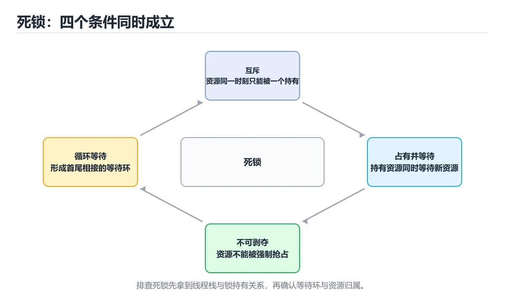
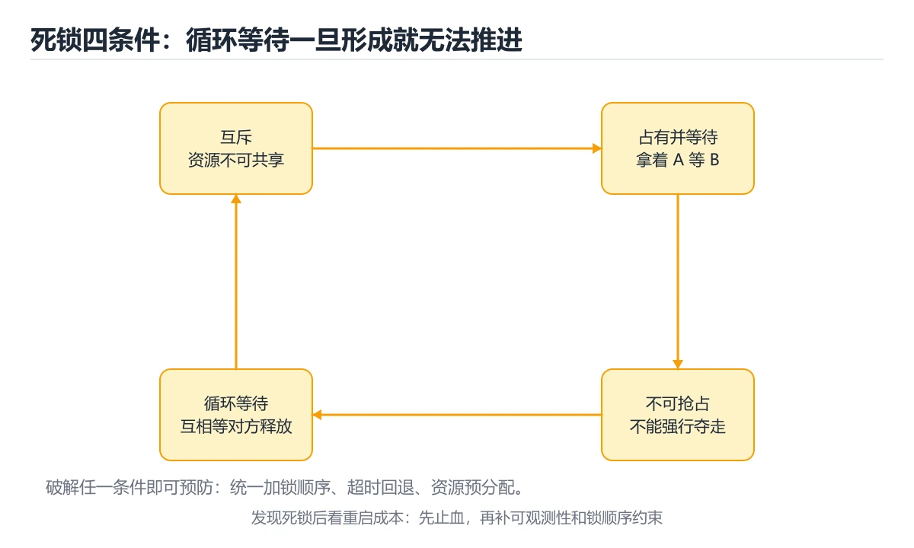
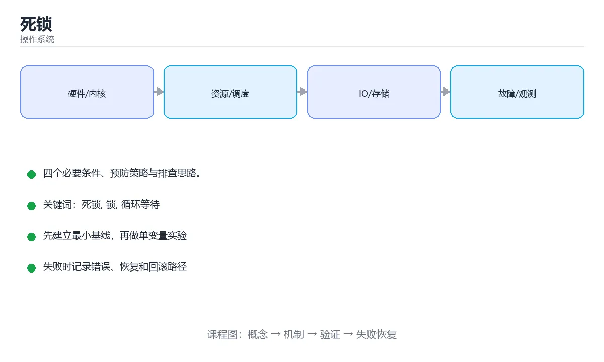

# 死锁







> 内容更新时间：2026-10-06 · 学习阶段：进阶 · 预计用时：40 分钟

## 本节知识框架

**课程定位**：所属分类为「操作系统」，课程主题为「死锁」，学习阶段为「进阶」，建议用时 40 分钟。

**本课要解决的主问题**：四个必要条件、预防策略与排查思路。

| 学习层次 | 要回答的问题 | 完成判据 |
| --- | --- | --- |
| 概念层 | 「死锁」有哪些必须区分的对象与术语？ | 能用自己的话定义核心术语，并各举一个正例和一个反例。 |
| 机制层 | 这些对象按什么顺序发生作用，输入如何变成输出？ | 能画出或写出机制步骤，并说明每一步的失败条件。 |
| 应用层 | 什么场景适合使用「死锁」，什么场景不适合？ | 能给出一个真实场景、一个最小示例和一个边界案例。 |
| 性能层 | 时间、空间、吞吐或延迟受哪些量影响？ | 能说出复杂度或性能瓶颈的证据来源；没有证据时明确写“材料未提供”。 |
| 复习层 | 怎样确认自己不是只记住了结论？ | 能独立完成本课自测，并把错误定位到概念、机制、示例或边界。 |

### 阅读路线

1. 先读「核心概念定义」，建立「死锁」等对象的精确定义。
2. 再读「原理与运行机制」，把定义串成可重复的过程。
3. 用「代码/协议/SQL 示例」验证过程，并只改一个条件观察结果变化。
4. 最后检查性能、易错点、知识关系与自测题，形成可复习的证据链。

**前置知识**：《进程调度》

**学习位置**：本课位于《进程与线程入门》之后；如果前一课的自测不能通过，应先回补再继续。

**后续衔接**：下一课《虚拟内存与分页》会继续使用本课术语，学完后建议立即完成一次自测。

**教材衔接：学习目标**

- 能用自己的话解释死锁解决了什么问题，而不是只背术语。
- 能说清 死锁、「锁」、「循环等待」、「加锁顺序」 之间的关系，并分别举出一个例子。
- 能把 死锁 放回「死锁」的知识体系，说明它和 锁 的边界。
- 能完成本课练习，并用验收标准检查自己的结果。

> 一句话摘要：四个必要条件、预防策略与排查思路。

**教材衔接：前置知识**

- 先完成上一课《进程调度》；如果已经掌握，可以直接用本课练习自测。
- 本课阶段：进阶。建议先完成「进程调度」，或确认自己能独立跑通正文里的 order_violations 示例。
- 开始前先复习：死锁、锁、循环等待。
- 如果 什么是死锁 这一步看不懂，先记录具体卡点，再用 order_violations 复现一遍。

**教材衔接：本课小结**

死锁不是「运气不好」，而是加锁顺序不一致的必然结果。团队中约定统一的加锁顺序，能消除大部分死锁。

## 核心概念定义

> 在阅读《死锁》时，术语第一次出现先给操作性定义，再给边界；正文说法与这里冲突时，以定义和可复现示例为准。

| 术语 | 操作性定义 | 本课中的边界 |
| --- | --- | --- |
| timeout | 使用 timeout 尝试加锁，失败就释放已有资源重试。 | 仅在「死锁」明确给出的输入、版本与资源条件下成立。 |
| jstack | 导出线程栈（Java 的 jstack、Linux 的 gdb 或 pstack）。 | 仅在「死锁」明确给出的输入、版本与资源条件下成立。 |
| BLOCKED | 搜索 BLOCKED / waiting to lock 关键字。 | 仅在「死锁」明确给出的输入、版本与资源条件下成立。 |
| 死锁 | 多个执行单元互相等待对方持有的资源，导致都无法继续。 | 仅在「死锁」明确给出的输入、版本与资源条件下成立。 |

### 定义如何使用

在「死锁」中判断一个说法是否成立，先确认它使用的是哪个对象的定义，再检查输入规模、运行环境与失败路径。定义不是口号，而是后续推导、代码示例和自测题共享的约束。

## 原理与运行机制

### 机制总览

1. **建立输入**：把「timeout」按本课定义整理成可观察、可重复的输入条件。
2. **执行转换**：围绕「jstack」执行本课的核心步骤；每一步都记录中间状态，避免只看最终输出。
3. **产生输出**：得到「BLOCKED」后，用正文示例或协议/SQL 结果核对输出是否符合预期。
4. **改变一个条件**：只替换一个边界条件或环境参数，观察「死锁」的结论是否仍然成立。

| 阶段 | 关注对象 | 失败时应检查 |
| --- | --- | --- |
| 输入 | timeout | 类型、范围、编码、版本或前置状态是否满足定义。 |
| 处理 | jstack | 顺序、可见性、锁、路由、事务或调度规则是否被破坏。 |
| 输出 | BLOCKED | 结果是否可复现，错误是否被正确传播而不是被吞掉。 |

本课的机制结论要用「死锁」自己的示例验证。「死锁」没有给出某个数量级、吞吐或内存数据时，本课把该判断标为“材料未提供”，不从相邻主题外推。

**教材衔接：产生死锁的四个必要条件**

1. **互斥**：资源同一时刻只能被一个线程占用。
2. **持有并等待**：持有资源的同时等待其他资源。
3. **不可剥夺**：资源只能由持有者主动释放。
4. **循环等待**：存在一条线程与资源的环形等待链。

四个条件同时满足才可能死锁，因此**破坏任意一个**就能避免死锁。

**教材衔接：检测与恢复**

数据库等系统会维护「等待图」，检测到环后选择一个事务回滚，从而打破循环。这也是 MySQL 报出 `Deadlock found when trying to get lock` 的原因。

**教材衔接：排查建议**

1. 导出线程栈（Java 的 `jstack`、Linux 的 `gdb` 或 `pstack`）。
2. 搜索 `BLOCKED` / `waiting to lock` 关键字。
3. 定位持锁线程的调用链，检查加锁顺序。

**教材衔接：四个必要条件速查**

| 条件 | 含义 | 破坏方式 |
| --- | --- | --- |
| 互斥 | 资源同一时刻只能被一个进程占用 | 用可共享资源或无锁结构 |
| 占有并等待 | 持有资源同时等待其他资源 | 一次性申请全部资源 |
| 不可抢占 | 资源只能主动释放 | 允许抢占或超时释放 |
| 循环等待 | 存在进程与资源的等待环 | 统一加锁顺序 |

## 典型应用场景

| 场景 | 典型输入或前提 | 期望产物 |
| --- | --- | --- |
| 学习验证 | 使用本课最小示例和 死锁、锁 | 能复现正文结论，并解释每一步。 |
| 工程落地 | 把「死锁」放入真实模块或服务边界 | 输出可观测、失败可定位、参数可配置。 |
| 故障排查 | 只改一个版本、规模、输入或依赖条件 | 能区分概念错误、实现错误和环境差异。 |

判断「死锁」的场景是否成立，标准是能否写出输入、处理、输出和失败路径；材料中没有出现的数据在本课标注为“材料未提供”，不用推测替代证据。

## 代码/协议/SQL 示例

以下代码、协议或 SQL 片段来自《死锁》原文，保留原有语言标记与上下文；先预测《死锁》示例的输出，再按正文步骤运行或推演，示例依赖外部环境时同时记录版本与输入。

**教材衔接：什么是死锁**

两个或多个线程互相持有对方需要的资源，又都在等待对方释放，于是永远阻塞。

```text
线程 A 持有锁 1，等待锁 2
线程 B 持有锁 2，等待锁 1
        ↓
     互相等待，永不结束
```

**教材衔接：代码示例**

```python
import threading

lock_a = threading.Lock()
lock_b = threading.Lock()

def task_one():
    with lock_a:
        print("任务一拿到 A，等待 B")
        with lock_b:              # 可能与任务二互相等待
            print("任务一拿到 B")

def task_two():
    with lock_b:
        print("任务二拿到 B，等待 A")
        with lock_a:
            print("任务二拿到 A")
```

**教材衔接：预防策略**

**统一加锁顺序**是最简单有效的办法：

```python
# 所有线程都先拿 A 再拿 B，循环等待被破坏
def task_two_fixed():
    with lock_a:
        with lock_b:
            print("不再死锁")
```

其他策略：

- 使用 `timeout` 尝试加锁，失败就释放已有资源重试。
- 用无锁数据结构或消息传递替代共享内存。
- 银行家算法等死锁避免算法（理论价值大于工程价值）。

## 时间/空间复杂度或性能分析

**复杂度证据**：「死锁」的现有材料没有给出渐近时间或空间复杂度的明确结论，本课只做定性检查，不补写未经验证的 $O$ 记号。

| 维度 | 本课关注点 | 判断依据 |
| --- | --- | --- |
| 时间/延迟 | 「死锁」的主要步骤是否会随输入规模、并发度或网络往返增长。 | 以正文复杂度、基准数据或可重复测量为准。 |
| 空间/内存 | 中间状态、缓存、副本、连接或索引是否随规模增长。 | 记录峰值内存与数据副本，不只看最终结果。 |
| 吞吐/资源 | 版本、调度、锁、IO、序列化或协议开销是否成为瓶颈。 | 固定环境做对照实验，改变一个变量。 |

评估「死锁」时要区分“正确性成立”和“性能达标”两件事；材料没有给出基准时，本课只保留量级来源与测量方法，不写不可验证的绝对数字。

## 常见误区与易错点

> 复核《死锁》的易错点时，优先保留原文的错误表、故障现场与排错路径；每条修正都要能用本课示例复验。

| 易错点 | 常见表现 | 正确做法 |
| --- | --- | --- |
| 只背结论 | 能复述「死锁」的定义，却说不清输入、输出与边界。 | 回到机制步骤，用最小示例逐一验证。 |
| 混淆相邻概念 | 把本课对象与相邻主题的对象当成同一类。 | 先比较定义、资源归属、生命周期和失败模式。 |
| 忽略版本与环境 | 在开发机通过后直接外推到生产环境。 | 固定版本、输入和资源条件，再记录可复现结果。 |

**教材衔接：常见错误与排查**

| 容易踩的做法 | 实际现象 | 原因与正确做法 |
| --- | --- | --- |
| 加锁顺序不统一 | 偶发死锁 | 全局固定顺序或用有序锁封装 |
| 嵌套加锁且持有时做耗时操作 | 锁等待时间变长 | 只锁临界区，耗时操作移到锁外 |
| 无超时获取锁 | 永久阻塞 | `tryLock` 带超时并重试或放弃 |
| 锁内调用外部服务 | 事务与锁时间不可控 | 外部调用放锁外 |
| 只靠人工排查 | 定位困难 | 记录锁持有者与等待链 |
| 数据库死锁不重试 | 请求失败 | 捕获死锁错误并有限重试 |
| 认为加锁越多越安全 | 并发度骤降 | 减少共享状态与锁粒度 |
| 忽略锁顺序在重构中被破坏 | 新代码引入死锁 | 封装加锁接口并加静态检查 |
| 忘记释放锁 | 其他线程永久等待 | 用 `with`/RAII 自动释放 |
| 单实例资源图结论套用到多实例 | 误判死锁 | 多实例需结合可用数量判断 |

**教材衔接：故障现场**

### 现场 1：嵌套加锁且持有时做耗时操作

**症状**：在《死锁》的复现场景中，锁等待时间变长。

**根因**：触发点是把“嵌套加锁且持有时做耗时操作”当成安全做法。它没有满足《死锁》要求的前提，因此先表现为“锁等待时间变长”；排查时先完整复现这一段，再核对输入、配置与依赖。

**修复**：针对《死锁》的问题，只锁临界区，耗时操作移到锁外。

**验证**：保留《死锁》里触发“锁等待时间变长”的输入、版本和日志，按“只锁临界区，耗时操作移到锁外”完成修改后原样重放；只有失败现象消失且相邻场景仍可解释，才保留改动。

### 现场 2：锁内调用外部服务

**症状**：在《死锁》的复现场景中，事务与锁时间不可控。

**根因**：触发点是把“锁内调用外部服务”当成安全做法。它没有满足《死锁》要求的前提，因此先表现为“事务与锁时间不可控”；排查时先完整复现这一段，再核对输入、配置与依赖。

**修复**：针对《死锁》的问题，外部调用放锁外。

**验证**：保留《死锁》里触发“事务与锁时间不可控”的输入、版本和日志，按“外部调用放锁外”完成修改后原样重放；只有失败现象消失且相邻场景仍可解释，才保留改动。

### 现场 3：忽略锁顺序在重构中被破坏

**症状**：在《死锁》的复现场景中，新代码引入死锁。

**根因**：触发点是把“忽略锁顺序在重构中被破坏”当成安全做法。它没有满足《死锁》要求的前提，因此先表现为“新代码引入死锁”；排查时先完整复现这一段，再核对输入、配置与依赖。

**修复**：针对《死锁》的问题，封装加锁接口并加静态检查。

**验证**：在《死锁》中按“封装加锁接口并加静态检查”调整后，从“忽略锁顺序在重构中被破坏”的触发条件重放同一条路径，确认“新代码引入死锁”不再出现，并补一个相邻边界用例检查没有引入新问题。

## 与其他知识点的关系

| 关系 | 课程 | 为什么 |
| --- | --- | --- |
| 先修 | 《进程调度》 | 本课会直接使用它的概念或操作前提。 |
| 关联 | 《虚拟内存与分页》 | 用于横向比较或把本课结论迁移到相邻主题。 |
| 关联 | 《MySQL 锁与 MVCC》 | 用于横向比较或把本课结论迁移到相邻主题。 |
| 前置顺序 | 《进程与线程入门》 | 同分类中安排在本课之前，建议先完成其自测。 |
| 后续顺序 | 《虚拟内存与分页》 | 同分类中安排在本课之后，会继续使用本课术语。 |

把「死锁」放回知识体系时，不只要记住“前面学过什么”，还要说明两个主题在输入、机制、资源边界和失败模式上的差异。这样才能把单课知识迁移到项目、排障和后续课程。

**教材衔接：处理策略对照**

| 策略 | 做法 | 代价 |
| --- | --- | --- |
| 预防 | 破坏四个条件之一 | 资源利用率下降 |
| 避免 | 银行家算法等动态检查 | 需预知最大需求 |
| 检测与恢复 | 定期查环并回滚 | 实现复杂、有额外开销 |
| 忽略 | 假设不会发生 | 一旦发生需人工干预 |

```python
import threading
import time
from contextlib import contextmanager

class OrderedLocks:
    """按全局固定顺序加锁，破坏循环等待条件。"""

    def __init__(self, count: int):
        self.locks = [threading.Lock() for _ in range(count)]
        self.order_violations = 0

    @contextmanager
    def acquire(self, *indexes):
        ordered = sorted(indexes)                 # 统一按编号升序
        if list(indexes) != ordered:
            self.order_violations += 1            # 记录违规调用便于修复
        for index in ordered:
            self.locks[index].acquire()
        try:
            yield
        finally:
            for index in reversed(ordered):
                self.locks[index].release()

def try_lock_all(locks, timeout: float = 0.5) -> bool:
    """尝试一次性获取全部锁，超时则全部释放并重试。"""
    acquired = []
    deadline = time.monotonic() + timeout
    try:
        for lock in locks:
            remaining = deadline - time.monotonic()
            if remaining <= 0 or not lock.acquire(timeout=remaining):
                return False
            acquired.append(lock)
        return True
    finally:
        if len(acquired) != len(locks):
            for lock in acquired:
                lock.release()
            acquired.clear()

def wait_for_graph(graph: dict) -> list:
    """检测资源分配图中的环，返回构成环的进程链。"""
    visited, stack, path = set(), set(), []

    def dfs(node):
        if node in stack:
            return path[path.index(node):] + [node]
        if node in visited:
            return []
        visited.add(node)
        stack.add(node)
        path.append(node)
        for nxt in graph.get(node, []):
            cycle = dfs(nxt)
            if cycle:
                return cycle
        stack.discard(node)
        path.pop()
        return []

    for node in graph:
        cycle = dfs(node)
        if cycle:
            return cycle
    return []

print(wait_for_graph({"P1": ["P2"], "P2": ["P3"], "P3": ["P1"]}))
```

**教材衔接：复习与迁移**

复习目标：把「死锁」的判断标准放回可复现的例子里。先自己作答，再对照依据；如果结论正确但理由不完整，回到正文补足前提。

### 概念复述

- 用一句话说明「死锁」解决什么问题：四个必要条件、预防策略与排查思路。
- 写出死锁、锁、循环等待之间的关系，并各举一个例子。
- 说出本课最容易混淆的两个概念，以及区分它们的判据。

### 正文逐节复核

- **产生死锁的四个必要条件**：四个条件同时满足才可能死锁，因此**破坏任意一个**就能避免死锁。

### 测验回顾

1. 围绕“死锁”中的 死锁、锁、循环等待，下列哪两项是本课强调的实践判断？
   - 依据：题干的正确项是验证 锁 时要固定版本并覆盖边界输入，结论才可复现。学习 死锁 时要同时说明输入、输出和失败路径，不能只看正常流程。回到「死锁」的正文示例，用“围绕死锁中的 死锁、锁、循环等待”走一遍死锁、锁、循环等待的完整流程，能复现的结论才可以保留。回到正文示例，用“围绕中的”走一遍死锁、锁、循环等待的完整流程，能复现的结论才可以保留。
2. 下面这段 Python 代码摘自「死锁」的正文示例。关于这段代码，下面哪一项说法与实际内容相符？
   - 依据：在「死锁」里，题干的正确项是这段代码会产生可观察的输出，运行后能看到结果，在「死锁」里要结合死锁核对输出是否符合预期。回到「死锁」的正文示例，用“下面这段 Python 代码摘自死锁”走一遍死锁、锁、循环等待的完整流程，能复现的结论才可以保留。回到正文示例，用“下面这段”走一遍死锁、锁、循环等待的完整流程，能复现的结论才可以保留。
3. 数据库检测到死锁后，通常采取什么措施？
   - 依据：数据库通过等待图检测环，选择代价较小的事务回滚，使其他事务可以继续执行。把“回滚其中一个事务以打破循环”代回「死锁」里“数据库检测到死锁后”的例子核对，条件一旦改变，结论就要用死锁、锁、循环等待重新推导。回到死锁、锁、循环等待本身再看一遍：只有“回滚其中一个事务以打破循环”与题干“数据库检测到后”的前提一致，结论才成立。
4. 银行家算法属于死锁的哪种处理策略？
   - 依据：题干的正确项是死锁避免（分配前检查系统是否仍处于安全状态）。它需要预知最大资源需求，实际系统中较少使用，但有重要的理论意义。“银行家算法属于的哪种处理策略”与术语表相呼应，只有符合死锁、锁、循环等待约束的“死锁避免（分配前检查系统是否仍处于安全状”才是正文支持的结论。“银行家算法属于的哪种处理策略”与「死锁」的术语表相呼应，只有符合死锁、锁、循环等待约束的“死锁避免（分配前检查系统是否仍处于安全状”才是正文支持的结论。
5. 资源分配图中出现环是否一定意味着死锁？
   - 依据：在「死锁」里，每种资源只有一个实例时是充分必要条件；多实例时只是必要条件。多实例时只是必要条件」。多实例时只是必要条件，本课在什么是死锁中说明：两个或多个线程互相持有对方需要的资源，又都在等待对方释放，于是永远阻塞。多实例时只是必要条件，本课在预防策略中说明：使用 timeout 尝试加锁，失败就释放已有资源重试。
6. 补全代码：「死锁」示例中，下面这行代码缺少哪个关键字或函数名？请填入 ____。

`____ = deadline - time.monotonic`
   - 依据：题干的正确项是remaining。回到「死锁」的正文示例，用“补全代码”走一遍死锁、锁、循环等待的完整流程，能复现的结论才可以保留。在「死锁」里判断这道题，要把死锁、锁、循环等待的条件、过程与失败路径逐项对齐，换成“remaining”这个场景，只有满足前提的结论才成立。回到正文示例，用“remaining”走一遍死锁、锁、循环等待的完整流程，能复现的结论才可以保留。

### 迁移练习

把「死锁」的结论迁移到相邻主题，每次迁移都写清预测与证据：

1. 换输入：用死锁处理一组你自己的数据，对比教材示例的结果差异。
2. 换失败条件：制造一个锁相关的错误，说明如何从错误信息定位根因。
3. 换规模：把数据量或并发度提高一个数量级，说明「死锁」的结论是否仍成立。

## 自测题与参考答案

> 先独立完成《死锁》的自测，再核对答案与解析。答案必须能在本课正文或示例中找到依据，不能只凭语感。

### 自测 1

围绕“死锁”中的 死锁、锁、循环等待，下列哪两项是本课强调的实践判断？

A. 只要 死锁 的常规示例通过，就可以跳过边界与异常路径
B. 验证 锁 时要固定版本并覆盖边界输入，结论才可复现
C. 把 锁 的单次运行结果当成所有版本和规模都成立
D. 学习 死锁 时要同时说明输入、输出和失败路径，不能只看正常流程

**参考答案**：验证 锁 时要固定版本并覆盖边界输入，结论才可复现；学习 死锁 时要同时说明输入、输出和失败路径，不能只看正常流程

**解析**：题干的正确项是验证 锁 时要固定版本并覆盖边界输入，结论才可复现。学习 死锁 时要同时说明输入、输出和失败路径，不能只看正常流程。回到「死锁」的正文示例，用“围绕死锁中的 死锁、锁、循环等待”走一遍死锁、锁、循环等待的完整流程，能复现的结论才可以保留。回到正文示例，用“围绕中的”走一遍死锁、锁、循环等待的完整流程，能复现的结论才可以保留。

### 自测 2

下面这段 Python 代码摘自「死锁」的正文示例。关于这段代码，下面哪一项说法与实际内容相符？

```python
# 所有线程都先拿 A 再拿 B，循环等待被破坏 def task_two_fixed(): with lock_a: with lock_b: print("不再死锁")
```

A. 这段代码只做静态声明，没有循环、分支或可观察输出。
B. 这段代码会产生可观察的输出，运行后能看到结果。
C. 这段代码包含异常处理分支，失败时会走专门的补救路径。
D. 这段代码会读取外部输入，结果依赖传入的数据。

**参考答案**：这段代码会产生可观察的输出，运行后能看到结果。

**解析**：在「死锁」里，题干的正确项是这段代码会产生可观察的输出，运行后能看到结果，在「死锁」里要结合死锁核对输出是否符合预期。回到「死锁」的正文示例，用“下面这段 Python 代码摘自死锁”走一遍死锁、锁、循环等待的完整流程，能复现的结论才可以保留。回到正文示例，用“下面这段”走一遍死锁、锁、循环等待的完整流程，能复现的结论才可以保留。

### 自测 3

数据库检测到死锁后，通常采取什么措施？

A. 等待自动恢复，但这无法保证正确性
B. 重启服务器
C. 删除相关表
D. 回滚其中一个事务以打破循环

**参考答案**：回滚其中一个事务以打破循环

**解析**：数据库通过等待图检测环，选择代价较小的事务回滚，使其他事务可以继续执行。把“回滚其中一个事务以打破循环”代回「死锁」里“数据库检测到死锁后”的例子核对，条件一旦改变，结论就要用死锁、锁、循环等待重新推导。回到死锁、锁、循环等待本身再看一遍：只有“回滚其中一个事务以打破循环”与题干“数据库检测到后”的前提一致，结论才成立。

**教材衔接：复习与自测**

- [ ] 能背出死锁的四个必要条件。
- [ ] 会用固定加锁顺序或一次性申请来预防。
- [ ] 加锁都有超时与释放保障。
- [ ] 会用等待图或 `jstack` 等工具检测死锁。
- [ ] 数据库死锁有重试与监控。

**教材衔接：动手练习**

> 本课练习重点：围绕「死锁、锁、循环等待」完成复述、实验和交付，每个结果都要能被别人检查。

为 order_violations 画一张状态图，标出竞争与阻塞发生的时刻。

### 练习 1：建立心智模型（10 分钟）

合上教程，用 3～5 句话回答：

1. 死锁解决了什么问题？
2. 如果没有它，会出现什么具体后果？
3. 它和「锁」是什么关系？

验收标准：用自己的话解释 死锁，并给出一个它不成立的反例。

### 练习 2：做一次可控实验（20 分钟）

从正文中选一个最小示例，完成以下操作：

1. 先预测修改一个参数、输入或步骤后的结果。
2. 再实际执行或逐步推演，记录真实结果。
3. 如果结果与预测不同，写出差异原因。

**验收标准**：用 order_violations 复现原例后，把锁改成边界值，五步记录缺一不可，其中「原因」一栏要写明「死锁」里哪条规则被触发。

### 练习 3：交付一个小结果（30 分钟）

用伪代码模拟一次 死锁 的调度或资源分配，记录至少 5 个状态变化。

任务要求：

- 结果必须能被别人检查，不能只写“我已经理解了”。
- 至少覆盖死锁和「锁」两个关键词。
- 写出 1 个仍然不确定的问题，以及下一步如何验证。

> 提示：时间有限时优先做练习 1 和练习 2；练习 3 可以拆成两次完成。

**教材衔接：可运行练习**

### 任务 1：先跑通，再解释

```python
import threading

lock_a = threading.Lock()
lock_b = threading.Lock()

def task_one():
    with lock_a:
        print("任务一拿到 A，等待 B")
        with lock_b:              # 可能与任务二互相等待
            print("任务一拿到 B")

def task_two():
    with lock_b:
        print("任务二拿到 B，等待 A")
        with lock_a:
            print("任务二拿到 A")
```

**预期输出**：任务二拿到 A

### 任务 2：只改一个条件

把「死锁」的最小示例复制一份，只改一个条件再跑一次：

- 改动点：只调整 order_violations 的一个参数，其余条件一律不动。
- 预测：先写下「死锁」在改动后的输出或错误信息，再运行。
- 记录：对照改动前后的结果，指出差异出在哪一步。
- 验收：换回原条件能复现原结果，改动只影响死锁。

### 任务 3：迁移到自己的数据

用同一套思路处理一组你自己的 死锁 数据，保持输出格式与任务 1 一致。

**教材衔接：本课复习清单**

离开本课前，逐项确认：

- [ ] 不看解析，能说出「下面哪一项不是产生死锁的必要条件？」的判断依据。
- [ ] 不看解析，能说出「避免死锁最简单有效的工程做法是？」的判断依据。
- [ ] 不看解析，能说出「数据库检测到死锁后，通常采取什么措施？」的判断依据。
- [ ] 不看解析，能说出「银行家算法属于死锁的哪种处理策略？」的判断依据。
- [ ] 不看解析，能说出「资源分配图中出现环是否一定意味着死锁？」的判断依据。
- [ ] 跑通「死锁」的最小示例，并记录一次失败输入的处理方式。
- [ ] 把本课最容易混淆的两个概念写成一句话对照。

| 复盘项 | 记录 |
| --- | --- |
| 已经能独立解释的考点 |  |
| 仍然说不清的概念 |  |
| 下一步验证动作 |  |

---

## 术语速查

| 术语 | 一句话说明 |
| --- | --- |
| `timeout` | 使用 `timeout` 尝试加锁，失败就释放已有资源重试。 |
| `jstack` | 导出线程栈（Java 的 `jstack`、Linux 的 `gdb` 或 `pstack`）。 |
| `BLOCKED` | 搜索 `BLOCKED` / `waiting to lock` 关键字。 |
| `死锁` | 多个执行单元互相等待对方持有的资源，导致都无法继续。 |

## 考点精讲

### 考点 1：多选辨析·死锁

- **题目**：围绕“死锁”中的 死锁、锁、循环等待，下列哪两项是本课强调的实践判断？
- **判断依据**：题干的正确项是验证 锁 时要固定版本并覆盖边界输入，结论才可复现。学习 死锁 时要同时说明输入、输出和失败路径，不能只看正常流程。回到「死锁」的正文示例，用“围绕死锁中的 死锁、锁、循环等待”走一遍死锁、锁、循环等待的完整流程，能复现的结论才可以保留。回到正文示例，用“围绕中的”走一遍死锁、锁、循环等待的完整流程，能复现的结论才可以保留。

### 考点 2：代码补全·死锁

- **题目**：下面这段 Python 代码摘自「死锁」的正文示例。关于这段代码，下面哪一项说法与实际内容相符？
- **判断依据**：在「死锁」里，题干的正确项是这段代码会产生可观察的输出，运行后能看到结果，在「死锁」里要结合死锁核对输出是否符合预期。回到「死锁」的正文示例，用“下面这段 Python 代码摘自死锁”走一遍死锁、锁、循环等待的完整流程，能复现的结论才可以保留。回到正文示例，用“下面这段”走一遍死锁、锁、循环等待的完整流程，能复现的结论才可以保留。

### 考点 3：概念判断·死锁

- **题目**：数据库检测到死锁后，通常采取什么措施？
- **判断依据**：数据库通过等待图检测环，选择代价较小的事务回滚，使其他事务可以继续执行。把“回滚其中一个事务以打破循环”代回「死锁」里“数据库检测到死锁后”的例子核对，条件一旦改变，结论就要用死锁、锁、循环等待重新推导。回到死锁、锁、循环等待本身再看一遍：只有“回滚其中一个事务以打破循环”与题干“数据库检测到后”的前提一致，结论才成立。

### 考点 4：概念判断·死锁

- **题目**：银行家算法属于死锁的哪种处理策略？
- **判断依据**：题干的正确项是死锁避免。它需要预知最大资源需求，实际系统中较少使用，但有重要的理论意义。“银行家算法属于的哪种处理策略”与术语表相呼应，只有符合死锁、锁、循环等待约束的“死锁避免（分配前检查系统是否仍处于安全状”才是正文支持的结论。“银行家算法属于的哪种处理策略”与「死锁」的术语表相呼应，只有符合死锁、锁、循环等待约束的“死锁避免（分配前检查系统是否仍处于安全状”才是正文支持的结论。

### 考点 5：概念判断·死锁

- **题目**：资源分配图中出现环是否一定意味着死锁？
- **判断依据**：在「死锁」里，每种资源只有一个实例时是充分必要条件；多实例时只是必要条件。多实例时只是必要条件」。多实例时只是必要条件，本课在什么是死锁中说明：两个或多个线程互相持有对方需要的资源，又都在等待对方释放，于是永远阻塞。多实例时只是必要条件，本课在预防策略中说明：使用 timeout 尝试加锁，失败就释放已有资源重试。

### 考点 6：填空·死锁

- **题目**：补全代码：「死锁」示例中，下面这行代码缺少哪个关键字或函数名？请填入 ____。 `____ = deadline - time.monotonic`
- **判断依据**：题干的正确项是remaining。回到「死锁」的正文示例，用“补全代码”走一遍死锁、锁、循环等待的完整流程，能复现的结论才可以保留。在「死锁」里判断这道题，要把死锁、锁、循环等待的条件、过程与失败路径逐项对齐，换成“remaining”这个场景，只有满足前提的结论才成立。回到正文示例，用“remaining”走一遍死锁、锁、循环等待的完整流程，能复现的结论才可以保留。

## English Overview

**Title:** Deadlock

**Summary:** Four necessary conditions, prevention and diagnosis.

**Category:** Operating Systems
**Level:** 进阶
**Key terms:** 死锁, 锁, 循环等待, 加锁顺序, 线程栈

## 内容元数据

- 内容版本：v2.0
- 最后更新：2026-10-06
- 学习阶段：进阶
- 适用环境：Linux 6.x / POSIX
；本课聚焦 死锁。
- 内容来源：内置结构化课程与工程实践整理
- 相关主题：死锁、锁、循环等待、加锁顺序、线程栈
- 质量版本：P0 测验标准 + P1 覆盖扩展 + P2 体验补全

## 参考资料与复核

- 最后复核：2026-10-04
- 下次复核：2027-07-24
- 复核范围：版本兼容、API 行为、安全建议与工程实践
- 来源性质：官方文档、标准或权威教材；正文为离线教学重组

| 参考资料 | 本课用途 |
| --- | --- |
| [GNU C Library](https://www.gnu.org/software/libc/manual/) | 进程、线程与系统接口 |
| [POSIX 标准](https://pubs.opengroup.org/onlinepubs/9799919799/) | 可移植操作系统接口 |
| [Linux man-pages](https://man7.org/linux/man-pages/) | 系统调用与用户态接口 |

> 「死锁」的链接用于离线阅读后的延伸核对；App 不会自动联网。
