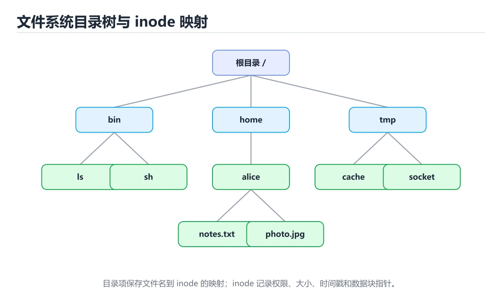
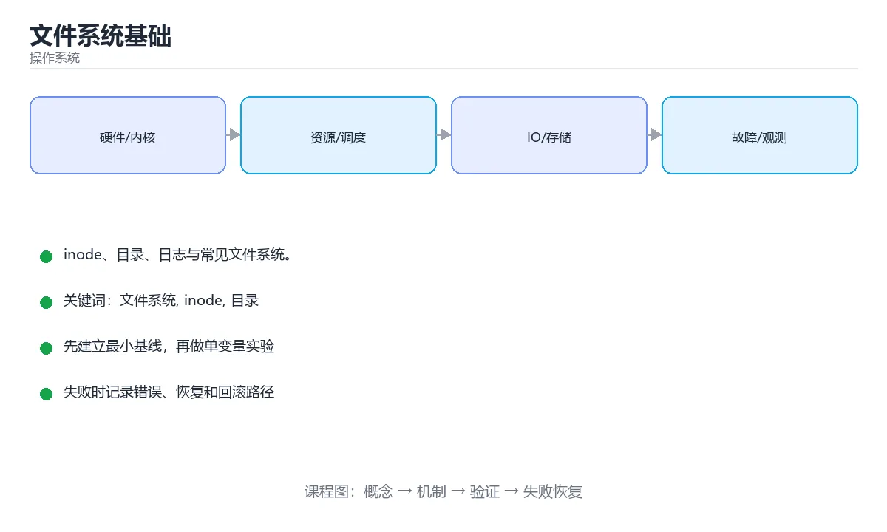

# 文件系统基础





> 内容更新时间：2026-10-03 · 学习阶段：高级 · 预计用时：13 分钟

## 学习目标

- 能用自己的话解释「文件系统基础」解决了什么问题，而不是只背术语。
- 能说清 「文件系统」、「inode」、「目录」、「日志」 之间的关系，并分别举出一个例子。
- 能把本课知识放回「操作系统」的知识体系，说明它和相邻主题的边界。
- 能完成本课练习，并用验收标准检查自己的结果。

> 一句话摘要：inode、目录、日志与常见文件系统。

## 前置知识

- 先完成上一课《虚拟内存与分页》；如果已经掌握，可以直接用本课练习自测。
- 本课阶段：高级。建议具备同一方向的完整基础，能阅读较长的代码、配置或系统设计说明。
- 开始前先复习：文件系统、inode、目录。
- 如果某一步看不懂，先记录具体卡点，完成练习后再回头读一遍。


## 文件系统做什么

文件系统把块设备抽象成文件与目录，负责：空间分配、目录管理、权限控制、崩溃恢复与缓存。

## inode 与元数据

- **inode**：保存文件的元数据（大小、权限、时间戳、数据块位置），不含文件名。
- **目录项**：文件名到 inode 的映射。
- **数据块**：真正存放文件内容的磁盘块。

```text
目录项 "report.txt" -> inode #12345 -> [块 100, 块 101, 块 210]
```

硬链接是多个文件名指向同一 inode；符号链接是保存目标路径的独立文件。

## 常见文件系统

| 系统 | 特点 |
| --- | --- |
| ext4 | Linux 主流，稳定成熟，支持日志 |
| XFS | 大文件与高并发表现好 |
| Btrfs / ZFS | 支持快照、校验和、压缩 |
| NTFS | Windows 主流，支持权限与日志 |
| APFS | macOS，支持写时复制与快照 |
| FAT32 / exFAT | U 盘通用，能力有限 |

## 日志与一致性

断电时正在写的数据可能只写了一半。日志（journaling）先把元数据操作写入日志区，再真正落盘，崩溃后可重放或回滚，避免文件系统结构损坏。

```text
1. 写日志（intent）
2. 提交日志
3. 写入实际位置（checkpoint）
```

## 常用命令

```bash
df -h                       # 磁盘使用情况
du -sh *                    # 各目录占用
ls -li                      # 查看 inode 号
stat file.txt               # 查看元数据
mount | column -t           # 查看挂载
tune2fs -l /dev/sda1        # ext4 参数
```

## 性能与选型建议

1. 大量小文件会放大元数据开销，考虑打包或分片。
2. 日志型应用关注 fsync 策略：每次写都 fsync 安全但慢。
3. 顺序读写远快于随机读写，机械盘尤其明显。
4. 容器场景用 OverlayFS，注意写时复制的性能特征。

## 本课小结
文件系统 = **inode + 目录 + 数据块 + 日志**。排查磁盘问题时，先看 `df`（空间）、再看 `du`（占用）、最后看 `stat`（元数据）。


## 文件系统对照

| 文件系统 | 平台 | 特点 |
| --- | --- | --- |
| ext4 | Linux | 日志、成熟稳定、支持大文件 |
| XFS | Linux | 大文件与高并发写入好 |
| Btrfs / ZFS | Linux | 快照、校验、卷管理 |
| NTFS | Windows | 日志、权限、压缩 |
| APFS | macOS | 写时复制、快照、加密 |
| FAT32 | 跨平台 | 兼容好、单文件 4GB 上限 |
| tmpfs | Linux | 内存文件系统，重启即失 |

## 元数据与结构速查

| 概念 | 说明 |
| --- | --- |
| inode | 存放元数据与数据块指针，不含文件名 |
| 目录项 | 文件名到 inode 的映射 |
| 数据块 | 实际数据存储单位，常见 4KB |
| 超级块 | 文件系统整体信息 |
| 日志（journal） | 记录元数据变更，崩溃后快速恢复 |
| 挂载点 | 文件系统在目录树中的位置 |
| 硬链接 | 多个名字指向同一 inode |
| 软链接 | 独立文件，内容为目标路径 |

```bash
# 空间与使用情况
df -hT                     # 各挂载点类型与用量
du -sh /var/log/*          # 目录占用排序前几位
df -i                      # inode 使用率（可能 inode 用满而空间未满）

# 文件与目录结构
stat /etc/hosts            # 查看 inode、权限、时间戳
ls -li /etc/hosts          # 查看 inode 编号
find /var -xdev -type f -size +1G   # 找大文件（不跨文件系统）

# 日志与恢复
journalctl -k | grep -i 'ext4\|xfs\|i/o error'
dumpe2fs -h /dev/sda1 | head -20    # ext 系列超级块信息

# 权限与所有权
chmod 640 secret.txt
chown app:app /data
getfacl /data              # 查看 ACL
```

```python
import os
from pathlib import Path
from collections import defaultdict

def disk_usage_report(root: str, top_n: int = 5) -> dict:
    """按目录汇总大小，找出占用最大的若干项。"""
    totals = defaultdict(int)
    for dirpath, _dirnames, filenames in os.walk(root):
        for name in filenames:
            path = Path(dirpath) / name
            try:
                size = path.stat().st_size
            except OSError:
                continue
            parts = path.relative_to(root).parts
            key = parts[0] if len(parts) > 1 else "(files)"
            totals[key] += size
    ordered = sorted(totals.items(), key=lambda item: -item[1])[:top_n]
    return {
        "root": root,
        "top": [(k, round(v / 1024 / 1024, 2)) for k, v in ordered],
        "total_mb": round(sum(totals.values()) / 1024 / 1024, 2),
    }

def can_hardlink(src: str, dst: str) -> bool:
    """硬链接要求同一文件系统。"""
    return os.stat(src).st_dev == os.stat(Path(dst).parent).st_dev

print(disk_usage_report(".").get("top"))
```

## 常见错误对照表

| 容易踩的做法 | 实际现象 | 原因与正确做法 |
| --- | --- | --- |
| 只看 `df` 空间不看 `df -i` | 报「空间不足」但明明有空间 | inode 耗尽，需清理小文件 |
| 删了文件空间没释放 | `df` 没变化 | 文件仍被进程持有，需重启或清空句柄 |
| 认为硬链接能跨文件系统 | 报错 | 跨文件系统用软链接 |
| 删除源文件后软链接仍可用 | 悬空链接 | 软链接保存路径，源删除即失效 |
| 忽略日志轮转 | 磁盘被日志写满 | 配 `logrotate` 或应用级切割 |
| 不做挂载选项调优 | 性能不达标 | 按场景选 `noatime`、`discard` 等 |
| 把 tmpfs 当持久存储 | 重启后数据丢失 | 需要持久化就用真实磁盘 |
| 直接删大目录 | 长时间阻塞 | 用分批删除或工具加速 |
| 忽略 fsync 语义 | 掉电丢数据 | 关键写入显式 `fsync` 并处理错误 |
| 权限用 777 图省事 | 安全风险 | 最小权限 + ACL |

## 自测清单

- [ ] 能说清 inode、目录项与数据块的关系。
- [ ] 知道硬链接与软链接的区别与限制。
- [ ] 会同时检查空间与 inode 使用率。
- [ ] 理解日志文件系统与 fsync 的作用。
- [ ] 有日志轮转与磁盘空间告警。

## 动手练习


> 本课练习重点：围绕「文件系统、inode、目录」完成复述、实验和交付，每个结果都要能被别人检查。

先画出进程、线程或资源状态，再模拟调度与竞争，最后记录状态迁移。

### 练习 1：建立心智模型（10 分钟）

合上教程，用 3～5 句话回答：

1. 「文件系统基础」解决了什么问题？
2. 如果没有它，会出现什么具体后果？
3. 它和「inode」是什么关系？

**验收标准**：至少出现一个本课关键词，并写出一个反例、边界条件或失效场景。

### 练习 2：做一次可控实验（20 分钟）

从正文中选一个最小示例，完成以下操作：

1. 先预测修改一个参数、输入或步骤后的结果。
2. 再实际执行或逐步推演，记录真实结果。
3. 如果结果与预测不同，写出差异原因。

**验收标准**：留下「原例 → 改动 → 预测 → 结果 → 原因」五步记录。

### 练习 3：交付一个小结果（30 分钟）

用伪代码或小脚本模拟一次调度、竞争或资源分配，并记录至少 5 个状态变化。

任务要求：

- 结果必须能被别人检查，不能只写“我已经理解了”。
- 至少覆盖「文件系统」和「inode」两个关键词。
- 写出 1 个仍然不确定的问题，以及下一步如何验证。

> 提示：时间有限时优先做练习 1 和练习 2；练习 3 可以拆成两次完成。


## 可运行练习

下面 3 个任务围绕“文件系统基础”展开，代码可以直接粘贴到 App 的离线沙箱里运行；如果示例会读取标准输入，请按代码注释在沙箱的 stdin 区域填入同样格式的数据。

### 任务 1：先跑通，再解释

```python
import os
from pathlib import Path
from collections import defaultdict

def disk_usage_report(root: str, top_n: int = 5) -> dict:
    """按目录汇总大小，找出占用最大的若干项。"""
    totals = defaultdict(int)
    for dirpath, _dirnames, filenames in os.walk(root):
        for name in filenames:
            path = Path(dirpath) / name
            try:
                size = path.stat().st_size
            except OSError:
                continue
            parts = path.relative_to(root).parts
            key = parts[0] if len(parts) > 1 else "(files)"
            totals[key] += size
    ordered = sorted(totals.items(), key=lambda item: -item[1])[:top_n]
    return {
        "root": root,
        "top": [(k, round(v / 1024 / 1024, 2)) for k, v in ordered],
        "total_mb": round(sum(totals.values()) / 1024 / 1024, 2),
    }

def can_hardlink(src: str, dst: str) -> bool:
    """硬链接要求同一文件系统。"""
    return os.stat(src).st_dev == os.stat(Path(dst).parent).st_dev

print(disk_usage_report(".").get("top"))
```

**预期输出**：运行后会输出与“文件系统基础”相关的关键结果；请重点核对输出行数、最后一个数值和异常提示。

**验收标准**：代码能正常运行；逐行解释每个变量的值如何变化，并指出哪一行决定了最终结果。

### 任务 2：只改一个条件

复制上面的代码，只修改一个输入、边界或参数（例如空值、最大值、循环次数、过滤条件），先写出你的预测，再实际运行。

**验收标准**：留下“原结果 → 改动 → 预测 → 实际结果 → 差异原因”五步记录；如果预测错误，要写出修正后的心智模型。

### 任务 3：迁移到自己的数据

用同一套思路处理一组你自己的数据或场景，保持输出格式与任务 1 一致。

**验收标准**：代码不少于 10 行，至少包含 1 个边界检查；把代码和运行结果保存到笔记或片段库。


## 故障现场

这一节把“文件系统基础”最常见的失败方式还原成现场记录，练习时按“症状 → 复现 → 定位 → 修复 → 预防”的顺序排查。

### 现场 1：“文件系统基础”的 文件系统 常规用例通过，但边界用例失败

**症状**：在“文件系统基础”的练习或生产场景里出现““文件系统基础”的 文件系统 常规用例通过，但边界用例失败”。

**复现**：准备一组最小输入，只保留触发““文件系统基础”的 文件系统 常规用例通过，但边界用例失败”的必要条件，连续运行两次确认结果稳定。

**定位**：围绕“文件系统 的前置条件与取值边界没有写进代码，默认值掩盖了空值和极值”检查调用链、输入数据和环境配置，先验证假设再改代码。

**修复**：为“文件系统基础”补一条空值或极值用例，把前置条件写成断言，并让失败信息直接指出是哪个输入越界

**预防**：把““文件系统基础”的 文件系统 常规用例通过，但边界用例失败”写成一条自动化用例，并在“文件系统基础”的验收清单里保留对应检查项。


### 现场 2：“文件系统基础”的 inode 结果在两次运行之间不一致

**症状**：在“文件系统基础”的练习或生产场景里出现““文件系统基础”的 inode 结果在两次运行之间不一致”。

**复现**：准备一组最小输入，只保留触发““文件系统基础”的 inode 结果在两次运行之间不一致”的必要条件，连续运行两次确认结果稳定。

**定位**：围绕“inode 依赖了当前版本、执行顺序或共享状态，单次运行无法暴露差异”检查调用链、输入数据和环境配置，先验证假设再改代码。

**修复**：固定“文件系统基础”使用的版本与随机种子，记录两次运行的完整输入和输出，再逐项消除非确定性来源

**预防**：把““文件系统基础”的 inode 结果在两次运行之间不一致”写成一条自动化用例，并在“文件系统基础”的验收清单里保留对应检查项。


### 现场 3：程序在开发机很快，换到目标机器后延迟飙升

**症状**：在“文件系统基础”的练习或生产场景里出现“程序在开发机很快，换到目标机器后延迟飙升”。

**复现**：准备一组最小输入，只保留触发“程序在开发机很快，换到目标机器后延迟飙升”的必要条件，连续运行两次确认结果稳定。

**定位**：围绕“调度、缺页、锁竞争与缓存命中率共同变化，文件系统 的局部结论被搬到了完全不同的资源约束下”检查调用链、输入数据和环境配置，先验证假设再改代码。

**修复**：为“文件系统基础”记录 CPU、内存、上下文切换和 I/O 等待指标，用火焰图或采样把瓶颈定位到具体阶段

**预防**：把“程序在开发机很快，换到目标机器后延迟飙升”写成一条自动化用例，并在“文件系统基础”的验收清单里保留对应检查项。


## 考点精讲：把测验题还原成判断过程

本课有 6 个判断点。先自己作答，再看「判断依据」；如果结论正确但理由不完整，回到正文对应章节补足概念。

### 考点 1：inode 中不包含下面哪项信息？

- **正确判断**：文件名
- **判断依据**：文件名保存在目录项中，inode 只记录元数据与数据块位置。其他选项：权限、文件大小与数据块位置都存放在 inode 中。针对「inode 中不包含下面哪项信息，」，本课在「inode 与元数据」中说明：inode：保存文件的元数据（大小、权限、时间戳、数据块位置），不含文件名。本课还在「本课小结」中说明：文件系统 = inode + 目录 + 数据块 + 日志。本课还在「文件系统做什么」中说明：文件系统把块设备抽象成文件与目录，负责：空间分配、目录管理、权限控制、崩溃恢复与缓存。
- **迁移检查**：把题干里的一个条件换成边界值，原来的结论还成立吗？写出判断过程。

### 考点 2：日志文件系统的主要作用是？

- **正确判断**：崩溃后快速恢复一致性
- **判断依据**：正确答案是「崩溃后快速恢复一致性」，本课在「日志与一致性」中说明：日志（journaling）先把元数据操作写入日志区，再真正落盘，崩溃后可重放或回滚，避免文件系统结构损坏。先把元数据操作写入日志，崩溃后可重放或回滚，避免文件系统损坏。本课还在「本课小结」中说明：文件系统 = inode + 目录 + 数据块 + 日志。本课还在「文件系统做什么」中说明：文件系统把块设备抽象成文件与目录，负责：空间分配、目录管理、权限控制、崩溃恢复与缓存。
- **迁移检查**：遮住选项，只根据定义复述一次答案，再回来看哪个选项与复述一致。

### 考点 3：查看磁盘剩余空间的命令是？

- **正确判断**：df -h
- **判断依据**：正确答案是「df -h」，本课在「日志与一致性」中说明：日志（journaling）先把元数据操作写入日志区，再真正落盘，崩溃后可重放或回滚，避免文件系统结构损坏。df 查看文件系统空间，du 查看目录占用。本课还在「本课小结」中说明：排查磁盘问题时，先看 df（空间）、再看 du（占用）、最后看 stat（元数据）。本课还在「inode 与元数据」中说明：inode：保存文件的元数据（大小、权限、时间戳、数据块位置），不含文件名。
- **迁移检查**：把题干里的一个条件换成边界值，原来的结论还成立吗？写出判断过程。

### 考点 4：硬链接与软链接的区别是？

- **正确判断**：硬链接指向同一 inode 且不能跨文件系统
- **判断依据**：正确答案是「硬链接指向同一 inode 且不能跨文件系统」，本课在「性能与选型建议」中说明：大量小文件会放大元数据开销，考虑打包或分片。删除源文件后硬链接仍能访问数据，而软链接会变成悬空链接。本课还在「性能与选型建议」中说明：日志型应用关注 fsync 策略：每次写都 fsync 安全但慢。
- **迁移检查**：遮住选项，只根据定义复述一次答案，再回来看哪个选项与复述一致。

### 考点 5：fsync 调用的作用是？

- **正确判断**：把文件数据与元数据强制刷到持久存储设备
- **判断依据**：正确答案是「把文件数据与元数据强制刷到持久存储设备」，本课在「性能与选型建议」中说明：大量小文件会放大元数据开销，考虑打包或分片。数据库提交日志必须 fsync，否则掉电可能丢数据。本课还在「本课小结」中说明：排查磁盘问题时，先看 df（空间）、再看 du（占用）、最后看 stat（元数据）。本课还在「性能与选型建议」中说明：日志型应用关注 fsync 策略：每次写都 fsync 安全但慢。
- **迁移检查**：如果给某个错误选项去掉一个限定词，它会不会变成正确？说明理由。

### 考点 6：补全代码：「文件系统基础」示例中，下面这行代码缺少哪个关键字或函数名？请填入 ____。 `size = path.____().st_size`

- **正确判断**：stat
- **判断依据**：正确答案是「stat」，这道题在问补全代码：文件系统基础示例中，下面这行代码缺少哪个关…path.____().st_size`，判断时要把题干限定的输入、边界与目标逐项对齐。本课示例中还能看到 `size = path.stat().st_size` 这样的用法，说明该关键字在本课代码中承担实际功能。
- **迁移检查**：把答案换成另一种等价写法，是否仍然正确？说明依据。

### 补充自测（2 题）

1. 围绕“文件系统基础”中的 文件系统、inode、目录，下列哪两项是本课强调的实践判断？
2. 下面这段 Python 代码复现了“文件系统基础”中 文件系统、inode、目录 相关的一个常见故障，哪一项最准确地解释了问题？

这些题按“先定位概念、再排除边界错误、最后核对答案”的顺序作答；每题解析都给出了判断依据。


## 本课复习清单

离开本课前，逐项确认：

- [ ] 不看解析，能说出「inode 中不包含下面哪项信息？」的判断依据。
- [ ] 不看解析，能说出「日志文件系统的主要作用是？」的判断依据。
- [ ] 不看解析，能说出「查看磁盘剩余空间的命令是？」的判断依据。
- [ ] 不看解析，能说出「硬链接与软链接的区别是？」的判断依据。
- [ ] 不看解析，能说出「fsync 调用的作用是？」的判断依据。
- [ ] 不看解析，能说出「补全代码：「文件系统基础」示例中，下面这行代码缺少哪个关键字或函数名？请填入 _…」的判断依据。
- [ ] 至少运行一次本课示例，记录输入、输出和一个边界情况。
- [ ] 把本课最容易混淆的两个概念写成一句话对照。

| 复盘项 | 记录 |
| --- | --- |
| 已经能独立解释的考点 |  |
| 仍然说不清的概念 |  |
| 下一步验证动作 |  |

## 术语速查

把本课反复出现的术语集中放在一起。复习时先遮住右列，尝试用自己的话解释，再回到正文核对。

| 术语 | 本课语境 |
| --- | --- |
| `df` | 文件系统 = **inode + 目录 + 数据块 + 日志**。排查磁盘问题时，先看 `df`（空间）、再看 `du`（占用）、最后看 `stat`（元数据）。 |
| `du` | 文件系统 = **inode + 目录 + 数据块 + 日志**。排查磁盘问题时，先看 `df`（空间）、再看 `du`（占用）、最后看 `stat`（元数据）。 |
| `stat` | 文件系统 = **inode + 目录 + 数据块 + 日志**。排查磁盘问题时，先看 `df`（空间）、再看 `du`（占用）、最后看 `stat`（元数据）。 |
| `df -i` | \| 只看 `df` 空间不看 `df -i` \| 报「空间不足」但明明有空间 \| inode 耗尽，需清理小文件 \| |
| `logrotate` | \| 忽略日志轮转 \| 磁盘被日志写满 \| 配 `logrotate` 或应用级切割 \| |
| `noatime` | \| 不做挂载选项调优 \| 性能不达标 \| 按场景选 `noatime`、`discard` 等 \| |
| `discard` | \| 不做挂载选项调优 \| 性能不达标 \| 按场景选 `noatime`、`discard` 等 \| |
| `fsync` | \| 忽略 fsync 语义 \| 掉电丢数据 \| 关键写入显式 `fsync` 并处理错误 \| |
| `，判断时要把题干限定的输入、边界与目标逐项对齐。本课示例中还能看到` | 判断依据**：正确答案是「stat」，这道题在问补全代码：文件系统基础示例中，下面这行代码缺少哪个关…path.____().st_size`，判断时要把题干限定的输入、边界与目标逐项对齐。本课示例中还能看到 `size… |

## 面试问答与自测

下面把本课考点换成面试追问。先口述自己的答案，
再对照参考回答检查是否遗漏了前提、边界或失败路径。

### 追问 1：inode 中不包含下面哪项信息？

**参考回答**：文件名保存在目录项中，inode 只记录元数据与数据块位置。其他选项：权限、文件大小与数据块位置都存放在 inode 中。针对「inode 中不包含下面哪项信息，」，本课在「inode 与元数据」中说明：inode：保存文件的元数据（大小、权限、时间戳、数据块位置），不含文件名。本课还在「本课小结」中说明：文件系统 = inode + 目录 + 数据块 + 日志。本课还在「文件系统做什么」中说明：文件系统把块设备抽象成文件与目录，负责：空间分配、目录管理、权限控制、崩溃恢复与缓存。

### 追问 2：日志文件系统的主要作用是？

**参考回答**：正确答案是「崩溃后快速恢复一致性」，本课在「日志与一致性」中说明：日志（journaling）先把元数据操作写入日志区，再真正落盘，崩溃后可重放或回滚，避免文件系统结构损坏。先把元数据操作写入日志，崩溃后可重放或回滚，避免文件系统损坏。本课还在「本课小结」中说明：文件系统 = inode + 目录 + 数据块 + 日志。本课还在「文件系统做什么」中说明：文件系统把块设备抽象成文件与目录，负责：空间分配、目录管理、权限控制、崩溃恢复与缓存。

### 追问 3：查看磁盘剩余空间的命令是？

**参考回答**：正确答案是「df -h」，本课在「日志与一致性」中说明：日志（journaling）先把元数据操作写入日志区，再真正落盘，崩溃后可重放或回滚，避免文件系统结构损坏。df 查看文件系统空间，du 查看目录占用。本课还在「本课小结」中说明：排查磁盘问题时，先看 df（空间）、再看 du（占用）、最后看 stat（元数据）。本课还在「inode 与元数据」中说明：inode：保存文件的元数据（大小、权限、时间戳、数据块位置），不含文件名。

### 追问 4：硬链接与软链接的区别是？

**参考回答**：正确答案是「硬链接指向同一 inode 且不能跨文件系统」，本课在「性能与选型建议」中说明：大量小文件会放大元数据开销，考虑打包或分片。删除源文件后硬链接仍能访问数据，而软链接会变成悬空链接。本课还在「性能与选型建议」中说明：日志型应用关注 fsync 策略：每次写都 fsync 安全但慢。

### 追问 5：fsync 调用的作用是？

**参考回答**：正确答案是「把文件数据与元数据强制刷到持久存储设备」，本课在「性能与选型建议」中说明：大量小文件会放大元数据开销，考虑打包或分片。数据库提交日志必须 fsync，否则掉电可能丢数据。本课还在「本课小结」中说明：排查磁盘问题时，先看 df（空间）、再看 du（占用）、最后看 stat（元数据）。本课还在「性能与选型建议」中说明：日志型应用关注 fsync 策略：每次写都 fsync 安全但慢。

## English Overview

**Title:** File Systems

**Summary:** Inodes, directories, journaling and common file systems.

**Category:** Operating Systems  
**Level:** 高级  
**Key terms:** 文件系统, inode, 目录, 日志, ext4, NTFS

> The full tutorial is written in Chinese. This bilingual overview helps English readers identify the topic, scope and key terms before studying the detailed examples.

## 内容元数据

- 内容版本：v2.0
- 最后更新：2026-10-03
- 学习阶段：高级
- 适用环境：Linux 6.x / POSIX
- 内容来源：内置结构化课程与工程实践整理
- 相关主题：文件系统、inode、目录、日志、ext4、NTFS
- 质量版本：P0 测验标准 + P1 覆盖扩展 + P2 体验补全


## 参考资料与复核

- 最后复核：2026-10-04
- 下次复核：2027-04-04
- 复核范围：版本兼容、API 行为、安全建议与工程实践
- 来源性质：官方文档与标准；本课正文为离线教学重组，不复制原文

| 参考资料 | 本课用途 |
| --- | --- |
| [Linux Kernel Docs](https://docs.kernel.org/) | 进程、内存、I/O 与调度 |
| [Linux man-pages](https://man7.org/linux/man-pages/) | 系统调用与用户态接口 |

> 本课主题：inode、目录、日志与常见文件系统。

> App 完全离线展示文字链接，不会自动联网；需要延伸阅读时可复制链接到浏览器。
