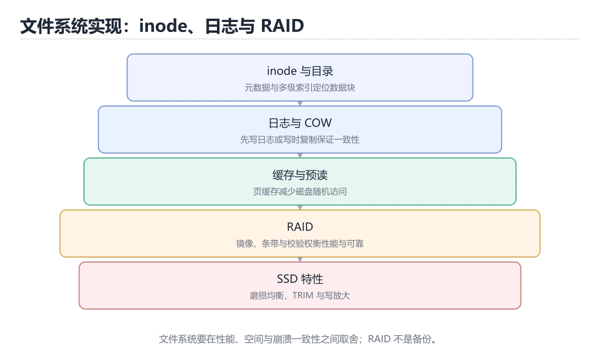
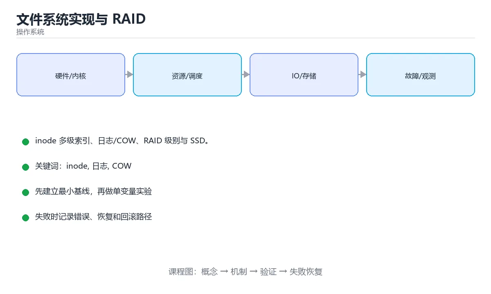

# 文件系统实现与 RAID

> 内容更新时间：2026-10-06 · 学习阶段：进阶 · 预计用时：40 分钟





## 本节知识框架

**课程定位**：所属分类 `os`（操作系统），课程主题 `文件系统实现与 RAID`，学习阶段 进阶，建议用时 35 分钟。

本课主线：inode 多级索引、日志/COW、RAID 级别与 SSD。

**学完本课应当能够**
- 说清 `inode` 与 `日志` 的含义与区别，并各举一个正例和一个反例。
- 用本课示例验证 `COW` 的行为，记录输入、输出与失败条件。
- 遇到「大容量盘只用 RAID 5」这类问题时，能说出触发条件与修复顺序。

### 从概念到验证的学习链条

1. `inode`：先掌握 运维要点：定期检查 dmesg 中的 IO 错误、关注 df -i 的 inode 使用率（小文件过多会先耗尽 inode 而非空间）、SSD 开启 TRIM（fstrim.timer）、监控磁盘延迟而不只是使用率，再用它解释 `日志` 为什么会出现。
2. `日志`：先掌握 文件系统 = inode 组织数据 + 目录组织名字 + 位图管理空间 + 日志/COW 保证一致性；RAID 提供性能与可用性，但备份仍然不可缺少，再用它解释 `COW` 为什么会出现。
3. `COW`：先掌握 一句话总结：日志用「先写意图再落盘」换一致性，COW 用「永不覆盖旧数据」换一致性；前者是主流通用方案，后者天然支持快照与校验（ZFS/Btrfs），再用它解释 `RAID 5` 为什么会出现。
4. `RAID 5`：先掌握 带分布式校验的条带阵列，能扛一块盘故障，但重建窗口长、写惩罚明显，再用它解释 本课示例的观察结果 为什么会出现。

**先修与衔接**：本课是「操作系统」分类的第 9 课。先修内容：《同步机制与经典问题》。《同步机制与经典问题》里的 `同步`、`信号量` 是本课的前提。相关或后续课程：《系统启动与权限安全》。

### 完成判据

- **定义关**：不看正文也能说明 `inode` 是 运维要点：定期检查 dmesg 中的 IO 错误、关注 df -i 的 inode 使用率（小文件过多会先耗尽 inode 而非空间）、SSD 开启 TRIM（fstrim.timer）、监控磁盘延迟而不只是使用率，并指出一个反例。
- **机制关**：能按“输入 → 转换 → 输出 → 验证”复述 `文件系统实现与 RAID`，而不是只背结论。
- **示例关**：能运行或推演 `文件系统实现与 RAID` 的 `python` 示例，并说明一个真实出现的标识符或字面量。
- **证据关**：能指出 `文件系统实现与 RAID` 示例里的 调用了 `usable_tb()`，并说明它支持或反驳了本课的哪一条结论。
- **排错关**：能复现 大容量盘只用 RAID 5，记录现象并按 改 RAID 6 或 RAID 10 修复。
- **迁移关**：能把 `inode`、`日志`、`COW`、`RAID` 放进一个与 `文件系统实现与 RAID` 不同的项目场景，并保持输入与验证条件可追踪。
- **复盘关**：学完 `文件系统实现与 RAID` 后，用一句话写下仍然不确定的结论，并列出下一次验证需要的输入、环境和成功判据。

### 复习清单

- [ ] 能不看正文复述本课核心术语，并指出一个边界或反例。
- [ ] 能运行或推演本课示例，记录输入、输出与失败现象。
- [ ] 能完成一次自测，并把错题对照错误表定位原因。

## 核心概念定义

| 术语 | 操作性定义 | 常见边界与风险 |
| --- | --- | --- |
| inode | 运维要点：定期检查 dmesg 中的 IO 错误、关注 df -i 的 inode 使用率（小文件过多会先耗尽 inode 而非空间）、SSD 开启 TRIM（fstrim.timer）、监控磁盘延迟而不只是使用率。 | 结论随输入规模变化，小规模成立不代表大规模成立，需要重新测量。 |
| 日志 | 文件系统 = inode 组织数据 + 目录组织名字 + 位图管理空间 + 日志/COW 保证一致性；RAID 提供性能与可用性，但备份仍然不可缺少。 | 易错：性能抖动；正确做法是数据与日志分离到不同设备。 |
| COW | 一句话总结：日志用「先写意图再落盘」换一致性，COW 用「永不覆盖旧数据」换一致性；前者是主流通用方案，后者天然支持快照与校验（ZFS/Btrfs）。 | 隔离级别与并发事务会影响可见性，换级别或换存储引擎后要重新验证。 |
| RAID 5 | 带分布式校验的条带阵列，能扛一块盘故障，但重建窗口长、写惩罚明显。 | 易错：重建期二次故障丢数据；正确做法是改 RAID 6 或 RAID 10。 |

## 原理与运行机制

### 机制总览

**教材衔接：磁盘布局**

典型布局：引导块 → 超级块（记录总块数、inode 数量、空闲位图位置）→ inode 位图与数据块位图 → inode 表 → 数据区。

**教材衔接：inode 与多级索引**

inode 存元数据与数据块指针，采用**多级索引**兼顾小文件与大文件：12 个直接指针覆盖小文件，一级/二级/三级间接指针支持大文件。这也是「文件大小上限」与「大文件随机读比顺序读慢」的根源。

**教材衔接：目录与空闲空间管理**

目录本质是「文件名 → inode 号」的映射表，线性表实现简单，B 树/哈希实现适合海量文件。空闲空间用**位图**（查找连续块方便）或**空闲链表**管理。

**教材衔接：一致性：日志与写时复制**

| 方案 | 思路 | 代表 |
| --- | --- | --- |
| 日志（Journaling） | 先写日志再落盘，崩溃后重放 | ext4、NTFS |
| 写时复制（COW） | 新数据写新块，最后原子切换指针 | ZFS、Btrfs |
| 软更新 | 按依赖顺序写，减少日志开销 | FFS 变体 |

日志模式常见三种：journal（数据+元数据）、ordered（只记元数据但保证数据先写，默认）、writeback（只记元数据，最快）。

**教材衔接：RAID 级别**

| 级别 | 机制 | 容错 | 说明 |
| --- | --- | --- | --- |
| RAID 0 | 条带化 | 无 | 性能最好，任一盘坏则全丢 |
| RAID 1 | 镜像 | 单盘 | 写放大，读性能好 |
| RAID 5 | 条带 + 单校验 | 单盘 | 写有校验惩罚，重建慢 |
| RAID 6 | 双校验 | 双盘 | 更安全，写惩罚更大 |
| RAID 10 | 镜像 + 条带 | 视组合 | 性能与可靠性兼顾，成本高 |

重要认知：**RAID 不是备份**，它防硬件故障，不防误删、勒索软件与逻辑损坏。

**教材衔接：SSD 的特殊性**

闪存不能原地覆写，需要先擦除；FTL（闪存转换层）负责地址映射、磨损均衡与垃圾回收，因此出现**写放大**。TRIM 让文件系统告知哪些块已废弃，可显著改善长期性能；断电保护依赖电容与固件策略。

**教材衔接：日志与写时复制的崩溃恢复对比**

以「创建文件并写入 4KB」为例，若在第 2 步断电：

| 方案 | 崩溃后的状态 | 恢复动作 | 代价 |
| --- | --- | --- | --- |
| 无日志 | 可能出现「inode 已分配但目录项缺失」等不一致 | 只能靠 fsck 全盘扫描修复 | 恢复慢、可能丢数据 |
| 日志（journal） | 日志中已记录完整意图，元数据未完全落盘 | 重放日志中的已提交事务 | 每次写多一次日志 IO |
| 日志（ordered 模式） | 数据先落盘再提交元数据日志 | 保证不出现「元数据指向旧数据」的错配 | 默认模式，兼顾安全与性能 |
| 写时复制（COW） | 旧数据与旧指针仍然完整，新块只是孤儿 | 丢弃孤儿块即可，无需重放 | 写放大、碎片化 |

一句话总结：**日志用「先写意图再落盘」换一致性，COW 用「永不覆盖旧数据」换一致性**；前者是主流通用方案，后者天然支持快照与校验（ZFS/Btrfs）。

**教材衔接：选型与运维建议**

| 场景 | 建议 |
| --- | --- |
| 通用服务器 | ext4 / XFS（成熟稳定，日志可靠） |
| 需要快照、校验和、压缩 | ZFS / Btrfs（注意内存占用与碎片） |
| 容器分层存储 | OverlayFS（写时复制，注意写放大） |
| 数据库数据盘 | XFS 或 ext4 + `nobarrier` 需谨慎（关闭屏障会牺牲掉电安全） |

运维要点：定期检查 `dmesg` 中的 IO 错误、关注 `df -i` 的 inode 使用率（小文件过多会先耗尽 inode 而非空间）、SSD 开启 TRIM（`fstrim.timer`）、监控磁盘延迟而不只是使用率。

**教材衔接：磁盘布局速查**

| 区域 | 作用 |
| --- | --- |
| 引导块 | 启动代码 |
| 超级块 | 文件系统元信息（大小、空闲块等） |
| inode 表 | 存放所有 inode |
| 数据块区 | 实际数据 |
| 位图 | 记录 inode 与数据块的空闲状态 |

### 机制拆解：每一步的输入、动作与输出

#### 1. `inode`
- 输入：`inode`；本步把 运维要点：定期检查 dmesg 中的 IO 错误、关注 df -i 的 inode 使用率（小文件过多会先耗尽 inode 而非空间）、SSD 开启 TRIM（fstrim.timer）、监控磁盘延迟而不只是使用率 当作判断规则。
- 动作：围绕 `inode` 保留中间状态，并记录它与 `日志` 的对应关系。
- 输出：`日志`，它可以被下一段代码、测试或记录继续使用。
- `inode` 的失败条件：结论随输入规模变化，小规模成立不代表大规模成立，需要重新测量。

#### 2. `日志`
- 输入：`inode`；本步把 文件系统 = inode 组织数据 + 目录组织名字 + 位图管理空间 + 日志/COW 保证一致性；RAID 提供性能与可用性，但备份仍然不可缺少 当作判断规则。
- 动作：围绕 `日志` 保留中间状态，并记录它与 `COW` 的对应关系。
- 输出：`COW`，它可以被下一段代码、测试或记录继续使用。
- `日志` 的失败条件：当随机读写混用同一盘时，会出现性能抖动。

#### 3. `COW`
- 输入：`日志`；本步把 一句话总结：日志用「先写意图再落盘」换一致性，COW 用「永不覆盖旧数据」换一致性；前者是主流通用方案，后者天然支持快照与校验（ZFS/Btrfs） 当作判断规则。
- 动作：围绕 `COW` 保留中间状态，并记录它与 `RAID 5` 的对应关系。
- 输出：`RAID 5`，它可以被下一段代码、测试或记录继续使用。
- `COW` 的失败条件：隔离级别与并发事务会影响可见性，换级别或换存储引擎后要重新验证。

#### 4. `RAID 5`
- 输入：`COW`；本步把 带分布式校验的条带阵列，能扛一块盘故障，但重建窗口长、写惩罚明显 当作判断规则。
- 动作：围绕 `RAID 5` 保留中间状态，并记录它与 `usable_tb` 的对应关系。
- 输出：`usable_tb`，它可以被下一段代码、测试或记录继续使用。
- `RAID 5` 的失败条件：当大容量盘只用 RAID 5时，会出现重建期二次故障丢数据。

### 示例中的可观察事实

1. 调用了 `usable_tb()`；它对应的课程主题是 `文件系统实现与 RAID`。
2. 调用了 `ValueError()`；它对应的课程主题是 `文件系统实现与 RAID`。
3. 调用了 `tolerance()`；它对应的课程主题是 `文件系统实现与 RAID`。
4. 调用了 `rebuild_risk()`；它对应的课程主题是 `文件系统实现与 RAID`。
5. 调用了 `write_amplification()`；它对应的课程主题是 `文件系统实现与 RAID`。
6. 调用了 `round()`；它对应的课程主题是 `文件系统实现与 RAID`。
7. 调用了 `print()`；它对应的课程主题是 `文件系统实现与 RAID`。
8. 调用了 `RaidPlan()`；它对应的课程主题是 `文件系统实现与 RAID`。

### 复现实验记录

- 环境：`文件系统实现与 RAID` 使用 `python` 示例，固定 `inode`、`日志`、`COW`、`RAID` 作为第一组条件。
- 首轮输入：先确认 调用了 `usable_tb()`，预测 `inode` 会怎样变化。
- 基线观察：记录命令、输入、输出和错误原文，不用截图代替可复制的文本。
- 单变量修改：只改变 `inode`，观察 `RAID 5` 是否仍满足定义。
- 失败注入：复现 大容量盘只用 RAID 5，确认现象是 重建期二次故障丢数据。
- 记录结论：把“修改前、修改后、预期变化、实际变化”写成四列表，这样复盘 `文件系统实现与 RAID` 时才能区分概念错误与实现错误。

## 典型应用场景

- **大容量盘只用 RAID 5**：典型现象是重建期二次故障丢数据；正确做法是改 RAID 6 或 RAID 10。
- **认为 RAID 等于备份**：典型现象是误删与勒索无法防护；正确做法是RAID 之外仍需离线备份。
- **忽略写缓存掉电风险**：典型现象是断电后数据损坏；正确做法是用带电池保护的缓存卡。
- **SSD 不做 TRIM**：典型现象是写放大升高、寿命下降；正确做法是启用定期 TRIM。

### 最小验证场景

- 准备：保留 `python` 示例的原始输入，先记录 `文件系统实现与 RAID` 的基线输出和完整运行命令。
- 观察：先核对 调用了 `usable_tb()`，再改变一个与 `inode` 相关的条件。
- 判定：新结果与 `文件系统实现与 RAID` 的基线不同不等于错误；只有当差异破坏了 `inode` 的定义或错误表中的约束，才判定为失败。

### 选择与边界

- 使用 `inode` 时，先满足它的定义：运维要点：定期检查 dmesg 中的 IO 错误、关注 df -i 的 inode 使用率（小文件过多会先耗尽 inode 而非空间）、SSD 开启 TRIM（fstrim.timer）、监控磁盘延迟而不只是使用率；结论随输入规模变化，小规模成立不代表大规模成立，需要重新测量。
- 使用 `日志` 时，先满足它的定义：文件系统 = inode 组织数据 + 目录组织名字 + 位图管理空间 + 日志/COW 保证一致性；RAID 提供性能与可用性，但备份仍然不可缺少；易错：性能抖动；正确做法是数据与日志分离到不同设备。
- 使用 `COW` 时，先满足它的定义：一句话总结：日志用「先写意图再落盘」换一致性，COW 用「永不覆盖旧数据」换一致性；前者是主流通用方案，后者天然支持快照与校验（ZFS/Btrfs）；隔离级别与并发事务会影响可见性，换级别或换存储引擎后要重新验证。
- 使用 `RAID 5` 时，先满足它的定义：带分布式校验的条带阵列，能扛一块盘故障，但重建窗口长、写惩罚明显；易错：重建期二次故障丢数据；正确做法是改 RAID 6 或 RAID 10。

## 代码/协议/SQL 示例

**教材衔接：RAID 对照**

| 级别 | 冗余 | 容量利用率 | 读写性能 | 最少盘数 |
| --- | --- | --- | --- | --- |
| RAID 0 | 无 | 100% | 读快写快 | 2 |
| RAID 1 | 镜像 | 50% | 读快写一般 | 2 |
| RAID 5 | 单盘校验 | (n-1)/n | 读快写慢 | 3 |
| RAID 6 | 双盘校验 | (n-2)/n | 读快写更慢 | 4 |
| RAID 10 | 镜像 + 条带 | 50% | 读写都强 | 4 |

```python
from dataclasses import dataclass

@dataclass
class RaidPlan:
    level: str
    disks: int
    disk_size_tb: float

    def usable_tb(self) -> float:
        if self.level == "0":
            return self.disks * self.disk_size_tb
        if self.level == "1":
            return self.disks // 2 * self.disk_size_tb
        if self.level == "5":
            return (self.disks - 1) * self.disk_size_tb
        if self.level == "6":
            return (self.disks - 2) * self.disk_size_tb
        if self.level == "10":
            return self.disks // 2 * self.disk_size_tb
        raise ValueError("不支持的 RAID 级别")

    def tolerance(self) -> str:
        return {
            "0": "无冗余，任一盘故障即丢数据",
            "1": "每组镜像可坏 1 块",
            "5": "可坏 1 块",
            "6": "可坏 2 块",
            "10": "每组镜像可坏 1 块（视分布）",
        }[self.level]

    def rebuild_risk(self) -> str:
        """重建期风险提示：容量越大重建越久。"""
        if self.disk_size_tb >= 12 and self.level in {"5", "6"}:
            return "单盘容量大，重建耗时长，建议 RAID 10 或 RAID 6"
        return "重建风险可接受"

def write_amplification(logical_write_mb: float, physical_write_mb: float) -> float:
    """写放大系数：SSD 寿命评估的关键指标。"""
    if logical_write_mb <= 0:
        raise ValueError("逻辑写入必须为正")
    return round(physical_write_mb / logical_write_mb, 2)

print(RaidPlan("5", 6, 8).usable_tb(), RaidPlan("5", 6, 8).tolerance())
print(write_amplification(100, 320))
```

**运行方式**：运行 `文件系统实现与 RAID` 的示例时，保存为 `.py` 文件后用 `python 文件名.py` 运行；第三方依赖先在虚拟环境里安装。

### 示例精读：先找证据，再改一个条件

1. 调用了 `usable_tb()`；它出现在 `文件系统实现与 RAID` 的示例中，阅读时先确认它前后各发生了什么。
2. 调用了 `ValueError()`；它出现在 `文件系统实现与 RAID` 的示例中，阅读时先确认它前后各发生了什么。
3. 调用了 `tolerance()`；它出现在 `文件系统实现与 RAID` 的示例中，阅读时先确认它前后各发生了什么。
4. 调用了 `rebuild_risk()`；它出现在 `文件系统实现与 RAID` 的示例中，阅读时先确认它前后各发生了什么。
5. 调用了 `write_amplification()`；它出现在 `文件系统实现与 RAID` 的示例中，阅读时先确认它前后各发生了什么。
6. 调用了 `round()`；它出现在 `文件系统实现与 RAID` 的示例中，阅读时先确认它前后各发生了什么。
7. 调用了 `print()`；它出现在 `文件系统实现与 RAID` 的示例中，阅读时先确认它前后各发生了什么。
8. 调用了 `RaidPlan()`；它出现在 `文件系统实现与 RAID` 的示例中，阅读时先确认它前后各发生了什么。
- 在 `文件系统实现与 RAID` 中与 `inode` 对照：示例必须能支持 运维要点：定期检查 dmesg 中的 IO 错误、关注 df -i 的 inode 使用率（小文件过多会先耗尽 inode 而非空间）、SSD 开启 TRIM（fstrim.timer）、监控磁盘延迟而不只是使用率，否则说明这一段还缺少实现或验证步骤。
- 在 `文件系统实现与 RAID` 中与 `日志` 对照：示例必须能支持 文件系统 = inode 组织数据 + 目录组织名字 + 位图管理空间 + 日志/COW 保证一致性；RAID 提供性能与可用性，但备份仍然不可缺少，否则说明这一段还缺少实现或验证步骤。
- 在 `文件系统实现与 RAID` 中与 `COW` 对照：示例必须能支持 一句话总结：日志用「先写意图再落盘」换一致性，COW 用「永不覆盖旧数据」换一致性；前者是主流通用方案，后者天然支持快照与校验（ZFS/Btrfs），否则说明这一段还缺少实现或验证步骤。
- 在 `文件系统实现与 RAID` 中与 `RAID 5` 对照：示例必须能支持 带分布式校验的条带阵列，能扛一块盘故障，但重建窗口长、写惩罚明显，否则说明这一段还缺少实现或验证步骤。

## 时间/空间复杂度或性能分析

**性能关注点（文件系统实现与 RAID）**：系统调用与上下文切换是主要成本：记录 CPU 占用、切换次数与内存映射规模。

**本课特有开销（文件系统实现与 RAID · inode）**：索引能减少扫描行数，但会增加写入与存储开销，需要同时记录读、写两侧代价。

**测量方法**：以 `文件系统实现与 RAID` 的 `inode` 场景为对象，固定输入跑一遍记录基线，再把规模或并发度提高一个数量级复测；两次结果的差值与波动范围才是结论依据。

### 需要控制的变量与记录项

- `文件系统实现与 RAID` 的 `inode`：固定它的版本、输入范围和资源上限，分别记录速度、内存与失败率的变化。
- `文件系统实现与 RAID` 的 `日志`：固定它的版本、输入范围和资源上限，分别记录速度、内存与失败率的变化。
- `文件系统实现与 RAID` 的 `COW`：固定它的版本、输入范围和资源上限，分别记录速度、内存与失败率的变化。
- `文件系统实现与 RAID` 的 `RAID`：固定它的版本、输入范围和资源上限，分别记录速度、内存与失败率的变化。
- `文件系统实现与 RAID` 的 `SSD`：固定它的版本、输入范围和资源上限，分别记录速度、内存与失败率的变化。
- `文件系统实现与 RAID` 中 `inode` 的边界：结论随输入规模变化，小规模成立不代表大规模成立，需要重新测量。达到边界时不要外推，必须重新测量。
- `文件系统实现与 RAID` 中 `日志` 的边界：易错：性能抖动；正确做法是数据与日志分离到不同设备。达到边界时不要外推，必须重新测量。
- `文件系统实现与 RAID` 中 `COW` 的边界：隔离级别与并发事务会影响可见性，换级别或换存储引擎后要重新验证。达到边界时不要外推，必须重新测量。
- `文件系统实现与 RAID` 中 `RAID 5` 的边界：易错：重建期二次故障丢数据；正确做法是改 RAID 6 或 RAID 10。达到边界时不要外推，必须重新测量。
- `文件系统实现与 RAID` 的代码证据：先验证 调用了 `usable_tb()`，再记录该路径的输入规模与耗时；只看代码行数不能推出复杂度。

## 常见误区与易错点

| 容易写错的做法 | 实际现象 | 原因与正确做法 |
| --- | --- | --- |
| 大容量盘只用 RAID 5 | 重建期二次故障丢数据 | 改 RAID 6 或 RAID 10 |
| 认为 RAID 等于备份 | 误删与勒索无法防护 | RAID 之外仍需离线备份 |
| 忽略写缓存掉电风险 | 断电后数据损坏 | 用带电池保护的缓存卡 |
| SSD 不做 TRIM | 写放大升高、寿命下降 | 启用定期 TRIM |
| 分区未 4K 对齐 | 读写放大 | 用现代工具自动对齐 |
| 随机读写混用同一盘 | 性能抖动 | 数据与日志分离到不同设备 |
| 不做 SMART 监控 | 磁盘故障突发 | 采集并设置告警 |
| 忽略文件系统校验 | 静默数据损坏 | 用带校验的文件系统或定期校验 |
| 备份与生产同机房 | 一起故障 | 异地或对象存储 |
| 只测顺序吞吐 | 数据库场景结论错误 | 按业务模式测随机 IOPS |

### 现场 1：大容量盘只用 RAID 5

**症状**：重建期二次故障丢数据。

**根因与修复**：改 RAID 6 或 RAID 10。

**自检**：在本课示例里复现「大容量盘只用 RAID 5」，改成改 RAID 6 或 RAID 10后重跑；如果症状消失且失败路径按预期变化，说明定位正确。

### 现场 2：认为 RAID 等于备份

**症状**：误删与勒索无法防护。

**根因与修复**：RAID 之外仍需离线备份。

**自检**：在本课示例里复现「认为 RAID 等于备份」，改成RAID 之外仍需离线备份后重跑；如果症状消失且失败路径按预期变化，说明定位正确。

### 现场 3：忽略写缓存掉电风险

**症状**：断电后数据损坏。

**根因与修复**：用带电池保护的缓存卡。

**自检**：在本课示例里复现「忽略写缓存掉电风险」，改成用带电池保护的缓存卡后重跑；如果症状消失且失败路径按预期变化，说明定位正确。

### 现场 4：SSD 不做 TRIM

**症状**：写放大升高、寿命下降。

**根因与修复**：启用定期 TRIM。

**自检**：在本课示例里复现「SSD 不做 TRIM」，改成启用定期 TRIM后重跑；如果症状消失且失败路径按预期变化，说明定位正确。

### 现场 5：分区未 4K 对齐

**症状**：读写放大。

**根因与修复**：用现代工具自动对齐。

**自检**：在本课示例里复现「分区未 4K 对齐」，改成用现代工具自动对齐后重跑；如果症状消失且失败路径按预期变化，说明定位正确。

### 现场 6：随机读写混用同一盘

**症状**：性能抖动。

**根因与修复**：数据与日志分离到不同设备。

**自检**：在本课示例里复现「随机读写混用同一盘」，改成数据与日志分离到不同设备后重跑；如果症状消失且失败路径按预期变化，说明定位正确。

### 现场 7：不做 SMART 监控

**症状**：磁盘故障突发。

**根因与修复**：采集并设置告警。

**自检**：在本课示例里复现「不做 SMART 监控」，改成采集并设置告警后重跑；如果症状消失且失败路径按预期变化，说明定位正确。

### 现场 8：忽略文件系统校验

**症状**：静默数据损坏。

**根因与修复**：用带校验的文件系统或定期校验。

**自检**：在本课示例里复现「忽略文件系统校验」，改成用带校验的文件系统或定期校验后重跑；如果症状消失且失败路径按预期变化，说明定位正确。

### 现场 9：备份与生产同机房

**症状**：一起故障。

**根因与修复**：异地或对象存储。

**自检**：在本课示例里复现「备份与生产同机房」，改成异地或对象存储后重跑；如果症状消失且失败路径按预期变化，说明定位正确。

## 与其他知识点的关系

**教材衔接：分配方式对照**

| 方式 | 优点 | 缺点 |
| --- | --- | --- |
| 连续分配 | 顺序读最快 | 碎片与扩展困难 |
| 链式分配 | 易扩展 | 随机访问慢 |
| 索引分配（多级） | 支持大文件、随机访问好 | 索引块开销 |
| 混合（ext4 extent） | 兼顾大文件与碎片控制 | 实现复杂 |

- **先修**：`同步机制与经典问题`。本课默认这些内容已经掌握。
- **相关或后续**：`系统启动与权限安全`。本课术语会在这些课程里继续使用。
- **术语归属**：`inode`、`日志`、`COW` 的定义以本课「核心概念定义」为准，换到其他课程时先确认定义是否被改写。
- 同一分类的《文件系统基础》也涉及 `inode`；两课衔接时先确认这个术语的定义是否一致。

### 先修与后续术语接口

- `同步机制与经典问题`：两者通过本分类的学习顺序衔接，阅读时重点比较各自的输入与失败条件。
- `系统启动与权限安全`：两者通过本分类的学习顺序衔接，阅读时重点比较各自的输入与失败条件。

### 容易混淆的相邻概念

- `inode` 与 `日志`：前者强调 运维要点：定期检查 dmesg 中的 IO 错误、关注 df -i 的 inode 使用率（小文件过多会先耗尽 inode 而非空间）、SSD 开启 TRIM（fstrim.timer）、监控磁盘延迟而不只是使用率；后者强调 文件系统 = inode 组织数据 + 目录组织名字 + 位图管理空间 + 日志/COW 保证一致性；RAID 提供性能与可用性，但备份仍然不可缺少。判断时分别检查两条定义的适用范围，不要只看名称相似就互换。
- `日志` 与 `COW`：前者强调 文件系统 = inode 组织数据 + 目录组织名字 + 位图管理空间 + 日志/COW 保证一致性；RAID 提供性能与可用性，但备份仍然不可缺少；后者强调 一句话总结：日志用「先写意图再落盘」换一致性，COW 用「永不覆盖旧数据」换一致性；前者是主流通用方案，后者天然支持快照与校验（ZFS/Btrfs）。判断时分别检查两条定义的适用范围，不要只看名称相似就互换。
- `COW` 与 `RAID 5`：前者强调 一句话总结：日志用「先写意图再落盘」换一致性，COW 用「永不覆盖旧数据」换一致性；前者是主流通用方案，后者天然支持快照与校验（ZFS/Btrfs）；后者强调 带分布式校验的条带阵列，能扛一块盘故障，但重建窗口长、写惩罚明显。判断时分别检查两条定义的适用范围，不要只看名称相似就互换。

## 自测题与参考答案

> 先独立作答，再对照参考答案；答案都能在本课正文、术语表或错误表里找到依据。

### 自测 1（概念复述）

不看正文，写出 `inode` 的操作性定义，并说明它与 `日志` 的区别。

**参考答案**：运维要点：定期检查 dmesg 中的 IO 错误、关注 df -i 的 inode 使用率（小文件过多会先耗尽 inode 而非空间）、SSD 开启 TRIM（fstrim.timer）、监控磁盘延迟而不只是使用率。

`日志` 的定位是：文件系统 = inode 组织数据 + 目录组织名字 + 位图管理空间 + 日志/COW 保证一致性；RAID 提供性能与可用性，但备份仍然不可缺少；两者的差别要从适用对象与失败模式上说明。

### 自测 2（排错）

本课错误表记录了「大容量盘只用 RAID 5」这类做法。请写出它会出现的现象、根因，以及修复顺序。

**参考答案**：现象是重建期二次故障丢数据；正确做法是改 RAID 6 或 RAID 10。修复时先复现现象并保留证据，再改动一处假设重跑，确认现象消失。

### 自测 3（动手验证）

运行本课的 `python` 示例，把其中的 `"0"` 换成一个边界值后重新运行，记录输出与错误信息。

**参考答案**：正常输入下 `python` 示例应当复现正文给出的结果；把 `"0"` 换成边界值后，如果结果改变或报错，先核对它是否满足 `文件系统实现与 RAID` 中`inode` 的适用范围，再检查错误表里是否有同类现象。

### 自测 4（代码阅读）

阅读本课开头的 `python` 示例，说明它体现了`inode` 的哪一条性质，并指出改动哪个输入会让这条性质不再成立。

**参考答案**：`inode` 的定义是 运维要点：定期检查 dmesg 中的 IO 错误、关注 df -i 的 inode 使用率（小文件过多会先耗尽 inode 而非空间）、SSD 开启 TRIM（fstrim.timer）、监控磁盘延迟而不只是使用率，示例正是在实现这条定义。改动与 `inode` 有关的一个输入后，如果结果不再符合 `文件系统实现与 RAID` 的正文描述，就说明该性质只在当前前提成立。

### 自测 5（迁移）

把 `文件系统实现与 RAID` 的方法迁移到自己的项目：围绕 `inode` 写出一个与错误表同类的风险点，并说明触发条件和检验方式。

**参考答案**：例如「只测顺序吞吐」，它会导致数据库场景结论错误；检验方式是按按业务模式测随机 IOPS改一处再复现，确认现象消失且没有引入新的失败分支。

### 自测 6（对比）

用一个表格对比 `inode` 与 `日志`：各写一行适用场景、一行失败表现。

**参考答案**：`inode` 的定义是运维要点：定期检查 dmesg 中的 IO 错误、关注 df -i 的 inode 使用率（小文件过多会先耗尽 inode 而非空间）、SSD 开启 TRIM（fstrim.timer）、监控磁盘延迟而不只是使用率；`日志` 的定义是文件系统 = inode 组织数据 + 目录组织名字 + 位图管理空间 + 日志/COW 保证一致性；RAID 提供性能与可用性，但备份仍然不可缺少。两者的失败表现分别对应本课错误表里与本术语相关的行。

### 自测 7（排错顺序）

面对「大容量盘只用 RAID 5」引发的问题，请把“复现 重建期二次故障丢数据 → 保留证据 → 改 RAID 6 或 RAID 10 → 回归验证”四步写成可执行的检查清单。

**参考答案**：第一步按重建期二次故障丢数据复现；第二步记录输入、版本与完整报错；第三步按改 RAID 6 或 RAID 10只改一处；第四步重跑并确认失败路径也按预期变化。

### 自测 8（边界判断）

针对 `RAID 5`，分别写出“可以使用”的条件和“结论不再成立”的条件。

**参考答案**：易错：重建期二次故障丢数据；正确做法是改 RAID 6 或 RAID 10。 同时要把 `RAID 5` 的定义 带分布式校验的条带阵列，能扛一块盘故障，但重建窗口长、写惩罚明显 与实际输入逐项对照。

### 自测 9（机制重建）

不看正文，按输入、转换、输出、验证四段重建 `inode` → `日志` → `COW` → `RAID 5` 的作用链。

**参考答案**：起点是 `inode` 的定义 运维要点：定期检查 dmesg 中的 IO 错误、关注 df -i 的 inode 使用率（小文件过多会先耗尽 inode 而非空间）、SSD 开启 TRIM（fstrim.timer）、监控磁盘延迟而不只是使用率；中间每一步都保留可观察状态；终点由 `RAID 5` 检查，失败时回到错误表定位第一个偏离定义的步骤。

### 自测 10（综合排错）

在 `文件系统实现与 RAID` 中，现象是 数据库场景结论错误。请围绕 只测顺序吞吐 写出最小复现、关键证据、修复动作和回归验证，并说明为什么不能只凭一次运行下结论。

**参考答案**：先复现 只测顺序吞吐，记录输入与完整错误；再按 按业务模式测随机 IOPS 只改一处。回归时同时跑正常路径和边界路径，只有两次结果都可解释，才把修复视为完成。

### 自测 11（一分钟复述）

用每分钟约 200 字的速度复述 `文件系统实现与 RAID`：先给主问题，再按顺序说出 `inode`、`日志`、`COW`、`RAID 5`，最后给一个失败案例。

**自评标准**：主问题必须对应 inode 多级索引、日志/COW、RAID 级别与 SSD；每个术语都要能接上一句定义或边界；失败案例必须写成可观察现象，不能用“可能有风险”代替证据。

## 术语速查

| 术语 | 一句话说明 |
| --- | --- |
| `inode` | 运维要点：定期检查 dmesg 中的 IO 错误、关注 df -i 的 inode 使用率（小文件过多会先耗尽 inode 而非空间）、SSD 开启 TRIM（fstrim.timer）、监控磁盘延迟而不只是使用率。 |
| `日志` | 文件系统 = inode 组织数据 + 目录组织名字 + 位图管理空间 + 日志/COW 保证一致性；RAID 提供性能与可用性，但备份仍然不可缺少。 |
| `COW` | 一句话总结：日志用「先写意图再落盘」换一致性，COW 用「永不覆盖旧数据」换一致性；前者是主流通用方案，后者天然支持快照与校验（ZFS/Btrfs）。 |
| `RAID 5` | 带分布式校验的条带阵列，能扛一块盘故障，但重建窗口长、写惩罚明显。 |

**术语关系**：`inode`（运维要点：定期检查 dmesg 中的 IO 错误、关注 df -i 的 inode 使用率（小文件过多会先耗尽 inode 而非空间）、SSD 开启 TRIM（fstrim.timer）、监控磁盘延迟而不只是使用率） → `日志`（文件系统 = inode 组织数据 + 目录组织名字 + 位图管理空间 + 日志/COW 保证一致性） → `COW`（一句话总结：日志用「先写意图再落盘」换一致性） → `RAID 5`（带分布式校验的条带阵列）。

## 考点精讲

`文件系统实现与 RAID` 的题库有 6 道题，下面逐题给出题干、正确项与判断依据：先自己作答，再核对正确项，最后回到正文对应小节复核。

### 考点 1：第 1 题

- **题目**：围绕“文件系统实现与 RAID”中的 inode、日志、COW，下列哪两项是本课强调的实践判断？
- **正确项**：学习 inode 时要同时说明输入、输出和失败路径，不能只看正常流程；验证 日志 时要固定版本并覆盖边界输入，结论才可复现
- **判断依据**：这道题落在术语 `inode` 上：运维要点：定期检查 dmesg 中的 IO 错误、关注 df -i 的 inode 使用率（小文件过多会先耗尽 inode 而非空间）、SSD 开启 TRIM（fstrim.timer）、监控磁盘延迟而不只是使用率。复习时把 `inode` 的定义、适用边界和一个反例一起说清楚，再回到「核心概念定义」核对原文。

### 考点 2：第 2 题

- **题目**：RAID 5 可以容忍几块盘故障？
- **正确项**：1
- **判断依据**：这道题落在术语 `RAID 5` 上：带分布式校验的条带阵列，能扛一块盘故障，但重建窗口长、写惩罚明显。复习时把 `RAID 5` 的定义、适用边界和一个反例一起说清楚，再回到「核心概念定义」核对原文。

### 考点 3：第 3 题

- **题目**：关于 RAID，下面说法正确的是？
- **正确项**：RAID 只防硬件故障
- **判断依据**：这道题检验本课主问题：inode 多级索引、日志/COW、RAID 级别与 SSD。复习时先复述本课主问题，再举一个会让结论失效的输入。

### 考点 4：第 4 题

- **题目**：按“文件系统实现与 RAID”中 inode、日志、COW 的实践顺序，把四个步骤排成从准备到复盘的合理顺序。
- **正确项**：先明确 inode 的输入、输出与约束 → 写出最小示例并核对 日志 的基线结果 → 只改一个变量，记录边界与失败路径的变化 → 固定版本与证据，把“文件系统实现与 RAID”的结论写成可复现记录
- **判断依据**：这道题落在术语 `inode` 上：运维要点：定期检查 dmesg 中的 IO 错误、关注 df -i 的 inode 使用率（小文件过多会先耗尽 inode 而非空间）、SSD 开启 TRIM（fstrim.timer）、监控磁盘延迟而不只是使用率。复习时把 `inode` 的定义、适用边界和一个反例一起说清楚，再回到「核心概念定义」核对原文。

### 考点 5：第 5 题

- **题目**：SSD 上的写放大（write amplification）会导致什么？
- **正确项**：实际写入量大于逻辑写入量
- **判断依据**：这道题检验本课主问题：inode 多级索引、日志/COW、RAID 级别与 SSD。复习时先复述本课主问题，再举一个会让结论失效的输入。

### 考点 6：第 6 题

- **题目**：`文件系统实现与 RAID` 的示例代码服务于“inode 多级索引、日志/COW、RAID 级别与 SSD。”。哪一条判断是正确的？
- **正确项**：用有限指针支持很大的文件
- **判断依据**：这道题落在术语 `inode` 上：运维要点：定期检查 dmesg 中的 IO 错误、关注 df -i 的 inode 使用率（小文件过多会先耗尽 inode 而非空间）、SSD 开启 TRIM（fstrim.timer）、监控磁盘延迟而不只是使用率。复习时把 `inode` 的定义、适用边界和一个反例一起说清楚，再回到「核心概念定义」核对原文。

### 考点 7：`inode`

- **要点**：运维要点：定期检查 dmesg 中的 IO 错误、关注 df -i 的 inode 使用率（小文件过多会先耗尽 inode 而非空间）、SSD 开启 TRIM（fstrim.timer）、监控磁盘延迟而不只是使用率。
- **inode 的边界**：结论随输入规模变化，小规模成立不代表大规模成立，需要重新测量。

### 考点 8：`日志`

- **要点**：文件系统 = inode 组织数据 + 目录组织名字 + 位图管理空间 + 日志/COW 保证一致性；RAID 提供性能与可用性，但备份仍然不可缺少。
- **日志 的边界**：易错：性能抖动；正确做法是数据与日志分离到不同设备。

### 考点 9：`COW`

- **要点**：一句话总结：日志用「先写意图再落盘」换一致性，COW 用「永不覆盖旧数据」换一致性；前者是主流通用方案，后者天然支持快照与校验（ZFS/Btrfs）。
- **COW 的边界**：隔离级别与并发事务会影响可见性，换级别或换存储引擎后要重新验证。

### 考点 10：`RAID 5`

- **要点**：带分布式校验的条带阵列，能扛一块盘故障，但重建窗口长、写惩罚明显。
- **RAID 5 的边界**：易错：重建期二次故障丢数据；正确做法是改 RAID 6 或 RAID 10。

### 考点 11：排错——大容量盘只用 RAID 5

- **现象**：重建期二次故障丢数据。
- **处理**：改 RAID 6 或 RAID 10。

### 考点 12：排错——认为 RAID 等于备份

- **现象**：误删与勒索无法防护。
- **处理**：RAID 之外仍需离线备份。

### 考点 13：综合辨析——`inode` 与 `RAID 5`

- **辨析点**：`inode` 的定义是 运维要点：定期检查 dmesg 中的 IO 错误、关注 df -i 的 inode 使用率（小文件过多会先耗尽 inode 而非空间）、SSD 开启 TRIM（fstrim.timer）、监控磁盘延迟而不只是使用率；`RAID 5` 的定义是 带分布式校验的条带阵列，能扛一块盘故障，但重建窗口长、写惩罚明显。
- **答题要求**：面对 `文件系统实现与 RAID` 的题目，先判断描述的是 `inode` 还是 `RAID 5`，再归到对应定义，最后写出一个会让该定义失效的边界输入。

### 考点 14：排错评分点

- **现象分**：能写出 重建期二次故障丢数据，而不是只写“程序有错”。
- **证据分**：保留触发 大容量盘只用 RAID 5 的输入、版本和错误原文。
- **修复分**：按 改 RAID 6 或 RAID 10 只改一处，并同时回归正常路径与边界路径。

## 内容元数据

- 内容版本：v2.0
- 最后更新：2026-10-06
- 学习阶段：进阶
- 适用环境：Linux 6.x / POSIX
；本课聚焦 inode。
- 内容来源：内置结构化课程与工程实践整理
- 相关主题：inode、日志、COW、RAID、SSD、TRIM
- 质量版本：P0 测验标准 + P1 覆盖扩展 + P2 体验补全

## 参考资料与复核

- 最后复核：2026-10-04
- 下次复核：2027-07-24
- 复核范围：版本兼容、API 行为、安全建议与工程实践
- 来源性质：官方文档、标准或权威教材；本课核对关键词：inode、日志、COW、RAID、SSD、TRIM。

| 参考资料 | 本课用途 |
| --- | --- |
| [Linux man-pages](https://man7.org/linux/man-pages/) | 系统调用与用户态接口 |
| [OSTEP](https://pages.cs.wisc.edu/~remzi/OSTEP/) | 操作系统导论教材 |
| [Linux 性能事件](https://perf.wiki.kernel.org/) | 性能分析与内核事件 |

| [本课术语索引：文件系统实现与 RAID](#核心概念定义) | 按本课输入、术语边界和错误表现逐项核对 |
> 「文件系统实现与 RAID」的链接用于离线阅读后的延伸核对；App 不会自动联网。