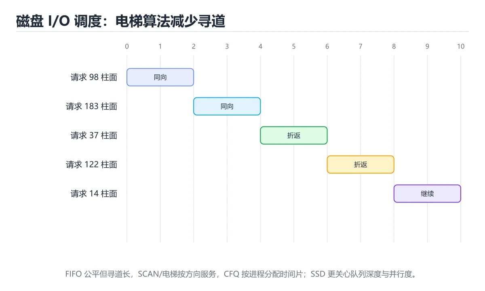
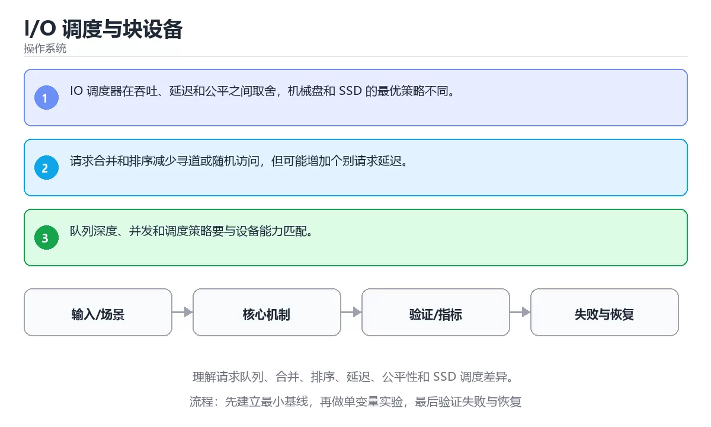

# I/O 调度与块设备





> 内容更新时间：2026-10-03 · 学习阶段：高级 · 预计用时：24 分钟

## 学习目标

- 能用自己的话解释：IO 调度器在吞吐、延迟和公平之间取舍，机械盘和 SSD 的最优策略不同。
- 能用自己的话解释：请求合并和排序减少寻道或随机访问，但可能增加个别请求延迟。
- 能用自己的话解释：队列深度、并发和调度策略要与设备能力匹配。
- 能把本课知识放回「操作系统」，并完成练习与测验。

## 前置知识

- 已完成「操作系统」的基础课程，能运行正文中的最小示例。
- 本课关键词：IO 调度、块设备、队列、公平性。
- 遇到不熟悉的术语先记录问题，完成练习后再回读。

## 核心知识

### 1. IO 调度器在吞吐、延迟和公平之间取舍，机械盘和 SSD 的最优策略不同。

- 它解决的问题：把「IO 调度器在吞吐、延迟和公平之间取舍，机械盘和 SSD 的最优策略不同。」放回真实场景，说明不做它会带来什么后果。
- 关键做法：先用最小示例建立基线，再逐步加入边界、失败和性能条件。
- 验证标准：结果可复现、错误可解释、边界有测试、失败能恢复。

### 2. 请求合并和排序减少寻道或随机访问，但可能增加个别请求延迟。

- 它解决的问题：把「请求合并和排序减少寻道或随机访问，但可能增加个别请求延迟。」放回真实场景，说明不做它会带来什么后果。
- 关键做法：先用最小示例建立基线，再逐步加入边界、失败和性能条件。
- 验证标准：结果可复现、错误可解释、边界有测试、失败能恢复。

### 3. 队列深度、并发和调度策略要与设备能力匹配。

- 它解决的问题：把「队列深度、并发和调度策略要与设备能力匹配。」放回真实场景，说明不做它会带来什么后果。
- 关键做法：先用最小示例建立基线，再逐步加入边界、失败和性能条件。
- 验证标准：结果可复现、错误可解释、边界有测试、失败能恢复。

## 关键流程

```text
输入 → 校验 → 核心处理 → 验证 → 记录指标 → 失败恢复
```

## 实践路径

1. 用一句话复述本课要解决的问题。
2. 跑通正文中的最小示例并记录基线。
3. 只改变一个输入或参数，预测并验证结果。
4. 补一个失败路径，记录错误、恢复和指标。
5. 把结论写成可复现的笔记或测试。

## 常见误区

| 误区 | 后果 | 修正 |
| --- | --- | --- |
| 只记术语不做实验 | 遇到真实问题无法判断 | 用最小输入跑通并记录结果 |
| 只测正常路径 | 边界和故障上线才暴露 | 补空值、极值和依赖失败 |
| 没有基线就优化 | 无法证明改进有效 | 先测量再修改 |
| 忽略成本与安全 | 性能和风险失控 | 同时记录资源、权限与失败代价 |

## 动手练习

1. 合上教程，用 3～5 句话解释「I/O 调度与块设备」。
2. 从正文选一个例子，改变一个条件并预测结果。
3. 设计一个失败场景，写出止损与恢复步骤。

**验收标准**：留下输入、命令、输出、差异和下一步问题。

## 本课小结

- 本课属于「操作系统」，核心关键词是 IO 调度、块设备、队列、公平性。
- 先保证正确与可复现，再讨论性能和扩展。
- 完成练习和测验后，把仍然不确定的问题写成下一轮验证清单。

> 本课由 P1 内容扩展生成，重点补充原有课程缺失的主题与工程边界。


## 深入理解：I/O 调度与块设备

### 机械盘与 SSD 的目标不同

机械盘的主要成本是寻道与旋转延迟，调度目标是把相邻请求合并、减少磁头来回移动，
经典算法有电梯（SCAN）与 CFQ。SSD 没有机械寻道，但有擦除块、写放大与并行通道，
更适合多队列、低开销的调度器，过度合并反而增加尾延迟。设备类型不同，最优策略不同。

### 队列深度与延迟

提高队列深度能提升吞吐，但每个请求的排队时间也变长。交互式负载关心 P99 延迟，
批处理负载关心总吞吐，两者对调度器的要求相反。Linux 的 mq-deadline 优先保证
读延迟，kyber 控制同步与异步请求的排队目标，none 则把决策交给更快的硬件。
选择前先测量设备与负载特征。

### 从应用到设备的完整链路

一次磁盘 I/O 会经过文件系统页缓存、块层队列、调度器、设备驱动与控制器缓存。
「I/O 慢」可能来自页缓存命中率低、队列拥塞、写放大或应用自身的小块随机访问。
排查时先看 iostat 的 await、队列长度与利用率，再看应用是否把顺序访问写成了
逐条小请求。调度器只是链路中的一环，不能替代对访问模式的分析。

## 可运行练习

下面 3 个任务围绕“I/O 调度与块设备”展开，代码可以直接粘贴到 App 的离线沙箱里运行；如果示例会读取标准输入，请按代码注释在沙箱的 stdin 区域填入同样格式的数据。

### 任务 1：先跑通，再解释

```python
import os

print("pid>0:", os.getpid() > 0)
```

**预期输出**：运行后会输出与“I/O 调度与块设备”相关的关键结果；请重点核对输出行数、最后一个数值和异常提示。

**验收标准**：代码能正常运行；逐行解释每个变量的值如何变化，并指出哪一行决定了最终结果。

### 任务 2：只改一个条件

复制上面的代码，只修改一个输入、边界或参数（例如空值、最大值、循环次数、过滤条件），先写出你的预测，再实际运行。

**验收标准**：留下“原结果 → 改动 → 预测 → 实际结果 → 差异原因”五步记录；如果预测错误，要写出修正后的心智模型。

### 任务 3：迁移到自己的数据

用同一套思路处理一组你自己的数据或场景，保持输出格式与任务 1 一致。

**验收标准**：代码不少于 10 行，至少包含 1 个边界检查；把代码和运行结果保存到笔记或片段库。


## 故障现场

这一节把“I/O 调度与块设备”最常见的失败方式还原成现场记录，练习时按“症状 → 复现 → 定位 → 修复 → 预防”的顺序排查。

### 现场 1：“I/O 调度与块设备”的 IO 调度 常规用例通过，但边界用例失败

**症状**：在“I/O 调度与块设备”的练习或生产场景里出现““I/O 调度与块设备”的 IO 调度 常规用例通过，但边界用例失败”。

**复现**：准备一组最小输入，只保留触发““I/O 调度与块设备”的 IO 调度 常规用例通过，但边界用例失败”的必要条件，连续运行两次确认结果稳定。

**定位**：围绕“IO 调度 的前置条件与取值边界没有写进代码，默认值掩盖了空值和极值”检查调用链、输入数据和环境配置，先验证假设再改代码。

**修复**：为“I/O 调度与块设备”补一条空值或极值用例，把前置条件写成断言，并让失败信息直接指出是哪个输入越界

**预防**：把““I/O 调度与块设备”的 IO 调度 常规用例通过，但边界用例失败”写成一条自动化用例，并在“I/O 调度与块设备”的验收清单里保留对应检查项。


### 现场 2：“I/O 调度与块设备”的 块设备 结果在两次运行之间不一致

**症状**：在“I/O 调度与块设备”的练习或生产场景里出现““I/O 调度与块设备”的 块设备 结果在两次运行之间不一致”。

**复现**：准备一组最小输入，只保留触发““I/O 调度与块设备”的 块设备 结果在两次运行之间不一致”的必要条件，连续运行两次确认结果稳定。

**定位**：围绕“块设备 依赖了当前版本、执行顺序或共享状态，单次运行无法暴露差异”检查调用链、输入数据和环境配置，先验证假设再改代码。

**修复**：固定“I/O 调度与块设备”使用的版本与随机种子，记录两次运行的完整输入和输出，再逐项消除非确定性来源

**预防**：把““I/O 调度与块设备”的 块设备 结果在两次运行之间不一致”写成一条自动化用例，并在“I/O 调度与块设备”的验收清单里保留对应检查项。


### 现场 3：程序在开发机很快，换到目标机器后延迟飙升

**症状**：在“I/O 调度与块设备”的练习或生产场景里出现“程序在开发机很快，换到目标机器后延迟飙升”。

**复现**：准备一组最小输入，只保留触发“程序在开发机很快，换到目标机器后延迟飙升”的必要条件，连续运行两次确认结果稳定。

**定位**：围绕“调度、缺页、锁竞争与缓存命中率共同变化，IO 调度 的局部结论被搬到了完全不同的资源约束下”检查调用链、输入数据和环境配置，先验证假设再改代码。

**修复**：为“I/O 调度与块设备”记录 CPU、内存、上下文切换和 I/O 等待指标，用火焰图或采样把瓶颈定位到具体阶段

**预防**：把“程序在开发机很快，换到目标机器后延迟飙升”写成一条自动化用例，并在“I/O 调度与块设备”的验收清单里保留对应检查项。


## 考点精讲：把测验题还原成判断过程

本课有 5 个判断点。先自己作答，再看「判断依据」；如果结论正确但理由不完整，回到正文对应章节补足概念。

### 考点 1：关于「IO 调度器在吞吐、延迟和公平之间取…」，下列说法正确的是？

- **正确判断**：IO 调度器在吞吐、延迟和公平之间取舍，机械盘和 SSD 的最优策略不同。
- **判断依据**：正确答案是「IO 调度器在吞吐、延迟和公平之间取舍，机械盘和 SSD 的最优策略不同。」，本课在「本课小结」中说明：本课属于「操作系统」，核心关键词是 IO 调度、块设备、队列、公平性。，本课在「核心知识」中说明：它解决的问题：把IO 调度器在吞吐、延迟和公平之间取舍，机械盘和 SSD 的最优策略不同。，本课在「深入理解：I/O 调度与块设备」中说明：机械盘的主要成本是寻道与旋转延迟，调度目标是把相邻请求合并、减少磁头来回移动。
- **迁移检查**：如果给某个错误选项去掉一个限定词，它会不会变成正确？说明理由。

### 考点 2：关于「请求合并和排序减少寻道或随机访问 但…」，下列说法正确的是？

- **正确判断**：请求合并和排序减少寻道或随机访问，但可能增加个别请求延迟。
- **判断依据**：正确答案是「请求合并和排序减少寻道或随机访问，但可能增加个别请求延迟。」，本课在「深入理解：I/O 调度与块设备」中说明：机械盘的主要成本是寻道与旋转延迟，调度目标是把相邻请求合并、减少磁头来回移动。，本课在「核心知识」中说明：它解决的问题：把请求合并和排序减少寻道或随机访问，但可能增加个别请求延迟。，本课在「深入理解：I/O 调度与块设备」中说明：「I/O 慢」可能来自页缓存命中率低、队列拥塞、写放大或应用自身的小块随机访问。
- **迁移检查**：遮住选项，只根据定义复述一次答案，再回来看哪个选项与复述一致。

### 考点 3：关于「队列深度、并发和调度策略要与设备能力…」，下列说法正确的是？

- **正确判断**：队列深度、并发和调度策略要与设备能力匹配。
- **判断依据**：正确答案是「队列深度、并发和调度策略要与设备能力匹配。」，本课在「深入理解：I/O 调度与块设备」中说明：一次磁盘 I/O 会经过文件系统页缓存、块层队列、调度器、设备驱动与控制器缓存。，本课在「核心知识」中说明：它解决的问题：把队列深度、并发和调度策略要与设备能力匹配。，本课在「本课小结」中说明：本课属于「操作系统」，核心关键词是 IO 调度、块设备、队列、公平性。本课还在「深入理解：I/O 调度与块设备」中说明：提高队列深度能提升吞吐，但每个请求的排队时间也变长。
- **迁移检查**：遮住选项，只根据定义复述一次答案，再回来看哪个选项与复述一致。

### 考点 4：「I/O 调度与块设备」的核心学习目标是什么？

- **正确判断**：理解请求队列、合并、排序、延迟、公平性和 SSD 调度差异。
- **判断依据**：正确答案是「理解请求队列、合并、排序、延迟、公平性和 SSD 调度差异。」，本课在「本课小结」中说明：本课属于「操作系统」，核心关键词是 IO 调度、块设备、队列、公平性。，本课在「深入理解：I/O 调度与块设备」中说明：一次磁盘 I/O 会经过文件系统页缓存、块层队列、调度器、设备驱动与控制器缓存。本课还在「深入理解：I/O 调度与块设备」中说明：机械盘的主要成本是寻道与旋转延迟，调度目标是把相邻请求合并、减少磁头来回移动。
- **迁移检查**：如果给某个错误选项去掉一个限定词，它会不会变成正确？说明理由。

### 考点 5：以下哪些术语与「I/O 调度与块设备」直接相关？（多选）

- **正确判断**：IO 调度、块设备
- **判断依据**：正确答案是「IO 调度、块设备」，本课在「核心知识」中说明：它解决的问题：把队列深度、并发和调度策略要与设备能力匹配。本课还在核心知识中说明：它解决的问题：把IO 调度器在吞吐、延迟和公平之间取舍，机械盘和 SSD 的最优策略不同。本课还在「深入理解：I/O 调度与块设备」中说明：排查时先看 iostat 的 await、队列长度与利用率，再看应用是否把顺序访问写成了。
- **迁移检查**：只选其中一项时会漏掉哪个必要条件？把它补进自己的答案。

### 补充考点 1：按照「I/O 调度与块设备」从概念到实践的讲解顺序排列下列主题。

- **正确判断**：核心知识 → 关键流程 → 实践路径 → 常见误区
- **判断依据**：在「I/O 调度与块设备」中，正确顺序是：1. 核心知识 → 2. 关键流程 → 3. 实践路径 → 4. 常见误区。「I/O 调度与块设备」先建立概念，再解释运行机制，随后进入代码与工程实践，最后处理失败路径。在「I/O 调度与块设备」里，如果把后一步放到前面，通常会缺少前一步产生的定义、输入或验证结果。本课围绕理解请求队列、合并、排序、延迟、公平性和 SSD 调度差异。展开。

### 补充自测（1 题）

1. 下面这段 Python 代码复现了“I/O 调度与块设备”中 IO 调度、块设备、队列 相关的一个常见故障，哪一项最准确地解释了问题？

这些题按“先定位概念、再排除边界错误、最后核对答案”的顺序作答；每题解析都给出了判断依据。


## 本课复习清单

离开本课前，逐项确认：

- [ ] 不看解析，能说出「关于「IO 调度器在吞吐、延迟和公平之间取…」，下列说法正确的是？」的判断依据。
- [ ] 不看解析，能说出「关于「请求合并和排序减少寻道或随机访问 但…」，下列说法正确的是？」的判断依据。
- [ ] 不看解析，能说出「关于「队列深度、并发和调度策略要与设备能力…」，下列说法正确的是？」的判断依据。
- [ ] 不看解析，能说出「「I/O 调度与块设备」的核心学习目标是什么？」的判断依据。
- [ ] 不看解析，能说出「以下哪些术语与「I/O 调度与块设备」直接相关？（多选）」的判断依据。
- [ ] 至少运行一次本课示例，记录输入、输出和一个边界情况。
- [ ] 把本课最容易混淆的两个概念写成一句话对照。

| 复盘项 | 记录 |
| --- | --- |
| 已经能独立解释的考点 |  |
| 仍然说不清的概念 |  |
| 下一步验证动作 |  |

## 逐节复习与自检

下面按正文顺序回顾每一节，并给出一个自检问题；说不清的地方回到原章节补课。

### 核心知识

」放回真实场景，说明不做它会带来什么后果。关键做法：先用最小示例建立基线，再逐步加入边界、失败和性能条件。

自检：这一节与相邻主题的边界在哪里？

### 动手练习

合上教程，用 3～5 句话解释「I/O 调度与块设备」。从正文选一个例子，改变一个条件并预测结果。

自检：如果去掉这一节里的一个前提，结论会怎样变化？

### 深入理解：I/O 调度与块设备

机械盘的主要成本是寻道与旋转延迟，调度目标是把相邻请求合并、减少磁头来回移动，。SSD 没有机械寻道，但有擦除块、写放大与并行通道，。

自检：用自己的话复述这一节，并举一个反例。

### 验证步骤

制造一次错误输入，记录错误信息与修复方式。

自检：如果去掉这一节里的一个前提，结论会怎样变化？

## 易错点回顾

下面把本课最容易判断错的地方集中成一张清单，复习时先自己回答，再对照解析补全理由。

- **关于「IO 调度器在吞吐、延迟和公平之间取…」，下列说法正确的是？**：正确答案是「IO 调度器在吞吐、延迟和公平之间取舍，机械盘和 SSD 的最优策略不同。
- **关于「请求合并和排序减少寻道或随机访问 但…」，下列说法正确的是？**：正确答案是「请求合并和排序减少寻道或随机访问，但可能增加个别请求延迟。
- **关于「队列深度、并发和调度策略要与设备能力…」，下列说法正确的是？**：正确答案是「队列深度、并发和调度策略要与设备能力匹配。
- **「I/O 调度与块设备」的核心学习目标是什么？**：正确答案是「理解请求队列、合并、排序、延迟、公平性和 SSD 调度差异。
- **以下哪些术语与「I/O 调度与块设备」直接相关？（多选）**：正确答案是「IO 调度、块设备」，本课在「核心知识」中说明：它解决的问题：把队列深度、并发和调度策略要与设备能力匹配。

## 术语速查

把本课反复出现的术语集中放在一起。复习时先遮住右列，尝试用自己的话解释，再回到正文核对。

| 术语 | 本课语境 |
| --- | --- |
| `IO 调度` | 本课围绕该主题展开，结合正文与代码示例理解它的适用边界。 |
| `块设备` | 本课围绕该主题展开，结合正文与代码示例理解它的适用边界。 |
| `队列` | 本课围绕该主题展开，结合正文与代码示例理解它的适用边界。 |
| `公平性` | 本课围绕该主题展开，结合正文与代码示例理解它的适用边界。 |

## 面试问答与自测

下面把本课考点换成面试追问。先口述自己的答案，
再对照参考回答检查是否遗漏了前提、边界或失败路径。

### 追问 1：关于「IO 调度器在吞吐、延迟和公平之间取…」，下列说法正确的是？

**参考回答**：正确答案是「IO 调度器在吞吐、延迟和公平之间取舍，机械盘和 SSD 的最优策略不同。」，本课在「核心知识」中说明：它解决的问题：把IO 调度器在吞吐、延迟和公平之间取舍，机械盘和 SSD 的最优策略不同。，本课在「深入理解·I/O 调度与块设备」中说明：机械盘的主要成本是寻道与旋转延迟，调度目标是把相邻请求合并、减少磁头来回移动。，本课在「本课小结」中说明：本课属于「操作系统」，核心关键词是 IO 调度、块设备、队列、公平性。

### 追问 2：关于「请求合并和排序减少寻道或随机访问 但…」，下列说法正确的是？

**参考回答**：正确答案是「请求合并和排序减少寻道或随机访问，但可能增加个别请求延迟。」，本课在「核心知识」中说明：它解决的问题：把请求合并和排序减少寻道或随机访问，但可能增加个别请求延迟。，本课在「深入理解·I/O 调度与块设备」中说明：「I/O 慢」可能来自页缓存命中率低、队列拥塞、写放大或应用自身的小块随机访问。，本课在「深入理解：I/O 调度与块设备」中说明：机械盘的主要成本是寻道与旋转延迟，调度目标是把相邻请求合并、减少磁头来回移动。

### 追问 3：关于「队列深度、并发和调度策略要与设备能力…」，下列说法正确的是？

**参考回答**：正确答案是「队列深度、并发和调度策略要与设备能力匹配。」，本课在「核心知识」中说明：它解决的问题：把队列深度、并发和调度策略要与设备能力匹配。，本课在「本课小结」中说明：本课属于「操作系统」，核心关键词是 IO 调度、块设备、队列、公平性。，本课在「深入理解：I/O 调度与块设备」中说明：一次磁盘 I/O 会经过文件系统页缓存、块层队列、调度器、设备驱动与控制器缓存。

### 追问 4：「I/O 调度与块设备」的核心学习目标是什么？

**参考回答**：正确答案是「理解请求队列、合并、排序、延迟、公平性和 SSD 调度差异。」，本课在「本课小结」中说明：本课属于「操作系统」，核心关键词是 IO 调度、块设备、队列、公平性。，本课在「深入理解：I/O 调度与块设备」中说明：一次磁盘 I/O 会经过文件系统页缓存、块层队列、调度器、设备驱动与控制器缓存。本课还在「深入理解·I/O 调度与块设备」中说明：机械盘的主要成本是寻道与旋转延迟，调度目标是把相邻请求合并、减少磁头来回移动。

### 追问 5：以下哪些术语与「I/O 调度与块设备」直接相关？（多选）

**参考回答**：正确答案是「IO 调度、块设备」，本课在「本课小结」中说明：本课属于「操作系统」，核心关键词是 IO 调度、块设备、队列、公平性。本课还在核心知识中说明：它解决的问题：把IO 调度器在吞吐、延迟和公平之间取舍，机械盘和 SSD 的最优策略不同。本课还在「深入理解·I/O 调度与块设备」中说明：一次磁盘 I/O 会经过文件系统页缓存、块层队列、调度器、设备驱动与控制器缓存。本课还在「深入理解·I/O 调度与块设备」中说明：排查时先看 iostat 的 await、队列长度与利用率，再看应用是否把顺序访问写成了。

## 深入理解：I/O 调度与块设备

### 机械盘与 SSD 的目标不同

机械盘的主要成本是寻道与旋转延迟，调度目标是把相邻请求合并、减少磁头来回移动，
经典算法有电梯（SCAN）与 CFQ。SSD 没有机械寻道，但有擦除块、写放大与并行通道，
更适合多队列、低开销的调度器，过度合并反而增加尾延迟。设备类型不同，最优策略不同。

### 队列深度与延迟

提高队列深度能提升吞吐，但每个请求的排队时间也变长。交互式负载关心 P99 延迟，
批处理负载关心总吞吐，两者对调度器的要求相反。Linux 的 mq-deadline 优先保证
读延迟，kyber 控制同步与异步请求的排队目标，none 则把决策交给更快的硬件。
选择前先测量设备与负载特征。

### 从应用到设备的完整链路

一次磁盘 I/O 会经过文件系统页缓存、块层队列、调度器、设备驱动与控制器缓存。
「I/O 慢」可能来自页缓存命中率低、队列拥塞、写放大或应用自身的小块随机访问。
排查时先看 iostat 的 await、队列长度与利用率，再看应用是否把顺序访问写成了
逐条小请求。调度器只是链路中的一环，不能替代对访问模式的分析。

<!-- p0-depth-v2:start -->
## 零基础精讲：把「I/O 调度与块设备」真正讲透

### 先建立一个直觉

把操作系统看成一座资源调度中心：CPU、内存、文件和设备都是有限资源，进程提出申请，内核负责隔离、分配、回收和记账。

本课的摘要可以当作一张地图：理解请求队列、合并、排序、延迟、公平性和 SSD 调度差异。

阅读时不要只记结论，先问三个问题：它解决什么问题？依赖哪些前提？在什么条件下会失效？

### 逐步拆解

1. 识别输入。先写清数据类型、取值范围、空值策略，以及输入来自用户、文件还是另一个服务。
2. 描述处理过程。把「IO 调度、块设备、队列、公平性」映射到具体步骤，每步都要求能单独验证。
3. 定义输出。输出不仅包括正常结果，还包括错误码、日志、指标和资源释放状态。
4. 找出一条失败路径。让错误尽早暴露，并说明重试、降级、回滚或人工处理的边界。
5. 用一个小例子贯穿全过程。先手算或预测结果，再运行代码或实验，最后解释差异。

### 把正文串成一条执行链

- **1. IO 调度器在吞吐、延迟和公平之间取舍，机械盘和 SSD 的最优策略不同。**：1. IO 调度器在吞吐、延迟和公平之间取舍，机械盘和 SSD 的最优策略不同
- **2. 请求合并和排序减少寻道或随机访问，但可能增加个别请求延迟。**：2. 请求合并和排序减少寻道或随机访问，但可能增加个别请求延迟
- **3. 队列深度、并发和调度策略要与设备能力匹配。**：3. 队列深度、并发和调度策略要与设备能力匹配
- **机械盘与 SSD 的目标不同**：机械盘与 SSD 的目标不同
- **队列深度与延迟**：提高队列深度能提升吞吐，但每个请求的排队时间也变长
- **从应用到设备的完整链路**：一次磁盘 I/O 会经过文件系统页缓存、块层队列、调度器、设备驱动与控制器缓存

### 从测验反推易错点

**检查点 1：关于「IO 调度器在吞吐、延迟和公平之间取…」，下列说法正确的是？**

- 参考判断：IO 调度器在吞吐、延迟和公平之间取舍，机械盘和 SSD 的最优策略不同。
- 解析：正确答案是「IO 调度器在吞吐、延迟和公平之间取舍，机械盘和 SSD 的最优策略不同。」，本课在「核心知识」中说明：它解决的问题：把IO 调度器在吞吐、延迟和公平之间取舍，机械盘和 SSD 的最优策略不同。，本课在「深入理解·I/O 调度与块设备」中说明：机械盘的主要成本是寻道与旋转延迟，调度目标是把相邻请求合并、减少磁头来回移动。，本课在「本课小结」中说明：本课属于「操作系统」，核心关键词是 IO 调度、块设备、队列、公平性。
- 自问：如果去掉题干里的一个限定词，结论还成立吗？

**检查点 2：关于「请求合并和排序减少寻道或随机访问 但…」，下列说法正确的是？**

- 参考判断：请求合并和排序减少寻道或随机访问，但可能增加个别请求延迟。
- 解析：正确答案是「请求合并和排序减少寻道或随机访问，但可能增加个别请求延迟。」，本课在「核心知识」中说明：它解决的问题：把请求合并和排序减少寻道或随机访问，但可能增加个别请求延迟。，本课在「深入理解·I/O 调度与块设备」中说明：「I/O 慢」可能来自页缓存命中率低、队列拥塞、写放大或应用自身的小块随机访问。，本课在「深入理解：I/O 调度与块设备」中说明：机械盘的主要成本是寻道与旋转延迟，调度目标是把相邻请求合并、减少磁头来回移动。
- 自问：如果去掉题干里的一个限定词，结论还成立吗？

**检查点 3：关于「队列深度、并发和调度策略要与设备能力…」，下列说法正确的是？**

- 参考判断：队列深度、并发和调度策略要与设备能力匹配。
- 解析：正确答案是「队列深度、并发和调度策略要与设备能力匹配。」，本课在「核心知识」中说明：它解决的问题：把队列深度、并发和调度策略要与设备能力匹配。，本课在「本课小结」中说明：本课属于「操作系统」，核心关键词是 IO 调度、块设备、队列、公平性。，本课在「深入理解：I/O 调度与块设备」中说明：一次磁盘 I/O 会经过文件系统页缓存、块层队列、调度器、设备驱动与控制器缓存。
- 自问：如果去掉题干里的一个限定词，结论还成立吗？

**检查点 4：「I/O 调度与块设备」的核心学习目标是什么？**

- 参考判断：理解请求队列、合并、排序、延迟、公平性和 SSD 调度差异。
- 解析：正确答案是「理解请求队列、合并、排序、延迟、公平性和 SSD 调度差异。」，本课在「本课小结」中说明：本课属于「操作系统」，核心关键词是 IO 调度、块设备、队列、公平性。，本课在「深入理解：I/O 调度与块设备」中说明：一次磁盘 I/O 会经过文件系统页缓存、块层队列、调度器、设备驱动与控制器缓存。本课还在「深入理解·I/O 调度与块设备」中说明：机械盘的主要成本是寻道与旋转延迟，调度目标是把相邻请求合并、减少磁头来回移动。
- 自问：如果去掉题干里的一个限定词，结论还成立吗？

**检查点 5：以下哪些术语与「I/O 调度与块设备」直接相关？（多选）**

- 参考判断：IO 调度、块设备
- 解析：正确答案是「IO 调度、块设备」，本课在「本课小结」中说明：本课属于「操作系统」，核心关键词是 IO 调度、块设备、队列、公平性。本课还在核心知识中说明：它解决的问题：把IO 调度器在吞吐、延迟和公平之间取舍，机械盘和 SSD 的最优策略不同。本课还在「深入理解·I/O 调度与块设备」中说明：一次磁盘 I/O 会经过文件系统页缓存、块层队列、调度器、设备驱动与控制器缓存。本课还在「深入理解·I/O 调度与块设备」中说明：排查时先看 iostat 的 await、队列长度与利用率，再看应用是否把顺序访问写成了。
- 自问：如果去掉题干里的一个限定词，结论还成立吗？

### 工程排错顺序

| 先查什么 | 要得到的证据 | 判断标准 |
| --- | --- | --- |
| 资源由谁创建、谁释放、何时回收？ | 日志、输入样例、测试或指标 | 能复现并解释，才算定位 |
| 用户态与内核态边界在哪里？ | 日志、输入样例、测试或指标 | 能复现并解释，才算定位 |
| 并发访问是否需要锁或无锁结构？ | 日志、输入样例、测试或指标 | 能复现并解释，才算定位 |
| 指标是吞吐、延迟还是尾延迟？ | 日志、输入样例、测试或指标 | 能复现并解释，才算定位 |

排查顺序应遵循「先复现、再缩小范围、再验证假设、最后修改」。不要同时改多个变量，否则即使问题消失，也无法知道真正原因。

### 变式训练

1. 把它放进一个只有单机、没有额外依赖的小项目，先保证正确，再考虑扩展。
2. 把输入规模扩大十倍，记录时间、内存和失败路径，找出第一个真正瓶颈。
3. 制造一次依赖超时或错误输入，要求系统给出可解释错误并且不留下半完成状态。
4. 让另一个同学只读接口说明和测试用例，复现你的结论；无法复现的部分继续补文档或测试。
5. 删掉一个看似必要的步骤，观察哪个测试或指标先失败，用证据说明它为什么必要。
6. 把方案切换到低资源设备，重新评估默认参数、超时和降级策略。

每道变式都写下：预测、实际结果、差异、下一步。没有留下证据的练习，很难迁移到真实项目。

### 本课自测

- [ ] 能用一句话解释「IO 调度」在本课中的角色与边界。
- [ ] 能举出一个正常例子和一个失败例子。
- [ ] 能说出最小验证步骤，以及需要记录的证据。
- [ ] 能用一句话解释「块设备」在本课中的角色与边界。
- [ ] 能举出一个正常例子和一个失败例子。
- [ ] 能说出最小验证步骤，以及需要记录的证据。
- [ ] 能用一句话解释「队列」在本课中的角色与边界。
- [ ] 能举出一个正常例子和一个失败例子。
- [ ] 能说出最小验证步骤，以及需要记录的证据。
- [ ] 能用一句话解释「公平性」在本课中的角色与边界。
- [ ] 能举出一个正常例子和一个失败例子。
- [ ] 能说出最小验证步骤，以及需要记录的证据。
- [ ] 能用一句话解释「IO 调度」在本课中的角色与边界。
- [ ] 能举出一个正常例子和一个失败例子。
- [ ] 能说出最小验证步骤，以及需要记录的证据。

### 迁移案例库

下面用不同约束重复同一套方法。每完成一轮，都把结论写进笔记，并只改变一个变量。

#### 迁移案例 1：围绕「IO 调度」做一次小实验

**目标**：在不改变课程主体的前提下，验证「I/O 调度与块设备」中的一个关键判断。

**步骤**：
1. 复述当前方案对「IO 调度」的假设，写成一句可证伪的话。
2. 设计一个正常输入和一个边界输入，分别预测输出。
3. 运行或逐步演算，记录实际输出、耗时和失败信息。
4. 只调整一个参数，比较前后差异并解释原因。
5. 补充一条测试或复习卡，确保下次能更快复现。

**验收**：结论有证据、差异可解释、失败可恢复；如果做不到，说明还需要缩小问题范围。

#### 迁移案例 2：围绕「块设备」做一次小实验

**目标**：在不改变课程主体的前提下，验证「I/O 调度与块设备」中的一个关键判断。

**步骤**：
1. 复述当前方案对「块设备」的假设，写成一句可证伪的话。
2. 设计一个正常输入和一个边界输入，分别预测输出。
3. 运行或逐步演算，记录实际输出、耗时和失败信息。
4. 只调整一个参数，比较前后差异并解释原因。
5. 补充一条测试或复习卡，确保下次能更快复现。

**验收**：结论有证据、差异可解释、失败可恢复；如果做不到，说明还需要缩小问题范围。

#### 迁移案例 3：围绕「队列」做一次小实验

**目标**：在不改变课程主体的前提下，验证「I/O 调度与块设备」中的一个关键判断。

**步骤**：
1. 复述当前方案对「队列」的假设，写成一句可证伪的话。
2. 设计一个正常输入和一个边界输入，分别预测输出。
3. 运行或逐步演算，记录实际输出、耗时和失败信息。
4. 只调整一个参数，比较前后差异并解释原因。
5. 补充一条测试或复习卡，确保下次能更快复现。

**验收**：结论有证据、差异可解释、失败可恢复；如果做不到，说明还需要缩小问题范围。

#### 迁移案例 4：围绕「公平性」做一次小实验

**目标**：在不改变课程主体的前提下，验证「I/O 调度与块设备」中的一个关键判断。

**步骤**：
1. 复述当前方案对「公平性」的假设，写成一句可证伪的话。
2. 设计一个正常输入和一个边界输入，分别预测输出。
3. 运行或逐步演算，记录实际输出、耗时和失败信息。
4. 只调整一个参数，比较前后差异并解释原因。
5. 补充一条测试或复习卡，确保下次能更快复现。

**验收**：结论有证据、差异可解释、失败可恢复；如果做不到，说明还需要缩小问题范围。

#### 迁移案例 5：围绕「IO 调度」做一次小实验

**目标**：在不改变课程主体的前提下，验证「I/O 调度与块设备」中的一个关键判断。

**步骤**：
1. 复述当前方案对「IO 调度」的假设，写成一句可证伪的话。
2. 设计一个正常输入和一个边界输入，分别预测输出。
3. 运行或逐步演算，记录实际输出、耗时和失败信息。
4. 只调整一个参数，比较前后差异并解释原因。
5. 补充一条测试或复习卡，确保下次能更快复现。

**验收**：结论有证据、差异可解释、失败可恢复；如果做不到，说明还需要缩小问题范围。

#### 迁移案例 6：围绕「块设备」做一次小实验

**目标**：在不改变课程主体的前提下，验证「I/O 调度与块设备」中的一个关键判断。

**步骤**：
1. 复述当前方案对「块设备」的假设，写成一句可证伪的话。
2. 设计一个正常输入和一个边界输入，分别预测输出。
3. 运行或逐步演算，记录实际输出、耗时和失败信息。
4. 只调整一个参数，比较前后差异并解释原因。
5. 补充一条测试或复习卡，确保下次能更快复现。

**验收**：结论有证据、差异可解释、失败可恢复；如果做不到，说明还需要缩小问题范围。

#### 迁移案例 7：围绕「队列」做一次小实验

**目标**：在不改变课程主体的前提下，验证「I/O 调度与块设备」中的一个关键判断。

**步骤**：
1. 复述当前方案对「队列」的假设，写成一句可证伪的话。
2. 设计一个正常输入和一个边界输入，分别预测输出。
3. 运行或逐步演算，记录实际输出、耗时和失败信息。
4. 只调整一个参数，比较前后差异并解释原因。
5. 补充一条测试或复习卡，确保下次能更快复现。

**验收**：结论有证据、差异可解释、失败可恢复；如果做不到，说明还需要缩小问题范围。

#### 迁移案例 8：围绕「公平性」做一次小实验

**目标**：在不改变课程主体的前提下，验证「I/O 调度与块设备」中的一个关键判断。

**步骤**：
1. 复述当前方案对「公平性」的假设，写成一句可证伪的话。
2. 设计一个正常输入和一个边界输入，分别预测输出。
3. 运行或逐步演算，记录实际输出、耗时和失败信息。
4. 只调整一个参数，比较前后差异并解释原因。
5. 补充一条测试或复习卡，确保下次能更快复现。

**验收**：结论有证据、差异可解释、失败可恢复；如果做不到，说明还需要缩小问题范围。

#### 迁移案例 9：围绕「IO 调度」做一次小实验

**目标**：在不改变课程主体的前提下，验证「I/O 调度与块设备」中的一个关键判断。

**步骤**：
1. 复述当前方案对「IO 调度」的假设，写成一句可证伪的话。
2. 设计一个正常输入和一个边界输入，分别预测输出。
3. 运行或逐步演算，记录实际输出、耗时和失败信息。
4. 只调整一个参数，比较前后差异并解释原因。
5. 补充一条测试或复习卡，确保下次能更快复现。

**验收**：结论有证据、差异可解释、失败可恢复；如果做不到，说明还需要缩小问题范围。

#### 迁移案例 10：围绕「块设备」做一次小实验

**目标**：在不改变课程主体的前提下，验证「I/O 调度与块设备」中的一个关键判断。

**步骤**：
1. 复述当前方案对「块设备」的假设，写成一句可证伪的话。
2. 设计一个正常输入和一个边界输入，分别预测输出。
3. 运行或逐步演算，记录实际输出、耗时和失败信息。
4. 只调整一个参数，比较前后差异并解释原因。
5. 补充一条测试或复习卡，确保下次能更快复现。

**验收**：结论有证据、差异可解释、失败可恢复；如果做不到，说明还需要缩小问题范围。

#### 迁移案例 11：围绕「队列」做一次小实验

**目标**：在不改变课程主体的前提下，验证「I/O 调度与块设备」中的一个关键判断。

**步骤**：
1. 复述当前方案对「队列」的假设，写成一句可证伪的话。
2. 设计一个正常输入和一个边界输入，分别预测输出。
3. 运行或逐步演算，记录实际输出、耗时和失败信息。
4. 只调整一个参数，比较前后差异并解释原因。
5. 补充一条测试或复习卡，确保下次能更快复现。

**验收**：结论有证据、差异可解释、失败可恢复；如果做不到，说明还需要缩小问题范围。

#### 迁移案例 12：围绕「公平性」做一次小实验

**目标**：在不改变课程主体的前提下，验证「I/O 调度与块设备」中的一个关键判断。

**步骤**：
1. 复述当前方案对「公平性」的假设，写成一句可证伪的话。
2. 设计一个正常输入和一个边界输入，分别预测输出。
3. 运行或逐步演算，记录实际输出、耗时和失败信息。
4. 只调整一个参数，比较前后差异并解释原因。
5. 补充一条测试或复习卡，确保下次能更快复现。

**验收**：结论有证据、差异可解释、失败可恢复；如果做不到，说明还需要缩小问题范围。

#### 迁移案例 13：围绕「IO 调度」做一次小实验

**目标**：在不改变课程主体的前提下，验证「I/O 调度与块设备」中的一个关键判断。

**步骤**：
1. 复述当前方案对「IO 调度」的假设，写成一句可证伪的话。
2. 设计一个正常输入和一个边界输入，分别预测输出。
3. 运行或逐步演算，记录实际输出、耗时和失败信息。
4. 只调整一个参数，比较前后差异并解释原因。
5. 补充一条测试或复习卡，确保下次能更快复现。

**验收**：结论有证据、差异可解释、失败可恢复；如果做不到，说明还需要缩小问题范围。

#### 迁移案例 14：围绕「块设备」做一次小实验

**目标**：在不改变课程主体的前提下，验证「I/O 调度与块设备」中的一个关键判断。

**步骤**：
1. 复述当前方案对「块设备」的假设，写成一句可证伪的话。
2. 设计一个正常输入和一个边界输入，分别预测输出。
3. 运行或逐步演算，记录实际输出、耗时和失败信息。
4. 只调整一个参数，比较前后差异并解释原因。
5. 补充一条测试或复习卡，确保下次能更快复现。

**验收**：结论有证据、差异可解释、失败可恢复；如果做不到，说明还需要缩小问题范围。

#### 迁移案例 15：围绕「队列」做一次小实验

**目标**：在不改变课程主体的前提下，验证「I/O 调度与块设备」中的一个关键判断。

**步骤**：
1. 复述当前方案对「队列」的假设，写成一句可证伪的话。
2. 设计一个正常输入和一个边界输入，分别预测输出。
3. 运行或逐步演算，记录实际输出、耗时和失败信息。
4. 只调整一个参数，比较前后差异并解释原因。
5. 补充一条测试或复习卡，确保下次能更快复现。

**验收**：结论有证据、差异可解释、失败可恢复；如果做不到，说明还需要缩小问题范围。

#### 迁移案例 16：围绕「公平性」做一次小实验

**目标**：在不改变课程主体的前提下，验证「I/O 调度与块设备」中的一个关键判断。

**步骤**：
1. 复述当前方案对「公平性」的假设，写成一句可证伪的话。
2. 设计一个正常输入和一个边界输入，分别预测输出。
3. 运行或逐步演算，记录实际输出、耗时和失败信息。
4. 只调整一个参数，比较前后差异并解释原因。
5. 补充一条测试或复习卡，确保下次能更快复现。

**验收**：结论有证据、差异可解释、失败可恢复；如果做不到，说明还需要缩小问题范围。

<!-- p0-depth-v2:end -->

## English Overview

**Title:** IO Scheduling and Block Devices

**Summary:** Learn request queues, merging, ordering, latency, fairness and SSD scheduling.

**Category:** Operating Systems  
**Level:** 高级  
**Key terms:** IO 调度, 块设备, 队列, 公平性

> The full tutorial is written in Chinese. This bilingual overview helps English readers identify the topic, scope and key terms before studying the detailed examples.

## 内容元数据

- 内容版本：v2.0
- 最后更新：2026-10-03
- 学习阶段：高级
- 适用环境：Linux 6.x / POSIX
- 内容来源：内置结构化课程与工程实践整理
- 相关主题：IO 调度、块设备、队列、公平性
- 质量版本：P0 测验标准 + P1 覆盖扩展 + P2 体验补全


## 最小可运行示例

下面示例用于验证「I/O 调度与块设备」的最小输入、处理和输出。先原样运行，再只修改一个值：

```python
import os

print("pid>0:", os.getpid() > 0)
```

## 预期输出

```text
pid>0: True
```

## 验证步骤

1. 记录运行环境、命令和真实输出。
2. 修改一个输入，先写预测再运行。
3. 制造一次错误输入，记录错误信息与修复方式。
4. 把结论写回本课笔记或测试用例。


## 参考资料与复核

- 最后复核：2026-10-04
- 下次复核：2027-04-04
- 复核范围：版本兼容、API 行为、安全建议与工程实践
- 来源性质：官方文档与标准；本课正文为离线教学重组，不复制原文

| 参考资料 | 本课用途 |
| --- | --- |
| [Linux Kernel Docs](https://docs.kernel.org/) | 进程、内存、I/O 与调度 |
| [Linux man-pages](https://man7.org/linux/man-pages/) | 系统调用与用户态接口 |

> 本课主题：理解请求队列、合并、排序、延迟、公平性和 SSD 调度差异。

> App 完全离线展示文字链接，不会自动联网；需要延伸阅读时可复制链接到浏览器。
