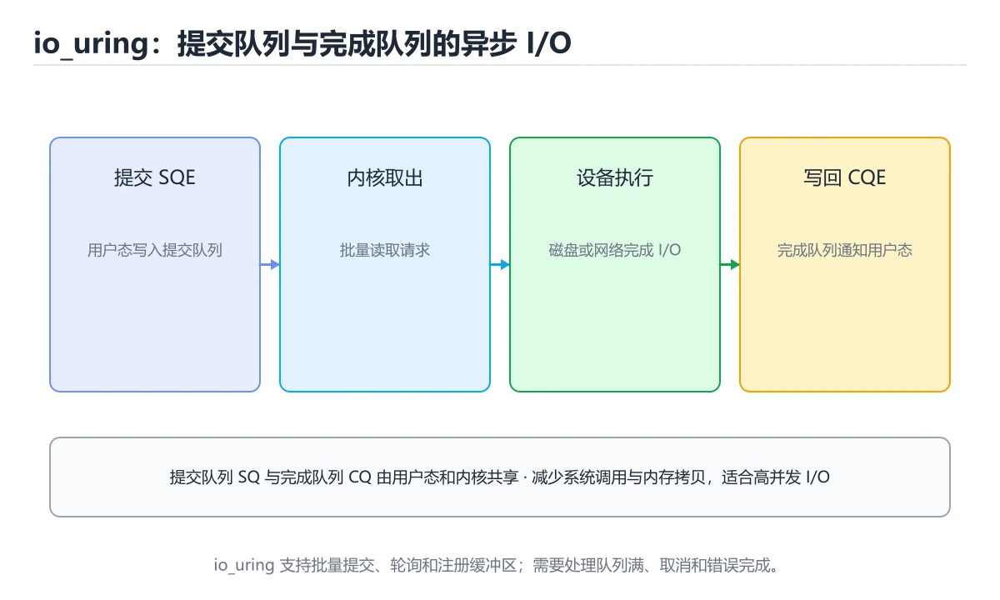
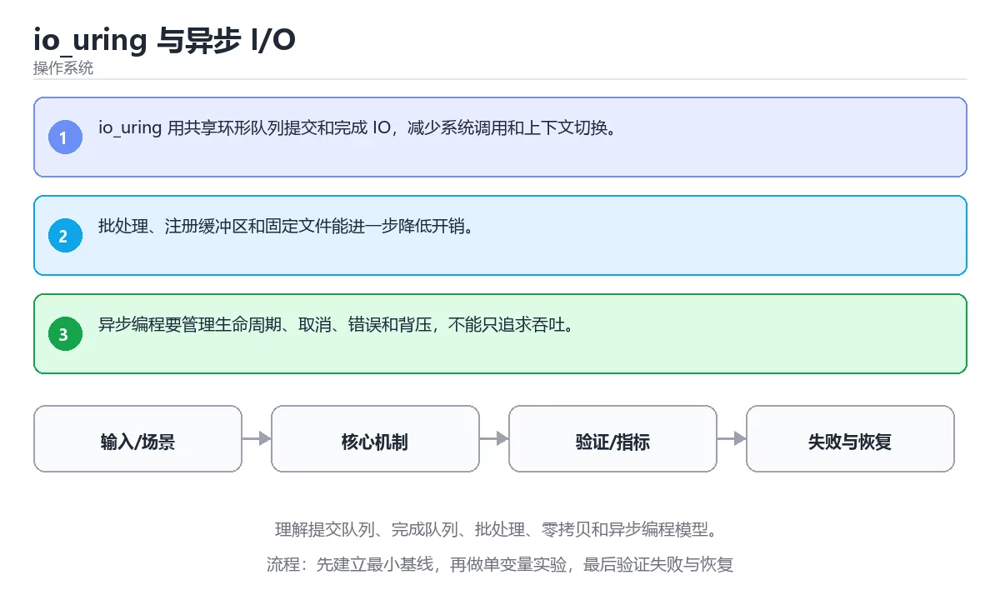

# io_uring 与异步 I/O

> 内容更新时间：2026-10-03





## 学习目标

- 能用自己的话解释：io_uring 用共享环形队列提交和完成 IO，减少系统调用和上下文切换。
- 能用自己的话解释：批处理、注册缓冲区和固定文件能进一步降低开销。
- 能用自己的话解释：异步编程要管理生命周期、取消、错误和背压，不能只追求吞吐。
- 能把本课知识放回「操作系统」，并完成练习与测验。

## 前置知识

- 已完成「操作系统」的基础课程，能运行正文中的最小示例。
- 本课关键词：io_uring、异步 IO、队列、零拷贝。
- 遇到不熟悉的术语先记录问题，完成练习后再回读。

## 核心知识

### 1. io_uring 用共享环形队列提交和完成 IO，减少系统调用和上下文切换。

- 关键做法：先用最小示例建立基线，再逐步加入边界、失败和性能条件。
- 验证标准：结果可复现、错误可解释、边界有测试、失败能恢复。

### 2. 批处理、注册缓冲区和固定文件能进一步降低开销。

把这条结论放回「io_uring 与异步 I/O」的完整流程里展开：

- 正文依据：能用自己的话解释：iouring 用共享环形队列提交和完成 IO，减少系统调用和上下文切换。
- 落地检查：把「2. 批处理、注册缓冲区和固定文件能进一步降低开销。」改写成一条可执行的核对项，逐条验证输入、超时与失败路径。

### 3. 异步编程要管理生命周期、取消、错误和背压，不能只追求吞吐。

把这条结论放回「io_uring 与异步 I/O」的完整流程里展开：

- 正文依据：本课关键词：iouring、异步 IO、队列、零拷贝。
- 落地检查：把「3. 异步编程要管理生命周期、取消、错误和背压，不能只追求吞吐。」改写成一条可执行的核对项，逐条验证输入、超时与失败路径。

## 关键流程

```text
输入 → 校验 → 核心处理 → 验证 → 记录指标 → 失败恢复
```

## 实践路径

1. 用一句话复述本课要解决的问题。
2. 跑通正文中的最小示例并记录基线。
3. 只改变一个输入或参数，预测并验证结果。
4. 补一个失败路径，记录错误、恢复和指标。
5. 把结论写成可复现的笔记或测试。

## 常见误区

| 误区 | 后果 | 修正 |
| --- | --- | --- |
| 只记术语不做实验 | 遇到真实问题无法判断 | 用最小输入跑通并记录结果 |
| 只测正常路径 | 边界和故障上线才暴露 | 补空值、极值和依赖失败 |
| 没有基线就优化 | 无法证明改进有效 | 先测量再修改 |
| 忽略成本与安全 | 性能和风险失控 | 同时记录资源、权限与失败代价 |

## 动手练习

1. 合上教程，用 3～5 句话解释io_uring 与异步 I/O。
2. 从正文选一个例子，改变一个条件并预测结果。
3. 设计一个失败场景，写出止损与恢复步骤。

**验收标准**：留下输入、命令、输出、差异和下一步问题。

## 本课小结

- 本课属于「操作系统」，核心关键词是 io_uring、异步 IO、队列、零拷贝。
- 先保证正确与可复现，再讨论性能和扩展。
- 完成练习和测验后，把仍然不确定的问题写成下一轮验证清单。

> 本课由 P1 内容扩展生成，重点补充原有课程缺失的主题与工程边界。

## 深入理解：io_uring 与异步 I/O

### 共享环形队列的模型

io_uring 在内核与用户态之间建立两个共享内存环：提交队列（SQ）放请求，完成队列（CQ）
放结果。应用把请求写进 SQ 并更新尾指针，内核处理后把结果写进 CQ，双方通过内存屏障
同步。因为内存共享，批量提交时可以在一次系统调用里塞入很多请求，甚至配合 SQPOLL
由内核线程轮询，做到接近零系统调用。

### 注册与批量优化

频繁使用的缓冲区、文件描述符和事件描述可以提前注册，避免每次请求都复制或解析；
配合固定缓冲还能支持 O_DIRECT 与零拷贝路径。链式请求（link）可以把多个操作串成
依赖序列，超时与取消也能作为请求提交。设计高吞吐网络或存储服务时，这些能力比
「异步」这个词本身更重要。

### 适用场景与坑

io_uring 适合高并发、小块、批量的 I/O；对低频、单次大文件读写，收益可能不如
普通异步接口。还要注意内核版本、容器 seccomp 策略、SQPOLL 的 CPU 占用，
以及错误处理复杂度：完成事件可能带部分结果，必须按 request 逐个核对。
先用压力测试证明瓶颈在系统调用，再引入 io_uring，才是稳妥的顺序。

## 可运行练习

### 任务 1：先跑通，再解释

```python
import os

print("pid>0:", os.getpid() > 0)
```

### 任务 2：只改一个条件

把「io_uring 与异步 I/O」的最小示例复制一份，只改一个条件再跑一次：

- 改动点：只把io_uring的输入换成空值、极值或错误输入，其余保持不变。
- 预测：先写下「io_uring 与异步 I/O」在改动后的输出或错误信息，再运行。
- 记录：对照改动前后的结果，指出差异出在哪一步。
- 验收：换回原条件能复现原结果，改动只影响io_uring。

### 任务 3：迁移到自己的数据

用同一套思路处理一组你自己的数据或场景，保持输出格式与任务 1 一致。

## 故障现场

### 现场 1：本课的 io_uring 常规用例通过，但边界用例失败

**症状**：在本课的练习或生产场景里出现“本课的 io_uring 常规用例通过，但边界用例失败”。

**复现**：准备一组最小输入，只保留触发“本课的 io_uring 常规用例通过，但边界用例失败”的必要条件，连续运行两次确认结果稳定。

**定位**：围绕“io_uring 的前置条件与取值边界没有写进代码，默认值掩盖了空值和极值”检查调用链、输入数据和环境配置，先验证假设再改代码。

**预防**：把“本课的 io_uring 常规用例通过，但边界用例失败”写成一条自动化用例，并在本课的验收清单里保留对应检查项。

### 现场 2：本课的 异步 IO 结果在两次运行之间不一致

**症状**：在本课的练习或生产场景里出现“本课的 异步 IO 结果在两次运行之间不一致”。

**复现**：准备一组最小输入，只保留触发“本课的 异步 IO 结果在两次运行之间不一致”的必要条件，连续运行两次确认结果稳定。

**定位**：围绕“异步 IO 依赖了当前版本、执行顺序或共享状态，单次运行无法暴露差异”检查调用链、输入数据和环境配置，先验证假设再改代码。

**预防**：把“本课的 异步 IO 结果在两次运行之间不一致”写成一条自动化用例，并在本课的验收清单里保留对应检查项。

### 现场 3：程序在开发机很快，换到目标机器后延迟飙升

**症状**：在本课的练习或生产场景里出现“程序在开发机很快，换到目标机器后延迟飙升”。

**复现**：准备一组最小输入，只保留触发“程序在开发机很快，换到目标机器后延迟飙升”的必要条件，连续运行两次确认结果稳定。

**定位**：围绕“调度、缺页、锁竞争与缓存命中率共同变化，io_uring 的局部结论被搬到了完全不同的资源约束下”检查调用链、输入数据和环境配置，先验证假设再改代码。

**修复**：为io_uring 与异步 I/O记录 CPU、内存、上下文切换和 I/O 等待指标，用火焰图或采样把瓶颈定位到具体阶段

**预防**：把“程序在开发机很快，换到目标机器后延迟飙升”写成一条自动化用例，并在本课的验收清单里保留对应检查项。

## 本课复习清单

离开本课前，逐项确认：

- [ ] 不看解析，能说出「关于，下列说法正确的是？」的判断依据。
- [ ] 不看解析，能说出「本课的核心学习目标是什么？」的判断依据。
- [ ] 至少运行一次本课示例，记录输入、输出和一个边界情况。
- [ ] 把本课最容易混淆的两个概念写成一句话对照。

| 复盘项 | 记录 |
| --- | --- |
| 已经能独立解释的考点 |  |
| 仍然说不清的概念 |  |
| 下一步验证动作 |  |

## 逐节复习与自检

下面按正文顺序回顾每一节，并给出一个自检问题；说不清的地方回到原章节补课。

### 核心知识

自检：这一节与相邻主题的边界在哪里？

### 动手练习

自检：如果去掉这一节里的一个前提，结论会怎样变化？

### 深入理解：io_uring 与异步 I/O

io_uring 在内核与用户态之间建立两个共享内存环：提交队列（SQ）放请求，完成队列（CQ）。应用把请求写进 SQ 并更新尾指针，内核处理后把结果写进 CQ，双方通过内存屏障。

自检：把这一节讲给没学过的人，最需要强调哪一点？

### 验证步骤

制造一次错误输入，记录错误信息与修复方式。

## 术语速查

| 术语 | 本课语境 |
| --- | --- |
| `io_uring` | 围绕“调度、缺页、锁竞争与缓存命中率共同变化，iouring 的局部结论被搬到了完全不同的资源约束下”检查调用链、输入数据和环境配置，先验证假设再改代码。 |
| `异步 IO` | 围绕“异步 IO 依赖了当前版本、执行顺序或共享状态，单次运行无法暴露差异”检查调用链、输入数据和环境配置，先验证假设再改代码。 |
| `队列` | 按“iouring 与异步 I/O”中 iouring、异步 IO、队列 的实践顺序，把四个步骤排成从准备到复盘的合理顺序。 |
| `零拷贝` | 本课属于「操作系统」，核心关键词是 iouring、异步 IO、队列、零拷贝。 |

## 深度拓展与实战

这一节把正文里的定义、代码和失败模式串成一条可操作的复习路线。

### 机制拆解

- **1. io_uring 用共享环形队列提交和完成 IO，减少系统调用和上下文切换。**：在「io_uring 与异步 I/O」里，「1. io_uring 用共享环形队列提交和完成 IO，减少系统调用和上下文切换。」这一步要先写清输入与预期，再记录实际结果和差异；结果不符时回到对应小节核对前提。
- **2. 批处理、注册缓冲区和固定文件能进一步降低开销。**：在「io_uring 与异步 I/O」里，「2. 批处理、注册缓冲区和固定文件能进一步降低开销。」这一步要先写清输入与预期，再记录实际结果和差异；结果不符时回到对应小节核对前提。
- **3. 异步编程要管理生命周期、取消、错误和背压，不能只追求吞吐。**：在「io_uring 与异步 I/O」里，「3. 异步编程要管理生命周期、取消、错误和背压，不能只追求吞吐。」这一步要先写清输入与预期，再记录实际结果和差异；结果不符时回到对应小节核对前提。
- **共享环形队列的模型**：io_uring 在内核与用户态之间建立两个共享内存环：提交队列（SQ）放请求，完成队列（CQ）
- **注册与批量优化**：频繁使用的缓冲区、文件描述符和事件描述可以提前注册，避免每次请求都复制或解析；

### 边界条件与常见反例

「io_uring 与异步 I/O」的边界不只包括最大最小值，还要覆盖空、重复和失败：

| 条件 | 常见反例 | 处理方式 |
| --- | --- | --- |
| 空输入 | io_uring 没有任何取值 | 先判空，给出明确错误而不是继续执行 |
| 边界值 | 异步 IO 取最小或最大 | 用最小值、最大值和越界值各跑一次 |
| 重复执行 | 同一输入被执行两次 | 保证结果可重复，必要时加锁或去重 |
| 失败路径 | io_uring 相关步骤报错 | 保留原始错误，确认回滚或重试行为 |

### 工程检查表

- [ ] 能否用自己的话说明io_uring 与异步 I/O解决什么问题，以及它不负责什么？
- [ ] 能否指出最小可运行示例的输入、输出和一条失败路径？
- [ ] 能否解释本课关键词在真实项目中的边界与取舍？
- [ ] 能否把本课方法迁移到另一个相近问题，并说明需要改什么？

### 迁移练习

1. 保持正文示例不变，写出它的输入、处理步骤和预期输出。
2. 只改变一个条件，预测结果并说明依据；再运行或手算验证。
3. 结合io_uring、异步 IO、队列、零拷贝，写出一个真实项目中的使用场景。
4. 写下一个反例，说明它在什么条件下会使朴素做法失效。

## 深入理解：io_uring 与异步 I/O

### 共享环形队列的模型

「io_uring 与异步 I/O」的「共享环形队列的模型」一节补全如下：

- 定位：这一节说明共享环形队列的模型在「io_uring 与异步 I/O」知识体系里的位置。
- 要点：配合固定缓冲还能支持 ODIRECT 与零拷贝路径。链式请求（link）可以把多个操作串成
- 自检：能否用一个最小例子解释共享环形队列的模型？

### 注册与批量优化

「异步」这个词本身更重要。

### 适用场景与坑

「io_uring 与异步 I/O」的「适用场景与坑」一节补全如下：

- 定位：这一节说明适用场景与坑在「io_uring 与异步 I/O」知识体系里的位置。
- 要点：症状：在本课的练习或生产场景里出现“本课的 异步 IO 结果在两次运行之间不一致”。
- 自检：能否用一个最小例子解释适用场景与坑？

## 考点精讲

### 考点 1：概念判断·io_uring

- **题目**：关于「io_uring 用共享环形队列提交和完成 IO，减少系统调用和上下文切换。」，下列说法正确的是？
- **判断依据**：在「io_uring 与异步 I/O」里，io_uring 用共享环形队列提交和完成 IO，减少系统调用和上下文切换。把“iouring 用共享环形队列提交和完成”代回「io_uring 与异步 I/O」里“iouring 用共享环形队列提交和完成 IO”的例子核对，条件一旦改变，结论就要用io_uring、异步 IO、队列重新推导。

### 考点 2：顺序排列·io_uring

- **题目**：按“io_uring 与异步 I/O”中 io_uring、异步 IO、队列 的实践顺序，把四个步骤排成从准备到复盘的合理顺序。
- **判断依据**：正确的执行顺序是「先明确 io_uring 的输入、输出与约束」 → 「写出最小示例并核对 异步 IO 的基线结果」 → 「只改一个变量，记录边界与失败路径的变化」 → 「固定版本与证据，把“io_uring 与异步 I/O”的结论写成可复现记录」。在「io_uring 与异步 I/O」里，正确的执行顺序是「先明确 iouring 的输入、输出与约束 → 写出最小示例并核对 异步 IO 的基线结果 → 只改一个变量，记录边界与失败路径的变化 → 固定版本与证据，把“iouring 与异步 I/O”的结论写成可复现记录」。在「io_uring 与异步 I/O」里，在本课的练习里，顺序应当是：先明确 iouring 的输入、输出与约束 → 写出最小示例并核对 异步 IO 的基线结果 → 只改一个变量，记录边界与失败路径的变化 → 固定版本与证据，把本课的结论写成可复现记录。

### 考点 3：代码补全·io_uring

- **题目**：这段 Python 代码是「io_uring 与异步 I/O」的示例片段，下面哪一项描述与它一致？
- **判断依据**：在「io_uring 与异步 I/O」里，这段代码会产生可观察的输出，运行后能看到结果。这段代码出自「io_uring 与异步 I/O」的正文示例，围绕io_uring、异步 IO、队列展开；把输入或边界换成空值、极值或失败情况后，结论要以「io_uring 与异步 I/O」的实际运行结果为准。

### 考点 4：概念判断·io_uring

- **题目**：「io_uring 与异步 I/O」的核心学习目标是什么？
- **判断依据**：在「io_uring 与异步 I/O」里，结论应落在「理解提交队列、完成队列、批处理、零拷贝和异步编程模型」。在「io_uring 与异步 I/O」里，结论应落在理解提交队列、完成队列、批处理、零拷贝和异步编程模型。在「io_uring 与异步 I/O」里，这道题要求区分概念与边界，理解提交队列、完成队列、批处理、零拷贝和异步编程模型。

### 考点 5：多选辨析·io_uring

- **题目**：以下哪些术语与「io_uring 与异步 I/O」直接相关？（多选）
- **判断依据**：在「io_uring 与异步 I/O」里，io_uring；异步 IO。回到「io_uring 与异步 I/O」的正文示例，用“以下哪些术语与iouring 与异步”走一遍io_uring、异步 IO、队列的完整流程，能复现的结论才可以保留。

## English Overview

**Title:** io_uring and Asynchronous IO

**Summary:** Learn submission/completion queues, batching, zero copy and async models.

**Category:** Operating Systems
**Level:** 高级
**Key terms:** io_uring, 异步 IO, 队列, 零拷贝

## 内容元数据

- 内容版本：v2.0
- 最后更新：2026-10-03
- 学习阶段：高级
- 适用环境：Linux 6.x / POSIX
- 内容来源：内置结构化课程与工程实践整理
- 相关主题：io_uring、异步 IO、队列、零拷贝
- 质量版本：P0 测验标准 + P1 覆盖扩展 + P2 体验补全

## 最小可运行示例

下面示例用于验证本课的最小输入、处理和输出。先原样运行，再只修改一个值：

```python
import os

print("pid>0:", os.getpid() > 0)
```

## 预期输出

```text
pid>0: True
```

## 验证步骤

1. 记录运行环境、命令和真实输出。
2. 修改一个输入，先写预测再运行。
4. 把结论写回本课笔记或测试用例。

## 参考资料与复核

- 最后复核：2026-10-04
- 下次复核：2027-04-04
- 复核范围：版本兼容、API 行为、安全建议与工程实践
- 来源性质：官方文档、标准或权威教材；正文为离线教学重组

| 参考资料 | 本课用途 |
| --- | --- |
| [Linux 内核文档](https://docs.kernel.org/) | 调度、内存、文件系统与 I/O |
| [POSIX 标准](https://pubs.opengroup.org/onlinepubs/9799919799/) | 可移植操作系统接口 |
| [QEMU 文档](https://www.qemu.org/docs/master/) | 虚拟化与系统模拟 |

> 「io_uring 与异步 I/O」的链接用于离线阅读后的延伸核对；App 不会自动联网。

## 复习与迁移

复习目标：把「io_uring 与异步 I/O」的判断标准放回可复现的例子里。先自己作答，再对照依据；如果结论正确但理由不完整，回到正文补足前提。

### 概念复述

- 用一句话说明「io_uring 与异步 I/O」解决什么问题：理解提交队列、完成队列、批处理、零拷贝和异步编程模型。
- 写出io_uring、异步 IO、队列之间的关系，并各举一个例子。
- 说出本课最容易混淆的两个概念，以及区分它们的判据。

### 正文逐节复核

- **深入理解：io_uring 与异步 I/O**：io_uring 在内核与用户态之间建立两个共享内存环：提交队列（SQ）放请求，完成队列（CQ）。
- **逐节复习与自检**：io_uring 在内核与用户态之间建立两个共享内存环：提交队列（SQ）放请求，完成队列（CQ）。

### 测验回顾

1. 关于「io_uring 用共享环形队列提交和完成 IO，减少系统调用和上下文切换。」，下列说法正确的是？
   - 依据：在「io_uring 与异步 I/O」里，io_uring 用共享环形队列提交和完成 IO，减少系统调用和上下文切换。把“iouring 用共享环形队列提交和完成”代回「io_uring 与异步 I/O」里“iouring 用共享环形队列提交和完成 IO”的例子核对，条件一旦改变，结论就要用io_uring、异步 IO、队列重新推导。
2. 按“io_uring 与异步 I/O”中 io_uring、异步 IO、队列 的实践顺序，把四个步骤排成从准备到复盘的合理顺序。
   - 依据：正确的执行顺序是「先明确 io_uring 的输入、输出与约束」 → 「写出最小示例并核对 异步 IO 的基线结果」 → 「只改一个变量，记录边界与失败路径的变化」 → 「固定版本与证据，把“io_uring 与异步 I/O”的结论写成可复现记录」。在「io_uring 与异步 I/O」里，正确的执行顺序是「先明确 iouring 的输入、输出与约束 → 写出最小示例并核对 异步 IO 的基线结果 → 只改一个变量，记录边界与失败路径的变化 → 固定版本与证据，把“iouring 与异步 I/O”的结论写成可复现记录」。在「io_uring 与异步 I/O」里，在本课的练习里，顺序应当是：先明确 iouring 的输入、输出与约束 → 写出最小示例并核对 异步 IO 的基线结果 → 只改一个变量，记录边界与失败路径的变化 → 固定版本与证据，把本课的结论写成可复现记录。
3. 这段 Python 代码是「io_uring 与异步 I/O」的示例片段，下面哪一项描述与它一致？
   - 依据：在「io_uring 与异步 I/O」里，这段代码会产生可观察的输出，运行后能看到结果。这段代码出自「io_uring 与异步 I/O」的正文示例，围绕io_uring、异步 IO、队列展开；把输入或边界换成空值、极值或失败情况后，结论要以「io_uring 与异步 I/O」的实际运行结果为准。
4. 「io_uring 与异步 I/O」的核心学习目标是什么？
   - 依据：在「io_uring 与异步 I/O」里，结论应落在「理解提交队列、完成队列、批处理、零拷贝和异步编程模型」。在「io_uring 与异步 I/O」里，结论应落在理解提交队列、完成队列、批处理、零拷贝和异步编程模型。在「io_uring 与异步 I/O」里，这道题要求区分概念与边界，理解提交队列、完成队列、批处理、零拷贝和异步编程模型。
5. 以下哪些术语与「io_uring 与异步 I/O」直接相关？（多选）
   - 依据：在「io_uring 与异步 I/O」里，io_uring；异步 IO。回到「io_uring 与异步 I/O」的正文示例，用“以下哪些术语与iouring 与异步”走一遍io_uring、异步 IO、队列的完整流程，能复现的结论才可以保留。

### 迁移练习

把「io_uring 与异步 I/O」的结论迁移到相邻主题，每次迁移都写清预测与证据：

1. 换输入：用io_uring处理一组你自己的数据，对比教材示例的结果差异。
2. 换失败条件：制造一个异步 IO相关的错误，说明如何从错误信息定位根因。
3. 换规模：把数据量或并发度提高一个数量级，说明「io_uring 与异步 I/O」的结论是否仍成立。
