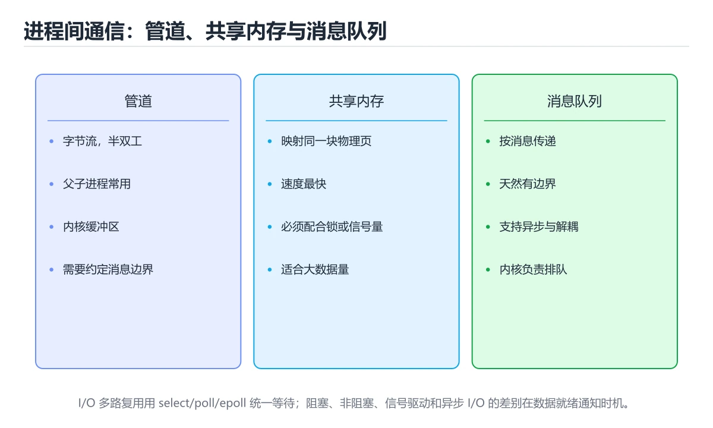
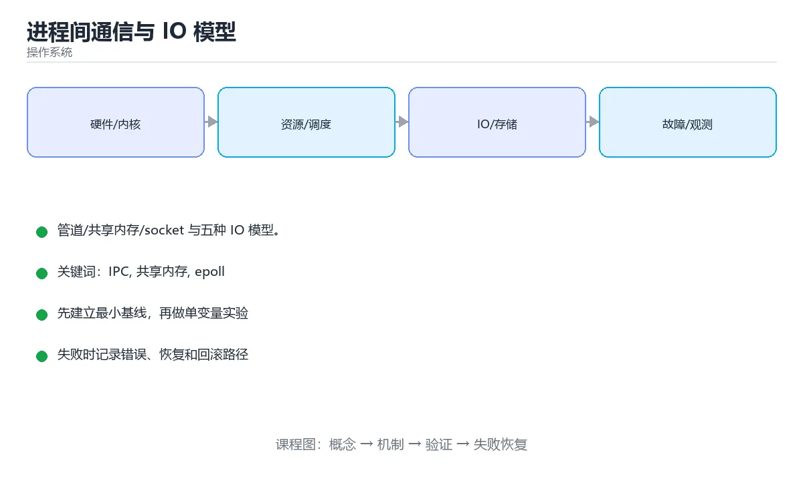

# 进程间通信与 IO 模型

> 内容更新时间：2026-10-06 · 学习阶段：进阶 · 预计用时：30 分钟





## 学习目标

- 能用自己的话解释进程间通信与 IO 模型解决了什么问题，而不是只背术语。
- 能说清 「IPC」、「共享内存」、「epoll」、「多路复用」 之间的关系，并分别举出一个例子。
- 能把本课知识放回「操作系统」的知识体系，说明它和相邻主题的边界。
- 能完成本课练习，并用验收标准检查自己的结果。

> 一句话摘要：管道/共享内存/socket 与五种 IO 模型。

## 前置知识

- 先完成上一课《文件系统基础》；如果已经掌握，可以直接用本课练习自测。
- 本课阶段：进阶。建议先掌握同一分类的基础课程，并能独立运行正文中的最小示例。
- 开始前先复习：IPC、共享内存、epoll。
- 如果某一步看不懂，先记录具体卡点，完成练习后再回头读一遍。

## 为什么需要 IPC

进程地址空间相互隔离，交换数据必须通过内核提供的机制。选择哪种方式，取决于数据量、实时性、是否跨主机与耦合程度。

| 方式 | 特点 | 适用 |
| --- | --- | --- |
| 管道 / 命名管道 | 单向字节流，简单 | 父子进程、命令行管道 |
| 消息队列 | 有边界消息，内核缓冲 | 解耦、异步任务 |
| 共享内存 | 最快，需自行同步 | 大数据量、低延迟 |
| 信号量 | 计数同步原语 | 保护共享资源 |
| 信号 | 异步通知，信息量小 | 终止、重载配置 |
| Socket | 可跨主机 | 网络服务、本地回环通信 |

共享内存虽快，但要配合信号量或互斥锁，否则会出现数据竞争。

## 五种 IO 模型

| 模型 | 行为 | 特点 |
| --- | --- | --- |
| 阻塞 IO | 调用后一直等到数据就绪 | 编程简单，线程被占用 |
| 非阻塞 IO | 立即返回，需轮询 | 轮询浪费 CPU |
| IO 多路复用 | select/poll/epoll 统一等待多个 fd | 高并发服务主流 |
| 信号驱动 IO | 内核就绪后发信号 | 使用较少 |
| 异步 IO | 内核完成整个读写后通知 | 真正无阻塞，Linux 上是 io_uring / POSIX AIO |

## select、poll 与 epoll

三者都是 IO 多路复用，差别在效率与可扩展性：

| 对比 | select | poll | epoll |
| --- | --- | --- | --- |
| 最大连接数 | 有上限（FD_SETSIZE） | 无硬上限 | 无硬上限 |
| 时间复杂度 | O(n) 遍历 | O(n) 遍历 | O(1) 事件回调 |
| 触发方式 | 水平触发 | 水平触发 | 水平 / 边缘触发 |
| 适用 | 少量连接 | 中等规模 | 高并发（Nginx、Redis） |

边缘触发（ET）只在状态变化时通知一次，必须一次把数据读干净，否则会「丢事件」；水平触发（LT）只要有数据就持续通知，编程更简单。

## 高并发服务的基本形态

单线程事件循环 + 非阻塞 IO（Redis）、多线程/多进程 + epoll（Nginx）、协程 + IO 多路复用（Go、Rust async、Python asyncio）本质上都是**用少量线程管理大量连接**，避免「一连接一线程」带来的内存与切换开销。

## 本课小结

IPC 解决进程间数据交换，IO 模型决定高并发能力。记住一条主线：**阻塞 → 非阻塞 → 多路复用 → 异步**，以及 epoll 的 LT/ET 差异。

## 进程间通信对照

| 方式 | 方向 | 速度 | 适用 |
| --- | --- | --- | --- |
| 管道 pipe | 单向 | 快 | 父子进程流式传输 |
| 命名管道 FIFO | 单向 | 快 | 无亲缘关系进程 |
| 消息队列 | 有边界消息 | 中 | 结构化消息、解耦 |
| 共享内存 | 双向 | 最快 | 大数据量高频交换 |
| 信号量 | 同步 | 快 | 保护共享内存 |
| 信号 signal | 通知 | 快 | 终止、重载配置 |
| Unix 域套接字 | 双向 | 快 | 本地服务通信、可传 fd |
| TCP 套接字 | 双向 | 较慢 | 跨主机 |

## IO 模型对照

| 模型 | 等待数据 | 拷贝数据 | 特点 |
| --- | --- | --- | --- |
| 阻塞 IO | 阻塞 | 阻塞 | 最简单，一连接一线程 |
| 非阻塞 IO | 轮询 | 阻塞 | 需配合多路复用 |
| IO 多路复用 | 阻塞在 select/epoll | 阻塞 | 单线程管理大量连接 |
| 信号驱动 IO | 回调通知 | 阻塞 | 使用较少 |
| 异步 IO（AIO / IOCP） | 不阻塞 | 不阻塞 | 完成后通知，编程模型复杂 |

```python
import os
import select
import socket
import time

def pipe_demo():
    """管道：父进程读、子进程写。"""
    read_fd, write_fd = os.pipe()
    pid = os.fork()
    if pid == 0:
        os.close(read_fd)
        os.write(write_fd, b"child message")
        os.close(write_fd)
        os._exit(0)
    os.close(write_fd)
    data = os.read(read_fd, 1024)
    os.close(read_fd)
    os.waitpid(pid, 0)
    return data.decode()

def socketpair_demo():
    """Unix 域套接字对：双向通信，适合本地进程协作。"""
    left, right = socket.socketpair()
    try:
        left.sendall(b"ping")
        return right.recv(16)
    finally:
        left.close()
        right.close()

def epoll_echo(port: int = 0, timeout: float = 2.0):
    """epoll 边缘触发：一次读到 EAGAIN 为止。"""
    server = socket.socket()
    server.setsockopt(socket.SOL_SOCKET, socket.SO_REUSEADDR, 1)
    server.bind(("127.0.0.1", port))
    server.listen(64)
    server.setblocking(False)
    epoll = select.epoll()
    epoll.register(server.fileno(), select.EPOLLIN)
    events, handled = [], 0
    deadline = time.monotonic() + timeout
    try:
        while time.monotonic() < deadline and handled == 0:
            for fileno, mask in epoll.poll(0.5):
                if fileno == server.fileno():
                    conn, _ = server.accept()
                    conn.setblocking(False)
                    epoll.register(conn.fileno(), select.EPOLLIN | select.EPOLLET)
                else:
                    conn = socket.socket(fileno=fileno)
                    try:
                        while True:                      # ET 必须读到 EAGAIN
                            chunk = conn.recv(4096)
                            if not chunk:
                                break
                            events.append(chunk)
                            handled += 1
                    except BlockingIOError:
                        pass
                    finally:
                        conn.close()
    finally:
        epoll.close()
        server.close()
    return events

print(socketpair_demo())
```

## 常见错误与排查

| 容易踩的做法 | 实际现象 | 原因与正确做法 |
| --- | --- | --- |
| 共享内存不加同步 | 数据竞争与脏读 | 用信号量或互斥量保护 |
| 管道写入超过缓冲区 | 写阻塞或部分写 | 分段写入并处理部分写 |
| 忘记关闭无用文件描述符 | 描述符泄漏 | 关闭所有不用的 fd |
| epoll 用水平触发却只读一次 | 反复触发 | 一次读尽或改用 ET |
| ET 模式未读到 EAGAIN | 后续事件不再通知 | 循环读到 `EAGAIN` |
| 忽略 EINTR | 系统调用被信号中断 | 重试被中断的调用 |
| 用信号传递复杂数据 | 丢失且不可靠 | 信号只做通知，数据走队列或共享内存 |
| 僵尸进程堆积 | 资源泄漏 | `waitpid` 回收子进程 |
| 用 TCP 做本机通信 | 多余协议栈开销 | 优先 Unix 域套接字 |
| 无限扩张消息队列 | 内存耗尽 | 设上限与背压策略 |

## 复习与自测

- [ ] 能按场景选择管道、共享内存、消息队列或套接字。
- [ ] 能区分阻塞、非阻塞、多路复用与异步 IO。
- [ ] 共享内存访问有同步保护。
- [ ] ET 模式下读到 `EAGAIN`。
- [ ] 子进程被正确回收，无僵尸进程。

## 动手练习

> 本课练习重点：围绕「IPC、共享内存、epoll」完成复述、实验和交付，每个结果都要能被别人检查。

先画出进程、线程或资源状态，再模拟调度与竞争，最后记录状态迁移。

### 练习 1：建立心智模型（10 分钟）

合上教程，用 3～5 句话回答：

1. 进程间通信与 IO 模型解决了什么问题？
2. 如果没有它，会出现什么具体后果？
3. 它和「共享内存」是什么关系？

**验收标准**：至少出现一个本课关键词，并写出一个反例、边界条件或失效场景。

### 练习 2：做一次可控实验（20 分钟）

从正文中选一个最小示例，完成以下操作：

1. 先预测修改一个参数、输入或步骤后的结果。
2. 再实际执行或逐步推演，记录真实结果。
3. 如果结果与预测不同，写出差异原因。

**验收标准**：留下「原例 → 改动 → 预测 → 结果 → 原因」五步记录。

### 练习 3：交付一个小结果（30 分钟）

用伪代码或小脚本模拟一次调度、竞争或资源分配，并记录至少 5 个状态变化。

任务要求：

- 结果必须能被别人检查，不能只写“我已经理解了”。
- 至少覆盖「IPC」和「共享内存」两个关键词。
- 写出 1 个仍然不确定的问题，以及下一步如何验证。

> 提示：时间有限时优先做练习 1 和练习 2；练习 3 可以拆成两次完成。

## 可运行练习

本节围绕进程间通信与 IO 模型安排 3 个可交付任务，每个任务都要求留下可以复查的记录。

### 任务 1：用自己的话画出结构

不看书，用一张图说清「进程间通信与 IO 模型」的结构，画完再对照骨架：

- 主干：为什么需要 IPC → 五种 IO 模型 → select、poll 与 epoll → 高并发服务的基本形态
- 连接线：在每条边上标出输入、输出与失败路径。
- 自检：能否用一句话说明IPC与共享内存的关系？

### 任务 2：做一次对比实验

**验收标准**：表格里两个方案的结论不能完全一样；写下“在什么条件下应该换方案”。

### 任务 3：迁移到自己的场景

**验收标准**：至少有一个可复现的命令、代码片段或数据样例；结论能被别人独立检查。

## 故障现场

### 现场 1：本课的 IPC 常规用例通过，但边界用例失败

**症状**：在本课的练习或生产场景里出现“本课的 IPC 常规用例通过，但边界用例失败”。

**复现**：准备一组最小输入，只保留触发“本课的 IPC 常规用例通过，但边界用例失败”的必要条件，连续运行两次确认结果稳定。

**定位**：围绕“IPC 的前置条件与取值边界没有写进代码，默认值掩盖了空值和极值”检查调用链、输入数据和环境配置，先验证假设再改代码。

**预防**：把“本课的 IPC 常规用例通过，但边界用例失败”写成一条自动化用例，并在本课的验收清单里保留对应检查项。

### 现场 2：本课的 共享内存 结果在两次运行之间不一致

**症状**：在本课的练习或生产场景里出现“本课的 共享内存 结果在两次运行之间不一致”。

**复现**：准备一组最小输入，只保留触发“本课的 共享内存 结果在两次运行之间不一致”的必要条件，连续运行两次确认结果稳定。

**定位**：围绕“共享内存 依赖了当前版本、执行顺序或共享状态，单次运行无法暴露差异”检查调用链、输入数据和环境配置，先验证假设再改代码。

**预防**：把“本课的 共享内存 结果在两次运行之间不一致”写成一条自动化用例，并在本课的验收清单里保留对应检查项。

### 现场 3：程序在开发机很快，换到目标机器后延迟飙升

**症状**：在本课的练习或生产场景里出现“程序在开发机很快，换到目标机器后延迟飙升”。

**复现**：准备一组最小输入，只保留触发“程序在开发机很快，换到目标机器后延迟飙升”的必要条件，连续运行两次确认结果稳定。

**定位**：围绕“调度、缺页、锁竞争与缓存命中率共同变化，IPC 的局部结论被搬到了完全不同的资源约束下”检查调用链、输入数据和环境配置，先验证假设再改代码。

**修复**：为进程间通信与 IO 模型记录 CPU、内存、上下文切换和 I/O 等待指标，用火焰图或采样把瓶颈定位到具体阶段

**预防**：把“程序在开发机很快，换到目标机器后延迟飙升”写成一条自动化用例，并在本课的验收清单里保留对应检查项。

## 本课复习清单

离开本课前，逐项确认：

- [ ] 不看解析，能说出「下面哪种 IPC 方式速度最快？」的判断依据。
- [ ] 不看解析，能说出「epoll 相比 select 的优势是？」的判断依据。
- [ ] 不看解析，能说出「边缘触发（ET）模式下必须注意？」的判断依据。
- [ ] 不看解析，能说出「Unix 域套接字相比管道的优势是？」的判断依据。
- [ ] 不看解析，能说出「阻塞 IO、IO 多路复用与异步 IO 的核心区别是？」的判断依据。
- [ ] 不看解析，能说出的判断依据。
- [ ] 至少运行一次本课示例，记录输入、输出和一个边界情况。
- [ ] 把本课最容易混淆的两个概念写成一句话对照。

| 复盘项 | 记录 |
| --- | --- |
| 已经能独立解释的考点 |  |
| 仍然说不清的概念 |  |
| 下一步验证动作 |  |

## 术语速查

| 术语 | 本课语境 |
| --- | --- |
| `EAGAIN` | \| ET 模式未读到 EAGAIN \| 后续事件不再通知 \| 循环读到 `EAGAIN` \| |
| `waitpid` | \| 僵尸进程堆积 \| 资源泄漏 \| `waitpid` 回收子进程 \| |
| `IPC` | 围绕“调度、缺页、锁竞争与缓存命中率共同变化，IPC 的局部结论被搬到了完全不同的资源约束下”检查调用链、输入数据和环境配置，先验证假设再改代码。 |
| `共享内存` | 围绕“共享内存 依赖了当前版本、执行顺序或共享状态，单次运行无法暴露差异”检查调用链、输入数据和环境配置，先验证假设再改代码。 |
| `epoll` | 为什么需要 IPC → 五种 IO 模型 → select、poll 与 epoll → 高并发服务的基本形态。 |
| `多路复用` | 三者都是 IO 多路复用，差别在效率与可扩展性：。 |

## 考点精讲

### 考点 1：多选辨析·IPC

- **题目**：围绕“进程间通信与 IO 模型”中的 IPC、共享内存、epoll，下列哪两项是本课强调的实践判断？
- **判断依据**：本课把进程间通信与 IO 模型拆成概念、示例与故障现场三部分，因此判断 IPC 时必须同时交代输入、输出和失败路径，这使“学习 IPC 时要同时说明输入、输出和失败路径，不能只看正常流程”成立。在进程间通信与 IO 模型里，判断 共享内存 时要固定版本与边界输入，所以“验证 共享内存 时要固定版本并覆盖边界输入，结论才可复现”才可复现。

### 考点 2：概念判断·IPC

- **题目**：epoll 相比 select 的优势是？
- **判断依据**：在「进程间通信与 IO 模型」里，O(1) 事件回调且无连接数硬上限。select 每次都要遍历全部 fd，连接数多时开销急剧上升。这道题的关键在「进程间通信与 IO 模型」的IPC、共享内存、epoll：先确认题干“epoll 相比 select 的优”问的是哪一步，再排除偷换前提的选项。

### 考点 3：概念判断·IPC

- **题目**：边缘触发（ET）模式下必须注意？
- **判断依据**：ET 只在状态变化时通知一次，未读完会导致事件丢失。在「进程间通信与 IO 模型」里，如果只凭关键词作答，很容易把「不能使用多路复用」、「每次都要重新注册」与「必须一次把数据读干净」混在一起；回到「进程间通信与 IO 模型」的正文示例，用“边缘触发（ET）模式下必须注意”走一遍IPC、共享内存、epoll的完整流程，能复现的结论才可以保留。

### 考点 4：概念判断·IPC

- **题目**：「进程间通信与 IO 模型」的核心结论是什么？
- **判断依据**：题干的正确项是进程间通信与 IO 模型：管道/共享内存/socket 与五种 IO 模型。在「进程间通信与 IO 模型」里，把IPC、共享内存、epoll放进最小示例验证，换成空值或极值后结论仍要成立。在「进程间通信与 IO 模型」里判断这道题，要把IPC、共享内存、epoll的条件、过程与失败路径逐项对齐，换成“进程间通信与 IO 模型的核心结论是”这个场景，只有满足前提的结论才成立。

### 考点 5：概念判断·IPC

- **题目**：阻塞 IO、IO 多路复用与异步 IO 的核心区别是？
- **判断依据**：在「进程间通信与 IO 模型」里，谁负责等待数据就绪。多路复用只是「等待」高效，读取仍需自己发起。回到「进程间通信与 IO 模型」的正文示例，用“阻塞 IO、IO 多路复用与异步 I”走一遍IPC、共享内存、epoll的完整流程，能复现的结论才可以保留。

### 考点 6：填空·os.____(pid, 0)

- **题目**：补全代码：「进程间通信与 IO 模型」示例中，下面这行代码缺少哪个关键字或函数名？请填入 ____。 `os.____(pid, 0)`
- **判断依据**：把“waitpid”代回「进程间通信与 IO 模型」里“进程间通信与 IO 模型示例中”的例子核对，条件一旦改变，结论就要用IPC、共享内存、epoll重新推导。「进程间通信与 IO 模型」要求先交代IPC、共享内存、epoll的前提再下结论，所以“waitpid”只在题干“进程间通信与”给定的条件下成立。

## English Overview

**Title:** IPC & IO Models

**Summary:** Pipes, shared memory, sockets and IO models.

**Category:** Operating Systems
**Level:** 进阶
**Key terms:** IPC, 共享内存, epoll, 多路复用, 边缘触发

## 内容元数据

- 内容版本：v2.0
- 最后更新：2026-10-06
- 学习阶段：进阶
- 适用环境：Linux 6.x / POSIX
- 内容来源：内置结构化课程与工程实践整理
- 相关主题：IPC、共享内存、epoll、多路复用、边缘触发
- 质量版本：P0 测验标准 + P1 覆盖扩展 + P2 体验补全

## 参考资料与复核

- 最后复核：2026-10-04
- 下次复核：2027-04-04
- 复核范围：版本兼容、API 行为、安全建议与工程实践
- 来源性质：官方文档、标准或权威教材；正文为离线教学重组

| 参考资料 | 本课用途 |
| --- | --- |
| [Linux 内核文档](https://docs.kernel.org/) | 调度、内存、文件系统与 I/O |
| [LWN 内核文章](https://lwn.net/Kernel/Index/) | 内核机制与演进 |
| [Linux man-pages](https://man7.org/linux/man-pages/) | 系统调用与用户态接口 |

> 「进程间通信与 IO 模型」的链接用于离线阅读后的延伸核对；App 不会自动联网。

## 代码对照与验证

这一节用 Python 标准库演示进程间通信的三种典型方式，并对照它们的适用场景。

### 对照一：管道传递结构化数据

```python
from multiprocessing import Pipe, Process

def worker(sender):
    sender.send({"task": "resize", "size": [640, 480]})
    sender.close()

if __name__ == "__main__":
    receiver, sender = Pipe(duplex=False)
    process = Process(target=worker, args=(sender,))
    process.start()
    sender.close()
    print(receiver.recv())
    process.join()
```

管道适合点对点、消息量适中的场景：发送方写入的对象会被序列化，接收方按顺序读出。

### 对照二：共享内存与锁

```python
from multiprocessing import Lock, Process, Value

def increment(counter, lock):
    for _ in range(1000):
        with lock:
            counter.value += 1

if __name__ == "__main__":
    counter = Value("i", 0)
    lock = Lock()
    processes = [Process(target=increment, args=(counter, lock)) for _ in range(4)]
    [p.start() for p in processes]
    [p.join() for p in processes]
    print(counter.value)
```

共享内存避免复制开销，但并发写必须加锁；漏掉锁会出现丢失更新，且难以复现。

### 对照三：三种机制怎么选

| 机制 | 适合的数据 | 主要成本 |
| --- | --- | --- |
| 管道 / 队列 | 消息、任务派发 | 序列化与复制 |
| 共享内存 | 大块数组、图像缓冲 | 同步与生命周期管理 |
| 文件与套接字 | 跨机器、持久化数据 | 延迟与协议设计 |

### 验证清单

- 每个进程都明确退出条件，主进程会等待子进程回收。
- 共享状态都有锁或原子操作保护，并通过多次运行验证结果稳定。
- 跨机器场景优先用套接字或消息队列，而不是共享内存。

## 复习与迁移

复习目标：把「进程间通信与 IO 模型」的判断标准放回可复现的例子里。先自己作答，再对照依据；如果结论正确但理由不完整，回到正文补足前提。

### 概念复述

- 用一句话说明「进程间通信与 IO 模型」解决什么问题：管道/共享内存/socket 与五种 IO 模型。
- 写出IPC、共享内存、epoll之间的关系，并各举一个例子。
- 说出本课最容易混淆的两个概念，以及区分它们的判据。

### 正文逐节复核

- **为什么需要 IPC**：共享内存虽快，但要配合信号量或互斥锁，否则会出现数据竞争。
- **select、poll 与 epoll**：三者都是 IO 多路复用，差别在效率与可扩展性：。
- **高并发服务的基本形态**：单线程事件循环 + 非阻塞 IO（Redis）、多线程/多进程 + epoll（Nginx）、协程 + IO 多路复用（Go、Rust async、Python asyncio）本质上都是**用少量线程管理大量连接**，避免「一连接一线程」。
- **实践任务**：本节围绕进程间通信与 IO 模型安排 3 个可交付任务，每个任务都要求留下可以复查的记录。

### 测验回顾

1. 围绕“进程间通信与 IO 模型”中的 IPC、共享内存、epoll，下列哪两项是本课强调的实践判断？
   - 依据：本课把进程间通信与 IO 模型拆成概念、示例与故障现场三部分，因此判断 IPC 时必须同时交代输入、输出和失败路径，这使“学习 IPC 时要同时说明输入、输出和失败路径，不能只看正常流程”成立。在进程间通信与 IO 模型里，判断 共享内存 时要固定版本与边界输入，所以“验证 共享内存 时要固定版本并覆盖边界输入，结论才可复现”才可复现。
2. epoll 相比 select 的优势是？
   - 依据：在「进程间通信与 IO 模型」里，O(1) 事件回调且无连接数硬上限。select 每次都要遍历全部 fd，连接数多时开销急剧上升。这道题的关键在「进程间通信与 IO 模型」的IPC、共享内存、epoll：先确认题干“epoll 相比 select 的优”问的是哪一步，再排除偷换前提的选项。
3. 边缘触发（ET）模式下必须注意？
   - 依据：ET 只在状态变化时通知一次，未读完会导致事件丢失。在「进程间通信与 IO 模型」里，如果只凭关键词作答，很容易把「不能使用多路复用」、「每次都要重新注册」与「必须一次把数据读干净」混在一起；回到「进程间通信与 IO 模型」的正文示例，用“边缘触发（ET）模式下必须注意”走一遍IPC、共享内存、epoll的完整流程，能复现的结论才可以保留。
4. 「进程间通信与 IO 模型」的核心结论是什么？
   - 依据：题干的正确项是进程间通信与 IO 模型：管道/共享内存/socket 与五种 IO 模型。在「进程间通信与 IO 模型」里，把IPC、共享内存、epoll放进最小示例验证，换成空值或极值后结论仍要成立。在「进程间通信与 IO 模型」里判断这道题，要把IPC、共享内存、epoll的条件、过程与失败路径逐项对齐，换成“进程间通信与 IO 模型的核心结论是”这个场景，只有满足前提的结论才成立。
5. 阻塞 IO、IO 多路复用与异步 IO 的核心区别是？
   - 依据：在「进程间通信与 IO 模型」里，谁负责等待数据就绪。多路复用只是「等待」高效，读取仍需自己发起。回到「进程间通信与 IO 模型」的正文示例，用“阻塞 IO、IO 多路复用与异步 I”走一遍IPC、共享内存、epoll的完整流程，能复现的结论才可以保留。
6. 补全代码：「进程间通信与 IO 模型」示例中，下面这行代码缺少哪个关键字或函数名？请填入 ____。

`os.____(pid, 0)`
   - 依据：把“waitpid”代回「进程间通信与 IO 模型」里“进程间通信与 IO 模型示例中”的例子核对，条件一旦改变，结论就要用IPC、共享内存、epoll重新推导。「进程间通信与 IO 模型」要求先交代IPC、共享内存、epoll的前提再下结论，所以“waitpid”只在题干“进程间通信与”给定的条件下成立。

### 迁移练习

把「进程间通信与 IO 模型」的结论迁移到相邻主题，每次迁移都写清预测与证据：

1. 换输入：用IPC处理一组你自己的数据，对比教材示例的结果差异。
2. 换失败条件：制造一个共享内存相关的错误，说明如何从错误信息定位根因。
3. 换规模：把数据量或并发度提高一个数量级，说明「进程间通信与 IO 模型」的结论是否仍成立。
