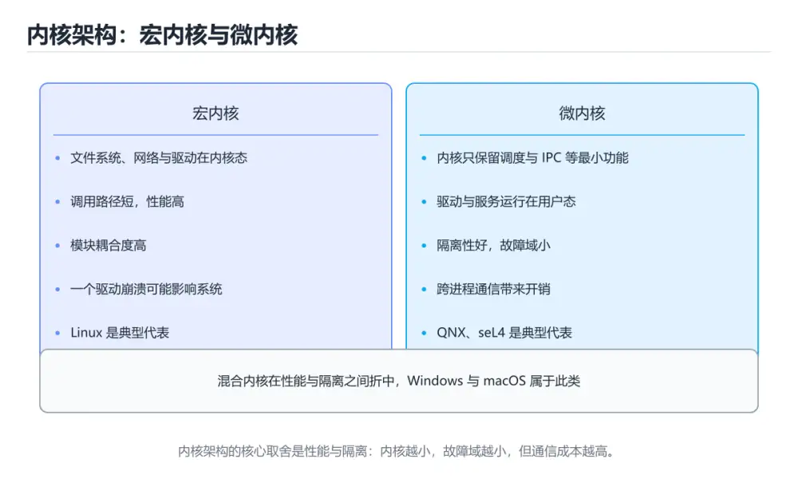
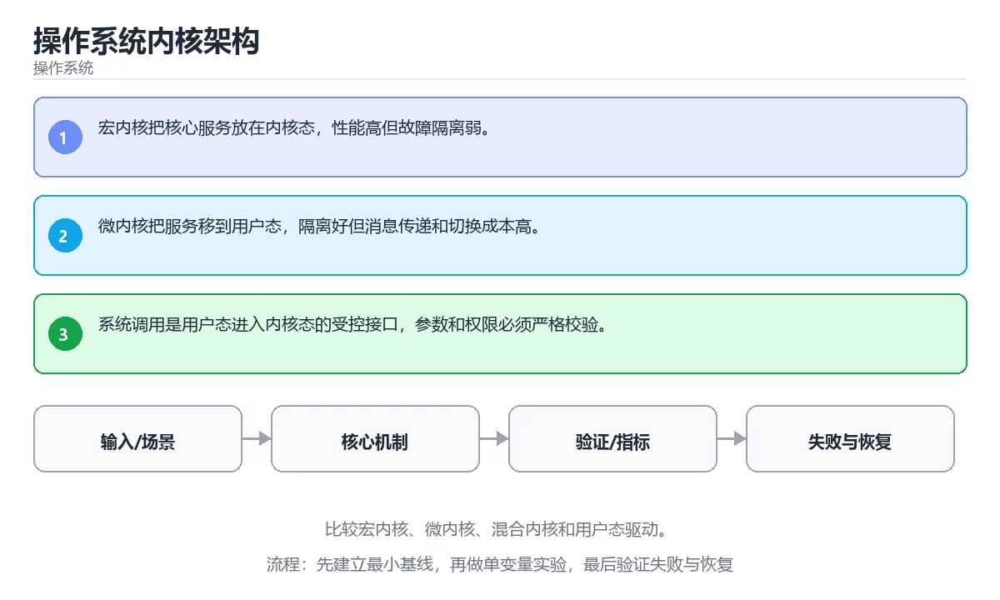

# 本课主题

> 内容更新时间：2026-10-03





## 学习目标

- 能用自己的话解释：宏内核把核心服务放在内核态，性能高但故障隔离弱。
- 能用自己的话解释：微内核把服务移到用户态，隔离好但消息传递和切换成本高。
- 能用自己的话解释：系统调用是用户态进入内核态的受控接口，参数和权限必须严格校验。
- 能把本课知识放回「操作系统」，并完成练习与测验。

## 前置知识

- 已完成「操作系统」的基础课程，能运行正文中的最小示例。
- 本课关键词：内核、宏内核、微内核、系统调用。
- 遇到不熟悉的术语先记录问题，完成练习后再回读。

## 核心知识

### 1. 宏内核把核心服务放在内核态，性能高但故障隔离弱。

- 关键做法：先用最小示例建立基线，再逐步加入边界、失败和性能条件。
- 验证标准：结果可复现、错误可解释、边界有测试、失败能恢复。

### 2. 微内核把服务移到用户态，隔离好但消息传递和切换成本高。

### 3. 系统调用是用户态进入内核态的受控接口，参数和权限必须严格校验。

## 关键流程

```text
输入 → 校验 → 核心处理 → 验证 → 记录指标 → 失败恢复
```

## 实践路径

1. 用一句话复述本课要解决的问题。
2. 跑通正文中的最小示例并记录基线。
3. 只改变一个输入或参数，预测并验证结果。
4. 补一个失败路径，记录错误、恢复和指标。
5. 把结论写成可复现的笔记或测试。

## 常见误区

| 误区 | 后果 | 修正 |
| --- | --- | --- |
| 只记术语不做实验 | 遇到真实问题无法判断 | 用最小输入跑通并记录结果 |
| 只测正常路径 | 边界和故障上线才暴露 | 补空值、极值和依赖失败 |
| 没有基线就优化 | 无法证明改进有效 | 先测量再修改 |
| 忽略成本与安全 | 性能和风险失控 | 同时记录资源、权限与失败代价 |

## 动手练习

1. 合上教程，用 3～5 句话解释本课主题。
2. 从正文选一个例子，改变一个条件并预测结果。
3. 设计一个失败场景，写出止损与恢复步骤。

**验收标准**：留下输入、命令、输出、差异和下一步问题。

## 本课小结

- 本课属于「操作系统」，核心关键词是 内核、宏内核、微内核、系统调用。
- 先保证正确与可复现，再讨论性能和扩展。
- 完成练习和测验后，把仍然不确定的问题写成下一轮验证清单。

> 本课由 P1 内容扩展生成，重点补充原有课程缺失的主题与工程边界。

## 深入理解：本课主题

### 宏内核、微内核与混合内核

宏内核把进程调度、内存管理、文件系统、驱动都放在内核态，调用链短、性能好，但任一
驱动出错都可能拖垮系统。微内核只把调度、内存与进程间通信放在内核，文件系统与驱动
运行在用户态，隔离性强但跨态通信开销大。Windows 与 macOS 采用折中方案，把部分
服务放进内核态，把图形、网络等放到用户态服务。

### 用户态与内核态的切换成本

应用发起系统调用时，CPU 从用户态切到内核态，保存寄存器、切换栈与地址空间，执行完
再切回。切换本身只要几百纳秒，但缓存与 TLB 污染可能让代价更大。高频小系统调用
（例如逐字节读写）会成为瓶颈，正确的做法是批量、缓冲或使用异步接口。

### 可扩展内核的现代做法

Linux 通过内核模块按需加载驱动，用命名空间与 cgroup 做隔离与资源限制，用 eBPF
在内核里安全地运行可验证的小程序，让可观测性与网络处理不必修改内核源码。理解
「哪些能力必须在内核、哪些可以放到用户态」，就能在性能、隔离与可维护性之间做选择。

## 可运行练习

### 任务 1：先跑通，再解释

```python
import os

print("pid>0:", os.getpid() > 0)
```

### 任务 2：只改一个条件

### 任务 3：迁移到自己的数据

用同一套思路处理一组你自己的数据或场景，保持输出格式与任务 1 一致。

## 故障现场

### 现场 1：本课的 内核 常规用例通过，但边界用例失败

**症状**：在本课的练习或生产场景里出现“本课的 内核 常规用例通过，但边界用例失败”。

**复现**：准备一组最小输入，只保留触发“本课的 内核 常规用例通过，但边界用例失败”的必要条件，连续运行两次确认结果稳定。

**定位**：围绕“内核 的前置条件与取值边界没有写进代码，默认值掩盖了空值和极值”检查调用链、输入数据和环境配置，先验证假设再改代码。

**预防**：把“本课的 内核 常规用例通过，但边界用例失败”写成一条自动化用例，并在本课的验收清单里保留对应检查项。

### 现场 2：本课的 宏内核 结果在两次运行之间不一致

**症状**：在本课的练习或生产场景里出现“本课的 宏内核 结果在两次运行之间不一致”。

**复现**：准备一组最小输入，只保留触发“本课的 宏内核 结果在两次运行之间不一致”的必要条件，连续运行两次确认结果稳定。

**定位**：围绕“宏内核 依赖了当前版本、执行顺序或共享状态，单次运行无法暴露差异”检查调用链、输入数据和环境配置，先验证假设再改代码。

**预防**：把“本课的 宏内核 结果在两次运行之间不一致”写成一条自动化用例，并在本课的验收清单里保留对应检查项。

### 现场 3：程序在开发机很快，换到目标机器后延迟飙升

**症状**：在本课的练习或生产场景里出现“程序在开发机很快，换到目标机器后延迟飙升”。

**复现**：准备一组最小输入，只保留触发“程序在开发机很快，换到目标机器后延迟飙升”的必要条件，连续运行两次确认结果稳定。

**定位**：围绕“调度、缺页、锁竞争与缓存命中率共同变化，内核 的局部结论被搬到了完全不同的资源约束下”检查调用链、输入数据和环境配置，先验证假设再改代码。

**修复**：为本课主题记录 CPU、内存、上下文切换和 I/O 等待指标，用火焰图或采样把瓶颈定位到具体阶段

**预防**：把“程序在开发机很快，换到目标机器后延迟飙升”写成一条自动化用例，并在本课的验收清单里保留对应检查项。

## 本课复习清单

离开本课前，逐项确认：

- [ ] 不看解析，能说出「关于「宏内核把核心服务放在内核态 性能高但…」，下列说法正确的是？」的判断依据。
- [ ] 不看解析，能说出「关于「微内核把服务移到用户态 隔离好但消息…」，下列说法正确的是？」的判断依据。
- [ ] 不看解析，能说出「关于「系统调用是用户态进入内核态的受控接口…」，下列说法正确的是？」的判断依据。
- [ ] 不看解析，能说出「本课的核心学习目标是什么？」的判断依据。
- [ ] 至少运行一次本课示例，记录输入、输出和一个边界情况。
- [ ] 把本课最容易混淆的两个概念写成一句话对照。

| 复盘项 | 记录 |
| --- | --- |
| 已经能独立解释的考点 |  |
| 仍然说不清的概念 |  |
| 下一步验证动作 |  |

## 逐节复习与自检

下面按正文顺序回顾每一节，并给出一个自检问题；说不清的地方回到原章节补课。

### 核心知识

自检：这一节与相邻主题的边界在哪里？

### 动手练习

自检：如果去掉这一节里的一个前提，结论会怎样变化？

### 深入理解：本课主题

宏内核把进程调度、内存管理、文件系统、驱动都放在内核态，调用链短、性能好，但任一。微内核只把调度、内存与进程间通信放在内核，文件系统与驱动。

自检：这一节的关键输入与输出分别是什么？

### 验证步骤

制造一次错误输入，记录错误信息与修复方式。

## 易错点回顾

- **关于「宏内核把核心服务放在内核态 性能高但…」，下列说法正确的是？**：正确答案是「宏内核把核心服务放在内核态，性能高但故障隔离弱。
- **关于「微内核把服务移到用户态 隔离好但消息…」，下列说法正确的是？**：正确答案是「微内核把服务移到用户态，隔离好但消息传递和切换成本高。
- **关于「系统调用是用户态进入内核态的受控接口…」，下列说法正确的是？**：正确答案是「系统调用是用户态进入内核态的受控接口，参数和权限必须严格校验。
- **本课的核心学习目标是什么？**：正确答案是「比较宏内核、微内核、混合内核和用户态驱动。

## 术语速查

| 术语 | 本课语境 |
| --- | --- |
| `内核` | 本课围绕该主题展开，结合正文与代码示例理解它的适用边界。 |
| `宏内核` | 本课围绕该主题展开，结合正文与代码示例理解它的适用边界。 |
| `微内核` | 本课围绕该主题展开，结合正文与代码示例理解它的适用边界。 |
| `系统调用` | 本课围绕该主题展开，结合正文与代码示例理解它的适用边界。 |

## 深度拓展与实战

这一节把正文里的定义、代码和失败模式串成一条可操作的复习路线。

### 机制拆解

- **1. 宏内核把核心服务放在内核态，性能高但故障隔离弱。**：1. 宏内核把核心服务放在内核态，性能高但故障隔离弱
- **2. 微内核把服务移到用户态，隔离好但消息传递和切换成本高。**：2. 微内核把服务移到用户态，隔离好但消息传递和切换成本高
- **3. 系统调用是用户态进入内核态的受控接口，参数和权限必须严格校验。**：3. 系统调用是用户态进入内核态的受控接口，参数和权限必须严格校验
- **宏内核、微内核与混合内核**：宏内核、微内核与混合内核
- **用户态与内核态的切换成本**：用户态与内核态的切换成本

### 边界条件与常见反例

### 工程检查表

- [ ] 能否用自己的话说明本课主题解决什么问题，以及它不负责什么？
- [ ] 能否指出最小可运行示例的输入、输出和一条失败路径？
- [ ] 能否解释本课关键词在真实项目中的边界与取舍？
- [ ] 能否把本课方法迁移到另一个相近问题，并说明需要改什么？

### 迁移练习

1. 保持正文示例不变，写出它的输入、处理步骤和预期输出。
2. 只改变一个条件，预测结果并说明依据；再运行或手算验证。
3. 结合内核、宏内核、微内核、系统调用，写出一个真实项目中的使用场景。
4. 写下一个反例，说明它在什么条件下会使朴素做法失效。

## 深入理解：本课主题

### 宏内核、微内核与混合内核

### 用户态与内核态的切换成本

### 可扩展内核的现代做法

## 考点精讲

### 考点 1：关于「宏内核把核心服务放在内核态 性能高但…」，下列说法正确的是？

- **判断依据**：正确答案是「宏内核把核心服务放在内核态，性能高但故障隔离弱」。正确答案是宏内核把核心服务放在内核态，性能高但故障隔离弱。判断这类题时，要把宏内核把核心服务放在内核态，性能高但故障隔离弱。判断这类题时，要把「宏内核把核心服务放在内核态，性能高但故障隔离弱。」放回题干限定的对象、输入和边界，「io_uring 用共享环形队列提交和完成 IO，减少系…」、「IO 调度器在吞吐、延迟和公平之间取舍，机械盘和 SSD…」 等说法虽然包含相关术语，但范围或前提与本题不一致。

### 考点 2：关于「微内核把服务移到用户态 隔离好但消息…」，下列说法正确的是？

- **判断依据**：本题应选「微内核把服务移到用户态，隔离好但消息传递和切换成本高」。本题应选微内核把服务移到用户态，隔离好但消息传递和切换成本高。正确答案是微内核把服务移到用户态，隔离好但消息传递和切换成本高。解题的关键不是记住孤立术语，而是确认微内核把服务移到用户态，隔离好但消息传递和切换成本高。

### 考点 3：下面这段 Python 代码复现了“操作系统内核架构”中 内核、宏内核、微内核 相关的一个常见故障，哪一项最准确地解释了问题？

- **判断依据**：符合题干条件的是「遍历列表时直接删除元素，后续元素被跳过（os_kernel_arch 第 3 题）；应遍历副本或构造新列表」（os_kernel_arch 第 3 题）。符合题干条件的是遍历列表时直接删除元素，后续元素被跳过（os_kernel_arch 第 3 题）。应遍历副本或构造新列表（os_kernel_arch 第 3 题）。符合题干条件的是遍历列表时直接删除元素，后续元素被跳过（oskernelarch 第 3 题）。

### 考点 4：「操作系统内核架构」的核心学习目标是什么？

- **判断依据**：结论应落在「比较宏内核、微内核、混合内核和用户态驱动」。结论应落在比较宏内核、微内核、混合内核和用户态驱动。正确答案是比较宏内核、微内核、混合内核和用户态驱动。这道题要求区分概念与边界，比较宏内核、微内核、混合内核和用户态驱动。这道题要求区分概念与边界，「比较宏内核、微内核、混合内核和用户态驱动。」只有在题干给出的前提下才成立，而「理解请求队列、合并、排序、延迟、公平性和 SSD 调度差…」、「理解容器隔离、资源限制、文件系统层和进程视图。」缺少同一组条件。

### 考点 5：以下哪些术语与「操作系统内核架构」直接相关？（多选）

- **判断依据**：正确答案包括「内核」、「系统调用」。系统调用放回题干限定的对象、输入和边界，内核、引用类型 等说法虽然包含相关术语，但范围或前提与本题不一致。判断这类题时，要把「内核；系统调用」放回题干限定的对象、输入和边界，「内核」、「引用类型」 等说法虽然包含相关术语，但范围或前提与本题不一致。

### 考点 6：按照「操作系统内核架构」从概念到实践的讲解顺序排列下列主题。

- **判断依据**：结合内核、宏内核来看，正确的执行顺序是「核心知识 → 关键流程 → 实践路径 → 常见误区」。本课围绕比较宏内核、微内核、混合内核和用户态驱动。结合内核、宏内核来看，解题的关键不是记住孤立术语，而是确认「核心知识 → 关键流程 → 实践路径 → 常见误区」是否完整覆盖题干的输入、输出和失败路径，并排除「核心知识」、「关键流程」这类相邻概念。

## English Overview

**Title:** Operating System Kernel Architecture

**Summary:** Compare monolithic, micro, hybrid kernels and user-space drivers.

**Category:** Operating Systems
**Level:** 高级
**Key terms:** 内核, 宏内核, 微内核, 系统调用

## 内容元数据

- 内容版本：v2.0
- 最后更新：2026-10-03
- 学习阶段：高级
- 适用环境：Linux 6.x / POSIX
- 内容来源：内置结构化课程与工程实践整理
- 相关主题：内核、宏内核、微内核、系统调用
- 质量版本：P0 测验标准 + P1 覆盖扩展 + P2 体验补全

## 最小可运行示例

下面示例用于验证本课的最小输入、处理和输出。先原样运行，再只修改一个值：

```python
import os

print("pid>0:", os.getpid() > 0)
```

## 预期输出

```text
pid>0: True
```

## 验证步骤

1. 记录运行环境、命令和真实输出。
2. 修改一个输入，先写预测再运行。
4. 把结论写回本课笔记或测试用例。


## 参考资料与复核

- 最后复核：2026-10-04
- 下次复核：2027-04-04
- 复核范围：版本兼容、API 行为、安全建议与工程实践
- 来源性质：官方文档、标准或权威教材；正文为离线教学重组

| 参考资料 | 本课用途 |
| --- | --- |
| [Linux man-pages](https://man7.org/linux/man-pages/) | 系统调用与用户态接口 |
| [LWN 内核文章](https://lwn.net/Kernel/Index/) | 内核机制与演进 |
| [Linux 性能事件](https://perf.wiki.kernel.org/) | 性能分析与内核事件 |

> 「操作系统内核架构」的链接用于离线阅读后的延伸核对；App 不会自动联网。

## 复习与迁移

- 围绕「关于「宏内核把核心服务放在内核态 性能高但…」，下列说法正确的是？」做迁移时，先记录输入、边界和预期，再观察内核对结果的影响，并用「宏内核把核心服务放在内核态，性能高但故障隔离弱。」解释正常与失败路径。
- 把宏内核放进最小实验：固定版本和输入，只改变一个条件，记录输出差异，并说明「微内核把服务移到用户态，隔离好但消息传递和切换成本高。」在什么前提下成立。
- 复习「下面这段 Python 代码复现了本课主题中 内核、宏内核、微内核 相关的一个常见故障，哪一项最…」时，不要只背结论；用微内核的边界值复现一次，再把现象、原因和修复写成三步记录。
- 如果把系统调用换成空值、极值或并发输入，「比较宏内核、微内核、混合内核和用户态驱动。」是否仍然成立？写出验证命令和观察到的结果。
- 围绕「以下哪些术语与本课主题直接相关？（多选）」做迁移时，先记录输入、边界和预期，再观察内核对结果的影响，并用「内核；系统调用」解释正常与失败路径。
- 把宏内核放进最小实验：固定版本和输入，只改变一个条件，记录输出差异，并说明「核心知识 → 关键流程 → 实践路径 → 常见误区」在什么前提下成立。

<!-- p0p1-review:start -->
## 复习与迁移

- 围绕「关于「宏内核把核心服务放在内核态 性能高但…」，下列说法正确的是？」做迁移时，先记录输入、边界和预期，再观察内核对结果的影响，并用「宏内核把核心服务放在内核态，性能高但故障隔离弱。」解释正常与失败路径。
- 把宏内核放进最小实验：固定版本和输入，只改变一个条件，记录输出差异，并说明「微内核把服务移到用户态，隔离好但消息传递和切换成本高。」在什么前提下成立。
- 复习「下面这段 Python 代码复现了本课主题中 内核、宏内核、微内核 相关的一个常见故障，哪一项最…」时，不要只背结论；用微内核的边界值复现一次，再把现象、原因和修复写成三步记录。
- 如果把系统调用换成空值、极值或并发输入，「比较宏内核、微内核、混合内核和用户态驱动。」是否仍然成立？写出验证命令和观察到的结果。
- 围绕「以下哪些术语与本课主题直接相关？（多选）」做迁移时，先记录输入、边界和预期，再观察内核对结果的影响，并用「内核；系统调用」解释正常与失败路径。
- 把宏内核放进最小实验：固定版本和输入，只改变一个条件，记录输出差异，并说明「核心知识 → 关键流程 → 实践路径 → 常见误区」在什么前提下成立。
- 复习「关于「宏内核把核心服务放在内核态 性能高但…」，下列说法正确的是？」时，不要只背结论；用微内核的边界值复现一次，再把现象、原因和修复写成三步记录。
- 如果把系统调用换成空值、极值或并发输入，「微内核把服务移到用户态，隔离好但消息传递和切换成本高。」是否仍然成立？写出验证命令和观察到的结果。
- 围绕「下面这段 Python 代码复现了本课主题中 内核、宏内核、微内核 相关的一个常见故障，哪一项最…」做迁移时，先记录输入、边界和预期，再观察内核对结果的影响，并用「遍历列表时直接删除元素，后续元素被跳过；应遍历副本或构造新列表。」解释正常与失败路径。
- 把宏内核放进最小实验：固定版本和输入，只改变一个条件，记录输出差异，并说明「比较宏内核、微内核、混合内核和用户态驱动。」在什么前提下成立。
- 复习「以下哪些术语与本课主题直接相关？（多选）」时，不要只背结论；用微内核的边界值复现一次，再把现象、原因和修复写成三步记录。
- 如果把系统调用换成空值、极值或并发输入，「核心知识 → 关键流程 → 实践路径 → 常见误区」是否仍然成立？写出验证命令和观察到的结果。
- 围绕「关于「宏内核把核心服务放在内核态 性能高但…」，下列说法正确的是？」做迁移时，先记录输入、边界和预期，再观察内核对结果的影响，并用「宏内核把核心服务放在内核态，性能高但故障隔离弱。」解释正常与失败路径。
- 把宏内核放进最小实验：固定版本和输入，只改变一个条件，记录输出差异，并说明「微内核把服务移到用户态，隔离好但消息传递和切换成本高。」在什么前提下成立。
- 复习「下面这段 Python 代码复现了本课主题中 内核、宏内核、微内核 相关的一个常见故障，哪一项最…」时，不要只背结论；用微内核的边界值复现一次，再把现象、原因和修复写成三步记录。
- 如果把系统调用换成空值、极值或并发输入，「比较宏内核、微内核、混合内核和用户态驱动。」是否仍然成立？写出验证命令和观察到的结果。
- 围绕「以下哪些术语与本课主题直接相关？（多选）」做迁移时，先记录输入、边界和预期，再观察内核对结果的影响，并用「内核；系统调用」解释正常与失败路径。
- 把宏内核放进最小实验：固定版本和输入，只改变一个条件，记录输出差异，并说明「核心知识 → 关键流程 → 实践路径 → 常见误区」在什么前提下成立。
- 复习「关于「宏内核把核心服务放在内核态 性能高但…」，下列说法正确的是？」时，不要只背结论；用微内核的边界值复现一次，再把现象、原因和修复写成三步记录。
- 如果把系统调用换成空值、极值或并发输入，「微内核把服务移到用户态，隔离好但消息传递和切换成本高。」是否仍然成立？写出验证命令和观察到的结果。
- 围绕「下面这段 Python 代码复现了本课主题中 内核、宏内核、微内核 相关的一个常见故障，哪一项最…」做迁移时，先记录输入、边界和预期，再观察内核对结果的影响，并用「遍历列表时直接删除元素，后续元素被跳过；应遍历副本或构造新列表。」解释正常与失败路径。
- 把宏内核放进最小实验：固定版本和输入，只改变一个条件，记录输出差异，并说明「比较宏内核、微内核、混合内核和用户态驱动。」在什么前提下成立。
- 复习「以下哪些术语与本课主题直接相关？（多选）」时，不要只背结论；用微内核的边界值复现一次，再把现象、原因和修复写成三步记录。
- 如果把系统调用换成空值、极值或并发输入，「核心知识 → 关键流程 → 实践路径 → 常见误区」是否仍然成立？写出验证命令和观察到的结果。
- 围绕「关于「宏内核把核心服务放在内核态 性能高但…」，下列说法正确的是？」做迁移时，先记录输入、边界和预期，再观察内核对结果的影响，并用「宏内核把核心服务放在内核态，性能高但故障隔离弱。」解释正常与失败路径。
- 把宏内核放进最小实验：固定版本和输入，只改变一个条件，记录输出差异，并说明「微内核把服务移到用户态，隔离好但消息传递和切换成本高。」在什么前提下成立。
- 复习「下面这段 Python 代码复现了本课主题中 内核、宏内核、微内核 相关的一个常见故障，哪一项最…」时，不要只背结论；用微内核的边界值复现一次，再把现象、原因和修复写成三步记录。
- 如果把系统调用换成空值、极值或并发输入，「比较宏内核、微内核、混合内核和用户态驱动。」是否仍然成立？写出验证命令和观察到的结果。
- 围绕「以下哪些术语与本课主题直接相关？（多选）」做迁移时，先记录输入、边界和预期，再观察内核对结果的影响，并用「内核；系统调用」解释正常与失败路径。
- 把宏内核放进最小实验：固定版本和输入，只改变一个条件，记录输出差异，并说明「核心知识 → 关键流程 → 实践路径 → 常见误区」在什么前提下成立。
- 复习「关于「宏内核把核心服务放在内核态 性能高但…」，下列说法正确的是？」时，不要只背结论；用微内核的边界值复现一次，再把现象、原因和修复写成三步记录。
- 如果把系统调用换成空值、极值或并发输入，「微内核把服务移到用户态，隔离好但消息传递和切换成本高。」是否仍然成立？写出验证命令和观察到的结果。
<!-- p0p1-review:end -->
