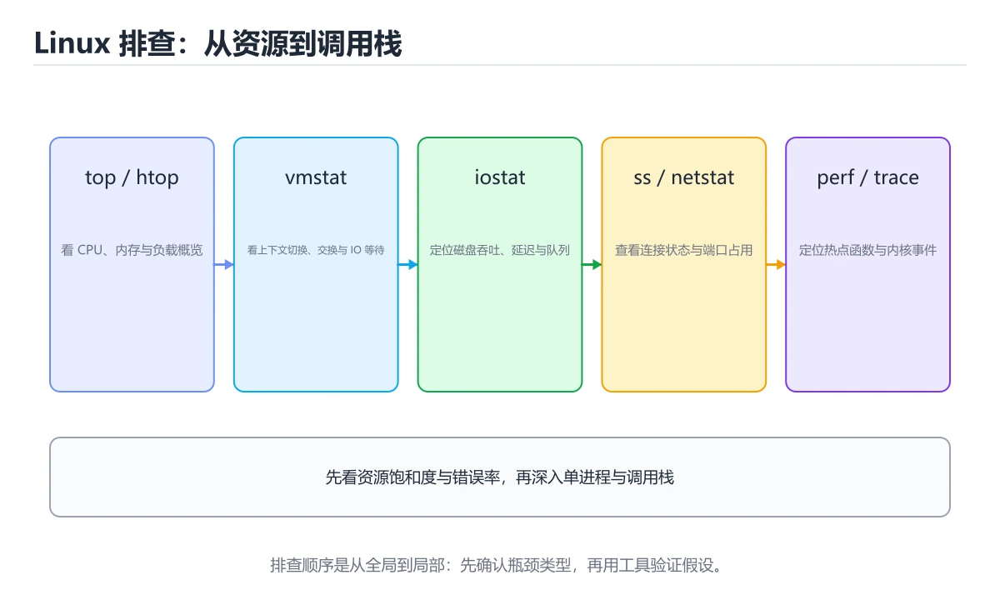
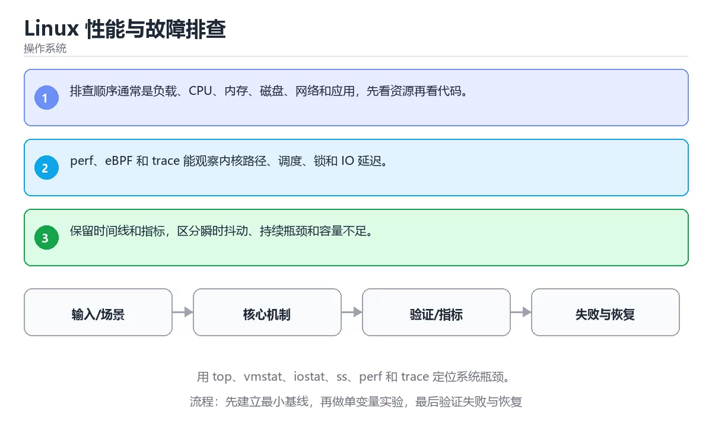

# Linux 性能与故障排查

> 内容更新时间：2026-10-06 · 学习阶段：高级 · 预计用时：30 分钟





## 学习目标

- 能用自己的话解释：排查顺序通常是负载、CPU、内存、磁盘、网络和应用，先看资源再看代码。
- 能用自己的话解释：perf、eBPF 和 trace 能观察内核路径、调度、锁和 IO 延迟。
- 能用自己的话解释：保留时间线和指标，区分瞬时抖动、持续瓶颈和容量不足。
- 能把本课知识放回「操作系统」，并完成练习与测验。

## 前置知识

- 具备本分类的前置知识，能跑通「Linux 性能与故障排查」的示例并解释输出。
- 本课关键词：Linux、性能、perf、排查。
- 遇到不熟悉的术语先记录问题，完成练习后再回读。

## 核心知识

### 1. 排查顺序通常是负载、CPU、内存、磁盘、网络和应用，先看资源再看代码。

- 关键做法：先让 Linux 的最小示例可复现，再加入并发或规模条件。
- 验证标准：Linux 的结果可复现、错误可解释、失败能恢复。

### 2. perf、eBPF 和 trace 能观察内核路径、调度、锁和 IO 延迟。

把这条结论放回「Linux 性能与故障排查」的完整流程里展开：

- 正文依据：能用自己的话解释：排查顺序通常是负载、CPU、内存、磁盘、网络和应用，先看资源再看代码。
- 落地检查：把「2. perf、eBPF 和 trace 能观察内核路径、调度、锁和 IO 延迟。」改写成一条可执行的核对项，逐条验证输入、超时与失败路径。

### 3. 保留时间线和指标，区分瞬时抖动、持续瓶颈和容量不足。

把这条结论放回「Linux 性能与故障排查」的完整流程里展开：

- 正文依据：能用自己的话解释：perf、eBPF 和 trace 能观察内核路径、调度、锁和 IO 延迟。
- 落地检查：把「3. 保留时间线和指标，区分瞬时抖动、持续瓶颈和容量不足。」改写成一条可执行的核对项，逐条验证输入、超时与失败路径。

## 关键流程

```text
输入 → 校验 → 核心处理 → 验证 → 记录指标 → 失败恢复
```

## 实践路径

1. 用一句话复述本课要解决的问题。
2. 跑通正文中的最小示例并记录基线。
3. 只改变一个输入或参数，预测并验证结果。
4. 补一个失败路径，记录错误、恢复和指标。
5. 把结论写成可复现的笔记或测试。

## 常见错误与排查

> 说明：本表由《Linux 性能与故障排查》的核心知识整理（2026-10-07），人工复核进度见 docs/content_review_batches.md。

| 易错点 | 容易踩的做法 | 正确结论 |
| --- | --- | --- |
| 一上来就重启 | 现场丢失，根因无法定位 | 先采集日志、指标与进程状态再动手 |
| 只看单个指标 | 把内存问题误判成处理器问题 | 结合负载、内存、输入输出与网络综合判断 |
| 忽略基线与时间窗口 | 无法判断异常程度 | 与历史基线对比，并定位发生变化的时间点 |

## 动手练习

1. 合上教程，用 3～5 句话解释Linux 性能与故障排查。
2. 从正文选一个例子，改变一个条件并预测结果。
3. 设计一个失败场景，写出止损与恢复步骤。

**验收标准**：留下输入、命令、输出、差异和下一步问题。

## 本课小结

- 本课围绕 Linux、性能、perf、排查 展开，复习时重点核对它们的输入、输出和失败路径。
- 把还不确定的 getpid 行为写成一条可执行验证，再进入下一课。


## 可运行练习

### 任务 1：先跑通，再解释

```python
import os

print("pid>0:", os.getpid() > 0)
```

### 任务 2：只改一个条件

把「Linux 性能与故障排查」的最小示例复制一份，只改一个条件再跑一次：

- 改动点：只调整 getpid 的一个参数，其余条件一律不动。
- 预测：先写下「Linux 性能与故障排查」在改动后的输出或错误信息，再运行。
- 记录：对照改动前后的结果，指出差异出在哪一步。
- 验收：换回原条件能复现原结果，改动只影响Linux。

### 任务 3：迁移到自己的数据

用同一套思路处理一组你自己的 Linux 数据，保持输出格式与任务 1 一致。

## 故障现场

### 现场 1：一上来就重启

**症状**：在《Linux 性能与故障排查》的复现场景中，现场丢失，根因无法定位。

**根因**：当出现“一上来就重启”时，执行路径已经绕过了《Linux 性能与故障排查》的关键约束，最终以“现场丢失，根因无法定位”暴露出来；修复前必须先确认约束在哪里失效。

**修复**：针对《Linux 性能与故障排查》的问题，先采集日志、指标与进程状态再动手。

**验证**：保留《Linux 性能与故障排查》里触发“现场丢失，根因无法定位”的输入、版本和日志，按“先采集日志、指标与进程状态再动手”完成修改后原样重放；只有失败现象消失且相邻场景仍可解释，才保留改动。

### 现场 2：只看单个指标

**症状**：在《Linux 性能与故障排查》的复现场景中，把内存问题误判成处理器问题。

**根因**：触发点是把“只看单个指标”当成安全做法。它没有满足《Linux 性能与故障排查》要求的前提，因此先表现为“把内存问题误判成处理器问题”；排查时先完整复现这一段，再核对输入、配置与依赖。

**修复**：针对《Linux 性能与故障排查》的问题，结合负载、内存、输入输出与网络综合判断。

**验证**：保留《Linux 性能与故障排查》里触发“把内存问题误判成处理器问题”的输入、版本和日志，按“结合负载、内存、输入输出与网络综合判断”完成修改后原样重放；只有失败现象消失且相邻场景仍可解释，才保留改动。

### 现场 3：忽略基线与时间窗口

**症状**：在《Linux 性能与故障排查》的复现场景中，无法判断异常程度。

**根因**：当出现“忽略基线与时间窗口”时，执行路径已经绕过了《Linux 性能与故障排查》的关键约束，最终以“无法判断异常程度”暴露出来；修复前必须先确认约束在哪里失效。

**修复**：针对《Linux 性能与故障排查》的问题，与历史基线对比，并定位发生变化的时间点。

**验证**：保留《Linux 性能与故障排查》里触发“无法判断异常程度”的输入、版本和日志，按“与历史基线对比，并定位发生变化的时间点”完成修改后原样重放；只有失败现象消失且相邻场景仍可解释，才保留改动。

## 本课复习清单


离开本课前，逐项确认：

- [ ] 不看解析，能说出「阅读「Linux 性能与故障排查」正文里的这段 Python 代码，下面哪一项判断是正确的？」的判断依据。
- [ ] 不看解析，能说出「关于「保留时间线和指标，区分瞬时抖动、持续瓶颈和容量不足。」，下列说法正确的是？」的判断依据。
- [ ] 不看解析，能说出「「Linux 性能与故障排查」的核心学习目标是什么？」的判断依据。
- [ ] 至少运行一次《Linux 性能与故障排查》的示例，记录输入、输出和一个边界情况。
- [ ] 把本课最容易混淆的两个概念写成一句话对照。

| 复盘项 | 记录 |
| --- | --- |
| 已经能独立解释的考点 |  |
| 仍然说不清的概念 |  |
| 下一步验证动作 |  |

## 复习与自测

逐节自检：能说清 Linux 的输入、输出与失败路径才算通过，否则回到原文。

### 核心知识

自检：这一节与相邻主题的边界在哪里？

### 动手练习

自检：如果去掉这一节里的一个前提，结论会怎样变化？

### 验证步骤

制造一次错误输入，记录错误信息与修复方式。
### 追问 1：关于「排查顺序通常是负载、CPU、内存、磁盘、网络和应用，先看资源再看代码。」，下列说法正确的是？

- 先写下判断，再对照：排查顺序通常是负载、CPU、内存、磁盘、网络和应用，先看资源再看代码。
- 检查点：getpid 在输入越界时会产生什么可观察的结果？

### 追问 2：关于「perf，eBPF 和 trace 能观察内核路径，调度」，下列说法正确的是？

- 先写下判断，再对照：perf，eBPF 和 trace 能观察内核路径，调度

### 追问 3：关于「保留时间线和指标，区分瞬时抖动、持续瓶颈和容量不足。」，下列说法正确的是？

- 先写下判断，再对照：保留时间线和指标，区分瞬时抖动、持续瓶颈和容量不足。

### 追问 4：本课的核心学习目标是什么？

- 先写下判断，再对照：用 top，vmstat，iostat，ss

### 追问 5：以下哪些术语与Linux 性能与故障排查直接相关？（多选）

- 先写下判断，再对照：Linux、性能

## 术语速查

| 术语 | 一句话说明 |
| --- | --- |
| `Linux` | 开源类 Unix 操作系统内核与发行版生态，广泛用于服务器和嵌入式设备。 |
| `性能` | 系统在给定负载下表现出的吞吐、延迟、资源占用和稳定性。 |
| `perf` | Linux 性能分析工具：采样 CPU、追踪调度与缓存事件，用 perf top/report 定位热点函数。 |
| `排查` | 沿着调用链、日志和指标逐层验证假设，直到找到根因。 |

## 深度拓展与实战

这一节把 Linux 的结论、getpid 的示例与反例整理成可执行的复习步骤。

### 机制拆解

- **1. 排查顺序通常是负载、CPU、内存、磁盘、网络和应用，先看资源再看代码。**：在「Linux 性能与故障排查」里，「1. 排查顺序通常是负载、CPU、内存、磁盘、网络和应用，先看资源再看代码。」这一步要先写清输入与预期，再记录实际结果和差异；结果不符时回到对应小节核对前提。
- **2. perf、eBPF 和 trace 能观察内核路径、调度、锁和 IO 延迟。**：在「Linux 性能与故障排查」里，「2. perf、eBPF 和 trace 能观察内核路径、调度、锁和 IO 延迟。」这一步要先写清输入与预期，再记录实际结果和差异；结果不符时回到对应小节核对前提。
- **3. 保留时间线和指标，区分瞬时抖动、持续瓶颈和容量不足。**：在「Linux 性能与故障排查」里，「3. 保留时间线和指标，区分瞬时抖动、持续瓶颈和容量不足。」这一步要先写清输入与预期，再记录实际结果和差异；结果不符时回到对应小节核对前提。
- **考点 1：核心知识 的代码阅读题**：先独立作答，再回到本课正文核对 getpid 的执行路径；答错时记录是哪一个前提被忽略。
- **考点 2：按“Linux 性能与故障排查”中 Linux、性能、perf 的实践顺序，把四个步骤排成从准备到复盘的合理顺序。**：先独立作答，再回到本课对应小节核对判断依据；答错时记录是哪一个前提被忽略。

### 边界条件与常见反例

「Linux 性能与故障排查」的边界不只包括最大最小值，还要覆盖空、重复和失败：

| 条件 | 常见反例 | 处理方式 |
| --- | --- | --- |
| 空输入 | Linux 没有任何取值 | 先判空，给出明确错误而不是继续执行 |
| 边界值 | 性能 取最小或最大 | 用最小值、最大值和越界值各跑一次 |
| 重复执行 | 同一输入被执行两次 | 保证结果可重复，必要时加锁或去重 |
| 失败路径 | Linux 相关步骤报错 | 保留原始错误，确认回滚或重试行为 |

### 工程检查表

- [ ] 能否用自己的话说明Linux 性能与故障排查解决什么问题，以及它不负责什么？
- [ ] 能否说明 Linux 的正常输出，以及失败时留下的错误信息？
- [ ] 能否解释本课关键词在真实项目中的边界与取舍？
- [ ] 能否把 Linux 的方法迁移到相近问题，并说明需要改哪一步？

### 迁移练习

1. 保持正文示例不变，写出它的输入、处理步骤和预期输出。
2. 固定其他输入，只调整 getpid 的一个参数，先写预测再验证。
3. 结合Linux、性能、perf、排查，写出一个真实项目中的使用场景。
4. 写下一个反例，说明它在什么条件下会使朴素做法失效。

<!-- p0-depth-v2:start -->

## 零基础精讲：把Linux 性能与故障排查真正讲透

### 先建立一个直觉

把操作系统看成一座资源调度中心：CPU、内存、文件和设备都是有限资源，进程提出申请，内核负责隔离、分配、回收和记账。落到本课，「Linux 性能与故障排查」关心的是 Linux 与 性能 的配合，也就是说这条直觉要在 核心知识 里被具体验证。

本课的摘要可以当作一张地图：用 top、vmstat、iostat、ss、perf 和 trace 定位系统瓶颈。

### 逐步拆解

1. 澄清输入与目标。先写清「Linux 性能与故障排查」要解决的问题、合法输入范围和成功标准，再进入后续步骤。
2. 描述处理过程。把「Linux、性能、perf、排查」映射到具体步骤，每步都要求能单独验证。
3. 定义输出。Linux 的输出不仅包括正常结果，还包括错误码、日志和资源释放状态。
4. 构造一次Linux越界，记录系统是拒绝、降级还是静默出错；三者对应的修复策略完全不同。
5. 把「核心知识」里的最小示例抄成 getpid 一行的输入，先手算结果再执行，确认两者一致。

### 把正文串成一条执行链

- **考点 3：关于「保留时间线和指标，区分瞬时抖动、持续瓶颈和容量不足。」，下列说法正确的是？**：先独立作答，再回到本课对应小节核对判断依据；答错时记录是哪一个前提被忽略。

### 从测验反推易错点

**检查点 1：关于「排查顺序通常是负载、CPU、内存、磁盘、网络和应用，先看资源再看代码。」，下列说法正确的是？**

- 参考判断：排查顺序通常是负载、CPU、内存、磁盘、网络和应用，先看资源再看代码。
- 自问：如果去掉题干里的一个限定词，结论还成立吗？

**检查点 2：关于「perf，eBPF 和 trace 能观察内核路径，调度」，下列说法正确的是？**

- 参考判断：perf，eBPF 和 trace 能观察内核路径，调度

**检查点 3：关于「保留时间线和指标，区分瞬时抖动、持续瓶颈和容量不足。」，下列说法正确的是？**

- 参考判断：保留时间线和指标，区分瞬时抖动、持续瓶颈和容量不足。

**检查点 4：本课的核心学习目标是什么？**

- 参考判断：用 top，vmstat，iostat，ss

**检查点 5：以下哪些术语与Linux 性能与故障排查直接相关？（多选）**

- 参考判断：Linux、性能

### 工程排错顺序

| 先查什么 | 要得到的证据 | 判断标准 |
| --- | --- | --- |
| 资源由谁创建、谁释放、何时回收？ | 日志、输入样例、测试或指标 | 能复现并解释，才算定位 |
| 用户态与内核态边界在哪里？ | 日志、输入样例、测试或指标 | 能复现并解释，才算定位 |
| 并发访问是否需要锁或无锁结构？ | 日志、输入样例、测试或指标 | 能复现并解释，才算定位 |
| 指标是吞吐、延迟还是尾延迟？ | 日志、输入样例、测试或指标 | 能复现并解释，才算定位 |

### 变式训练

1. 把 Linux 的实现压缩到一个进程内，去掉所有外部依赖后再谈扩展。
2. 把 Linux 的输入规模扩大十倍，记录时间、内存和失败路径，找出第一个瓶颈。
3. 把 性能 换成失败输入，记录错误信息与恢复动作。
5. 在 核心知识 这一步去掉一个前提，观察 Linux 的输出怎样变化，并写出「Linux 性能与故障排查」里哪条假设被破坏。
6. 限制 CPU 与内存上限后重跑 getpid，观察哪一项参数需要重新设定。

### 本课自测

- [ ] 能用一句话解释「Linux」在本课中的角色与边界。
- [ ] 能举出一个正常例子和一个失败例子。
- [ ] 能说出最小验证步骤，以及需要记录的证据。
- [ ] 能用一句话解释「性能」在本课中的角色与边界。
- [ ] 能用一句话解释「perf」在本课中的角色与边界。
- [ ] 能用一句话解释「排查」在本课中的角色与边界。

### 迁移案例库

下面用不同约束重复同一套方法，每轮只改变 Linux 的一个取值并记录结论。

#### 迁移案例 1：围绕「Linux」做一次小实验

**目标**：在不改变课程主体的前提下，验证Linux 性能与故障排查中的一个关键判断。

**步骤**：
1. 复述当前方案对「Linux」的假设，写成一句可证伪的话。
2. 设计一个正常输入和一个边界输入，分别预测输出。
3. 运行或逐步演算，记录实际输出、耗时和失败信息。
4. 只调整一个参数，比较前后差异并解释原因。
5. 补充一条测试或复习卡，确保下次能更快复现。

**验收**：结论要能追溯到正文的具体小节与代码位置，并记录性能相关的指标变化。

#### 迁移案例 2：围绕「性能」做一次小实验

**步骤**：
1. 复述当前方案对「性能」的假设，写成一句可证伪的话。

#### 迁移案例 3：围绕「perf」做一次小实验

**步骤**：
1. 复述当前方案对「perf」的假设，写成一句可证伪的话。

#### 迁移案例 4：围绕「排查」做一次小实验

**步骤**：
1. 复述当前方案对「排查」的假设，写成一句可证伪的话。

#### 迁移案例 5：围绕「Linux」做一次小实验

**步骤**：

#### 迁移案例 6：围绕「性能」做一次小实验

**步骤**：

#### 迁移案例 7：围绕「perf」做一次小实验

**步骤**：

#### 迁移案例 8：围绕「排查」做一次小实验

**步骤**：

#### 迁移案例 9：围绕「Linux」做一次小实验

**步骤**：

#### 迁移案例 10：围绕「性能」做一次小实验

**步骤**：

#### 迁移案例 11：围绕「perf」做一次小实验

**步骤**：

#### 迁移案例 12：围绕「排查」做一次小实验

**步骤**：

#### 迁移案例 13：围绕「Linux」做一次小实验

**步骤**：

#### 迁移案例 14：围绕「性能」做一次小实验

**步骤**：

#### 迁移案例 15：围绕「perf」做一次小实验

**步骤**：

#### 迁移案例 16：围绕「排查」做一次小实验

**步骤**：

<!-- p0-depth-v2:end -->

## 考点精讲

### 考点 1：代码补全·Linux

- **题目**：阅读「Linux 性能与故障排查」正文里的这段 Python 代码，下面哪一项判断是正确的？
- **判断依据**：在「Linux 性能与故障排查」里，题干的正确项是这段代码会产生可观察的输出，运行后能看到结果，在「Linux 性能与故障排查」里要结合Linux核对输出是否符合预期。把输入或边界换成空值、极值或失败情况后，结论要以「Linux 性能与故障排查」的实际运行结果为准。这道题的关键在「Linux 性能与故障排查」的Linux、性能、perf：先确认题干“阅读Linux 性能与故障排查正文里”问的是哪一步，再排除偷换前提的选项。

### 考点 2：顺序排列·Linux

- **题目**：按“Linux 性能与故障排查”中 Linux、性能、perf 的实践顺序，把四个步骤排成从准备到复盘的合理顺序。
- **判断依据**：在「Linux 性能与故障排查」里，在本课的练习里，顺序应当是：先明确 Linux 的输入、输出与约束 → 写出最小示例并核对 性能 的基线结果 → 只改一个变量，记录边界与失败路径的变化 → 固定版本与证据，把本课的结论写成可复现记录。这个顺序把 Linux 的输入、输出和约束放在最前面，在Linux 性能与故障排查里避免概念没对齐就开始调参。第二步用 性能 建立可核对的基线，在Linux 性能与故障排查里第三步才允许改变一个变量并观察失败路径。

### 考点 3：概念判断·Linux

- **题目**：关于「保留时间线和指标，区分瞬时抖动、持续瓶颈和容量不足。」，下列说法正确的是？
- **判断依据**：在「Linux 性能与故障排查」里，保留时间线和指标，区分瞬时抖动、持续瓶颈和容量不足。回到「Linux 性能与故障排查」的正文示例，用“关于保留时间线和指标”走一遍Linux、性能、perf的完整流程，能复现的结论才可以保留。回到Linux、性能、perf本身再看一遍：只有“保留时间线和指标，区分瞬时抖动”与题干“保留时间线和指标”的前提一致，结论才成立。

### 考点 4：概念判断·Linux

- **题目**：「Linux 性能与故障排查」的核心学习目标是什么？
- **判断依据**：在「Linux 性能与故障排查」里，用 top，vmstat，iostat，ss。」缺少同一组条件。「Linux 性能与故障排查」要求先交代Linux、性能、perf的前提再下结论，所以“用 top，vmstat，iostat”只在题干“Linux 性能与故障排查的核心学习目标是什么”给定的条件下成立。

### 考点 5：多选辨析·Linux

- **题目**：以下哪些术语与「Linux 性能与故障排查」直接相关？（多选）
- **判断依据**：这道题的关键在「Linux 性能与故障排查」的Linux、性能、perf：先确认题干“以下哪些术语与Linux 性能与故障”问的是哪一步，再排除偷换前提的选项。回到Linux、性能、perf本身再看一遍：只有“Linux”与题干“以下哪些术语与Linux”的前提一致，结论才成立。

## English Overview

**Title:** Linux Performance and Troubleshooting

**Summary:** Use top, vmstat, iostat, ss, perf and trace to locate bottlenecks.

**Category:** Operating Systems
**Level:** 高级
**Key terms:** Linux, 性能, perf, 排查

## 内容元数据

- 内容版本：v2.0
- 最后更新：2026-10-06
- 学习阶段：高级
- 适用环境：Linux 6.x / POSIX；本课聚焦 Linux。
- 内容来源：内置结构化课程与工程实践整理
- 相关主题：Linux、性能、perf、排查
- 质量版本：P0 测验标准 + P1 覆盖扩展 + P2 体验补全

## 最小可运行示例

先用下面的示例确认 Linux 的基线，再只改一个与 性能 相关的值：

```python
import os

print("pid>0:", os.getpid() > 0)
```

## 预期输出

```text
pid>0: True
```

## 验证步骤

1. 记录运行环境、命令和真实输出。
2. 修改一个输入，先写预测再运行。
4. 把结论写回本课笔记或测试用例。

## 参考资料与复核

- 最后复核：2026-10-04
- 下次复核：2027-06-17
- 复核范围：版本兼容、API 行为、安全建议与工程实践
- 来源性质：官方文档、标准或权威教材；正文为离线教学重组

| 参考资料 | 本课用途 |
| --- | --- |
| [LWN 内核文章](https://lwn.net/Kernel/Index/) | 内核机制与演进 |
| [Linux 内核文档](https://docs.kernel.org/) | 调度、内存、文件系统与 I/O |
| [MIT xv6](https://pdos.csail.mit.edu/6.828/2023/xv6.html) | 教学内核与系统调用 |

> 「Linux 性能与故障排查」的链接用于离线阅读后的延伸核对；App 不会自动联网。

## 复习与迁移

复习目标：把「Linux 性能与故障排查」的判断标准放回可复现的例子里。先自己作答，再对照依据；如果结论正确但理由不完整，回到正文补足前提。

### 概念复述

- 用一句话说明「Linux 性能与故障排查」解决什么问题：用 top、vmstat、iostat、ss、perf 和 trace 定位系统瓶颈。
- 写出Linux、性能、perf之间的关系，并各举一个例子。
- 说出本课最容易混淆的两个概念，以及区分它们的判据。

### 正文逐节复核

- **零基础精讲：把Linux 性能与故障排查真正讲透**：本课的摘要可以当作一张地图：用 top、vmstat、iostat、ss、perf 和 trace 定位系统瓶颈。

### 测验回顾

1. 阅读「Linux 性能与故障排查」正文里的这段 Python 代码，下面哪一项判断是正确的？
   - 依据：在「Linux 性能与故障排查」里，题干的正确项是这段代码会产生可观察的输出，运行后能看到结果，在「Linux 性能与故障排查」里要结合Linux核对输出是否符合预期。把输入或边界换成空值、极值或失败情况后，结论要以「Linux 性能与故障排查」的实际运行结果为准。这道题的关键在「Linux 性能与故障排查」的Linux、性能、perf：先确认题干“阅读Linux 性能与故障排查正文里”问的是哪一步，再排除偷换前提的选项。
2. 按“Linux 性能与故障排查”中 Linux、性能、perf 的实践顺序，把四个步骤排成从准备到复盘的合理顺序。
   - 依据：在「Linux 性能与故障排查」里，在本课的练习里，顺序应当是：先明确 Linux 的输入、输出与约束 → 写出最小示例并核对 性能 的基线结果 → 只改一个变量，记录边界与失败路径的变化 → 固定版本与证据，把本课的结论写成可复现记录。这个顺序把 Linux 的输入、输出和约束放在最前面，在Linux 性能与故障排查里避免概念没对齐就开始调参。第二步用 性能 建立可核对的基线，在Linux 性能与故障排查里第三步才允许改变一个变量并观察失败路径。
3. 关于「保留时间线和指标，区分瞬时抖动、持续瓶颈和容量不足。」，下列说法正确的是？
   - 依据：在「Linux 性能与故障排查」里，保留时间线和指标，区分瞬时抖动、持续瓶颈和容量不足。回到「Linux 性能与故障排查」的正文示例，用“关于保留时间线和指标”走一遍Linux、性能、perf的完整流程，能复现的结论才可以保留。回到Linux、性能、perf本身再看一遍：只有“保留时间线和指标，区分瞬时抖动”与题干“保留时间线和指标”的前提一致，结论才成立。
4. 「Linux 性能与故障排查」的核心学习目标是什么？
   - 依据：在「Linux 性能与故障排查」里，用 top，vmstat，iostat，ss。」缺少同一组条件。「Linux 性能与故障排查」要求先交代Linux、性能、perf的前提再下结论，所以“用 top，vmstat，iostat”只在题干“Linux 性能与故障排查的核心学习目标是什么”给定的条件下成立。
5. 以下哪些术语与「Linux 性能与故障排查」直接相关？（多选）
   - 依据：这道题的关键在「Linux 性能与故障排查」的Linux、性能、perf：先确认题干“以下哪些术语与Linux 性能与故障”问的是哪一步，再排除偷换前提的选项。回到Linux、性能、perf本身再看一遍：只有“Linux”与题干“以下哪些术语与Linux”的前提一致，结论才成立。

### 迁移练习

把「Linux 性能与故障排查」的结论迁移到相邻主题，每次迁移都写清预测与证据：

1. 换输入：用Linux处理一组你自己的数据，对比教材示例的结果差异。
2. 换失败条件：制造一个性能相关的错误，说明如何从错误信息定位根因。
3. 换规模：把数据量或并发度提高一个数量级，说明「Linux 性能与故障排查」的结论是否仍成立。
