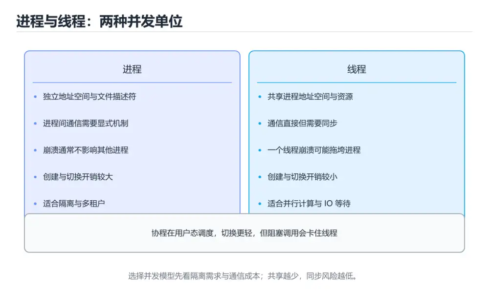
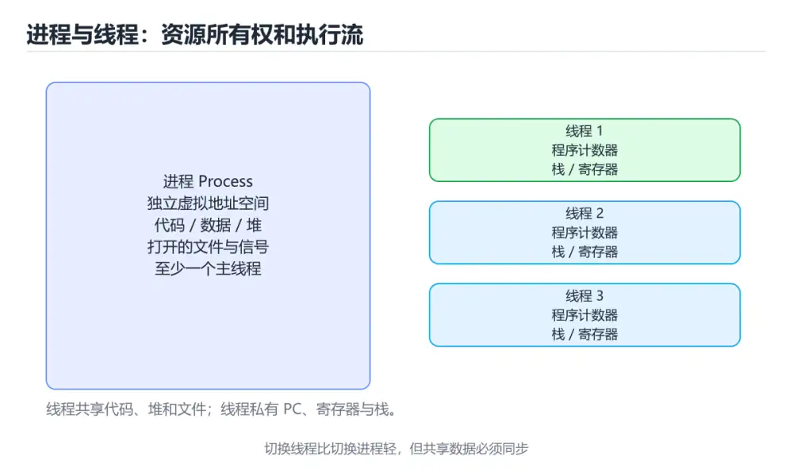
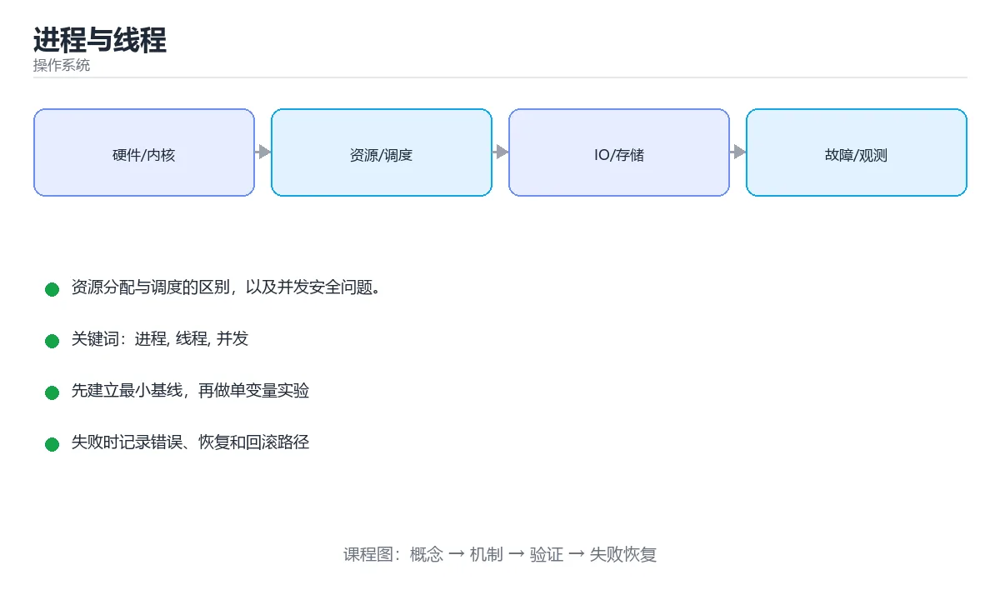

# 进程与线程







> 内容更新时间：2026-10-06 · 学习阶段：入门 · 预计用时：35 分钟

## 学习目标

- 能用自己的话解释进程与线程解决了什么问题，而不是只背术语。
- 能说清 「进程」、「线程」、「并发」、「上下文切换」 之间的关系，并分别举出一个例子。
- 能把 进程 放回「进程与线程」的知识体系，说明它和 线程 的边界。
- 能完成本课练习，并用验收标准检查自己的结果。

> 一句话摘要：资源分配与调度的区别，以及并发安全问题。

## 前置知识

- 会进行基本的文件、命令行或浏览器操作；遇到不熟悉的术语先查 进程 的词条。
- 本课阶段：入门。建议先掌握同一分类的基础课程，并能独立运行正文里的 safe_increase 示例。
- 开始前先复习：进程、线程、并发。
- 如果 进程：资源分配的单位 这一步看不懂，先记录具体卡点，再用 safe_increase 复现一遍。

## 进程：资源分配的单位

进程是正在运行的程序实例，拥有独立的虚拟地址空间、文件描述符和信号处理等资源。进程之间相互隔离，一个进程崩溃通常不影响其他进程。

```text
进程 = 代码段 + 数据段 + 堆 + 栈 + 打开的文件 + 页表 ...
```

## 线程：CPU 调度的单位

线程是进程内的执行流，同一进程的多个线程**共享地址空间和打开的文件**，但各自拥有独立的栈和寄存器状态。

| 对比项 | 进程 | 线程 |
| --- | --- | --- |
| 地址空间 | 独立 | 共享 |
| 创建开销 | 大 | 小 |
| 通信方式 | 管道、共享内存、消息队列 | 直接读写共享变量 |
| 隔离性 | 强 | 弱，一个线程崩溃可能拖垮进程 |
| 切换成本 | 高（切换页表） | 低 |

## 上下文切换

CPU 核心数有限，操作系统通过时间片轮转让多个线程「同时」运行。切换时需要保存和恢复寄存器、程序计数器等状态：

```text
线程 A 运行 -> 时间片用完 -> 保存 A 的上下文
            -> 载入 B 的上下文 -> 线程 B 运行
```

频繁切换会带来额外开销，所以线程数不是越多越好。

## 并发安全问题

多个线程同时修改共享数据会产生竞态条件：

```python
import threading

count = 0

def increase():
    global count
    for _ in range(100000):
        count += 1        # 实际是「读-改-写」三步，非原子

threads = [threading.Thread(target=increase) for _ in range(2)]
for t in threads:
    t.start()
for t in threads:
    t.join()

print(count)   # 很可能小于 200000
```

解决办法：加锁、使用原子操作，或避免共享可变状态。

```python
lock = threading.Lock()

def safe_increase():
    global count
    for _ in range(100000):
        with lock:
            count += 1
```

## 复现竞态与死锁的步骤

**实验一：竞态（丢失更新）**

1. 两个线程各自把全局计数变量自增 10 万次（读-改-写三步非原子）。
2. 预期 20 万，实际通常小于该值——这就是丢失更新。
3. 修复：用互斥锁包住自增语句，或改用原子类型；修复后再跑 10 次，结果应稳定为 20 万。

**实验二：死锁**

1. 准备两把锁 a、b；线程 T1 先拿 a 再拿 b，线程 T2 先拿 b 再拿 a。
2. 在两次加锁之间插入短睡眠，放大交错概率，程序会卡住不再输出。
3. 修复：统一加锁顺序（都按 a→b），或用带超时的加锁（超时后释放已持有的锁并重试）。

**验证与观测手段**

| 手段 | 用途 |
| --- | --- |
| 加压后反复运行 | 竞态问题具有偶发性，需多次运行才暴露 |
| 打印线程栈 / faulthandler | 死锁时看线程卡在哪一行 |
| top -H 看线程数 | 线程持续增长说明创建后未回收 |
| 并发单测（跑 1 万次断言） | 把修复固化下来，防止回归 |

关键认知：竞态与死锁都**不会稳定复现**，因此修复后必须用高频次的并发测试来验证，而不是跑一次通过就认为好了。

## 本课小结

**进程隔离资源，线程共享资源**。共享带来了便利，也带来了同步问题。

## 进程与线程速查

| 维度 | 进程 | 线程 |
| --- | --- | --- |
| 定义 | 资源分配的基本单位 | CPU 调度的基本单位 |
| 地址空间 | 各自独立 | 同进程内共享 |
| 创建开销 | 大（含页表与资源） | 小 |
| 通信方式 | 管道、消息队列、共享内存、socket | 直接读写共享变量（需同步） |
| 隔离性 | 强，一个崩溃通常不影响其他 | 弱，一个线程崩溃拖垮整个进程 |
| 切换成本 | 高（切页表、刷 TLB） | 较低 |
| 典型用途 | 服务隔离、多核并行计算 | 并发处理请求、异步 IO |

线程共享与私有内容：

| 共享 | 私有 |
| --- | --- |
| 代码段、堆、全局变量、打开的文件 | 栈、寄存器、程序计数器、线程局部存储 |

## 常见并发问题速查

| 问题 | 成因 | 现象 | 对策 |
| --- | --- | --- | --- |
| 竞态条件 | 多线程交错读写共享数据 | 结果随机、偶发错误 | 加锁、原子操作、减少共享 |
| 死锁 | 互等对方持有的锁 | 线程永久阻塞 | 统一加锁顺序、超时、避免嵌套锁 |
| 活锁 | 不断重试但无法推进 | CPU 高但无进展 | 加入随机退避 |
| 饥饿 | 低优先级线程长期得不到调度 | 个别任务迟迟不完成 | 公平锁、队列化 |
| 伪共享 | 不同线程改同一缓存行 | 性能远低于预期 | 数据填充对齐、线程本地累加 |

```python
import threading

counter = 0
lock = threading.Lock()

def worker(times: int) -> None:
    global counter
    for _ in range(times):
        with lock:                 # 复合操作必须加锁
            counter += 1

threads = [threading.Thread(target=worker, args=(10_000,)) for _ in range(4)]
for t in threads: t.start()
for t in threads: t.join()
print(counter)                     # 40000
```

## 排查命令速查

| 目的 | 命令 |
| --- | --- |
| 查看进程与线程 | `ps -eLf \| grep app`、`top -H -p <pid>` |
| 查看线程栈 | `pstack <pid>`、`gdb -p <pid>` + `thread apply all bt` |
| 查看 Java 线程 | `jstack <pid>`、`jcmd <pid> Thread.print` |
| 查看锁等待 | `SHOW ENGINE INNODB STATUS`（数据库）、`jstack` 找 `BLOCKED` |
| 查看资源占用 | `pidstat -w -p <pid> 1`（上下文切换）、`vmstat 1` |
| 查看文件句柄 | `lsof -p <pid>` |

## 常见错误与排查

| 容易写错的做法 | 实际现象 | 原因与正确做法 |
| --- | --- | --- |
| 用线程处理 CPU 密集任务（Python） | 没有加速 | GIL 限制，改用多进程 |
| 加锁粒度覆盖整个函数 | 并发退化为串行 | 只锁临界区 |
| 同一业务却用多把锁嵌套 | 偶发死锁 | 统一顺序或改用单锁 |
| 线程池核心数远大于核数且任务是 CPU 型 | 上下文切换开销大 | CPU 密集型线程数约等于核数 |
| 线程间共享可变对象且不加同步 | 数据损坏 | 用不可变数据、加锁或消息传递 |
| 忘记 `join` | 主线程提前退出或统计错误 | 明确等待所有线程结束 |
| 用 `sleep` 代替同步 | 测试通过但线上偶发失败 | 用条件变量、队列或事件 |
| 任务异常未捕获 | 线程静默退出，任务丢失 | 在线程入口统一捕获并记录 |
| 进程退出前未清理子进程 | 僵尸进程 | 等待或 `kill` 后 `wait` |

## 复习与自测

- [ ] 能说清「进程是资源单位、线程是调度单位」。
- [ ] 知道线程间共享与私有的内存区域。
- [ ] 加锁只覆盖临界区，并统一加锁顺序。
- [ ] 会用 `top -H`、`jstack`、`pstack` 排查卡死。
- [ ] 线程池大小按任务类型（CPU / IO）确定。

## 动手练习

> 本课练习重点：围绕「进程、线程、并发」完成复述、实验和交付，每个结果都要能被别人检查。

为 safe_increase 画一张状态图，标出竞争与阻塞发生的时刻。

### 练习 1：建立心智模型（10 分钟）

合上教程，用 3～5 句话回答：

1. 进程与线程解决了什么问题？
2. 如果没有它，会出现什么具体后果？
3. 它和「线程」是什么关系？

验收标准：回答里必须出现 进程，并写出一个让结论失效的边界条件。

### 练习 2：做一次可控实验（20 分钟）

从正文中选一个最小示例，完成以下操作：

1. 先预测修改一个参数、输入或步骤后的结果。
2. 再实际执行或逐步推演，记录真实结果。
3. 如果结果与预测不同，写出差异原因。

**验收标准**：把 safe_increase 当作原例，改动一次线程的取值，记录命令、输出与差异原因；五步里缺任意一步都算未完成。

### 练习 3：交付一个小结果（30 分钟）

用伪代码模拟一次 进程 的调度或资源分配，记录至少 5 个状态变化。

任务要求：

- 结果必须能被别人检查，不能只写“我已经理解了”。
- 至少覆盖「进程」和「线程」两个关键词。
- 写出 1 个仍然不确定的问题，以及下一步如何验证。

> 提示：时间有限时优先做练习 1 和练习 2；练习 3 可以拆成两次完成。

## 可运行练习

### 任务 1：先跑通，再解释

```python
import threading

count = 0

def increase():
    global count
    for _ in range(100000):
        count += 1        # 实际是「读-改-写」三步，非原子

threads = [threading.Thread(target=increase) for _ in range(2)]
for t in threads:
    t.start()
for t in threads:
    t.join()

print(count)   # 很可能小于 200000
```

### 任务 2：只改一个条件

把「进程与线程」的最小示例复制一份，只改一个条件再跑一次：

- 改动点：只调整 safe_increase 的一个参数，其余条件一律不动。
- 预测：先写下「进程与线程」在改动后的输出或错误信息，再运行。
- 记录：对照改动前后的结果，指出差异出在哪一步。
- 验收：换回原条件能复现原结果，改动只影响进程。

### 任务 3：迁移到自己的数据

用同一套思路处理一组你自己的 进程 数据，保持输出格式与任务 1 一致。

## 故障现场

### 现场 1：线程池核心数远大于核数且任务是 CPU 型

**症状**：在《进程与线程》的复现场景中，上下文切换开销大。

**根因**：当出现“线程池核心数远大于核数且任务是 CPU 型”时，执行路径已经绕过了《进程与线程》的关键约束，最终以“上下文切换开销大”暴露出来；修复前必须先确认约束在哪里失效。

**修复**：针对《进程与线程》的问题，CPU 密集型线程数约等于核数。

**验证**：先在《进程与线程》中记录“线程池核心数远大于核数且任务是 CPU 型”留下的失败证据，再执行“CPU 密集型线程数约等于核数”并重放；确认错误路径变为明确结果，且修复没有掩盖同类故障。

### 现场 2：忘记 join

**症状**：在《进程与线程》的复现场景中，主线程提前退出或统计错误。

**根因**：当出现“忘记 join”时，执行路径已经绕过了《进程与线程》的关键约束，最终以“主线程提前退出或统计错误”暴露出来；修复前必须先确认约束在哪里失效。

**修复**：针对《进程与线程》的问题，明确等待所有线程结束。

**验证**：在《进程与线程》中按“明确等待所有线程结束”调整后，从“忘记 join”的触发条件重放同一条路径，确认“主线程提前退出或统计错误”不再出现，并补一个相邻边界用例检查没有引入新问题。

### 现场 3：用 sleep 代替同步

**症状**：在《进程与线程》的复现场景中，测试通过但线上偶发失败。

**根因**：“测试通过但线上偶发失败”只是表层结果。向上追溯会落到“用 sleep 代替同步”这一步，因为它省略了《进程与线程》的约束，使实现行为和预期模型发生了偏离。

**修复**：针对《进程与线程》的问题，用条件变量、队列或事件。

**验证**：先在《进程与线程》中记录“用 sleep 代替同步”留下的失败证据，再执行“用条件变量、队列或事件”并重放；确认错误路径变为明确结果，且修复没有掩盖同类故障。

## 本课复习清单

离开本课前，逐项确认：

- [ ] 不看解析，能说出「操作系统中资源分配的基本单位是？」的判断依据。
- [ ] 不看解析，能说出「同一进程内的多个线程默认共享什么？」的判断依据。
- [ ] 不看解析，能说出「多线程执行 count += 1 结果偏小，根本原因是什么？」的判断依据。
- [ ] 不看解析，能说出「操作系统中 CPU 调度的基本单位是？」的判断依据。
- [ ] 不看解析，能说出「同进程内线程切换通常比进程切换快的原因是？」的判断依据。
- [ ] 用 进程 构造一个正常输入和一个边界输入，分别记录输出与判断依据。
- [ ] 把本课最容易混淆的两个概念写成一句话对照。

| 复盘项 | 记录 |
| --- | --- |
| 已经能独立解释的考点 |  |
| 仍然说不清的概念 |  |
| 下一步验证动作 |  |

## 术语速查

| 术语 | 一句话说明 |
| --- | --- |
| `进程` | 操作系统分配资源和隔离地址空间的运行实例。 |
| `线程` | 操作系统调度的执行单元，同一进程内的线程共享地址空间和大部分资源。 |
| `并发` | 多个任务在重叠时间窗口内推进，关注共享状态、同步与调度。 |
| `上下文切换` | CPU 核心数有限，操作系统通过时间片轮转让多个线程「同时」运行。切换时需要保存和恢复寄存器、程序计数器等状态。 |

## 考点精讲

### 考点 1：代码补全·进程

- **题目**：阅读「进程与线程」正文里的这段 Python 代码，下面哪一项判断是正确的？
- **判断依据**：在「进程与线程」里，题干的正确项是这段代码把主要逻辑封装在函数或方法里，需要被调用才会执行，在「进程与线程」里封装边界决定进程从哪一步开始生效。把输入或边界换成空值、极值或失败情况后，结论要以「进程与线程」的实际运行结果为准。这道题的关键在「进程与线程」的进程、线程、并发：先确认题干“阅读进程与线程正文里的这段 Pyth”问的是哪一步，再排除偷换前提的选项。

### 考点 2：多选辨析·进程

- **题目**：围绕“进程与线程”中的 进程、线程、并发，下列哪两项是本课强调的实践判断？
- **判断依据**：本课把进程与线程拆成概念、示例与故障现场三部分，因此判断 进程 时必须同时交代输入、输出和失败路径，这使“学习 进程 时要同时说明输入、输出和失败路径，不能只看正常流程”成立。在进程与线程里，判断 线程 时要固定版本与边界输入，所以“验证 线程 时要固定版本并覆盖边界输入，结论才可复现”才可复现。

### 考点 3：概念判断·进程

- **题目**：多线程执行 count += 1 结果偏小，根本原因是什么？
- **判断依据**：在「进程与线程」里，读-改-写不是原子操作。count += 1 实际包含读取、加一、写回三步，交错执行会丢失更新，需要加锁或使用原子操作。回到「进程与线程」的正文示例，用“多线程执行 count += 1 结”走一遍进程、线程、并发的完整流程，能复现的结论才可以保留。

### 考点 4：概念判断·进程

- **题目**：操作系统中 CPU 调度的基本单位是？
- **判断依据**：在「进程与线程」里，结论应落在「线程」。所以同一进程内的多线程才能真正并行于多核之上。进程负责资源分配，线程才是 CPU 调度与切换的基本单位。在「进程与线程」里，这道题要求区分概念与边界，「线程」只有在题干给出的前提下才成立，而「文件描述符」、「页表」缺少同一组条件。

### 考点 5：概念判断·进程

- **题目**：同进程内线程切换通常比进程切换快的原因是？
- **判断依据**：在「进程与线程」里，共享同一地址空间。这也解释了为什么高并发服务器优先使用线程池而不是频繁创建进程。在「进程与线程」里判断这道题，要把进程、线程、并发的条件、过程与失败路径逐项对齐，换成“同进程内线程切换通常比进程切换快的原”这个场景，只有满足前提的结论才成立。回到「进程与线程」的正文示例，用“同进程内线程切换通常比进程切换快的原”走一遍进程、线程、并发的完整流程，能复现的结论才可以保留。

### 考点 6：填空·进程

- **题目**：补全代码：「进程与线程」示例中，下面这行代码缺少哪个关键字或函数名？请填入 ____。 `for t in threads: t.____`
- **判断依据**：在「进程与线程」里判断这道题，要把进程、线程、并发的条件、过程与失败路径逐项对齐，换成“补全代码”这个场景，只有满足前提的结论才成立。“进程与线程示例中”与「进程与线程」的术语表相呼应，只有符合进程、线程、并发约束的“join”才是正文支持的结论。“join”与术语表相呼应，只有符合进程、线程、并发约束的“join”才是正文支持的结论。

## English Overview

**Title:** Process & Thread

**Summary:** Resource ownership vs scheduling, and race conditions.

**Category:** Operating Systems
**Level:** 进阶
**Key terms:** 进程, 线程, 并发, 上下文切换, 锁, 竞态

## 内容元数据

- 内容版本：v2.0
- 最后更新：2026-10-06
- 学习阶段：入门
- 适用环境：Linux 6.x / POSIX；本课聚焦 进程。
- 内容来源：内置结构化课程与工程实践整理
- 相关主题：进程、线程、并发、上下文切换、锁、竞态
- 质量版本：P0 测验标准 + P1 覆盖扩展 + P2 体验补全

## Full English Study Guide

### Overview

**Process & Thread** focuses on Resource ownership vs scheduling, and race conditions.

### Learning Outcomes

- Explain what **Process & Thread** solves and when it should be used.

### Glossary

- Topic: **Process & Thread**
- Related terms: 进程, 线程, 并发, 上下文切换

## Bilingual Section Outline

| 中文小节 | English section |
| --- | --- |
| 学习目标 | Learning objectives |
| 前置知识 | Prerequisites |
| 进程：资源分配的单位 | 进程：资源分配的单位 |
| 线程：CPU 调度的单位 | 线程：CPU 调度的单位 |
| 上下文切换 | Context切换 |
| 并发安全问题 | ConcurrencySecurity问题 |
| 复现竞态与死锁的步骤 | 复现竞态与死锁的步骤 |
| 本课小结 | Summary |
| 进程与线程速查 | 进程与线程速查 |
| 常见并发问题速查 | 常见Concurrency问题速查 |

## 参考资料与复核

- 最后复核：2026-10-04
- 下次复核：2027-06-17
- 复核范围：版本兼容、API 行为、安全建议与工程实践
- 来源性质：官方文档、标准或权威教材；正文为离线教学重组

| 参考资料 | 本课用途 |
| --- | --- |
| [Linux 内核文档](https://docs.kernel.org/) | 调度、内存、文件系统与 I/O |
| [OSTEP](https://pages.cs.wisc.edu/~remzi/OSTEP/) | 操作系统导论教材 |
| [POSIX 标准](https://pubs.opengroup.org/onlinepubs/9799919799/) | 可移植操作系统接口 |

> 「进程与线程」的链接用于离线阅读后的延伸核对；App 不会自动联网。

## 工程化精练：决策、失败与验证

这一章把「进程与线程」从“看懂”推进到“能判断、能验证、能排错”。所有判断都围绕进程、线程与并发展开，并与前文的示例、测验和失败现场互相对照。

### 一、进程 的判断算法

| 步骤 | 要回答的问题 | 判断依据 | 记录什么 |
| --- | --- | --- | --- |
| 1. 定目标 | 「进程与线程」这一步要解决什么问题？ | 把进程的目标写成一句可验证的结论 | 输入、约束、成功标准 |
| 2. 找边界 | 线程在什么条件下失效？ | 先列空值、极值、重复和失败路径 | 反例与触发条件 |
| 3. 跑基线 | 原始示例的真实输出是什么？ | 命令、版本和环境必须可复现 | 命令、输出、耗时 |
| 4. 只改一处 | 把并发换成另一种取值会怎样？ | 预测写在运行之前 | 预测与实际的差异 |
| 5. 回写结论 | 结论能否被他人复现？ | 把判断写成清单或测试 | 结论、证据、遗留问题 |

这张表的用法不是从上到下浏览，而是每次只填一行：先用「进程与线程」前文的示例验证第 3 行，再故意破坏一个条件验证第 2 行。当你能在不看解析的情况下说出进程的判断依据，才算真正掌握本课。

- 先从进程入手：把它写成“输入是什么、输出是什么、哪一步最容易出错”。如果这三句话中有一句说不清，说明对「进程与线程」的理解还停留在术语层面，需要回到正文的最小示例重新观察一次。

- 再把线程当成对照实验的变量：固定其他条件，只改变它的取值，记录输出是否变化。结论“变”或“不变”都要写出理由，并说明这个理由能否被他人独立复现。

- 针对并发做一次失败演练：故意给出空值、极值或错误类型，观察「进程与线程」的报错位置和处理方式。错误信息只是入口，真正要定位的是哪一层假设被破坏。

- 把「进程与线程」的结论压缩成一条可执行清单：先检查输入，再检查版本与环境，然后跑最小用例，最后才扩大规模。顺序颠倒会让排错范围成倍增加。

- 如果结论依赖时间或规模，就把数据量提高一个数量级再跑一次。在「进程与线程」里，小样本成立不代表大样本成立，复杂度、资源占用和失败率都要重新记录。

- 如果结论依赖并发或共享状态，就固定输入并连续运行多次。结果不一致时，优先怀疑「进程与线程」中进程相关步骤的隐藏状态，而不是先改代码。

- 把「进程与线程」的判断写成测试：一个正常用例、一个边界用例、一个失败用例。测试通过只是起点，还要确认失败用例确实以预期方式失败。

- 把本课与相邻主题连起来：进程解决的是“怎么做”，线程回答“什么时候不适用”。两者都答得出来，迁移才算完成。

> 第 2 轮复核「进程与线程」：把上面的结论逐条改写为可验证的问题，并记录仍不确定的部分。

- 先从进程入手：把它写成“输入是什么、输出是什么、哪一步最容易出错”。如果这三句话中有一句说不清，说明对「进程与线程」的理解还停留在术语层面，需要回到正文的最小示例重新观察一次。

### 二、进程与线程 的机制拆解与自测

把本课考点还原成可回答的问题，再逐题写出依据：

**问题 1**：阅读「进程与线程」正文里的这段 Python 代码，下面哪一项判断是正确的？

- 关联术语：进程
- 判断依据：回到「进程与线程」正文对应小节，先用最小示例验证再下结论。
- 追问：如果把进程的条件换成边界值，这个结论是否仍然成立？

**问题 2**：围绕“进程与线程”中的 进程、线程、并发，下列哪两项是本课强调的实践判断？

- 关联术语：线程
- 判断依据：学习 进程 时要同时说明输入、输出和失败路径，不能只看正常流程
- 追问：如果把线程的条件换成边界值，这个结论是否仍然成立？

**问题 3**：多线程执行 count += 1 结果偏小，根本原因是什么？

- 关联术语：并发
- 判断依据：读-改-写不是原子操作，存在竞态条件
- 追问：如果把并发的条件换成边界值，这个结论是否仍然成立？

**问题 4**：操作系统中 CPU 调度的基本单位是？

- 关联术语：上下文切换
- 判断依据：线程（进程是资源分配的基本单位）
- 追问：如果把上下文切换的条件换成边界值，这个结论是否仍然成立？

**问题 5**：同进程内线程切换通常比进程切换快的原因是？

- 关联术语：锁
- 判断依据：共享同一地址空间
- 追问：如果把锁的条件换成边界值，这个结论是否仍然成立？

**问题 6**：补全代码：「进程与线程」示例中，下面这行代码缺少哪个关键字或函数名？请填入 ____。

`for t in threads: t.____`

- 关联术语：竞态
- 判断依据：回到「进程与线程」正文对应小节，先用最小示例验证再下结论。
- 追问：如果把竞态的条件换成边界值，这个结论是否仍然成立？

### 三、失败模式与修复顺序

| 失败信号 | 常见根因 | 先做什么 | 修复后如何确认 |
| --- | --- | --- | --- |
| 「进程与线程」中 进程 相关步骤报错 | 输入、版本或前置条件与示例不一致 | 保留第一条错误信息，回到最小输入 | 用学习 进程 时要同时说明输入、输出和失败路径，不能只看正常流程复跑，确认输出可复现 |
| 「进程与线程」中 线程 相关步骤报错 | 输入、版本或前置条件与示例不一致 | 保留第一条错误信息，回到最小输入 | 用读-改-写不是原子操作，存在竞态条件复跑，确认输出可复现 |
| 「进程与线程」中 并发 相关步骤报错 | 输入、版本或前置条件与示例不一致 | 保留第一条错误信息，回到最小输入 | 用线程（进程是资源分配的基本单位）复跑，确认输出可复现 |
- 检查点：固定版本与输入重跑《进程与线程》，记录两次差异并定位不稳定条件。
| 单次结果正确但规模一大就失效 | 只测了正常路径，没有覆盖边界 | 把数据量或并发度提高一个数量级 | 记录边界值、耗时与失败率 |

排错顺序固定为：先复现，再缩小输入，然后只改一个条件，最后把结论写成回归用例。对「进程与线程」来说，任何不能复现的“修好了”都不算完成。

### 四、离开本课前的验证清单

| 检查项 | 通过标准 | 证据 |
| --- | --- | --- |
| 能复述 | 用三句话说明「进程与线程」解决什么问题、边界在哪 | 不看解析写出的结论 |
| 能运行 | 最小示例在本机跑通 | 命令、输出与版本 |
| 能改条件 | 只改一个输入并解释差异 | 预测与实际的对照 |
| 能排错 | 至少制造并修复一个失败 | 错误信息与修复步骤 |
| 能迁移 | 把进程、线程、并发、上下文切换、锁、竞态用到新场景 | 一个自选练习的结论 |

完成标准：能不看解析说清「进程与线程」全部自测题的依据，并且至少有一条进程相关的结论经过真实运行验证。如果某一步只停留在“感觉懂了”，就把它写成下一轮针对「进程与线程」的最小验证任务。

### 五、把结论写成可检查的证据

学习「进程与线程」时，最容易出现的情况是“听过、看懂了，但换一个输入就说不清”。下面把进程与线程放进一条可检查的证据链：每一句结论都要能回答“从哪里来、在什么条件下成立、失败时怎么发现”。

| 证据类型 | 本课要求 | 不合格的表现 |
| --- | --- | --- |
| 概念证据 | 用一句话说明进程的定义与适用场景 | 只背术语，说不出它解决什么问题 |
| 运行证据 | 能复现「进程与线程」的最小示例 | 输出与记录对不上，或换机器就不一致 |
| 对照证据 | 只改一个条件，说明差异来自哪里 | 一次改多个变量，无法归因 |
| 失败证据 | 故意制造错误并记录恢复步骤 | 只测正常路径，失败时靠猜 |
| 迁移证据 | 把线程用到自选场景 | 换一个例子就完全套不上 |

举例：学习 进程 时要同时说明输入、输出和失败路径，不能只看正常流程。把这个结论代回「进程与线程」的正文，找出它对应的输入、处理步骤与输出；再换掉其中一个条件，观察结论是否仍然成立。能完成这一步，才说明这条知识已经从“记忆”变成“可用的判断”。

最后留一个自检问题：如果只能保留三条笔记，你会写下哪三句？把答案限定为「进程与线程」中的可验证结论，并给每条结论配一个反例。这三句加上对应反例，就是本课最值得带入后续课程的复习材料。

