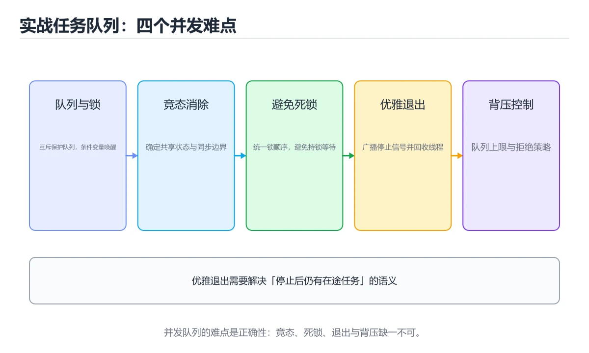
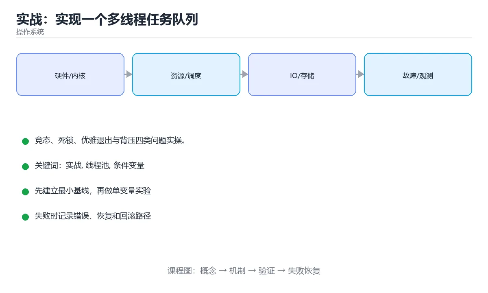

# 实战：实现一个多线程任务队列

> 内容更新时间：2026-10-06 · 学习阶段：进阶 · 预计用时：60 分钟





## 本节知识框架

**课程定位**：所属分类为「操作系统」，课程主题为「实战：实现一个多线程任务队列」，学习阶段为「进阶」，建议用时 60 分钟。

**本课要解决的主问题**：竞态、死锁、优雅退出与背压四类问题实操。

| 学习层次 | 要回答的问题 | 完成判据 |
| --- | --- | --- |
| 概念层 | 「实战：实现一个多线程任务队列」有哪些必须区分的对象与术语？ | 能用自己的话定义核心术语，并各举一个正例和一个反例。 |
| 机制层 | 这些对象按什么顺序发生作用，输入如何变成输出？ | 能画出或写出机制步骤，并说明每一步的失败条件。 |
| 应用层 | 什么场景适合使用「实战：实现一个多线程任务队列」，什么场景不适合？ | 能给出一个真实场景、一个最小示例和一个边界案例。 |
| 性能层 | 时间、空间、吞吐或延迟受哪些量影响？ | 能说出复杂度或性能瓶颈的证据来源；没有证据时明确写“材料未提供”。 |
| 复习层 | 怎样确认自己不是只记住了结论？ | 能独立完成本课自测，并把错误定位到概念、机制、示例或边界。 |

### 阅读路线

1. 先读「核心概念定义」，建立「实战」等对象的精确定义。
2. 再读「原理与运行机制」，把定义串成可重复的过程。
3. 用「代码/协议/SQL 示例」验证过程，并只改一个条件观察结果变化。
4. 最后检查性能、易错点、知识关系与自测题，形成可复习的证据链。

**前置知识**：《系统启动与权限安全》

**学习位置**：本课位于《系统启动与权限安全》之后；如果前一课的自测不能通过，应先回补再继续。

**后续衔接**：下一课《操作系统内核架构》会继续使用本课术语，学完后建议立即完成一次自测。

**教材衔接：学习目标**

- 能用自己的话解释实战：实现一个多线程任务队列解决了什么问题，而不是只背术语。
- 能说清 「实战」、「线程池」、「条件变量」、「背压」 之间的关系，并分别举出一个例子。
- 能把 实战 放回「实战：实现一个多线程任务队列」的知识体系，说明它和 线程池 的边界。
- 能完成本课练习，并用验收标准检查自己的结果。

> 一句话摘要：竞态、死锁、优雅退出与背压四类问题实操。

**教材衔接：前置知识**

- 先完成上一课《系统启动与权限安全》；如果已经掌握，可以直接用本课练习自测。
- 开始前先复习：实战、线程池、条件变量。
- 看不懂就直接缩小例子：只保留 实战 相关的两行输入，跑通后再加回其余部分。

**教材衔接：本课小结**

这个实战覆盖了操作系统的核心概念：**并发与同步（锁/条件变量）、调度与背压、优雅退出与资源回收**；把一个队列写对，比背十遍定义都有用。

## 核心概念定义

> 在阅读《实战：实现一个多线程任务队列》时，术语第一次出现先给操作性定义，再给边界；正文说法与这里冲突时，以定义和可复现示例为准。

| 术语 | 操作性定义 | 本课中的边界 |
| --- | --- | --- |
| top -H | top -H 看线程状态、jstack/gdb 看线程栈、/proc/<pid>/status 看线程数与上下文切换；在压测中观察 CPU 使用率与队列长度的关系。 | 仅在「实战：实现一个多线程任务队列」明确给出的输入、版本与资源条件下成立。 |
| 实战 | 实战：实现一个多线程任务队列解决了什么问题，而不是只背术语。 | 仅在「实战：实现一个多线程任务队列」明确给出的输入、版本与资源条件下成立。 |
| 线程池 | 复用固定数量线程处理任务，避免频繁创建销毁，并需要定义队列和拒绝策略。 | 仅在「实战：实现一个多线程任务队列」明确给出的输入、版本与资源条件下成立。 |
| 线程栈采样 | 周期性抓取线程调用栈，用来判断 CPU 热点或阻塞点落在哪个函数上。 | 仅在「实战：实现一个多线程任务队列」明确给出的输入、版本与资源条件下成立。 |

### 定义如何使用

在「实战：实现一个多线程任务队列」中判断一个说法是否成立，先确认它使用的是哪个对象的定义，再检查输入规模、运行环境与失败路径。定义不是口号，而是后续推导、代码示例和自测题共享的约束。

## 原理与运行机制

### 机制总览

1. **建立输入**：把「top -H」按本课定义整理成可观察、可重复的输入条件。
2. **执行转换**：围绕「实战」执行本课的核心步骤；每一步都记录中间状态，避免只看最终输出。
3. **产生输出**：得到「线程池」后，用正文示例或协议/SQL 结果核对输出是否符合预期。
4. **改变一个条件**：只替换一个边界条件或环境参数，观察「实战：实现一个多线程任务队列」的结论是否仍然成立。

| 阶段 | 关注对象 | 失败时应检查 |
| --- | --- | --- |
| 输入 | top -H | 类型、范围、编码、版本或前置状态是否满足定义。 |
| 处理 | 实战 | 顺序、可见性、锁、路由、事务或调度规则是否被破坏。 |
| 输出 | 线程池 | 结果是否可复现，错误是否被正确传播而不是被吞掉。 |

本课的机制结论要用「实战：实现一个多线程任务队列」自己的示例验证。「实战：实现一个多线程任务队列」没有给出某个数量级、吞吐或内存数据时，本课把该判断标为“材料未提供”，不从相邻主题外推。

**教材衔接：目标**

用线程池 + 有界阻塞队列实现任务队列，亲手遇到并解决**竞态、死锁、优雅退出**三类操作系统级问题。

**教材衔接：需求**

1. 固定 N 个 worker 线程从队列取任务执行。
2. 队列有上限，满时生产者阻塞（背压）而不是无限堆积。
3. 支持提交任务、等待全部完成、优雅关闭（处理完在途任务再退出）。
4. 记录每个任务耗时与失败原因。

**教材衔接：关键实现点**

| 问题 | 方案 |
| --- | --- |
| 队列线程安全 | 互斥锁 + 条件变量（Go 用 channel、Java 用 BlockingQueue） |
| 背压 | 有界队列 + 满时阻塞或拒绝 |
| 优雅退出 | 关闭标志 + 唤醒所有等待者 + join 全部 worker |
| 异常隔离 | 每个任务包 try/catch，避免一个任务异常杀死 worker |

**教材衔接：观测手段**

`top -H` 看线程状态、`jstack`/`gdb` 看线程栈、`/proc/<pid>/status` 看线程数与上下文切换；在压测中观察 CPU 使用率与队列长度的关系。

**教材衔接：交付物与评分标准**

**交付物**：线程池实现（含提交、等待、优雅关闭 API）+ 单元测试（并发正确性）+ 三份实验记录：竞态复现（结果偏小）、死锁复现（卡住）与背压验证（队列长度稳定在上限）。

**评分标准**：正确性 40%（并发测试万次通过，无任务丢失）、退出与清理 25%（关闭时处理完在途任务且无线程泄漏）、背压 20%（有界队列且内存不增长）、文档 15%（能解释为什么这样设计）。

**常见失败案例**：① 用无界队列"解决"阻塞，压力下 OOM；② 关闭时只设标志不唤醒等待线程，worker 永久卡住；③ 忘记在 finally 中释放锁；④ 任务里做阻塞 IO，导致并发度被线程数限制。

**教材衔接：任务队列设计速查**

| 组件 | 职责 | 关键点 |
| --- | --- | --- |
| 队列 | 缓冲与背压 | 有界、支持超时与关闭 |
| 工作池 | 执行任务 | 线程数与任务类型匹配 |
| 调度 | 优先级与公平 | 避免饥饿 |
| 结果通道 | 回传结果 | 有缓冲，避免阻塞 |
| 取消机制 | 停止任务 | 通过 context 或标志传播 |
| 持久化 | 崩溃恢复 | 任务与状态落盘 |
| 观测 | 指标与日志 | 队列长度、延迟、失败率 |

**教材衔接：交付评审：评分表、决策记录与证据链**

「实战：实现一个多线程任务队列」的验收不能只看功能能不能跑通。下面把正文里的交付物、验证命令和关键设计点整理成一张评审表，按表逐项留下证据即可。

### 一、「实战：实现一个多线程任务队列」的交付物评分表

| 交付物 | 权重 | 合格线 | 需要的证据 |
| --- | ---: | --- | --- |
| 线程池实现（含提交 | 34% | 能在干净环境复现，且失败路径有明确处理 | 命令与输出、对应测试、一次失败与恢复记录 |
| 优雅关闭 API）+ 单元测试（并发正确性）+ 三份实验记录：竞态复现（结果偏小） | 33% | 能在干净环境复现，且失败路径有明确处理 | 命令与输出、对应测试、一次失败与恢复记录 |
| 死锁复现（卡住）与背压验证（队列长度稳定在上限）。 | 33% | 能在干净环境复现，且失败路径有明确处理 | 命令与输出、对应测试、一次失败与恢复记录 |

「实战：实现一个多线程任务队列」的评分先看证据再打分：任意一项只要拿不出可复现的命令或测试，该项按 0 分计，不允许用「基本完成」代替。

### 二、需要写下来的决策（ADR）

| 决策点 | 本课给出的做法 | 备选方案 | 代价与回滚 |
| --- | --- | --- | --- |
| 架构与数据流 | 用户/输入 → 接口或命令 → 领域逻辑 → 存储/外部依赖 → 输出与监控 | 不做「架构与数据流」，沿用最朴素的实现（需要额外补一次对照实验） | 若「架构与数据流」出问题，回到上一版本并按本课验收场景重跑 |

ADR 不需要长：每个决策三行就够——选了什么、放弃了什么、出问题怎么退。评审时只检查这三行是否和「实战：实现一个多线程任务队列」的实际代码一致。

### 三、「实战：实现一个多线程任务队列」的交付证据链

本课未给出可执行命令，用下面的最小证据集代替：

1. 一条从零开始的环境准备命令。
2. 一条跑通核心链路的命令及其完整输出。
3. 一条触发失败的命令，以及恢复后的验证结果。

把「实战：实现一个多线程任务队列」的上表整理成一个 evidence/ 目录：每条命令一个文件，文件名带日期，内容包含版本、命令与输出。评审时直接按目录核对，不再口头确认。

### 四、「实战：实现一个多线程任务队列」的验收指标

| 指标 | 目标值 | 测量方式 | 不达标时的动作 |
| --- | --- | --- | --- |
| 实战 的核心路径耗时与失败率 | 用本课正文给出的阈值，没有就写实测基线 | 固定环境重复三次取中位数 | 回到对应小节定位，先修原因再重测 |
| 资源占用峰值与回收情况 | 用本课正文给出的阈值，没有就写实测基线 | 固定环境重复三次取中位数 | 回到对应小节定位，先修原因再重测 |
| 验收场景的通过率 | 用本课正文给出的阈值，没有就写实测基线 | 固定环境重复三次取中位数 | 回到对应小节定位，先修原因再重测 |

指标必须能用一条命令或一次操作测出来；写不出测量方式的指标，在「实战：实现一个多线程任务队列」的评审里一律视为未定义。

### 五、评审记录模板

| 记录项 | 填写要求 |
| --- | --- |
| 项目标识 | `os_project` |
| 本次范围 | 说明这一轮交付了「实战：实现一个多线程任务队列」的哪些部分 |
| 未完成项 | 列出与 实战 相关但本轮未做的内容 |
| 证据位置 | 指向 evidence/ 目录下的具体文件 |
| 风险与回滚 | 写清剩余风险、回滚步骤和验证方式 |
| 结论 | 通过 / 有条件通过 / 不通过，三者选一 |

「实战：实现一个多线程任务队列」评审结束后把这张表填完并归档；下一轮迭代直接读上一次的「未完成项」与「风险与回滚」，避免重复讨论同一个问题。
<!-- p1-project-review:end -->

## 典型应用场景

| 场景 | 典型输入或前提 | 期望产物 |
| --- | --- | --- |
| 学习验证 | 使用本课最小示例和 实战、线程池 | 能复现正文结论，并解释每一步。 |
| 工程落地 | 把「实战：实现一个多线程任务队列」放入真实模块或服务边界 | 输出可观测、失败可定位、参数可配置。 |
| 故障排查 | 只改一个版本、规模、输入或依赖条件 | 能区分概念错误、实现错误和环境差异。 |

判断「实战：实现一个多线程任务队列」的场景是否成立，标准是能否写出输入、处理、输出和失败路径；材料中没有出现的数据在本课标注为“材料未提供”，不用推测替代证据。

**教材衔接：必须做的实验**

1. **竞态复现**：先写一个无锁计数器版本，观察结果偏小；加锁后再测。
2. **死锁复现**：故意让两个任务以相反顺序获取两把锁，观察卡死；再统一加锁顺序修复。
3. **优雅退出验证**：提交 1000 个任务后立即请求关闭，确认没有任务丢失也没有线程泄漏。
4. **背压验证**：任务生产速度远大于消费时，确认内存不增长（队列长度稳定在上限）。

**教材衔接：项目专属规格：实战：实现一个多线程任务队列**

### 核心场景

竞态、死锁、优雅退出与背压四类问题实操。 项目目标是把「实战、线程池、条件变量、背压、优雅退出」落实为可运行、可测试、可回滚的交付物。

### 架构与数据流

```text
用户/输入 → 接口或命令 → 领域逻辑 → 存储/外部依赖 → 输出与监控
                         ↘ 失败分类 → 重试/补偿 → 回滚
```

### 最小数据模型

| 对象 | 关键字段 | 约束 |
| --- | --- | --- |
| 输入实体 | 实战、时间、来源 | 必填校验、长度限制、幂等键 |
| 任务实体 | 状态、优先级、创建时间 | 状态迁移合法、不可重复执行 |
| 结果实体 | 输出、错误码、耗时 | 可序列化、错误可解释 |
| 审计记录 | 操作者、动作、结果、时间 | 不可篡改、可查询、脱敏 |

### 验收场景

1. 正常路径：最小输入得到预期输出，并留下日志与指标。
2. 边界路径：实战 的空值、最大值、重复数据和超长内容都得到明确处理。
3. 失败路径：依赖超时或不可用时能快速失败、重试或降级。
4. 幂等路径：同一请求执行两次不会产生重复副作用。
5. 回滚路径：撤掉 default_factory 的变更后，数据与资源都回到变更前的状态。

**教材衔接：项目交付物**

### 建议仓库结构

```text
src/
tests/
docs/
README.md
```

### 测试矩阵

| 层级 | 覆盖内容 | 最低数量 | 通过标准 |
| --- | --- | ---: | --- |
| 单元测试 | 领域规则、边界和错误分类 | 8 | 正常、边界、失败路径全部通过 |
| 集成测试 | 数据库、网络、文件或平台边界 | 3 | 使用真实边界且可重复运行 |
| 端到端测试 | 核心用户路径 | 1 | 从输入到输出完整跑通 |
| 手动验收 | 文档中列出的 5 个场景 | 5 | 有命令、输出和结论记录 |

### 验收数据

```json
{
  "project": "os_project",
  "scenario": "实战的正常路径",
  "input": {"case": "normal", "value": "default_factory"},
  "expected": {"ok": true, "checks": ["实战可复现", "线程池有记录"]},
  "failure_case": {"case": "线程池越界或缺失", "error": "validation_error"},
  "idempotency_key": "os_project-001"
}
```

### 复盘模板

| 问题 | 记录 |
| --- | --- |
| 原目标是什么？ | 用一句话描述可验收目标 |
| 实际发生了什么？ | 时间线、指标和关键日志 |
| 哪个假设被推翻？ | 根因与促成因素 |
| 如何回滚？ | 步骤、耗时和数据校验 |
| 下一步做什么？ | 负责人、期限和验证方式 |

> 项目验收围绕「实战、线程池、条件变量」：至少完成一次正常路径、一次边界输入、一次失败恢复和一次幂等检查。

## 代码/协议/SQL 示例

以下代码、协议或 SQL 片段来自《实战：实现一个多线程任务队列》原文，保留原有语言标记与上下文；先预测《实战：实现一个多线程任务队列》示例的输出，再按正文步骤运行或推演，示例依赖外部环境时同时记录版本与输入。

**教材衔接：并发与线程数速查**

| 任务类型 | 线程数建议 | 理由 |
| --- | --- | --- |
| CPU 密集 | 约等于核数 | 避免上下文切换开销 |
| IO 密集 | 核数 ×（1 + 等待占比/计算占比） | 等待期间让出 CPU |
| 混合 | 拆分两类池 | 防止相互阻塞 |
| 虚拟线程（Java 21+） | 按任务量创建 | 适合高并发 IO |

```python
import queue
import threading
import time
from dataclasses import dataclass, field

@dataclass
class Metrics:
    processed: int = 0
    failed: int = 0
    total_wait_ms: float = 0.0
    total_run_ms: float = 0.0

    def summary(self) -> dict:
        processed = max(1, self.processed)
        return {
            "processed": self.processed,
            "failed": self.failed,
            "avg_wait_ms": round(self.total_wait_ms / processed, 2),
            "avg_run_ms": round(self.total_run_ms / processed, 2),
        }

@dataclass
class TaskQueue:
    """有界任务队列 + 优雅关闭：支持背压与在途任务完成。"""

    capacity: int = 32
    workers: int = 4
    metrics: Metrics = field(default_factory=Metrics)

    def __post_init__(self):
        self.queue: queue.Queue = queue.Queue(maxsize=self.capacity)
        self.stop_event = threading.Event()
        self.threads = []

    def start(self, handler) -> None:
        for index in range(self.workers):
            thread = threading.Thread(
                target=self._worker, args=(handler,), name=f"worker-{index}", daemon=True
            )
            thread.start()
            self.threads.append(thread)

    def submit(self, item, timeout: float = 0.5) -> bool:
        try:
            self.queue.put((item, time.monotonic()), timeout=timeout)
            return True
        except queue.Full:
            return False        # 背压：调用方决定等待、降级或丢弃

    def _worker(self, handler) -> None:
        while not self.stop_event.is_set() or not self.queue.empty():
            try:
                item, enqueued = self.queue.get(timeout=0.2)
            except queue.Empty:
                continue
            started = time.monotonic()
            self.metrics.total_wait_ms += (started - enqueued) * 1000
            try:
                handler(item)
                self.metrics.processed += 1
            except Exception:
                self.metrics.failed += 1
            finally:
                self.metrics.total_run_ms += (time.monotonic() - started) * 1000
                self.queue.task_done()

    def shutdown(self, timeout: float = 5.0) -> bool:
        self.stop_event.set()
        for thread in self.threads:
            thread.join(timeout=timeout)
        return not any(thread.is_alive() for thread in self.threads)

def process(item) -> None:
    if item == "boom":
        raise ValueError("任务失败")
    time.sleep(0.01)

tq = TaskQueue(capacity=4, workers=2)
tq.start(process)
for task in ["a", "b", "boom", "c"]:
    tq.submit(task)
time.sleep(0.4)
print(tq.shutdown(), tq.metrics.summary())
```

**教材衔接：验证命令与预期输出**

先让 default_factory 的结果可复现，再谈扩展。下表给出最低验证集：

| 阶段 | 命令 | 预期输出 |
| --- | --- | --- |
| 安装依赖 | `python -m pip install -r requirements.txt` | 依赖安装完成，没有版本冲突 |
| 语法检查 | `python -m compileall .` | 所有模块编译通过 |
| 运行测试 | `python -m pytest -q` | 测试全部通过，失败用例数为 0 |
| 启动示例 | `python main.py` | 服务启动并输出监听地址 |

### 验收证据

- [ ] 保存依赖安装和启动命令的完整输出。
- [ ] 至少运行 3 条 实战 相关测试，其中一条是非法输入或失败路径。
- [ ] 连续两次触发 线程池，检查数据与计数是否被重复累加。
- [ ] 记录一次失败状态码、错误日志和恢复步骤。
- [ ] 写清 default_factory 的运行前提、启动命令与失败回退方式。

### 回归与回滚

1. 先在可丢弃的目录或临时库里跑 实战，避免污染真实数据。
2. 修改一处逻辑后重跑全部验证命令，确认没有回归。
3. 若失败，回滚到上一个可运行版本并保留失败日志。
4. 定位原因后补一条自动化测试，再重新执行发布流程。
5. 把教训写入项目复盘或本课笔记，形成下一次的检查项。

## 时间/空间复杂度或性能分析

**复杂度证据**：「实战：实现一个多线程任务队列」的现有材料没有给出渐近时间或空间复杂度的明确结论，本课只做定性检查，不补写未经验证的 $O$ 记号。

| 维度 | 本课关注点 | 判断依据 |
| --- | --- | --- |
| 时间/延迟 | 「实战：实现一个多线程任务队列」的主要步骤是否会随输入规模、并发度或网络往返增长。 | 以正文复杂度、基准数据或可重复测量为准。 |
| 空间/内存 | 中间状态、缓存、副本、连接或索引是否随规模增长。 | 记录峰值内存与数据副本，不只看最终结果。 |
| 吞吐/资源 | 版本、调度、锁、IO、序列化或协议开销是否成为瓶颈。 | 固定环境做对照实验，改变一个变量。 |

评估「实战：实现一个多线程任务队列」时要区分“正确性成立”和“性能达标”两件事；材料没有给出基准时，本课只保留量级来源与测量方法，不写不可验证的绝对数字。

## 常见误区与易错点

> 复核《实战：实现一个多线程任务队列》的易错点时，优先保留原文的错误表、故障现场与排错路径；每条修正都要能用本课示例复验。

| 易错点 | 常见表现 | 正确做法 |
| --- | --- | --- |
| 只背结论 | 能复述「实战：实现一个多线程任务队列」的定义，却说不清输入、输出与边界。 | 回到机制步骤，用最小示例逐一验证。 |
| 混淆相邻概念 | 把本课对象与相邻主题的对象当成同一类。 | 先比较定义、资源归属、生命周期和失败模式。 |
| 忽略版本与环境 | 在开发机通过后直接外推到生产环境。 | 固定版本、输入和资源条件，再记录可复现结果。 |

**教材衔接：常见错误与排查**

1. 用无界队列「解决」阻塞，结果 OOM。
2. 关闭时只设标志不唤醒等待线程，worker 永远卡在条件变量上。
3. 忘记在 finally 中释放锁导致死锁。
4. 任务里做阻塞 IO，导致 worker 数量决定了并发上限（应区分 IO 密集型与 CPU 密集型线程池）。
| 容易踩的做法 | 实际现象 | 原因与正确做法 |
| --- | --- | --- |
| 队列无界 | 内存持续增长直至 OOM | 用有界队列 + 拒绝策略实现背压 |
| 关闭时直接杀线程 | 任务半途中断、数据不一致 | 停止接收 + 等待在途完成 |
| 任务不幂等 | 重试产生副作用 | 用幂等键与状态机 |
| 异常未捕获 | 工作线程静默退出 | 在 worker 内统一捕获并记录 |
| 线程数与任务类型不匹配 | CPU 空转或切换过多 | 按 CPU/IO 类型分配 |
| 无指标监控 | 队列积压不可见 | 记录队列长度、等待与执行时间 |
| 无取消机制 | 无法停止长任务 | 用 context 或标志位检查 |
| 崩溃丢任务 | 重启后任务消失 | 关键任务持久化 + 恢复扫描 |
| 死锁式等待结果 | 队列满且调用方阻塞 | 结果通道有缓冲或异步回传 |
| 忽略优雅退出测试 | 上线才发现丢任务 | 写测试覆盖关闭路径 |

**教材衔接：故障现场**

### 现场 1：关闭时直接杀线程

**症状**：在《实战：实现一个多线程任务队列》的复现场景中，任务半途中断、数据不一致。

**根因**：当出现“关闭时直接杀线程”时，执行路径已经绕过了《实战：实现一个多线程任务队列》的关键约束，最终以“任务半途中断、数据不一致”暴露出来；修复前必须先确认约束在哪里失效。

**修复**：针对《实战：实现一个多线程任务队列》的问题，停止接收 + 等待在途完成。

**验证**：在《实战：实现一个多线程任务队列》中按“停止接收 + 等待在途完成”调整后，从“关闭时直接杀线程”的触发条件重放同一条路径，确认“任务半途中断、数据不一致”不再出现，并补一个相邻边界用例检查没有引入新问题。

### 现场 2：线程数与任务类型不匹配

**症状**：在《实战：实现一个多线程任务队列》的复现场景中，CPU 空转或切换过多。

**根因**：触发点是把“线程数与任务类型不匹配”当成安全做法。它没有满足《实战：实现一个多线程任务队列》要求的前提，因此先表现为“CPU 空转或切换过多”；排查时先完整复现这一段，再核对输入、配置与依赖。

**修复**：针对《实战：实现一个多线程任务队列》的问题，按 CPU/IO 类型分配。

**验证**：先在《实战：实现一个多线程任务队列》中记录“线程数与任务类型不匹配”留下的失败证据，再执行“按 CPU/IO 类型分配”并重放；确认错误路径变为明确结果，且修复没有掩盖同类故障。

### 现场 3：死锁式等待结果

**症状**：在《实战：实现一个多线程任务队列》的复现场景中，队列满且调用方阻塞。

**根因**：触发点是把“死锁式等待结果”当成安全做法。它没有满足《实战：实现一个多线程任务队列》要求的前提，因此先表现为“队列满且调用方阻塞”；排查时先完整复现这一段，再核对输入、配置与依赖。

**修复**：针对《实战：实现一个多线程任务队列》的问题，结果通道有缓冲或异步回传。

**验证**：在《实战：实现一个多线程任务队列》中按“结果通道有缓冲或异步回传”调整后，从“死锁式等待结果”的触发条件重放同一条路径，确认“队列满且调用方阻塞”不再出现，并补一个相邻边界用例检查没有引入新问题。

## 与其他知识点的关系

| 关系 | 课程 | 为什么 |
| --- | --- | --- |
| 先修 | 《系统启动与权限安全》 | 本课会直接使用它的概念或操作前提。 |
| 关联 | 《操作系统内核架构》 | 用于横向比较或把本课结论迁移到相邻主题。 |
| 前置顺序 | 《系统启动与权限安全》 | 同分类中安排在本课之前，建议先完成其自测。 |
| 后续顺序 | 《操作系统内核架构》 | 同分类中安排在本课之后，会继续使用本课术语。 |

把「实战：实现一个多线程任务队列」放回知识体系时，不只要记住“前面学过什么”，还要说明两个主题在输入、机制、资源边界和失败模式上的差异。这样才能把单课知识迁移到项目、排障和后续课程。

## 自测题与参考答案

> 先独立完成《实战：实现一个多线程任务队列》的自测，再核对答案与解析。答案必须能在本课正文或示例中找到依据，不能只凭语感。

### 自测 1

复现竞态条件最直接的方式是？

A. 减少线程
B. 增大内存
C. 先给代码加锁再压测，但它只覆盖了部分情况
D. 用无锁计数器多线程累加

**参考答案**：用无锁计数器多线程累加

**解析**：在「实战：实现一个多线程任务队列」里，作答时，先用实战建立输入与输出的基线，再把用无锁计数器多线程累加代入边界条件核对，结论才能复现。回到「实战：实现一个多线程任务队列」的正文示例，用“复现竞态条件最直接的方式是”走一遍实战、线程池、条件变量的完整流程，能复现的结论才可以保留。

### 自测 2

按“实战：实现一个多线程任务队列”中 实战、线程池、条件变量 的实践顺序，把四个步骤排成从准备到复盘的合理顺序。

A. 固定版本与证据，把“实战：实现一个多线程任务队列”的结论写成可复现记录
B. 先明确 实战 的输入、输出与约束
C. 写出最小示例并核对 线程池 的基线结果
D. 只改一个变量，记录边界与失败路径的变化

**参考答案**：先明确 实战 的输入、输出与约束 → 写出最小示例并核对 线程池 的基线结果 → 只改一个变量，记录边界与失败路径的变化 → 固定版本与证据，把“实战：实现一个多线程任务队列”的结论写成可复现记录

**解析**：题干的正确项是固定版本与证据，把“实战：实现一个多线程任务队列”的结论写成可复现记录。在「实战：实现一个多线程任务队列」里，在本课的练习里，顺序应当是：先明确 实战 的输入、输出与约束 → 写出最小示例并核对 线程池 的基线结果 → 只改一个变量，记录边界与失败路径的变化 → 固定版本与证据，把本课的结论写成可复现记录。这个顺序把 实战 的输入、输出和约束放在最前面，在实战：实现一个多线程任务队列里避免概念没对齐就开始调参。第二步用 线程池 建立可核对的基线，在实战：实现一个多线程任务队列里第三步才允许改变一个变量并观察失败路径。

### 自测 3

围绕“实战：实现一个多线程任务队列”中的 实战、线程池、条件变量，下列哪两项是本课强调的实践判断？

A. 学习 实战 时要同时说明输入、输出和失败路径，不能只看正常流程
B. 只要 实战 的常规示例通过，就可以跳过边界与异常路径
C. 验证 线程池 时要固定版本并覆盖边界输入，结论才可复现
D. 把 线程池 的单次运行结果当成所有版本和规模都成立

**参考答案**：学习 实战 时要同时说明输入、输出和失败路径，不能只看正常流程；验证 线程池 时要固定版本并覆盖边界输入，结论才可复现

**解析**：在「实战：实现一个多线程任务队列」里，学习 实战 时要同时说明输入、输出和失败路径，不能只看正常流程。在实战：实现一个多线程任务队列里，判断 线程池 时要固定版本与边界输入，所以“验证 线程池 时要固定版本并覆盖边界输入，结论才可复现”才可复现。「实战：实现一个多线程任务队列」要求先交代实战、线程池、条件变量的前提再下结论，所以“学习 实战 时要同时说明输入”只在题干“围绕实战”给定的条件下成立。

**教材衔接：复习与自测**

- [ ] 队列有界，并定义明确的拒绝策略。
- [ ] 支持优雅关闭，等在途任务完成。
- [ ] 任务幂等，失败可安全重试。
- [ ] 线程数按任务类型设置，CPU 与 IO 分离。
- [ ] 有队列长度、等待时间与失败率监控。

**教材衔接：动手练习**

### 练习 1：概念复述（10 分钟）

合上教程，用 3～5 句话解释实战：实现一个多线程任务队列解决什么问题，并写出一个边界条件。

**验收标准**：至少使用一个本课关键词，并给出一个反例。

### 练习 2：示例改写（20 分钟）

从正文选一个 实战 的最小示例，先预测修改后的结果，再验证并记录差异。

**验收标准**：把 default_factory 当作原例，改动一次线程池的取值，记录命令、输出与差异原因；五步里缺任意一步都算未完成。

### 练习 3：迁移任务（30 分钟）

把 线程池 的分配过程写成可运行模型，标注临界状态。

- 至少覆盖「实战」和「线程池」两个关键词。
- 产出一个别人可以检查的结果。
- 写出一个仍不确定的问题和验证方法。

**教材衔接：可运行练习**

### 任务 1：先跑通，再解释

```json
{
  "project": "os_project",
  "scenario": "实战的正常路径",
  "input": {"case": "normal", "value": "default_factory"},
  "expected": {"ok": true, "checks": ["实战可复现", "线程池有记录"]},
  "failure_case": {"case": "线程池越界或缺失", "error": "validation_error"},
  "idempotency_key": "os_project-001"
}
```

### 任务 2：只改一个条件

把「实战：实现一个多线程任务队列」的最小示例复制一份，只改一个条件再跑一次：

- 改动点：只调整 default_factory 的一个参数，其余条件一律不动。
- 预测：先写下「实战：实现一个多线程任务队列」在改动后的输出或错误信息，再运行。
- 记录：对照改动前后的结果，指出差异出在哪一步。
- 验收：换回原条件能复现原结果，改动只影响实战。

### 任务 3：迁移到自己的数据

换一个 线程池 场景重做一次，确认结论不是只对示例数据成立。

**教材衔接：本课复习清单**

离开本课前，逐项确认：

- [ ] 不看解析，能说出「复现竞态条件最直接的方式是？」的判断依据。
- [ ] 不看解析，能说出「优雅退出必须做到？」的判断依据。
- [ ] 不看解析，能说出「实现背压的正确方式是？」的判断依据。
- [ ] 不看解析，能说出「任务队列的线程池大小应如何确定？」的判断依据。
- [ ] 不看解析，能说出「任务队列持久化的意义是？」的判断依据。
- [ ] 跑通「实战：实现一个多线程任务队列」的最小示例，并记录一次失败输入的处理方式。
- [ ] 把本课最容易混淆的两个概念写成一句话对照。

| 复盘项 | 记录 |
| --- | --- |
| 已经能独立解释的考点 |  |
| 仍然说不清的概念 |  |
| 下一步验证动作 |  |

---

## 术语速查

| 术语 | 一句话说明 |
| --- | --- |
| `top -H` | `top -H` 看线程状态、`jstack`/`gdb` 看线程栈、`/proc/<pid>/status` 看线程数与上下文切换；在压测中观察 CPU 使用率与队列长度的关系。 |
| `实战` | 实战：实现一个多线程任务队列解决了什么问题，而不是只背术语。 |
| `线程池` | 复用固定数量线程处理任务，避免频繁创建销毁，并需要定义队列和拒绝策略。 |
| `线程栈采样` | 周期性抓取线程调用栈，用来判断 CPU 热点或阻塞点落在哪个函数上。 |

## 考点精讲

### 考点 1：概念判断·实战

- **题目**：复现竞态条件最直接的方式是？
- **判断依据**：在「实战：实现一个多线程任务队列」里，作答时，先用实战建立输入与输出的基线，再把用无锁计数器多线程累加代入边界条件核对，结论才能复现。回到「实战：实现一个多线程任务队列」的正文示例，用“复现竞态条件最直接的方式是”走一遍实战、线程池、条件变量的完整流程，能复现的结论才可以保留。

### 考点 2：概念判断·实战

- **题目**：优雅退出必须做到？
- **判断依据**：在「实战：实现一个多线程任务队列」里，设置关闭标志并唤醒所有等待线程。否则 worker 会永远阻塞在条件变量上，或任务被丢弃。这道题的关键在「实战：实现一个多线程任务队列」的实战、线程池、条件变量：先确认题干“优雅退出必须做到”问的是哪一步，再排除偷换前提的选项。把“设置关闭标志并唤醒所有等待线程”代回「实战：实现一个多线程任务队列」里“优雅退出必须做到”的例子核对，条件一旦改变，结论就要用实战、线程池、条件变量重新推导。

### 考点 3：概念判断·实战

- **题目**：实现背压的正确方式是？
- **判断依据**：无界队列在生产者更快时会持续膨胀直到 OOM。作答时，先用实战建立输入与输出的基线，再把使用有界队列代入边界条件核对，结论才能复现。如果只凭关键词作答，很容易把「使用无界队列」、「增加线程」与「使用有界队列」混在一起；“实现背压的正确方式是”与「实战：实现一个多线程任务队列」的术语表相呼应，只有符合实战、线程池、条件变量约束的“使用有界队列”才是正文支持的结论。

### 考点 4：顺序排列·实战

- **题目**：按“实战：实现一个多线程任务队列”中 实战、线程池、条件变量 的实践顺序，把四个步骤排成从准备到复盘的合理顺序。
- **判断依据**：题干的正确项是固定版本与证据，把“实战：实现一个多线程任务队列”的结论写成可复现记录。在「实战：实现一个多线程任务队列」里，在本课的练习里，顺序应当是：先明确 实战 的输入、输出与约束 → 写出最小示例并核对 线程池 的基线结果 → 只改一个变量，记录边界与失败路径的变化 → 固定版本与证据，把本课的结论写成可复现记录。这个顺序把 实战 的输入、输出和约束放在最前面，在实战：实现一个多线程任务队列里避免概念没对齐就开始调参。第二步用 线程池 建立可核对的基线，在实战：实现一个多线程任务队列里第三步才允许改变一个变量并观察失败路径。

### 考点 5：多选辨析·实战

- **题目**：围绕“实战：实现一个多线程任务队列”中的 实战、线程池、条件变量，下列哪两项是本课强调的实践判断？
- **判断依据**：在「实战：实现一个多线程任务队列」里，学习 实战 时要同时说明输入、输出和失败路径，不能只看正常流程。在实战：实现一个多线程任务队列里，判断 线程池 时要固定版本与边界输入，所以“验证 线程池 时要固定版本并覆盖边界输入，结论才可复现”才可复现。「实战：实现一个多线程任务队列」要求先交代实战、线程池、条件变量的前提再下结论，所以“学习 实战 时要同时说明输入”只在题干“围绕实战”给定的条件下成立。

### 考点 6：排错·实战

- **题目**：阅读「实战：实现一个多线程任务队列」的代码片段，下面哪项判断是正确的？
- **判断依据**：在「实战：实现一个多线程任务队列」里，用无锁计数器多线程累加。这道题的关键在「实战：实现一个多线程任务队列」的实战、线程池、条件变量：先确认题干“阅读实战”问的是哪一步，再排除偷换前提的选项。在「实战：实现一个多线程任务队列」里，回到实战、线程池、条件变量本身再看一遍：只有“用无锁计数器多线程累加”与题干“阅读实战”的前提一致，结论才成立。

## English Overview

**Title:** Project: Thread Pool Queue

**Summary:** Races, deadlocks, graceful shutdown and backpressure.

**Category:** Operating Systems
**Level:** 高级
**Key terms:** 实战, 线程池, 条件变量, 背压, 优雅退出

## 内容元数据

- 内容版本：v2.0
- 最后更新：2026-10-06
- 学习阶段：进阶
- 适用环境：Linux 6.x / POSIX
；本课聚焦 实战。
- 内容来源：内置结构化课程与工程实践整理
- 相关主题：实战、线程池、条件变量、背压、优雅退出
- 质量版本：P0 测验标准 + P1 覆盖扩展 + P2 体验补全

## 参考资料与复核

- 最后复核：2026-10-04
- 下次复核：2027-07-24
- 复核范围：版本兼容、API 行为、安全建议与工程实践
- 来源性质：官方文档、标准或权威教材；正文为离线教学重组

| 参考资料 | 本课用途 |
| --- | --- |
| [POSIX 标准](https://pubs.opengroup.org/onlinepubs/9799919799/) | 可移植操作系统接口 |
| [Linux 内核文档](https://docs.kernel.org/) | 调度、内存、文件系统与 I/O |
| [MIT xv6](https://pdos.csail.mit.edu/6.828/2023/xv6.html) | 教学内核与系统调用 |

> 「实战：实现一个多线程任务队列」的链接用于离线阅读后的延伸核对；App 不会自动联网。

<!-- p1-project-review:start -->
