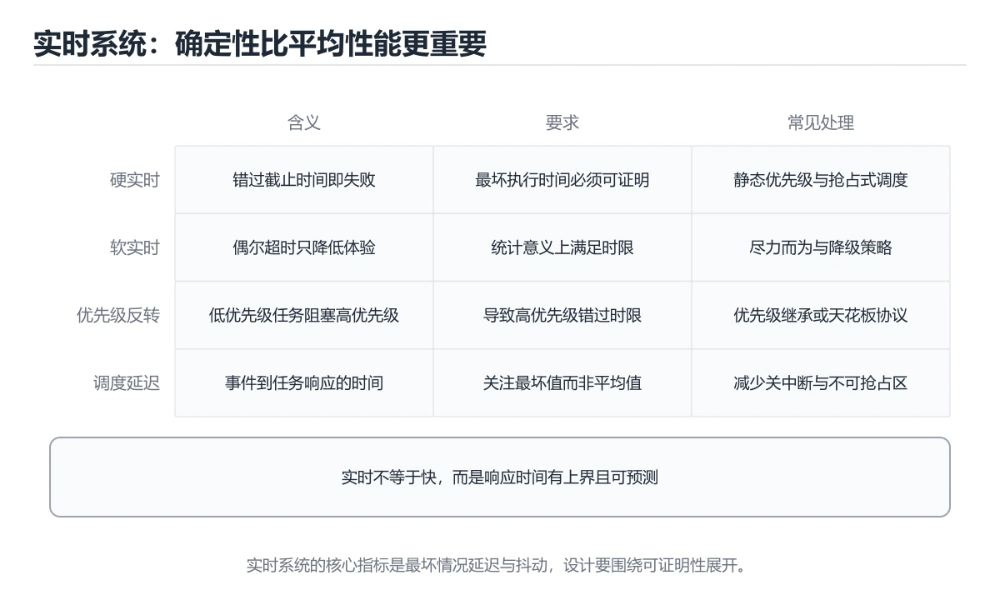
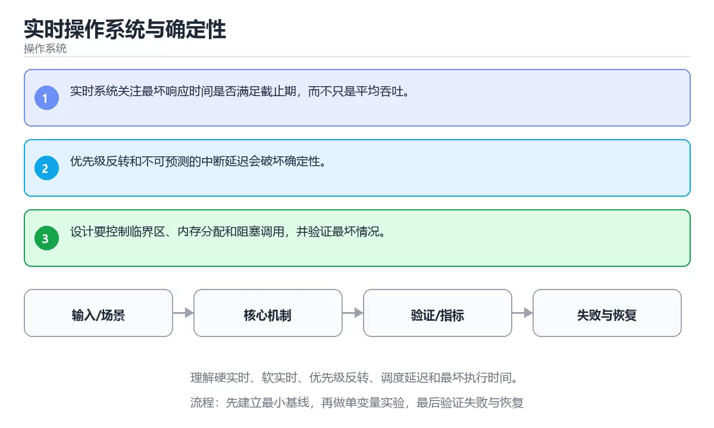

# 实时操作系统与确定性

> 内容更新时间：2026-10-06 · 学习阶段：高级 · 预计用时：35 分钟





## 学习目标

- 能用自己的话解释：实时系统关注最坏响应时间是否满足截止期，而不只是平均吞吐。
- 能用自己的话解释：优先级反转和不可预测的中断延迟会破坏确定性。
- 能用自己的话解释：设计要控制临界区、内存分配和阻塞调用，并验证最坏情况。
- 能把本课知识放回「操作系统」，并完成练习与测验。

## 前置知识

- 已完成本分类的基础课程，能独立运行 RTOS 的最小示例。
- 本课关键词：RTOS、实时性、优先级反转、确定性。
- 遇到不熟悉的术语先记录问题，完成练习后再回读。

## 核心知识

### 1. 实时系统关注最坏响应时间是否满足截止期，而不只是平均吞吐。

- 关键做法：先用 getpid 建立 RTOS 的基线，再逐步加入边界与失败条件。
- 验证标准：实时性 的异常路径有明确错误信息与恢复动作。

### 2. 优先级反转和不可预测的中断延迟会破坏确定性。

把这条结论放回「实时操作系统与确定性」的完整流程里展开：

- 正文依据：能用自己的话解释：优先级反转和不可预测的中断延迟会破坏确定性。
- 落地检查：把「2. 优先级反转和不可预测的中断延迟会破坏确定性。」改写成一条可执行的核对项，逐条验证输入、超时与失败路径。

### 3. 设计要控制临界区、内存分配和阻塞调用，并验证最坏情况。

把这条结论放回「实时操作系统与确定性」的完整流程里展开：

- 正文依据：本课关键词：RTOS、实时性、优先级反转、确定性。
- 落地检查：把「3. 设计要控制临界区、内存分配和阻塞调用，并验证最坏情况。」改写成一条可执行的核对项，逐条验证输入、超时与失败路径。

## 关键流程

```text
输入 → 校验 → 核心处理 → 验证 → 记录指标 → 失败恢复
```

## 实践路径

1. 用一句话复述本课要解决的问题。
2. 跑通正文中的最小示例并记录基线。
3. 只改变一个输入或参数，预测并验证结果。
4. 补一个失败路径，记录错误、恢复和指标。
5. 把结论写成可复现的笔记或测试。

## 常见错误与排查

> 说明：本表由《实时操作系统与确定性》的核心知识整理（2026-10-07），人工复核进度见 docs/content_review_batches.md。

| 易错点 | 容易踩的做法 | 正确结论 |
| --- | --- | --- |
| 把平均延迟当实时性指标 | 最坏响应时间超标却没有发现 | 关注最坏执行时间与抖动，而不只是平均值 |
| 任务优先级设置不合理 | 优先级反转导致错过截止时间 | 使用优先级继承并分析阻塞链 |
| 在中断里做耗时操作 | 响应抖动变大 | 中断只做最小处理，其余交给任务完成 |

## 动手练习

1. 合上教程，用 3～5 句话解释实时操作系统与确定性。
2. 从正文选一个例子，改变一个条件并预测结果。
3. 设计一个失败场景，写出止损与恢复步骤。

**验收标准**：留下输入、命令、输出、差异和下一步问题。

## 本课小结

- 本课围绕 RTOS、实时性、优先级反转、确定性 展开，复习时重点核对它们的输入、输出和失败路径。
- 做完本课测验后，把答错且解释不清的 实时性 相关题目记成验证任务。


## 深入理解：实时操作系统与确定性

### 确定性意味着什么

实时系统的正确性不仅要求结果正确，还要求在最坏情况下的响应时间有上界。衡量指标是
最坏响应时间与抖动，而不是平均延迟。为此调度器通常采用固定优先级抢占式策略，
高优先级任务一旦就绪立即运行，中断服务程序只做最少的工作，其余交给任务处理。

### 优先级反转与优先级继承

当低优先级任务持有高优先级任务需要的锁时，高优先级任务被迫等待；如果此时有中等
优先级任务占用 CPU，等待时间会被进一步拉长，这就是优先级反转。解决办法是优先级
继承（持锁任务临时提升到等待者的优先级）或优先级天花板。火星探路者的事故就是
一个经典案例，说明实时系统必须专门验证资源共享路径。

### 中断延迟与内存管理

中断延迟由关中断时间、中断处理与调度开销共同决定。实时内核通常允许任务自己选择
栈大小、禁止缺页中断，或使用静态内存池，避免运行期分配造成的不可预测延迟。
FreeRTOS、Zephyr 等系统提供 tickless 模式降低空闲功耗，但会改变时间精度。
选型时要同时看调度保证、生态与最坏路径的实测数据。

「实时操作系统与确定性」的「确定性意味着什么」一节补全如下：

- 定位：这一节说明确定性意味着什么在「实时操作系统与确定性」知识体系里的位置。
- 要点：优先级任务占用 CPU，等待时间会被进一步拉长，这就是优先级反转。解决办法是优先级
- 自检：能否用一个最小例子解释确定性意味着什么？


「实时操作系统与确定性」的「优先级反转与优先级继承」一节补全如下：

- 定位：这一节说明优先级反转与优先级继承在「实时操作系统与确定性」知识体系里的位置。
- 要点：FreeRTOS、Zephyr 等系统提供 tickless 模式降低空闲功耗，但会改变时间精度。
- 自检：能否用一个最小例子解释优先级反转与优先级继承？


「实时操作系统与确定性」的「中断延迟与内存管理」一节补全如下：

- 定位：这一节说明中断延迟与内存管理在「实时操作系统与确定性」知识体系里的位置。
- 检查点：用空值、极值和依赖失败各跑一次《实时操作系统与确定性》，确认边界行为与正文一致。
- 自检：能否用一个最小例子解释中断延迟与内存管理？

## 可运行练习

### 任务 1：先跑通，再解释

```python
import os

print("pid>0:", os.getpid() > 0)
```

### 任务 2：只改一个条件

把「实时操作系统与确定性」的最小示例复制一份，只改一个条件再跑一次：

- 改动点：只把 RTOS 的输入换成空值、极值或错误输入，其余保持不变。
- 预测：先写下「实时操作系统与确定性」在改动后的输出或错误信息，再运行。
- 记录：对照改动前后的结果，指出差异出在哪一步。
- 验收：换回原条件能复现原结果，改动只影响RTOS。

### 任务 3：迁移到自己的数据

换一个 实时性 场景重做一次，确认结论不是只对示例数据成立。

## 故障现场

### 现场 1：把平均延迟当实时性指标

**症状**：在《实时操作系统与确定性》的复现场景中，最坏响应时间超标却没有发现。

**根因**：“最坏响应时间超标却没有发现”只是表层结果。向上追溯会落到“把平均延迟当实时性指标”这一步，因为它省略了《实时操作系统与确定性》的约束，使实现行为和预期模型发生了偏离。

**修复**：针对《实时操作系统与确定性》的问题，关注最坏执行时间与抖动，而不只是平均值。

**验证**：保留《实时操作系统与确定性》里触发“最坏响应时间超标却没有发现”的输入、版本和日志，按“关注最坏执行时间与抖动，而不只是平均值”完成修改后原样重放；只有失败现象消失且相邻场景仍可解释，才保留改动。

### 现场 2：任务优先级设置不合理

**症状**：在《实时操作系统与确定性》的复现场景中，优先级反转导致错过截止时间。

**根因**：“优先级反转导致错过截止时间”只是表层结果。向上追溯会落到“任务优先级设置不合理”这一步，因为它省略了《实时操作系统与确定性》的约束，使实现行为和预期模型发生了偏离。

**修复**：针对《实时操作系统与确定性》的问题，使用优先级继承并分析阻塞链。

**验证**：保留《实时操作系统与确定性》里触发“优先级反转导致错过截止时间”的输入、版本和日志，按“使用优先级继承并分析阻塞链”完成修改后原样重放；只有失败现象消失且相邻场景仍可解释，才保留改动。

### 现场 3：在中断里做耗时操作

**症状**：在《实时操作系统与确定性》的复现场景中，响应抖动变大。

**根因**：当出现“在中断里做耗时操作”时，执行路径已经绕过了《实时操作系统与确定性》的关键约束，最终以“响应抖动变大”暴露出来；修复前必须先确认约束在哪里失效。

**修复**：针对《实时操作系统与确定性》的问题，中断只做最小处理，其余交给任务完成。

**验证**：在《实时操作系统与确定性》中按“中断只做最小处理，其余交给任务完成”调整后，从“在中断里做耗时操作”的触发条件重放同一条路径，确认“响应抖动变大”不再出现，并补一个相邻边界用例检查没有引入新问题。

## 本课复习清单


离开本课前，逐项确认：

- [ ] 不看解析，能说出「关于「实时系统关注最坏响应时间是否满足截止期，而不只是平均吞吐。」，下列说法正确的是？」的判断依据。
- [ ] 不看解析，能说出「关于「设计要控制临界区、内存分配和阻塞调用，并验证最坏情况。」，下列说法正确的是？」的判断依据。
- [ ] 不看解析，能说出「下面这段 Python 代码摘自「实时操作系统与确定性」的正文示例。关于这段代码，下面哪一项说法与实际内容相符？」的判断依据。
- [ ] 至少运行一次《实时操作系统与确定性》的示例，记录输入、输出和一个边界情况。
- [ ] 把本课最容易混淆的两个概念写成一句话对照。

| 复盘项 | 记录 |
| --- | --- |
| 已经能独立解释的考点 |  |
| 仍然说不清的概念 |  |
| 下一步验证动作 |  |

## 复习与自测

下面按正文顺序回顾「实时操作系统与确定性」的每一节；说不清的地方回到 核心知识 补课。

### 核心知识

自检：这一节与相邻主题的边界在哪里？

### 动手练习

自检：如果去掉这一节里的一个前提，结论会怎样变化？

### 深入理解：实时操作系统与确定性

实时系统的正确性不仅要求结果正确，还要求在最坏情况下的响应时间有上界。为此调度器通常采用固定优先级抢占式策略，。

自检：把这一节讲给没学过的人，最需要强调哪一点？

### 验证步骤

制造一次错误输入，记录错误信息与修复方式。

## 术语速查

| 术语 | 一句话说明 |
| --- | --- |
| `RTOS` | 面向实时任务的嵌入式操作系统，提供确定性调度、优先级和同步原语。 |
| `实时性` | 系统从事件发生到完成响应的时间上限，硬实时要求错过截止时间即视为失败。 |
| `优先级反转` | 按“实时操作系统与确定性”中 RTOS、实时性、优先级反转 的实践顺序，把四个步骤排成从准备到复盘的合理顺序。 |
| `确定性` | 定位：这一节说明确定性意味着什么在「实时操作系统与确定性」知识体系里的位置。 |
| `中断延迟` | 中断延迟由关中断时间、中断处理与调度开销共同决定 |

## 深度拓展与实战

这一节把「实时操作系统与确定性」正文里的定义、代码和失败模式串成一条可操作的复习路线。

### 机制拆解

- **1. 实时系统关注最坏响应时间是否满足截止期，而不只是平均吞吐。**：在「实时操作系统与确定性」里，「1. 实时系统关注最坏响应时间是否满足截止期，而不只是平均吞吐。」这一步要先写清输入与预期，再记录实际结果和差异；结果不符时回到对应小节核对前提。
- **2. 优先级反转和不可预测的中断延迟会破坏确定性。**：在「实时操作系统与确定性」里，「2. 优先级反转和不可预测的中断延迟会破坏确定性。」这一步要先写清输入与预期，再记录实际结果和差异；结果不符时回到对应小节核对前提。
- **3. 设计要控制临界区、内存分配和阻塞调用，并验证最坏情况。**：在「实时操作系统与确定性」里，「3. 设计要控制临界区、内存分配和阻塞调用，并验证最坏情况。」这一步要先写清输入与预期，再记录实际结果和差异；结果不符时回到对应小节核对前提。
- **确定性意味着什么**：实时系统的正确性不仅要求结果正确，还要求在最坏情况下的响应时间有上界
- **优先级反转与优先级继承**：当低优先级任务持有高优先级任务需要的锁时，高优先级任务被迫等待；如果此时有中等

### 边界条件与常见反例

「实时操作系统与确定性」的边界不只包括最大最小值，还要覆盖空、重复和失败：

| 条件 | 常见反例 | 处理方式 |
| --- | --- | --- |
| 空输入 | RTOS 没有任何取值 | 先判空，给出明确错误而不是继续执行 |
| 边界值 | 实时性 取最小或最大 | 用最小值、最大值和越界值各跑一次 |
| 重复执行 | 同一输入被执行两次 | 保证结果可重复，必要时加锁或去重 |
| 失败路径 | RTOS 相关步骤报错 | 保留原始错误，确认回滚或重试行为 |

### 工程检查表

- [ ] 能否用自己的话说明实时操作系统与确定性解决什么问题，以及它不负责什么？
- [ ] 能否用「实时操作系统与确定性」的最小示例复现一次失败并解释原因？
- [ ] 能否解释本课关键词在真实项目中的边界与取舍？
- [ ] 换一个输入后，getpid 的判断依据是否仍然成立？

### 迁移练习

1. 保持正文示例不变，写出它的输入、处理步骤和预期输出。
2. 把 实时性 换成边界值，说明依据后再实际运行。
3. 结合RTOS、实时性、优先级反转、确定性，写出一个真实项目中的使用场景。
4. 写下一个反例，说明它在什么条件下会使朴素做法失效。

## 考点精讲

### 考点 1：概念判断·RTOS

- **题目**：关于「实时系统关注最坏响应时间是否满足截止期，而不只是平均吞吐。」，下列说法正确的是？
- **判断依据**：在「实时操作系统与确定性」里，实时系统关注最坏响应时间是否满足截止期，而不只是平均吞吐。回到「实时操作系统与确定性」的正文示例，用“关于实时系统关注最坏响应时间是否满足”走一遍RTOS、实时性、优先级反转的完整流程，能复现的结论才可以保留。

### 考点 2：顺序排列·RTOS

- **题目**：按“实时操作系统与确定性”中 RTOS、实时性、优先级反转 的实践顺序，把四个步骤排成从准备到复盘的合理顺序。
- **判断依据**：在「实时操作系统与确定性」里，在本课的练习里，顺序应当是：先明确 RTOS 的输入、输出与约束 → 写出最小示例并核对 实时性 的基线结果 → 只改一个变量，记录边界与失败路径的变化 → 固定版本与证据，把本课的结论写成可复现记录。这个顺序把 RTOS 的输入、输出和约束放在最前面，在实时操作系统与确定性里避免概念没对齐就开始调参。第二步用 实时性 建立可核对的基线，在实时操作系统与确定性里第三步才允许改变一个变量并观察失败路径。

### 考点 3：概念判断·RTOS

- **题目**：关于「设计要控制临界区、内存分配和阻塞调用，并验证最坏情况。」，下列说法正确的是？
- **判断依据**：在「实时操作系统与确定性」里，设计要控制临界区、内存分配和阻塞调用，并验证最坏情况。在「实时操作系统与确定性」里，如果只凭关键词作答，很容易把队列深度、并发和调度策略要与设备能力匹配。在「实时操作系统与确定性」里判断这道题，要把RTOS、实时性、优先级反转的条件、过程与失败路径逐项对齐，换成“关于设计要控制临界区、内存分配和阻塞”这个场景，只有满足前提的结论才成立。

### 考点 4：代码补全·RTOS

- **题目**：下面这段 Python 代码摘自「实时操作系统与确定性」的正文示例。关于这段代码，下面哪一项说法与实际内容相符？
- **判断依据**：题干的正确项是这段代码会产生可观察的输出，运行后能看到结果，在「实时操作系统与确定性」里要结合RTOS核对输出是否符合预期。这段代码出自「实时操作系统与确定性」的正文示例，围绕RTOS、实时性、优先级反转展开；把输入或边界换成空值、极值或失败情况后，结论要以「实时操作系统与确定性」的实际运行结果为准。回到「实时操作系统与确定性」的正文示例，用“下面这段 Python 代码摘自实时”走一遍RTOS、实时性、优先级反转的完整流程，能复现的结论才可以保留。

### 考点 5：多选辨析·RTOS

- **题目**：以下哪些术语与「实时操作系统与确定性」直接相关？（多选）
- **判断依据**：在「实时操作系统与确定性」里，实时性。这道题的关键在「实时操作系统与确定性」的RTOS、实时性、优先级反转：先确认题干“以下哪些术语与实时操作系统与确定性直”问的是哪一步，再排除偷换前提的选项。把“RTOS”代回正文里“以下哪些术语与直接相关（多选）”的例子核对，条件一旦改变，结论就要用RTOS、实时性、优先级反转重新推导。

## English Overview

**Title:** RTOS and Determinism

**Summary:** Learn hard/soft real-time, priority inversion, latency and worst-case execution time.

**Category:** Operating Systems
**Level:** 高级
**Key terms:** RTOS, 实时性, 优先级反转, 确定性

## 内容元数据

- 内容版本：v2.0
- 最后更新：2026-10-06
- 学习阶段：高级
- 适用环境：Linux 6.x / POSIX；本课聚焦 RTOS。
- 内容来源：内置结构化课程与工程实践整理
- 相关主题：RTOS、实时性、优先级反转、确定性
- 质量版本：P0 测验标准 + P1 覆盖扩展 + P2 体验补全

## 最小可运行示例

下面示例用于验证 RTOS 的最小输入、处理和输出。先原样运行，再只修改一个值：

```python
import os

print("pid>0:", os.getpid() > 0)
```

## 预期输出

```text
pid>0: True
```

## 验证步骤

1. 记录运行环境、命令和真实输出。
2. 修改一个输入，先写预测再运行。
4. 把结论写回本课笔记或测试用例。

## 参考资料与复核

- 最后复核：2026-10-04
- 下次复核：2027-07-24
- 复核范围：版本兼容、API 行为、安全建议与工程实践
- 来源性质：官方文档、标准或权威教材；正文为离线教学重组

| 参考资料 | 本课用途 |
| --- | --- |
| [Linux 内核文档](https://docs.kernel.org/) | 调度、内存、文件系统与 I/O |
| [OSTEP](https://pages.cs.wisc.edu/~remzi/OSTEP/) | 操作系统导论教材 |
| [systemd 文档](https://www.freedesktop.org/software/systemd/man/latest/) | 服务、日志与资源控制 |

> 「实时操作系统与确定性」的链接用于离线阅读后的延伸核对；App 不会自动联网。

## 复习与迁移

复习目标：把「实时操作系统与确定性」的判断标准放回可复现的例子里。先自己作答，再对照依据；如果结论正确但理由不完整，回到正文补足前提。

### 概念复述

- 用一句话说明「实时操作系统与确定性」解决什么问题：理解硬实时、软实时、优先级反转、调度延迟和最坏执行时间。
- 写出RTOS、实时性、优先级反转之间的关系，并各举一个例子。
- 说出本课最容易混淆的两个概念，以及区分它们的判据。

### 正文逐节复核

- **深入理解：实时操作系统与确定性**：优先级任务占用 CPU，等待时间会被进一步拉长，这就是优先级反转。

### 测验回顾

1. 关于「实时系统关注最坏响应时间是否满足截止期，而不只是平均吞吐。」，下列说法正确的是？
   - 依据：在「实时操作系统与确定性」里，实时系统关注最坏响应时间是否满足截止期，而不只是平均吞吐。回到「实时操作系统与确定性」的正文示例，用“关于实时系统关注最坏响应时间是否满足”走一遍RTOS、实时性、优先级反转的完整流程，能复现的结论才可以保留。
2. 按“实时操作系统与确定性”中 RTOS、实时性、优先级反转 的实践顺序，把四个步骤排成从准备到复盘的合理顺序。
   - 依据：在「实时操作系统与确定性」里，在本课的练习里，顺序应当是：先明确 RTOS 的输入、输出与约束 → 写出最小示例并核对 实时性 的基线结果 → 只改一个变量，记录边界与失败路径的变化 → 固定版本与证据，把本课的结论写成可复现记录。这个顺序把 RTOS 的输入、输出和约束放在最前面，在实时操作系统与确定性里避免概念没对齐就开始调参。第二步用 实时性 建立可核对的基线，在实时操作系统与确定性里第三步才允许改变一个变量并观察失败路径。
3. 关于「设计要控制临界区、内存分配和阻塞调用，并验证最坏情况。」，下列说法正确的是？
   - 依据：在「实时操作系统与确定性」里，设计要控制临界区、内存分配和阻塞调用，并验证最坏情况。在「实时操作系统与确定性」里，如果只凭关键词作答，很容易把队列深度、并发和调度策略要与设备能力匹配。在「实时操作系统与确定性」里判断这道题，要把RTOS、实时性、优先级反转的条件、过程与失败路径逐项对齐，换成“关于设计要控制临界区、内存分配和阻塞”这个场景，只有满足前提的结论才成立。
4. 下面这段 Python 代码摘自「实时操作系统与确定性」的正文示例。关于这段代码，下面哪一项说法与实际内容相符？
   - 依据：题干的正确项是这段代码会产生可观察的输出，运行后能看到结果，在「实时操作系统与确定性」里要结合RTOS核对输出是否符合预期。这段代码出自「实时操作系统与确定性」的正文示例，围绕RTOS、实时性、优先级反转展开；把输入或边界换成空值、极值或失败情况后，结论要以「实时操作系统与确定性」的实际运行结果为准。回到「实时操作系统与确定性」的正文示例，用“下面这段 Python 代码摘自实时”走一遍RTOS、实时性、优先级反转的完整流程，能复现的结论才可以保留。
5. 以下哪些术语与「实时操作系统与确定性」直接相关？（多选）
   - 依据：在「实时操作系统与确定性」里，实时性。这道题的关键在「实时操作系统与确定性」的RTOS、实时性、优先级反转：先确认题干“以下哪些术语与实时操作系统与确定性直”问的是哪一步，再排除偷换前提的选项。把“RTOS”代回正文里“以下哪些术语与直接相关（多选）”的例子核对，条件一旦改变，结论就要用RTOS、实时性、优先级反转重新推导。

### 迁移练习

把「实时操作系统与确定性」的结论迁移到相邻主题，每次迁移都写清预测与证据：

1. 换输入：用RTOS处理一组你自己的数据，对比教材示例的结果差异。
2. 换失败条件：制造一个实时性相关的错误，说明如何从错误信息定位根因。
3. 换规模：把数据量或并发度提高一个数量级，说明「实时操作系统与确定性」的结论是否仍成立。

## 工程化精练：决策、失败与验证

这一章把「实时操作系统与确定性」从“看懂”推进到“能判断、能验证、能排错”。所有判断都围绕RTOS、实时性与优先级反转展开，并与前文的示例、测验和失败现场互相对照。

### 一、RTOS 的判断算法

| 步骤 | 要回答的问题 | 判断依据 | 记录什么 |
| --- | --- | --- | --- |
| 1. 定目标 | 「实时操作系统与确定性」这一步要解决什么问题？ | 把RTOS的目标写成一句可验证的结论 | 输入、约束、成功标准 |
| 2. 找边界 | 实时性在什么条件下失效？ | 先列空值、极值、重复和失败路径 | 反例与触发条件 |
| 3. 跑基线 | 原始示例的真实输出是什么？ | 命令、版本和环境必须可复现 | 命令、输出、耗时 |
| 4. 只改一处 | 把优先级反转换成另一种取值会怎样？ | 预测写在运行之前 | 预测与实际的差异 |
| 5. 回写结论 | 结论能否被他人复现？ | 把判断写成清单或测试 | 结论、证据、遗留问题 |

这张表的用法不是从上到下浏览，而是每次只填一行：先用「实时操作系统与确定性」前文的示例验证第 3 行，再故意破坏一个条件验证第 2 行。当你能在不看解析的情况下说出RTOS的判断依据，才算真正掌握本课。

- 先从RTOS入手：把它写成“输入是什么、输出是什么、哪一步最容易出错”。如果这三句话中有一句说不清，说明对「实时操作系统与确定性」的理解还停留在术语层面，需要回到正文的最小示例重新观察一次。

- 再把实时性当成对照实验的变量：固定其他条件，只改变它的取值，记录输出是否变化。结论“变”或“不变”都要写出理由，并说明这个理由能否被他人独立复现。

- 针对优先级反转做一次失败演练：故意给出空值、极值或错误类型，观察「实时操作系统与确定性」的报错位置和处理方式。错误信息只是入口，真正要定位的是哪一层假设被破坏。

- 把「实时操作系统与确定性」的结论压缩成一条可执行清单：先检查输入，再检查版本与环境，然后跑最小用例，最后才扩大规模。顺序颠倒会让排错范围成倍增加。

- 如果结论依赖时间或规模，就把数据量提高一个数量级再跑一次。在「实时操作系统与确定性」里，小样本成立不代表大样本成立，复杂度、资源占用和失败率都要重新记录。

- 如果结论依赖并发或共享状态，就固定输入并连续运行多次。结果不一致时，优先怀疑「实时操作系统与确定性」中RTOS相关步骤的隐藏状态，而不是先改代码。

- 把「实时操作系统与确定性」的判断写成测试：一个正常用例、一个边界用例、一个失败用例。测试通过只是起点，还要确认失败用例确实以预期方式失败。

- 把本课与相邻主题连起来：RTOS解决的是“怎么做”，实时性回答“什么时候不适用”。两者都答得出来，迁移才算完成。

> 第 2 轮复核「实时操作系统与确定性」：把上面的结论逐条改写为可验证的问题，并记录仍不确定的部分。

- 先从RTOS入手：把它写成“输入是什么、输出是什么、哪一步最容易出错”。如果这三句话中有一句说不清，说明对「实时操作系统与确定性」的理解还停留在术语层面，需要回到正文的最小示例重新观察一次。

- 再把实时性当成对照实验的变量：固定其他条件，只改变它的取值，记录输出是否变化。结论“变”或“不变”都要写出理由，并说明这个理由能否被他人独立复现。

- 针对优先级反转做一次失败演练：故意给出空值、极值或错误类型，观察「实时操作系统与确定性」的报错位置和处理方式。错误信息只是入口，真正要定位的是哪一层假设被破坏。

### 二、实时操作系统与确定性 的机制拆解与自测

把本课考点还原成可回答的问题，再逐题写出依据：

**问题 1**：关于「实时系统关注最坏响应时间是否满足截止期，而不只是平均吞吐。」，下列说法正确的是？

- 关联术语：RTOS
- 判断依据：实时系统关注最坏响应时间是否满足截止期，而不只是平均吞吐。
- 追问：如果把RTOS的条件换成边界值，这个结论是否仍然成立？

**问题 2**：按“实时操作系统与确定性”中 RTOS、实时性、优先级反转 的实践顺序，把四个步骤排成从准备到复盘的合理顺序。

- 关联术语：实时性
- 判断依据：先明确 RTOS 的输入、输出与约束
- 追问：如果把实时性的条件换成边界值，这个结论是否仍然成立？

**问题 3**：关于「设计要控制临界区、内存分配和阻塞调用，并验证最坏情况。」，下列说法正确的是？

- 关联术语：优先级反转
- 判断依据：设计要控制临界区、内存分配和阻塞调用，并验证最坏情况。
- 追问：如果把优先级反转的条件换成边界值，这个结论是否仍然成立？

**问题 4**：下面这段 Python 代码摘自「实时操作系统与确定性」的正文示例。关于这段代码，下面哪一项说法与实际内容相符？

- 关联术语：确定性
- 判断依据：回到「实时操作系统与确定性」正文对应小节，先用最小示例验证再下结论。
- 追问：如果把确定性的条件换成边界值，这个结论是否仍然成立？

**问题 5**：以下哪些术语与「实时操作系统与确定性」直接相关？（多选）

- 关联术语：RTOS
- 判断依据：回到「实时操作系统与确定性」正文对应小节，先用最小示例验证再下结论。
- 追问：如果把RTOS的条件换成边界值，这个结论是否仍然成立？

### 三、失败模式与修复顺序

| 失败信号 | 常见根因 | 先做什么 | 修复后如何确认 |
| --- | --- | --- | --- |
| 「实时操作系统与确定性」中 RTOS 相关步骤报错 | 输入、版本或前置条件与示例不一致 | 保留第一条错误信息，回到最小输入 | 用实时系统关注最坏响应时间是否满足截止期，而不只是平均吞吐。复跑，确认输出可复现 |
| 「实时操作系统与确定性」中 实时性 相关步骤报错 | 输入、版本或前置条件与示例不一致 | 保留第一条错误信息，回到最小输入 | 用先明确 RTOS 的输入、输出与约束复跑，确认输出可复现 |
| 「实时操作系统与确定性」中 优先级反转 相关步骤报错 | 输入、版本或前置条件与示例不一致 | 保留第一条错误信息，回到最小输入 | 用设计要控制临界区、内存分配和阻塞调用，并验证最坏情况。复跑，确认输出可复现 |
- 检查点：固定版本与输入重跑《实时操作系统与确定性》，记录两次差异并定位不稳定条件。
| 单次结果正确但规模一大就失效 | 只测了正常路径，没有覆盖边界 | 把数据量或并发度提高一个数量级 | 记录边界值、耗时与失败率 |

排错顺序固定为：先复现，再缩小输入，然后只改一个条件，最后把结论写成回归用例。对「实时操作系统与确定性」来说，任何不能复现的“修好了”都不算完成。

### 四、离开本课前的验证清单

| 检查项 | 通过标准 | 证据 |
| --- | --- | --- |
| 能复述 | 用三句话说明「实时操作系统与确定性」解决什么问题、边界在哪 | 不看解析写出的结论 |
| 能运行 | 最小示例在本机跑通 | 命令、输出与版本 |
| 能改条件 | 只改一个输入并解释差异 | 预测与实际的对照 |
| 能排错 | 至少制造并修复一个失败 | 错误信息与修复步骤 |
| 能迁移 | 把RTOS、实时性、优先级反转、确定性用到新场景 | 一个自选练习的结论 |

完成标准：能不看解析说清「实时操作系统与确定性」全部自测题的依据，并且至少有一条RTOS相关的结论经过真实运行验证。如果某一步只停留在“感觉懂了”，就把它写成下一轮针对「实时操作系统与确定性」的最小验证任务。

### 五、把结论写成可检查的证据

学习「实时操作系统与确定性」时，最容易出现的情况是“听过、看懂了，但换一个输入就说不清”。下面把RTOS与实时性放进一条可检查的证据链：每一句结论都要能回答“从哪里来、在什么条件下成立、失败时怎么发现”。

| 证据类型 | 本课要求 | 不合格的表现 |
| --- | --- | --- |
| 概念证据 | 用一句话说明RTOS的定义与适用场景 | 只背术语，说不出它解决什么问题 |
| 运行证据 | 能复现「实时操作系统与确定性」的最小示例 | 输出与记录对不上，或换机器就不一致 |
| 对照证据 | 只改一个条件，说明差异来自哪里 | 一次改多个变量，无法归因 |
| 失败证据 | 故意制造错误并记录恢复步骤 | 只测正常路径，失败时靠猜 |
| 迁移证据 | 把实时性用到自选场景 | 换一个例子就完全套不上 |

举例：实时系统关注最坏响应时间是否满足截止期，而不只是平均吞吐。。把这个结论代回「实时操作系统与确定性」的正文，找出它对应的输入、处理步骤与输出；再换掉其中一个条件，观察结论是否仍然成立。能完成这一步，才说明这条知识已经从“记忆”变成“可用的判断”。

最后留一个自检问题：如果只能保留三条笔记，你会写下哪三句？把答案限定为「实时操作系统与确定性」中的可验证结论，并给每条结论配一个反例。这三句加上对应反例，就是本课最值得带入后续课程的复习材料。

