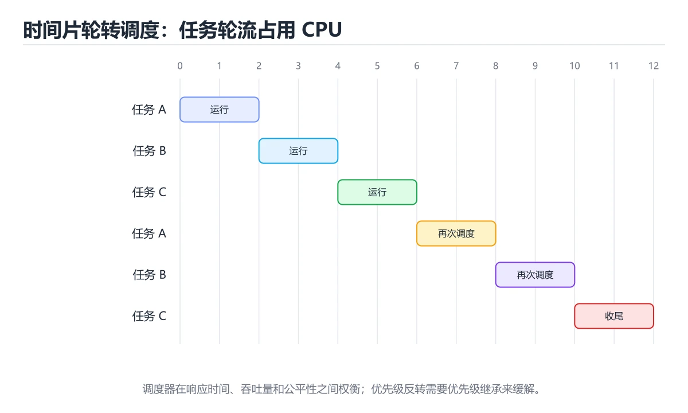
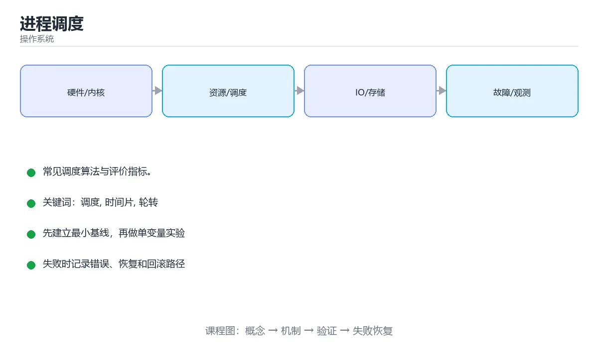

# 进程调度





> 内容更新时间：2026-10-06 · 学习阶段：入门 · 预计用时：30 分钟

## 学习目标

- 能用自己的话解释进程调度解决了什么问题，而不是只背术语。
- 能说清 「调度」、「时间片」、「轮转」、「优先级」 之间的关系，并分别举出一个例子。
- 能把 调度 放回「进程调度」的知识体系，说明它和 时间片 的边界。
- 能完成本课练习，并用验收标准检查自己的结果。

> 一句话摘要：常见调度算法与评价指标。

## 前置知识

- 先完成上一课《进程与线程》；如果已经掌握，可以直接用本课练习自测。
- 本课阶段：入门。建议先完成「进程与线程」，或确认自己能独立跑通正文里的 sjf_non_preemptive 示例。
- 开始前先复习：调度、时间片、轮转。
- 如果 调度要解决什么 这一步看不懂，先记录具体卡点，再用 sjf_non_preemptive 复现一遍。

## 调度要解决什么

CPU 核心数远少于待运行的任务数，操作系统必须决定「下一个运行谁、运行多久」。这就是调度器的职责，目标是在**吞吐量、响应时间、公平性**之间取得平衡。

## 常见调度算法

| 算法 | 思想 | 优点 | 缺点 |
| --- | --- | --- | --- |
| 先来先服务 FCFS | 按到达顺序执行 | 简单、公平 | 长任务拖累短任务 |
| 最短作业优先 SJF | 优先执行预计最短的任务 | 平均等待时间最短 | 长任务可能饿死 |
| 时间片轮转 RR | 每个任务运行一个时间片 | 响应快、适合分时 | 时间片过小则切换开销大 |
| 优先级调度 | 优先级高的先运行 | 支持实时任务 | 低优先级饿死 |
| 多级反馈队列 | 多队列 + 动态调整优先级 | 兼顾交互与批处理 | 实现复杂 |

## 时间片轮转示例

```text
任务: A(需要 5) B(需要 3) C(需要 2)，时间片 = 2

时间 0-2 : A  剩余 3
时间 2-4 : B  剩余 1
时间 4-6 : C  完成
时间 6-8 : A  剩余 1
时间 8-10: B  完成
时间 10-11: A 完成
```

## 抢占与非抢占

- **非抢占式**：任务主动让出 CPU（结束或阻塞）才切换。
- **抢占式**：时间片用完或有更高优先级任务到达时强制切换。

现代通用操作系统（Linux、Windows、macOS）都使用抢占式调度。

## 相关指标

```text
周转时间 = 完成时间 - 到达时间
带权周转时间 = 周转时间 / 实际运行时间
等待时间 = 周转时间 - 实际运行时间
```

比较算法优劣时，通常看平均等待时间和平均周转时间。

## 优先级反转（进阶）

高优先级任务等待低优先级任务持有的锁，而低优先级任务又被中优先级任务抢占，导致高优先级任务长时间阻塞。解决办法是**优先级继承**或优先级天花板。

## 本课小结

调度没有万能算法，本质是**按场景做权衡**：交互场景重响应，批处理场景重吞吐。

## 调度算法对照

| 算法 | 抢占 | 优点 | 缺点 | 适用 |
| --- | --- | --- | --- | --- |
| 先来先服务（FCFS） | 否 | 简单公平 | 长任务阻塞短任务 | 批处理 |
| 短作业优先（SJF） | 否 | 平均等待最短 | 需预知运行时间、长任务饥饿 | 批处理 |
| 最短剩余时间优先 | 是 | 响应更好 | 同上 | 交互式批处理 |
| 时间片轮转（RR） | 是 | 响应均匀 | 时间片太小切换开销大 | 分时系统 |
| 优先级调度 | 可 | 支持重要性 | 低优先级饥饿 | 实时与混合 |
| 多级反馈队列 | 是 | 兼顾响应与吞吐 | 参数多 | 通用操作系统 |
| 完全公平调度（CFS） | 是 | 按权重分配 CPU | 实现复杂 | Linux |

## 关键指标速查

| 指标 | 含义 |
| --- | --- |
| 周转时间 | 完成时刻减到达时刻 |
| 等待时间 | 周转时间减去实际运行时间 |
| 响应时间 | 从到达到首次被调度 |
| 吞吐量 | 单位时间完成的任务数 |
| CPU 利用率 | 忙碌时间占比 |
| 上下文切换次数 | 切换开销的间接指标 |

```python
from dataclasses import dataclass

@dataclass
class Job:
    name: str
    arrive: int
    burst: int

def fcfs(jobs: list) -> dict:
    time, results = 0, {}
    for job in sorted(jobs, key=lambda j: j.arrive):
        time = max(time, job.arrive) + job.burst
        results[job.name] = {"finish": time, "turnaround": time - job.arrive}
        results[job.name]["waiting"] = results[job.name]["turnaround"] - job.burst
    return results

def sjf_non_preemptive(jobs: list) -> dict:
    """短作业优先：每次从已到达任务中挑最短的。"""
    pending, time, results = sorted(jobs, key=lambda j: j.arrive), 0, {}
    ready = []
    while pending or ready:
        while pending and pending[0].arrive <= time:
            ready.append(pending.pop(0))
        if not ready:
            time = pending[0].arrive
            continue
        job = min(ready, key=lambda j: j.burst)
        ready.remove(job)
        time += job.burst
        results[job.name] = {
            "finish": time,
            "turnaround": time - job.arrive,
            "waiting": time - job.arrive - job.burst,
        }
    return results

def average_waiting(results: dict) -> float:
    waits = [item["waiting"] for item in results.values()]
    return round(sum(waits) / len(waits), 2)

jobs = [Job("A", 0, 8), Job("B", 1, 4), Job("C", 2, 2)]
print(average_waiting(fcfs(jobs)), average_waiting(sjf_non_preemptive(jobs)))
```

## 常见错误与排查

| 容易踩的做法 | 实际现象 | 原因与正确做法 |
| --- | --- | --- |
| 认为 SJF 适合交互系统 | 用户感到卡顿 | SJF 无法预知运行时间且易饥饿 |
| 时间片设得过小 | 切换开销占比高 | 时间片通常为几毫秒到几十毫秒 |
| 忽略优先级反转 | 高优先级任务被拖慢 | 用优先级继承或天花板协议 |
| 只看平均等待时间 | 掩盖长尾 | 同时看 P99 与最大等待 |
| 忽略亲和性 | 缓存命中率低 | 尽量让线程回到同一 CPU |
| 在实时系统用 CFS | 无法保证截止时间 | 用 SCHED_FIFO / RR 或实时补丁 |
| 认为更多线程一定更快 | 切换开销上升 | 按 CPU 密集型核数配置 |
| 忽略 IO 等待 | 误判 CPU 瓶颈 | 看 `vmstat` 的 `wa` 与 `iowait` |
| 忘了记账 | 无法解释性能问题 | 用 `pidstat`、`perf sched` 观察 |
| 把负载均值当实时值 | 判断滞后 | 结合 1/5/15 分钟与瞬时指标 |

## 复习与自测

- [ ] 能列出常见调度算法与适用场景。
- [ ] 会计算周转时间、等待时间与平均等待。
- [ ] 知道时间片大小的权衡。
- [ ] 理解优先级反转与解决手段。
- [ ] 会用 `top -H`、`pidstat`、`perf sched` 观察调度行为。

## 动手练习

> 本课练习重点：围绕「调度、时间片、轮转」完成复述、实验和交付，每个结果都要能被别人检查。

先定义 时间片 的状态集合，再模拟一次切换。

### 练习 1：建立心智模型（10 分钟）

合上教程，用 3～5 句话回答：

1. 进程调度解决了什么问题？
2. 如果没有它，会出现什么具体后果？
3. 它和「时间片」是什么关系？

验收标准：用自己的话解释 调度，并给出一个它不成立的反例。

### 练习 2：做一次可控实验（20 分钟）

从正文中选一个最小示例，完成以下操作：

1. 先预测修改一个参数、输入或步骤后的结果。
2. 再实际执行或逐步推演，记录真实结果。
3. 如果结果与预测不同，写出差异原因。

**验收标准**：先原样跑通正文里的 `sjf_non_preemptive`，再只改调度相关的输入，按「原例 → 改动 → 预测 → 结果 → 原因」记录；预测必须写在实际运行之前。

### 练习 3：交付一个小结果（30 分钟）

写一个小脚本模拟 sjf_non_preemptive 的竞争过程，打印每一步的状态。

任务要求：

- 结果必须能被别人检查，不能只写“我已经理解了”。
- 至少覆盖「调度」和「时间片」两个关键词。
- 写出 1 个仍然不确定的问题，以及下一步如何验证。

> 提示：时间有限时优先做练习 1 和练习 2；练习 3 可以拆成两次完成。

## 可运行练习

### 任务 1：先跑通，再解释

```python
from dataclasses import dataclass

@dataclass
class Job:
    name: str
    arrive: int
    burst: int

def fcfs(jobs: list) -> dict:
    time, results = 0, {}
    for job in sorted(jobs, key=lambda j: j.arrive):
        time = max(time, job.arrive) + job.burst
        results[job.name] = {"finish": time, "turnaround": time - job.arrive}
        results[job.name]["waiting"] = results[job.name]["turnaround"] - job.burst
    return results

def sjf_non_preemptive(jobs: list) -> dict:
    """短作业优先：每次从已到达任务中挑最短的。"""
    pending, time, results = sorted(jobs, key=lambda j: j.arrive), 0, {}
    ready = []
    while pending or ready:
        while pending and pending[0].arrive <= time:
            ready.append(pending.pop(0))
        if not ready:
            time = pending[0].arrive
            continue
        job = min(ready, key=lambda j: j.burst)
        ready.remove(job)
        time += job.burst
        results[job.name] = {
            "finish": time,
            "turnaround": time - job.arrive,
            "waiting": time - job.arrive - job.burst,
        }
    return results

def average_waiting(results: dict) -> float:
    waits = [item["waiting"] for item in results.values()]
    return round(sum(waits) / len(waits), 2)

jobs = [Job("A", 0, 8), Job("B", 1, 4), Job("C", 2, 2)]
print(average_waiting(fcfs(jobs)), average_waiting(sjf_non_preemptive(jobs)))
```

### 任务 2：只改一个条件

把「进程调度」的最小示例复制一份，只改一个条件再跑一次：

- 改动点：只把 调度 的输入换成空值、极值或错误输入，其余保持不变。
- 预测：先写下「进程调度」在改动后的输出或错误信息，再运行。
- 记录：对照改动前后的结果，指出差异出在哪一步。
- 验收：换回原条件能复现原结果，改动只影响调度。

### 任务 3：迁移到自己的数据

用同一套思路处理一组你自己的 调度 数据，保持输出格式与任务 1 一致。

## 故障现场

### 现场 1：认为 SJF 适合交互系统

**症状**：在《进程调度》的复现场景中，用户感到卡顿。

**根因**：“用户感到卡顿”只是表层结果。向上追溯会落到“认为 SJF 适合交互系统”这一步，因为它省略了《进程调度》的约束，使实现行为和预期模型发生了偏离。

**修复**：针对《进程调度》的问题，SJF 无法预知运行时间且易饥饿。

**验证**：在《进程调度》中按“SJF 无法预知运行时间且易饥饿”调整后，从“认为 SJF 适合交互系统”的触发条件重放同一条路径，确认“用户感到卡顿”不再出现，并补一个相邻边界用例检查没有引入新问题。

### 现场 2：时间片设得过小

**症状**：在《进程调度》的复现场景中，切换开销占比高。

**根因**：触发点是把“时间片设得过小”当成安全做法。它没有满足《进程调度》要求的前提，因此先表现为“切换开销占比高”；排查时先完整复现这一段，再核对输入、配置与依赖。

**修复**：针对《进程调度》的问题，时间片通常为几毫秒到几十毫秒。

**验证**：在《进程调度》中按“时间片通常为几毫秒到几十毫秒”调整后，从“时间片设得过小”的触发条件重放同一条路径，确认“切换开销占比高”不再出现，并补一个相邻边界用例检查没有引入新问题。

### 现场 3：忽略优先级反转

**症状**：在《进程调度》的复现场景中，高优先级任务被拖慢。

**根因**：当出现“忽略优先级反转”时，执行路径已经绕过了《进程调度》的关键约束，最终以“高优先级任务被拖慢”暴露出来；修复前必须先确认约束在哪里失效。

**修复**：针对《进程调度》的问题，用优先级继承或天花板协议。

**验证**：在《进程调度》中按“用优先级继承或天花板协议”调整后，从“忽略优先级反转”的触发条件重放同一条路径，确认“高优先级任务被拖慢”不再出现，并补一个相邻边界用例检查没有引入新问题。

## 本课复习清单

离开本课前，逐项确认：

- [ ] 不看解析，能说出「在已知运行时间的前提下，哪种算法能得到最短的平均等待时间？」的判断依据。
- [ ] 不看解析，能说出「时间片轮转调度最适合哪类系统？」的判断依据。
- [ ] 不看解析，能说出「解决优先级反转问题的常用方法是？」的判断依据。
- [ ] 不看解析，能说出「多级反馈队列的设计思想是？」的判断依据。
- [ ] 不看解析，能说出「上下文切换的开销主要来自哪里？」的判断依据。
- [ ] 至少运行一次 sjf_non_preemptive 的示例，记录输入、输出和 调度 的边界情况。
- [ ] 把本课最容易混淆的两个概念写成一句话对照。

| 复盘项 | 记录 |
| --- | --- |
| 已经能独立解释的考点 |  |
| 仍然说不清的概念 |  |
| 下一步验证动作 |  |

## 术语速查

把「进程调度」里反复出现的术语集中放在一起。复习时先遮住右列，尝试用自己的话解释，再回到正文核对。

| 术语 | 一句话说明 |
| --- | --- |
| `调度` | 在多个就绪任务之间分配 CPU、线程或执行机会。 |
| `时间片` | 调度器一次分配给某个任务连续运行的 CPU 时间。 |
| `SJF` | 最短作业优先：每次挑预计运行时间最短的就绪任务先执行，平均等待时间最短，但长任务可能饿死。 |
| `优先级反转` | 高优先级任务被持锁的低优先级任务间接阻塞；常用优先级继承或优先级天花板缓解。 |

## 零基础精讲：把进程调度真正讲透

### 先建立一个直觉

把操作系统看成一座资源调度中心：CPU、内存、文件和设备都是有限资源，进程提出申请，内核负责隔离、分配、回收和记账。落到本课，「进程调度」关心的是 调度 与 时间片 的配合，也就是说这条直觉要在 调度要解决什么 里被具体验证。

本课的摘要可以当作一张地图：常见调度算法与评价指标。

### 逐步拆解

1. 澄清输入与目标。先写清「进程调度」要解决的问题、合法输入范围和成功标准，再进入后续步骤。
2. 描述处理过程。把「调度、时间片、轮转、优先级、周转时间、SJF」映射到具体步骤，每步都要求能单独验证。
3. 定义输出。把 sjf_non_preemptive 的返回值、日志和失败信号都写清楚，缺一项都不算完整。
4. 先预测调度会怎样失败，再实际触发一次；差异部分就是本课最需要补的前提。
5. 把「调度要解决什么」里的最小示例抄成 sjf_non_preemptive 一行的输入，先手算结果再执行，确认两者一致。

### 把正文串成一条执行链

- **练习 1：建立心智模型（10 分钟）**：在「进程调度」里，「练习 1：建立心智模型（10 分钟）」这一步要先写清输入与预期，再记录实际结果和差异；结果不符时回到对应小节核对前提。
- **练习 2：做一次可控实验（20 分钟）**：在「进程调度」里，「练习 2：做一次可控实验（20 分钟）」这一步要先写清输入与预期，再记录实际结果和差异；结果不符时回到对应小节核对前提。
- **练习 3：交付一个小结果（30 分钟）**：在「进程调度」里，「练习 3：交付一个小结果（30 分钟）」这一步要先写清输入与预期，再记录实际结果和差异；结果不符时回到对应小节核对前提。
- **考点 1：在已知运行时间的前提下，哪种算法能得到最短的平均等待时间？**：针对「进程调度」，先自问「在已知运行时间的前提下，哪种算法能得到最短的平均等待时间」；作答后回到对应考点核对判断依据。
- **考点 2：时间片轮转调度最适合哪类系统？**：针对「进程调度」，先自问「时间片轮转调度最适合哪类系统」；作答后回到对应考点核对判断依据。
- **考点 3：解决优先级反转问题的常用方法是？**：针对「进程调度」，先自问「解决优先级反转问题的常用方法是」；作答后回到对应考点核对判断依据。

### 从测验反推易错点

**检查点 1：在已知运行时间的前提下，哪种算法能得到最短的平均等待时间？**

- 参考判断：最短作业优先 SJF
- 自问：如果去掉题干里的一个限定词，结论还成立吗？

**检查点 2：时间片轮转调度最适合哪类系统？**

- 参考判断：分时交互系统

**检查点 3：解决优先级反转问题的常用方法是？**

- 参考判断：优先级继承

**检查点 4：多级反馈队列的设计思想是？**

- 参考判断：用多个优先级队列与不同时间片兼顾响应速度与吞吐，且不需要预知运行时间

**检查点 5：上下文切换的开销主要来自哪里？**

- 参考判断：保存/恢复寄存器与栈

### 工程排错顺序

| 先查什么 | 要得到的证据 | 判断标准 |
| --- | --- | --- |
| 资源由谁创建、谁释放、何时回收？ | 日志、输入样例、测试或指标 | 能复现并解释，才算定位 |
| 用户态与内核态边界在哪里？ | 日志、输入样例、测试或指标 | 能复现并解释，才算定位 |
| 并发访问是否需要锁或无锁结构？ | 日志、输入样例、测试或指标 | 能复现并解释，才算定位 |
| 指标是吞吐、延迟还是尾延迟？ | 日志、输入样例、测试或指标 | 能复现并解释，才算定位 |

### 变式训练

1. 先用一个单文件示例验证 sjf_non_preemptive，确认正确性后再引入框架或分布式组件。
2. 扩大 时间片 的规模，记录本课结论在哪一个量级开始不成立。
3. 把 时间片 换成失败输入，记录错误信息与恢复动作。
5. 把「进程调度」里最容易被省略的一步去掉，用测试或指标证明它不可省略，而不是凭感觉判断。
6. 在低带宽或低算力条件下重跑 时间片，记录降级路径是否仍然可用。

### 本课自测

- [ ] 能用一句话解释「调度」在本课中的角色与边界。
- [ ] 能举出一个正常例子和一个失败例子。
- [ ] 能说出最小验证步骤，以及需要记录的证据。
- [ ] 能用一句话解释「时间片」在本课中的角色与边界。
- [ ] 能用一句话解释「轮转」在本课中的角色与边界。
- [ ] 能用一句话解释「优先级」在本课中的角色与边界。
- [ ] 能用一句话解释「周转时间」在本课中的角色与边界。

### 迁移案例库

换一个 时间片 约束重做一次，确认结论在新条件下是否仍然成立。

#### 迁移案例 1：围绕「调度」做一次小实验

**目标**：在不改变课程主体的前提下，验证进程调度中的一个关键判断。

**步骤**：
1. 复述当前方案对「调度」的假设，写成一句可证伪的话。
2. 设计一个正常输入和一个边界输入，分别预测输出。
3. 运行或逐步演算，记录实际输出、耗时和失败信息。
4. 只调整一个参数，比较前后差异并解释原因。
5. 补充一条测试或复习卡，确保下次能更快复现。

**验收**：把「进程调度」的判断依据写成可复现步骤，换一台机器或换一个输入仍能得到同一结论。

#### 迁移案例 2：围绕「时间片」做一次小实验

**步骤**：
1. 复述当前方案对「时间片」的假设，写成一句可证伪的话。

#### 迁移案例 3：围绕「轮转」做一次小实验

**步骤**：
1. 复述当前方案对「轮转」的假设，写成一句可证伪的话。

#### 迁移案例 4：围绕「优先级」做一次小实验

**步骤**：
1. 复述当前方案对「优先级」的假设，写成一句可证伪的话。

#### 迁移案例 5：围绕「周转时间」做一次小实验

**步骤**：
1. 复述当前方案对「周转时间」的假设，写成一句可证伪的话。

#### 迁移案例 6：围绕「SJF」做一次小实验

**步骤**：
1. 复述当前方案对「SJF」的假设，写成一句可证伪的话。

#### 迁移案例 7：围绕「调度」做一次小实验

**步骤**：

#### 迁移案例 8：围绕「时间片」做一次小实验

**步骤**：

#### 迁移案例 9：围绕「轮转」做一次小实验

**步骤**：

#### 迁移案例 10：围绕「优先级」做一次小实验

**步骤**：

#### 迁移案例 11：围绕「周转时间」做一次小实验

**步骤**：

#### 迁移案例 12：围绕「SJF」做一次小实验

**步骤**：

#### 迁移案例 13：围绕「调度」做一次小实验

**步骤**：

#### 迁移案例 14：围绕「时间片」做一次小实验

**步骤**：

#### 迁移案例 15：围绕「轮转」做一次小实验

**步骤**：

#### 迁移案例 16：围绕「优先级」做一次小实验

**步骤**：

<!-- p0-depth-v2:end -->

## 考点精讲

### 考点 1：概念判断·调度

- **题目**：在已知运行时间的前提下，哪种算法能得到最短的平均等待时间？
- **判断依据**：在「进程调度」里，最短作业优先 SJF。SJF 优先执行短任务，可以证明其平均等待时间最短，但长任务可能被饿死。回到「进程调度」的正文示例，用“在已知运行时间的前提下”走一遍调度、时间片、轮转的完整流程，能复现的结论才可以保留。在「进程调度」里，回到调度、时间片、轮转本身再看一遍：只有“最短作业优先 SJF”与题干“在已知运行时间的前提下”的前提一致，结论才成立。

### 考点 2：代码阅读·轮转调度

- **题目**：阅读这段时间片轮转的执行记录，下面哪项判断是正确的？
- **正确判断**：轮转按就绪队列依次执行，周转时间取决于到达时间与时间片取值
- **判断依据**：正确判断是轮转按就绪队列依次执行，周转时间取决于到达时间与时间片取值。时间片轮转属于抢占式调度，时间片用完就把任务放回队尾，保证交互任务不会长时间等待，代价是上下文切换开销；时间片过小会让切换占比升高，过大则退化成先来先服务。短作业优先在平均等待时间上通常更优，但需要预知运行时间并可能饿死长作业，通用系统因此更常使用多级反馈队列。

### 考点 3：多选辨析·调度

- **题目**：围绕“进程调度”中的 调度、时间片、轮转，下列哪两项是本课强调的实践判断？
- **判断依据**：本课把进程调度拆成概念、示例与故障现场三部分，因此判断 调度 时必须同时交代输入、输出和失败路径，这使“学习 调度 时要同时说明输入、输出和失败路径，不能只看正常流程”成立。在进程调度里，判断 时间片 时要固定版本与边界输入，所以“验证 时间片 时要固定版本并覆盖边界输入，结论才可复现”才可复现。

### 考点 4：概念判断·调度

- **题目**：多级反馈队列的设计思想是？
- **判断依据**：在「进程调度」里，结论应落在「用多个优先级队列与不同时间片兼顾响应速度与吞吐，且不需要预知运行时间」。结论应落在用多个优先级队列与不同时间片兼顾响应速度与吞吐。短任务在高优先级队列快速完成，长任务逐级下沉到时间片更长的队列。在「进程调度」里，这道题要求区分概念与边界，「用多个优先级队列与不同时间片兼顾响应速度与吞吐，且不需要预知运行时间」只有在题干给出的前提下才成立，而「只运行最短任务」、「固定时间片轮转」缺少同一组条件。

### 考点 5：概念判断·调度

- **题目**：上下文切换的开销主要来自哪里？
- **判断依据**：在「进程调度」里，保存/恢复寄存器与栈。这解释了为什么「CPU 使用率不高但切换频繁」的系统性能依然很差。「进程调度」要求先交代调度、时间片、轮转的前提再下结论，所以“保存/恢复寄存器与栈”只在题干“上下文切换的开销主要来自哪里”给定的条件下成立。把“保存/恢复寄存器与栈”代回「进程调度」里“上下文切换的开销主要来自哪里”的例子核对，条件一旦改变，结论就要用调度、时间片、轮转重新推导。

### 考点 6：填空·调度

- **题目**：补全代码：「进程调度」示例中，下面这行代码缺少哪个关键字或函数名？请填入 ____。 `def ____(jobs: list) -> dict:`
- **判断依据**：在「进程调度」里，fcfs。这道题的关键在「进程调度」的调度、时间片、轮转：先确认题干“补全代码”问的是哪一步，再排除偷换前提的选项。“fcfs”与术语表相呼应，只有符合调度、时间片、轮转约束的“fcfs”才是正文支持的结论。回到调度、时间片、轮转本身再看一遍：只有“fcfs”与题干“fcfs”的前提一致，结论才成立。

## English Overview

**Title:** CPU Scheduling

**Summary:** Common scheduling algorithms and metrics.

**Category:** Operating Systems
**Level:** 进阶
**Key terms:** 调度, 时间片, 轮转, 优先级, 周转时间, SJF

## 内容元数据

- 内容版本：v2.0
- 最后更新：2026-10-06
- 学习阶段：入门
- 适用环境：Linux 6.x / POSIX；本课聚焦 调度。
- 内容来源：内置结构化课程与工程实践整理
- 相关主题：调度、时间片、轮转、优先级、周转时间、SJF
- 质量版本：P0 测验标准 + P1 覆盖扩展 + P2 体验补全

## 参考资料与复核

- 最后复核：2026-10-04
- 下次复核：2027-06-17
- 复核范围：版本兼容、API 行为、安全建议与工程实践
- 来源性质：官方文档、标准或权威教材；正文为离线教学重组

| 参考资料 | 本课用途 |
| --- | --- |
| [Linux 内核文档](https://docs.kernel.org/) | 调度、内存、文件系统与 I/O |
| [LWN 内核文章](https://lwn.net/Kernel/Index/) | 内核机制与演进 |
| [OSTEP](https://pages.cs.wisc.edu/~remzi/OSTEP/) | 操作系统导论教材 |

> 「进程调度」的链接用于离线阅读后的延伸核对；App 不会自动联网。
