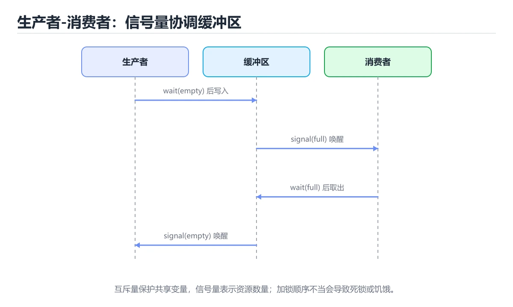
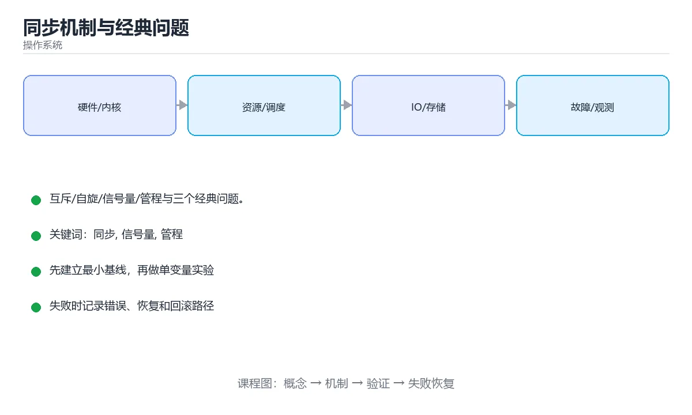

# 同步机制与经典问题

> 内容更新时间：2026-10-06 · 学习阶段：进阶 · 预计用时：35 分钟





## 本节知识框架

**课程定位**：所属分类为「操作系统」，课程主题为「同步机制与经典问题」，学习阶段为「进阶」，建议用时 35 分钟。

**本课要解决的主问题**：互斥/自旋/信号量/管程与三个经典问题。

| 学习层次 | 要回答的问题 | 完成判据 |
| --- | --- | --- |
| 概念层 | 「同步机制与经典问题」有哪些必须区分的对象与术语？ | 能用自己的话定义核心术语，并各举一个正例和一个反例。 |
| 机制层 | 这些对象按什么顺序发生作用，输入如何变成输出？ | 能画出或写出机制步骤，并说明每一步的失败条件。 |
| 应用层 | 什么场景适合使用「同步机制与经典问题」，什么场景不适合？ | 能给出一个真实场景、一个最小示例和一个边界案例。 |
| 性能层 | 时间、空间、吞吐或延迟受哪些量影响？ | 能说出复杂度或性能瓶颈的证据来源；没有证据时明确写“材料未提供”。 |
| 复习层 | 怎样确认自己不是只记住了结论？ | 能独立完成本课自测，并把错误定位到概念、机制、示例或边界。 |

### 阅读路线

1. 先读「核心概念定义」，建立「同步」等对象的精确定义。
2. 再读「原理与运行机制」，把定义串成可重复的过程。
3. 用「代码/协议/SQL 示例」验证过程，并只改一个条件观察结果变化。
4. 最后检查性能、易错点、知识关系与自测题，形成可复习的证据链。

**前置知识**：《进程间通信与 IO 模型》

**学习位置**：本课位于《进程间通信与 IO 模型》之后；如果前一课的自测不能通过，应先回补再继续。

**后续衔接**：下一课《文件系统实现与 RAID》会继续使用本课术语，学完后建议立即完成一次自测。

**教材衔接：学习目标**

- 能用自己的话解释同步机制与经典问题解决了什么问题，而不是只背术语。
- 能说清 「同步」、「信号量」、「管程」、「生产者消费者」 之间的关系，并分别举出一个例子。
- 能把 同步 放回「同步机制与经典问题」的知识体系，说明它和 信号量 的边界。
- 能完成本课练习，并用验收标准检查自己的结果。

> 一句话摘要：互斥/自旋/信号量/管程与三个经典问题。

**教材衔接：前置知识**

- 先完成上一课《进程间通信与 IO 模型》；如果已经掌握，可以直接用本课练习自测。
- 本课阶段：进阶。建议先完成「进程间通信与 IO 模型」，或确认自己能独立跑通正文里的 ValueError 示例。
- 开始前先复习：同步、信号量、管程。
- 卡在 同步 上时不要跳过：把输入、预期和实际输出写成三行，再回头读正文。

**教材衔接：本课小结**

同步的目标是**正确性优先、再谈性能**：能用无共享设计就不用锁，必须加锁时保持临界区短、顺序一致、并优先使用语言/库提供的高层原语。

## 核心概念定义

> 在阅读《同步机制与经典问题》时，术语第一次出现先给操作性定义，再给边界；正文说法与这里冲突时，以定义和可复现示例为准。

| 术语 | 操作性定义 | 本课中的边界 |
| --- | --- | --- |
| 同步 | 协调多个执行单元对共享状态的访问和先后顺序。 | 仅在「同步机制与经典问题」明确给出的输入、版本与资源条件下成立。 |
| 信号量 | 两个计数信号量：empty = N、full = 0。 | 仅在「同步机制与经典问题」明确给出的输入、版本与资源条件下成立。 |
| 管程 | 把共享数据和操作封装在一起，并由语言运行时保证互斥与条件等待的同步结构。 | 仅在「同步机制与经典问题」明确给出的输入、版本与资源条件下成立。 |
| 生产者消费者 | 生产者写入共享缓冲区、消费者读取并处理，通过条件变量或信号量协调速度差异。 | 仅在「同步机制与经典问题」明确给出的输入、版本与资源条件下成立。 |
| CAS | CAS（比较并交换）是无锁编程的基础，配合自旋可实现无锁栈/队列。 | 仅在「同步机制与经典问题」明确给出的输入、版本与资源条件下成立。 |

### 定义如何使用

在「同步机制与经典问题」中判断一个说法是否成立，先确认它使用的是哪个对象的定义，再检查输入规模、运行环境与失败路径。定义不是口号，而是后续推导、代码示例和自测题共享的约束。

**教材衔接：信号量与条件变量的实现要点**

**生产者-消费者正确写法**（有界队列，容量 N）：

1. 一个互斥锁保护队列本身；两个计数信号量：`empty = N`、`full = 0`。
2. 生产者：`P(empty)` → 加锁入队 → 解锁 → `V(full)`。
3. 消费者：`P(full)` → 加锁出队 → 解锁 → `V(empty)`。
4. **顺序不能颠倒**：若先加锁再等信号量，会在队列满时持锁阻塞，导致消费者无法取数据而死锁。

**条件变量的正确写法**：等待必须放在 while 循环里（`while (not ready) wait(cv)`），因为可能存在虚假唤醒与惊群；通知前应先修改状态并持有锁，避免丢失唤醒。相比之下，信号量自带计数，更适合表达"还有 N 个资源"，条件变量更适合表达"某条件成立"。

**优先级反转的实例**：低优先级线程持有锁 → 高优先级线程等待 → 中优先级线程抢占 CPU，结果是高优先级任务被中优先级任务间接阻塞。解决办法是优先级继承（持锁者临时继承最高优先级）或优先级天花板；火星探路者号就曾因此反复重启。

## 原理与运行机制

### 机制总览

1. **建立输入**：把「同步」按本课定义整理成可观察、可重复的输入条件。
2. **执行转换**：围绕「信号量」执行本课的核心步骤；每一步都记录中间状态，避免只看最终输出。
3. **产生输出**：得到「管程」后，用正文示例或协议/SQL 结果核对输出是否符合预期。
4. **改变一个条件**：只替换一个边界条件或环境参数，观察「同步机制与经典问题」的结论是否仍然成立。

| 阶段 | 关注对象 | 失败时应检查 |
| --- | --- | --- |
| 输入 | 同步 | 类型、范围、编码、版本或前置状态是否满足定义。 |
| 处理 | 信号量 | 顺序、可见性、锁、路由、事务或调度规则是否被破坏。 |
| 输出 | 管程 | 结果是否可复现，错误是否被正确传播而不是被吞掉。 |

本课的机制结论要用「同步机制与经典问题」自己的示例验证。「同步机制与经典问题」没有给出某个数量级、吞吐或内存数据时，本课把该判断标为“材料未提供”，不从相邻主题外推。

**教材衔接：临界区与三个条件**

多个线程访问共享资源的那段代码叫临界区。正确的互斥方案必须满足：**互斥**（同一时刻只有一个线程进入）、**进展**（无人占用时应能进入）、**有限等待**（不能无限期等待）。

**教材衔接：同步原语**

| 原语 | 特点 | 适用 |
| --- | --- | --- |
| 互斥锁 | 睡眠等待，适合临界区较长 | 通用 |
| 自旋锁 | 忙等不切换，适合临界区极短 | 内核、无睡眠场景 |
| 读写锁 | 读共享、写独占 | 读多写少 |
| 信号量 | 计数型，P/V 操作 | 限流、资源池 |
| 条件变量 | 等待某条件成立 | 生产者-消费者 |
| 管程 | 语言级封装（synchronized） | Java 等语言 |

选择要点：临界区短且不能睡眠用自旋锁；持锁期间不要做 IO 或调用外部服务；加锁顺序统一以防死锁。

**教材衔接：三个经典问题**

**生产者-消费者**：用有界缓冲区 + 两个信号量（空位数、已填数）与一把互斥锁，注意「先判断再操作」的顺序以避免死锁与丢失唤醒。

**读者-写者**：读优先可能饿死写者，写优先可能饿死读者，公平策略需要额外排队机制。

**哲学家就餐**：五个哲学家与五支筷子，朴素实现必然死锁。解法：最多允许四人同时取筷、或给筷子编号并按序取、或用服务生统一分配。

**教材衔接：无锁与原子操作**

CAS（比较并交换）是无锁编程的基础，配合自旋可实现无锁栈/队列。要注意 **ABA 问题**（值被改回原样导致误判，用版本号解决）、内存序（acquire/release/seq_cst）与伪共享（相邻变量落在同一缓存行）。

**教材衔接：无锁编程速查**

| 概念 | 说明 |
| --- | --- |
| CAS | 比较并交换，无锁更新的基础 |
| ABA 问题 | 值从 A 变 B 又回 A，CAS 误判成功；用版本号解决 |
| 内存序 | 决定读写可见性与重排约束（relaxed、acquire、release） |
| 自旋代价 | 高竞争下自旋浪费 CPU，应退化为阻塞 |
| 伪共享 | 不同线程写同一缓存行导致性能下降 |
| 公平性 | 公平锁开销更大但避免饥饿 |

建议：**能用消息传递就不用共享内存；能用现成并发容器就不手写无锁结构。**

## 典型应用场景

| 场景 | 典型输入或前提 | 期望产物 |
| --- | --- | --- |
| 学习验证 | 使用本课最小示例和 同步、信号量 | 能复现正文结论，并解释每一步。 |
| 工程落地 | 把「同步机制与经典问题」放入真实模块或服务边界 | 输出可观测、失败可定位、参数可配置。 |
| 故障排查 | 只改一个版本、规模、输入或依赖条件 | 能区分概念错误、实现错误和环境差异。 |

判断「同步机制与经典问题」的场景是否成立，标准是能否写出输入、处理、输出和失败路径；材料中没有出现的数据在本课标注为“材料未提供”，不用推测替代证据。

## 代码/协议/SQL 示例

以下代码、协议或 SQL 片段来自《同步机制与经典问题》原文，保留原有语言标记与上下文；先预测《同步机制与经典问题》示例的输出，再按正文步骤运行或推演，示例依赖外部环境时同时记录版本与输入。

**教材衔接：经典问题速查**

| 问题 | 核心矛盾 | 正确解法 |
| --- | --- | --- |
| 生产者消费者 | 缓冲区空满 | 互斥 + 两个条件变量（不为满、不为空） |
| 读者写者 | 读并发与写互斥 | 读写锁或写优先策略 |
| 哲学家就餐 | 循环等待 | 限制同时取筷人数或按序取 |
| 理发师问题 | 有限等待位 | 信号量控制顾客与理发师 |
| 屏障同步 | 阶段对齐 | 屏障或 `CyclicBarrier` |

```python
import threading
from collections import deque

class BoundedQueue:
    """有界阻塞队列：互斥 + 两个条件变量，实现背压。"""

    def __init__(self, capacity: int):
        if capacity <= 0:
            raise ValueError("容量必须为正")
        self.capacity = capacity
        self.items = deque()
        self.lock = threading.Lock()
        self.not_full = threading.Condition(self.lock)
        self.not_empty = threading.Condition(self.lock)
        self.closed = False

    def put(self, item, timeout: float | None = None) -> bool:
        with self.not_full:
            # 必须在循环中判断条件，防止虚假唤醒
            while len(self.items) >= self.capacity and not self.closed:
                if not self.not_full.wait(timeout):
                    return False
            if self.closed:
                return False
            self.items.append(item)
            self.not_empty.notify()
            return True

    def get(self, timeout: float | None = None):
        with self.not_empty:
            while not self.items and not self.closed:
                if not self.not_empty.wait(timeout):
                    return None
            if not self.items:
                return None
            item = self.items.popleft()
            self.not_full.notify()
            return item

    def close(self) -> None:
        with self.lock:
            self.closed = True
            self.not_empty.notify_all()
            self.not_full.notify_all()

    def __len__(self) -> int:
        with self.lock:
            return len(self.items)

queue = BoundedQueue(2)
queue.put("a")
queue.put("b")
print(len(queue), queue.get(), queue.get())
```

## 时间/空间复杂度或性能分析

**复杂度证据**：「同步机制与经典问题」的现有材料没有给出渐近时间或空间复杂度的明确结论，本课只做定性检查，不补写未经验证的 $O$ 记号。

| 维度 | 本课关注点 | 判断依据 |
| --- | --- | --- |
| 时间/延迟 | 「同步机制与经典问题」的主要步骤是否会随输入规模、并发度或网络往返增长。 | 以正文复杂度、基准数据或可重复测量为准。 |
| 空间/内存 | 中间状态、缓存、副本、连接或索引是否随规模增长。 | 记录峰值内存与数据副本，不只看最终结果。 |
| 吞吐/资源 | 版本、调度、锁、IO、序列化或协议开销是否成为瓶颈。 | 固定环境做对照实验，改变一个变量。 |

评估「同步机制与经典问题」时要区分“正确性成立”和“性能达标”两件事；材料没有给出基准时，本课只保留量级来源与测量方法，不写不可验证的绝对数字。

## 常见误区与易错点

> 复核《同步机制与经典问题》的易错点时，优先保留原文的错误表、故障现场与排错路径；每条修正都要能用本课示例复验。

| 易错点 | 常见表现 | 正确做法 |
| --- | --- | --- |
| 只背结论 | 能复述「同步机制与经典问题」的定义，却说不清输入、输出与边界。 | 回到机制步骤，用最小示例逐一验证。 |
| 混淆相邻概念 | 把本课对象与相邻主题的对象当成同一类。 | 先比较定义、资源归属、生命周期和失败模式。 |
| 忽略版本与环境 | 在开发机通过后直接外推到生产环境。 | 固定版本、输入和资源条件，再记录可复现结果。 |

**教材衔接：常见错误与排查**

死锁（加锁顺序不一致）、活锁（互相让路）、丢失唤醒（唤醒发生在等待之前）、优先级反转（用优先级继承解决）、双重检查锁定写错导致可见性问题。
| 容易踩的做法 | 实际现象 | 原因与正确做法 |
| --- | --- | --- |
| 条件变量用 `if` 判断 | 虚假唤醒导致越界 | 必须用 `while` 循环判断 |
| 忘记在等待前释放锁 | 死锁 | `wait` 会自动释放并在唤醒后重新获取 |
| 用信号量替代互斥锁 | 计数语义错乱 | 互斥用锁，资源计数用信号量 |
| 自旋锁中做耗时操作 | CPU 空转、系统卡顿 | 自旋锁只用于极短临界区 |
| 只用 `notify` 唤醒一个 | 其他等待者永久阻塞 | 状态变化影响多方时用 `notify_all` |
| 无锁结构不处理 ABA | 偶发数据错乱 | 加版本号或标记指针 |
| 高竞争下暴力重试 | CPU 飙高、吞吐下降 | 指数退避或改为阻塞锁 |
| 忽略伪共享 | 多线程扩展性差 | 对高频写字段做缓存行填充 |
| 长时间持有锁 | 其他线程饥饿 | 缩短临界区，锁外做耗时工作 |
| 顺序加锁不一致 | 死锁 | 统一加锁顺序 |

**教材衔接：故障现场**

### 现场 1：条件变量用 if 判断

**症状**：在《同步机制与经典问题》的复现场景中，虚假唤醒导致越界。

**根因**：当出现“条件变量用 if 判断”时，执行路径已经绕过了《同步机制与经典问题》的关键约束，最终以“虚假唤醒导致越界”暴露出来；修复前必须先确认约束在哪里失效。

**修复**：针对《同步机制与经典问题》的问题，必须用 while 循环判断。

**验证**：在《同步机制与经典问题》中按“必须用 while 循环判断”调整后，从“条件变量用 if 判断”的触发条件重放同一条路径，确认“虚假唤醒导致越界”不再出现，并补一个相邻边界用例检查没有引入新问题。

### 现场 2：用信号量替代互斥锁

**症状**：在《同步机制与经典问题》的复现场景中，计数语义错乱。

**根因**：触发点是把“用信号量替代互斥锁”当成安全做法。它没有满足《同步机制与经典问题》要求的前提，因此先表现为“计数语义错乱”；排查时先完整复现这一段，再核对输入、配置与依赖。

**修复**：针对《同步机制与经典问题》的问题，互斥用锁，资源计数用信号量。

**验证**：在《同步机制与经典问题》中按“互斥用锁，资源计数用信号量”调整后，从“用信号量替代互斥锁”的触发条件重放同一条路径，确认“计数语义错乱”不再出现，并补一个相邻边界用例检查没有引入新问题。

### 现场 3：自旋锁中做耗时操作

**症状**：在《同步机制与经典问题》的复现场景中，CPU 空转、系统卡顿。

**根因**：触发点是把“自旋锁中做耗时操作”当成安全做法。它没有满足《同步机制与经典问题》要求的前提，因此先表现为“CPU 空转、系统卡顿”；排查时先完整复现这一段，再核对输入、配置与依赖。

**修复**：针对《同步机制与经典问题》的问题，自旋锁只用于极短临界区。

**验证**：保留《同步机制与经典问题》里触发“CPU 空转、系统卡顿”的输入、版本和日志，按“自旋锁只用于极短临界区”完成修改后原样重放；只有失败现象消失且相邻场景仍可解释，才保留改动。

## 与其他知识点的关系

| 关系 | 课程 | 为什么 |
| --- | --- | --- |
| 先修 | 《进程间通信与 IO 模型》 | 本课会直接使用它的概念或操作前提。 |
| 关联 | 《文件系统实现与 RAID》 | 用于横向比较或把本课结论迁移到相邻主题。 |
| 前置顺序 | 《进程间通信与 IO 模型》 | 同分类中安排在本课之前，建议先完成其自测。 |
| 后续顺序 | 《文件系统实现与 RAID》 | 同分类中安排在本课之后，会继续使用本课术语。 |

把「同步机制与经典问题」放回知识体系时，不只要记住“前面学过什么”，还要说明两个主题在输入、机制、资源边界和失败模式上的差异。这样才能把单课知识迁移到项目、排障和后续课程。

**教材衔接：同步原语对照**

| 原语 | 语义 | 适用 | 注意 |
| --- | --- | --- | --- |
| 互斥锁 Mutex | 临界区互斥 | 保护共享状态 | 不可重入（按实现）、不可跨进程（按实现） |
| 自旋锁 Spinlock | 忙等获取 | 极短临界区、内核 | 持锁期间不能睡眠 |
| 读写锁 RWLock | 多读或单写 | 读多写少 | 写者可能饥饿 |
| 信号量 Semaphore | 计数许可 | 限流、资源池 | 计数语义易误用 |
| 条件变量 | 等待条件成立 | 生产者消费者 | 必须配合互斥锁并循环判断 |
| 屏障 Barrier | 等待全部到达 | 并行阶段同步 | 参与者数量必须匹配 |
| 原子操作 | 无锁更新 | 计数、标志位 | 只适用于简单操作 |

## 自测题与参考答案

> 先独立完成《同步机制与经典问题》的自测，再核对答案与解析。答案必须能在本课正文或示例中找到依据，不能只凭语感。

### 自测 1

自旋锁适合什么场景？

A. 用户态大循环
B. 长时间持锁
C. 需要做网络请求的临界区
D. 临界区很短的场景

**参考答案**：临界区很短的场景

**解析**：在「同步机制与经典问题」里，临界区很短的场景。自旋忙等不切换线程，临界区短时开销小于上下文切换。在「同步机制与经典问题」里判断这道题，要把同步、信号量、管程的条件、过程与失败路径逐项对齐，换成“自旋锁适合什么场景”这个场景，只有满足前提的结论才成立。回到「同步机制与经典问题」的正文示例，用“自旋锁适合什么场景”走一遍同步、信号量、管程的完整流程，能复现的结论才可以保留。

### 自测 2

围绕“同步机制与经典问题”中的 同步、信号量、管程，下列哪两项是本课强调的实践判断？

A. 把 信号量 的单次运行结果当成所有版本和规模都成立
B. 学习 同步 时要同时说明输入、输出和失败路径，不能只看正常流程
C. 只要 同步 的常规示例通过，就可以跳过边界与异常路径
D. 验证 信号量 时要固定版本并覆盖边界输入，结论才可复现

**参考答案**：学习 同步 时要同时说明输入、输出和失败路径，不能只看正常流程；验证 信号量 时要固定版本并覆盖边界输入，结论才可复现

**解析**：本课把同步机制与经典问题拆成概念、示例与故障现场三部分，因此判断 同步 时必须同时交代输入、输出和失败路径，这使“学习 同步 时要同时说明输入、输出和失败路径，不能只看正常流程”成立。在同步机制与经典问题里，判断 信号量 时要固定版本与边界输入，所以“验证 信号量 时要固定版本并覆盖边界输入，结论才可复现”才可复现。

### 自测 3

阅读有界阻塞队列的写入逻辑，下面哪项判断是正确的？

```python
class BoundedQueue:
    def put(self, item):
        with self.not_full:
            while len(self.items) == self.capacity:
                self.not_full.wait()      # 用 while 重查条件，防止虚假唤醒
            self.items.append(item)
            self.not_empty.notify()
```

A. 等待时要用 while 重新检查条件，否则被唤醒后可能再次越界
B. 把 wait 放进 if 分支更高效，可以少一次条件判断
C. notify 会释放锁并让等待线程立刻持锁继续执行
D. 两个条件变量共用一个锁会导致死锁，必须再加一把锁

**参考答案**：等待时要用 while 重新检查条件，否则被唤醒后可能再次越界

**解析**：正确判断是等待时要用 while 重新检查条件，否则被唤醒后可能再次越界。条件变量允许虚假唤醒，被唤醒的线程也不保证立刻拿到锁，所以唤醒后必须重新检查队列是否已满；只用 if 检查一次，恢复执行时容量可能又被别的线程占满，写入就会越界。notify 只是把等待者移入就绪队列并释放锁，被唤醒线程仍要重新竞争锁；读与写各用一个条件变量能减少无谓唤醒，这是生产者消费者问题的常见写法。

**教材衔接：复习与自测**

- [ ] 能按场景选择互斥锁、读写锁、信号量或条件变量。
- [ ] 条件变量一律用 `while` 判断并配合同一个锁。
- [ ] 知道自旋锁的适用边界。
- [ ] 了解 CAS、ABA 与内存序的基本含义。
- [ ] 共享状态的并发访问都有明确同步策略。

**教材衔接：动手练习**

> 本课练习重点：围绕「同步、信号量、管程」完成复述、实验和交付，每个结果都要能被别人检查。

先定义 信号量 的状态集合，再模拟一次切换。

### 练习 1：建立心智模型（10 分钟）

合上教程，用 3～5 句话回答：

1. 同步机制与经典问题解决了什么问题？
2. 如果没有它，会出现什么具体后果？
3. 它和「信号量」是什么关系？

验收标准：用自己的话解释 同步，并给出一个它不成立的反例。

### 练习 2：做一次可控实验（20 分钟）

从正文中选一个最小示例，完成以下操作：

1. 先预测修改一个参数、输入或步骤后的结果。
2. 再实际执行或逐步推演，记录真实结果。
3. 如果结果与预测不同，写出差异原因。

**验收标准**：用 ValueError 复现原例后，把信号量改成边界值，五步记录缺一不可，其中「原因」一栏要写明「同步机制与经典问题」里哪条规则被触发。

### 练习 3：交付一个小结果（30 分钟）

写一个小脚本模拟 ValueError 的竞争过程，打印每一步的状态。

任务要求：

- 结果必须能被别人检查，不能只写“我已经理解了”。
- 至少覆盖「同步」和「信号量」两个关键词。
- 写出 1 个仍然不确定的问题，以及下一步如何验证。

> 提示：时间有限时优先做练习 1 和练习 2；练习 3 可以拆成两次完成。

**教材衔接：可运行练习**

### 任务 1：先跑通，再解释

```python
import threading
from collections import deque

class BoundedQueue:
    """有界阻塞队列：互斥 + 两个条件变量，实现背压。"""

    def __init__(self, capacity: int):
        if capacity <= 0:
            raise ValueError("容量必须为正")
        self.capacity = capacity
        self.items = deque()
        self.lock = threading.Lock()
        self.not_full = threading.Condition(self.lock)
        self.not_empty = threading.Condition(self.lock)
        self.closed = False

    def put(self, item, timeout: float | None = None) -> bool:
        with self.not_full:
            # 必须在循环中判断条件，防止虚假唤醒
            while len(self.items) >= self.capacity and not self.closed:
                if not self.not_full.wait(timeout):
                    return False
            if self.closed:
                return False
            self.items.append(item)
            self.not_empty.notify()
            return True

    def get(self, timeout: float | None = None):
        with self.not_empty:
            while not self.items and not self.closed:
                if not self.not_empty.wait(timeout):
                    return None
            if not self.items:
                return None
            item = self.items.popleft()
            self.not_full.notify()
            return item

    def close(self) -> None:
        with self.lock:
            self.closed = True
            self.not_empty.notify_all()
            self.not_full.notify_all()

    def __len__(self) -> int:
        with self.lock:
            return len(self.items)

queue = BoundedQueue(2)
queue.put("a")
queue.put("b")
print(len(queue), queue.get(), queue.get())
```

### 任务 2：只改一个条件

把「同步机制与经典问题」的最小示例复制一份，只改一个条件再跑一次：

- 改动点：把 信号量 换成边界值，其他输入保持原样。
- 预测：先写下「同步机制与经典问题」在改动后的输出或错误信息，再运行。
- 记录：对照改动前后的结果，指出差异出在哪一步。
- 验收：换回原条件能复现原结果，改动只影响同步。

### 任务 3：迁移到自己的数据

用同一套思路处理一组你自己的 同步 数据，保持输出格式与任务 1 一致。

**教材衔接：本课复习清单**

离开本课前，逐项确认：

- [ ] 不看解析，能说出「自旋锁适合什么场景？」的判断依据。
- [ ] 不看解析，能说出「哲学家就餐问题的朴素实现必然出现？」的判断依据。
- [ ] 不看解析，能说出「CAS 的 ABA 问题通常如何解决？」的判断依据。
- [ ] 不看解析，能说出「读写锁相比互斥锁的优势是？」的判断依据。
- [ ] 不看解析，能说出「条件变量为什么必须放在 while 中判断条件？」的判断依据。
- [ ] 跑通「同步机制与经典问题」的最小示例，并记录一次失败输入的处理方式。
- [ ] 把本课最容易混淆的两个概念写成一句话对照。

| 复盘项 | 记录 |
| --- | --- |
| 已经能独立解释的考点 |  |
| 仍然说不清的概念 |  |
| 下一步验证动作 |  |

---

## 术语速查

把「同步机制与经典问题」里反复出现的术语集中放在一起。复习时先遮住右列，尝试用自己的话解释，再回到正文核对。

| 术语 | 一句话说明 |
| --- | --- |
| `同步` | 协调多个执行单元对共享状态的访问和先后顺序。 |
| `信号量` | 两个计数信号量：empty = N、full = 0。 |
| `管程` | 把共享数据和操作封装在一起，并由语言运行时保证互斥与条件等待的同步结构。 |
| `生产者消费者` | 生产者写入共享缓冲区、消费者读取并处理，通过条件变量或信号量协调速度差异。 |
| `CAS` | CAS（比较并交换）是无锁编程的基础，配合自旋可实现无锁栈/队列。 |

## 考点精讲

### 考点 1：概念判断·同步

- **题目**：自旋锁适合什么场景？
- **判断依据**：在「同步机制与经典问题」里，临界区很短的场景。自旋忙等不切换线程，临界区短时开销小于上下文切换。在「同步机制与经典问题」里判断这道题，要把同步、信号量、管程的条件、过程与失败路径逐项对齐，换成“自旋锁适合什么场景”这个场景，只有满足前提的结论才成立。回到「同步机制与经典问题」的正文示例，用“自旋锁适合什么场景”走一遍同步、信号量、管程的完整流程，能复现的结论才可以保留。

### 考点 2：多选辨析·同步

- **题目**：围绕“同步机制与经典问题”中的 同步、信号量、管程，下列哪两项是本课强调的实践判断？
- **判断依据**：本课把同步机制与经典问题拆成概念、示例与故障现场三部分，因此判断 同步 时必须同时交代输入、输出和失败路径，这使“学习 同步 时要同时说明输入、输出和失败路径，不能只看正常流程”成立。在同步机制与经典问题里，判断 信号量 时要固定版本与边界输入，所以“验证 信号量 时要固定版本并覆盖边界输入，结论才可复现”才可复现。

### 考点 3：概念判断·同步

- **题目**：CAS 的 ABA 问题通常如何解决？
- **判断依据**：版本号让「改回原值」也能被识别为变化过。在「同步机制与经典问题」里，其他选项：增大内存、改用自旋、加互斥锁都无法区分「值相同但已被修改过」的情况，只有附带版本号或标记才能识别中间变化。把“附带版本号或标记”代回「同步机制与经典问题」里“CAS 的 ABA 问题通常如何解决”的例子核对，条件一旦改变，结论就要用同步、信号量、管程重新推导。

### 考点 4：代码阅读·条件变量

- **题目**：阅读有界阻塞队列的写入逻辑，下面哪项判断是正确的？
- **正确判断**：等待时要用 while 重新检查条件，否则被唤醒后可能再次越界
- **判断依据**：正确判断是等待时要用 while 重新检查条件，否则被唤醒后可能再次越界。条件变量允许虚假唤醒，被唤醒的线程也不保证立刻拿到锁，所以唤醒后必须重新检查队列是否已满；只用 if 检查一次，恢复执行时容量可能又被别的线程占满，写入就会越界。notify 只是把等待者移入就绪队列并释放锁，被唤醒线程仍要重新竞争锁；读与写各用一个条件变量能减少无谓唤醒，这是生产者消费者问题的常见写法。

### 考点 5：概念判断·同步

- **题目**：条件变量为什么必须放在 while 中判断条件？
- **判断依据**：在「同步机制与经典问题」里，防止虚假唤醒与竞争导致的丢失唤醒，醒来后需重新检查条件。condition) cv.wait(lock)。这道题的关键在「同步机制与经典问题」的同步、信号量、管程：先确认题干“条件变量为什么必须放在 while”问的是哪一步，再排除偷换前提的选项。把“防止虚假唤醒与竞争导致的丢失唤醒”代回「同步机制与经典问题」里“条件变量为什么必须放在 while 中判断条件”的例子核对，条件一旦改变，结论就要用同步、信号量、管程重新推导。

### 考点 6：填空·同步

- **题目**：补全代码：「同步机制与经典问题」示例中，下面这行代码缺少哪个关键字或函数名？请填入 ____。 `self.not_full = threading.____(self.lock)`
- **判断依据**：这道题的关键在「同步机制与经典问题」的同步、信号量、管程：先确认题干“补全代码”问的是哪一步，再排除偷换前提的选项。把“Condition”代回「同步机制与经典问题」里“同步机制与经典问题示例中”的例子核对，条件一旦改变，结论就要用同步、信号量、管程重新推导。“Condition”是否可用，取决于同步、信号量、管程在题干条件下的表现，不能直接套用相邻结论。

## English Overview

**Title:** Synchronization

**Summary:** Locks, semaphores, monitors and classic problems.

**Category:** Operating Systems
**Level:** 进阶
**Key terms:** 同步, 信号量, 管程, 生产者消费者, CAS

## 内容元数据

- 内容版本：v2.0
- 最后更新：2026-10-06
- 学习阶段：进阶
- 适用环境：Linux 6.x / POSIX；本课聚焦 同步。
- 内容来源：内置结构化课程与工程实践整理
- 相关主题：同步、信号量、管程、生产者消费者、CAS
- 质量版本：P0 测验标准 + P1 覆盖扩展 + P2 体验补全

## 参考资料与复核

- 最后复核：2026-10-04
- 下次复核：2027-07-24
- 复核范围：版本兼容、API 行为、安全建议与工程实践
- 来源性质：官方文档、标准或权威教材；正文为离线教学重组

| 参考资料 | 本课用途 |
| --- | --- |
| [Linux man-pages](https://man7.org/linux/man-pages/) | 系统调用与用户态接口 |
| [LWN 内核文章](https://lwn.net/Kernel/Index/) | 内核机制与演进 |
| [OSTEP](https://pages.cs.wisc.edu/~remzi/OSTEP/) | 操作系统导论教材 |

> 「同步机制与经典问题」的链接用于离线阅读后的延伸核对；App 不会自动联网。
