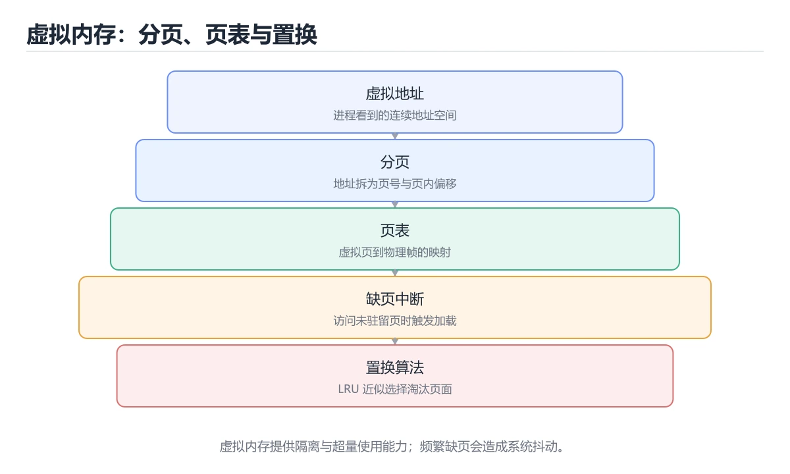
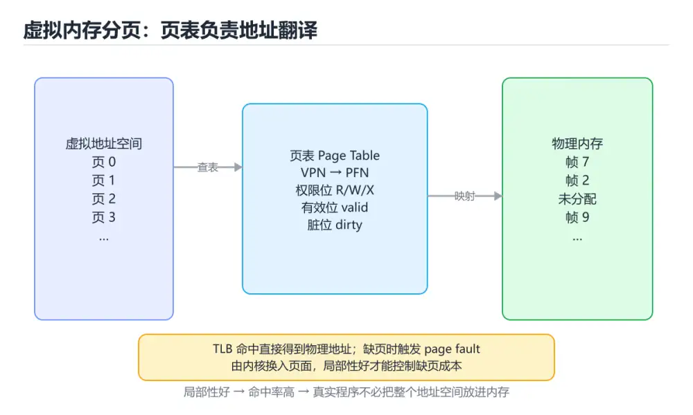
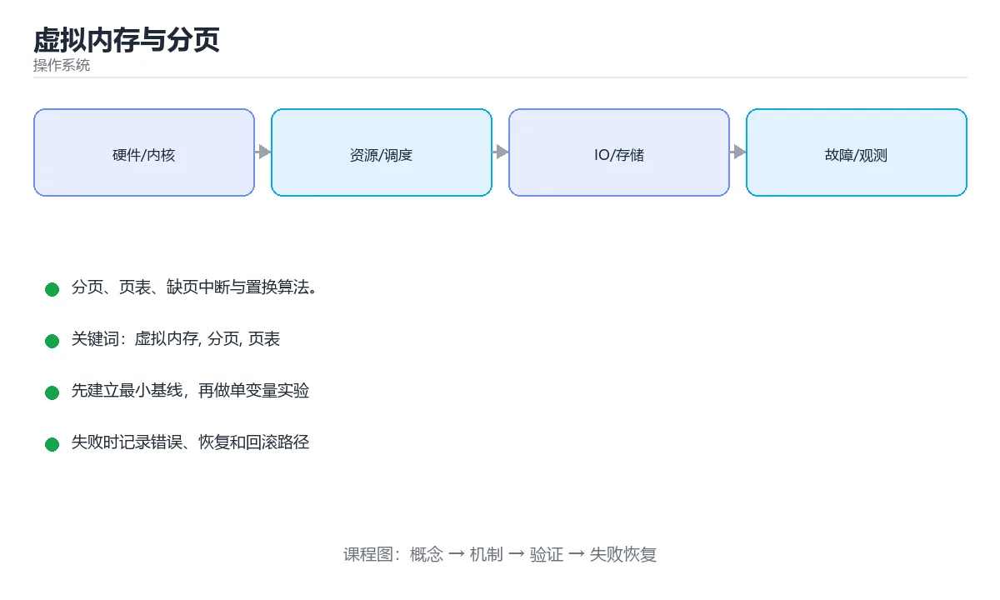

# 虚拟内存与分页







> 内容更新时间：2026-10-06 · 学习阶段：进阶 · 预计用时：30 分钟

## 学习目标

- 能用自己的话解释虚拟内存与分页解决了什么问题，而不是只背术语。
- 能说清 「虚拟内存」、「分页」、「页表」、「TLB」 之间的关系，并分别举出一个例子。
- 能把 虚拟内存 放回「虚拟内存与分页」的知识体系，说明它和 分页 的边界。
- 能完成本课练习，并用验收标准检查自己的结果。

> 一句话摘要：分页、页表、缺页中断与置换算法。

## 前置知识

- 先完成上一课《死锁》；如果已经掌握，可以直接用本课练习自测。
- 开始前先复习：虚拟内存、分页、页表。
- 卡在 虚拟内存 上时不要跳过：把输入、预期和实际输出写成三行，再回头读正文。

## 为什么需要虚拟内存

每个进程都以为自己独占一整块连续内存，实际由操作系统映射到物理内存。这带来三个好处：

1. **隔离**：进程之间无法随意读写对方内存。
2. **简化编程**：不必关心物理地址与碎片。
3. **可超额分配**：内存不够时把不常用的页换出到磁盘。

## 分页机制

虚拟内存被切成固定大小的**页**（常见 4KB），物理内存切成同样大小的**页框**，通过**页表**建立映射。

```text
虚拟地址 = 页号 + 页内偏移
页号 --[页表]--> 页框号
物理地址 = 页框号 + 页内偏移
```

页表项中还有有效位、修改位（脏页）、访问位与权限位；多级页表用于节省空间。

## 缺页中断与置换算法

访问的页不在内存时触发**缺页中断**，操作系统从磁盘换入，必要时先换出某页：

| 算法 | 思想 | 问题 |
| --- | --- | --- |
| FIFO | 换出最早进入的页 | 可能出现 Belady 异常 |
| LRU | 换出最久未使用的页 | 实现成本高 |
| Clock | 用访问位近似 LRU | 实际系统常用 |
| OPT | 换出未来最久不用的页 | 理论最优，无法实现 |

## TLB 与性能

每次访存都要查页表太慢，CPU 用 **TLB**（快表）缓存最近的映射。TLB 命中则直接得到物理地址。

```text
虚拟地址 -> TLB 命中 ─────────> 物理地址
              └ 未命中 -> 查页表 -> 更新 TLB
```

TLB 命中率对性能影响很大，这也是「内存访问模式要连续」的原因之一。

## 常见现象

- **内存抖动（thrashing）**：频繁换页，CPU 都在等磁盘。
- **OOM Killer**：Linux 在内存严重不足时杀掉占用最大的进程。
- **mmap**：把文件映射到内存，读写文件像访问数组。

```bash
free -h            # 查看内存与交换分区
vmstat 1           # 观察 si/so（换入换出）
cat /proc/<pid>/status | grep VmRSS
```

## 缺页处理的完整流程

访问虚拟地址 → 查 TLB → 未命中则查页表 → 有效位为 0 触发缺页中断 → 操作系统在物理内存中找空闲页框（没有则按置换算法换出一页）→ 若被换出的页是脏页先写回磁盘 → 从磁盘读入所需页 → 更新页表与 TLB → 重新执行触发缺页的指令。

关键点：**缺页处理对进程是透明的**，指令会重新执行；页表项中的「脏位」决定换出时是否需要写磁盘，这直接影响性能。

## 置换算法对比

| 算法 | 淘汰谁 | 优点 | 缺点 |
| --- | --- | --- | --- |
| OPT | 未来最久不用的页 | 理论最优 | 无法实现，只作基准 |
| LRU | 最久未使用的页 | 效果好 | 精确实现成本高 |
| Clock | 环形扫描访问位，第二次机会 | 近似 LRU 且开销低 | 效果略差 |
| FIFO | 最早进入的页 | 实现最简单 | 可能淘汰热点页，存在 Belady 异常 |

工作集模型（working set）：统计一段时间内被访问的页集合，若分配给进程的页框少于工作集，就会持续缺页（抖动 thrashing）。**扩容内存或降低并发度**是唯一有效的解法，加 CPU 无济于事。

## 观察指标与命令

| 指标 | 含义 | 命令 |
| --- | --- | --- |
| si / so | 换入换出速率 | vmstat 1 |
| pgmajfault | 主缺页（需读磁盘）次数 | /proc/<pid>/stat |
| 缺页率 | 缺页次数 / 访问次数 | perf stat -e page-faults |
| Swap 使用量 | 交换分区占用 | free -h |

经验判断：si/so 持续非零或 pgmajfault 持续增长，说明内存压力已经影响到性能。

## 本课小结

虚拟内存 = **分页 + 页表 + 缺页处理**；理解它才能解释内存占用、换页与地址空间隔离。

## 分页与地址转换速查

| 概念 | 说明 |
| --- | --- |
| 虚拟地址 | 程序看到的地址空间 |
| 物理地址 | 实际内存地址 |
| 页 / 页框 | 固定大小的块，常见 4 KB，大页 2 MB / 1 GB |
| 页表 | 虚拟页到物理页框的映射 |
| 多级页表 | 分级查找，节省空间 |
| TLB | 页表缓存，命中可省去多次访存 |
| 缺页 | 访问的页不在内存，触发异常 |
| 换页 | 把页在内存与磁盘间移动 |
| 写时复制 | 写入时才复制共享页 |
| 交换区 | 承载被换出的匿名页 |

## 页面置换算法对照

| 算法 | 依据 | 优点 | 缺点 |
| --- | --- | --- | --- |
| OPT | 未来最久不使用 | 理论最优 | 无法实现 |
| FIFO | 最早进入 | 简单 | 可能出现 Belady 异常 |
| LRU | 最久未使用 | 效果好 | 实现成本高 |
| Clock | 环形指针 + 访问位 | 近似 LRU、开销低 | 精度略低 |
| LFU | 使用频率最低 | 保护热点 | 旧热点难以淘汰 |

```python
from collections import OrderedDict

def lru_faults(pages: list, frames: int) -> int:
    """LRU 缺页次数统计。"""
    cache, faults = OrderedDict(), 0
    for page in pages:
        if page in cache:
            cache.move_to_end(page)
            continue
        faults += 1
        if len(cache) >= frames:
            cache.popitem(last=False)
        cache[page] = True
    return faults

def clock_faults(pages: list, frames: int) -> int:
    """Clock（二次机会）算法的缺页次数。"""
    slots, reference, pointer, faults = [None] * frames, [0] * frames, 0, 0
    for page in pages:
        if page in slots:
            reference[slots.index(page)] = 1
            continue
        faults += 1
        while True:
            if slots[pointer] is None or reference[pointer] == 0:
                slots[pointer] = page
                reference[pointer] = 1
                pointer = (pointer + 1) % frames
                break
            reference[pointer] = 0
            pointer = (pointer + 1) % frames
    return faults

def working_set_pages(accesses: list, window: int) -> set:
    """工作集：最近 window 次访问涉及的页集合。"""
    return set(accesses[-window:])

pages = [7, 0, 1, 2, 0, 3, 0, 4, 2, 3]
print(lru_faults(pages, 3), clock_faults(pages, 3))
print(working_set_pages(pages, 4))
```

## 性能与排查速查

| 指标 | 含义 | 命令 |
| --- | --- | --- |
| 缺页次数 | 页不在内存的次数 | `ps -o min_flt,maj_flt`、`/proc/<pid>/stat` |
| 主缺页 | 需从磁盘读入 | 关注是否持续增长 |
| 换入换出 | si/so | `vmstat 1` |
| 常驻内存 | RSS | `ps -o rss` |
| 虚拟内存 | VSZ | 包含未驻留部分 |
| TLB 命中 | 地址转换效率 | `perf stat -e dTLB-load-misses` |
| 交换使用 | 是否在换页 | `free -h` 看 swap |

抖动（thrashing）的典型信号：CPU 利用率不高但 si/so 持续非零、缺页率高、系统响应极慢。对策是减少并发进程数或增加内存，而不是继续加压。

## 常见错误与排查

| 容易踩的做法 | 实际现象 | 原因与正确做法 |
| --- | --- | --- |
| 把 VSZ 当实际内存占用 | 误判内存泄漏 | 看 RSS 与 PSS |
| 认为虚拟内存就是磁盘交换 | 概念混淆 | 虚拟内存是地址空间抽象 |
| 只看 swap 使用率 | 漏掉换页频率 | 结合 `vmstat` 的 si/so |
| 抖动时继续加并发 | 性能进一步恶化 | 减少并发或加内存 |
| 忽略大页配置 | TLB 未命中高 | 大内存与数据库场景考虑 HugePages |
| 认为 LRU 一定最优 | 顺序扫描会污染缓存 | 结合访问模式选择算法 |
| 不看缺页类型 | 优化方向错误 | 区分次缺页（小开销）与主缺页 |
| 忽略写时复制的内存开销 | fork 后内存暴涨 | 关注 COW 后实际写入量 |
| 用 `free` 的 `buff/cache` 判断泄漏 | 误判 | 缓存可回收，看 available |
| 把 OOM 只归因于内存泄漏 | 忽略配置限制 | 检查 cgroup/limit 与请求量 |

## 复习与自测

- [ ] 能描述虚拟地址到物理地址的转换与 TLB 作用。
- [ ] 能对比 LRU、Clock、FIFO 的取舍。
- [ ] 会用 `vmstat`、`ps`、`perf` 观察缺页与换页。
- [ ] 知道抖动的信号与正确处理方式。
- [ ] 区分 RSS 与 VSZ，不误判内存占用。

## 动手练习

> 本课练习重点：围绕「虚拟内存、分页、页表」完成复述、实验和交付，每个结果都要能被别人检查。

为 clock_faults 画一张状态图，标出竞争与阻塞发生的时刻。

### 练习 1：建立心智模型（10 分钟）

合上教程，用 3～5 句话回答：

1. 虚拟内存与分页解决了什么问题？
2. 如果没有它，会出现什么具体后果？
3. 它和「分页」是什么关系？

验收标准：用自己的话解释 虚拟内存，并给出一个它不成立的反例。

### 练习 2：做一次可控实验（20 分钟）

从正文中选一个最小示例，完成以下操作：

1. 先预测修改一个参数、输入或步骤后的结果。
2. 再实际执行或逐步推演，记录真实结果。
3. 如果结果与预测不同，写出差异原因。

**验收标准**：用 clock_faults 复现原例后，把分页改成边界值，五步记录缺一不可，其中「原因」一栏要写明「虚拟内存与分页」里哪条规则被触发。

### 练习 3：交付一个小结果（30 分钟）

写一个小脚本模拟 clock_faults 的竞争过程，打印每一步的状态。

任务要求：

- 结果必须能被别人检查，不能只写“我已经理解了”。
- 至少覆盖「虚拟内存」和「分页」两个关键词。
- 写出 1 个仍然不确定的问题，以及下一步如何验证。

> 提示：时间有限时优先做练习 1 和练习 2；练习 3 可以拆成两次完成。

## 可运行练习

### 任务 1：先跑通，再解释

```python
from collections import OrderedDict

def lru_faults(pages: list, frames: int) -> int:
    """LRU 缺页次数统计。"""
    cache, faults = OrderedDict(), 0
    for page in pages:
        if page in cache:
            cache.move_to_end(page)
            continue
        faults += 1
        if len(cache) >= frames:
            cache.popitem(last=False)
        cache[page] = True
    return faults

def clock_faults(pages: list, frames: int) -> int:
    """Clock（二次机会）算法的缺页次数。"""
    slots, reference, pointer, faults = [None] * frames, [0] * frames, 0, 0
    for page in pages:
        if page in slots:
            reference[slots.index(page)] = 1
            continue
        faults += 1
        while True:
            if slots[pointer] is None or reference[pointer] == 0:
                slots[pointer] = page
                reference[pointer] = 1
                pointer = (pointer + 1) % frames
                break
            reference[pointer] = 0
            pointer = (pointer + 1) % frames
    return faults

def working_set_pages(accesses: list, window: int) -> set:
    """工作集：最近 window 次访问涉及的页集合。"""
    return set(accesses[-window:])

pages = [7, 0, 1, 2, 0, 3, 0, 4, 2, 3]
print(lru_faults(pages, 3), clock_faults(pages, 3))
print(working_set_pages(pages, 4))
```

### 任务 2：只改一个条件

把「虚拟内存与分页」的最小示例复制一份，只改一个条件再跑一次：

- 改动点：把 分页 换成边界值，其他输入保持原样。
- 预测：先写下「虚拟内存与分页」在改动后的输出或错误信息，再运行。
- 记录：对照改动前后的结果，指出差异出在哪一步。
- 验收：换回原条件能复现原结果，改动只影响虚拟内存。

### 任务 3：迁移到自己的数据

把 clock_faults 换成你自己的输入，先保持步骤不变，再比较输出差异。

## 故障现场

### 现场 1：把 VSZ 当实际内存占用

**症状**：在《虚拟内存与分页》的复现场景中，误判内存泄漏。

**根因**：当出现“把 VSZ 当实际内存占用”时，执行路径已经绕过了《虚拟内存与分页》的关键约束，最终以“误判内存泄漏”暴露出来；修复前必须先确认约束在哪里失效。

**修复**：针对《虚拟内存与分页》的问题，看 RSS 与 PSS。

**验证**：在《虚拟内存与分页》中按“看 RSS 与 PSS”调整后，从“把 VSZ 当实际内存占用”的触发条件重放同一条路径，确认“误判内存泄漏”不再出现，并补一个相邻边界用例检查没有引入新问题。

### 现场 2：只看 swap 使用率

**症状**：在《虚拟内存与分页》的复现场景中，漏掉换页频率。

**根因**：当出现“只看 swap 使用率”时，执行路径已经绕过了《虚拟内存与分页》的关键约束，最终以“漏掉换页频率”暴露出来；修复前必须先确认约束在哪里失效。

**修复**：针对《虚拟内存与分页》的问题，结合 vmstat 的 si/so。

**验证**：在《虚拟内存与分页》中按“结合 vmstat 的 si/so”调整后，从“只看 swap 使用率”的触发条件重放同一条路径，确认“漏掉换页频率”不再出现，并补一个相邻边界用例检查没有引入新问题。

### 现场 3：抖动时继续加并发

**症状**：在《虚拟内存与分页》的复现场景中，性能进一步恶化。

**根因**：“性能进一步恶化”只是表层结果。向上追溯会落到“抖动时继续加并发”这一步，因为它省略了《虚拟内存与分页》的约束，使实现行为和预期模型发生了偏离。

**修复**：针对《虚拟内存与分页》的问题，减少并发或加内存。

**验证**：保留《虚拟内存与分页》里触发“性能进一步恶化”的输入、版本和日志，按“减少并发或加内存”完成修改后原样重放；只有失败现象消失且相邻场景仍可解释，才保留改动。

## 本课复习清单

离开本课前，逐项确认：

- [ ] 不看解析，能说出「虚拟地址到物理地址的转换由谁完成？」的判断依据。
- [ ] 不看解析，能说出「缺页中断在什么时候触发？」的判断依据。
- [ ] 不看解析，能说出「LRU 置换算法的思想是？」的判断依据。
- [ ] 不看解析，能说出「「工作集」在虚拟内存中的作用是？」的判断依据。
- [ ] 不看解析，能说出「写时复制（Copy-on-Write）的好处是？」的判断依据。
- [ ] 用 虚拟内存 构造一个正常输入和一个边界输入，分别记录输出与判断依据。
- [ ] 把本课最容易混淆的两个概念写成一句话对照。

| 复盘项 | 记录 |
| --- | --- |
| 已经能独立解释的考点 |  |
| 仍然说不清的概念 |  |
| 下一步验证动作 |  |

## 术语速查

| 术语 | 一句话说明 |
| --- | --- |
| `虚拟内存` | 虚拟内存 = 分页 + 页表 + 缺页处理。 |
| `页表` | 记录虚拟页到物理页框映射的结构；多级页表用分层目录压缩空间，进程切换时换一整套页表。 |
| `缺页中断` | 访问的页面不在物理内存时由硬件触发、内核处理的异常：换入目标页并更新页表，必要时先淘汰一页。 |
| `TLB` | 页表项的高速缓存；命中时地址转换不必访问内存中的页表，未命中再回退到多级页表。 |

## 考点精讲

### 考点 1：概念判断·虚拟内存

- **题目**：虚拟地址到物理地址的转换由谁完成？
- **判断依据**：MMU 借助页表完成地址翻译，操作系统负责维护页表。作答时，先用虚拟内存建立输入与输出的基线，再把MMU 与页表代入边界条件核对，结论才能复现。回到「虚拟内存与分页」的正文示例，用“虚拟地址到物理地址的转换由谁完成”走一遍虚拟内存、分页、页表的完整流程，能复现的结论才可以保留。

### 考点 2：概念判断·虚拟内存

- **题目**：缺页中断在什么时候触发？
- **判断依据**：访问的页不在物理内存时触发缺页中断，由操作系统换入。在「虚拟内存与分页」里，作答时，先用虚拟内存建立输入与输出的基线，再把访问的页不在内存中代入边界条件核对，结论才能复现。在「虚拟内存与分页」里判断这道题，要把虚拟内存、分页、页表的条件、过程与失败路径逐项对齐，换成“缺页中断在什么时候触发”这个场景，只有满足前提的结论才成立。

### 考点 3：多选辨析·虚拟内存

- **题目**：围绕“虚拟内存与分页”中的 虚拟内存、分页、页表，下列哪两项是本课强调的实践判断？
- **判断依据**：本课把虚拟内存与分页拆成概念、示例与故障现场三部分，因此判断 虚拟内存 时必须同时交代输入、输出和失败路径，这使“学习 虚拟内存 时要同时说明输入、输出和失败路径，不能只看正常流程”成立。在虚拟内存与分页里，判断 分页 时要固定版本与边界输入，所以“验证 分页 时要固定版本并覆盖边界输入，结论才可复现”才可复现。

### 考点 4：代码补全·虚拟内存

- **题目**：阅读「虚拟内存与分页」正文里的这段代码，下面哪一项判断是正确的？
- **判断依据**：在「虚拟内存与分页」里，题干的正确项是这段代码只做静态声明，没有循环、分支或可观察输出，在「虚拟内存与分页」里它只能证明虚拟内存相关约束存在，不能替代真实运行证据。把输入或边界换成空值、极值或失败情况后，结论要以「虚拟内存与分页」的实际运行结果为准。「虚拟内存与分页」要求先交代虚拟内存、分页、页表的前提再下结论，所以“这段代码只做静态声明，没有循环”只在题干“阅读虚拟内存与分页正文里的这段代码”给定的条件下成立。

### 考点 5：概念判断·虚拟内存

- **题目**：写时复制（Copy-on-Write）的好处是？
- **判断依据**：在「虚拟内存与分页」里，fork 后父子进程共享页面。COW 也是 Redis 后台保存与容器快照等机制的重要基础。回到「虚拟内存与分页」的正文示例，用“写时复制（Copy-on-Write”走一遍虚拟内存、分页、页表的完整流程，能复现的结论才可以保留。

### 考点 6：填空·虚拟内存

- **题目**：补全代码：「虚拟内存与分页」示例中，下面这行代码缺少哪个关键字或函数名？请填入 ____。 `____.popitem(last=False)`
- **判断依据**：在「虚拟内存与分页」里判断这道题，要把虚拟内存、分页、页表的条件、过程与失败路径逐项对齐，换成“补全代码”这个场景，只有满足前提的结论才成立。“虚拟内存与分页示例中”与「虚拟内存与分页」的术语表相呼应，只有符合虚拟内存、分页、页表约束的“cache”才是正文支持的结论。“cache”与术语表相呼应，只有符合虚拟内存、分页、页表约束的“cache”才是正文支持的结论。

## English Overview

**Title:** Virtual Memory

**Summary:** Paging, page tables, faults and replacement.

**Category:** Operating Systems
**Level:** 高级
**Key terms:** 虚拟内存, 分页, 页表, TLB, 缺页中断

## 内容元数据

- 内容版本：v2.0
- 最后更新：2026-10-06
- 学习阶段：进阶
- 适用环境：Linux 6.x / POSIX
；本课聚焦 虚拟内存。
- 内容来源：内置结构化课程与工程实践整理
- 相关主题：虚拟内存、分页、页表、TLB、缺页中断
- 质量版本：P0 测验标准 + P1 覆盖扩展 + P2 体验补全

## 参考资料与复核

- 最后复核：2026-10-04
- 下次复核：2027-07-24
- 复核范围：版本兼容、API 行为、安全建议与工程实践
- 来源性质：官方文档、标准或权威教材；正文为离线教学重组

| 参考资料 | 本课用途 |
| --- | --- |
| [MIT xv6](https://pdos.csail.mit.edu/6.828/2023/xv6.html) | 教学内核与系统调用 |
| [Linux 内核文档](https://docs.kernel.org/) | 调度、内存、文件系统与 I/O |
| [Linux man-pages](https://man7.org/linux/man-pages/) | 系统调用与用户态接口 |

> 「虚拟内存与分页」的链接用于离线阅读后的延伸核对；App 不会自动联网。
