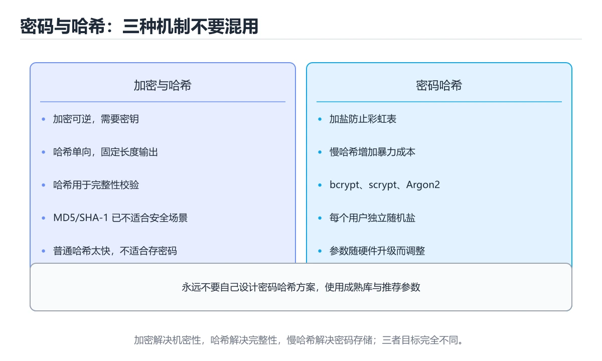

# 密码与哈希入门

> 内容更新时间：2026-10-06 · 学习阶段：基础 · 预计用时：40 分钟




## 本节知识框架

**课程定位**：所属分类 `security`（安全与合规），课程主题 `密码与哈希入门`，学习阶段 基础，建议用时 45 分钟。

本课主线：区分加密、哈希、加盐和慢哈希。

**学完本课应当能够**
- 说清 `哈希函数` 与 `加盐` 的含义与区别，并各举一个正例和一个反例。
- 用本课示例验证 `慢哈希` 的行为，记录输入、输出与失败条件。
- 遇到「用快速哈希保存口令」这类问题时，能说出触发条件与修复顺序。

### 从概念到验证的学习链条

1. `哈希函数`：先掌握 把任意长度输入压缩成固定长度摘要，单向且对输入敏感，再用它解释 `加盐` 为什么会出现。
2. `加盐`：先掌握 为每个口令拼接随机值再哈希，让相同口令得到不同摘要，再用它解释 `慢哈希` 为什么会出现。
3. `慢哈希`：先掌握 bcrypt、Argon2 等故意消耗算力的算法，用来抵抗离线爆破，再用它解释 `不要明文存口令` 为什么会出现。
4. `不要明文存口令`：先掌握 一旦数据库泄露，明文口令会直接导致账号被登录，再用它解释 `彩虹表` 为什么会出现。
5. `彩虹表`：先掌握 预先算好的摘要对照表，加盐后即失效，再用它解释 `威胁` 为什么会出现。
6. `威胁`：先掌握 威胁是可能造成损害的事件或攻击者，漏洞是系统可被利用的弱点，风险是威胁利用漏洞造成损失的可能性和影响，再用它解释 本课示例的观察结果 为什么会出现。

**先修与衔接**：本课是「安全与合规」分类的第 2 课。先修内容：《安全概念入门》。《安全概念入门》里的 `威胁与攻击面`、`认证` 是本课的前提。相关或后续课程：《实战：安全审计与漏洞修复》。

### 完成判据

- **定义关**：不看正文也能说明 `哈希函数` 是 把任意长度输入压缩成固定长度摘要，单向且对输入敏感，并指出一个反例。
- **机制关**：能按“输入 → 转换 → 输出 → 验证”复述 `密码与哈希入门`，而不是只背结论。
- **示例关**：能运行或推演 `密码与哈希入门` 的 `python` 示例，并说明一个真实出现的标识符或字面量。
- **证据关**：能指出 `密码与哈希入门` 示例里的 调用了 `sha256()`，并说明它支持或反驳了本课的哪一条结论。
- **排错关**：能复现 用快速哈希保存口令，记录现象并按 使用专为口令设计的慢哈希并加随机盐 修复。
- **迁移关**：能把 `密码与哈希入门`、`安全与合规`、`入门练习` 放进一个与 `密码与哈希入门` 不同的项目场景，并保持输入与验证条件可追踪。
- **复盘关**：学完 `密码与哈希入门` 后，用一句话写下仍然不确定的结论，并列出下一次验证需要的输入、环境和成功判据。

### 复习清单

- [ ] 能不看正文复述本课核心术语，并指出一个边界或反例。
- [ ] 能运行或推演本课示例，记录输入、输出与失败现象。
- [ ] 能完成一次自测，并把错题对照错误表定位原因。

## 核心概念定义

| 术语 | 操作性定义 | 常见边界与风险 |
| --- | --- | --- |
| 哈希函数 | 把任意长度输入压缩成固定长度摘要，单向且对输入敏感。 | 只在「把任意长度输入压缩成固定长度摘要，单向且对输入敏感」这一前提下成立，换输入或换环境要重新验证。 |
| 加盐 | 为每个口令拼接随机值再哈希，让相同口令得到不同摘要。 | 只在「为每个口令拼接随机值再哈希，让相同口令得到不同摘要」这一前提下成立，换输入或换环境要重新验证。 |
| 慢哈希 | bcrypt、Argon2 等故意消耗算力的算法，用来抵抗离线爆破。 | 易错：离线爆破速度极快；正确做法是使用专为口令设计的慢哈希并加随机盐。 |
| 不要明文存口令 | 一旦数据库泄露，明文口令会直接导致账号被登录。 | 索引命中与数据分布决定实际开销，判断前先看执行计划而不是只看结果是否正确。 |
| 彩虹表 | 预先算好的摘要对照表，加盐后即失效。 | 缓存与状态残留会让结果过期，先明确失效策略再判断正确性。 |
| 威胁 | 威胁是可能造成损害的事件或攻击者，漏洞是系统可被利用的弱点，风险是威胁利用漏洞造成损失的可能性和影响 | 只在「威胁是可能造成损害的事件或攻击者，漏洞是系统可被利用的弱点，风险是威胁利用漏洞造成损失的可能性和影响」这一前提下成立，换输入或换环境要重新验证。 |

## 原理与运行机制

### 机制总览

**教材衔接：一句话入门**

区分加密、哈希、加盐和慢哈希。

**教材衔接：安全基础机制速览**

### 资产、威胁、漏洞与风险

安全工作的起点是资产：数据、账号、服务、代码和声誉都有价值。威胁是可能造成损害的事件或攻击者，漏洞是系统可被利用的弱点，风险是威胁利用漏洞造成损失的可能性和影响。风险 = 可能性 × 影响，控制措施通过降低概率或影响来管理风险。安全不是“消灭所有风险”，而是把风险降到可接受范围并保留证据。

### 机密性、完整性与可用性

CIA 三元组是安全目标的基础：机密性防止未授权读取，完整性防止未授权修改，可用性保证授权用户能及时访问。认证回答“你是谁”，授权回答“你能做什么”，审计记录“你做过什么”。身份验证应使用强密码、多因素认证和安全的会话管理；授权应遵循最小权限和职责分离。日志要记录关键决策，但不能泄露密码、令牌和敏感数据。

### 加密、哈希与密钥

加密用密钥把明文变成密文，对称加密速度快，非对称加密便于密钥交换和签名。哈希把任意长度输入映射成固定长度摘要，用于完整性校验；密码存储必须使用专门的慢哈希算法并加盐，不能用普通 SHA-256 直接保存密码。盐防止彩虹表，pepper 是额外的服务端秘密，密钥必须放在安全的密钥管理系统中，不能提交到代码仓库。

### 输入校验、注入与防御纵深

所有外部输入都不可信，包括表单、URL、Header、文件、第三方 API 和模型输出。输入校验应在边界层完成，输出编码要匹配目标上下文，SQL、命令、模板和日志都有不同的注入风险；参数化查询和最小权限是防止注入的核心。防御纵深要求网络、主机、应用和数据层各自有控制，不能只依赖一道防火墙或一次前端校验。

### 供应链、隐私与事件响应

依赖、构建工具、容器镜像和 CI 凭据都属于供应链范围。锁定版本、校验来源、扫描漏洞、限制发布权限，并保留可复现构建记录。隐私要求最小收集、明确目的、限制保留期限和可删除。发生安全事件时按准备、发现、遏制、根除、恢复和复盘推进，先止损再调查，保留证据链，最后把根因转化为可验证的改进项。

**教材衔接：零基础精讲：把密码与哈希入门真正讲透**

### 先建立一个直觉

把「密码与哈希入门」看成一条防线：先识别资产与威胁，再围绕 密码与哈希入门 限制权限、验证输入、记录审计，并为失败准备隔离与恢复方案。

本课的摘要可以当作一张地图：区分加密、哈希、加盐和慢哈希。

### 逐步拆解

1. 澄清输入与目标。先写清「密码与哈希入门」要解决的问题、合法输入范围和成功标准，再进入后续步骤。
2. 描述处理过程。把「密码与哈希入门、安全与合规、入门练习」映射到具体步骤，每步都要求能单独验证。
3. 定义输出。密码与哈希入门 的输出不仅包括正常结果，还包括错误码、日志和资源释放状态。
4. 关掉一个看似必要的检查（安全与合规相关），观察哪个测试或指标先失败，用证据说明它为什么不能省。
5. 用同一个密码与哈希入门输入跑两遍：一遍按正文步骤，一遍故意跳过一步，比较输出并解释为什么必须按顺序执行。

### 把正文串成一条执行链

- **实验一：建立基线**：先原样运行 ba7816bf8f01 所在的示例，记录版本、命令、完整输出与退出状态。
- **实验三：制造一个可控错误**：在「密码与哈希入门」里，「实验三：制造一个可控错误」这一步要先写清输入与预期，再记录实际结果和差异；结果不符时回到对应小节核对前提。
- **资产、威胁、漏洞与风险**：安全工作的起点是资产：数据、账号、服务、代码和声誉都有价值
- **机密性、完整性与可用性**：CIA 三元组是安全目标的基础：机密性防止未授权读取，完整性防止未授权修改，可用性保证授权用户能及时访问

### 从测验反推易错点

**检查点 1：哈希与加密在可逆性上的关键区别是？**

- 参考判断：哈希是单向的，加密可以用密钥解密还原
- 自问：如果去掉题干里的一个限定词，结论还成立吗？

**检查点 2：给密码哈希加盐（salt）的主要目的是？**

- 参考判断：让相同口令产生不同摘要，抵御彩虹表与批量对比

**检查点 3：密码存储为什么要使用 bcrypt、scrypt 或 Argon2 这类慢哈希？**

- 参考判断：增加单次计算成本，让大规模暴力枚举变得不可行

**检查点 4：示例输出 64 与 ba7816bf8f01，其中 64 表示什么？**

- 参考判断：SHA-256 摘要的十六进制字符个数

- 参考判断：password

### 工程排错顺序

| 先查什么 | 要得到的证据 | 判断标准 |
| --- | --- | --- |
| 资产、威胁和行为主体是否明确？ | 日志、输入样例、测试或指标 | 能复现并解释，才算定位 |
| 权限是否默认拒绝并最小化？ | 日志、输入样例、测试或指标 | 能复现并解释，才算定位 |
| 输入、输出与审计是否都有控制？ | 日志、输入样例、测试或指标 | 能复现并解释，才算定位 |
| 发现绕过时能否快速隔离和恢复？ | 日志、输入样例、测试或指标 | 能复现并解释，才算定位 |

### 变式训练

1. 先用一个单文件示例验证 ba7816bf8f01，确认正确性后再引入框架或分布式组件。
2. 扩大 安全与合规 的规模，记录本课结论在哪一个量级开始不成立。
3. 制造一次 密码与哈希入门 相关的依赖超时或错误输入，要求错误可解释且不留半完成状态。
5. 减少一个输入字段后重跑 ba7816bf8f01，记录失败信息出现在哪一层，据此判断这个字段是必填还是可推导。
6. 限制 CPU 与内存上限后重跑 ba7816bf8f01，观察哪一项参数需要重新设定。

### 本课自测

- [ ] 能用一句话解释密码与哈希入门在本课中的角色与边界。
- [ ] 能举出一个正常例子和一个失败例子。
- [ ] 能说出最小验证步骤，以及需要记录的证据。
- [ ] 能用一句话解释「安全与合规」在本课中的角色与边界。
- [ ] 能用一句话解释 密码与哈希入门 在「密码与哈希入门」中的角色与边界。

### 迁移案例库

下面用不同约束重复同一套方法，每轮只改变 密码与哈希入门 的一个取值并记录结论。

#### 迁移案例 1：围绕密码与哈希入门做一次小实验

**目标**：在不改变课程主体的前提下，验证密码与哈希入门中的一个关键判断。

**步骤**：
1. 复述当前方案对本课的假设，写成一句可证伪的话。
2. 设计一个正常输入和一个边界输入，分别预测输出。
3. 运行或逐步演算，记录实际输出、耗时和失败信息。
4. 只调整一个参数，比较前后差异并解释原因。
5. 补充一条测试或复习卡，确保下次能更快复现。

**验收**：至少给出一个反例，说明密码与哈希入门在什么情况下会失效；只写成功案例不算通过。

#### 迁移案例 2：围绕「安全与合规」做一次小实验

**步骤**：
1. 复述当前方案对「安全与合规」的假设，写成一句可证伪的话。

#### 迁移案例 3：围绕「入门练习」做一次小实验

**步骤**：
1. 把 ba7816bf8f01 依赖的前提写成一句可以被反例推翻的陈述。

#### 迁移案例 4：围绕密码与哈希入门做一次小实验

**步骤**：

#### 迁移案例 5：围绕「安全与合规」做一次小实验

**步骤**：

#### 迁移案例 6：围绕「入门练习」做一次小实验

**步骤**：

#### 迁移案例 7：围绕密码与哈希入门做一次小实验

**步骤**：

#### 迁移案例 8：围绕「安全与合规」做一次小实验

**步骤**：

#### 迁移案例 9：围绕「入门练习」做一次小实验

**步骤**：

#### 迁移案例 10：围绕密码与哈希入门做一次小实验

**步骤**：

#### 迁移案例 11：围绕「安全与合规」做一次小实验

**步骤**：

#### 迁移案例 12：围绕「入门练习」做一次小实验

**步骤**：

#### 迁移案例 13：围绕密码与哈希入门做一次小实验

**步骤**：

#### 迁移案例 14：围绕「安全与合规」做一次小实验

**步骤**：

#### 迁移案例 15：围绕「入门练习」做一次小实验

**步骤**：

#### 迁移案例 16：围绕密码与哈希入门做一次小实验

**步骤**：

<!-- p0-depth-v2:end -->

**教材衔接：安全落地补充：密码与哈希入门**

### 一、资产、边界与信任

「密码与哈希入门」的「一、资产、边界与信任」一节补全如下：

- 定位：这一节说明一、资产、边界与信任在「密码与哈希入门」知识体系里的位置。
- 检查点：固定版本与输入重跑《密码与哈希入门》，记录两次差异并定位不稳定条件。
- 自检：能否用一个最小例子解释一、资产、边界与信任？


### 三、上线前安全清单

- [ ] 所有外部输入经过校验和输出编码。
- [ ] 认证、授权和会话失效逻辑有测试。
- [ ] 密钥不进入源码、镜像和日志。
- [ ] 依赖漏洞、许可证和来源已审查。
- [ ] 高风险操作有确认、审计和回滚。
- [ ] 安全事件有联系人和升级路径。

### 四、事件响应演练

围绕「密码与哈希入门」构造一次 密码与哈希入门 相关的越权或泄露场景，按发现、隔离、轮换、取证、恢复、复盘六步执行，记录时间线与剩余风险。

### 机制拆解：每一步的输入、动作与输出

#### 1. `哈希函数`
- 输入：`密码与哈希入门`；本步把 把任意长度输入压缩成固定长度摘要，单向且对输入敏感 当作判断规则。
- 动作：围绕 `哈希函数` 保留中间状态，并记录它与 `加盐` 的对应关系。
- 输出：`加盐`，它可以被下一段代码、测试或记录继续使用。
- `哈希函数` 的失败条件：只在「把任意长度输入压缩成固定长度摘要，单向且对输入敏感」这一前提下成立，换输入或换环境要重新验证。

#### 2. `加盐`
- 输入：`哈希函数`；本步把 为每个口令拼接随机值再哈希，让相同口令得到不同摘要 当作判断规则。
- 动作：围绕 `加盐` 保留中间状态，并记录它与 `慢哈希` 的对应关系。
- 输出：`慢哈希`，它可以被下一段代码、测试或记录继续使用。
- `加盐` 的失败条件：只在「为每个口令拼接随机值再哈希，让相同口令得到不同摘要」这一前提下成立，换输入或换环境要重新验证。

#### 3. `慢哈希`
- 输入：`加盐`；本步把 bcrypt、Argon2 等故意消耗算力的算法，用来抵抗离线爆破 当作判断规则。
- 动作：围绕 `慢哈希` 保留中间状态，并记录它与 `不要明文存口令` 的对应关系。
- 输出：`不要明文存口令`，它可以被下一段代码、测试或记录继续使用。
- `慢哈希` 的失败条件：当用快速哈希保存口令时，会出现离线爆破速度极快。

#### 4. `不要明文存口令`
- 输入：`慢哈希`；本步把 一旦数据库泄露，明文口令会直接导致账号被登录 当作判断规则。
- 动作：围绕 `不要明文存口令` 保留中间状态，并记录它与 `彩虹表` 的对应关系。
- 输出：`彩虹表`，它可以被下一段代码、测试或记录继续使用。
- `不要明文存口令` 的失败条件：索引命中与数据分布决定实际开销，判断前先看执行计划而不是只看结果是否正确。

#### 5. `彩虹表`
- 输入：`不要明文存口令`；本步把 预先算好的摘要对照表，加盐后即失效 当作判断规则。
- 动作：围绕 `彩虹表` 保留中间状态，并记录它与 `威胁` 的对应关系。
- 输出：`威胁`，它可以被下一段代码、测试或记录继续使用。
- `彩虹表` 的失败条件：缓存与状态残留会让结果过期，先明确失效策略再判断正确性。

#### 6. `威胁`
- 输入：`彩虹表`；本步把 威胁是可能造成损害的事件或攻击者，漏洞是系统可被利用的弱点，风险是威胁利用漏洞造成损失的可能性和影响 当作判断规则。
- 动作：围绕 `威胁` 保留中间状态，并记录它与 `sha256` 的对应关系。
- 输出：`sha256`，它可以被下一段代码、测试或记录继续使用。
- `威胁` 的失败条件：只在「威胁是可能造成损害的事件或攻击者，漏洞是系统可被利用的弱点，风险是威胁利用漏洞造成损失的可能性和影响」这一前提下成立，换输入或换环境要重新验证。

### 示例中的可观察事实

1. 调用了 `sha256()`；它对应的课程主题是 `密码与哈希入门`。
2. 调用了 `hexdigest()`；它对应的课程主题是 `密码与哈希入门`。
3. 调用了 `print()`；它对应的课程主题是 `密码与哈希入门`。
4. 调用了 `len()`；它对应的课程主题是 `密码与哈希入门`。
5. 出现字面量 `abc`；它对应的课程主题是 `密码与哈希入门`。

### 复现实验记录

- 环境：`密码与哈希入门` 使用 `python` 示例，固定 `密码与哈希入门`、`安全与合规`、`入门练习` 作为第一组条件。
- 首轮输入：先确认 调用了 `sha256()`，预测 `哈希函数` 会怎样变化。
- 基线观察：记录命令、输入、输出和错误原文，不用截图代替可复制的文本。
- 单变量修改：只改变 `密码与哈希入门`，观察 `威胁` 是否仍满足定义。
- 失败注入：复现 用快速哈希保存口令，确认现象是 离线爆破速度极快。
- 记录结论：把“修改前、修改后、预期变化、实际变化”写成四列表，这样复盘 `密码与哈希入门` 时才能区分概念错误与实现错误。

## 典型应用场景

**教材衔接：代码实验：把示例跑成证据**

### 实验一：建立基线

```python
import hashlib

password = b"abc"
digest = hashlib.sha256(password).hexdigest()
print(len(digest), digest[:12])
```

### 实验二：只改一个输入

沿用「密码与哈希入门」的最小示例做一次单变量实验：

做完后用一句话写出「密码与哈希入门」的结论：输入怎么变，结果才怎么变。

### 实验三：制造一个可控错误

把 密码与哈希入门 相关的那一行改成边界值（空、极值或类型不符），记录第一条错误信息、发生位置和恢复方式。

### 实验四：用三句话复述

1. 先写清 密码与哈希入门 的输入契约：类型、范围、缺省值与非法值分别怎么处理？
2. 密码与哈希入门 按什么顺序处理输入，在哪一步产生了状态变化或副作用？
3. 输出如何验证，失败时第一条可观察证据是什么？

- **用快速哈希保存口令**：典型现象是离线爆破速度极快；正确做法是使用专为口令设计的慢哈希并加随机盐。
- **所有口令共用固定盐**：典型现象是相同口令得到相同摘要，可被批量比对；正确做法是每个口令使用独立随机盐并随摘要一起保存。
- **没有算法升级策略**：典型现象是强度落后后无法平滑迁移；正确做法是记录算法与参数，登录时按需渐进升级。

### 最小验证场景

- 准备：保留 `python` 示例的原始输入，先记录 `密码与哈希入门` 的基线输出和完整运行命令。
- 观察：先核对 调用了 `sha256()`，再改变一个与 `哈希函数` 相关的条件。
- 判定：新结果与 `密码与哈希入门` 的基线不同不等于错误；只有当差异破坏了 `哈希函数` 的定义或错误表中的约束，才判定为失败。

### 选择与边界

- 使用 `哈希函数` 时，先满足它的定义：把任意长度输入压缩成固定长度摘要，单向且对输入敏感；只在「把任意长度输入压缩成固定长度摘要，单向且对输入敏感」这一前提下成立，换输入或换环境要重新验证。
- 使用 `加盐` 时，先满足它的定义：为每个口令拼接随机值再哈希，让相同口令得到不同摘要；只在「为每个口令拼接随机值再哈希，让相同口令得到不同摘要」这一前提下成立，换输入或换环境要重新验证。
- 使用 `慢哈希` 时，先满足它的定义：bcrypt、Argon2 等故意消耗算力的算法，用来抵抗离线爆破；易错：离线爆破速度极快；正确做法是使用专为口令设计的慢哈希并加随机盐。
- 使用 `不要明文存口令` 时，先满足它的定义：一旦数据库泄露，明文口令会直接导致账号被登录；索引命中与数据分布决定实际开销，判断前先看执行计划而不是只看结果是否正确。
- 使用 `彩虹表` 时，先满足它的定义：预先算好的摘要对照表，加盐后即失效；缓存与状态残留会让结果过期，先明确失效策略再判断正确性。

## 代码/协议/SQL 示例

### 最小可验证示例

**教材衔接：最小示例**

**教材衔接：预期输出**

```text
64 ba7816bf8f01
```

**运行方式**：运行 `密码与哈希入门` 的示例时，保存为 `.py` 文件后用 `python 文件名.py` 运行；第三方依赖先在虚拟环境里安装。

### 示例精读：先找证据，再改一个条件

1. 调用了 `sha256()`；它出现在 `密码与哈希入门` 的示例中，阅读时先确认它前后各发生了什么。
2. 调用了 `hexdigest()`；它出现在 `密码与哈希入门` 的示例中，阅读时先确认它前后各发生了什么。
3. 调用了 `print()`；它出现在 `密码与哈希入门` 的示例中，阅读时先确认它前后各发生了什么。
4. 调用了 `len()`；它出现在 `密码与哈希入门` 的示例中，阅读时先确认它前后各发生了什么。
5. 出现字面量 `abc`；它出现在 `密码与哈希入门` 的示例中，阅读时先确认它前后各发生了什么。
- 在 `密码与哈希入门` 中与 `哈希函数` 对照：示例必须能支持 把任意长度输入压缩成固定长度摘要，单向且对输入敏感，否则说明这一段还缺少实现或验证步骤。
- 在 `密码与哈希入门` 中与 `加盐` 对照：示例必须能支持 为每个口令拼接随机值再哈希，让相同口令得到不同摘要，否则说明这一段还缺少实现或验证步骤。
- 在 `密码与哈希入门` 中与 `慢哈希` 对照：示例必须能支持 bcrypt、Argon2 等故意消耗算力的算法，用来抵抗离线爆破，否则说明这一段还缺少实现或验证步骤。
- 在 `密码与哈希入门` 中与 `不要明文存口令` 对照：示例必须能支持 一旦数据库泄露，明文口令会直接导致账号被登录，否则说明这一段还缺少实现或验证步骤。

## 时间/空间复杂度或性能分析

**性能关注点（密码与哈希入门）**：加解密与校验开销随数据量增长：记录处理耗时、密钥长度与内存占用。

**本课特有开销（密码与哈希入门 · 密码与哈希入门）**：小文件看元数据开销，大文件看吞吐，两者要分别测量。

**测量方法**：以 `密码与哈希入门` 的 `密码与哈希入门` 场景为对象，固定输入跑一遍记录基线，再把规模或并发度提高一个数量级复测；两次结果的差值与波动范围才是结论依据。

### 需要控制的变量与记录项

- `密码与哈希入门` 的 `密码与哈希入门`：固定它的版本、输入范围和资源上限，分别记录速度、内存与失败率的变化。
- `密码与哈希入门` 的 `安全与合规`：固定它的版本、输入范围和资源上限，分别记录速度、内存与失败率的变化。
- `密码与哈希入门` 的 `入门练习`：固定它的版本、输入范围和资源上限，分别记录速度、内存与失败率的变化。
- `密码与哈希入门` 中 `哈希函数` 的边界：只在「把任意长度输入压缩成固定长度摘要，单向且对输入敏感」这一前提下成立，换输入或换环境要重新验证。达到边界时不要外推，必须重新测量。
- `密码与哈希入门` 中 `加盐` 的边界：只在「为每个口令拼接随机值再哈希，让相同口令得到不同摘要」这一前提下成立，换输入或换环境要重新验证。达到边界时不要外推，必须重新测量。
- `密码与哈希入门` 中 `慢哈希` 的边界：易错：离线爆破速度极快；正确做法是使用专为口令设计的慢哈希并加随机盐。达到边界时不要外推，必须重新测量。
- `密码与哈希入门` 中 `不要明文存口令` 的边界：索引命中与数据分布决定实际开销，判断前先看执行计划而不是只看结果是否正确。达到边界时不要外推，必须重新测量。
- `密码与哈希入门` 中 `彩虹表` 的边界：缓存与状态残留会让结果过期，先明确失效策略再判断正确性。达到边界时不要外推，必须重新测量。
- `密码与哈希入门` 的代码证据：先验证 调用了 `sha256()`，再记录该路径的输入规模与耗时；只看代码行数不能推出复杂度。

## 常见误区与易错点

| 容易写错的做法 | 实际现象 | 原因与正确做法 |
| --- | --- | --- |
| 用快速哈希保存口令 | 离线爆破速度极快。 | 使用专为口令设计的慢哈希并加随机盐。 |
| 所有口令共用固定盐 | 相同口令得到相同摘要，可被批量比对。 | 每个口令使用独立随机盐并随摘要一起保存。 |
| 没有算法升级策略 | 强度落后后无法平滑迁移。 | 记录算法与参数，登录时按需渐进升级。 |

### 现场 1：用快速哈希保存口令

**症状**：离线爆破速度极快。

**根因与修复**：使用专为口令设计的慢哈希并加随机盐。

**自检**：在本课示例里复现「用快速哈希保存口令」，改成使用专为口令设计的慢哈希并加随机盐后重跑；如果症状消失且失败路径按预期变化，说明定位正确。

### 现场 2：所有口令共用固定盐

**症状**：相同口令得到相同摘要，可被批量比对。

**根因与修复**：每个口令使用独立随机盐并随摘要一起保存。

**自检**：在本课示例里复现「所有口令共用固定盐」，改成每个口令使用独立随机盐并随摘要一起保存后重跑；如果症状消失且失败路径按预期变化，说明定位正确。

### 现场 3：没有算法升级策略

**症状**：强度落后后无法平滑迁移。

**根因与修复**：记录算法与参数，登录时按需渐进升级。

**自检**：在本课示例里复现「没有算法升级策略」，改成记录算法与参数，登录时按需渐进升级后重跑；如果症状消失且失败路径按预期变化，说明定位正确。

## 与其他知识点的关系

**教材衔接：复习与迁移**

### 概念复述

- 用一句话说明「密码与哈希入门」解决什么问题：区分加密、哈希、加盐和慢哈希。
- 写出密码与哈希入门、安全与合规、入门练习之间的关系，并各举一个例子。
- 说出本课最容易混淆的两个概念，以及区分它们的判据。

### 测验回顾

`____ = b"abc"`
   - 依据：把“password”代回「密码与哈希入门」里“密码与哈希入门示例中”的例子核对，条件一旦改变，结论就要用密码与哈希入门、安全与合规、入门练习重新推导。回到密码与哈希入门、安全与合规、入门练习本身再看一遍：只有“password”与题干“password”的前提一致，结论才成立。
1. 阅读「密码与哈希入门」的代码片段，下面哪项判断是正确的？
   - 依据：把“哈希是单向的，加密可以用密钥解密还原”代回「密码与哈希入门」里“阅读密码与哈希入门的代码片段”的例子核对，条件一旦改变，结论就要用密码与哈希入门、安全与合规、入门练习重新推导。回到密码与哈希入门、安全与合规、入门练习本身再看一遍：只有“哈希是单向的，加密可以用密钥解密还原”与题干“阅读的代码片段”的前提一致，结论才成立。

### 迁移练习

把「密码与哈希入门」的结论迁移到相邻主题，每次迁移都写清预测与证据：

- **先修**：`安全概念入门`。本课默认这些内容已经掌握。
- **相关或后续**：`实战：安全审计与漏洞修复`。本课术语会在这些课程里继续使用。
- **术语归属**：`哈希函数`、`加盐`、`慢哈希` 的定义以本课「核心概念定义」为准，换到其他课程时先确认定义是否被改写。
- 同一分类的《安全概念入门》也涉及 `安全与合规`；两课衔接时先确认这个术语的定义是否一致。

### 先修与后续术语接口

- `安全概念入门`：共享术语 `威胁`，共同关键词 `安全与合规`、`入门练习`。
- `实战：安全审计与漏洞修复`：两者通过本分类的学习顺序衔接，阅读时重点比较各自的输入与失败条件。

### 容易混淆的相邻概念

- `哈希函数` 与 `加盐`：前者强调 把任意长度输入压缩成固定长度摘要，单向且对输入敏感；后者强调 为每个口令拼接随机值再哈希，让相同口令得到不同摘要。判断时分别检查两条定义的适用范围，不要只看名称相似就互换。
- `加盐` 与 `慢哈希`：前者强调 为每个口令拼接随机值再哈希，让相同口令得到不同摘要；后者强调 bcrypt、Argon2 等故意消耗算力的算法，用来抵抗离线爆破。判断时分别检查两条定义的适用范围，不要只看名称相似就互换。
- `慢哈希` 与 `不要明文存口令`：前者强调 bcrypt、Argon2 等故意消耗算力的算法，用来抵抗离线爆破；后者强调 一旦数据库泄露，明文口令会直接导致账号被登录。判断时分别检查两条定义的适用范围，不要只看名称相似就互换。
- `不要明文存口令` 与 `彩虹表`：前者强调 一旦数据库泄露，明文口令会直接导致账号被登录；后者强调 预先算好的摘要对照表，加盐后即失效。判断时分别检查两条定义的适用范围，不要只看名称相似就互换。
- `彩虹表` 与 `威胁`：前者强调 预先算好的摘要对照表，加盐后即失效；后者强调 威胁是可能造成损害的事件或攻击者，漏洞是系统可被利用的弱点，风险是威胁利用漏洞造成损失的可能性和影响。判断时分别检查两条定义的适用范围，不要只看名称相似就互换。

## 自测题与参考答案

> 先独立作答，再对照参考答案；答案都能在本课正文、术语表或错误表里找到依据。

### 自测 1（概念复述）

不看正文，写出 `哈希函数` 的操作性定义，并说明它与 `加盐` 的区别。

**参考答案**：把任意长度输入压缩成固定长度摘要，单向且对输入敏感。

`加盐` 的定位是：为每个口令拼接随机值再哈希，让相同口令得到不同摘要；两者的差别要从适用对象与失败模式上说明。

### 自测 2（排错）

本课错误表记录了「用快速哈希保存口令」这类做法。请写出它会出现的现象、根因，以及修复顺序。

**参考答案**：现象是离线爆破速度极快；正确做法是使用专为口令设计的慢哈希并加随机盐。修复时先复现现象并保留证据，再改动一处假设重跑，确认现象消失。

### 自测 3（动手验证）

运行本课的 `python` 示例，把其中的 `"abc"` 换成一个边界值后重新运行，记录输出与错误信息。

**参考答案**：正常输入下 `python` 示例应当复现正文给出的结果；把 `"abc"` 换成边界值后，如果结果改变或报错，先核对它是否满足 `密码与哈希入门` 中`哈希函数` 的适用范围，再检查错误表里是否有同类现象。

### 自测 4（代码阅读）

阅读本课开头的 `python` 示例，说明它体现了`哈希函数` 的哪一条性质，并指出改动哪个输入会让这条性质不再成立。

**参考答案**：`哈希函数` 的定义是 把任意长度输入压缩成固定长度摘要，单向且对输入敏感，示例正是在实现这条定义。改动与 `哈希函数` 有关的一个输入后，如果结果不再符合 `密码与哈希入门` 的正文描述，就说明该性质只在当前前提成立。

### 自测 5（迁移）

把 `密码与哈希入门` 的方法迁移到自己的项目：围绕 `哈希函数` 写出一个与错误表同类的风险点，并说明触发条件和检验方式。

**参考答案**：例如「没有算法升级策略」，它会导致强度落后后无法平滑迁移；检验方式是按记录算法与参数，登录时按需渐进升级改一处再复现，确认现象消失且没有引入新的失败分支。

### 自测 6（对比）

用一个表格对比 `哈希函数` 与 `加盐`：各写一行适用场景、一行失败表现。

**参考答案**：`哈希函数` 的定义是把任意长度输入压缩成固定长度摘要，单向且对输入敏感；`加盐` 的定义是为每个口令拼接随机值再哈希，让相同口令得到不同摘要。两者的失败表现分别对应本课错误表里与本术语相关的行。

### 自测 7（排错顺序）

面对「用快速哈希保存口令」引发的问题，请把“复现 离线爆破速度极快 → 保留证据 → 使用专为口令设计的慢哈希并加随机盐 → 回归验证”四步写成可执行的检查清单。

**参考答案**：第一步按离线爆破速度极快复现；第二步记录输入、版本与完整报错；第三步按使用专为口令设计的慢哈希并加随机盐只改一处；第四步重跑并确认失败路径也按预期变化。

### 自测 8（边界判断）

针对 `威胁`，分别写出“可以使用”的条件和“结论不再成立”的条件。

**参考答案**：只在「威胁是可能造成损害的事件或攻击者，漏洞是系统可被利用的弱点，风险是威胁利用漏洞造成损失的可能性和影响」这一前提下成立，换输入或换环境要重新验证。 同时要把 `威胁` 的定义 威胁是可能造成损害的事件或攻击者，漏洞是系统可被利用的弱点，风险是威胁利用漏洞造成损失的可能性和影响 与实际输入逐项对照。

### 自测 9（机制重建）

不看正文，按输入、转换、输出、验证四段重建 `哈希函数` → `加盐` → `慢哈希` → `不要明文存口令` 的作用链。

**参考答案**：起点是 `哈希函数` 的定义 把任意长度输入压缩成固定长度摘要，单向且对输入敏感；中间每一步都保留可观察状态；终点由 `威胁` 检查，失败时回到错误表定位第一个偏离定义的步骤。

### 自测 10（综合排错）

在 `密码与哈希入门` 中，现象是 强度落后后无法平滑迁移。请围绕 没有算法升级策略 写出最小复现、关键证据、修复动作和回归验证，并说明为什么不能只凭一次运行下结论。

**参考答案**：先复现 没有算法升级策略，记录输入与完整错误；再按 记录算法与参数，登录时按需渐进升级 只改一处。回归时同时跑正常路径和边界路径，只有两次结果都可解释，才把修复视为完成。

### 自测 11（一分钟复述）

用每分钟约 200 字的速度复述 `密码与哈希入门`：先给主问题，再按顺序说出 `哈希函数`、`加盐`、`慢哈希`、`不要明文存口令`，最后给一个失败案例。

**自评标准**：主问题必须对应 区分加密、哈希、加盐和慢哈希；每个术语都要能接上一句定义或边界；失败案例必须写成可观察现象，不能用“可能有风险”代替证据。

## 术语速查

| 术语 | 一句话说明 |
| --- | --- |
| `哈希函数` | 把任意长度输入压缩成固定长度摘要，单向且对输入敏感。 |
| `加盐` | 为每个口令拼接随机值再哈希，让相同口令得到不同摘要。 |
| `慢哈希` | bcrypt、Argon2 等故意消耗算力的算法，用来抵抗离线爆破。 |
| `不要明文存口令` | 一旦数据库泄露，明文口令会直接导致账号被登录。 |
| `彩虹表` | 预先算好的摘要对照表，加盐后即失效。 |
| `威胁` | 威胁是可能造成损害的事件或攻击者，漏洞是系统可被利用的弱点，风险是威胁利用漏洞造成损失的可能性和影响。 |

**术语关系**：`哈希函数`（把任意长度输入压缩成固定长度摘要） → `加盐`（为每个口令拼接随机值再哈希） → `慢哈希`（bcrypt、Argon2 等故意消耗算力的算法） → `不要明文存口令`（一旦数据库泄露）。

## 考点精讲

`密码与哈希入门` 的题库有 6 道题，下面逐题给出题干、正确项与判断依据：先自己作答，再核对正确项，最后回到正文对应小节复核。

### 考点 1：第 1 题

- **题目**：围绕“密码与哈希入门”中的 密码与哈希入门、安全与合规、入门练习，下列哪两项是本课强调的实践判断？
- **正确项**：验证 安全与合规 时要固定版本并覆盖边界输入，结论才可复现；学习 密码与哈希入门 时要同时说明输入、输出和失败路径，不能只看正常流程
- **判断依据**：这道题检验本课主问题：区分加密、哈希、加盐和慢哈希。复习时先复述本课主问题，再举一个会让结论失效的输入。

### 考点 2：第 2 题

- **题目**：给密码哈希加盐（salt）的主要目的是？
- **正确项**：让相同口令产生不同摘要
- **判断依据**：这道题落在术语 `加盐` 上：为每个口令拼接随机值再哈希，让相同口令得到不同摘要。复习时把 `加盐` 的定义、适用边界和一个反例一起说清楚，再回到「核心概念定义」核对原文。

### 考点 3：第 3 题

- **题目**：密码存储为什么要使用 bcrypt、scrypt 或 Argon2 这类慢哈希？
- **正确项**：增加单次计算成本，让大规模暴力枚举变得不可行
- **判断依据**：这道题落在术语 `慢哈希` 上：bcrypt、Argon2 等故意消耗算力的算法，用来抵抗离线爆破。复习时把 `慢哈希` 的定义、适用边界和一个反例一起说清楚，再回到「核心概念定义」核对原文。

### 考点 4：第 4 题

- **题目**：示例输出 64 与 ba7816bf8f01，其中 64 表示什么？
- **正确项**：SHA-256 摘要的十六进制字符个数
- **判断依据**：这道题检验本课主问题：区分加密、哈希、加盐和慢哈希。复习时先复述本课主问题，再举一个会让结论失效的输入。

### 考点 5：第 5 题

- **题目**：填空：补齐下面这段术语说明中的空缺。课程 `区分加密、哈希、加盐和慢哈希。`，这段说明是：`____`是可能造成损害的事件或攻击者，漏洞是系统可被利用的弱点，风险是`____`利用漏洞造成损失的可能性和影响。空缺处应填哪个术语？
- **正确项**：威胁
- **判断依据**：这道题落在术语 `加盐` 上：为每个口令拼接随机值再哈希，让相同口令得到不同摘要。复习时把 `加盐` 的定义、适用边界和一个反例一起说清楚，再回到「核心概念定义」核对原文。

### 考点 6：第 6 题

- **题目**：`密码与哈希入门` 的示例代码服务于“区分加密、哈希、加盐和慢哈希。”。哪一条判断是正确的？
- **正确项**：哈希是单向的，加密可以用密钥解密还原
- **判断依据**：这道题落在术语 `加盐` 上：为每个口令拼接随机值再哈希，让相同口令得到不同摘要。复习时把 `加盐` 的定义、适用边界和一个反例一起说清楚，再回到「核心概念定义」核对原文。

### 考点 7：`哈希函数`

- **要点**：把任意长度输入压缩成固定长度摘要，单向且对输入敏感。
- **哈希函数 的边界**：只在「把任意长度输入压缩成固定长度摘要，单向且对输入敏感」这一前提下成立，换输入或换环境要重新验证。

### 考点 8：`加盐`

- **要点**：为每个口令拼接随机值再哈希，让相同口令得到不同摘要。
- **加盐 的边界**：只在「为每个口令拼接随机值再哈希，让相同口令得到不同摘要」这一前提下成立，换输入或换环境要重新验证。

### 考点 9：`慢哈希`

- **要点**：bcrypt、Argon2 等故意消耗算力的算法，用来抵抗离线爆破。
- **慢哈希 的边界**：易错：离线爆破速度极快；正确做法是使用专为口令设计的慢哈希并加随机盐。

### 考点 10：`不要明文存口令`

- **要点**：一旦数据库泄露，明文口令会直接导致账号被登录。
- **不要明文存口令 的边界**：索引命中与数据分布决定实际开销，判断前先看执行计划而不是只看结果是否正确。

### 考点 11：`彩虹表`

- **要点**：预先算好的摘要对照表，加盐后即失效。
- **彩虹表 的边界**：缓存与状态残留会让结果过期，先明确失效策略再判断正确性。

### 考点 12：`威胁`

- **要点**：威胁是可能造成损害的事件或攻击者，漏洞是系统可被利用的弱点，风险是威胁利用漏洞造成损失的可能性和影响
- **威胁 的边界**：只在「威胁是可能造成损害的事件或攻击者，漏洞是系统可被利用的弱点，风险是威胁利用漏洞造成损失的可能性和影响」这一前提下成立，换输入或换环境要重新验证。

### 考点 13：排错——用快速哈希保存口令

- **现象**：离线爆破速度极快。
- **处理**：使用专为口令设计的慢哈希并加随机盐。

### 考点 14：排错——所有口令共用固定盐

- **现象**：相同口令得到相同摘要，可被批量比对。
- **处理**：每个口令使用独立随机盐并随摘要一起保存。

### 考点 15：综合辨析——`哈希函数` 与 `威胁`

- **辨析点**：`哈希函数` 的定义是 把任意长度输入压缩成固定长度摘要，单向且对输入敏感；`威胁` 的定义是 威胁是可能造成损害的事件或攻击者，漏洞是系统可被利用的弱点，风险是威胁利用漏洞造成损失的可能性和影响。
- **答题要求**：面对 `密码与哈希入门` 的题目，先判断描述的是 `哈希函数` 还是 `威胁`，再归到对应定义，最后写出一个会让该定义失效的边界输入。

### 考点 16：排错评分点

- **现象分**：能写出 离线爆破速度极快，而不是只写“程序有错”。
- **证据分**：保留触发 用快速哈希保存口令 的输入、版本和错误原文。
- **修复分**：按 使用专为口令设计的慢哈希并加随机盐 只改一处，并同时回归正常路径与边界路径。

## 内容元数据

- 内容版本：v2.0
- 最后更新：2026-10-06
- 学习阶段：基础
- 适用环境：OWASP、云原生与合规安全实践；本课聚焦 密码与哈希入门。
- 内容来源：内置结构化课程与工程实践整理
- 相关主题：密码与哈希入门、安全与合规、入门练习
- 质量版本：P0 测验标准 + P1 覆盖扩展 + P2 体验补全

## 参考资料与复核

- 最后复核：2026-10-04
- 下次复核：2026-11-24
- 复核范围：版本兼容、API 行为、安全建议与工程实践
- 来源性质：官方文档、标准或权威教材；本课核对关键词：密码与哈希入门、安全与合规、入门练习。

| 参考资料 | 本课用途 |
| --- | --- |
| [NIST 密码标准](https://csrc.nist.gov/projects/cryptographic-standards-and-guidelines) | 密码算法与协议 |
| [CWE 弱点列表](https://cwe.mitre.org/) | 软件弱点分类 |
| [OWASP Top 10](https://owasp.org/www-project-top-ten/) | 常见 Web 安全风险 |

| [本课术语索引：密码与哈希入门](#核心概念定义) | 按本课输入、术语边界和错误表现逐项核对 |
> 「密码与哈希入门」的链接用于离线阅读后的延伸核对；App 不会自动联网。