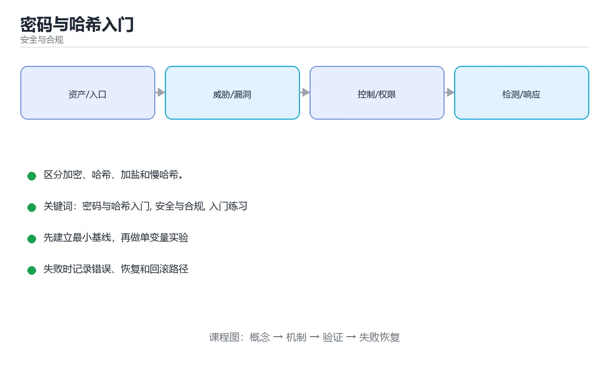

# 密码与哈希入门



> 内容更新时间：2026-10-03 · 学习阶段：入门 · 预计用时：15 分钟

## 学习目标

- 先认识「密码与哈希入门」需要的工具、输入和输出。
- 按步骤运行最小示例，并记录结果与错误。
- 用一个边界输入验证自己是否真正掌握。

## 前置知识

- 会进行基本的文件或命令行操作。
- 不需要预先掌握「安全与合规」的高级知识。

## 一句话入门

区分加密、哈希、加盐和慢哈希。

## 最小示例

```python
print("hello")
```

## 预期输出

```text
result=5
```

## 常见错误

- 输入或环境与示例不一致，导致结果不符合预期。
- 复制命令时遗漏空格、引号或必要参数。

## 动手练习

1. 原样运行最小示例，保存命令和输出。
2. 把数字 2 改成 10，预测并验证新结果。
3. 制造一个错误输入，写出错误信息和修复方法。

## 本课小结

- 入门阶段先保证能运行、能观察、能解释，再追求复杂功能。
- 每次只改一个变量，记录预测与实际结果。
- 遇到错误先看第一条错误信息，再回到最小示例。

<!-- p2-enrichment:v1 -->

## English Overview

**Title:** Passwords and Hashing Basics

**Summary:** Distinguish encryption, hashing, salting and slow hashes.

**Category:** Security & Compliance  
**Level:** 基础  
**Key terms:** 密码与哈希入门, 安全与合规, 入门练习

> The full tutorial is written in Chinese. This bilingual overview helps English readers identify the topic, scope and key terms before studying the detailed examples.

## 内容元数据

- 内容版本：v2.0
- 最后更新：2026-10-03
- 学习阶段：基础
- 适用环境：OWASP、云原生与合规安全实践
- 内容来源：内置结构化课程与工程实践整理
- 相关主题：密码与哈希入门、安全与合规、入门练习
- 质量版本：P0 测验标准 + P1 覆盖扩展 + P2 体验补全

<!-- domain-supplement:v1 -->

## 安全落地补充：密码与哈希入门

### 一、资产、边界与信任

先回答：保护哪些数据、谁可以访问、哪些组件是信任边界、攻击者能从哪些入口进入。围绕「密码与哈希入门、安全与合规、入门练习」列出至少 3 个入口和对应的最小权限。

### 二、威胁 → 控制 → 验证

| 威胁 | 预防控制 | 检测方式 | 验证证据 |
| --- | --- | --- | --- |
| 输入被污染 | schema、白名单、编码 | 异常输入日志和告警 | 越权与注入测试 |
| 权限过大 | 最小权限、临时凭证 | 权限审计和异常调用 | 权限边界测试 |
| 密钥泄露 | 密钥管理、轮换 | 仓库和日志扫描 | 轮换与影响范围记录 |
| 操作不可追溯 | 结构化审计日志 | 关键动作告警 | 审计查询和复盘 |
| 恢复失败 | 备份、回滚、演练 | 恢复指标监控 | 演练时间与数据校验 |

### 三、上线前安全清单

- [ ] 所有外部输入经过校验和输出编码。
- [ ] 认证、授权和会话失效逻辑有测试。
- [ ] 密钥不进入源码、镜像和日志。
- [ ] 依赖漏洞、许可证和来源已审查。
- [ ] 高风险操作有确认、审计和回滚。
- [ ] 安全事件有联系人和升级路径。

### 四、事件响应演练

构造一次凭证泄露或越权访问，按发现、隔离、轮换、取证、恢复、复盘六步执行，记录时间线和剩余风险。

<!-- top50-rewrite:v1 -->

## 课程专属精读：密码与哈希入门

### 一、知识地图

- **一句话入门**：区分加密、哈希、加盐和慢哈希。
- **最小示例**：print("hello")
- **常见错误**：1. 原样运行最小示例，保存命令和输出。
- **适用边界**：说明「密码与哈希入门」在哪些输入、规模和环境下适用，什么时候应该换方案。
- **常见错误**：记录一个最容易犯的错误、错误信息和修复方式。
- **测试与验证**：用正常、边界、失败和恢复四类路径验证结果。

### 二、机制与验证

| 主题 | 需要回答的问题 | 验证方式 |
| --- | --- | --- |
| 一句话入门 | 它解决什么问题，输入和输出是什么？ | 最小示例、边界输入、日志或指标 |
| 最小示例 | 它解决什么问题，输入和输出是什么？ | 最小示例、边界输入、日志或指标 |
| 常见错误 | 它解决什么问题，输入和输出是什么？ | 最小示例、边界输入、日志或指标 |
| 适用边界 | 它解决什么问题，输入和输出是什么？ | 最小示例、边界输入、日志或指标 |
| 常见错误 | 它解决什么问题，输入和输出是什么？ | 最小示例、边界输入、日志或指标 |
| 测试与验证 | 它解决什么问题，输入和输出是什么？ | 最小示例、边界输入、日志或指标 |

### 三、专属检查问题

1. 一句话入门 与相邻主题的边界是什么？
2. 最小示例 与相邻主题的边界是什么？
3. 常见错误 与相邻主题的边界是什么？
4. 适用边界 与相邻主题的边界是什么？
5. 常见错误 与相邻主题的边界是什么？
6. 测试与验证 与相邻主题的边界是什么？

### 四、故障排查

1. 固定输入和环境，确认问题能复现。
2. 找到第一个异常状态，不从最终错误倒猜。
3. 只改变一个变量，记录预测和真实结果。
4. 修复后补边界、失败和重复执行测试。

## 专属复习题库

**问：一句话入门 的关键点是什么？**

答：区分加密、哈希、加盐和慢哈希。 复习时要能用自己的话复述，并给出一个失败场景。

**问：最小示例 的关键点是什么？**

答：print("hello") 复习时要能用自己的话复述，并给出一个失败场景。

**问：常见错误 的关键点是什么？**

答：1. 原样运行最小示例，保存命令和输出。 复习时要能用自己的话复述，并给出一个失败场景。

**问：适用边界 的关键点是什么？**

答：说明「密码与哈希入门」在哪些输入、规模和环境下适用，什么时候应该换方案。 复习时要能用自己的话复述，并给出一个失败场景。

**问：常见错误 的关键点是什么？**

答：记录一个最容易犯的错误、错误信息和修复方式。 复习时要能用自己的话复述，并给出一个失败场景。

**问：测试与验证 的关键点是什么？**

答：用正常、边界、失败和恢复四类路径验证结果。 复习时要能用自己的话复述，并给出一个失败场景。

## 逐步练习：密码与哈希入门

### 练习 1：一句话入门

先复述：区分加密、哈希、加盐和慢哈希。

再完成：运行最小示例 → 改变一个输入 → 记录差异 → 补一条测试。

### 练习 2：最小示例

先复述：print("hello")

再完成：运行最小示例 → 改变一个输入 → 记录差异 → 补一条测试。

### 练习 3：常见错误

先复述：1. 原样运行最小示例，保存命令和输出。

再完成：运行最小示例 → 改变一个输入 → 记录差异 → 补一条测试。

### 练习 4：适用边界

先复述：说明「密码与哈希入门」在哪些输入、规模和环境下适用，什么时候应该换方案。

再完成：运行最小示例 → 改变一个输入 → 记录差异 → 补一条测试。

### 练习 5：常见错误

先复述：记录一个最容易犯的错误、错误信息和修复方式。

再完成：运行最小示例 → 改变一个输入 → 记录差异 → 补一条测试。

### 练习 6：测试与验证

先复述：用正常、边界、失败和恢复四类路径验证结果。

再完成：运行最小示例 → 改变一个输入 → 记录差异 → 补一条测试。

## 故障排查手册：密码与哈希入门

| 现象 | 优先检查 | 修复动作 |
| --- | --- | --- |
| 一句话入门 的结果与预期不符 | 输入、环境、依赖版本、日志第一条错误 | 固定最小复现，只改一个变量并回归 |
| 最小示例 的结果与预期不符 | 输入、环境、依赖版本、日志第一条错误 | 固定最小复现，只改一个变量并回归 |
| 常见错误 的结果与预期不符 | 输入、环境、依赖版本、日志第一条错误 | 固定最小复现，只改一个变量并回归 |
| 适用边界 的结果与预期不符 | 输入、环境、依赖版本、日志第一条错误 | 固定最小复现，只改一个变量并回归 |
| 常见错误 的结果与预期不符 | 输入、环境、依赖版本、日志第一条错误 | 固定最小复现，只改一个变量并回归 |
| 测试与验证 的结果与预期不符 | 输入、环境、依赖版本、日志第一条错误 | 固定最小复现，只改一个变量并回归 |

> 排查原则：先复现，再定位第一个异常状态，最后用边界和失败测试证明修复有效。

## 自测与面试：密码与哈希入门

**问：一句话入门 在实际项目中如何使用？**

答：先说明目标和边界，再给出最小实现、验证方式和失败恢复方案。

**问：最小示例 在实际项目中如何使用？**

答：先说明目标和边界，再给出最小实现、验证方式和失败恢复方案。

**问：常见错误 在实际项目中如何使用？**

答：先说明目标和边界，再给出最小实现、验证方式和失败恢复方案。

**问：适用边界 在实际项目中如何使用？**

答：先说明目标和边界，再给出最小实现、验证方式和失败恢复方案。

**问：常见错误 在实际项目中如何使用？**

答：先说明目标和边界，再给出最小实现、验证方式和失败恢复方案。

**问：测试与验证 在实际项目中如何使用？**

答：先说明目标和边界，再给出最小实现、验证方式和失败恢复方案。

## 专属进阶任务 5：密码与哈希入门

- 围绕「一句话入门」完成一个可复现实验，记录输入、输出、指标和失败恢复。
- 围绕「最小示例」完成一个可复现实验，记录输入、输出、指标和失败恢复。
- 围绕「常见错误」完成一个可复现实验，记录输入、输出、指标和失败恢复。
- 围绕「适用边界」完成一个可复现实验，记录输入、输出、指标和失败恢复。
- 围绕「常见错误」完成一个可复现实验，记录输入、输出、指标和失败恢复。
- 围绕「测试与验证」完成一个可复现实验，记录输入、输出、指标和失败恢复。

### 验收标准

- [ ] 能复现正文中的最小示例。
- [ ] 能解释该主题的正常、边界和失败路径。
- [ ] 能用测试、日志或指标证明结果。
- [ ] 能把结论放回「password_hash_intro」所属的学习路径。

<!-- top50-rewrite:v1 -->

## 课程专属精读：密码与哈希入门

### 一、知识地图

- **一句话入门**：区分加密、哈希、加盐和慢哈希。
- **最小示例**：print("hello")
- **常见错误**：1. 原样运行最小示例，保存命令和输出。
- **适用边界**：说明「密码与哈希入门」在哪些输入、规模和环境下适用，什么时候应该换方案。
- **常见错误**：记录一个最容易犯的错误、错误信息和修复方式。
- **测试与验证**：用正常、边界、失败和恢复四类路径验证结果。

### 二、机制与验证

| 主题 | 需要回答的问题 | 验证方式 |
| --- | --- | --- |
| 一句话入门 | 它解决什么问题，输入和输出是什么？ | 最小示例、边界输入、日志或指标 |
| 最小示例 | 它解决什么问题，输入和输出是什么？ | 最小示例、边界输入、日志或指标 |
| 常见错误 | 它解决什么问题，输入和输出是什么？ | 最小示例、边界输入、日志或指标 |
| 适用边界 | 它解决什么问题，输入和输出是什么？ | 最小示例、边界输入、日志或指标 |
| 常见错误 | 它解决什么问题，输入和输出是什么？ | 最小示例、边界输入、日志或指标 |
| 测试与验证 | 它解决什么问题，输入和输出是什么？ | 最小示例、边界输入、日志或指标 |

### 三、专属检查问题

1. 一句话入门 与相邻主题的边界是什么？
2. 最小示例 与相邻主题的边界是什么？
3. 常见错误 与相邻主题的边界是什么？
4. 适用边界 与相邻主题的边界是什么？
5. 常见错误 与相邻主题的边界是什么？
6. 测试与验证 与相邻主题的边界是什么？

### 四、故障排查

1. 固定输入和环境，确认问题能复现。
2. 找到第一个异常状态，不从最终错误倒猜。
3. 只改变一个变量，记录预测和真实结果。
4. 修复后补边界、失败和重复执行测试。

## 专属复习题库

**问：一句话入门 的关键点是什么？**

答：区分加密、哈希、加盐和慢哈希。 复习时要能用自己的话复述，并给出一个失败场景。

**问：最小示例 的关键点是什么？**

答：print("hello") 复习时要能用自己的话复述，并给出一个失败场景。

**问：常见错误 的关键点是什么？**

答：1. 原样运行最小示例，保存命令和输出。 复习时要能用自己的话复述，并给出一个失败场景。

**问：适用边界 的关键点是什么？**

答：说明「密码与哈希入门」在哪些输入、规模和环境下适用，什么时候应该换方案。 复习时要能用自己的话复述，并给出一个失败场景。

**问：常见错误 的关键点是什么？**

答：记录一个最容易犯的错误、错误信息和修复方式。 复习时要能用自己的话复述，并给出一个失败场景。

**问：测试与验证 的关键点是什么？**

答：用正常、边界、失败和恢复四类路径验证结果。 复习时要能用自己的话复述，并给出一个失败场景。

## 逐步练习：密码与哈希入门

### 练习 1：一句话入门

先复述：区分加密、哈希、加盐和慢哈希。

再完成：运行最小示例 → 改变一个输入 → 记录差异 → 补一条测试。

### 练习 2：最小示例

先复述：print("hello")

再完成：运行最小示例 → 改变一个输入 → 记录差异 → 补一条测试。

### 练习 3：常见错误

先复述：1. 原样运行最小示例，保存命令和输出。

再完成：运行最小示例 → 改变一个输入 → 记录差异 → 补一条测试。

### 练习 4：适用边界

先复述：说明「密码与哈希入门」在哪些输入、规模和环境下适用，什么时候应该换方案。

再完成：运行最小示例 → 改变一个输入 → 记录差异 → 补一条测试。

### 练习 5：常见错误

先复述：记录一个最容易犯的错误、错误信息和修复方式。

再完成：运行最小示例 → 改变一个输入 → 记录差异 → 补一条测试。

### 练习 6：测试与验证

先复述：用正常、边界、失败和恢复四类路径验证结果。

再完成：运行最小示例 → 改变一个输入 → 记录差异 → 补一条测试。

<!-- p2-references:v1 -->

## 参考资料与复核

- 最后复核：2026-10-04
- 下次复核：2027-04-04
- 复核范围：版本兼容、API 行为、安全建议与工程实践
- 来源性质：官方文档与标准；本课正文为离线教学重组，不复制原文

| 参考资料 | 本课用途 |
| --- | --- |
| [OWASP Cheat Sheets](https://cheatsheetseries.owasp.org/) | 应用安全实践 |
| [NIST Cybersecurity](https://www.nist.gov/cyberframework) | 风险治理框架 |

> 本课主题：区分加密、哈希、加盐和慢哈希。

> App 完全离线展示文字链接，不会自动联网；需要延伸阅读时可复制链接到浏览器。

