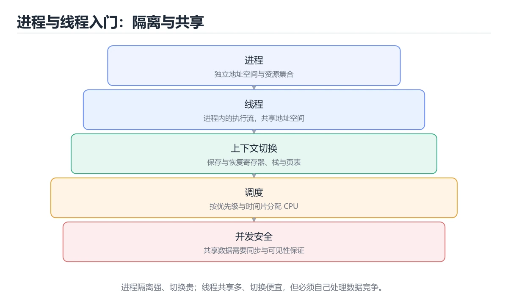
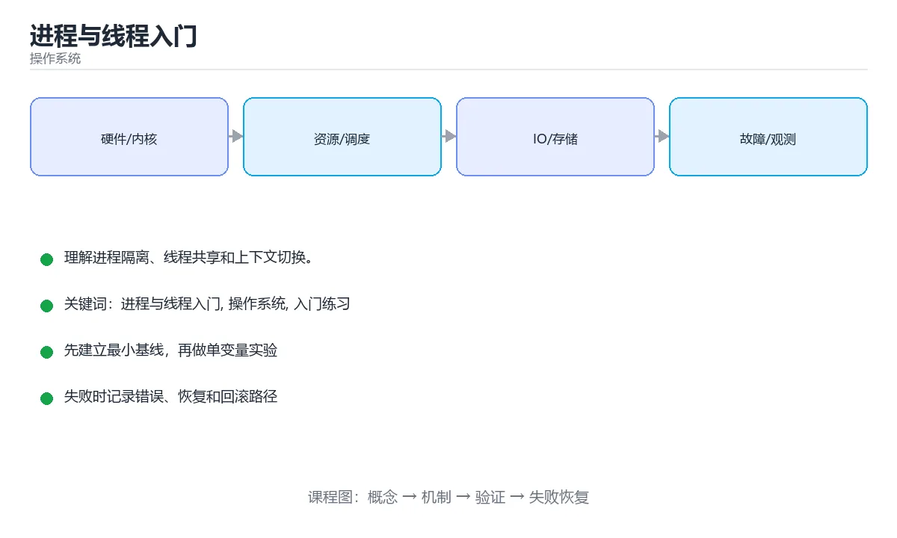

# 进程与线程入门

> 内容更新时间：2026-10-06 · 学习阶段：基础 · 预计用时：35 分钟





## 学习目标

- 先认识进程与线程入门需要的工具、输入和输出。
- 按步骤运行最小示例，并记录结果与错误。
- 用一个边界输入验证自己是否真正掌握。

## 前置知识

- 会进行基本的文件或命令行操作。
- 不需要预先掌握「操作系统」的高级知识。

## 一句话入门

理解进程隔离、线程共享和上下文切换。

## 最小示例

```python
import threading

counter = 0
lock = threading.Lock()

def worker():
    global counter
    with lock:
        counter += 1

threads = [threading.Thread(target=worker) for _ in range(3)]
for thread in threads:
    thread.start()
for thread in threads:
    thread.join()
print(counter)
```

## 预期输出

```text
3
```

## 常见错误与排查

- 输入或环境与示例不一致，导致结果不符合预期。
- 复制命令时遗漏空格、引号或必要参数。

## 动手练习

1. 原样运行最小示例，保存命令和输出。
2. 把数字 2 改成 10，预测并验证新结果。
3. 制造一个错误输入，写出错误信息和修复方法。

## 本课小结

- 入门阶段先保证能运行、能观察、能解释，再追求复杂功能。
- 每次只改一个变量，记录预测与实际结果。
- 遇到错误先看第一条错误信息，再回到最小示例。

## 进程隔离与线程共享

进程是操作系统分配资源的基本单位。每个进程拥有独立的虚拟地址空间、文件描述符表、权限信息和至少一个执行线程。线程是 CPU 调度的基本单位，同一进程内的多个线程共享代码段、全局变量和堆，但各自拥有栈、寄存器和线程局部存储。正因如此，线程间通信很快，却必须处理数据竞争；进程间隔离更强，但通信要借助管道、共享内存、套接字等机制，并承担序列化和复制成本。

进程创建通常采用“复制当前进程，再加载新程序”的方式，写时复制让父子进程在真正修改页之前共享物理内存。线程创建更轻量，但栈大小、调度和同步仍然有成本。上下文切换保存当前执行状态并恢复另一个执行状态，进程切换还要切换地址空间和页表，通常比线程切换更昂贵。频繁切换会让 CPU 把时间花在保存现场而不是业务计算上。

调度器决定哪个线程在哪个核上运行。时间片、优先级、I/O 等待和锁竞争都会影响调度结果。单核上的并发是交替执行，多核上的并行才可能同时执行；即使有多个核，共享资源也会形成串行瓶颈。理解“并发是结构，并行是执行条件”，可以避免把线程数量简单等同于性能。

## 上下文切换、竞态与死锁

数据竞争发生在两个线程至少一个写共享数据、且没有正确同步时。互斥锁保护临界区，但锁的粒度太大导致排队，太小又增加复杂度；读写锁适合读多写少，原子操作适合简单计数器，条件变量用于等待某个状态成立。无论使用哪种原语，都要明确保护的不变量，而不是只在某一行代码周围随手加锁。

死锁通常同时满足四个条件：互斥、持有并等待、不可抢占和循环等待。实践中最有效的预防方式是统一加锁顺序、设置超时、缩小临界区，并避免在持锁时调用不可控的外部代码。活锁和饥饿则是线程不断重试或长期拿不到资源，现象不同，排查方法也不同。

验证并发程序不能只靠“跑几次没出错”。需要构造高并发压力、重复执行、插入延迟和随机调度，再配合日志、线程转储和性能指标定位问题。先证明共享状态和锁的对应关系，再用测试放大竞态窗口，比盲目增加 sleep 更可靠。

## 代码实验：把示例跑成证据

### 实验一：建立基线

```python
import threading

counter = 0
lock = threading.Lock()

def worker():
    global counter
    with lock:
        counter += 1

threads = [threading.Thread(target=worker) for _ in range(3)]
for thread in threads:
    thread.start()
for thread in threads:
    thread.join()
print(counter)
```

### 实验二：只改一个输入

沿用「进程与线程入门」的最小示例做一次单变量实验：

| 实验 | 改动 | 预测 | 实际 | 结论 |
| --- | --- | --- | --- | --- |
| 基线 | 保持「进程与线程入门」示例原样 |  |  |  |
| 边界 | 把进程与线程入门换成空值或极值 |  |  |  |
| 失败 | 给操作系统传入非法输入 |  |  |  |

做完后用一句话写出「进程与线程入门」的结论：输入怎么变，结果才怎么变。

### 实验三：制造一个可控错误

把复合语句末尾的冒号删掉，或者把字符串直接参与数值运算。先记录解释器报出的第一行错误和行号，再修复并重跑基线。

| 实验 | 改动 | 预测 | 实际 | 结论 |
| --- | --- | --- | --- | --- |
| 基线 | 保持原样 |  |  |  |
| 边界 |  |  |  |  |
| 失败 |  |  |  |  |

### 实验四：用三句话复述

1. 输入是什么，哪些输入属于合法范围，哪些属于边界或非法范围？
2. 程序按什么顺序处理输入，在哪一步产生了状态变化或副作用？
3. 输出如何验证，失败时第一条可观察证据是什么？

## 可运行练习

### 任务 1：先跑通，再解释

```python
import threading

counter = 0
lock = threading.Lock()

def worker():
    global counter
    with lock:
        counter += 1

threads = [threading.Thread(target=worker) for _ in range(3)]
for thread in threads:
    thread.start()
for thread in threads:
    thread.join()
print(counter)
```

### 任务 2：只改一个条件

把「进程与线程入门」的最小示例复制一份，只改一个条件再跑一次：

- 改动点：只把进程与线程入门的输入换成空值、极值或错误输入，其余保持不变。
- 预测：先写下「进程与线程入门」在改动后的输出或错误信息，再运行。
- 记录：对照改动前后的结果，指出差异出在哪一步。
- 验收：换回原条件能复现原结果，改动只影响进程与线程入门。

### 任务 3：迁移到自己的数据

用同一套思路处理一组你自己的数据或场景，保持输出格式与任务 1 一致。

## 故障现场

### 现场 1：本课的 进程与线程入门 常规用例通过，但边界用例失败

把这条结论放回「进程与线程入门」的完整流程里展开：

- 正文依据：定位：围绕“操作系统 依赖了当前版本、执行顺序或共享状态，单次运行无法暴露差异”检查调用链、输入数据和环境配置，先验证假设再改代码。
- 落地检查：把「现场 1：本课的 进程与线程入门 常规用例通过，但边界用例失败」改写成一条可执行的核对项，逐条验证输入、超时与失败路径。

### 现场 2：本课的 操作系统 结果在两次运行之间不一致

**症状**：在本课的练习或生产场景里出现“本课的 操作系统 结果在两次运行之间不一致”。

**复现**：准备一组最小输入，只保留触发“本课的 操作系统 结果在两次运行之间不一致”的必要条件，连续运行两次确认结果稳定。

**定位**：围绕“操作系统 依赖了当前版本、执行顺序或共享状态，单次运行无法暴露差异”检查调用链、输入数据和环境配置，先验证假设再改代码。

**预防**：把“本课的 操作系统 结果在两次运行之间不一致”写成一条自动化用例，并在本课的验收清单里保留对应检查项。

### 现场 3：程序在开发机很快，换到目标机器后延迟飙升

**症状**：在本课的练习或生产场景里出现“程序在开发机很快，换到目标机器后延迟飙升”。

**复现**：准备一组最小输入，只保留触发“程序在开发机很快，换到目标机器后延迟飙升”的必要条件，连续运行两次确认结果稳定。

**定位**：围绕“调度、缺页、锁竞争与缓存命中率共同变化，进程与线程入门 的局部结论被搬到了完全不同的资源约束下”检查调用链、输入数据和环境配置，先验证假设再改代码。

**修复**：为进程与线程入门记录 CPU、内存、上下文切换和 I/O 等待指标，用火焰图或采样把瓶颈定位到具体阶段

**预防**：把“程序在开发机很快，换到目标机器后延迟飙升”写成一条自动化用例，并在本课的验收清单里保留对应检查项。

## 本课复习清单

离开本课前，逐项确认：

- [ ] 不看解析，能说出「进程与线程在资源隔离上的区别是？」的判断依据。
- [ ] 不看解析，能说出「多个线程同时修改同一个计数器时，为什么需要加锁？」的判断依据。
- [ ] 不看解析，能说出「上下文切换指的是什么？」的判断依据。
- [ ] 不看解析，能说出「示例启动三个线程各加一次，输出 3 说明什么？」的判断依据。
- [ ] 至少运行一次本课示例，记录输入、输出和一个边界情况。
- [ ] 把本课最容易混淆的两个概念写成一句话对照。

| 复盘项 | 记录 |
| --- | --- |
| 已经能独立解释的考点 |  |
| 仍然说不清的概念 |  |
| 下一步验证动作 |  |

## 复习与自测

下面按正文顺序回顾每一节，并给出一个自检问题；说不清的地方回到原章节补课。

### 最小示例

```python
import threading

counter = 0
lock = threading.Lock()

def worker():
    global counter
    with lock:
        counter += 1

```

自检：这一节与相邻主题的边界在哪里？

### 预期输出

```text
3
```

### 常见错误

自检：把这一节讲给没学过的人，最需要强调哪一点？

### 动手练习

自检：如果去掉这一节里的一个前提，结论会怎样变化？

### 进程隔离与线程共享

每个进程拥有独立的虚拟地址空间、文件描述符表、权限信息和至少一个执行线程。线程是 CPU 调度的基本单位，同一进程内的多个线程共享代码段、全局变量和堆，但各自拥有栈、寄存器和线程局部存储。

自检：这一节的关键输入与输出分别是什么？

### 上下文切换、竞态与死锁

数据竞争发生在两个线程至少一个写共享数据、且没有正确同步时。互斥锁保护临界区，但锁的粒度太大导致排队，太小又增加复杂度；读写锁适合读多写少，原子操作适合简单计数器，条件变量用于等待某个状态成立。

自检：用自己的话复述这一节，并举一个反例。

## 术语速查

| 术语 | 本课语境 |
| --- | --- |
| `进程与线程入门` | 围绕“调度、缺页、锁竞争与缓存命中率共同变化，进程与线程入门 的局部结论被搬到了完全不同的资源约束下”检查调用链、输入数据和环境配置，先验证假设再改代码。 |
| `操作系统` | 定位：围绕“操作系统 依赖了当前版本、执行顺序或共享状态，单次运行无法暴露差异”检查调用链、输入数据和环境配置，先验证假设再改代码。 |
| `入门练习` | “进程与线程入门”中的 进程与线程入门、操作系统、入门练习，下列哪两项是本课强调的实践判断。 |

## 零基础精讲：把进程与线程入门真正讲透

### 先建立一个直觉

把操作系统看成一座资源调度中心：CPU、内存、文件和设备都是有限资源，进程提出申请，内核负责隔离、分配、回收和记账。

本课的摘要可以当作一张地图：理解进程隔离、线程共享和上下文切换。

### 逐步拆解

1. 澄清输入与目标。先写清「进程与线程入门」要解决的问题、合法输入范围和成功标准，再进入后续步骤。
2. 描述处理过程。把「进程与线程入门、操作系统、入门练习」映射到具体步骤，每步都要求能单独验证。
3. 定义输出。输出不仅包括正常结果，还包括错误码、日志、指标和资源释放状态。
4. 找出一条失败路径。让错误尽早暴露，并说明重试、降级、回滚或人工处理的边界。
5. 用一个小例子贯穿全过程。先手算或预测结果，再运行代码或实验，最后解释差异。

### 把正文串成一条执行链

- **实验一：建立基线**：先原样运行上面的代码，记录命令、完整输出和退出状态
- **实验三：制造一个可控错误**：在「进程与线程入门」里，「实验三：制造一个可控错误」这一步要先写清输入与预期，再记录实际结果和差异；结果不符时回到对应小节核对前提。
- **考点 1：进程与线程在资源隔离上的区别是？**：针对「进程与线程入门」，先自问「进程与线程在资源隔离上的区别是」；作答后回到对应考点核对判断依据。
- **考点 2：多个线程同时修改同一个计数器时，为什么需要加锁？**：针对「进程与线程入门」，先自问「多个线程同时修改同一个计数器时，为什么需要加锁」；作答后回到对应考点核对判断依据。

### 从测验反推易错点

**检查点 1：进程与线程在资源隔离上的区别是？**

- 参考判断：进程拥有独立地址空间，线程共享所属进程的资源
- 自问：如果去掉题干里的一个限定词，结论还成立吗？

**检查点 2：多个线程同时修改同一个计数器时，为什么需要加锁？**

- 参考判断：读取与写入不是原子操作，交错执行会产生丢失更新

**检查点 3：上下文切换指的是什么？**

- 参考判断：操作系统保存当前执行状态并切换到另一个任务继续执行

**检查点 4：示例启动三个线程各加一次，输出 3 说明什么？**

- 参考判断：三个线程的更新都被正确执行，锁保护了临界区

- 参考判断：threads

### 工程排错顺序

| 先查什么 | 要得到的证据 | 判断标准 |
| --- | --- | --- |
| 资源由谁创建、谁释放、何时回收？ | 日志、输入样例、测试或指标 | 能复现并解释，才算定位 |
| 用户态与内核态边界在哪里？ | 日志、输入样例、测试或指标 | 能复现并解释，才算定位 |
| 并发访问是否需要锁或无锁结构？ | 日志、输入样例、测试或指标 | 能复现并解释，才算定位 |
| 指标是吞吐、延迟还是尾延迟？ | 日志、输入样例、测试或指标 | 能复现并解释，才算定位 |

### 变式训练

1. 把它放进一个只有单机、没有额外依赖的小项目，先保证正确，再考虑扩展。
2. 把输入规模扩大十倍，记录时间、内存和失败路径，找出第一个真正瓶颈。
3. 制造一次依赖超时或错误输入，要求系统给出可解释错误并且不留下半完成状态。
5. 删掉一个看似必要的步骤，观察哪个测试或指标先失败，用证据说明它为什么必要。
6. 把方案切换到低资源设备，重新评估默认参数、超时和降级策略。

### 本课自测

- [ ] 能用一句话解释进程与线程入门在本课中的角色与边界。
- [ ] 能举出一个正常例子和一个失败例子。
- [ ] 能说出最小验证步骤，以及需要记录的证据。
- [ ] 能用一句话解释「操作系统」在本课中的角色与边界。
- [ ] 能用一句话解释「入门练习」在本课中的角色与边界。

### 迁移案例库

下面用不同约束重复同一套方法。每完成一轮，都把结论写进笔记，并只改变一个变量。

#### 迁移案例 1：围绕进程与线程入门做一次小实验

**目标**：在不改变课程主体的前提下，验证进程与线程入门中的一个关键判断。

**步骤**：
1. 复述当前方案对本课的假设，写成一句可证伪的话。
2. 设计一个正常输入和一个边界输入，分别预测输出。
3. 运行或逐步演算，记录实际输出、耗时和失败信息。
4. 只调整一个参数，比较前后差异并解释原因。
5. 补充一条测试或复习卡，确保下次能更快复现。

**验收**：结论有证据、差异可解释、失败可恢复；如果做不到，说明还需要缩小问题范围。

#### 迁移案例 2：围绕「操作系统」做一次小实验

**步骤**：
1. 复述当前方案对「操作系统」的假设，写成一句可证伪的话。

#### 迁移案例 3：围绕「入门练习」做一次小实验

**步骤**：
1. 复述当前方案对「入门练习」的假设，写成一句可证伪的话。

#### 迁移案例 4：围绕进程与线程入门做一次小实验

**步骤**：

#### 迁移案例 5：围绕「操作系统」做一次小实验

**步骤**：

#### 迁移案例 6：围绕「入门练习」做一次小实验

**步骤**：

#### 迁移案例 7：围绕进程与线程入门做一次小实验

**步骤**：

#### 迁移案例 8：围绕「操作系统」做一次小实验

**步骤**：

#### 迁移案例 9：围绕「入门练习」做一次小实验

**步骤**：

#### 迁移案例 10：围绕进程与线程入门做一次小实验

**步骤**：

#### 迁移案例 11：围绕「操作系统」做一次小实验

**步骤**：

#### 迁移案例 12：围绕「入门练习」做一次小实验

**步骤**：

#### 迁移案例 13：围绕进程与线程入门做一次小实验

**步骤**：

#### 迁移案例 14：围绕「操作系统」做一次小实验

**步骤**：

#### 迁移案例 15：围绕「入门练习」做一次小实验

**步骤**：

#### 迁移案例 16：围绕进程与线程入门做一次小实验

**步骤**：

<!-- p0-depth-v2:end -->

## 考点精讲

### 考点 1：多选辨析·进程与线程入门

- **题目**：围绕“进程与线程入门”中的 进程与线程入门、操作系统、入门练习，下列哪两项是本课强调的实践判断？
- **判断依据**：在「进程与线程入门」里，题干的正确项是验证 操作系统 时要固定版本并覆盖边界输入，结论才可复现；学习 进程与线程入门 时要同时说明输入、输出和失败路径，不能只看正常流程。在「进程与线程入门」里判断这道题，要把进程与线程入门、操作系统、入门练习的条件、过程与失败路径逐项对齐，换成“围绕进程与线程入门中的 进程与线程入”这个场景，只有满足前提的结论才成立。

### 考点 2：概念判断·进程与线程入门

- **题目**：多个线程同时修改同一个计数器时，为什么需要加锁？
- **判断依据**：在「进程与线程入门」里，读取与写入不是原子操作，交错执行会产生丢失更新。计数器自增实际包含读取、计算与写回多个步骤，两个线程交错执行时可能都读到旧值，导致结果少加。“多个线程同时修改同一个计数器时”与「进程与线程入门」的术语表相呼应，只有符合进程与线程入门、操作系统、入门练习约束的“读取与写入不是原子操作”才是正文支持的结论。

### 考点 3：概念判断·进程与线程入门

- **题目**：上下文切换指的是什么？
- **判断依据**：在「进程与线程入门」里，操作系统保存当前执行状态并切换到另一个任务继续执行。当时间片用完、发生阻塞或更高优先级任务就绪时，操作系统保存寄存器与栈等上下文，再加载另一个任务的上下文继续运行。「进程与线程入门」要求先交代进程与线程入门、操作系统、入门练习的前提再下结论，所以“操作系统保存当前执行状态并切换到另一个任”只在题干“上下文切换指的是什么”给定的条件下成立。

### 考点 4：概念判断·进程与线程入门

- **题目**：示例启动三个线程各加一次，输出 3 说明什么？
- **判断依据**：在「进程与线程入门」里，结论应落在「三个线程的更新都被正确执行，锁保护了临界区」。结论应落在三个线程的更新都被正确执行。三个线程各执行一次带锁的加一操作，临界区被互斥保护，因此最终计数为 3。在「进程与线程入门」里，这道题要求区分概念与边界，「三个线程的更新都被正确执行，锁保护了临界区」只有在题干给出的前提下才成立，而「计数器最终值为 3 是因为主线程执行了三次」、「线程没有真正运行，只是打印了配置数值」缺少同一组条件。

### 考点 5：填空·进程与线程入门

- **题目**：补全代码：「进程与线程入门」示例中，下面这行代码缺少哪个关键字或函数名？请填入 ____。 `____ = [threading.Thread(target=worker) for _ in range(3)]`
- **判断依据**：题干的正确项是threads。回到「进程与线程入门」的正文示例，用“补全代码”走一遍进程与线程入门、操作系统、入门练习的完整流程，能复现的结论才可以保留。在「进程与线程入门」里判断这道题，要把进程与线程入门、操作系统、入门练习的条件、过程与失败路径逐项对齐，换成“threads”这个场景，只有满足前提的结论才成立。

### 考点 6：排错·进程与线程入门

- **题目**：阅读「进程与线程入门」的代码片段，下面哪项判断是正确的？
- **判断依据**：在「进程与线程入门」里，题干的正确项是进程拥有独立地址空间，线程共享所属进程的资源。把“进程拥有独立地址空间”代回「进程与线程入门」里“阅读进程与线程入门的代码片段”的例子核对，条件一旦改变，结论就要用进程与线程入门、操作系统、入门练习重新推导。「进程与线程入门」要求先交代进程与线程入门、操作系统、入门练习的前提再下结论，所以“进程拥有独立地址空间”只在题干“阅读的代码片段”给定的条件下成立。

## English Overview

**Title:** Processes and Threads Basics

**Summary:** Understand isolation, sharing and context switches.

**Category:** Operating Systems
**Level:** 入门
**Key terms:** 进程与线程入门, 操作系统, 入门练习

## 内容元数据

- 内容版本：v2.0
- 最后更新：2026-10-06
- 学习阶段：基础
- 适用环境：Linux 6.x / POSIX
- 内容来源：内置结构化课程与工程实践整理
- 相关主题：进程与线程入门、操作系统、入门练习
- 质量版本：P0 测验标准 + P1 覆盖扩展 + P2 体验补全

## 参考资料与复核

- 最后复核：2026-10-04
- 下次复核：2027-04-04
- 复核范围：版本兼容、API 行为、安全建议与工程实践
- 来源性质：官方文档、标准或权威教材；正文为离线教学重组

| 参考资料 | 本课用途 |
| --- | --- |
| [GNU C Library](https://www.gnu.org/software/libc/manual/) | 进程、线程与系统接口 |
| [POSIX 标准](https://pubs.opengroup.org/onlinepubs/9799919799/) | 可移植操作系统接口 |
| [LWN 内核文章](https://lwn.net/Kernel/Index/) | 内核机制与演进 |

> 「进程与线程入门」的链接用于离线阅读后的延伸核对；App 不会自动联网。

## 复习与迁移

复习目标：把「进程与线程入门」的判断标准放回可复现的例子里。先自己作答，再对照依据；如果结论正确但理由不完整，回到正文补足前提。

### 概念复述

- 用一句话说明「进程与线程入门」解决什么问题：理解进程隔离、线程共享和上下文切换。
- 写出进程与线程入门、操作系统、入门练习之间的关系，并各举一个例子。
- 说出本课最容易混淆的两个概念，以及区分它们的判据。

### 正文逐节复核

- **零基础精讲：把进程与线程入门真正讲透**：把操作系统看成一座资源调度中心：CPU、内存、文件和设备都是有限资源，进程提出申请，内核负责隔离、分配、回收和记账。

### 测验回顾

1. 围绕“进程与线程入门”中的 进程与线程入门、操作系统、入门练习，下列哪两项是本课强调的实践判断？
   - 依据：在「进程与线程入门」里，题干的正确项是验证 操作系统 时要固定版本并覆盖边界输入，结论才可复现；学习 进程与线程入门 时要同时说明输入、输出和失败路径，不能只看正常流程。在「进程与线程入门」里判断这道题，要把进程与线程入门、操作系统、入门练习的条件、过程与失败路径逐项对齐，换成“围绕进程与线程入门中的 进程与线程入”这个场景，只有满足前提的结论才成立。
2. 多个线程同时修改同一个计数器时，为什么需要加锁？
   - 依据：在「进程与线程入门」里，读取与写入不是原子操作，交错执行会产生丢失更新。计数器自增实际包含读取、计算与写回多个步骤，两个线程交错执行时可能都读到旧值，导致结果少加。“多个线程同时修改同一个计数器时”与「进程与线程入门」的术语表相呼应，只有符合进程与线程入门、操作系统、入门练习约束的“读取与写入不是原子操作”才是正文支持的结论。
3. 上下文切换指的是什么？
   - 依据：在「进程与线程入门」里，操作系统保存当前执行状态并切换到另一个任务继续执行。当时间片用完、发生阻塞或更高优先级任务就绪时，操作系统保存寄存器与栈等上下文，再加载另一个任务的上下文继续运行。「进程与线程入门」要求先交代进程与线程入门、操作系统、入门练习的前提再下结论，所以“操作系统保存当前执行状态并切换到另一个任”只在题干“上下文切换指的是什么”给定的条件下成立。
4. 示例启动三个线程各加一次，输出 3 说明什么？
   - 依据：在「进程与线程入门」里，结论应落在「三个线程的更新都被正确执行，锁保护了临界区」。结论应落在三个线程的更新都被正确执行。三个线程各执行一次带锁的加一操作，临界区被互斥保护，因此最终计数为 3。在「进程与线程入门」里，这道题要求区分概念与边界，「三个线程的更新都被正确执行，锁保护了临界区」只有在题干给出的前提下才成立，而「计数器最终值为 3 是因为主线程执行了三次」、「线程没有真正运行，只是打印了配置数值」缺少同一组条件。
5. 补全代码：「进程与线程入门」示例中，下面这行代码缺少哪个关键字或函数名？请填入 ____。

`____ = [threading.Thread(target=worker) for _ in range(3)]`
   - 依据：题干的正确项是threads。回到「进程与线程入门」的正文示例，用“补全代码”走一遍进程与线程入门、操作系统、入门练习的完整流程，能复现的结论才可以保留。在「进程与线程入门」里判断这道题，要把进程与线程入门、操作系统、入门练习的条件、过程与失败路径逐项对齐，换成“threads”这个场景，只有满足前提的结论才成立。
1. 阅读「进程与线程入门」的代码片段，下面哪项判断是正确的？
   - 依据：在「进程与线程入门」里，题干的正确项是进程拥有独立地址空间，线程共享所属进程的资源。把“进程拥有独立地址空间”代回「进程与线程入门」里“阅读进程与线程入门的代码片段”的例子核对，条件一旦改变，结论就要用进程与线程入门、操作系统、入门练习重新推导。「进程与线程入门」要求先交代进程与线程入门、操作系统、入门练习的前提再下结论，所以“进程拥有独立地址空间”只在题干“阅读的代码片段”给定的条件下成立。

### 迁移练习

把「进程与线程入门」的结论迁移到相邻主题，每次迁移都写清预测与证据：

1. 换输入：用进程与线程入门处理一组你自己的数据，对比教材示例的结果差异。
2. 换失败条件：制造一个操作系统相关的错误，说明如何从错误信息定位根因。
3. 换规模：把数据量或并发度提高一个数量级，说明「进程与线程入门」的结论是否仍成立。
