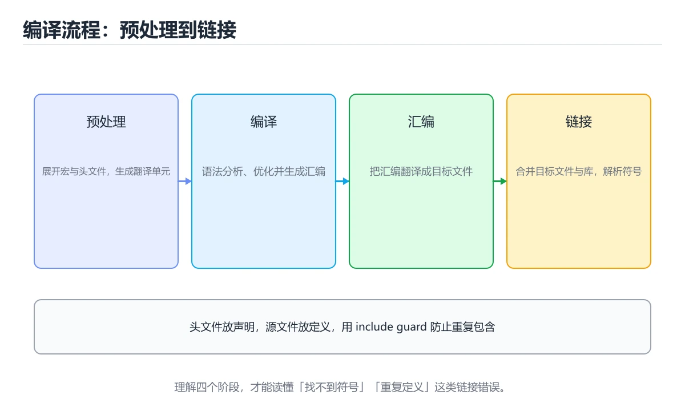
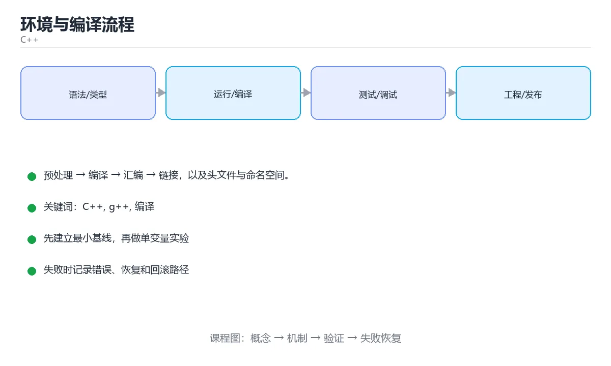

# 环境与编译流程





> 内容更新时间：2026-10-06 · 学习阶段：基础 · 预计用时：40 分钟

## 学习目标

- 能用自己的话解释环境与编译流程解决了什么问题，而不是只背术语。
- 能说清 「C++」、「g++」、「编译」、「链接」 之间的关系，并分别举出一个例子。
- 能把 C++ 放回「环境与编译流程」的知识体系，说明它和 g++ 的边界。
- 能完成本课练习，并用验收标准检查自己的结果。

> 一句话摘要：预处理 → 编译 → 汇编 → 链接，以及头文件与命名空间。

## 前置知识

- 能独立打开与保存文件即可；g++ 会在正文中从零解释。
- 本课阶段：基础。建议先掌握同一分类的基础课程，并能独立运行正文里的 name_ 示例。
- 开始前先复习：C++、g++、编译。
- 如果 从源码到可执行文件 这一步看不懂，先记录具体卡点，再用 name_ 复现一遍。

## 从源码到可执行文件

```text
hello.cpp
   ↓ 预处理（展开 #include、#define，生成 .i）
   ↓ 编译（翻译成汇编，生成 .s）
   ↓ 汇编（生成目标文件 .o / .obj）
   ↓ 链接（合并目标文件与库，生成可执行文件）
hello.exe
```

理解这条链路能解释很多问题：找不到函数定义是**链接错误**，语法问题是**编译错误**，宏展开异常则发生在**预处理**阶段。

## 第一个程序

```cpp
#include <iostream>      // 输入输出流

int main() {             // 程序入口，返回 int
    std::cout << "Hello, C++!" << std::endl;
    return 0;            // 0 表示正常退出
}
```

编译运行：

```bash
g++ -std=c++20 -Wall -Wextra -O2 hello.cpp -o hello
./hello

clang++ -std=c++20 hello.cpp -o hello     # Clang
cl /std:c++20 /EHsc hello.cpp             # MSVC
```

常用选项：`-std=` 指定标准，`-Wall -Wextra` 打开警告，`-O2` 优化，`-g` 生成调试信息。

## 头文件与源文件

```cpp
// math_utils.h —— 声明
#pragma once
int add(int a, int b);

// math_utils.cpp —— 定义
#include "math_utils.h"
int add(int a, int b) { return a + b; }

// main.cpp
#include <iostream>
#include "math_utils.h"
int main() { std::cout << add(1, 2); }
```

约定：**声明放头文件、定义放源文件**；头文件用 `#pragma once` 或 include guard 防止重复包含。

## 命名空间与标准库

```cpp
#include <iostream>
#include <string>

namespace app {
    std::string name = "demo";
}

int main() {
    std::cout << app::name << '\n';
    // 不推荐在头文件里写 using namespace std;
}
```

## 常见错误与排查

1. `main` 忘记 `return` 时 C++ 会隐式返回 0，但其他有返回值的函数不写 `return` 是未定义行为。
2. 头文件里定义全局变量会导致多重定义，应使用 `inline` 变量或 `extern` 声明。
3. 未初始化的基本类型变量值是随机的，务必显式初始化。
| 报错信息 | 含义 | 处理方式 |
| --- | --- | --- |
| `fatal error: xxx.h: No such file or directory` | 头文件路径不对 | 用 `-I` 指定包含目录 |
| `undefined reference to 'foo()'` | 声明有、实现缺失或没链接库 | 补实现或加库（注意库的顺序） |
| `multiple definition of 'x'` | 同一符号被多次定义 | 变量声明放头文件用 `extern`，定义放源文件 |
| `error: 'x' was not declared in this scope` | 未声明或未包含头文件 | 检查拼写、作用域与包含 |
| `expected ';' after ...` | 语法错误 | 看行号与上一行是否漏分号 |
| `redefinition of 'struct X'` | 头文件没防重复包含 | 加 `#pragma once` |
| `invalid conversion from 'const char*' to 'char*'` | 字符串字面量是只读 | 用 `const char*` 或 `std::string` |
| `warning: comparison of integer expressions of different signedness` | 有符号与无符号比较 | 统一类型，或用 `static_cast` 明确转换 |
| 程序崩溃但编译通过 | 运行时错误 | 用 `-g` + gdb，或 ASan 定位 |

## 本课小结

掌握「预处理 → 编译 → 汇编 → 链接」四步，再配合 `-Wall -Wextra`，能提前消灭大量问题。

## 编译流程速查

| 阶段 | 输入 | 输出 | 常见问题 |
| --- | --- | --- | --- |
| 预处理 | `.cpp` + 头文件 | 展开后的源文件 | 宏定义错误、重复包含 |
| 编译 | 预处理结果 | 汇编代码 | 语法错误、类型错误 |
| 汇编 | 汇编代码 | 目标文件 `.o` | 少见 |
| 链接 | 多个 `.o` + 库 | 可执行文件 | `undefined reference`、重复定义 |

常用命令速查：

| 目的 | 命令 |
| --- | --- |
| 一步编译 | `g++ -std=c++20 -Wall -Wextra -O2 main.cpp -o app` |
| 只编译不链接 | `g++ -c main.cpp -o main.o` |
| 多文件链接 | `g++ main.o util.o -o app` |
| 带调试信息 | `g++ -g main.cpp -o app` |
| 预处理后查看 | `g++ -E main.cpp \| less` |
| 生成汇编 | `g++ -S main.cpp` |
| 链接库 | `g++ main.cpp -lm -lpthread` |
| 查看符号 | `nm -C app \| head` |
| 查看动态依赖 | `ldd app` |
| 反汇编 | `objdump -d -M intel app` |
| 静态检查 | `clang-tidy main.cpp -- -std=c++20` |
| 格式化 | `clang-format -i main.cpp` |

## 头文件与工程组织速查

```cpp
// widget.h：声明放头文件，用 include guard 或 #pragma once 防重复包含
#pragma once
#include <string>

class Widget {
public:
    explicit Widget(std::string name);
    void draw() const;

private:
    std::string name_;
};
```

```cpp
// widget.cpp：实现放源文件
#include "widget.h"
#include <iostream>

Widget::Widget(std::string name) : name_(std::move(name)) {}

void Widget::draw() const {
    std::cout << name_ << '\n';
}
```

| 约定 | 说明 |
| --- | --- |
| 声明与实现分离 | 头文件放声明，源文件放实现 |
| 头文件只包含必要内容 | 能用前置声明就少 `#include`，减少编译依赖 |
| 使用 `#pragma once` | 简单可靠，主流编译器都支持 |
| 命名空间 | 避免全局符号冲突，不使用 `using namespace std;` |
| 编译选项 | 开发期 `-Wall -Wextra -Werror -g`，发布期 `-O2` |

## 复习与自测

- [ ] 能说清「预处理、编译、汇编、链接」四个阶段。
- [ ] 会用 `-c` 分离编译，再统一链接。
- [ ] 知道 `undefined reference` 属于链接错误。
- [ ] 头文件用 `#pragma once`，声明与实现分离。
- [ ] 开发期打开 `-Wall -Wextra`，调试期加 `-g`。

## 零基础详解：C++ 程序从一行文字变成可执行文件

### 一句话说清它是什么

C++ 是**编译型**语言：你写的源码要先整体「翻译」成机器码，才能运行。
好处是运行快、控制力强；代价是必须先过编译这一关，语法错误藏不住。

### 用生活比喻理解编译过程

| 阶段 | 比喻 | 实际做了什么 |
| --- | --- | --- |
| 预处理 | 把参考资料剪贴进正文 | 展开 `#include`、`#define` |
| 编译 | 把中文翻成英文 | 源码 → 汇编代码，检查语法 |
| 汇编 | 排成机器能读的格式 | 汇编码 → 目标文件 `.o` |
| 链接 | 把各章装订成一本书 | 合并目标文件与库，生成可执行文件 |

一句话记忆：**编译管语法，链接管「这个人到底在不在」**。

### 逐行拆解第一个程序

```cpp
#include <iostream>          // 引入输入输出库

int main() {                 // 程序入口，必须有且只有一个
    std::cout << "Hello\n";  // 向屏幕输出
    return 0;                // 返回 0 表示正常结束
}
```

| 行 | 代码 | 在做什么 | 为什么这么写 |
| --- | --- | --- | --- |
| 1 | `#include <iostream>` | 告诉编译器「我要用输入输出」 | 这是预处理指令，行尾不加分号 |
| 3 | `int main()` | 定义程序入口 | 操作系统从这个函数开始执行 |
| 4 | `std::cout << ...` | 把内容送到标准输出 | `<<` 的方向就是「数据流向屏幕」 |
| 4 | `"Hello\n"` | 字符串里的 `\n` 是换行 | 不加 `\n` 输出会和后面连在一起 |
| 5 | `return 0;` | 告诉系统程序正常结束 | 每个语句都要分号 |

### 编译运行的实际命令

```bash
g++ -std=c++20 -Wall -Wextra -O2 hello.cpp -o hello
./hello
```

| 参数 | 作用 |
| --- | --- |
| `-std=c++20` | 使用 C++20 标准，避免用到过时写法 |
| `-Wall -Wextra` | 打开常见警告，很多 bug 在这里就被拦住 |
| `-O2` | 开启优化，发布版本常用 |
| `-o hello` | 指定生成的可执行文件名 |

### 新手最容易踩的八个坑

| 坑 | 现象 | 正确做法 |
| --- | --- | --- |
| 忘写分号 | 报错常常指向**下一行** | 看报错行号的上一行 |
| 用了中文标点 | 一堆莫名其妙的语法错误 | 括号、分号、逗号一律用英文半角 |
| 变量未初始化 | 输出随机值 | 定义时就给初值 `int n = 0;` |
| 忘写 `#include` | 提示找不到 `std::cout` | 按需包含对应头文件 |
| 只有声明没有定义 | `undefined reference` 链接错误 | 补上函数实现，或把 `.cpp` 一起编译 |
| 头文件重复包含 | `redefinition` 重定义 | 头文件加 `#pragma once` |
| 整数除法 | `5 / 2` 得到 `2` | 想要小数先转 `double` |
| 数组越界 | 有时正常有时乱码 | 用 `std::vector` 加 `at()` 或边界检查 |

### 三类错误要会区分

| 错误类型 | 出现阶段 | 典型信息 | 说明 |
| --- | --- | --- | --- |
| 编译错误 | 编译 | `expected ';'` | 语法写错，最容易修 |
| 链接错误 | 链接 | `undefined reference to` | 函数声明了但找不到实现 |
| 运行时错误 | 运行 | 崩溃、乱码 | 越界、空指针、未初始化，最难查 |

### 手把手练习：输入两个数，输出四则运算结果

```cpp
#include <iomanip>
#include <iostream>

int main() {
    double a = 0, b = 0;
    std::cout << "请输入两个数：";
    if (!(std::cin >> a >> b)) {
        std::cout << "输入不是数字\n";
        return 1;
    }
    if (b == 0) {
        std::cout << "除数不能为 0\n";
        return 1;
    }
    std::cout << std::fixed << std::setprecision(2)
              << "和=" << a + b << " 差=" << a - b
              << " 积=" << a * b << " 商=" << a / b << '\n';
    return 0;
}
```

### 学完自测

- [ ] 能按顺序说出预处理、编译、汇编、链接四步。
- [ ] 能解释编译错误和链接错误的区别。
- [ ] 知道 `main` 的返回值代表什么。
- [ ] 能说出三个必须加分号的位置。
- [ ] 能独立用 `g++` 编译并运行一个源文件。

## 动手练习

> 本课练习重点：围绕「C++、g++、编译」完成复述、实验和交付，每个结果都要能被别人检查。

先开启警告编译 C++ 的最小程序，再验证内存与边界，最后用 Sanitizer 复查。

### 练习 1：建立心智模型（10 分钟）

合上教程，用 3～5 句话回答：

1. 环境与编译流程解决了什么问题？
2. 如果没有它，会出现什么具体后果？
3. 它和「g++」是什么关系？

验收标准：回答里必须出现 C++，并写出一个让结论失效的边界条件。

### 练习 2：做一次可控实验（20 分钟）

从正文中选一个最小示例，完成以下操作：

1. 先预测修改一个参数、输入或步骤后的结果。
2. 再实际执行或逐步推演，记录真实结果。
3. 如果结果与预测不同，写出差异原因。

**验收标准**：五步记录要写进笔记——原例是 name_，改动落在C++上，结论必须能被他人在同一环境里复现。

### 练习 3：交付一个小结果（30 分钟）

写一个可独立编译的小程序演示 C++，开启 -Wall -Wextra 并确保没有警告。

任务要求：

- 结果必须能被别人检查，不能只写“我已经理解了”。
- 至少覆盖「C++」和「g++」两个关键词。
- 写出 1 个仍然不确定的问题，以及下一步如何验证。

> 提示：时间有限时优先做练习 1 和练习 2；练习 3 可以拆成两次完成。

## 可运行练习

### 任务 1：先跑通，再解释

```cpp
#include <iostream>      // 输入输出流

int main() {             // 程序入口，返回 int
    std::cout << "Hello, C++!" << std::endl;
    return 0;            // 0 表示正常退出
}
```

### 任务 2：只改一个条件

把「环境与编译流程」的最小示例复制一份，只改一个条件再跑一次：

- 改动点：把 g++ 换成边界值，其他输入保持原样。
- 预测：先写下「环境与编译流程」在改动后的输出或错误信息，再运行。
- 记录：对照改动前后的结果，指出差异出在哪一步。
- 验收：换回原条件能复现原结果，改动只影响C++。

### 任务 3：迁移到自己的数据

用同一套思路处理一组你自己的 C++ 数据，保持输出格式与任务 1 一致。

## 故障现场

### 现场 1：fatal error: xxx.h: No such file or directory

**症状**：在《环境与编译流程》的复现场景中，头文件路径不对。

**根因**：触发点是把“fatal error: xxx.h: No such file or directory”当成安全做法。它没有满足《环境与编译流程》要求的前提，因此先表现为“头文件路径不对”；排查时先完整复现这一段，再核对输入、配置与依赖。

**修复**：针对《环境与编译流程》的问题，用 -I 指定包含目录。

**验证**：先在《环境与编译流程》中记录“fatal error: xxx.h: No such file or directory”留下的失败证据，再执行“用 -I 指定包含目录”并重放；确认错误路径变为明确结果，且修复没有掩盖同类故障。

### 现场 2：undefined reference to 'foo()'

**症状**：在《环境与编译流程》的复现场景中，声明有、实现缺失或没链接库。

**根因**：触发点是把“undefined reference to 'foo()'”当成安全做法。它没有满足《环境与编译流程》要求的前提，因此先表现为“声明有、实现缺失或没链接库”；排查时先完整复现这一段，再核对输入、配置与依赖。

**修复**：针对《环境与编译流程》的问题，补实现或加库（注意库的顺序）。

**验证**：先在《环境与编译流程》中记录“undefined reference to 'foo()'”留下的失败证据，再执行“补实现或加库（注意库的顺序）”并重放；确认错误路径变为明确结果，且修复没有掩盖同类故障。

### 现场 3：multiple definition of 'x'

**症状**：在《环境与编译流程》的复现场景中，同一符号被多次定义。

**根因**：“同一符号被多次定义”只是表层结果。向上追溯会落到“multiple definition of 'x'”这一步，因为它省略了《环境与编译流程》的约束，使实现行为和预期模型发生了偏离。

**修复**：针对《环境与编译流程》的问题，变量声明放头文件用 extern，定义放源文件。

**验证**：保留《环境与编译流程》里触发“同一符号被多次定义”的输入、版本和日志，按“变量声明放头文件用 extern，定义放源文件”完成修改后原样重放；只有失败现象消失且相邻场景仍可解释，才保留改动。

## 版本与时效

- C++23 已在主流工具链落地；升级 C++ 相关代码前先确认标准库实现情况。
- 升级前先用 name_ 建立基线：记录版本、命令和输出，升级后只比较这些可观察量。

### 升级检查清单

- 先固定当前版本，跑通全部示例与测验，再升级工具链。
- 只改 C++ 的版本变量，记录编译、测试与产物体积的变化。
- 升级后重点回归 C++ 的默认值、警告信息与错误格式。
- 升级完成后更新本课「最后复核 / 下次复核」日期，并记录 C++ 的版本变化。

## 本课复习清单

离开本课前，逐项确认：

- [ ] 不看解析，能说出「「找不到函数定义」这类问题属于哪个阶段？」的判断依据。
- [ ] 不看解析，能说出「编译选项 -Wall -Wextra 的作用是？」的判断依据。
- [ ] 不看解析，能说出「防止头文件被重复包含的常见做法是？」的判断依据。
- [ ] 不看解析，能说出「#include 的头文件展开发生在编译流程的哪个阶段？」的判断依据。
- [ ] 不看解析，能说出「把多个源文件分开编译的主要好处是？」的判断依据。
- [ ] 至少运行一次 name_ 的示例，记录输入、输出和 C++ 的边界情况。
- [ ] 把本课最容易混淆的两个概念写成一句话对照。

| 复盘项 | 记录 |
| --- | --- |
| 已经能独立解释的考点 |  |
| 仍然说不清的概念 |  |
| 下一步验证动作 |  |

## 术语速查

| 术语 | 一句话说明 |
| --- | --- |
| `main` | `main` 忘记 `return` 时 C++ 会隐式返回 0，但其他有返回值的函数不写 `return` 是未定义行为。 |
| `C++` | C++ 是编译型语言：你写的源码要先整体「翻译」成机器码，才能运行。 |
| `编译` | 把源代码转换成目标机器代码或中间表示，并在此过程中检查语法和类型。 |
| `namespace` | 把标识符组织到独立作用域、避免命名冲突的语言结构。 |

## 考点精讲

### 考点 1：多选辨析·C++

- **题目**：围绕“环境与编译流程”中的 C++、g++、编译，下列哪两项是本课强调的实践判断？
- **判断依据**：本课把环境与编译流程拆成概念、示例与故障现场三部分，因此判断 C++ 时必须同时交代输入、输出和失败路径，这使“学习 C++ 时要同时说明输入、输出和失败路径，不能只看正常流程”成立。在环境与编译流程里，判断 g++ 时要固定版本与边界输入，所以“验证 g++ 时要固定版本并覆盖边界输入，结论才可复现”才可复现。

### 考点 2：代码补全·C++

- **题目**：这段 C++ 代码是「环境与编译流程」的示例片段，下面哪一项描述与它一致？
- **判断依据**：在「环境与编译流程」里，题干的正确项是这段代码会产生可观察的输出，运行后能看到结果，在「环境与编译流程」里要结合C++核对输出是否符合预期。把输入或边界换成空值、极值或失败情况后，结论要以「环境与编译流程」的实际运行结果为准。在「环境与编译流程」里判断这道题，要把C++、g++、编译的条件、过程与失败路径逐项对齐，换成“这段 C++ 代码是环境与编译流程的”这个场景，只有满足前提的结论才成立。

### 考点 3：概念判断·C++

- **题目**：防止头文件被重复包含的常见做法是？
- **判断依据**：在「环境与编译流程」里，#pragma once 或 include guard。两种方式都能避免同一头文件在一次编译中被多次展开，导致重复定义。这道题的关键在「环境与编译流程」的C++、g++、编译：先确认题干“防止头文件被重复包含的常见做法是”问的是哪一步，再排除偷换前提的选项。

### 考点 4：概念判断·C++

- **题目**：#include 的头文件展开发生在编译流程的哪个阶段？
- **判断依据**：预处理负责展开 #include、宏替换与条件编译，之后才进入真正的语法分析。其他选项：#include 与宏替换由预处理器完成，此时还没有语法分析。这道题要求区分概念与边界，「预处理」只有在题干给出的前提下才成立，而「汇编」、「编译」缺少同一组条件。在「环境与编译流程」里判断这道题，要把C++、g++、编译的条件、过程与失败路径逐项对齐，换成“include 的头文件展开发生在编”这个场景，只有满足前提的结论才成立。

### 考点 5：概念判断·C++

- **题目**：把多个源文件分开编译的主要好处是？
- **判断依据**：在「环境与编译流程」里，改动一个文件只需重编该文件。分离编译配合增量构建，是大项目能快速迭代的基础。在「环境与编译流程」里判断这道题，要把C++、g++、编译的条件、过程与失败路径逐项对齐，换成“把多个源文件分开编译的主要好处是”这个场景，只有满足前提的结论才成立。“把多个源文件分开编译的主要好处是”与「环境与编译流程」的术语表相呼应，只有符合C++、g++、编译约束的“改动一个文件只需重编该文件”才是正文支持的结论。

### 考点 6：填空·C++

- **题目**：补全代码：「环境与编译流程」示例中，下面这行代码缺少哪个关键字或函数名？请填入 ____。 `↓ 预处理（展开 #____、#define，生成 .i）`
- **判断依据**：这道题的关键在「环境与编译流程」的C++、g++、编译：先确认题干“补全代码”问的是哪一步，再排除偷换前提的选项。把“include”代回「环境与编译流程」里“环境与编译流程示例中”的例子核对，条件一旦改变，结论就要用C++、g++、编译重新推导。“include”是否可用，取决于C++、g++、编译在题干条件下的表现，不能直接套用相邻结论。

## English Overview

**Title:** Build Pipeline

**Summary:** Preprocess, compile, assemble, link; headers and namespaces.

**Category:** C++
**Level:** 基础
**Key terms:** C++, g++, 编译, 链接, 头文件, namespace

## 内容元数据

- 内容版本：v2.0
- 最后更新：2026-10-06
- 学习阶段：基础
- 适用环境：C++20 / GCC 13+ 或 Clang 17+
；本课聚焦 C++。
- 内容来源：内置结构化课程与工程实践整理
- 相关主题：C++、g++、编译、链接、头文件、namespace
- 质量版本：P0 测验标准 + P1 覆盖扩展 + P2 体验补全

## Full English Study Guide

### Overview

**Build Pipeline** focuses on Preprocess, compile, assemble, link; headers and namespaces.

### Learning Outcomes

- Explain what **Build Pipeline** solves and when it should be used.

### Glossary

- Topic: **Build Pipeline**
- Related terms: C++, g++, 编译, 链接

## Bilingual Section Outline

| 中文小节 | English section |
| --- | --- |
| 学习目标 | Learning Objectives |
| 前置知识 | Pre-knowledge |
| 从源码到可执行文件 | From source to executable |
| 第一个程序 | First program |
| 头文件与源文件 | Header and Source Files |
| 命名空间与标准库 | Namespaces and Standard Libraries |
| 常见坑 | Common pits |
| 本课小结 | Lesson Summary |
| 编译流程速查 | Quick Look at the Compilation Process |
| 头文件与工程组织速查 | Head Documents and Engineering Organization Quick Look |

## 参考资料与复核

- 最后复核：2026-10-04
- 下次复核：2027-05-10
- 复核范围：版本兼容、API 行为、安全建议与工程实践
- 来源性质：官方文档、标准或权威教材；正文为离线教学重组

| 参考资料 | 本课用途 |
| --- | --- |
| [cppreference C++ 语言](https://en.cppreference.com/w/cpp/language) | C++ 语言规则与语义 |
| [CMake 文档](https://cmake.org/documentation/) | 跨平台构建与依赖管理 |
| [cppreference 标准库](https://en.cppreference.com/w/cpp/standard_library) | 标准库组件索引 |

> 「环境与编译流程」的链接用于离线阅读后的延伸核对；App 不会自动联网。
