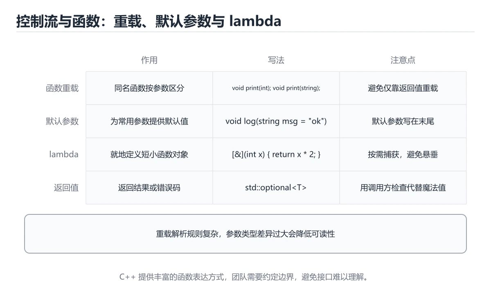
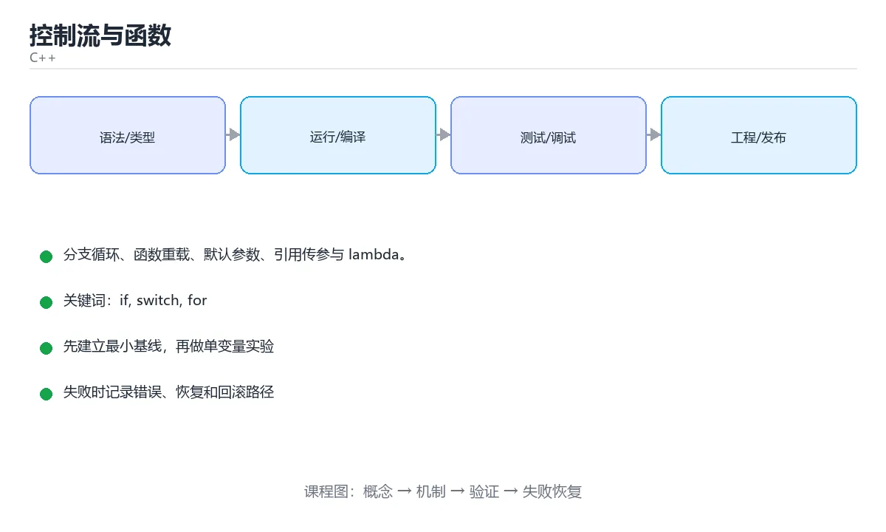

# 控制流与函数





> 内容更新时间：2026-10-03 · 学习阶段：进阶 · 预计用时：15 分钟

## 学习目标

- 能用自己的话解释「控制流与函数」解决了什么问题，而不是只背术语。
- 能说清 「if」、「switch」、「for」、「函数重载」 之间的关系，并分别举出一个例子。
- 能把本课知识放回「C++」的知识体系，说明它和相邻主题的边界。
- 能完成本课练习，并用验收标准检查自己的结果。

> 一句话摘要：分支循环、函数重载、默认参数、引用传参与 lambda。

## 前置知识

- 先完成上一课《变量、类型与运算符》；如果已经掌握，可以直接用本课练习自测。
- 本课阶段：进阶。建议先掌握同一分类的基础课程，并能独立运行正文中的最小示例。
- 开始前先复习：if、switch、for。
- 如果某一步看不懂，先记录具体卡点，完成练习后再回头读一遍。


## 分支

```cpp
int score = 78;

if (score >= 90) {
    std::cout << "优秀";
} else if (score >= 60) {
    std::cout << "及格";
} else {
    std::cout << "不及格";
}

switch (score / 10) {
    case 10:
    case 9:  std::cout << "A"; break;   // 忘记 break 会贯穿到下一个 case
    case 8:  std::cout << "B"; break;
    default: std::cout << "C"; break;
}
```

## 循环

```cpp
for (int i = 0; i < 5; ++i) { /* ... */ }

int n = 3;
while (n-- > 0) { /* ... */ }          // 先判断后执行

do {
    /* 至少执行一次 */
} while (false);

int nums[] = {1, 2, 3};
for (int value : nums) {               // 范围 for（C++11）
    std::cout << value << ' ';
}
for (int& value : nums) { value *= 2; } // 用引用才能修改元素
```

`break` 跳出循环，`continue` 跳过本轮；范围 for 内部不要修改容器大小。

## 函数与重载

```cpp
int add(int a, int b) { return a + b; }
double add(double a, double b) { return a + b; }   // 重载：参数列表不同

int add(int a, int b, int c = 0);                  // 默认参数只能写在声明里

void swap_by_value(int a, int b);        // 改不了实参
void swap_by_ref(int& a, int& b) {       // 引用传参，能改实参且无拷贝
    int tmp = a; a = b; b = tmp;
}

void print(const std::string& text);     // 只读 + 避免拷贝：const 引用
```

## 内联、递归与 lambda

```cpp
inline int square(int x) { return x * x; }   // 建议编译器内联，适合短小函数

int fib(int n) {                              // 递归要有终止条件
    return n < 2 ? n : fib(n - 1) + fib(n - 2);
}

auto add = [](int a, int b) { return a + b; };   // lambda（C++11）
int base = 10;
auto plus_base = [base](int x) { return x + base; };   // 按值捕获
auto modify = [&base](int x) { base += x; };           // 按引用捕获
```

## 作用域与生命周期

变量在离开 `{}` 时销毁；函数内的局部变量随函数返回而失效，**不要返回局部变量的指针或引用**。

## 本课小结
控制流决定逻辑分支，函数决定代码复用。记住三条：参数优先 `const&`、能用范围 for 就不用下标、lambda 捕获要区分值与引用。


## 控制流速查

| 结构 | 写法 | 注意 |
| --- | --- | --- |
| `if / else` | 条件分支 | 条件必须是 `bool` |
| `switch` | 多等值分支 | 忘了 `break` 会穿透 |
| `for` | 计次循环 | 用 `size_t` 遍历时注意 `i >= 0` 恒真 |
| 范围 for | `for (const auto& x : v)` | 只读加 `const&`，修改加 `&` |
| `while` / `do...while` | 条件循环 | `do...while` 至少执行一次 |
| `break` / `continue` | 跳出 / 跳过 | 只影响最近一层循环 |
| `goto` | 跳转 | 仅用于跳出多层循环的少数场景 |

## 函数参数与返回速查

| 目的 | 写法 | 说明 |
| --- | --- | --- |
| 小类型只读 | `void f(int x)` | 复制成本低 |
| 大对象只读 | `void f(const std::string& s)` | 避免拷贝 |
| 需要修改实参 | `void f(std::string& s)` | 明确可写 |
| 需要转移所有权 | `void f(std::string s)` + `std::move` | 值传递 + 移动语义 |
| 返回大对象 | `std::vector<int> make()` | 依赖 RVO，不要 `std::move` 局部变量 |
| 可能失败 | `std::optional<T>` / `bool` + 出参 | 比抛异常更显式 |
| 不抛异常承诺 | `void f() noexcept` | 供容器与优化使用 |
| 默认参数 | `void f(int a, int b = 1)` | 默认值只能写在声明处 |

```cpp
#include <algorithm>
#include <cctype>
#include <string>
#include <vector>

// 只读大对象用 const 引用，避免拷贝
double average(const std::vector<int>& nums) {
    if (nums.empty()) return 0.0;
    long long sum = 0;
    for (int n : nums) sum += n;
    return static_cast<double>(sum) / nums.size();
}

// 就地修改传入对象
void trim(std::string& s) {
    const auto notSpace = [](unsigned char c) { return !std::isspace(c); };
    s.erase(s.begin(), std::find_if(s.begin(), s.end(), notSpace));
}
```

## 常见错误对照表

| 容易写错的做法 | 实际现象 | 原因与正确做法 |
| --- | --- | --- |
| `switch` 忘记 `break` | 穿透执行多个分支 | 每个分支结束加 `break` 或 `return` |
| 范围 for 里 `auto x` 修改 | 改的是副本 | 需要修改写 `auto& x` |
| 范围 for 遍历时修改容器 | 迭代器失效、崩溃 | 先收集要改的内容，循环结束后统一处理 |
| `size_t i` 写 `i >= 0` 作条件 | 死循环 | 无符号不会小于 0，改用有符号或改判断 |
| 大对象按值传参 | 多余的深拷贝 | 用 `const&` |
| 返回局部变量的引用 | 悬空引用 | 按值返回，或返回智能指针 |
| 默认参数写在定义处并重复 | 编译错误 | 只在声明里写一次 |
| 函数声明与定义签名不一致 | 链接错误 | 保持完全一致，开 `-Wall` 及早发现 |
| 忘记 `#include <algorithm>` | 找不到 `std::find_if` | 补头文件 |
| 在头文件定义非 inline 函数 | 多重定义 | 加 `inline`，或放源文件 |

## 自测清单

- [ ] 大对象参数一律用 `const&`，需要修改用 `&`。
- [ ] 范围 for 中只读用 `const auto&`，修改用 `auto&`。
- [ ] 不再用 `i >= 0` 作为无符号循环条件。
- [ ] 返回局部对象时直接 `return obj;`。
- [ ] 编译打开 `-Wall -Wextra` 并清零告警。


## 零基础详解：分支、循环与函数的配合方式

### 一句话说清它是什么

函数负责「把问题拆小」，分支负责「不同情况走不同路」，循环负责「重复做同一件事」。
这三样凑齐，就能写出结构清晰的程序。

### 三种循环怎么选

| 循环 | 适合场景 | 特点 |
| --- | --- | --- |
| `for` | 次数明确、遍历容器 | 初始化、条件、更新写在一行 |
| `while` | 不知道循环几次，靠条件停 | 条件为假一次都不执行 |
| `do...while` | 至少要执行一次 | 先做后判断，例如重试输入 |

```cpp
// 遍历容器：现代写法，不用管下标
for (const auto& item : items) {
    std::cout << item << '\n';
}

// 重试输入：至少问一次
int n = 0;
do {
    std::cout << "请输入 1~100：";
    std::cin >> n;
} while (n < 1 || n > 100);
```

### `switch` 与 `if` 的取舍

| 情况 | 用哪个 |
| --- | --- |
| 判断范围、组合条件 | `if / else if` |
| 对一个整数或枚举的多个固定值分流 | `switch` |
| 分支很多且各自逻辑较长 | `switch` + 抽函数 |

```cpp
switch (grade) {
    case 'A':
        std::cout << "优秀\n";
        break;              // 忘了 break 会「穿透」到下一个分支
    case 'B':
        std::cout << "良好\n";
        break;
    default:
        std::cout << "未知等级\n";
        break;
}
```

### 函数：值传递、引用传递、常量引用

| 传参方式 | 写法 | 是否拷贝 | 能否修改原值 | 什么时候用 |
| --- | --- | --- | --- | --- |
| 值传递 | `void f(int x)` | 拷贝 | 不能 | 小类型、只读 |
| 引用传递 | `void f(int& x)` | 不拷贝 | 能 | 需要把结果写回 |
| 常量引用 | `void f(const Foo& x)` | 不拷贝 | 不能 | 传大对象只读，**首选** |
| 指针传递 | `void f(Foo* p)` | 拷贝指针 | 能 | 允许为空、需要改指向 |

```cpp
void addOne(int x)  { x += 1; }        // 改了副本，外面不变
void addOne(int& x) { x += 1; }        // 改了本体，外面跟着变

int n = 1;
addOne(n);
std::cout << n;                        // 2
```

### 声明与定义：编译器和链接器各管一段

```cpp
// 声明：告诉编译器「有这么个函数」
int add(int a, int b);

// 定义：告诉链接器「它的实现在这里」
int add(int a, int b) { return a + b; }
```

多文件项目里，声明放头文件、定义放源文件，这是 C++ 的基本分工。

### 函数重载与默认参数

```cpp
void print(int n);
void print(const std::string& s);      // 同名不同参：重载

void greet(const std::string& name = "朋友");   // 默认参数
greet();          // 朋友
greet("小明");    // 小明
```

重载靠参数列表区分，**返回值不同不算重载**；默认参数要写在声明处，别在声明和定义里各写一次。

### 新手最容易踩的六个坑

| 坑 | 现象 | 正确做法 |
| --- | --- | --- |
| `if (a = b)` | 赋值被当成条件，永远为真 | 写 `if (a == b)`，或把常量写左边 |
| 循环条件写死 | 程序卡住 | 检查循环变量是否真的在变化 |
| `continue` 与 `break` 混用 | 逻辑提前结束 | `break` 跳出整体，`continue` 只跳本轮 |
| 忘了 `return` | 返回值是随机值 | 有返回类型的函数所有分支都要返回 |
| 递归没有终止条件 | 栈溢出崩溃 | 先写终止条件，再写递归调用 |
| 函数太长 | 难以阅读和测试 | 超过一屏就按职责拆分 |

### 手把手练习：判断成绩等级并统计

```cpp
#include <iostream>
#include <vector>

char levelOf(int score) {
    if (score >= 90) return 'A';
    if (score >= 80) return 'B';
    if (score >= 60) return 'C';
    return 'D';
}

int main() {
    std::vector<int> scores{95, 82, 60, 41};
    int aCount = 0;
    for (int s : scores) {
        const char level = levelOf(s);
        if (level == 'A') ++aCount;
        std::cout << s << " -> " << level << '\n';
    }
    std::cout << "A 等级共 " << aCount << " 人\n";
    return 0;
}
```

### 学完自测

- [ ] 能说出三种循环各自最适合的场景。
- [ ] 能解释 `switch` 里漏写 `break` 会发生什么。
- [ ] 能说清值传递和引用传递的区别。
- [ ] 知道声明和定义分别解决什么问题。
- [ ] 能把一个 50 行的 `main` 拆成 3 个小函数。

## 动手练习


> 本课练习重点：围绕「if、switch、for」完成复述、实验和交付，每个结果都要能被别人检查。

先开启警告编译最小程序，再验证内存与边界，最后用 Sanitizer 跑一遍。

### 练习 1：建立心智模型（10 分钟）

合上教程，用 3～5 句话回答：

1. 「控制流与函数」解决了什么问题？
2. 如果没有它，会出现什么具体后果？
3. 它和「switch」是什么关系？

**验收标准**：至少出现一个本课关键词，并写出一个反例、边界条件或失效场景。

### 练习 2：做一次可控实验（20 分钟）

从正文中选一个最小示例，完成以下操作：

1. 先预测修改一个参数、输入或步骤后的结果。
2. 再实际执行或逐步推演，记录真实结果。
3. 如果结果与预测不同，写出差异原因。

**验收标准**：留下「原例 → 改动 → 预测 → 结果 → 原因」五步记录。

### 练习 3：交付一个小结果（30 分钟）

写一个可独立编译的小程序，开启 `-Wall -Wextra`，确保没有警告。

任务要求：

- 结果必须能被别人检查，不能只写“我已经理解了”。
- 至少覆盖「if」和「switch」两个关键词。
- 写出 1 个仍然不确定的问题，以及下一步如何验证。

> 提示：时间有限时优先做练习 1 和练习 2；练习 3 可以拆成两次完成。


## 考点精讲：把测验题还原成判断过程

本课有 6 个判断点。先自己作答，再看「判断依据」；如果结论正确但理由不完整，回到正文对应章节补足概念。

### 考点 1：既要修改实参又要避免拷贝，函数参数应写成？

- **正确判断**：int& a
- **判断依据**：正确答案是「int& a」，本课在「本课小结」中说明：记住三条：参数优先 const&、能用范围 for 就不用下标、lambda 捕获要区分值与引用。引用传参不产生拷贝，且函数内修改会影响实参。本课还在「作用域与生命周期」中说明：函数内的局部变量随函数返回而失效，不要返回局部变量的指针或引用。本课还在「零基础详解：分支、循环与函数的配合方式」中说明：能解释 switch 里漏写 break 会发生什么。
- **迁移检查**：遮住选项，只根据定义复述一次答案，再回来看哪个选项与复述一致。

### 考点 2：switch 中忘记写 break 会导致？

- **正确判断**：贯穿执行后续 case
- **判断依据**：正确答案是「贯穿执行后续 case」，本课在「循环」中说明：break 跳出循环，continue 跳过本轮。没有 break 会继续执行下一个 case，这称为贯穿（fallthrough），有时是有意为之。本课还在「零基础详解：分支、循环与函数的配合方式」中说明：能解释 switch 里漏写 break 会发生什么。本课还在「本课小结」中说明：记住三条：参数优先 const&、能用范围 for 就不用下标、lambda 捕获要区分值与引用。
- **迁移检查**：把题干里的一个条件换成边界值，原来的结论还成立吗？写出判断过程。

### 考点 3：范围 for 中要修改元素，应写成？

- **正确判断**：for (int& v : nums)
- **判断依据**：正确答案是「for (int& v : nums)」，本课在「零基础详解：分支、循环与函数的配合方式」中说明：函数负责「把问题拆小」，分支负责「不同情况走不同路」，循环负责「重复做同一件事」。只有引用才是元素的别名，按值遍历拿到的是副本。本课还在「零基础详解：分支、循环与函数的配合方式」中说明：能把一个 50 行的 main 拆成 3 个小函数。
- **迁移检查**：遮住选项，只根据定义复述一次答案，再回来看哪个选项与复述一致。

### 考点 4：inline 关键字在现代 C++ 中的主要含义是？

- **正确判断**：允许函数定义出现在多个编译单元而只保留一份，并给编译器内联建议
- **判断依据**：正确答案是「允许函数定义出现在多个编译单元而只保留一份，并给编译器内联建议」，本课在「零基础详解：分支、循环与函数的配合方式」中说明：多文件项目里，声明放头文件、定义放源文件，这是 C++ 的基本分工。是否真正内联由优化器决定，inline 现在的核心作用是处理 ODR（单一定义规则）。本课还在「零基础详解：分支、循环与函数的配合方式」中说明：默认参数要写在声明处，别在声明和定义里各写一次。
- **迁移检查**：遮住选项，只根据定义复述一次答案，再回来看哪个选项与复述一致。

### 考点 5：关于默认参数，下面说法正确的是？

- **正确判断**：一旦某个参数有默认值
- **判断依据**：正确答案是「一旦某个参数有默认值」，本课在「零基础详解：分支、循环与函数的配合方式」中说明：默认参数要写在声明处，别在声明和定义里各写一次。默认值从右往左连续给出，通常在头文件声明中写一次即可。课程摘要指出分支循环，函数重载，默认参数，引用传参与 lambda，本课要判断的正是关于默认参数，下面说法正确的是。
- **迁移检查**：遮住选项，只根据定义复述一次答案，再回来看哪个选项与复述一致。

### 考点 6：补全代码：「控制流与函数」示例中，下面这行代码缺少哪个关键字或函数名？请填入 ____。 `s.erase(s.begin(), std::____(s.begin(), s.end(), notSpace));`

- **正确判断**：find_if
- **判断依据**：正确答案是「find_if」，这道题在问补全代码：控制流与函数示例中，下面这行代码缺少哪个关…s.end(),notSpace));`，判断时要把题干限定的输入、边界与目标逐项对齐。请填入 …gin(), s.end(), notSpace)); 限定的语境来判断。
- **迁移检查**：如果填成相近的另一个函数或关键字，程序会在哪一步出错？

## 本课复习清单

离开本课前，逐项确认：

- [ ] 不看解析，能说出「既要修改实参又要避免拷贝，函数参数应写成？」的判断依据。
- [ ] 不看解析，能说出「switch 中忘记写 break 会导致？」的判断依据。
- [ ] 不看解析，能说出「范围 for 中要修改元素，应写成？」的判断依据。
- [ ] 不看解析，能说出「inline 关键字在现代 C++ 中的主要含义是？」的判断依据。
- [ ] 不看解析，能说出「关于默认参数，下面说法正确的是？」的判断依据。
- [ ] 不看解析，能说出「补全代码：「控制流与函数」示例中，下面这行代码缺少哪个关键字或函数名？请填入 _…」的判断依据。
- [ ] 至少运行一次本课示例，记录输入、输出和一个边界情况。
- [ ] 把本课最容易混淆的两个概念写成一句话对照。

| 复盘项 | 记录 |
| --- | --- |
| 已经能独立解释的考点 |  |
| 仍然说不清的概念 |  |
| 下一步验证动作 |  |

## 术语速查

把本课反复出现的术语集中放在一起。复习时先遮住右列，尝试用自己的话解释，再回到正文核对。

| 术语 | 本课语境 |
| --- | --- |
| `break` | `break` 跳出循环，`continue` 跳过本轮；范围 for 内部不要修改容器大小。 |
| `continue` | `break` 跳出循环，`continue` 跳过本轮；范围 for 内部不要修改容器大小。 |
| `{}` | 变量在离开 `{}` 时销毁；函数内的局部变量随函数返回而失效，**不要返回局部变量的指针或引用**。 |
| `const&` | 控制流决定逻辑分支，函数决定代码复用。记住三条：参数优先 `const&`、能用范围 for 就不用下标、lambda 捕获要区分值与引用。 |
| `if / else` | \| `if / else` \| 条件分支 \| 条件必须是 `bool` \| |
| `bool` | \| `if / else` \| 条件分支 \| 条件必须是 `bool` \| |
| `switch` | \| `switch` \| 多等值分支 \| 忘了 `break` 会穿透 \| |
| `for` | \| `for` \| 计次循环 \| 用 `size_t` 遍历时注意 `i >= 0` 恒真 \| |
| `size_t` | \| `for` \| 计次循环 \| 用 `size_t` 遍历时注意 `i >= 0` 恒真 \| |
| `i >= 0` | \| `for` \| 计次循环 \| 用 `size_t` 遍历时注意 `i >= 0` 恒真 \| |
| `for (const auto& x : v)` | \| 范围 for \| `for (const auto& x : v)` \| 只读加 `const&`，修改加 `&` \| |
| `while` | \| `while` / `do...while` \| 条件循环 \| `do...while` 至少执行一次 \| |

## 面试问答与自测

下面把本课考点换成面试追问。先口述自己的答案，
再对照参考回答检查是否遗漏了前提、边界或失败路径。

### 追问 1：既要修改实参又要避免拷贝，函数参数应写成？

**参考回答**：正确答案是「int& a」，本课在「本课小结」中说明：记住三条：参数优先 const&、能用范围 for 就不用下标、lambda 捕获要区分值与引用。引用传参不产生拷贝，且函数内修改会影响实参。本课还在「作用域与生命周期」中说明：函数内的局部变量随函数返回而失效，不要返回局部变量的指针或引用。本课还在「零基础详解·分支、循环与函数的配合方式」中说明：能解释 switch 里漏写 break 会发生什么。

### 追问 2：switch 中忘记写 break 会导致？

**参考回答**：正确答案是「贯穿执行后续 case」，本课在「循环」中说明：break 跳出循环，continue 跳过本轮。没有 break 会继续执行下一个 case，这称为贯穿（fallthrough），有时是有意为之。本课还在「零基础详解·分支、循环与函数的配合方式」中说明：能解释 switch 里漏写 break 会发生什么。本课还在「本课小结」中说明：记住三条：参数优先 const&、能用范围 for 就不用下标、lambda 捕获要区分值与引用。

### 追问 3：范围 for 中要修改元素，应写成？

**参考回答**：正确答案是「for (int& v : nums)」，本课在「零基础详解·分支、循环与函数的配合方式」中说明：函数负责「把问题拆小」，分支负责「不同情况走不同路」，循环负责「重复做同一件事」。只有引用才是元素的别名，按值遍历拿到的是副本。本课还在「零基础详解·分支、循环与函数的配合方式」中说明：能把一个 50 行的 main 拆成 3 个小函数。

### 追问 4：inline 关键字在现代 C++ 中的主要含义是？

**参考回答**：正确答案是「允许函数定义出现在多个编译单元而只保留一份，并给编译器内联建议」，本课在「零基础详解·分支、循环与函数的配合方式」中说明：多文件项目里，声明放头文件、定义放源文件，这是 C++ 的基本分工。是否真正内联由优化器决定，inline 现在的核心作用是处理 ODR（单一定义规则）。本课还在「零基础详解·分支、循环与函数的配合方式」中说明：默认参数要写在声明处，别在声明和定义里各写一次。

### 追问 5：关于默认参数，下面说法正确的是？

**参考回答**：正确答案是「一旦某个参数有默认值」，本课在「零基础详解·分支、循环与函数的配合方式」中说明：默认参数要写在声明处，别在声明和定义里各写一次。默认值从右往左连续给出，通常在头文件声明中写一次即可。课程摘要指出分支循环，函数重载，默认参数，引用传参与 lambda，本课要判断的正是关于默认参数，下面说法正确的是。

## English Overview

**Title:** Control Flow & Functions

**Summary:** Branches, loops, overloading, references and lambdas.

**Category:** C++  
**Level:** 进阶  
**Key terms:** if, switch, for, 函数重载, lambda, 引用传参

> The full tutorial is written in Chinese. This bilingual overview helps English readers identify the topic, scope and key terms before studying the detailed examples.

## 内容元数据

- 内容版本：v2.0
- 最后更新：2026-10-03
- 学习阶段：进阶
- 适用环境：C++20 / GCC 13+ 或 Clang 17+
- 内容来源：内置结构化课程与工程实践整理
- 相关主题：if、switch、for、函数重载、lambda、引用传参
- 质量版本：P0 测验标准 + P1 覆盖扩展 + P2 体验补全


## 参考资料与复核

- 最后复核：2026-10-04
- 下次复核：2027-04-04
- 复核范围：版本兼容、API 行为、安全建议与工程实践
- 来源性质：官方文档与标准；本课正文为离线教学重组，不复制原文

| 参考资料 | 本课用途 |
| --- | --- |
| [C++ 标准库参考](https://en.cppreference.com/w/cpp) | 语言、标准库与并发 |
| [ISO C++](https://isocpp.org/) | 标准动态、指南与最佳实践 |

> 本课主题：分支循环、函数重载、默认参数、引用传参与 lambda。

> App 完全离线展示文字链接，不会自动联网；需要延伸阅读时可复制链接到浏览器。
