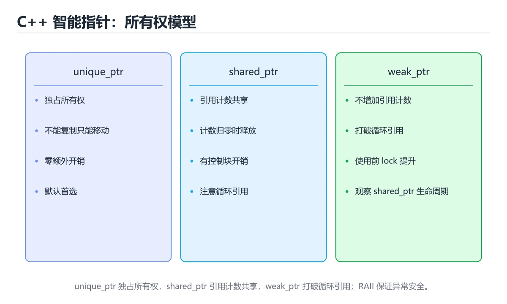

# 内存管理与智能指针




> 内容更新时间：2026-10-06 · 学习阶段：进阶 · 预计用时：50 分钟

## 本节知识框架

**课程定位**：所属分类 `cpp`（C++），课程主题 `内存管理与智能指针`，学习阶段 进阶，建议用时 50 分钟。

本课主线：栈与堆、RAII、unique_ptr/shared_ptr/weak_ptr 与内存问题排查。

**学完本课应当能够**
- 说清 `unique_ptr` 与 `内存` 的含义与区别，并各举一个正例和一个反例。
- 用本课示例验证 `RAII` 的行为，记录输入、输出与失败条件。
- 遇到「`new` 后忘 `delete`」这类问题时，能说出触发条件与修复顺序。

### 从概念到验证的学习链条

1. `unique_ptr`：先掌握 选择顺序：优先 `unique_ptr`，需要共享时才用 `shared_ptr`，观察者用 `weak_ptr`，再用它解释 `内存` 为什么会出现。
2. `内存`：先掌握 程序运行时保存指令、数据与对象的高速可寻址存储，再用它解释 `RAII` 为什么会出现。
3. `RAII`：先掌握 RAII 是 C++ 管理资源的核心思想：把资源的生命周期绑在对象上，再用它解释 `移动语义` 为什么会出现。
4. `移动语义`：先掌握 用右值引用把资源的所有权转移出去而不是深拷贝，这是 unique_ptr 能放进容器的原因，再用它解释 本课示例的观察结果 为什么会出现。

**先修与衔接**：本课是「C++」分类的第 10 课。先修内容：《指针与引用》。《指针与引用》里的 `指针`、`引用` 是本课的前提。相关或后续课程：《类与面向对象》。

### 完成判据

- **定义关**：不看正文也能说明 `unique_ptr` 是 选择顺序：优先 `unique_ptr`，需要共享时才用 `shared_ptr`，观察者用 `weak_ptr`，并指出一个反例。
- **机制关**：能按“输入 → 转换 → 输出 → 验证”复述 `内存管理与智能指针`，而不是只背结论。
- **示例关**：能运行或推演 `内存管理与智能指针` 的 `cpp` 示例，并说明一个真实出现的标识符或字面量。
- **证据关**：能指出 `内存管理与智能指针` 示例里的 调用了 `demo()`，并说明它支持或反驳了本课的哪一条结论。
- **排错关**：能复现 `new` 后忘 `delete`，记录现象并按 用智能指针 修复。
- **迁移关**：能把 `内存`、`RAII`、`unique_ptr`、`shared_ptr` 放进一个与 `内存管理与智能指针` 不同的项目场景，并保持输入与验证条件可追踪。
- **复盘关**：学完 `内存管理与智能指针` 后，用一句话写下仍然不确定的结论，并列出下一次验证需要的输入、环境和成功判据。

### 复习清单

- [ ] 能不看正文复述本课核心术语，并指出一个边界或反例。
- [ ] 能运行或推演本课示例，记录输入、输出与失败现象。
- [ ] 能完成一次自测，并把错题对照错误表定位原因。

## 核心概念定义

| 术语 | 操作性定义 | 常见边界与风险 |
| --- | --- | --- |
| unique_ptr | 选择顺序：优先 unique_ptr，需要共享时才用 shared_ptr，观察者用 weak_ptr。 | 易错：容器销毁不释放元素；正确做法是存 `std::unique_ptr<T>` 或直接存值。 |
| 内存 | 程序运行时保存指令、数据与对象的高速可寻址存储。 | 易错：内存泄漏；正确做法是用智能指针。 |
| RAII | RAII 是 C++ 管理资源的核心思想：把资源的生命周期绑在对象上。 | 越界、悬垂引用与释放顺序会破坏结论，必须在边界输入下复验。 |
| 移动语义 | 用右值引用把资源的所有权转移出去而不是深拷贝，这是 unique_ptr 能放进容器的原因。 | 越界、悬垂引用与释放顺序会破坏结论，必须在边界输入下复验。 |

## 原理与运行机制

### 机制总览

**教材衔接：rule of zero / three / five**

- **rule of zero**：不需要手动管理资源时，不写析构、拷贝、移动函数。
- **rule of three**：需要自定义析构、拷贝构造、拷贝赋值中的一个，通常三个都要。
- **rule of five**：再加上移动构造与移动赋值。

**教材衔接：工具速查**

| 工具 | 能发现的问题 | 使用方式 |
| --- | --- | --- |
| `-fsanitize=address`（ASan） | 越界、UAF、内存泄漏 | 编译加参数后运行程序 |
| `-fsanitize=undefined`（UBSan） | 整数溢出、空指针解引用等 UB | 常与 ASan 同时开启 |
| `valgrind --leak-check=full` | 泄漏、非法访问（无需重编译） | 运行变慢，适合调试 |
| `-Wall -Wextra` | 未使用变量、可疑比较 | 编译期即可发现 |
| `clang-tidy` | 现代 C++ 反模式、可读性问题 | 静态检查，接入 CI |

**教材衔接：版本与时效**

- C++23 已在主流工具链落地；升级 内存 相关代码前先确认标准库实现情况。
- 升级前确认 内存 的兼容范围，把不可回退的改动单独拆成一次提交。

### 升级检查清单

- 先固定当前版本，跑通全部示例与测验，再升级工具链。
- 只改 内存 的版本变量，记录编译、测试与产物体积的变化。
- 升级后重点回归 内存 的默认值、警告信息与错误格式。
- 升级完成后更新本课「最后复核 / 下次复核」日期，并记录 内存 的版本变化。

### 机制拆解：每一步的输入、动作与输出

#### 1. `unique_ptr`
- 输入：`内存`；本步把 选择顺序：优先 `unique_ptr`，需要共享时才用 `shared_ptr`，观察者用 `weak_ptr` 当作判断规则。
- 动作：围绕 `unique_ptr` 保留中间状态，并记录它与 `内存` 的对应关系。
- 输出：`内存`，它可以被下一段代码、测试或记录继续使用。
- `unique_ptr` 的失败条件：当用 `std::vector<T*>` 存 `new` 出来的对象时，会出现容器销毁不释放元素。

#### 2. `内存`
- 输入：`unique_ptr`；本步把 程序运行时保存指令、数据与对象的高速可寻址存储 当作判断规则。
- 动作：围绕 `内存` 保留中间状态，并记录它与 `RAII` 的对应关系。
- 输出：`RAII`，它可以被下一段代码、测试或记录继续使用。
- `内存` 的失败条件：当`new` 后忘 `delete`时，会出现内存泄漏。

#### 3. `RAII`
- 输入：`内存`；本步把 RAII 是 C++ 管理资源的核心思想：把资源的生命周期绑在对象上 当作判断规则。
- 动作：围绕 `RAII` 保留中间状态，并记录它与 `移动语义` 的对应关系。
- 输出：`移动语义`，它可以被下一段代码、测试或记录继续使用。
- `RAII` 的失败条件：越界、悬垂引用与释放顺序会破坏结论，必须在边界输入下复验。

#### 4. `移动语义`
- 输入：`RAII`；本步把 用右值引用把资源的所有权转移出去而不是深拷贝，这是 unique_ptr 能放进容器的原因 当作判断规则。
- 动作：围绕 `移动语义` 保留中间状态，并记录它与 `demo` 的对应关系。
- 输出：`demo`，它可以被下一段代码、测试或记录继续使用。
- `移动语义` 的失败条件：越界、悬垂引用与释放顺序会破坏结论，必须在边界输入下复验。

### 示例中的可观察事实

1. 调用了 `demo()`；它对应的课程主题是 `内存管理与智能指针`。
2. 调用了 `int()`；它对应的课程主题是 `内存管理与智能指针`。

### 复现实验记录

- 环境：`内存管理与智能指针` 使用 `cpp` 示例，固定 `内存`、`RAII`、`unique_ptr`、`shared_ptr` 作为第一组条件。
- 首轮输入：先确认 调用了 `demo()`，预测 `unique_ptr` 会怎样变化。
- 基线观察：记录命令、输入、输出和错误原文，不用截图代替可复制的文本。
- 单变量修改：只改变 `内存`，观察 `移动语义` 是否仍满足定义。
- 失败注入：复现 `new` 后忘 `delete`，确认现象是 内存泄漏。
- 记录结论：把“修改前、修改后、预期变化、实际变化”写成四列表，这样复盘 `内存管理与智能指针` 时才能区分概念错误与实现错误。

## 典型应用场景

- **`new` 后忘 `delete`**：典型现象是内存泄漏；正确做法是用智能指针。
- **返回局部对象的指针**：典型现象是悬垂引用；正确做法是返回值或智能指针。
- **`shared_ptr` 循环引用**：典型现象是计数永不归零；正确做法是一边改用 `weak_ptr`。
- **大量递归**：典型现象是栈溢出；正确做法是改循环或增大栈。

### 最小验证场景

- 准备：保留 `cpp` 示例的原始输入，先记录 `内存管理与智能指针` 的基线输出和完整运行命令。
- 观察：先核对 调用了 `demo()`，再改变一个与 `unique_ptr` 相关的条件。
- 判定：新结果与 `内存管理与智能指针` 的基线不同不等于错误；只有当差异破坏了 `unique_ptr` 的定义或错误表中的约束，才判定为失败。

### 选择与边界

- 使用 `unique_ptr` 时，先满足它的定义：选择顺序：优先 `unique_ptr`，需要共享时才用 `shared_ptr`，观察者用 `weak_ptr`；易错：容器销毁不释放元素；正确做法是存 `std::unique_ptr<T>` 或直接存值。
- 使用 `内存` 时，先满足它的定义：程序运行时保存指令、数据与对象的高速可寻址存储；易错：内存泄漏；正确做法是用智能指针。
- 使用 `RAII` 时，先满足它的定义：RAII 是 C++ 管理资源的核心思想：把资源的生命周期绑在对象上；越界、悬垂引用与释放顺序会破坏结论，必须在边界输入下复验。
- 使用 `移动语义` 时，先满足它的定义：用右值引用把资源的所有权转移出去而不是深拷贝，这是 unique_ptr 能放进容器的原因；越界、悬垂引用与释放顺序会破坏结论，必须在边界输入下复验。

## 代码/协议/SQL 示例

### 最小可验证示例

```cpp
void demo() {
    int stack_value = 1;             // 栈：自动分配、离开作用域自动释放
    int* heap_value = new int(2);    // 堆：手动申请
    delete heap_value;               // 必须手动释放，否则内存泄漏
    heap_value = nullptr;            // 释放后置空，避免悬垂指针
}
```

**教材衔接：栈与堆**

数组要用 `new[]` / `delete[]` 配对：

```cpp
int* arr = new int[10];
delete[] arr;
```

**教材衔接：RAII：C++ 的资源管理思想**

**资源获取即初始化**：把资源的生命周期绑定到对象生命周期上，析构函数自动释放。它是智能指针、锁、文件流的共同基础。

```cpp
class FileHandle {
public:
    explicit FileHandle(const char* path) : file_(std::fopen(path, "r")) {}
    ~FileHandle() { if (file_) std::fclose(file_); }

    FileHandle(const FileHandle&) = delete;             // 禁止拷贝
    FileHandle& operator=(const FileHandle&) = delete;
private:
    std::FILE* file_;
};
```

**教材衔接：三种智能指针**

```cpp
#include <memory>

// 独占所有权：不能拷贝，只能移动
std::unique_ptr<int> u = std::make_unique<int>(10);
std::unique_ptr<int> u2 = std::move(u);

// 共享所有权：引用计数为 0 时释放
std::shared_ptr<int> s = std::make_shared<int>(20);
std::shared_ptr<int> s2 = s;          // 计数变为 2
std::cout << s.use_count();

// 弱引用：不增加计数，用于打破循环引用
std::weak_ptr<int> w = s;
if (auto locked = w.lock()) {
    std::cout << *locked;
}
```

选择顺序：优先 `unique_ptr`，需要共享时才用 `shared_ptr`，观察者用 `weak_ptr`。

**教材衔接：排查工具**

```bash
g++ -fsanitize=address,undefined -g main.cpp -o main   # ASan + UBSan
valgrind --leak-check=full ./main                      # Linux
```

**教材衔接：智能指针选型速查**

| 指针 | 所有权 | 拷贝 | 典型用途 | 注意点 |
| --- | --- | --- | --- | --- |
| `T obj` / `T* p` | 无（裸指针不拥有） | 任意 | 观察、传参（能不用指针就不用） | 生命周期由人保证，容易悬空 |
| `std::unique_ptr<T>` | 独占 | 禁止，只能 `std::move` | 工厂返回值、类成员独占资源 | 零额外开销，默认首选 |
| `std::shared_ptr<T>` | 共享（引用计数） | 允许 | 多方共同持有、异步回调 | 有计数开销，小心循环引用 |
| `std::weak_ptr<T>` | 不增加计数 | 允许 | 打破 `shared_ptr` 环、缓存观察 | 用前必须 `lock()` 并判空 |
| `std::string` / `std::vector` | 独占且自带 RAII | 深拷贝（可按需 move） | 绝大多数数据容器 | 优先用它替代手工 `new[]` |

创建与转换速查：

```cpp
auto p = std::make_unique<Widget>(1, 2);   // C++14 起推荐写法，异常安全
std::shared_ptr<Widget> s = std::make_shared<Widget>(1, 2);
std::weak_ptr<Widget> w = s;               // 只观察，不增加计数

if (auto locked = w.lock()) {              // 使用前提升为 shared_ptr
    locked->draw();
}

std::unique_ptr<Widget> moved = std::move(p);  // 转移所有权，p 变为 nullptr
std::shared_ptr<Widget> shared2 = std::move(moved); // unique -> shared 也可
```

**教材衔接：零基础详解：栈、堆与 RAII**

### 一句话说清它是什么

程序的内存分成几块区域，最常打交道的是**栈**（自动管理、速度快、空间小）和**堆**（手动申请、空间大、需要自己管）。
RAII 是 C++ 管理资源的核心思想：**把资源的生命周期绑在对象上**。

### 用生活比喻理解

| 区域 | 比喻 | 特点 |
| --- | --- | --- |
| 栈 | 快餐店的托盘 | 拿了就用，出门自动回收，容量有限 |
| 堆 | 自租仓库 | 需要自己申请和退租，空间大，忘退就浪费 |
| 静态区 | 公司固定资产 | 程序启动到结束一直存在 |
| 常量区 | 刻好的石碑 | 只读，如字符串字面量 |
| RAII | 自动续费的托管服务 | 对象销毁时自动释放资源 |

### 栈与堆的对比

| 对比项 | 栈 | 堆 |
| --- | --- | --- |
| 分配速度 | 极快（移动指针） | 较慢（找空闲块） |
| 生命周期 | 离开作用域自动释放 | 手动或智能指针管理 |
| 空间大小 | 通常几 MB | 受限于可用内存 |
| 典型写法 | `int x = 1;` | `new int(1)` 或 `make_unique` |
| 常见问题 | 递归太深栈溢出 | 泄漏、悬垂、碎片 |

### 一段代码看清生命周期

```cpp
#include <iostream>
#include <string>

struct Tracer {
    std::string name;
    explicit Tracer(std::string n) : name(std::move(n)) {
        std::cout << "构造 " << name << '\n';
    }
    ~Tracer() {
        std::cout << "析构 " << name << '\n';   // 离开作用域自动执行
    }
};

void demo() {
    Tracer a("a");
    {
        Tracer b("b");
    }                       // 先析构 b
    Tracer c("c");
}                           // 再析构 c，最后析构 a

int main() { demo(); }
```

输出顺序体现两条规则：**先构造的后析构**，**离开作用域就析构**。

### RAII：资源交给对象管

```cpp
#include <fstream>
#include <memory>
#include <mutex>

{
    std::ofstream file("out.txt");       // 构造时打开
    file << "hello\n";
}                                        // 析构时自动关闭

{
    std::lock_guard<std::mutex> lock(mtx);   // 构造时加锁
    // 临界区
}                                        // 析构时自动解锁

auto buf = std::make_unique<char[]>(1024);   // 独占所有权
// 函数结束自动释放，不需要 delete
```

| 资源 | 推荐管理方式 |
| --- | --- |
| 动态内存 | `unique_ptr` / `shared_ptr` |
| 文件 | `std::fstream` |
| 互斥锁 | `lock_guard` / `unique_lock` |
| 数组 | `std::vector` / `std::array` |
| 手写 `new` / `delete` | 尽量避免 |

### 三种智能指针

| 指针 | 所有权 | 能否复制 | 典型用途 |
| --- | --- | --- | --- |
| `unique_ptr` | 独占 | 不能（可移动） | **默认选择** |
| `shared_ptr` | 共享，引用计数 | 能 | 多处共享同一对象 |
| `weak_ptr` | 不增加计数 | —— | 打破 `shared_ptr` 循环引用 |

```cpp
auto p = std::make_unique<int>(5);
auto q = std::move(p);          // 所有权转移，p 变成 nullptr

auto s1 = std::make_shared<int>(7);
auto s2 = s1;                   // 引用计数变为 2
std::cout << s1.use_count();    // 2
```

### 新手最容易踩的八个坑

| 坑 | 现象 | 正确做法 |
| --- | --- | --- |
| `new` 后忘 `delete` | 内存泄漏 | 用智能指针 |
| 返回局部对象的指针 | 悬垂引用 | 返回值或智能指针 |
| `shared_ptr` 循环引用 | 计数永不归零 | 一边改用 `weak_ptr` |
| 大量递归 | 栈溢出 | 改循环或增大栈 |
| 在容器里存引用 | 扩容后失效 | 存索引或智能指针 |
| `vector` 扩容后旧指针失效 | 数据错乱 | 扩容前预留 `reserve` |
| 手写拷贝却忘了深拷贝 | 双重释放 | 遵循三或五法则，或用智能指针 |
| 把大对象按值传递 | 频繁拷贝 | 用 `const T&` |

### 手把手练习：用 RAII 包一个简单资源

```cpp
#include <iostream>
#include <string>

class FileHandle {
public:
    explicit FileHandle(const std::string& name) : name_(name) {
        std::cout << "打开 " << name_ << '\n';
    }
    ~FileHandle() {
        std::cout << "关闭 " << name_ << '\n';
    }
    FileHandle(const FileHandle&) = delete;             // 不允许复制
    FileHandle& operator=(const FileHandle&) = delete;

private:
    std::string name_;
};

int main() {
    FileHandle f("data.txt");
    std::cout << "处理中……\n";
    // 即使这里抛异常，f 的析构也会执行
}
```

### 学完自测

- [ ] 能说出栈与堆的三点区别。
- [ ] 能解释 RAII 的核心思想。
- [ ] 知道 `unique_ptr` 与 `shared_ptr` 的取舍。
- [ ] 能说出三种智能指针各自解决什么问题。
- [ ] 知道为什么「构造顺序与析构顺序相反」。

**运行方式**：运行 `内存管理与智能指针` 的示例时，用 `g++ -std=c++17 文件名.cpp -o demo` 编译后运行；先看编译器报错的第一条。

### 示例精读：先找证据，再改一个条件

1. 调用了 `demo()`；它出现在 `内存管理与智能指针` 的示例中，阅读时先确认它前后各发生了什么。
2. 调用了 `int()`；它出现在 `内存管理与智能指针` 的示例中，阅读时先确认它前后各发生了什么。
- 在 `内存管理与智能指针` 中与 `unique_ptr` 对照：示例必须能支持 选择顺序：优先 `unique_ptr`，需要共享时才用 `shared_ptr`，观察者用 `weak_ptr`，否则说明这一段还缺少实现或验证步骤。
- 在 `内存管理与智能指针` 中与 `内存` 对照：示例必须能支持 程序运行时保存指令、数据与对象的高速可寻址存储，否则说明这一段还缺少实现或验证步骤。
- 在 `内存管理与智能指针` 中与 `RAII` 对照：示例必须能支持 RAII 是 C++ 管理资源的核心思想：把资源的生命周期绑在对象上，否则说明这一段还缺少实现或验证步骤。
- 在 `内存管理与智能指针` 中与 `移动语义` 对照：示例必须能支持 用右值引用把资源的所有权转移出去而不是深拷贝，这是 unique_ptr 能放进容器的原因，否则说明这一段还缺少实现或验证步骤。

## 时间/空间复杂度或性能分析

**教材衔接：常见内存问题**

| 问题 | 说明 |
| --- | --- |
| 内存泄漏 | `new` 之后忘记 `delete`，或 `shared_ptr` 循环引用 |
| 悬垂指针 | 对象已释放仍在使用 |
| 重复释放 | 同一块内存 `delete` 两次 |
| 越界访问 | 下标超出数组范围 |

**测量方法**：以 `内存管理与智能指针` 的 `内存` 场景为对象，固定输入跑一遍记录基线，再把规模或并发度提高一个数量级复测；两次结果的差值与波动范围才是结论依据。

### 需要控制的变量与记录项

- `内存管理与智能指针` 的 `内存`：固定它的版本、输入范围和资源上限，分别记录速度、内存与失败率的变化。
- `内存管理与智能指针` 的 `RAII`：固定它的版本、输入范围和资源上限，分别记录速度、内存与失败率的变化。
- `内存管理与智能指针` 的 `unique_ptr`：固定它的版本、输入范围和资源上限，分别记录速度、内存与失败率的变化。
- `内存管理与智能指针` 的 `shared_ptr`：固定它的版本、输入范围和资源上限，分别记录速度、内存与失败率的变化。
- `内存管理与智能指针` 的 `内存泄漏`：固定它的版本、输入范围和资源上限，分别记录速度、内存与失败率的变化。
- `内存管理与智能指针` 中 `unique_ptr` 的边界：易错：容器销毁不释放元素；正确做法是存 `std::unique_ptr<T>` 或直接存值。达到边界时不要外推，必须重新测量。
- `内存管理与智能指针` 中 `内存` 的边界：易错：内存泄漏；正确做法是用智能指针。达到边界时不要外推，必须重新测量。
- `内存管理与智能指针` 中 `RAII` 的边界：越界、悬垂引用与释放顺序会破坏结论，必须在边界输入下复验。达到边界时不要外推，必须重新测量。
- `内存管理与智能指针` 中 `移动语义` 的边界：越界、悬垂引用与释放顺序会破坏结论，必须在边界输入下复验。达到边界时不要外推，必须重新测量。
- `内存管理与智能指针` 的代码证据：先验证 调用了 `demo()`，再记录该路径的输入规模与耗时；只看代码行数不能推出复杂度。

## 常见误区与易错点

| 容易写错的做法 | 实际现象 | 原因与正确做法 |
| --- | --- | --- |
| `new` 后忘 `delete` | 内存泄漏 | 用智能指针 |
| 返回局部对象的指针 | 悬垂引用 | 返回值或智能指针 |
| `shared_ptr` 循环引用 | 计数永不归零 | 一边改用 `weak_ptr` |
| 大量递归 | 栈溢出 | 改循环或增大栈 |
| 在容器里存引用 | 扩容后失效 | 存索引或智能指针 |
| `vector` 扩容后旧指针失效 | 数据错乱 | 扩容前预留 `reserve` |
| 手写拷贝却忘了深拷贝 | 双重释放 | 遵循三或五法则，或用智能指针 |
| 把大对象按值传递 | 频繁拷贝 | 用 `const T&` |
| `new` 之后某条分支提前 `return` | 内存泄漏 | 用智能指针或容器管理，让析构自动执行 |
| `new` / `delete` 与 `malloc` / `free` 混用 | 未定义行为，可能崩溃 | 严格配对：`new` 对 `delete`，`malloc` 对 `free` |
| 两个 `shared_ptr` 各自 `shared_ptr<T>(raw)` | 双重释放 | 只能从一次 `make_shared` 或另一个 `shared_ptr` 复制 |
| `shared_ptr` 互相持有 | 引用计数永不归零，内存泄漏 | 其中一侧改成 `weak_ptr` |
| 返回局部变量的引用或指针 | 悬空引用，行为未定义 | 按值返回，或返回智能指针 / 容器 |
| `std::move` 之后再使用源对象 | 值不确定 | move 后只能重新赋值或销毁，不能读值 |
| 用 `std::vector<T*>` 存 `new` 出来的对象 | 容器销毁不释放元素 | 存 `std::unique_ptr<T>` 或直接存值 |
| 自定义类持有裸指针成员却不写析构 | 泄漏或重复释放 | 优先用成员对象 / 智能指针，遵循 Rule of Zero |
| `delete` 后指针仍被使用 | 悬空指针，随机崩溃 | `delete` 后置 `= nullptr`，或用智能指针 |
| 大对象按值传参 | 多余拷贝，性能下降 | 只读传 `const T&`，需要转移时按值 + `std::move` |
| new / delete 与 malloc / free 混用 | 未定义行为，可能崩溃。 | 严格配对：new 对 delete，malloc 对 free。 |
| shared_ptr 互相持有 | 引用计数永不归零，内存泄漏。 | 其中一侧改成 weak_ptr。 |

### 现场 1：`new` 后忘 `delete`

**症状**：内存泄漏。

**根因与修复**：用智能指针。

**自检**：在本课示例里复现「`new` 后忘 `delete`」，改成用智能指针后重跑；如果症状消失且失败路径按预期变化，说明定位正确。

### 现场 2：返回局部对象的指针

**症状**：悬垂引用。

**根因与修复**：返回值或智能指针。

**自检**：在本课示例里复现「返回局部对象的指针」，改成返回值或智能指针后重跑；如果症状消失且失败路径按预期变化，说明定位正确。

### 现场 3：`shared_ptr` 循环引用

**症状**：计数永不归零。

**根因与修复**：一边改用 `weak_ptr`。

**自检**：在本课示例里复现「`shared_ptr` 循环引用」，改成一边改用 `weak_ptr`后重跑；如果症状消失且失败路径按预期变化，说明定位正确。

### 现场 4：大量递归

**症状**：栈溢出。

**根因与修复**：改循环或增大栈。

**自检**：在本课示例里复现「大量递归」，改成改循环或增大栈后重跑；如果症状消失且失败路径按预期变化，说明定位正确。

### 现场 5：在容器里存引用

**症状**：扩容后失效。

**根因与修复**：存索引或智能指针。

**自检**：在本课示例里复现「在容器里存引用」，改成存索引或智能指针后重跑；如果症状消失且失败路径按预期变化，说明定位正确。

### 现场 6：`vector` 扩容后旧指针失效

**症状**：数据错乱。

**根因与修复**：扩容前预留 `reserve`。

**自检**：在本课示例里复现「`vector` 扩容后旧指针失效」，改成扩容前预留 `reserve`后重跑；如果症状消失且失败路径按预期变化，说明定位正确。

### 现场 7：手写拷贝却忘了深拷贝

**症状**：双重释放。

**根因与修复**：遵循三或五法则，或用智能指针。

**自检**：在本课示例里复现「手写拷贝却忘了深拷贝」，改成遵循三或五法则，或用智能指针后重跑；如果症状消失且失败路径按预期变化，说明定位正确。

### 现场 8：把大对象按值传递

**症状**：频繁拷贝。

**根因与修复**：用 `const T&`。

**自检**：在本课示例里复现「把大对象按值传递」，改成用 `const T&`后重跑；如果症状消失且失败路径按预期变化，说明定位正确。

### 现场 9：`new` 之后某条分支提前 `return`

**症状**：内存泄漏。

**根因与修复**：用智能指针或容器管理，让析构自动执行。

**自检**：在本课示例里复现「`new` 之后某条分支提前 `return`」，改成用智能指针或容器管理，让析构自动执行后重跑；如果症状消失且失败路径按预期变化，说明定位正确。

## 与其他知识点的关系

- **先修**：`指针与引用`。本课默认这些内容已经掌握。
- **相关或后续**：`类与面向对象`。本课术语会在这些课程里继续使用。
- **术语归属**：`unique_ptr`、`内存`、`RAII` 的定义以本课「核心概念定义」为准，换到其他课程时先确认定义是否被改写。
- 同一分类的《类与面向对象》也涉及 `RAII`；两课衔接时先确认这个术语的定义是否一致。
- 同一分类的《实战：C++ HTTP JSON 服务》也涉及 `RAII`；两课衔接时先确认这个术语的定义是否一致。

### 先修与后续术语接口

- `指针与引用`：两者通过本分类的学习顺序衔接，阅读时重点比较各自的输入与失败条件。
- `类与面向对象`：共同关键词 `RAII`。

### 容易混淆的相邻概念

- `unique_ptr` 与 `内存`：前者强调 选择顺序：优先 `unique_ptr`，需要共享时才用 `shared_ptr`，观察者用 `weak_ptr`；后者强调 程序运行时保存指令、数据与对象的高速可寻址存储。判断时分别检查两条定义的适用范围，不要只看名称相似就互换。
- `内存` 与 `RAII`：前者强调 程序运行时保存指令、数据与对象的高速可寻址存储；后者强调 RAII 是 C++ 管理资源的核心思想：把资源的生命周期绑在对象上。判断时分别检查两条定义的适用范围，不要只看名称相似就互换。
- `RAII` 与 `移动语义`：前者强调 RAII 是 C++ 管理资源的核心思想：把资源的生命周期绑在对象上；后者强调 用右值引用把资源的所有权转移出去而不是深拷贝，这是 unique_ptr 能放进容器的原因。判断时分别检查两条定义的适用范围，不要只看名称相似就互换。

## 自测题与参考答案

> 先独立作答，再对照参考答案；答案都能在本课正文、术语表或错误表里找到依据。

### 自测 1（概念复述）

不看正文，写出 `unique_ptr` 的操作性定义，并说明它与 `内存` 的区别。

**参考答案**：选择顺序：优先 `unique_ptr`，需要共享时才用 `shared_ptr`，观察者用 `weak_ptr`。

`内存` 的定位是：程序运行时保存指令、数据与对象的高速可寻址存储；两者的差别要从适用对象与失败模式上说明。

### 自测 2（排错）

本课错误表记录了「`new` 后忘 `delete`」这类做法。请写出它会出现的现象、根因，以及修复顺序。

**参考答案**：现象是内存泄漏；正确做法是用智能指针。修复时先复现现象并保留证据，再改动一处假设重跑，确认现象消失。

### 自测 3（动手验证）

运行本课的 `cpp` 示例，把其中的 `1` 换成一个边界值后重新运行，记录输出与错误信息。

**参考答案**：正常输入下 `cpp` 示例应当复现正文给出的结果；把 `1` 换成边界值后，如果结果改变或报错，先核对它是否满足 `内存管理与智能指针` 中`unique_ptr` 的适用范围，再检查错误表里是否有同类现象。

### 自测 4（代码阅读）

阅读本课开头的 `cpp` 示例，说明它体现了`unique_ptr` 的哪一条性质，并指出改动哪个输入会让这条性质不再成立。

**参考答案**：`unique_ptr` 的定义是 选择顺序：优先 `unique_ptr`，需要共享时才用 `shared_ptr`，观察者用 `weak_ptr`，示例正是在实现这条定义。改动与 `unique_ptr` 有关的一个输入后，如果结果不再符合 `内存管理与智能指针` 的正文描述，就说明该性质只在当前前提成立。

### 自测 5（迁移）

把 `内存管理与智能指针` 的方法迁移到自己的项目：围绕 `unique_ptr` 写出一个与错误表同类的风险点，并说明触发条件和检验方式。

**参考答案**：例如「shared_ptr 互相持有」，它会导致引用计数永不归零，内存泄漏；检验方式是按其中一侧改成 weak_ptr改一处再复现，确认现象消失且没有引入新的失败分支。

### 自测 6（对比）

用一个表格对比 `unique_ptr` 与 `内存`：各写一行适用场景、一行失败表现。

**参考答案**：`unique_ptr` 的定义是选择顺序：优先 `unique_ptr`，需要共享时才用 `shared_ptr`，观察者用 `weak_ptr`；`内存` 的定义是程序运行时保存指令、数据与对象的高速可寻址存储。两者的失败表现分别对应本课错误表里与本术语相关的行。

### 自测 7（排错顺序）

面对「`new` 后忘 `delete`」引发的问题，请把“复现 内存泄漏 → 保留证据 → 用智能指针 → 回归验证”四步写成可执行的检查清单。

**参考答案**：第一步按内存泄漏复现；第二步记录输入、版本与完整报错；第三步按用智能指针只改一处；第四步重跑并确认失败路径也按预期变化。

### 自测 8（边界判断）

针对 `移动语义`，分别写出“可以使用”的条件和“结论不再成立”的条件。

**参考答案**：越界、悬垂引用与释放顺序会破坏结论，必须在边界输入下复验。 同时要把 `移动语义` 的定义 用右值引用把资源的所有权转移出去而不是深拷贝，这是 unique_ptr 能放进容器的原因 与实际输入逐项对照。

### 自测 9（机制重建）

不看正文，按输入、转换、输出、验证四段重建 `unique_ptr` → `内存` → `RAII` → `移动语义` 的作用链。

**参考答案**：起点是 `unique_ptr` 的定义 选择顺序：优先 `unique_ptr`，需要共享时才用 `shared_ptr`，观察者用 `weak_ptr`；中间每一步都保留可观察状态；终点由 `移动语义` 检查，失败时回到错误表定位第一个偏离定义的步骤。

### 自测 10（综合排错）

在 `内存管理与智能指针` 中，现象是 引用计数永不归零，内存泄漏。请围绕 shared_ptr 互相持有 写出最小复现、关键证据、修复动作和回归验证，并说明为什么不能只凭一次运行下结论。

**参考答案**：先复现 shared_ptr 互相持有，记录输入与完整错误；再按 其中一侧改成 weak_ptr 只改一处。回归时同时跑正常路径和边界路径，只有两次结果都可解释，才把修复视为完成。

### 自测 11（一分钟复述）

用每分钟约 200 字的速度复述 `内存管理与智能指针`：先给主问题，再按顺序说出 `unique_ptr`、`内存`、`RAII`、`移动语义`，最后给一个失败案例。

**自评标准**：主问题必须对应 栈与堆、RAII、unique_ptr/shared_ptr/weak_ptr 与内存问题排查；每个术语都要能接上一句定义或边界；失败案例必须写成可观察现象，不能用“可能有风险”代替证据。

## 术语速查

| 术语 | 一句话说明 |
| --- | --- |
| `unique_ptr` | 选择顺序：优先 `unique_ptr`，需要共享时才用 `shared_ptr`，观察者用 `weak_ptr`。 |
| `内存` | 程序运行时保存指令、数据与对象的高速可寻址存储。 |
| `RAII` | RAII 是 C++ 管理资源的核心思想：把资源的生命周期绑在对象上。 |
| `移动语义` | 用右值引用把资源的所有权转移出去而不是深拷贝，这是 unique_ptr 能放进容器的原因。 |

**术语关系**：`unique_ptr`（选择顺序：优先 `unique_ptr`） → `内存`（程序运行时保存指令、数据与对象的高速可寻址存储） → `RAII`（RAII 是 C++ 管理资源的核心思想：把资源的生命周期绑在对象上） → `移动语义`（用右值引用把资源的所有权转移出去而不是深拷贝）。

## 考点精讲

`内存管理与智能指针` 的题库有 6 道题，下面逐题给出题干、正确项与判断依据：先自己作答，再核对正确项，最后回到正文对应小节复核。

### 考点 1：第 1 题

- **题目**：RAII 的核心思想是？
- **正确项**：把资源生命周期绑定到对象生命周期
- **判断依据**：这道题落在术语 `RAII` 上：RAII 是 C++ 管理资源的核心思想：把资源的生命周期绑在对象上。复习时把 `RAII` 的定义、适用边界和一个反例一起说清楚，再回到「核心概念定义」核对原文。

### 考点 2：第 2 题

- **题目**：以下哪组做法有助于避免内存泄漏？
- **正确项**：使用智能指针并避免循环引用
- **判断依据**：这道题落在术语 `内存` 上：程序运行时保存指令、数据与对象的高速可寻址存储。复习时把 `内存` 的定义、适用边界和一个反例一起说清楚，再回到「核心概念定义」核对原文。

### 考点 3：第 3 题

- **题目**：按“内存管理与智能指针”中 内存、RAII、unique_ptr 的实践顺序，把四个步骤排成从准备到复盘的合理顺序。
- **正确项**：先明确 内存 的输入、输出与约束 → 写出最小示例并核对 RAII 的基线结果 → 只改一个变量，记录边界与失败路径的变化 → 固定版本与证据，把“内存管理与智能指针”的结论写成可复现记录
- **判断依据**：这道题落在术语 `unique_ptr` 上：选择顺序：优先 `unique_ptr`，需要共享时才用 `shared_ptr`，观察者用 `weak_ptr`。复习时把 `unique_ptr` 的定义、适用边界和一个反例一起说清楚，再回到「核心概念定义」核对原文。

### 考点 4：第 4 题

- **题目**：new/delete 与 malloc/free 的关键区别是？
- **正确项**：new 会调用构造函数并返回正确类型
- **判断依据**：这道题检验本课主问题：栈与堆、RAII、unique_ptr/shared_ptr/weak_ptr 与内存问题排查。复习时先复述本课主问题，再举一个会让结论失效的输入。

### 考点 5：第 5 题

- **题目**：下面代码用 new[] 分配数组，却可能产生未定义行为。应怎样修复？
- **正确项**：使用 delete[] p;
- **判断依据**：这道题检验本课主问题：栈与堆、RAII、unique_ptr/shared_ptr/weak_ptr 与内存问题排查。复习时先复述本课主问题，再举一个会让结论失效的输入。

### 考点 6：第 6 题

- **题目**：关于 `unique_ptr`，下列哪些说法与 `内存管理与智能指针` 的正文一致？判断时以栈与堆、RAII、unique_ptr/shared_ptr/weak_ptr 与内存问题排查。为主线。（多选）
- **正确项**：使用智能指针并避免循环引用；把资源生命周期绑定到对象生命周期
- **判断依据**：这道题落在术语 `unique_ptr` 上：选择顺序：优先 `unique_ptr`，需要共享时才用 `shared_ptr`，观察者用 `weak_ptr`。复习时把 `unique_ptr` 的定义、适用边界和一个反例一起说清楚，再回到「核心概念定义」核对原文。

### 考点 7：`unique_ptr`

- **要点**：选择顺序：优先 `unique_ptr`，需要共享时才用 `shared_ptr`，观察者用 `weak_ptr`。
- **unique_ptr 的边界**：易错：容器销毁不释放元素；正确做法是存 `std::unique_ptr<T>` 或直接存值。

### 考点 8：`内存`

- **要点**：程序运行时保存指令、数据与对象的高速可寻址存储。
- **内存 的边界**：易错：内存泄漏；正确做法是用智能指针。

### 考点 9：`RAII`

- **要点**：RAII 是 C++ 管理资源的核心思想：把资源的生命周期绑在对象上。
- **RAII 的边界**：越界、悬垂引用与释放顺序会破坏结论，必须在边界输入下复验。

### 考点 10：`移动语义`

- **要点**：用右值引用把资源的所有权转移出去而不是深拷贝，这是 unique_ptr 能放进容器的原因。
- **移动语义 的边界**：越界、悬垂引用与释放顺序会破坏结论，必须在边界输入下复验。

### 考点 11：排错——`new` 后忘 `delete`

- **现象**：内存泄漏。
- **处理**：用智能指针。

### 考点 12：排错——返回局部对象的指针

- **现象**：悬垂引用。
- **处理**：返回值或智能指针。

### 考点 13：综合辨析——`unique_ptr` 与 `移动语义`

- **辨析点**：`unique_ptr` 的定义是 选择顺序：优先 `unique_ptr`，需要共享时才用 `shared_ptr`，观察者用 `weak_ptr`；`移动语义` 的定义是 用右值引用把资源的所有权转移出去而不是深拷贝，这是 unique_ptr 能放进容器的原因。
- **答题要求**：面对 `内存管理与智能指针` 的题目，先判断描述的是 `unique_ptr` 还是 `移动语义`，再归到对应定义，最后写出一个会让该定义失效的边界输入。

### 考点 14：排错评分点

- **现象分**：能写出 内存泄漏，而不是只写“程序有错”。
- **证据分**：保留触发 `new` 后忘 `delete` 的输入、版本和错误原文。
- **修复分**：按 用智能指针 只改一处，并同时回归正常路径与边界路径。

## 内容元数据

- 内容版本：v2.0
- 最后更新：2026-10-06
- 学习阶段：进阶
- 适用环境：C++20 / GCC 13+ 或 Clang 17+
；本课聚焦 内存。
- 内容来源：内置结构化课程与工程实践整理
- 相关主题：内存、RAII、unique_ptr、shared_ptr、内存泄漏
- 质量版本：P0 测验标准 + P1 覆盖扩展 + P2 体验补全

## 参考资料与复核

- 最后复核：2026-10-04
- 下次复核：2027-05-10
- 复核范围：版本兼容、API 行为、安全建议与工程实践
- 来源性质：官方文档、标准或权威教材；本课核对关键词：内存、RAII、unique_ptr、shared_ptr、内存泄漏。

| 参考资料 | 本课用途 |
| --- | --- |
| [C++ 内存管理](https://en.cppreference.com/w/cpp/memory) | RAII、智能指针与所有权 |
| [cppreference C++ 语言](https://en.cppreference.com/w/cpp/language) | C++ 语言规则与语义 |
| [cppreference 标准库](https://en.cppreference.com/w/cpp/standard_library) | 标准库组件索引 |

| [本课术语索引：内存管理与智能指针](#核心概念定义) | 按本课输入、术语边界和错误表现逐项核对 |
> 「内存管理与智能指针」的链接用于离线阅读后的延伸核对；App 不会自动联网。