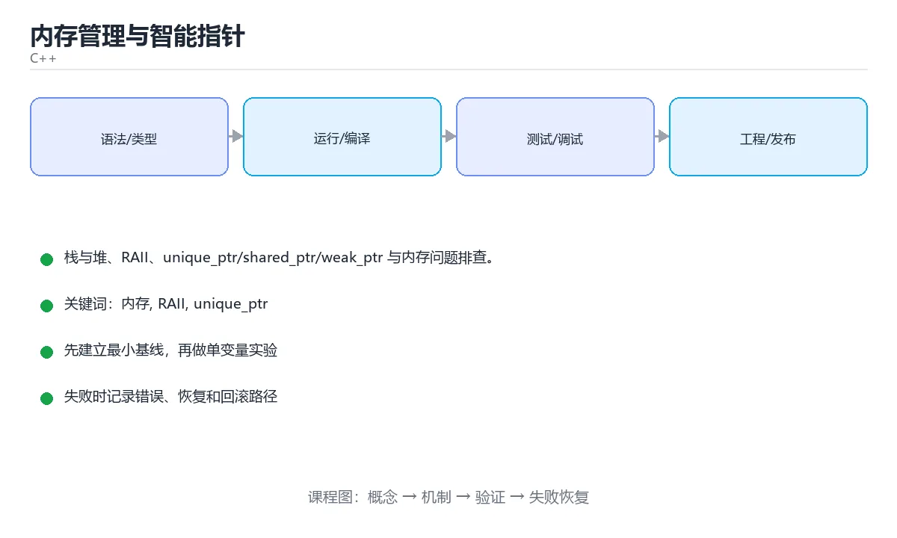

# 内存管理与智能指针



> 内容更新时间：2026-10-03 · 学习阶段：进阶 · 预计用时：17 分钟

## 学习目标

- 能用自己的话解释「内存管理与智能指针」解决了什么问题，而不是只背术语。
- 能说清 「内存」、「RAII」、「unique_ptr」、「shared_ptr」 之间的关系，并分别举出一个例子。
- 能把本课知识放回「C++」的知识体系，说明它和相邻主题的边界。
- 能完成本课练习，并用验收标准检查自己的结果。

> 一句话摘要：栈与堆、RAII、unique_ptr/shared_ptr/weak_ptr 与内存问题排查。

## 前置知识

- 先完成上一课《指针与引用》；如果已经掌握，可以直接用本课练习自测。
- 本课阶段：进阶。建议先掌握同一分类的基础课程，并能独立运行正文中的最小示例。
- 开始前先复习：内存、RAII、unique_ptr。
- 如果某一步看不懂，先记录具体卡点，完成练习后再回头读一遍。


## 栈与堆

```cpp
void demo() {
    int stack_value = 1;             // 栈：自动分配、离开作用域自动释放
    int* heap_value = new int(2);    // 堆：手动申请
    delete heap_value;               // 必须手动释放，否则内存泄漏
    heap_value = nullptr;            // 释放后置空，避免悬垂指针
}
```

数组要用 `new[]` / `delete[]` 配对：

```cpp
int* arr = new int[10];
delete[] arr;
```

## RAII：C++ 的资源管理思想

**资源获取即初始化**：把资源的生命周期绑定到对象生命周期上，析构函数自动释放。它是智能指针、锁、文件流的共同基础。

```cpp
class FileHandle {
public:
    explicit FileHandle(const char* path) : file_(std::fopen(path, "r")) {}
    ~FileHandle() { if (file_) std::fclose(file_); }

    FileHandle(const FileHandle&) = delete;             // 禁止拷贝
    FileHandle& operator=(const FileHandle&) = delete;
private:
    std::FILE* file_;
};
```

## 三种智能指针

```cpp
#include <memory>

// 独占所有权：不能拷贝，只能移动
std::unique_ptr<int> u = std::make_unique<int>(10);
std::unique_ptr<int> u2 = std::move(u);

// 共享所有权：引用计数为 0 时释放
std::shared_ptr<int> s = std::make_shared<int>(20);
std::shared_ptr<int> s2 = s;          // 计数变为 2
std::cout << s.use_count();

// 弱引用：不增加计数，用于打破循环引用
std::weak_ptr<int> w = s;
if (auto locked = w.lock()) {
    std::cout << *locked;
}
```

选择顺序：优先 `unique_ptr`，需要共享时才用 `shared_ptr`，观察者用 `weak_ptr`。

## 常见内存问题

| 问题 | 说明 |
| --- | --- |
| 内存泄漏 | `new` 之后忘记 `delete`，或 `shared_ptr` 循环引用 |
| 悬垂指针 | 对象已释放仍在使用 |
| 重复释放 | 同一块内存 `delete` 两次 |
| 越界访问 | 下标超出数组范围 |

## rule of zero / three / five

- **rule of zero**：不需要手动管理资源时，不写析构、拷贝、移动函数。
- **rule of three**：需要自定义析构、拷贝构造、拷贝赋值中的一个，通常三个都要。
- **rule of five**：再加上移动构造与移动赋值。

## 排查工具

```bash
g++ -fsanitize=address,undefined -g main.cpp -o main   # ASan + UBSan
valgrind --leak-check=full ./main                      # Linux
```

## 本课小结
现代 C++ 的原则是：**能用栈和智能指针就不用裸 new/delete**，让 RAII 负责释放，把内存问题交给类型系统。


## 智能指针选型速查

| 指针 | 所有权 | 拷贝 | 典型用途 | 注意点 |
| --- | --- | --- | --- | --- |
| `T obj` / `T* p` | 无（裸指针不拥有） | 任意 | 观察、传参（能不用指针就不用） | 生命周期由人保证，容易悬空 |
| `std::unique_ptr<T>` | 独占 | 禁止，只能 `std::move` | 工厂返回值、类成员独占资源 | 零额外开销，默认首选 |
| `std::shared_ptr<T>` | 共享（引用计数） | 允许 | 多方共同持有、异步回调 | 有计数开销，小心循环引用 |
| `std::weak_ptr<T>` | 不增加计数 | 允许 | 打破 `shared_ptr` 环、缓存观察 | 用前必须 `lock()` 并判空 |
| `std::string` / `std::vector` | 独占且自带 RAII | 深拷贝（可按需 move） | 绝大多数数据容器 | 优先用它替代手工 `new[]` |

创建与转换速查：

```cpp
auto p = std::make_unique<Widget>(1, 2);   // C++14 起推荐写法，异常安全
std::shared_ptr<Widget> s = std::make_shared<Widget>(1, 2);
std::weak_ptr<Widget> w = s;               // 只观察，不增加计数

if (auto locked = w.lock()) {              // 使用前提升为 shared_ptr
    locked->draw();
}

std::unique_ptr<Widget> moved = std::move(p);  // 转移所有权，p 变为 nullptr
std::shared_ptr<Widget> shared2 = std::move(moved); // unique -> shared 也可
```

## 常见错误对照表

| 容易写错的做法 | 实际现象 | 原因与正确做法 |
| --- | --- | --- |
| `new` 之后某条分支提前 `return` | 内存泄漏 | 用智能指针或容器管理，让析构自动执行 |
| `new` / `delete` 与 `malloc` / `free` 混用 | 未定义行为，可能崩溃 | 严格配对：`new` 对 `delete`，`malloc` 对 `free` |
| 两个 `shared_ptr` 各自 `shared_ptr<T>(raw)` | 双重释放 | 只能从一次 `make_shared` 或另一个 `shared_ptr` 复制 |
| `shared_ptr` 互相持有 | 引用计数永不归零，内存泄漏 | 其中一侧改成 `weak_ptr` |
| 返回局部变量的引用或指针 | 悬空引用，行为未定义 | 按值返回，或返回智能指针 / 容器 |
| `std::move` 之后再使用源对象 | 值不确定 | move 后只能重新赋值或销毁，不能读值 |
| 用 `std::vector<T*>` 存 `new` 出来的对象 | 容器销毁不释放元素 | 存 `std::unique_ptr<T>` 或直接存值 |
| 自定义类持有裸指针成员却不写析构 | 泄漏或重复释放 | 优先用成员对象 / 智能指针，遵循 Rule of Zero |
| `delete` 后指针仍被使用 | 悬空指针，随机崩溃 | `delete` 后置 `= nullptr`，或用智能指针 |
| 大对象按值传参 | 多余拷贝，性能下降 | 只读传 `const T&`，需要转移时按值 + `std::move` |

## 工具速查

| 工具 | 能发现的问题 | 使用方式 |
| --- | --- | --- |
| `-fsanitize=address`（ASan） | 越界、UAF、内存泄漏 | 编译加参数后运行程序 |
| `-fsanitize=undefined`（UBSan） | 整数溢出、空指针解引用等 UB | 常与 ASan 同时开启 |
| `valgrind --leak-check=full` | 泄漏、非法访问（无需重编译） | 运行变慢，适合调试 |
| `-Wall -Wextra` | 未使用变量、可疑比较 | 编译期即可发现 |
| `clang-tidy` | 现代 C++ 反模式、可读性问题 | 静态检查，接入 CI |

## 自测清单

- [ ] 能说明 `unique_ptr`、`shared_ptr`、`weak_ptr` 的所有权差异。
- [ ] 创建共享对象时使用 `make_shared`，不用裸 `new`。
- [ ] 知道 `shared_ptr` 循环引用要用 `weak_ptr` 打破。
- [ ] 记得 `std::move` 之后源对象只能重新赋值。
- [ ] 调试内存问题时知道用 ASan 或 Valgrind。


## 零基础详解：栈、堆与 RAII

### 一句话说清它是什么

程序的内存分成几块区域，最常打交道的是**栈**（自动管理、速度快、空间小）和**堆**（手动申请、空间大、需要自己管）。
RAII 是 C++ 管理资源的核心思想：**把资源的生命周期绑在对象上**。

### 用生活比喻理解

| 区域 | 比喻 | 特点 |
| --- | --- | --- |
| 栈 | 快餐店的托盘 | 拿了就用，出门自动回收，容量有限 |
| 堆 | 自租仓库 | 需要自己申请和退租，空间大，忘退就浪费 |
| 静态区 | 公司固定资产 | 程序启动到结束一直存在 |
| 常量区 | 刻好的石碑 | 只读，如字符串字面量 |
| RAII | 自动续费的托管服务 | 对象销毁时自动释放资源 |

### 栈与堆的对比

| 对比项 | 栈 | 堆 |
| --- | --- | --- |
| 分配速度 | 极快（移动指针） | 较慢（找空闲块） |
| 生命周期 | 离开作用域自动释放 | 手动或智能指针管理 |
| 空间大小 | 通常几 MB | 受限于可用内存 |
| 典型写法 | `int x = 1;` | `new int(1)` 或 `make_unique` |
| 常见问题 | 递归太深栈溢出 | 泄漏、悬垂、碎片 |

### 一段代码看清生命周期

```cpp
#include <iostream>
#include <string>

struct Tracer {
    std::string name;
    explicit Tracer(std::string n) : name(std::move(n)) {
        std::cout << "构造 " << name << '\n';
    }
    ~Tracer() {
        std::cout << "析构 " << name << '\n';   // 离开作用域自动执行
    }
};

void demo() {
    Tracer a("a");
    {
        Tracer b("b");
    }                       // 先析构 b
    Tracer c("c");
}                           // 再析构 c，最后析构 a

int main() { demo(); }
```

输出顺序体现两条规则：**先构造的后析构**，**离开作用域就析构**。

### RAII：资源交给对象管

```cpp
#include <fstream>
#include <memory>
#include <mutex>

{
    std::ofstream file("out.txt");       // 构造时打开
    file << "hello\n";
}                                        // 析构时自动关闭

{
    std::lock_guard<std::mutex> lock(mtx);   // 构造时加锁
    // 临界区
}                                        // 析构时自动解锁

auto buf = std::make_unique<char[]>(1024);   // 独占所有权
// 函数结束自动释放，不需要 delete
```

| 资源 | 推荐管理方式 |
| --- | --- |
| 动态内存 | `unique_ptr` / `shared_ptr` |
| 文件 | `std::fstream` |
| 互斥锁 | `lock_guard` / `unique_lock` |
| 数组 | `std::vector` / `std::array` |
| 手写 `new` / `delete` | 尽量避免 |

### 三种智能指针

| 指针 | 所有权 | 能否复制 | 典型用途 |
| --- | --- | --- | --- |
| `unique_ptr` | 独占 | 不能（可移动） | **默认选择** |
| `shared_ptr` | 共享，引用计数 | 能 | 多处共享同一对象 |
| `weak_ptr` | 不增加计数 | —— | 打破 `shared_ptr` 循环引用 |

```cpp
auto p = std::make_unique<int>(5);
auto q = std::move(p);          // 所有权转移，p 变成 nullptr

auto s1 = std::make_shared<int>(7);
auto s2 = s1;                   // 引用计数变为 2
std::cout << s1.use_count();    // 2
```

### 新手最容易踩的八个坑

| 坑 | 现象 | 正确做法 |
| --- | --- | --- |
| `new` 后忘 `delete` | 内存泄漏 | 用智能指针 |
| 返回局部对象的指针 | 悬垂引用 | 返回值或智能指针 |
| `shared_ptr` 循环引用 | 计数永不归零 | 一边改用 `weak_ptr` |
| 大量递归 | 栈溢出 | 改循环或增大栈 |
| 在容器里存引用 | 扩容后失效 | 存索引或智能指针 |
| `vector` 扩容后旧指针失效 | 数据错乱 | 扩容前预留 `reserve` |
| 手写拷贝却忘了深拷贝 | 双重释放 | 遵循三或五法则，或用智能指针 |
| 把大对象按值传递 | 频繁拷贝 | 用 `const T&` |

### 手把手练习：用 RAII 包一个简单资源

```cpp
#include <iostream>
#include <string>

class FileHandle {
public:
    explicit FileHandle(const std::string& name) : name_(name) {
        std::cout << "打开 " << name_ << '\n';
    }
    ~FileHandle() {
        std::cout << "关闭 " << name_ << '\n';
    }
    FileHandle(const FileHandle&) = delete;             // 不允许复制
    FileHandle& operator=(const FileHandle&) = delete;

private:
    std::string name_;
};

int main() {
    FileHandle f("data.txt");
    std::cout << "处理中……\n";
    // 即使这里抛异常，f 的析构也会执行
}
```

### 学完自测

- [ ] 能说出栈与堆的三点区别。
- [ ] 能解释 RAII 的核心思想。
- [ ] 知道 `unique_ptr` 与 `shared_ptr` 的取舍。
- [ ] 能说出三种智能指针各自解决什么问题。
- [ ] 知道为什么「构造顺序与析构顺序相反」。

## 动手练习


> 本课练习重点：围绕「内存、RAII、unique_ptr」完成复述、实验和交付，每个结果都要能被别人检查。

先开启警告编译最小程序，再验证内存与边界，最后用 Sanitizer 跑一遍。

### 练习 1：建立心智模型（10 分钟）

合上教程，用 3～5 句话回答：

1. 「内存管理与智能指针」解决了什么问题？
2. 如果没有它，会出现什么具体后果？
3. 它和「RAII」是什么关系？

**验收标准**：至少出现一个本课关键词，并写出一个反例、边界条件或失效场景。

### 练习 2：做一次可控实验（20 分钟）

从正文中选一个最小示例，完成以下操作：

1. 先预测修改一个参数、输入或步骤后的结果。
2. 再实际执行或逐步推演，记录真实结果。
3. 如果结果与预测不同，写出差异原因。

**验收标准**：留下「原例 → 改动 → 预测 → 结果 → 原因」五步记录。

### 练习 3：交付一个小结果（30 分钟）

写一个可独立编译的小程序，开启 `-Wall -Wextra`，确保没有警告。

任务要求：

- 结果必须能被别人检查，不能只写“我已经理解了”。
- 至少覆盖「内存」和「RAII」两个关键词。
- 写出 1 个仍然不确定的问题，以及下一步如何验证。

> 提示：时间有限时优先做练习 1 和练习 2；练习 3 可以拆成两次完成。


## 考点精讲：把测验题还原成判断过程

本课有 5 个判断点。先自己作答，再看「判断依据」；如果结论正确但理由不完整，回到正文对应章节补足概念。

### 考点 1：RAII 的核心思想是？

- **正确判断**：把资源生命周期绑定到对象生命周期
- **判断依据**：正确答案是「把资源生命周期绑定到对象生命周期」，本课在「RAII：C++ 的资源管理思想」中说明：资源获取即初始化：把资源的生命周期绑定到对象生命周期上，析构函数自动释放。RAII 让资源释放与对象析构绑定，异常安全且不会忘记释放。本课还在「零基础详解：栈、堆与 RAII」中说明：RAII 是 C++ 管理资源的核心思想：把资源的生命周期绑在对象上。本课还在「本课小结」中说明：现代 C++ 的原则是：能用栈和智能指针就不用裸 new/delete，让 RAII 负责释放，把内存问题交给类型系统。
- **迁移检查**：把题干里的一个条件换成边界值，原来的结论还成立吗？写出判断过程。

### 考点 2：以下哪组做法有助于避免内存泄漏？

- **正确判断**：使用智能指针并避免循环引用
- **判断依据**：正确答案是「使用智能指针并避免循环引用」，本课在「本课小结」中说明：现代 C++ 的原则是：能用栈和智能指针就不用裸 new/delete，让 RAII 负责释放，把内存问题交给类型系统。智能指针通过 RAII 在对象离开作用域时自动释放资源，配合 weakptr 可以打破循环引用。本课还在「rule of zero / three / five」中说明：rule of zero：不需要手动管理资源时，不写析构、拷贝、移动函数。
- **迁移检查**：把题干里的一个条件换成边界值，原来的结论还成立吗？写出判断过程。

### 考点 3：shared_ptr 相互引用形成环会导致？

- **正确判断**：引用计数永不归零，内存泄漏
- **判断依据**：正确答案是「引用计数永不归零，内存泄漏」，本课在「零基础详解：栈、堆与 RAII」中说明：程序的内存分成几块区域，最常打交道的是栈（自动管理、速度快、空间小）和堆（手动申请、空间大、需要自己管）。环中的对象互相持有 sharedptr，计数无法归零。
- **迁移检查**：把题干里的一个条件换成边界值，原来的结论还成立吗？写出判断过程。

### 考点 4：new/delete 与 malloc/free 的关键区别是？

- **正确判断**：new 会调用构造函数并返回正确类型
- **判断依据**：正确答案是「new 会调用构造函数并返回正确类型」，本课在「RAII：C++ 的资源管理思想」中说明：资源获取即初始化：把资源的生命周期绑定到对象生命周期上，析构函数自动释放。混用 new 与 free（或 malloc 与 delete）属于未定义行为。本课还在「栈与堆」中说明：数组要用 new[] / delete[] 配对。本课还在「rule of zero / three / five」中说明：rule of three：需要自定义析构、拷贝构造、拷贝赋值中的一个，通常三个都要。
- **迁移检查**：如果给某个错误选项去掉一个限定词，它会不会变成正确？说明理由。

### 考点 5：下面代码用 new[] 分配数组，却可能产生未定义行为。应怎样修复？

- **正确判断**：使用 delete[] p;
- **判断依据**：正确答案是「使用 delete[] p;」，本课在「栈与堆」中说明：数组要用 new[] / delete[] 配对。new[] 分配的是数组对象，必须用 delete[] 与它配对。本课还在「rule of zero / three / five」中说明：rule of zero：不需要手动管理资源时，不写析构、拷贝、移动函数。
- **迁移检查**：如果不修复这一处，程序会在哪一步失败？写出第一条错误信息。

### 补充考点 1：关于「内存管理与智能指针」，下列哪些说法是正确的？（多选）

- **正确判断**：使用智能指针并避免循环引用；把资源生命周期绑定到对象生命周期
- **判断依据**：正确答案是「使用智能指针并避免循环引用；把资源生命周期绑定到对象生命周期」。本课的两个判断点可以互相印证：正确答案是「把资源生命周期绑定到对象生命周期」，本课在「RAII·C++ 的资源管理思想」中说明：资源获取即初始化：把资源的生命周期绑定到对象生命周期上，析构函数自动释放。RAII…；栈与堆、RAII、uniqueptr/sharedptr/weakptr 与内存问题排查。。在「内存管理与智能指针」中，多选时不能只凭一个关键词选答案，要逐项核对题干限定的对象和边界。

## 本课复习清单

离开本课前，逐项确认：

- [ ] 不看解析，能说出「RAII 的核心思想是？」的判断依据。
- [ ] 不看解析，能说出「以下哪组做法有助于避免内存泄漏？」的判断依据。
- [ ] 不看解析，能说出「shared_ptr 相互引用形成环会导致？」的判断依据。
- [ ] 不看解析，能说出「new/delete 与 malloc/free 的关键区别是？」的判断依据。
- [ ] 不看解析，能说出「下面代码用 new[] 分配数组，却可能产生未定义行为。应怎样修复？」的判断依据。
- [ ] 至少运行一次本课示例，记录输入、输出和一个边界情况。
- [ ] 把本课最容易混淆的两个概念写成一句话对照。

| 复盘项 | 记录 |
| --- | --- |
| 已经能独立解释的考点 |  |
| 仍然说不清的概念 |  |
| 下一步验证动作 |  |

## 术语速查

把本课反复出现的术语集中放在一起。复习时先遮住右列，尝试用自己的话解释，再回到正文核对。

| 术语 | 本课语境 |
| --- | --- |
| `new[]` | 数组要用 `new[]` / `delete[]` 配对： |
| `delete[]` | 数组要用 `new[]` / `delete[]` 配对： |
| `unique_ptr` | 选择顺序：优先 `unique_ptr`，需要共享时才用 `shared_ptr`，观察者用 `weak_ptr`。 |
| `shared_ptr` | 选择顺序：优先 `unique_ptr`，需要共享时才用 `shared_ptr`，观察者用 `weak_ptr`。 |
| `weak_ptr` | 选择顺序：优先 `unique_ptr`，需要共享时才用 `shared_ptr`，观察者用 `weak_ptr`。 |
| `new` | \| 内存泄漏 \| `new` 之后忘记 `delete`，或 `shared_ptr` 循环引用 \| |
| `delete` | \| 内存泄漏 \| `new` 之后忘记 `delete`，或 `shared_ptr` 循环引用 \| |
| `T obj` | \| `T obj` / `T* p` \| 无（裸指针不拥有） \| 任意 \| 观察、传参（能不用指针就不用） \| 生命周期由人保证，容易悬空 \| |
| `T* p` | \| `T obj` / `T* p` \| 无（裸指针不拥有） \| 任意 \| 观察、传参（能不用指针就不用） \| 生命周期由人保证，容易悬空 \| |
| `std::unique_ptr<T>` | \| `std::unique_ptr<T>` \| 独占 \| 禁止，只能 `std::move` \| 工厂返回值、类成员独占资源 \| 零额外开销，默认首选 \| |
| `std::move` | \| `std::unique_ptr<T>` \| 独占 \| 禁止，只能 `std::move` \| 工厂返回值、类成员独占资源 \| 零额外开销，默认首选 \| |
| `std::shared_ptr<T>` | \| `std::shared_ptr<T>` \| 共享（引用计数） \| 允许 \| 多方共同持有、异步回调 \| 有计数开销，小心循环引用 \| |

## 面试问答与自测

下面把本课考点换成面试追问。先口述自己的答案，
再对照参考回答检查是否遗漏了前提、边界或失败路径。

### 追问 1：RAII 的核心思想是？

**参考回答**：正确答案是「把资源生命周期绑定到对象生命周期」，本课在「RAII·C++ 的资源管理思想」中说明：资源获取即初始化：把资源的生命周期绑定到对象生命周期上，析构函数自动释放。RAII 让资源释放与对象析构绑定，异常安全且不会忘记释放。本课还在「零基础详解·栈、堆与 RAII」中说明：RAII 是 C++ 管理资源的核心思想：把资源的生命周期绑在对象上。本课还在「本课小结」中说明：现代 C++ 的原则是：能用栈和智能指针就不用裸 new/delete，让 RAII 负责释放，把内存问题交给类型系统。

### 追问 2：以下哪组做法有助于避免内存泄漏？

**参考回答**：正确答案是「使用智能指针并避免循环引用」，本课在「本课小结」中说明：现代 C++ 的原则是：能用栈和智能指针就不用裸 new/delete，让 RAII 负责释放，把内存问题交给类型系统。智能指针通过 RAII 在对象离开作用域时自动释放资源，配合 weakptr 可以打破循环引用。本课还在「rule of zero / three / five」中说明：rule of zero：不需要手动管理资源时，不写析构、拷贝、移动函数。

### 追问 3：shared_ptr 相互引用形成环会导致？

**参考回答**：正确答案是「引用计数永不归零，内存泄漏」，本课在「零基础详解·栈、堆与 RAII」中说明：程序的内存分成几块区域，最常打交道的是栈（自动管理、速度快、空间小）和堆（手动申请、空间大、需要自己管）。环中的对象互相持有 sharedptr，计数无法归零。

### 追问 4：new/delete 与 malloc/free 的关键区别是？

**参考回答**：正确答案是「new 会调用构造函数并返回正确类型」，本课在「RAII·C++ 的资源管理思想」中说明：资源获取即初始化：把资源的生命周期绑定到对象生命周期上，析构函数自动释放。混用 new 与 free（或 malloc 与 delete）属于未定义行为。本课还在「栈与堆」中说明：数组要用 new[] / delete[] 配对。本课还在「rule of zero / three / five」中说明：rule of three：需要自定义析构、拷贝构造、拷贝赋值中的一个，通常三个都要。

### 追问 5：下面代码用 new[] 分配数组，却可能产生未定义行为。应怎样修复？

**参考回答**：正确答案是「使用 delete[] p;」，本课在「栈与堆」中说明：数组要用 new[] / delete[] 配对。new[] 分配的是数组对象，必须用 delete[] 与它配对。本课还在「rule of zero / three / five」中说明：rule of zero：不需要手动管理资源时，不写析构、拷贝、移动函数。

## English Overview

**Title:** Memory & Smart Pointers

**Summary:** Stack vs heap, RAII, smart pointers and memory bugs.

**Category:** C++  
**Level:** 进阶  
**Key terms:** 内存, RAII, unique_ptr, shared_ptr, 内存泄漏

> The full tutorial is written in Chinese. This bilingual overview helps English readers identify the topic, scope and key terms before studying the detailed examples.

## 内容元数据

- 内容版本：v2.0
- 最后更新：2026-10-03
- 学习阶段：进阶
- 适用环境：C++20 / GCC 13+ 或 Clang 17+
- 内容来源：内置结构化课程与工程实践整理
- 相关主题：内存、RAII、unique_ptr、shared_ptr、内存泄漏
- 质量版本：P0 测验标准 + P1 覆盖扩展 + P2 体验补全


## Full English Study Guide

### Overview

**Memory & Smart Pointers** focuses on Stack vs heap, RAII, smart pointers and memory bugs.

### Learning Outcomes

- Explain what **Memory & Smart Pointers** solves and when it should be used.
- Identify inputs, outputs, state and failure boundaries.
- Build a minimal reproducible example and observe the real result.
- Test normal, boundary and failure paths.
- Measure performance, resource cost or security impact before optimizing.
- Document the decision, rollback path and remaining uncertainty.

### Core Mental Model

1. **Problem first:** define the exact problem before choosing a tool or pattern.
2. **Smallest example:** reduce the system to one input and one observable output.
3. **State and flow:** trace how data, control or responsibility moves through the system.
4. **Boundaries:** identify invalid input, resource limits, timeouts and permission edges.
5. **Evidence:** use tests, logs, metrics or reproductions instead of intuition.
6. **Trade-offs:** compare correctness, latency, cost, complexity and operability.

### Step-by-step Study Plan

1. Read the Chinese lesson once and write down the main problem in one sentence.
2. Run the smallest example and save the exact command and output.
3. Change only one input or parameter and predict the result before running it.
4. Introduce one failure and record how the system detects, reports and recovers.
5. Write one test or checklist item for the normal, boundary and failure paths.
6. Complete the quiz and explain every wrong answer in your own words.

### Practice Tasks

- Rebuild the minimal example from an empty directory.
- Add one boundary test and one failure test.
- Produce a short report containing the baseline, change, result and rollback.

### Common Failure Modes

- Treating a happy-path demo as production readiness.
- Skipping boundary values and invalid inputs.
- Optimizing before establishing a measurable baseline.
- Hiding errors, permissions or resource limits.

### Self-check Questions

1. What is the smallest observable result that proves this lesson works?
2. What input or state is most likely to break it?
3. Which metric or test would reveal a regression?
4. What is the rollback path?
5. What is the cost of using this approach at 10x scale?
6. Which adjacent topic is most often confused with this one?

### Glossary

- Topic: **Memory & Smart Pointers**
- Related terms: 内存, RAII, unique_ptr, shared_ptr
- Primary evidence: command output, tests, logs, metrics or reproductions

> This guide is an English study companion for the detailed Chinese lesson. It covers the learning path, mental model and acceptance questions; code examples and engineering details remain in the main tutorial.


## Bilingual Section Outline

| 中文小节 | English section |
| --- | --- |
| 学习目标 | Learning objectives |
| 前置知识 | Prerequisites |
| 栈与堆 | 栈与堆 |
| RAII：C++ 的资源管理思想 | RAII：C++ 的资源管理思想 |
| 三种智能指针 | 三种智能指针 |
| 常见内存问题 | 常见Memory问题 |
| rule of zero / three / five | rule of zero / three / five |
| 排查工具 | 排查Tools |
| 本课小结 | Summary |
| 智能指针选型速查 | 智能指针选型速查 |

> 该大纲把每个中文小节映射为英文标题，配合 Full English Study Guide 使用。


## 参考资料与复核

- 最后复核：2026-10-04
- 下次复核：2027-04-04
- 复核范围：版本兼容、API 行为、安全建议与工程实践
- 来源性质：官方文档与标准；本课正文为离线教学重组，不复制原文

| 参考资料 | 本课用途 |
| --- | --- |
| [C++ 标准库参考](https://en.cppreference.com/w/cpp) | 语言、标准库与并发 |
| [ISO C++](https://isocpp.org/) | 标准动态、指南与最佳实践 |

> 本课主题：栈与堆、RAII、unique_ptr/shared_ptr/weak_ptr 与内存问题排查。

> App 完全离线展示文字链接，不会自动联网；需要延伸阅读时可复制链接到浏览器。
