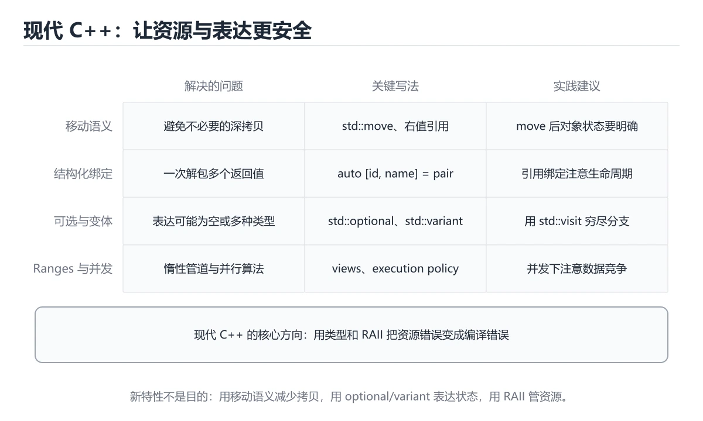
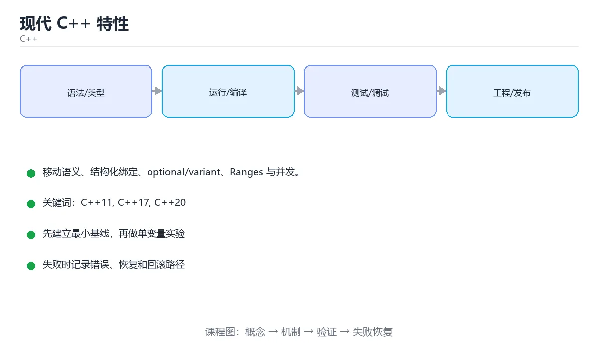

# 现代 C++ 特性





> 内容更新时间：2026-10-06 · 学习阶段：进阶 · 预计用时：40 分钟

## 学习目标

- 能用自己的话解释现代 C++ 特性解决了什么问题，而不是只背术语。
- 能说清 「C++11」、「C++17」、「C++20」、「移动语义」 之间的关系，并分别举出一个例子。
- 能把本课知识放回「C++」的知识体系，说明它和相邻主题的边界。
- 能完成本课练习，并用验收标准检查自己的结果。

> 一句话摘要：移动语义、结构化绑定、optional/variant、Ranges 与并发。

## 前置知识

- 先完成上一课《STL 容器与算法》；如果已经掌握，可以直接用本课练习自测。
- 本课阶段：进阶。建议先掌握同一分类的基础课程，并能独立运行正文中的最小示例。
- 开始前先复习：C++11、C++17、C++20。
- 如果某一步看不懂，先记录具体卡点，完成练习后再回头读一遍。

## 版本演进

- **C++11**：`auto`、lambda、右值引用与移动语义、智能指针、范围 for、`nullptr`
- **C++14**：泛型 lambda、`make_unique`、返回值类型推导
- **C++17**：结构化绑定、`if constexpr`、`optional` / `variant` / `string_view`、并行算法
- **C++20**：Concepts、Ranges、协程、`span`、三路比较 `<=>`
- **C++23**：`expected`、`print`、更多 ranges 支持

## 移动语义

```cpp
#include <utility>
#include <vector>

std::vector<int> make_data() {
    std::vector<int> v{1, 2, 3};
    return v;                      // NRVO / 移动，无拷贝
}

std::vector<int> a = make_data();
std::vector<int> b = std::move(a); // 转移资源，a 之后不要使用其值
```

右值引用 `T&&` 与 `std::move` 让「把资源搬走」变成廉价操作，这也是 `vector` 扩容高效的原因。

## 结构化绑定与初始化语句

```cpp
#include <map>
#include <optional>

std::map<std::string, int> scores{{"math", 90}};
if (auto [it, inserted] = scores.emplace("english", 85); inserted) {
    std::cout << it->first;
}

for (const auto& [name, score] : scores) {
    std::cout << name << ':' << score << '\n';
}

std::optional<int> maybe = std::nullopt;
std::cout << maybe.value_or(-1);
```

## Ranges 与算法组合（C++20）

```cpp
#include <ranges>
#include <vector>

std::vector<int> nums{1, 2, 3, 4, 5, 6};

auto even_squares = nums
    | std::views::filter([](int x) { return x % 2 == 0; })
    | std::views::transform([](int x) { return x * x; });

for (int value : even_squares) std::cout << value << ' ';   // 4 16 36
```

## 并发基础

```cpp
#include <thread>
#include <mutex>
#include <atomic>

std::atomic<int> counter{0};
std::mutex mtx;

void work() {
    for (int i = 0; i < 1000; ++i) {
        ++counter;                        // 原子操作，无需加锁
        std::lock_guard<std::mutex> lock(mtx);   // RAII 自动解锁
        // 保护共享数据的临界区
    }
}

std::thread t1(work), t2(work);
t1.join(); t2.join();
```

## 异常安全

基本保证：异常抛出后对象仍然有效、资源不泄漏。实现手段就是 RAII + 智能指针；`noexcept` 用于声明「不会抛异常」，对移动构造很重要。

## 各版本特性的实战取舍

| 特性 | 什么时候用 | 注意 |
| --- | --- | --- |
| auto | 类型冗长或明显时 | 不要掩盖关键类型（如迭代器 vs 值） |
| 结构化绑定 | 遍历 map、解包 pair/tuple | 配合 const auto& 避免拷贝 |
| optional | 表达"可能没有值" | 不要用它表达错误（用 expected/Result） |
| variant | 有限类型集合 | 访问用 std::visit，否则易漏分支 |
| string_view | 只读字符串参数 | 不能持有它超出原字符串生命周期 |
| ranges | 组合过滤/转换 | 编译时间与错误信息更重，热点路径实测 |
| concepts | 约束模板参数 | 显著改善报错，新代码建议使用 |
| 协程 | 异步流程 | 需要库支持（如 cppcoro），标准库设施有限 |

**迁移建议**：老代码不要为了用新特性而大改；新代码优先用 `constexpr`、`auto`、结构化绑定、`optional/variant`、RAII 与智能指针。开启 `-std=c++20` 前先确认工具链与依赖支持，编译选项与 CI 要同步更新。

## 本课小结
现代 C++ 的写法可以概括为：**用值语义和智能指针管理资源、用 auto/范围 for 简化代码、用 Ranges 和算法替代手写循环、用标准并发库替代裸线程 API**。

## 现代 C++ 特性速查

| 特性 | 标准 | 一句话说明 | 典型写法 |
| --- | --- | --- | --- |
| `auto` | C++11 | 编译期类型推导 | `auto it = v.begin();` |
| 范围 for | C++11 | 遍历容器 | `for (const auto& x : v)` |
| 智能指针 | C++11 | 自动管理生命周期 | `auto p = std::make_unique<T>();` |
| `nullptr` | C++11 | 类型安全的空指针 | `T* p = nullptr;` |
| lambda | C++11 | 就地定义匿名函数 | `[](int x) { return x * 2; }` |
| 右值引用与移动 | C++11 | 避免不必要的深拷贝 | `v.push_back(std::move(s));` |
| 结构化绑定 | C++17 | 一次解包多个值 | `for (const auto& [k, v] : map)` |
| `std::optional` | C++17 | 表达「可能没有值」 | `std::optional<int> f();` |
| `std::string_view` | C++17 | 不拥有内存的字符串视图 | `void log(std::string_view s);` |
| `if constexpr` | C++17 | 编译期分支 | 模板里按类型走不同逻辑 |
| 折叠表达式 | C++17 | 简化可变参数展开 | `(args + ...)` |
| concepts | C++20 | 给模板参数加约束 | `template <std::integral T>` |
| ranges | C++20 | 组合式序列操作 | `v \| std::views::filter(...)` |
| `std::span` | C++20 | 连续内存视图 | `void f(std::span<int> data);` |
| `std::format` | C++20 | 类型安全的格式化 | `std::format("{} {}", a, b)` |
| `std::expected` | C++23 | 表达成功值或错误 | 类似 Rust 的 `Result` |

## 类型推导与移动语义速查

| 写法 | 含义 | 注意点 |
| --- | --- | --- |
| `auto x = expr;` | 按值推导，会拷贝 | 大对象加 `&` |
| `const auto& x = expr;` | 只读引用，不拷贝 | 最常用的遍历写法 |
| `auto&& x = expr;` | 转发引用 | 模板中配合 `std::forward` |
| `std::move(x)` | 转成右值，触发移动 | 之后 `x` 状态未定义，别再读 |
| `std::forward<T>(x)` | 保持原始值类别转发 | 只用在模板转发场景 |
| `decltype(x)` | 取表达式的声明类型 | 与 `auto` 的推导规则不同 |
| 返回值优化（RVO） | 编译器直接构造返回对象 | 别写 `return std::move(local);`，会阻碍优化 |

```cpp
#include <optional>
#include <string>
#include <string_view>

std::optional<int> parse_int(std::string_view text) {
    try {
        return std::stoi(std::string{text});
    } catch (...) {
        return std::nullopt;                 // 明确表达「解析失败」
    }
}

if (auto value = parse_int("42")) {
    // 只有成功时才进入
}
```

## 常见错误对照表

| 容易写错的做法 | 实际现象 | 原因与正确做法 |
| --- | --- | --- |
| `auto` 接住 `vector<bool>` 的元素 | 拿到的是代理对象而非 `bool` | 需要真值写 `bool b = v[i];` |
| `return std::move(local);` | 反而阻止返回值优化 | 直接 `return local;` |
| 忘了 `std::forward` | 右值语义丢失，多一次拷贝 | 转发模板参数时用 `std::forward<T>(x)` |
| `std::move` 后继续使用对象 | 值不确定 | move 之后只能重新赋值 |
| `string_view` 指向临时字符串 | 悬空视图 | 确保底层字符串生命周期更长 |
| `optional` 直接 `*opt` 取值 | 未判空时是未定义行为 | 先 `if (opt)` 或用 `value_or` |
| lambda 按值捕获大对象 | 多余的拷贝 | 明确捕获列表，只捕获需要的变量 |
| lambda 里 `[&]` 捕获局部变量并异步使用 | 悬空引用 | 异步场景按值捕获或 `shared_ptr` |
| `if constexpr` 分支里写非法代码 | 仍可能实例化失败 | 两个分支都必须对相应类型合法 |
| 用 `std::format` 但未开启 C++20 | 编译失败 | 检查编译器版本与标准选项 |

## 自测清单

- [ ] 会写 `const auto&` 遍历，知道 `auto` 会拷贝。
- [ ] 能用 `std::optional` 表达「可能没有值」，并正确判空。
- [ ] 会用结构化绑定遍历 `map`。
- [ ] 知道 `std::move` 之后源对象不能再读。
- [ ] 了解 concepts、ranges、`std::span` 各自的用途。

## 零基础详解：现代 C++ 的十个好习惯

### 一句话说清它是什么

现代 C++（C++11 之后）的目标是：**少写裸指针、少写循环、让编译器替你检查**。
下面十条是日常写得最多、收益最直接的实践。

### 十个习惯速览

| 习惯 | 替代的旧写法 | 收益 |
| --- | --- | --- |
| 用 `auto` 推导 | 手写复杂类型 | 简洁、不易写错 |
| 用范围 for | 下标循环 | 不易越界 |
| 用 `nullptr` | `NULL` 或 `0` | 类型安全 |
| 用 `enum class` | 裸 `enum` | 不污染作用域 |
| 用智能指针 | `new` 与 `delete` | 自动释放 |
| 用 `constexpr` | `#define` 常量 | 有类型、可调试 |
| 用结构化绑定 | 手动取 `.first` | 可读性高 |
| 用 `std::optional` | 特殊值表示「无」 | 语义明确 |
| 用 `std::string_view` | `const char*` | 零拷贝只读字符串 |
| 用 `override` | 靠命名巧合 | 编译器检查重写 |

### 一段代码展示八种新写法

```cpp
#include <iostream>
#include <memory>
#include <optional>
#include <string_view>
#include <vector>

enum class Status { Ok, Warn, Error };            // 1. enum class
constexpr double kPi = 3.14159;                   // 2. constexpr
struct Point { double x; double y; };

std::optional<Point> parsePoint(std::string_view text) {
    if (text.empty()) return std::nullopt;        // 3. 明确表达「没有值」
    return Point{1.0, 2.0};
}

int main() {
    auto items = std::vector{1, 2, 3, 4};         // 4. auto 与类模板推导
    int total = 0;
    for (const auto& n : items) total += n;       // 5. 范围 for

    auto ptr = std::make_unique<Point>(Point{1, 2});   // 6. 智能指针

    if (auto p = parsePoint("1,2")) {             // 7. if 带初始化
        auto [x, y] = *p;                         // 8. 结构化绑定
        std::cout << x << ',' << y << '\n';
    }

    const Status st = Status::Warn;
    if (st == Status::Warn) std::cout << "警告\n";
    std::cout << "π = " << kPi << "，合计 " << total << '\n';
}
```

### `std::optional` 与 `std::variant`

| 类型 | 表达 | 适用 |
| --- | --- | --- |
| `T` | 一定有值 | 常规返回 |
| `optional<T>` | 可能有，可能没有 | 查找、解析 |
| `variant<A,B>` | 是 A 或 B 之一 | 替代 union，类型安全 |

```cpp
#include <variant>

std::variant<int, std::string> v = 42;
if (std::holds_alternative<int>(v)) {
    std::cout << std::get<int>(v);
}
std::visit([](const auto& x) { std::cout << x; }, v);
```

### `string_view`：只读字符串的零拷贝参数

```cpp
void log(std::string_view msg);       // 不需要拷贝，也不关心谁拥有

log("字面量");                         // 不产生临时 std::string
std::string s = "abc";
log(s);
```

**注意**：`string_view` 不持有数据，不能返回指向已销毁数据的视图。

### 移动语义：把资源「搬」过去

```cpp
std::vector<int> makeData() {
    std::vector<int> v(1'000'000, 1);
    return v;                          // 编译器自动移动，不拷贝
}

std::vector<int> data = makeData();
std::vector<int> moved = std::move(data);   // 转移所有权
// 此后不要再读 data 的内容
```

### 新手最容易踩的八个坑

| 坑 | 现象 | 正确做法 |
| --- | --- | --- |
| `std::move` 后继续用原对象 | 内容不确定 | 只把它当「已完成使命」 |
| 返回局部变量的 `string_view` | 悬垂引用 | 返回 `std::string` |
| `auto` 推导出意外类型 | 悄悄发生拷贝 | 需要引用时写 `const auto&` |
| `optional` 直接解引用 | 空值未定义行为 | 先判断或用 `value_or` |
| `enum` 不带 class | 名字冲突 | 用 `enum class` |
| `constexpr` 函数里做 IO | 编译不过 | 保持纯计算 |
| 头文件里写 `using namespace std;` | 污染使用方 | 写全限定名 |
| 盲目用新特性 | 团队编译器不支持 | 先确认标准版本 |

### 手把手练习：现代写法重写统计

```cpp
#include <algorithm>
#include <iostream>
#include <optional>
#include <span>
#include <vector>

std::optional<double> average(std::span<const int> data) {
    if (data.empty()) return std::nullopt;
    double sum = 0;
    for (int n : data) sum += n;
    return sum / static_cast<double>(data.size());
}

int main() {
    const std::vector<int> scores{88, 92, 79, 95};

    if (const auto avg = average(scores)) {
        std::cout << "平均分 " << *avg << '\n';
    } else {
        std::cout << "没有数据\n";
    }

    const auto [lo, hi] = std::ranges::minmax(scores);
    std::cout << "范围 " << lo << " ~ " << hi << '\n';
}
```

### 学完自测

- [ ] 能说出 `nullptr` 比 `NULL` 好在哪。
- [ ] 知道 `optional` 与返回特殊值相比的优势。
- [ ] 能说出 `string_view` 的使用禁忌。
- [ ] 能解释 `std::move` 之后为什么不该再用原对象。
- [ ] 能列出至少六条现代 C++ 习惯。

## 动手练习

> 本课练习重点：围绕「C++11、C++17、C++20」完成复述、实验和交付，每个结果都要能被别人检查。

先开启警告编译最小程序，再验证内存与边界，最后用 Sanitizer 跑一遍。

### 练习 1：建立心智模型（10 分钟）

合上教程，用 3～5 句话回答：

1. 现代 C++ 特性解决了什么问题？
2. 如果没有它，会出现什么具体后果？
3. 它和「C++17」是什么关系？

**验收标准**：至少出现一个本课关键词，并写出一个反例、边界条件或失效场景。

### 练习 2：做一次可控实验（20 分钟）

从正文中选一个最小示例，完成以下操作：

1. 先预测修改一个参数、输入或步骤后的结果。
2. 再实际执行或逐步推演，记录真实结果。
3. 如果结果与预测不同，写出差异原因。

**验收标准**：留下「原例 → 改动 → 预测 → 结果 → 原因」五步记录。

### 练习 3：交付一个小结果（30 分钟）

写一个可独立编译的小程序，开启 `-Wall -Wextra`，确保没有警告。

任务要求：

- 结果必须能被别人检查，不能只写“我已经理解了”。
- 至少覆盖「C++11」和「C++17」两个关键词。
- 写出 1 个仍然不确定的问题，以及下一步如何验证。

> 提示：时间有限时优先做练习 1 和练习 2；练习 3 可以拆成两次完成。

## 可运行练习

### 任务 1：先跑通，再解释

```cpp
#include <utility>
#include <vector>

std::vector<int> make_data() {
    std::vector<int> v{1, 2, 3};
    return v;                      // NRVO / 移动，无拷贝
}

std::vector<int> a = make_data();
std::vector<int> b = std::move(a); // 转移资源，a 之后不要使用其值
```

### 任务 2：只改一个条件

把「现代 C++ 特性」的最小示例复制一份，只改一个条件再跑一次：

- 改动点：只把C++11的输入换成空值、极值或错误输入，其余保持不变。
- 预测：先写下「现代 C++ 特性」在改动后的输出或错误信息，再运行。
- 记录：对照改动前后的结果，指出差异出在哪一步。
- 验收：换回原条件能复现原结果，改动只影响C++11。

### 任务 3：迁移到自己的数据

用同一套思路处理一组你自己的数据或场景，保持输出格式与任务 1 一致。

## 故障现场

### 现场 1：本课的 C++11 常规用例通过，但边界用例失败

**症状**：在本课的练习或生产场景里出现“本课的 C++11 常规用例通过，但边界用例失败”。

**复现**：准备一组最小输入，只保留触发“本课的 C++11 常规用例通过，但边界用例失败”的必要条件，连续运行两次确认结果稳定。

**定位**：围绕“C++11 的前置条件与取值边界没有写进代码，默认值掩盖了空值和极值”检查调用链、输入数据和环境配置，先验证假设再改代码。

**预防**：把“本课的 C++11 常规用例通过，但边界用例失败”写成一条自动化用例，并在本课的验收清单里保留对应检查项。

### 现场 2：本课的 C++17 结果在两次运行之间不一致

**症状**：在本课的练习或生产场景里出现“本课的 C++17 结果在两次运行之间不一致”。

**复现**：准备一组最小输入，只保留触发“本课的 C++17 结果在两次运行之间不一致”的必要条件，连续运行两次确认结果稳定。

**定位**：围绕“C++17 依赖了当前版本、执行顺序或共享状态，单次运行无法暴露差异”检查调用链、输入数据和环境配置，先验证假设再改代码。

**预防**：把“本课的 C++17 结果在两次运行之间不一致”写成一条自动化用例，并在本课的验收清单里保留对应检查项。

### 现场 3：本课的验证只在开发机通过

**症状**：在本课的练习或生产场景里出现“本课的验证只在开发机通过”。

**定位**：围绕“环境版本、配置和输入规模与目标环境不同，C++11 缺少可重复的验证记录”检查调用链、输入数据和环境配置，先验证假设再改代码。

## 版本与时效

- C++23 已在主流工具链落地，C++26 进入定稿阶段
- 升级前先统一编译器与标准库版本，再逐模块打开新标准

### 升级检查清单

- 先固定当前版本，跑通全部示例与测验，再升级工具链。
- 只改一个版本变量，记录编译、测试、性能与产物体积的变化。
- 重点回归默认值、弃用警告、序列化格式、并发语义和错误信息。
- 升级完成后更新本课的“最后复核 / 下次复核”日期与版本说明。

## 本课复习清单

离开本课前，逐项确认：

- [ ] 不看解析，能说出「std::move 的本质作用是？」的判断依据。
- [ ] 不看解析，能说出「std::optional<T> 用来表达？」的判断依据。
- [ ] 不看解析，能说出的判断依据。
- [ ] 不看解析，能说出「模板参数中的 T&& 通常被称为？」的判断依据。
- [ ] 不看解析，能说出「std::string_view 的特点是？」的判断依据。
- [ ] 至少运行一次本课示例，记录输入、输出和一个边界情况。
- [ ] 把本课最容易混淆的两个概念写成一句话对照。

| 复盘项 | 记录 |
| --- | --- |
| 已经能独立解释的考点 |  |
| 仍然说不清的概念 |  |
| 下一步验证动作 |  |

## 术语速查

| 术语 | 本课语境 |
| --- | --- |
| `auto` | C++11**：`auto`、lambda、右值引用与移动语义、智能指针、范围 for、`nullptr` |
| `nullptr` | C++11**：`auto`、lambda、右值引用与移动语义、智能指针、范围 for、`nullptr` |
| `make_unique` | C++14**：泛型 lambda、`make_unique`、返回值类型推导 |
| `if constexpr` | C++17**：结构化绑定、`if constexpr`、`optional` / `variant` / `string_view`、并行算法 |
| `optional` | C++17**：结构化绑定、`if constexpr`、`optional` / `variant` / `string_view`、并行算法 |
| `variant` | C++17**：结构化绑定、`if constexpr`、`optional` / `variant` / `string_view`、并行算法 |

## 考点精讲

### 考点 1：代码补全·C++11

- **题目**：阅读「现代 C++ 特性」正文里的这段 C++ 代码，下面哪一项判断是正确的？
- **判断依据**：在「现代 C++ 特性」里，题干的正确项是这段代码把主要逻辑封装在函数或方法里，需要被调用才会执行，在「现代 C++ 特性」里封装边界决定C++11从哪一步开始生效。把输入或边界换成空值、极值或失败情况后，结论要以「现代 C++ 特性」的实际运行结果为准。在「现代 C++ 特性」里判断这道题，要把C++11、C++17、C++20的条件、过程与失败路径逐项对齐，换成“阅读现代 C++ 特性正文里的这段”这个场景，只有满足前提的结论才成立。

### 考点 2：多选辨析·C++11

- **题目**：围绕“现代 C++ 特性”中的 C++11、C++17、C++20，下列哪两项是本课强调的实践判断？
- **判断依据**：本课把现代 C++ 特性拆成概念、示例与故障现场三部分，因此判断 C++11 时必须同时交代输入、输出和失败路径，这使“学习 C++11 时要同时说明输入、输出和失败路径，不能只看正常流程”成立。在现代 C++ 特性里，判断 C++17 时要固定版本与边界输入，所以“验证 C++17 时要固定版本并覆盖边界输入，结论才可复现”才可复现。

### 考点 3：概念判断·C++11

- **题目**：for (const auto& [key, value] : map) 用到了哪个特性？
- **判断依据**：结构化绑定（C++17）把 pair/tuple/结构体一次解包成多个变量。其他选项：结构化绑定（C++17）一次解包多个值。在「现代 C++ 特性」里，如果只凭关键词作答，很容易把「constexpr」、「运算符重载」与「结构化绑定」混在一起；回到「现代 C++ 特性」的正文示例，用“for (const auto& [”走一遍C++11、C++17、C++20的完整流程，能复现的结论才可以保留。

### 考点 4：概念判断·C++11

- **题目**：模板参数中的 T&& 通常被称为？
- **判断依据**：在「现代 C++ 特性」里，结论应落在「转发引用（universal reference），配合 std::forward 实现完美转发」。结论应落在转发引用（universal reference）。发生类型推导时 T&& 会按实参折叠成左值或右值引用，这是完美转发的基础。回到「现代 C++ 特性」的正文示例，用“模板参数中的 T&& 通常被称为”走一遍C++11、C++17、C++20的完整流程，能复现的结论才可以保留。

### 考点 5：概念判断·C++11

- **题目**：std::string_view 的特点是？
- **判断依据**：在「现代 C++ 特性」里，不拥有内存的字符串视图。stringview 常用于只读参数，但指向临时字符串时会悬空，需要格外小心。在「现代 C++ 特性」里判断这道题，要把C++11、C++17、C++20的条件、过程与失败路径逐项对齐，换成“std”这个场景，只有满足前提的结论才成立。

### 考点 6：填空·C++11

- **题目**：补全代码：「现代 C++ 特性」示例中，下面这行代码缺少哪个关键字或函数名？请填入 ____。 `std::cout << maybe.____(-1);`
- **判断依据**：空格应填写「value_or」。回到「现代 C++ 特性」的正文示例，用“补全代码”走一遍C++11、C++17、C++20的完整流程，能复现的结论才可以保留。回到C++11、C++17、C++20本身再看一遍：只有“valueor”与题干“特性示例中”的前提一致，结论才成立。

## English Overview

**Title:** Modern C++

**Summary:** Move semantics, structured bindings, ranges and concurrency.

**Category:** C++
**Level:** 进阶
**Key terms:** C++11, C++17, C++20, 移动语义, Ranges, atomic

## 内容元数据

- 内容版本：v2.0
- 最后更新：2026-10-06
- 学习阶段：进阶
- 适用环境：C++20 / GCC 13+ 或 Clang 17+
- 内容来源：内置结构化课程与工程实践整理
- 相关主题：C++11、C++17、C++20、移动语义、Ranges、atomic
- 质量版本：P0 测验标准 + P1 覆盖扩展 + P2 体验补全

## 参考资料与复核

- 最后复核：2026-10-04
- 下次复核：2027-04-04
- 复核范围：版本兼容、API 行为、安全建议与工程实践
- 来源性质：官方文档、标准或权威教材；正文为离线教学重组

| 参考资料 | 本课用途 |
| --- | --- |
| [C++ Core Guidelines](https://isocpp.github.io/CppCoreGuidelines/) | 现代 C++ 工程规范 |
| [cppreference C++ 语言](https://en.cppreference.com/w/cpp/language) | C++ 语言规则与语义 |
| [CMake 文档](https://cmake.org/documentation/) | 跨平台构建与依赖管理 |

> 「现代 C++ 特性」的链接用于离线阅读后的延伸核对；App 不会自动联网。
