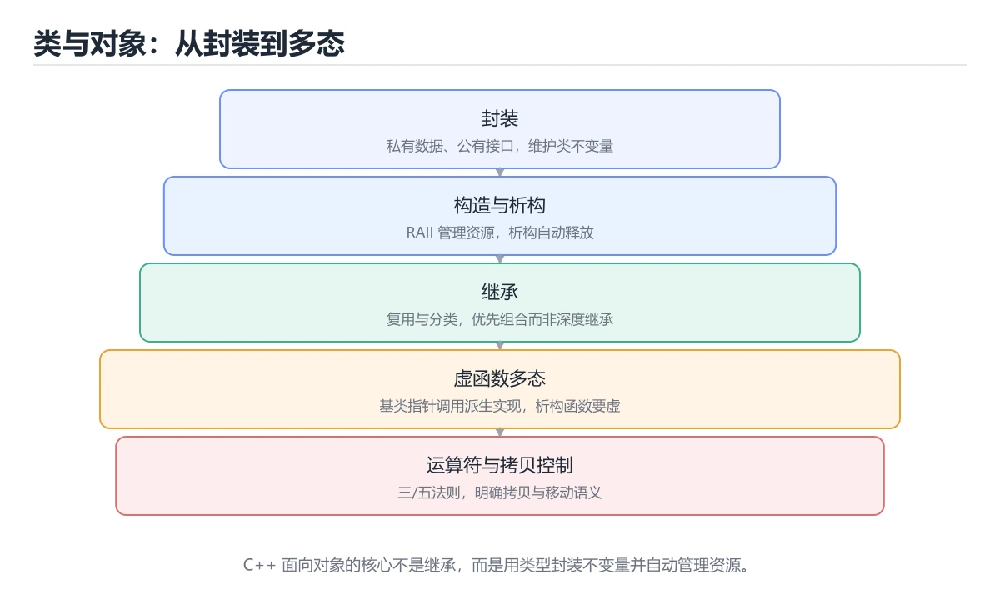

# 类与面向对象




> 内容更新时间：2026-10-06 · 学习阶段：进阶 · 预计用时：55 分钟

## 本节知识框架

**课程定位**：所属分类为「C++」，课程主题为「类与面向对象」，学习阶段为「进阶」，建议用时 55 分钟。

**本课要解决的主问题**：封装、构造析构、继承、虚函数多态与运算符重载。

| 学习层次 | 要回答的问题 | 完成判据 |
| --- | --- | --- |
| 概念层 | 「类与面向对象」有哪些必须区分的对象与术语？ | 能用自己的话定义核心术语，并各举一个正例和一个反例。 |
| 机制层 | 这些对象按什么顺序发生作用，输入如何变成输出？ | 能画出或写出机制步骤，并说明每一步的失败条件。 |
| 应用层 | 什么场景适合使用「类与面向对象」，什么场景不适合？ | 能给出一个真实场景、一个最小示例和一个边界案例。 |
| 性能层 | 时间、空间、吞吐或延迟受哪些量影响？ | 能说出复杂度或性能瓶颈的证据来源；没有证据时明确写“材料未提供”。 |
| 复习层 | 怎样确认自己不是只记住了结论？ | 能独立完成本课自测，并把错误定位到概念、机制、示例或边界。 |

### 阅读路线

1. 先读「核心概念定义」，建立「class」等对象的精确定义。
2. 再读「原理与运行机制」，把定义串成可重复的过程。
3. 用「代码/协议/SQL 示例」验证过程，并只改一个条件观察结果变化。
4. 最后检查性能、易错点、知识关系与自测题，形成可复习的证据链。

**前置知识**：《内存管理与智能指针》

**学习位置**：本课位于《内存管理与智能指针》之后；如果前一课的自测不能通过，应先回补再继续。

**后续衔接**：下一课《模板与泛型编程》会继续使用本课术语，学完后建议立即完成一次自测。

**教材衔接：学习目标**

- 能用自己的话解释类与面向对象解决了什么问题，而不是只背术语。
- 能说清 「class」、「继承」、「虚函数」、「多态」 之间的关系，并分别举出一个例子。
- 能把 class 放回「类与面向对象」的知识体系，说明它和 继承 的边界。
- 能完成本课练习，并用验收标准检查自己的结果。

> 一句话摘要：封装、构造析构、继承、虚函数多态与运算符重载。

**教材衔接：前置知识**

- 先完成上一课《内存管理与智能指针》；如果已经掌握，可以直接用本课练习自测。
- 本课阶段：进阶。建议先完成「内存管理与智能指针」，或确认自己能独立跑通正文里的 balance_ 示例。
- 开始前先复习：class、继承、虚函数。
- 卡在 class 上时不要跳过：把输入、预期和实际输出写成三行，再回头读正文。

**教材衔接：本课小结**

面向对象的三个关键词：**封装**（隐藏实现）、**继承**（复用与扩展）、**多态**（同一接口不同实现）。基类析构函数一定要是虚函数，否则删除派生类对象时会漏掉析构。

## 核心概念定义

> 阅读约定：本课先给「类与面向对象」相关术语的操作性定义与适用边界；正文里的口语化说法与定义冲突时，以定义和可复现示例为准。

| 术语 | 操作性定义 | 本课中的边界 |
| --- | --- | --- |
| const | 要点：成员初始化列表按声明顺序执行；const 成员函数可以被常量对象调用；数据成员一般私有，通过公有方法访问。 | 仅在「类与面向对象」明确给出的输入、版本与资源条件下成立。 |
| override | 多态通过虚函数表（vtable）在运行时决定调用哪个实现；override 让编译器帮你检查签名是否写错。 | 仅在「类与面向对象」明确给出的输入、版本与资源条件下成立。 |
| class | 定义对象属性与行为的类型模板，实例化后得到具体对象。 | 仅在「类与面向对象」明确给出的输入、版本与资源条件下成立。 |
| 多态 | 多态通过虚函数表（vtable）在运行时决定调用哪个实现；override 让编译器帮你检查签名是否写错。 | 仅在「类与面向对象」明确给出的输入、版本与资源条件下成立。 |

### 定义如何使用

在「类与面向对象」中判断一个说法是否成立，先确认它使用的是哪个对象的定义，再检查输入规模、运行环境与失败路径。定义不是口号，而是后续推导、代码示例和自测题共享的约束。

## 原理与运行机制

### 机制总览

1. **建立输入**：把「const」按本课定义整理成可观察、可重复的输入条件。
2. **执行转换**：围绕「override」执行本课的核心步骤；每一步都记录中间状态，避免只看最终输出。
3. **产生输出**：得到「class」后，用正文示例或协议/SQL 结果核对输出是否符合预期。
4. **改变一个条件**：只替换一个边界条件或环境参数，观察「类与面向对象」的结论是否仍然成立。

| 阶段 | 关注对象 | 失败时应检查 |
| --- | --- | --- |
| 输入 | const | 类型、范围、编码、版本或前置状态是否满足定义。 |
| 处理 | override | 顺序、可见性、锁、路由、事务或调度规则是否被破坏。 |
| 输出 | class | 结果是否可复现，错误是否被正确传播而不是被吞掉。 |

本课的机制结论要用「类与面向对象」自己的示例验证。「类与面向对象」没有给出某个数量级、吞吐或内存数据时，本课把该判断标为“材料未提供”，不从相邻主题外推。

**教材衔接：类的基本结构**

```cpp
#include <string>

class Account {
public:                                  // 对外接口
    Account(std::string owner, double balance)
        : owner_(std::move(owner)), balance_(balance) {}   // 初始化列表

    void deposit(double amount) {
        if (amount > 0) balance_ += amount;
    }

    double balance() const { return balance_; }   // const 成员函数：不修改对象

private:                                 // 实现细节
    std::string owner_;
    double balance_;
};
```

要点：成员初始化列表按声明顺序执行；`const` 成员函数可以被常量对象调用；数据成员一般私有，通过公有方法访问。

**教材衔接：类设计速查**

| 成员函数 | 何时生成 | 建议 |
| --- | --- | --- |
| 默认构造 | 未声明任何构造器时 | 需要时显式 `= default` |
| 析构函数 | 总是 | 有资源时用 RAII，或 `virtual` |
| 拷贝构造 | 总是 | 拥有资源时明确实现或 `= delete` |
| 拷贝赋值 | 总是 | 同上，注意自赋值 |
| 移动构造 / 移动赋值 | C++11 起 | 需要高性能转移时实现 |

三法则与零法则：

| 法则 | 内容 |
| --- | --- |
| 三法则 | 需要自定义析构、拷贝构造、拷贝赋值中的任何一个，通常三个都要 |
| 五法则 | 再加上移动构造与移动赋值 |
| 零法则 | **首选**：用智能指针与容器，自己不写任何析构与拷贝逻辑 |

```cpp
class Buffer {
public:
    explicit Buffer(std::size_t size)
        : data_(std::make_unique<char[]>(size)), size_(size) {}

    // 零法则：unique_ptr 已处理好析构与移动，拷贝被自动禁用
    std::size_t size() const noexcept { return size_; }

private:
    std::unique_ptr<char[]> data_;
    std::size_t size_;
};

class Shape {
public:
    virtual ~Shape() = default;               // 基类析构必须 virtual
    virtual double area() const = 0;          // 纯虚函数
    virtual std::string name() const { return "shape"; }
};

class Circle final : public Shape {
public:
    explicit Circle(double r) : r_(r) {}
    double area() const override { return 3.141592653589793 * r_ * r_; }
    std::string name() const override { return "circle"; }

private:
    double r_;
};
```

**教材衔接：版本与时效**

- balance_ 用到的语言特性要对照编译器支持矩阵，再决定采用哪一版标准。
- 升级前确认 class 的兼容范围，把不可回退的改动单独拆成一次提交。

### 升级检查清单

- 先固定当前版本，跑通全部示例与测验，再升级工具链。
- 一次只改一个版本条件，把 class 相关的差异单独记成一条结论。
- 回归范围锁定 balance_ 的默认行为，并确认弃用警告是否出现在构建输出里。
- 升级完成后更新本课「最后复核 / 下次复核」日期，并记录 class 的版本变化。

## 典型应用场景

| 场景 | 典型输入或前提 | 期望产物 |
| --- | --- | --- |
| 学习验证 | 使用本课最小示例和 class、继承 | 能复现正文结论，并解释每一步。 |
| 工程落地 | 把「类与面向对象」放入真实模块或服务边界 | 输出可观测、失败可定位、参数可配置。 |
| 故障排查 | 只改一个版本、规模、输入或依赖条件 | 能区分概念错误、实现错误和环境差异。 |

判断「类与面向对象」的场景是否成立，标准是能否写出输入、处理、输出和失败路径；材料中没有出现的数据在本课标注为“材料未提供”，不用推测替代证据。

**课程内置实验入口**：`sandbox:cpp`，用于动手验证《类与面向对象》的机制；实验结论不替代概念定义与复杂度分析。

## 代码/协议/SQL 示例

### 最小可验证示例

下面保留《类与面向对象》原文中的最小示例。先预测《类与面向对象》示例的输出，再按正文步骤运行或推演；示例依赖外部环境时，同时记录版本与输入。

```cpp
#include <string>

class Account {
public:                                  // 对外接口
    Account(std::string owner, double balance)
        : owner_(std::move(owner)), balance_(balance) {}   // 初始化列表

    void deposit(double amount) {
        if (amount > 0) balance_ += amount;
    }

    double balance() const { return balance_; }   // const 成员函数：不修改对象

private:                                 // 实现细节
    std::string owner_;
    double balance_;
};
```

**教材衔接：构造、析构与拷贝控制**

```cpp
class Buffer {
public:
    explicit Buffer(std::size_t size) : data_(new char[size]), size_(size) {}
    ~Buffer() { delete[] data_; }

    Buffer(const Buffer& other)              // 拷贝构造：深拷贝
        : data_(new char[other.size_]), size_(other.size_) {
        std::copy(other.data_, other.data_ + size_, data_);
    }

    Buffer& operator=(const Buffer& other) {  // 拷贝赋值：先拷贝再释放
        if (this != &other) {
            Buffer tmp(other);
            std::swap(data_, tmp.data_);
            std::swap(size_, tmp.size_);
        }
        return *this;
    }

    Buffer(Buffer&& other) noexcept          // 移动构造：窃取资源
        : data_(other.data_), size_(other.size_) {
        other.data_ = nullptr;
        other.size_ = 0;
    }

private:
    char* data_;
    std::size_t size_;
};
```

**教材衔接：继承与多态**

```cpp
class Shape {
public:
    virtual ~Shape() = default;              // 基类析构必须是虚函数
    virtual double area() const = 0;         // 纯虚函数 → 抽象类
    virtual std::string name() const { return "Shape"; }
};

class Circle : public Shape {
public:
    explicit Circle(double r) : radius_(r) {}
    double area() const override { return 3.14159 * radius_ * radius_; }
    std::string name() const override { return "Circle"; }
private:
    double radius_;
};

void print_area(const Shape& shape) {        // 面向抽象编程
    std::cout << shape.name() << ": " << shape.area();
}
```

多态通过虚函数表（vtable）在运行时决定调用哪个实现；`override` 让编译器帮你检查签名是否写错。

**教材衔接：运算符重载**

```cpp
struct Vector2 {
    double x = 0, y = 0;

    Vector2 operator+(const Vector2& other) const {
        return {x + other.x, y + other.y};
    }

    bool operator==(const Vector2& other) const {
        return x == other.x && y == other.y;
    }
};
```

不要滥用运算符重载：只有当语义直观（数学运算、比较、流输出）时才用。

**教材衔接：零基础详解：类、封装、继承与多态**

### 一句话说清它是什么

类把数据和操作打包，封装控制谁能访问，继承表达「是一种」，多态让同一句调用在不同对象上产生不同行为。
C++ 的多态有一个关键前提：**基类函数必须是 `virtual`**。

### 用生活比喻理解

| 概念 | 比喻 | 说明 |
| --- | --- | --- |
| 类与对象 | 图纸与实物 | 图纸只有一份，实物可以很多 |
| 封装 | 仪器外壳 | 只留按钮，内部不让人乱动 |
| 继承 | 家族血脉 | 子类天然拥有父类的公开能力 |
| 虚函数 | 统一接口 | 同一句「叫一声」，猫喵狗汪 |
| 虚析构 | 归还整套工具 | 用基类指针删除时才能完整析构 |

### 三件必写的东西

```cpp
#include <iostream>
#include <memory>
#include <string>

class Shape {
public:
    explicit Shape(std::string name) : name_(std::move(name)) {}

    // 1. 有虚函数就必须有虚析构
    virtual ~Shape() = default;

    // 2. 接口用纯虚函数，形成抽象类
    virtual double area() const = 0;

    // 3. 共性实现放基类
    const std::string& name() const { return name_; }

    virtual void describe() const {
        std::cout << name_ << " 面积 " << area() << '\n';
    }

private:
    std::string name_;                 // 私有：外部不能直接改
};

class Circle : public Shape {
public:
    explicit Circle(double r) : Shape("圆形"), r_(r) {}
    double area() const override { return 3.14159 * r_ * r_; }

private:
    double r_;
};
```

| 关键字 | 作用 |
| --- | --- |
| `explicit` | 禁止隐式转换，避免意外构造 |
| `virtual` | 允许运行时按实际类型调用 |
| `= 0` | 纯虚函数，基类不能实例化 |
| `override` | 让编译器检查是否真的重写成功 |
| `= default` | 使用编译器生成的实现 |

### 多态是怎么发生的

```cpp
std::vector<std::unique_ptr<Shape>> shapes;
shapes.push_back(std::make_unique<Circle>(2.0));

for (const auto& s : shapes) {
    s->describe();        // 实际调用 Circle::area，这就是多态
}
```

前提是**通过指针或引用调用虚函数**。如果把对象按值赋给基类，会发生「对象切片」，多态失效。

### 值语义：三或五法则

```cpp
class Buffer {
public:
    explicit Buffer(std::size_t n) : size_(n), data_(new char[n]) {}
    ~Buffer() { delete[] data_; }                        // 1. 析构
    Buffer(const Buffer& other)                           // 2. 拷贝构造
        : size_(other.size_), data_(new char[other.size_]) {
        std::copy(other.data_, other.data_ + size_, data_);
    }
    Buffer& operator=(const Buffer& other) {              // 3. 拷贝赋值
        if (this != &other) {
            auto tmp = std::make_unique<char[]>(other.size_);
            std::copy(other.data_, other.data_ + other.size_, tmp.get());
            delete[] data_;
            data_ = tmp.release();
            size_ = other.size_;
        }
        return *this;
    }
    Buffer(Buffer&&) noexcept = default;                  // 4. 移动构造
    Buffer& operator=(Buffer&&) noexcept = default;       // 5. 移动赋值

private:
    std::size_t size_;
    char* data_;
};
```

**更省事的做法**：直接用 `std::vector` 或 `std::string`，让标准库替你处理这一切。

### 继承 vs 组合

| 场景 | 选择 | 原因 |
| --- | --- | --- |
| 「是一种」关系 | 公有继承 | 例如 Circle 是一种 Shape |
| 「有一个」关系 | 组合 | 例如 Car 有一个 Engine |
| 只想复用代码 | 组合 | 继承会带来强耦合 |
| 需要运行时多态 | 继承 + 虚函数 | 或考虑 `std::variant` 等替代方案 |

### 新手最容易踩的八个坑

| 坑 | 现象 | 正确做法 |
| --- | --- | --- |
| 基类析构不是虚的 | 删除时子类资源泄漏 | 加 `virtual ~Base() = default` |
| 忘了 `override` | 拼错签名变成新函数 | 一律写 `override` |
| 按值传递基类对象 | 对象切片，多态失效 | 用 `Shape&` 或 `Shape*` |
| 在构造函数里调虚函数 | 不会走到子类实现 | 构造完再调用 |
| 友元滥用 | 破坏封装 | 优先提供公开方法 |
| 多重继承菱形问题 | 数据重复、二义性 | 用虚继承或改用组合 |
| 忘了 `const` | 常量对象无法调用 | 不改成员的函数加 `const` |
| 手写拷贝却忘了深拷贝 | 双重释放 | 用容器或智能指针 |

### 手把手练习：员工薪资多态

```cpp
#include <iomanip>
#include <iostream>
#include <memory>
#include <string>
#include <vector>

class Employee {
public:
    explicit Employee(std::string name) : name_(std::move(name)) {}
    virtual ~Employee() = default;
    virtual double monthlyPay() const = 0;

    void print() const {
        std::cout << std::setw(8) << name_ << " 月薪 "
                  << std::fixed << std::setprecision(2)
                  << monthlyPay() << '\n';
    }

private:
    std::string name_;
};

class Salaried : public Employee {
public:
    Salaried(std::string name, double monthly)
        : Employee(std::move(name)), monthly_(monthly) {}
    double monthlyPay() const override { return monthly_; }

private:
    double monthly_;
};

class Hourly : public Employee {
public:
    Hourly(std::string name, double rate, double hours)
        : Employee(std::move(name)), rate_(rate), hours_(hours) {}
    double monthlyPay() const override { return rate_ * hours_; }

private:
    double rate_, hours_;
};

int main() {
    std::vector<std::unique_ptr<Employee>> staff;
    staff.push_back(std::make_unique<Salaried>("小明", 12000));
    staff.push_back(std::make_unique<Hourly>("小红", 80, 160));

    double total = 0;
    for (const auto& e : staff) {
        e->print();
        total += e->monthlyPay();
    }
    std::cout << "合计 " << total << '\n';
}
```

### 学完自测

- [ ] 能解释虚函数与多态的关系。
- [ ] 知道为什么有虚函数就要有虚析构。
- [ ] 能说出对象切片是怎么发生的。
- [ ] 能判断一个场景该用继承还是组合。
- [ ] 知道三或五法则分别指哪几个函数。

## 时间/空间复杂度或性能分析

**复杂度证据**：「类与面向对象」的现有材料没有给出渐近时间或空间复杂度的明确结论，本课只做定性检查，不补写未经验证的 $O$ 记号。

| 维度 | 本课关注点 | 判断依据 |
| --- | --- | --- |
| 时间/延迟 | 「类与面向对象」的主要步骤是否会随输入规模、并发度或网络往返增长。 | 以正文复杂度、基准数据或可重复测量为准。 |
| 空间/内存 | 中间状态、缓存、副本、连接或索引是否随规模增长。 | 记录峰值内存与数据副本，不只看最终结果。 |
| 吞吐/资源 | 版本、调度、锁、IO、序列化或协议开销是否成为瓶颈。 | 固定环境做对照实验，改变一个变量。 |

评估「类与面向对象」时要区分“正确性成立”和“性能达标”两件事；材料没有给出基准时，本课只保留量级来源与测量方法，不写不可验证的绝对数字。

## 常见误区与易错点

> 复核《类与面向对象》的易错点时，优先保留原文的错误表、故障现场与排错路径；每条修正都要能用本课示例复验。

| 易错点 | 常见表现 | 正确做法 |
| --- | --- | --- |
| 只背结论 | 能复述「类与面向对象」的定义，却说不清输入、输出与边界。 | 回到机制步骤，用最小示例逐一验证。 |
| 混淆相邻概念 | 把本课对象与相邻主题的对象当成同一类。 | 先比较定义、资源归属、生命周期和失败模式。 |
| 忽略版本与环境 | 在开发机通过后直接外推到生产环境。 | 固定版本、输入和资源条件，再记录可复现结果。 |

**教材衔接：常见错误与排查**

| 容易写错的做法 | 实际现象 | 原因与正确做法 |
| --- | --- | --- |
| 基类析构不写 `virtual` | 通过基类指针删除子类时资源泄漏 | 基类析构声明 `virtual` |
| 子类重写忘写 `override` | 拼错签名后不生效 | 一律加 `override` |
| 构造函数中调用虚函数 | 调用到基类版本 | 构造/析构期间不调用虚函数 |
| 成员初始化顺序与声明顺序不一致 | 初始化值不符合预期 | 按声明顺序初始化，开 `-Wreorder` |
| 拷贝构造只做浅拷贝 | 双重释放 | 深拷贝或 `= delete`，优先零法则 |
| 用 `mutable` 改逻辑状态 | 破坏 const 语义 | 只在缓存等少数场景使用 |
| 头文件里定义成员对象导致循环依赖 | 编译错误 | 用前置声明 + 指针/引用，实现放源文件 |
| 把本应私有的数据设为 public | 外部随意修改 | 私有数据 + 访问函数 |
| 忘记 `explicit` | 隐式转换引发意外调用 | 单参数构造器加 `explicit` |
| 在类里 `new` 却不在析构里 `delete` | 内存泄漏 | 用智能指针成员 |

**教材衔接：故障现场**

### 现场 1：基类析构不写 virtual

**症状**：在《类与面向对象》的复现场景中，通过基类指针删除子类时资源泄漏。

**根因**：“通过基类指针删除子类时资源泄漏”只是表层结果。向上追溯会落到“基类析构不写 virtual”这一步，因为它省略了《类与面向对象》的约束，使实现行为和预期模型发生了偏离。

**修复**：针对《类与面向对象》的问题，基类析构声明 virtual。

**验证**：保留《类与面向对象》里触发“通过基类指针删除子类时资源泄漏”的输入、版本和日志，按“基类析构声明 virtual”完成修改后原样重放；只有失败现象消失且相邻场景仍可解释，才保留改动。

### 现场 2：子类重写忘写 override

**症状**：在《类与面向对象》的复现场景中，拼错签名后不生效。

**根因**：触发点是把“子类重写忘写 override”当成安全做法。它没有满足《类与面向对象》要求的前提，因此先表现为“拼错签名后不生效”；排查时先完整复现这一段，再核对输入、配置与依赖。

**修复**：针对《类与面向对象》的问题，一律加 override。

**验证**：在《类与面向对象》中按“一律加 override”调整后，从“子类重写忘写 override”的触发条件重放同一条路径，确认“拼错签名后不生效”不再出现，并补一个相邻边界用例检查没有引入新问题。

### 现场 3：构造函数中调用虚函数

**症状**：在《类与面向对象》的复现场景中，调用到基类版本。

**根因**：“调用到基类版本”只是表层结果。向上追溯会落到“构造函数中调用虚函数”这一步，因为它省略了《类与面向对象》的约束，使实现行为和预期模型发生了偏离。

**修复**：针对《类与面向对象》的问题，构造/析构期间不调用虚函数。

**验证**：先在《类与面向对象》中记录“构造函数中调用虚函数”留下的失败证据，再执行“构造/析构期间不调用虚函数”并重放；确认错误路径变为明确结果，且修复没有掩盖同类故障。

## 与其他知识点的关系

| 关系 | 课程 | 为什么 |
| --- | --- | --- |
| 先修 | 《内存管理与智能指针》 | 本课会直接使用它的概念或操作前提。 |
| 关联 | 《模板与泛型编程》 | 用于横向比较或把本课结论迁移到相邻主题。 |
| 关联 | 《类与对象》 | 用于横向比较或把本课结论迁移到相邻主题。 |
| 关联 | 《继承、接口与多态》 | 用于横向比较或把本课结论迁移到相邻主题。 |
| 关联 | 《继承、接口与多态》 | 用于横向比较或把本课结论迁移到相邻主题。 |
| 前置顺序 | 《内存管理与智能指针》 | 同分类中安排在本课之前，建议先完成其自测。 |
| 后续顺序 | 《模板与泛型编程》 | 同分类中安排在本课之后，会继续使用本课术语。 |

把「类与面向对象」放回知识体系时，不只要记住“前面学过什么”，还要说明两个主题在输入、机制、资源边界和失败模式上的差异。这样才能把单课知识迁移到项目、排障和后续课程。

## 自测题与参考答案

> 先独立作答《类与面向对象》的自测题，再对照答案与解析；每处判断都要能在本课正文或示例中找到依据。

### 自测 1

围绕“类与面向对象”中的 class、继承、虚函数，下列哪两项是本课强调的实践判断？

A. 验证 继承 时要固定版本并覆盖边界输入，结论才可复现
B. 把 继承 的单次运行结果当成所有版本和规模都成立
C. 学习 class 时要同时说明输入、输出和失败路径，不能只看正常流程
D. 只要 class 的常规示例通过，就可以跳过边界与异常路径

**参考答案**：验证 继承 时要固定版本并覆盖边界输入，结论才可复现；学习 class 时要同时说明输入、输出和失败路径，不能只看正常流程

**解析**：本课把类与面向对象拆成概念、示例与故障现场三部分，因此判断 class 时必须同时交代输入、输出和失败路径，这使“学习 class 时要同时说明输入、输出和失败路径，不能只看正常流程”成立。在类与面向对象里，判断 继承 时要固定版本与边界输入，所以“验证 继承 时要固定版本并覆盖边界输入，结论才可复现”才可复现。

### 自测 2

override 关键字的作用是？

A. 强制内联
B. 禁止重载
C. 声明纯虚函数，不过这需要额外的前提条件
D. 让编译器检查是否真的覆盖了基类虚函数

**参考答案**：让编译器检查是否真的覆盖了基类虚函数

**解析**：在「类与面向对象」里，让编译器检查是否真的覆盖了基类虚函数。签名写错时 override 会直接编译报错，避免「以为覆盖了其实隐藏了」。这道题的关键在「类与面向对象」的class、继承、虚函数：先确认题干“override 关键字的作用是”问的是哪一步，再排除偷换前提的选项。把“让编译器检查是否真的覆盖了基类虚函数”代回「类与面向对象」里“override 关键字的作用是”的例子核对，条件一旦改变，结论就要用class、继承、虚函数重新推导。

### 自测 3

阅读「类与面向对象」正文里的这段 C++ 代码，下面哪一项判断是正确的？

```cpp
class Shape {
public:
    virtual ~Shape() = default;              // 基类析构必须是虚函数
    virtual double area() const = 0;         // 纯虚函数 → 抽象类
    virtual std::string name() const { return "Shape"; }
};

class Circle : public Shape {
public:
    explicit Circle(double r) : radius_(r) {}
    double area() const override { return 3.14159 * radius_ * radius_; }
    std::string name() const override { return "Circle"; }
private:
    double radius_;
};

void print_area(const Shape& shape) {        // 面向抽象编程
    std::cout << shape.name() << ": " << shape.area();
}
```

A. 这段代码把主要逻辑封装在函数或方法里，需要被调用才会执行。
B. 这段代码包含异常处理分支，失败时会走专门的补救路径。
C. 这段代码会读取外部输入，结果依赖传入的数据。
D. 这段代码只做静态声明，没有循环、分支或可观察输出。

**参考答案**：这段代码把主要逻辑封装在函数或方法里，需要被调用才会执行。

**解析**：在「类与面向对象」里，题干的正确项是这段代码把主要逻辑封装在函数或方法里，需要被调用才会执行，在「类与面向对象」里封装边界决定class从哪一步开始生效。把输入或边界换成空值、极值或失败情况后，结论要以「类与面向对象」的实际运行结果为准。把“这段代码把主要逻辑封装在函数或方法里”代回「类与面向对象」里“阅读类与面向对象正文里的这段 C++ 代码”的例子核对，条件一旦改变，结论就要用class、继承、虚函数重新推导。

**教材衔接：复习与自测**

- [ ] 首选零法则：用智能指针与容器管理资源。
- [ ] 基类析构函数声明为 `virtual`。
- [ ] 重写方法一律加 `override`。
- [ ] 成员初始化顺序与声明顺序保持一致。
- [ ] 单参数构造器加 `explicit` 防止隐式转换。

**教材衔接：动手练习**

> 本课练习重点：围绕「class、继承、虚函数」完成复述、实验和交付，每个结果都要能被别人检查。

先开启警告编译 class 的最小程序，再验证内存与边界，最后用 Sanitizer 复查。

### 练习 1：建立心智模型（10 分钟）

合上教程，用 3～5 句话回答：

1. 类与面向对象解决了什么问题？
2. 如果没有它，会出现什么具体后果？
3. 它和「继承」是什么关系？

验收标准：用自己的话解释 class，并给出一个它不成立的反例。

### 练习 2：做一次可控实验（20 分钟）

从正文中选一个最小示例，完成以下操作：

1. 先预测修改一个参数、输入或步骤后的结果。
2. 再实际执行或逐步推演，记录真实结果。
3. 如果结果与预测不同，写出差异原因。

**验收标准**：把 balance_ 当作原例，改动一次继承的取值，记录命令、输出与差异原因；五步里缺任意一步都算未完成。

### 练习 3：交付一个小结果（30 分钟）

用最小程序复现 继承 的行为，编译时不允许出现警告。

任务要求：

- 结果必须能被别人检查，不能只写“我已经理解了”。
- 至少覆盖「class」和「继承」两个关键词。
- 写出 1 个仍然不确定的问题，以及下一步如何验证。

> 提示：时间有限时优先做练习 1 和练习 2；练习 3 可以拆成两次完成。

**教材衔接：可运行练习**

### 任务 1：先跑通，再解释

```cpp
#include <iomanip>
#include <iostream>
#include <memory>
#include <string>
#include <vector>

class Employee {
public:
    explicit Employee(std::string name) : name_(std::move(name)) {}
    virtual ~Employee() = default;
    virtual double monthlyPay() const = 0;

    void print() const {
        std::cout << std::setw(8) << name_ << " 月薪 "
                  << std::fixed << std::setprecision(2)
                  << monthlyPay() << '\n';
    }

private:
    std::string name_;
};

class Salaried : public Employee {
public:
    Salaried(std::string name, double monthly)
        : Employee(std::move(name)), monthly_(monthly) {}
    double monthlyPay() const override { return monthly_; }

private:
    double monthly_;
};

class Hourly : public Employee {
public:
    Hourly(std::string name, double rate, double hours)
        : Employee(std::move(name)), rate_(rate), hours_(hours) {}
    double monthlyPay() const override { return rate_ * hours_; }

private:
    double rate_, hours_;
};

int main() {
    std::vector<std::unique_ptr<Employee>> staff;
    staff.push_back(std::make_unique<Salaried>("小明", 12000));
    staff.push_back(std::make_unique<Hourly>("小红", 80, 160));

    double total = 0;
    for (const auto& e : staff) {
        e->print();
        total += e->monthlyPay();
    }
    std::cout << "合计 " << total << '\n';
}
```

### 任务 2：只改一个条件

把「类与面向对象」的最小示例复制一份，只改一个条件再跑一次：

- 改动点：只把 class 的输入换成空值、极值或错误输入，其余保持不变。
- 预测：先写下「类与面向对象」在改动后的输出或错误信息，再运行。
- 记录：对照改动前后的结果，指出差异出在哪一步。
- 验收：换回原条件能复现原结果，改动只影响class。

### 任务 3：迁移到自己的数据

换一个 继承 场景重做一次，确认结论不是只对示例数据成立。

**教材衔接：本课复习清单**

离开本课前，逐项确认：

- [ ] 不看解析，能说出「基类析构函数声明为 virtual 的主要原因是？」的判断依据。
- [ ] 不看解析，能说出「override 关键字的作用是？」的判断依据。
- [ ] 不看解析，能说出「含有纯虚函数（= 0）的类是？」的判断依据。
- [ ] 不看解析，能说出「拷贝构造函数的典型签名是？」的判断依据。
- [ ] 不看解析，能说出「非静态成员函数中的 this 指针指向？」的判断依据。
- [ ] 至少运行一次 balance_ 的示例，记录输入、输出和 class 的边界情况。
- [ ] 把本课最容易混淆的两个概念写成一句话对照。

| 复盘项 | 记录 |
| --- | --- |
| 已经能独立解释的考点 |  |
| 仍然说不清的概念 |  |
| 下一步验证动作 |  |

---

## 术语速查

| 术语 | 一句话说明 |
| --- | --- |
| `const` | 要点：成员初始化列表按声明顺序执行；`const` 成员函数可以被常量对象调用；数据成员一般私有，通过公有方法访问。 |
| `override` | 多态通过虚函数表（vtable）在运行时决定调用哪个实现；`override` 让编译器帮你检查签名是否写错。 |
| `class` | 定义对象属性与行为的类型模板，实例化后得到具体对象。 |
| `多态` | 多态通过虚函数表（vtable）在运行时决定调用哪个实现；override 让编译器帮你检查签名是否写错。 |

## 考点精讲

### 考点 1：多选辨析·class

- **题目**：围绕“类与面向对象”中的 class、继承、虚函数，下列哪两项是本课强调的实践判断？
- **判断依据**：本课把类与面向对象拆成概念、示例与故障现场三部分，因此判断 class 时必须同时交代输入、输出和失败路径，这使“学习 class 时要同时说明输入、输出和失败路径，不能只看正常流程”成立。在类与面向对象里，判断 继承 时要固定版本与边界输入，所以“验证 继承 时要固定版本并覆盖边界输入，结论才可复现”才可复现。

### 考点 2：概念判断·class

- **题目**：override 关键字的作用是？
- **判断依据**：在「类与面向对象」里，让编译器检查是否真的覆盖了基类虚函数。签名写错时 override 会直接编译报错，避免「以为覆盖了其实隐藏了」。这道题的关键在「类与面向对象」的class、继承、虚函数：先确认题干“override 关键字的作用是”问的是哪一步，再排除偷换前提的选项。把“让编译器检查是否真的覆盖了基类虚函数”代回「类与面向对象」里“override 关键字的作用是”的例子核对，条件一旦改变，结论就要用class、继承、虚函数重新推导。

### 考点 3：概念判断·class

- **题目**：含有纯虚函数（= 0）的类是？
- **判断依据**：抽象类只能作为接口被继承，派生类必须实现全部纯虚函数才能实例化。在「类与面向对象」里，其他选项：含纯虚函数的类是抽象类，不能直接实例化。在「类与面向对象」里，如果只凭关键词作答，很容易把「final 类」、「友元类」与「抽象类，不能直接实例化」混在一起；在「类与面向对象」里判断这道题，要把class、继承、虚函数的条件、过程与失败路径逐项对齐，换成“含有纯虚函数（= 0）的类是”这个场景，只有满足前提的结论才成立。

### 考点 4：概念判断·class

- **题目**：拷贝构造函数的典型签名是？
- **判断依据**：在「类与面向对象」里，结论应落在「ClassName(const ClassName& other)」。必须传引用，否则按值传参又要拷贝，会无限递归。「类与面向对象」要求先交代class、继承、虚函数的前提再下结论，所以“ClassName(const Clas”只在题干“拷贝构造函数的典型签名是”给定的条件下成立。

### 考点 5：代码补全·class

- **题目**：阅读「类与面向对象」正文里的这段 C++ 代码，下面哪一项判断是正确的？
- **判断依据**：在「类与面向对象」里，题干的正确项是这段代码把主要逻辑封装在函数或方法里，需要被调用才会执行，在「类与面向对象」里封装边界决定class从哪一步开始生效。把输入或边界换成空值、极值或失败情况后，结论要以「类与面向对象」的实际运行结果为准。把“这段代码把主要逻辑封装在函数或方法里”代回「类与面向对象」里“阅读类与面向对象正文里的这段 C++ 代码”的例子核对，条件一旦改变，结论就要用class、继承、虚函数重新推导。

### 考点 6：填空·class

- **题目**：补全代码：「类与面向对象」示例中，下面这行代码缺少哪个关键字或函数名？请填入 ____。 `Buffer& ____=(const Buffer& other) { // 拷贝赋值：先拷贝再释放`
- **判断依据**：这道题的关键在「类与面向对象」的class、继承、虚函数：先确认题干“补全代码”问的是哪一步，再排除偷换前提的选项。「类与面向对象」要求先交代class、继承、虚函数的前提再下结论，所以“operator”只在题干“类与面向对象示例中”给定的条件下成立。“operator”与术语表相呼应，只有符合class、继承、虚函数约束的“operator”才是正文支持的结论。

## English Overview

**Title:** Classes & OOP

**Summary:** Encapsulation, constructors, inheritance, virtual functions.

**Category:** C++
**Level:** 进阶
**Key terms:** class, 继承, 虚函数, 多态, 运算符重载, RAII

## 内容元数据

- 内容版本：v2.0
- 最后更新：2026-10-06
- 学习阶段：进阶
- 适用环境：C++20 / GCC 13+ 或 Clang 17+
；本课聚焦 class。
- 内容来源：内置结构化课程与工程实践整理
- 相关主题：class、继承、虚函数、多态、运算符重载、RAII
- 质量版本：P0 测验标准 + P1 覆盖扩展 + P2 体验补全

## 参考资料与复核

- 最后复核：2026-10-04
- 下次复核：2027-05-10
- 复核范围：版本兼容、API 行为、安全建议与工程实践
- 来源性质：官方文档、标准或权威教材；正文为离线教学重组

| 参考资料 | 本课用途 |
| --- | --- |
| [C++ 内存管理](https://en.cppreference.com/w/cpp/memory) | RAII、智能指针与所有权 |
| [C++ 模板](https://en.cppreference.com/w/cpp/language/templates) | 模板、推导与泛型编程 |
| [CMake 文档](https://cmake.org/documentation/) | 跨平台构建与依赖管理 |

> 「类与面向对象」的链接用于离线阅读后的延伸核对；App 不会自动联网。
