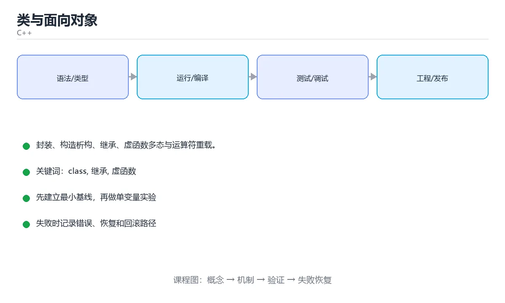

# 类与面向对象



> 内容更新时间：2026-10-03 · 学习阶段：进阶 · 预计用时：17 分钟

## 学习目标

- 能用自己的话解释「类与面向对象」解决了什么问题，而不是只背术语。
- 能说清 「class」、「继承」、「虚函数」、「多态」 之间的关系，并分别举出一个例子。
- 能把本课知识放回「C++」的知识体系，说明它和相邻主题的边界。
- 能完成本课练习，并用验收标准检查自己的结果。

> 一句话摘要：封装、构造析构、继承、虚函数多态与运算符重载。

## 前置知识

- 先完成上一课《内存管理与智能指针》；如果已经掌握，可以直接用本课练习自测。
- 本课阶段：进阶。建议先掌握同一分类的基础课程，并能独立运行正文中的最小示例。
- 开始前先复习：class、继承、虚函数。
- 如果某一步看不懂，先记录具体卡点，完成练习后再回头读一遍。


## 类的基本结构

```cpp
#include <string>

class Account {
public:                                  // 对外接口
    Account(std::string owner, double balance)
        : owner_(std::move(owner)), balance_(balance) {}   // 初始化列表

    void deposit(double amount) {
        if (amount > 0) balance_ += amount;
    }

    double balance() const { return balance_; }   // const 成员函数：不修改对象

private:                                 // 实现细节
    std::string owner_;
    double balance_;
};
```

要点：成员初始化列表按声明顺序执行；`const` 成员函数可以被常量对象调用；数据成员一般私有，通过公有方法访问。

## 构造、析构与拷贝控制

```cpp
class Buffer {
public:
    explicit Buffer(std::size_t size) : data_(new char[size]), size_(size) {}
    ~Buffer() { delete[] data_; }

    Buffer(const Buffer& other)              // 拷贝构造：深拷贝
        : data_(new char[other.size_]), size_(other.size_) {
        std::copy(other.data_, other.data_ + size_, data_);
    }

    Buffer& operator=(const Buffer& other) {  // 拷贝赋值：先拷贝再释放
        if (this != &other) {
            Buffer tmp(other);
            std::swap(data_, tmp.data_);
            std::swap(size_, tmp.size_);
        }
        return *this;
    }

    Buffer(Buffer&& other) noexcept          // 移动构造：窃取资源
        : data_(other.data_), size_(other.size_) {
        other.data_ = nullptr;
        other.size_ = 0;
    }

private:
    char* data_;
    std::size_t size_;
};
```

## 继承与多态

```cpp
class Shape {
public:
    virtual ~Shape() = default;              // 基类析构必须是虚函数
    virtual double area() const = 0;         // 纯虚函数 → 抽象类
    virtual std::string name() const { return "Shape"; }
};

class Circle : public Shape {
public:
    explicit Circle(double r) : radius_(r) {}
    double area() const override { return 3.14159 * radius_ * radius_; }
    std::string name() const override { return "Circle"; }
private:
    double radius_;
};

void print_area(const Shape& shape) {        // 面向抽象编程
    std::cout << shape.name() << ": " << shape.area();
}
```

多态通过虚函数表（vtable）在运行时决定调用哪个实现；`override` 让编译器帮你检查签名是否写错。

## 运算符重载

```cpp
struct Vector2 {
    double x = 0, y = 0;

    Vector2 operator+(const Vector2& other) const {
        return {x + other.x, y + other.y};
    }

    bool operator==(const Vector2& other) const {
        return x == other.x && y == other.y;
    }
};
```

不要滥用运算符重载：只有当语义直观（数学运算、比较、流输出）时才用。

## 本课小结
面向对象的三个关键词：**封装**（隐藏实现）、**继承**（复用与扩展）、**多态**（同一接口不同实现）。基类析构函数一定要是虚函数，否则删除派生类对象时会漏掉析构。


## 类设计速查

| 成员函数 | 何时生成 | 建议 |
| --- | --- | --- |
| 默认构造 | 未声明任何构造器时 | 需要时显式 `= default` |
| 析构函数 | 总是 | 有资源时用 RAII，或 `virtual` |
| 拷贝构造 | 总是 | 拥有资源时明确实现或 `= delete` |
| 拷贝赋值 | 总是 | 同上，注意自赋值 |
| 移动构造 / 移动赋值 | C++11 起 | 需要高性能转移时实现 |

三法则与零法则：

| 法则 | 内容 |
| --- | --- |
| 三法则 | 需要自定义析构、拷贝构造、拷贝赋值中的任何一个，通常三个都要 |
| 五法则 | 再加上移动构造与移动赋值 |
| 零法则 | **首选**：用智能指针与容器，自己不写任何析构与拷贝逻辑 |

```cpp
class Buffer {
public:
    explicit Buffer(std::size_t size)
        : data_(std::make_unique<char[]>(size)), size_(size) {}

    // 零法则：unique_ptr 已处理好析构与移动，拷贝被自动禁用
    std::size_t size() const noexcept { return size_; }

private:
    std::unique_ptr<char[]> data_;
    std::size_t size_;
};

class Shape {
public:
    virtual ~Shape() = default;               // 基类析构必须 virtual
    virtual double area() const = 0;          // 纯虚函数
    virtual std::string name() const { return "shape"; }
};

class Circle final : public Shape {
public:
    explicit Circle(double r) : r_(r) {}
    double area() const override { return 3.141592653589793 * r_ * r_; }
    std::string name() const override { return "circle"; }

private:
    double r_;
};
```

## 常见错误对照表

| 容易写错的做法 | 实际现象 | 原因与正确做法 |
| --- | --- | --- |
| 基类析构不写 `virtual` | 通过基类指针删除子类时资源泄漏 | 基类析构声明 `virtual` |
| 子类重写忘写 `override` | 拼错签名后不生效 | 一律加 `override` |
| 构造函数中调用虚函数 | 调用到基类版本 | 构造/析构期间不调用虚函数 |
| 成员初始化顺序与声明顺序不一致 | 初始化值不符合预期 | 按声明顺序初始化，开 `-Wreorder` |
| 拷贝构造只做浅拷贝 | 双重释放 | 深拷贝或 `= delete`，优先零法则 |
| 用 `mutable` 改逻辑状态 | 破坏 const 语义 | 只在缓存等少数场景使用 |
| 头文件里定义成员对象导致循环依赖 | 编译错误 | 用前置声明 + 指针/引用，实现放源文件 |
| 把本应私有的数据设为 public | 外部随意修改 | 私有数据 + 访问函数 |
| 忘记 `explicit` | 隐式转换引发意外调用 | 单参数构造器加 `explicit` |
| 在类里 `new` 却不在析构里 `delete` | 内存泄漏 | 用智能指针成员 |

## 自测清单

- [ ] 首选零法则：用智能指针与容器管理资源。
- [ ] 基类析构函数声明为 `virtual`。
- [ ] 重写方法一律加 `override`。
- [ ] 成员初始化顺序与声明顺序保持一致。
- [ ] 单参数构造器加 `explicit` 防止隐式转换。


## 零基础详解：类、封装、继承与多态

### 一句话说清它是什么

类把数据和操作打包，封装控制谁能访问，继承表达「是一种」，多态让同一句调用在不同对象上产生不同行为。
C++ 的多态有一个关键前提：**基类函数必须是 `virtual`**。

### 用生活比喻理解

| 概念 | 比喻 | 说明 |
| --- | --- | --- |
| 类与对象 | 图纸与实物 | 图纸只有一份，实物可以很多 |
| 封装 | 仪器外壳 | 只留按钮，内部不让人乱动 |
| 继承 | 家族血脉 | 子类天然拥有父类的公开能力 |
| 虚函数 | 统一接口 | 同一句「叫一声」，猫喵狗汪 |
| 虚析构 | 归还整套工具 | 用基类指针删除时才能完整析构 |

### 三件必写的东西

```cpp
#include <iostream>
#include <memory>
#include <string>

class Shape {
public:
    explicit Shape(std::string name) : name_(std::move(name)) {}

    // 1. 有虚函数就必须有虚析构
    virtual ~Shape() = default;

    // 2. 接口用纯虚函数，形成抽象类
    virtual double area() const = 0;

    // 3. 共性实现放基类
    const std::string& name() const { return name_; }

    virtual void describe() const {
        std::cout << name_ << " 面积 " << area() << '\n';
    }

private:
    std::string name_;                 // 私有：外部不能直接改
};

class Circle : public Shape {
public:
    explicit Circle(double r) : Shape("圆形"), r_(r) {}
    double area() const override { return 3.14159 * r_ * r_; }

private:
    double r_;
};
```

| 关键字 | 作用 |
| --- | --- |
| `explicit` | 禁止隐式转换，避免意外构造 |
| `virtual` | 允许运行时按实际类型调用 |
| `= 0` | 纯虚函数，基类不能实例化 |
| `override` | 让编译器检查是否真的重写成功 |
| `= default` | 使用编译器生成的实现 |

### 多态是怎么发生的

```cpp
std::vector<std::unique_ptr<Shape>> shapes;
shapes.push_back(std::make_unique<Circle>(2.0));

for (const auto& s : shapes) {
    s->describe();        // 实际调用 Circle::area，这就是多态
}
```

前提是**通过指针或引用调用虚函数**。如果把对象按值赋给基类，会发生「对象切片」，多态失效。

### 值语义：三或五法则

```cpp
class Buffer {
public:
    explicit Buffer(std::size_t n) : size_(n), data_(new char[n]) {}
    ~Buffer() { delete[] data_; }                        // 1. 析构
    Buffer(const Buffer& other)                           // 2. 拷贝构造
        : size_(other.size_), data_(new char[other.size_]) {
        std::copy(other.data_, other.data_ + size_, data_);
    }
    Buffer& operator=(const Buffer& other) {              // 3. 拷贝赋值
        if (this != &other) {
            auto tmp = std::make_unique<char[]>(other.size_);
            std::copy(other.data_, other.data_ + other.size_, tmp.get());
            delete[] data_;
            data_ = tmp.release();
            size_ = other.size_;
        }
        return *this;
    }
    Buffer(Buffer&&) noexcept = default;                  // 4. 移动构造
    Buffer& operator=(Buffer&&) noexcept = default;       // 5. 移动赋值

private:
    std::size_t size_;
    char* data_;
};
```

**更省事的做法**：直接用 `std::vector` 或 `std::string`，让标准库替你处理这一切。

### 继承 vs 组合

| 场景 | 选择 | 原因 |
| --- | --- | --- |
| 「是一种」关系 | 公有继承 | 例如 Circle 是一种 Shape |
| 「有一个」关系 | 组合 | 例如 Car 有一个 Engine |
| 只想复用代码 | 组合 | 继承会带来强耦合 |
| 需要运行时多态 | 继承 + 虚函数 | 或考虑 `std::variant` 等替代方案 |

### 新手最容易踩的八个坑

| 坑 | 现象 | 正确做法 |
| --- | --- | --- |
| 基类析构不是虚的 | 删除时子类资源泄漏 | 加 `virtual ~Base() = default` |
| 忘了 `override` | 拼错签名变成新函数 | 一律写 `override` |
| 按值传递基类对象 | 对象切片，多态失效 | 用 `Shape&` 或 `Shape*` |
| 在构造函数里调虚函数 | 不会走到子类实现 | 构造完再调用 |
| 友元滥用 | 破坏封装 | 优先提供公开方法 |
| 多重继承菱形问题 | 数据重复、二义性 | 用虚继承或改用组合 |
| 忘了 `const` | 常量对象无法调用 | 不改成员的函数加 `const` |
| 手写拷贝却忘了深拷贝 | 双重释放 | 用容器或智能指针 |

### 手把手练习：员工薪资多态

```cpp
#include <iomanip>
#include <iostream>
#include <memory>
#include <string>
#include <vector>

class Employee {
public:
    explicit Employee(std::string name) : name_(std::move(name)) {}
    virtual ~Employee() = default;
    virtual double monthlyPay() const = 0;

    void print() const {
        std::cout << std::setw(8) << name_ << " 月薪 "
                  << std::fixed << std::setprecision(2)
                  << monthlyPay() << '\n';
    }

private:
    std::string name_;
};

class Salaried : public Employee {
public:
    Salaried(std::string name, double monthly)
        : Employee(std::move(name)), monthly_(monthly) {}
    double monthlyPay() const override { return monthly_; }

private:
    double monthly_;
};

class Hourly : public Employee {
public:
    Hourly(std::string name, double rate, double hours)
        : Employee(std::move(name)), rate_(rate), hours_(hours) {}
    double monthlyPay() const override { return rate_ * hours_; }

private:
    double rate_, hours_;
};

int main() {
    std::vector<std::unique_ptr<Employee>> staff;
    staff.push_back(std::make_unique<Salaried>("小明", 12000));
    staff.push_back(std::make_unique<Hourly>("小红", 80, 160));

    double total = 0;
    for (const auto& e : staff) {
        e->print();
        total += e->monthlyPay();
    }
    std::cout << "合计 " << total << '\n';
}
```

### 学完自测

- [ ] 能解释虚函数与多态的关系。
- [ ] 知道为什么有虚函数就要有虚析构。
- [ ] 能说出对象切片是怎么发生的。
- [ ] 能判断一个场景该用继承还是组合。
- [ ] 知道三或五法则分别指哪几个函数。

## 动手练习


> 本课练习重点：围绕「class、继承、虚函数」完成复述、实验和交付，每个结果都要能被别人检查。

先开启警告编译最小程序，再验证内存与边界，最后用 Sanitizer 跑一遍。

### 练习 1：建立心智模型（10 分钟）

合上教程，用 3～5 句话回答：

1. 「类与面向对象」解决了什么问题？
2. 如果没有它，会出现什么具体后果？
3. 它和「继承」是什么关系？

**验收标准**：至少出现一个本课关键词，并写出一个反例、边界条件或失效场景。

### 练习 2：做一次可控实验（20 分钟）

从正文中选一个最小示例，完成以下操作：

1. 先预测修改一个参数、输入或步骤后的结果。
2. 再实际执行或逐步推演，记录真实结果。
3. 如果结果与预测不同，写出差异原因。

**验收标准**：留下「原例 → 改动 → 预测 → 结果 → 原因」五步记录。

### 练习 3：交付一个小结果（30 分钟）

写一个可独立编译的小程序，开启 `-Wall -Wextra`，确保没有警告。

任务要求：

- 结果必须能被别人检查，不能只写“我已经理解了”。
- 至少覆盖「class」和「继承」两个关键词。
- 写出 1 个仍然不确定的问题，以及下一步如何验证。

> 提示：时间有限时优先做练习 1 和练习 2；练习 3 可以拆成两次完成。


## 考点精讲：把测验题还原成判断过程

本课有 5 个判断点。先自己作答，再看「判断依据」；如果结论正确但理由不完整，回到正文对应章节补足概念。

### 考点 1：基类析构函数声明为 virtual 的主要原因是？

- **正确判断**：保证通过基类指针删除派生对象时派生析构被调用
- **判断依据**：析构非虚时 delete 基类指针只调用基类析构，派生类资源会泄漏。其他选项：基类析构函数不是 virtual 时，通过基类指针删除派生对象只会调用基类析构，造成资源泄漏。正确项「保证通过基类指针删除派生对象时派生析构被调用」既符合定义也满足题干限定的场景，因此应当选择。错误项「允许抽象类实例化（仅部分场景成立）」忽略了题目中的限制条件，因此不成立。错误项「避免内存对齐问题」属于相邻主题的说法，范围与本题要求不一致。错误项「提高运行速度」把不同概念混在一起，缺少题干限定的前提。把题干「基类析构函数声明为 virtual 的主要原因是？」放回《类与面向对象》的「封装、构造析构、继承、虚函数多态与运算符重载」语境，逐项对照定义与边界条件，就能排除其余说法。
- **迁移检查**：如果给某个错误选项去掉一个限定词，它会不会变成正确？说明理由。

### 考点 2：override 关键字的作用是？

- **正确判断**：让编译器检查是否真的覆盖了基类虚函数
- **判断依据**：签名写错时 override 会直接编译报错，避免「以为覆盖了其实隐藏了」。其他选项：override 让编译器检查签名是否真的覆盖基类虚函数。它不强制内联，也不声明纯虚函数（仅部分场景成立）。正确项「让编译器检查是否真的覆盖了基类虚函数」完整覆盖了题目要求的关键点，没有遗漏前提。错误项「禁止重载」在边界或失败路径上会得出错误结果。把题干「override 关键字的作用是？」放回《类与面向对象》的「封装、构造析构、继承、虚函数多态与运算符重载」语境，逐项对照定义与边界条件，就能排除其余说法。
- **迁移检查**：把题干里的一个条件换成边界值，原来的结论还成立吗？写出判断过程。

### 考点 3：含有纯虚函数（= 0）的类是？

- **正确判断**：抽象类，不能直接实例化
- **判断依据**：抽象类只能作为接口被继承，派生类必须实现全部纯虚函数才能实例化。其他选项：含纯虚函数的类是抽象类，不能直接实例化。final 禁止继承，模板与友元是另外的概念。正确项「抽象类，不能直接实例化」与本课示例和结论一致，可以直接用于实际编码。错误项「final 类」在边界或失败路径上会得出错误结果。错误项「友元类」适用于其他场景，但与本题的前提不匹配。错误项「模板类」把因果关系颠倒了，不能作为正确结论。把题干「含有纯虚函数（= 0）的类是？」放回《类与面向对象》的「封装、构造析构、继承、虚函数多态与运算符重载」语境，逐项对照定义与边界条件，就能排除其余说法。
- **迁移检查**：如果给某个错误选项去掉一个限定词，它会不会变成正确？说明理由。

### 考点 4：拷贝构造函数的典型签名是？

- **正确判断**：ClassName(const ClassName& other)
- **判断依据**：必须传引用，否则按值传参又要拷贝，会无限递归。最后那个是拷贝赋值运算符。其他选项：拷贝构造的签名是 ClassName(const ClassName&)。正确项「ClassName(const ClassName& other)」是该问题的规范说法，换成其他表述都会丢失条件。错误项「void ClassName(ClassName& other)」适用于其他场景，但与本题的前提不匹配。错误项「ClassName& operator=(const ClassName&)」把因果关系颠倒了，不能作为正确结论。错误项「ClassName(ClassName other)」忽略了题目中的限制条件，因此不成立。把题干「拷贝构造函数的典型签名是？」放回《类与面向对象》的「封装、构造析构、继承、虚函数多态与运算符重载」语境，逐项对照定义与边界条件，就能排除其余说法。
- **迁移检查**：如果给某个错误选项去掉一个限定词，它会不会变成正确？说明理由。

### 考点 5：非静态成员函数中的 this 指针指向？

- **正确判断**：调用该函数的当前对象
- **判断依据**：this 是隐式的第一个参数，静态成员函数没有 this。其他选项：this 是隐式的第一个参数，指向当前实例。静态成员函数没有 this。正确项「调用该函数的当前对象」正面回答了题目所问，符合课程给出的定义与适用范围。错误项「父类对象」属于相邻主题的说法，范围与本题要求不一致。错误项「类的所有实例」与课程给出的定义相冲突，不能回答题目所问。错误项「全局对象」只看到了表面现象，没有解释题干真正考查的机制。把题干「非静态成员函数中的 this 指针指向？」放回《类与面向对象》的「封装、构造析构、继承、虚函数多态与运算符重载」语境，逐项对照定义与边界条件，就能排除其余说法。
- **迁移检查**：遮住选项，只根据定义复述一次答案，再回来看哪个选项与复述一致。

## 本课复习清单

离开本课前，逐项确认：

- [ ] 不看解析，能说出「基类析构函数声明为 virtual 的主要原因是？」的判断依据。
- [ ] 不看解析，能说出「override 关键字的作用是？」的判断依据。
- [ ] 不看解析，能说出「含有纯虚函数（= 0）的类是？」的判断依据。
- [ ] 不看解析，能说出「拷贝构造函数的典型签名是？」的判断依据。
- [ ] 不看解析，能说出「非静态成员函数中的 this 指针指向？」的判断依据。
- [ ] 至少运行一次本课示例，记录输入、输出和一个边界情况。
- [ ] 把本课最容易混淆的两个概念写成一句话对照。

| 复盘项 | 记录 |
| --- | --- |
| 已经能独立解释的考点 |  |
| 仍然说不清的概念 |  |
| 下一步验证动作 |  |

## English Overview

**Title:** Classes & OOP

**Summary:** Encapsulation, constructors, inheritance, virtual functions.

**Category:** C++  
**Level:** 进阶  
**Key terms:** class, 继承, 虚函数, 多态, 运算符重载, RAII

> The full tutorial is written in Chinese. This bilingual overview helps English readers identify the topic, scope and key terms before studying the detailed examples.

## 内容元数据

- 内容版本：v2.0
- 最后更新：2026-10-03
- 学习阶段：进阶
- 适用环境：C++20 / GCC 13+ 或 Clang 17+
- 内容来源：内置结构化课程与工程实践整理
- 相关主题：class、继承、虚函数、多态、运算符重载、RAII
- 质量版本：P0 测验标准 + P1 覆盖扩展 + P2 体验补全


## 参考资料与复核

- 最后复核：2026-10-04
- 下次复核：2027-04-04
- 复核范围：版本兼容、API 行为、安全建议与工程实践
- 来源性质：官方文档与标准；本课正文为离线教学重组，不复制原文

| 参考资料 | 本课用途 |
| --- | --- |
| [C++ 标准库参考](https://en.cppreference.com/w/cpp) | 语言、标准库与并发 |
| [ISO C++](https://isocpp.org/) | 标准动态、指南与最佳实践 |

> 本课主题：封装、构造析构、继承、虚函数多态与运算符重载。

> App 完全离线展示文字链接，不会自动联网；需要延伸阅读时可复制链接到浏览器。

