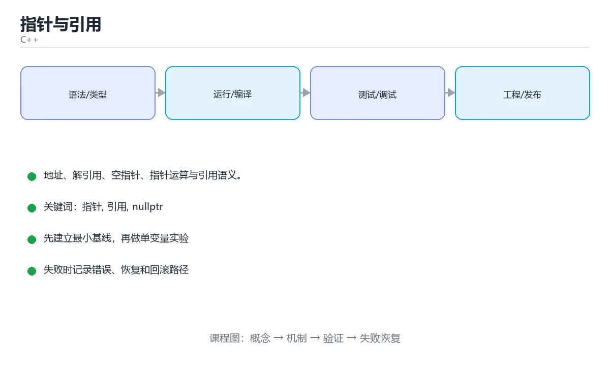

# 指针与引用



> 内容更新时间：2026-10-03 · 学习阶段：进阶 · 预计用时：15 分钟

## 学习目标

- 能用自己的话解释「指针与引用」解决了什么问题，而不是只背术语。
- 能说清 「指针」、「引用」、「nullptr」、「解引用」 之间的关系，并分别举出一个例子。
- 能把本课知识放回「C++」的知识体系，说明它和相邻主题的边界。
- 能完成本课练习，并用验收标准检查自己的结果。

> 一句话摘要：地址、解引用、空指针、指针运算与引用语义。

## 前置知识

- 先完成上一课《控制流与函数》；如果已经掌握，可以直接用本课练习自测。
- 本课阶段：进阶。建议先掌握同一分类的基础课程，并能独立运行正文中的最小示例。
- 开始前先复习：指针、引用、nullptr。
- 如果某一步看不懂，先记录具体卡点，完成练习后再回头读一遍。


## 地址与指针

```cpp
int value = 42;
int* p = &value;        // & 取地址，p 保存 value 的地址

std::cout << *p;        // * 解引用，得到 42
*p = 100;               // 通过指针修改原变量
p = nullptr;            // 空指针，表示「不指向任何对象」
```

访问空指针或未初始化指针是未定义行为，指针使用前先判空：

```cpp
if (p != nullptr) {
    std::cout << *p;
}
```

## 指针与数组

```cpp
int nums[3] = {10, 20, 30};
int* first = nums;              // 数组名退化为指向首元素的指针
std::cout << *(first + 1);      // 20，指针运算按元素大小移动
std::cout << first[2];          // 等价写法
```

C++ 中更推荐 `std::array` 和 `std::vector`，它们自带大小信息，不容易越界。

## 引用

引用是变量的别名，必须在定义时绑定，之后不能改绑。

```cpp
int a = 1;
int& ref = a;
ref = 2;                 // 等价于 a = 2

void increase(int& x) { ++x; }        // 传引用：函数内修改影响实参
void print(const std::string& s);     // const 引用：只读且避免拷贝
```

## 指针与引用的区别

| 对比项 | 指针 | 引用 |
| --- | --- | --- |
| 能否为空 | 可以 `nullptr` | 一般不能 |
| 能否改绑 | 可以指向别的对象 | 不可以 |
| 是否需要解引用 | 需要 `*p` | 直接当变量用 |
| 典型用途 | 可选对象、动态内存、数组遍历 | 函数参数、返回值 |

经验法则：**函数参数能用引用就用引用，只有「可能没有对象」时才用指针**。

## 二级指针与函数指针（了解）

```cpp
void set(int** pp) { **pp = 7; }

int add(int a, int b) { return a + b; }
int (*func)(int, int) = add;      // 函数指针
std::cout << func(1, 2) << '\n';
```

现代 C++ 中，函数指针多数场景已被 lambda 与 `std::function` 取代。

## 本课小结
指针提供间接访问和「可空」语义，引用提供更安全的别名语义。理解这两者，是理解 C++ 内存模型的第一步。


## 指针与引用速查

| 概念 | 写法 | 能否为空 | 能否改指向 | 说明 |
| --- | --- | --- | --- | --- |
| 对象 | `T obj;` | 否 | 不适用 | 优先使用 |
| 引用 | `T& r = obj;` | 否 | 否 | 使用像对象，必须初始化 |
| 常量引用 | `const T& r = obj;` | 否 | 否 | 传参首选 |
| 指针 | `T* p = &obj;` | 是 | 是 | 需要可空或可改指向时用 |
| 常量指针 | `T* const p = &obj;` | 是 | 否 | 指针本身不可改 |
| 指向常量 | `const T* p = &obj;` | 是 | 是 | 不能通过 p 改值 |

```cpp
#include <memory>
#include <vector>

void scale(std::vector<int>& data, int factor) {   // 引用：必定非空
    for (int& value : data) value *= factor;
}

// 现代 C++：动态对象用智能指针，不用裸 new
std::unique_ptr<int> makeValue(int v) {
    return std::make_unique<int>(v);
}

// 只读观察用指针表示「可能没有」
void print(const std::string* name) {
    if (name != nullptr) {
        std::cout << *name << '\n';
    }
}
```

## 数组与指针速查

| 写法 | 含义 | 风险 |
| --- | --- | --- |
| `int a[5];` | 栈上固定数组 | 越界不会检查 |
| `int* p = a;` | 数组退化为指针 | 丢失长度信息 |
| `std::array<int,5> a;` | 固定大小容器 | 推荐替代裸数组 |
| `std::vector<int> v;` | 动态数组 | 首选 |
| `std::span<int> s` | 连续内存视图 | C++20，注意生命周期 |
| `sizeof(a) / sizeof(a[0])` | 求数组长度 | 退化后失效 |

## 常见错误对照表

| 容易写错的做法 | 实际现象 | 原因与正确做法 |
| --- | --- | --- |
| 使用未初始化的指针 | 随机崩溃 | 定义就初始化为 `nullptr` |
| `delete` 后继续使用 | 悬空指针 | 置 `nullptr` 或用智能指针 |
| 忘记释放 `new` 出的对象 | 内存泄漏 | 用 `unique_ptr` / `shared_ptr` |
| 返回局部变量地址 | 悬空指针 | 按值返回或返回智能指针 |
| `p + 1` 越界访问 | 未定义行为 | 用 `vector` 与迭代器，注意边界 |
| 用 `==` 比较 C 字符串 | 比较的是地址 | 用 `std::string` 或 `strcmp` |
| 传数组给函数并 `sizeof` | 得到指针大小 | 额外传长度或用 `std::span` |
| 引用绑定临时对象后长期保存 | 悬空引用 | 值接收或延长生命周期 |
| 空指针解引用 | 段错误 | 使用前判空，或用引用表达非空 |
| 多层指针 `T**` | 复杂度高、易错 | 用容器、智能指针或引用替代 |

## 自测清单

- [ ] 默认用对象与引用，只有需要可空或改指向时才用指针。
- [ ] 动态对象一律用智能指针管理。
- [ ] 指针使用前判空，删除后置空。
- [ ] 不再手工计算数组长度，改用容器与 `span`。
- [ ] 能分清 `const T*` 与 `T* const`。


## 零基础详解：指针与引用，用「地址」和「别名」理解

### 一句话说清它是什么

变量住在内存的某个地址上。**指针是保存地址的变量**，**引用是变量的别名**。
两者都能避免拷贝大对象，但指针可以为空、可以移动，引用则一定绑定且不能改绑。

### 用生活比喻理解

| 概念 | 比喻 | 说明 |
| --- | --- | --- |
| 变量 | 一间房子 | 房子有地址，里面住着数据 |
| 指针 | 写着地址的纸条 | 可以改写成别的地址，也可以是空纸条 |
| 引用 | 给房子起的第二个门牌 | 一旦定下不能改指，用起来就像原来那个变量 |
| 解引用 `*p` | 照着地址找上门 | 访问房子里的东西 |
| 取地址 `&x` | 查这个房子的地址 | 得到纸条 |

### 三种写法对比

```cpp
int value = 10;
int* p = &value;        // p 保存 value 的地址
int& r = value;         // r 是 value 的别名

*p = 20;                // 通过指针修改
r = 30;                 // 通过引用修改，写法就像直接改
std::cout << value;     // 30
```

| 对比项 | 指针 `T*` | 引用 `T&` |
| --- | --- | --- |
| 能否为空 | 能（`nullptr`） | 不能 |
| 能否改指向 | 能 | 不能 |
| 需要解引用吗 | 需要 `*p` | 不需要 |
| 能否做算术 | 能（数组遍历） | 不能 |
| 常见用途 | 可选对象、数组、动态内存 | 函数参数、避免拷贝 |

### 空指针与野指针

```cpp
int* a = nullptr;        // 空指针：明确表示「不指向任何东西」
if (a != nullptr) { }    // 用前判空

int* b;                  // 野指针：指向随机地址
// *b = 1;               // 未定义行为，可能直接崩溃

int* c = new int(5);
delete c;
c = nullptr;             // 释放后置空，避免悬垂
```

| 名词 | 含义 | 后果 |
| --- | --- | --- |
| 空指针 | 指向 `nullptr` | 解引用会崩溃，是可检测的错误 |
| 野指针 | 未初始化，指向随机地址 | 未定义行为，最难排查 |
| 悬垂指针 | 指向已释放的内存 | 数据被改写，静默出错 |
| 内存泄漏 | `new` 了没 `delete` | 内存持续增长 |

### 指针与数组的关系

```cpp
int arr[3] = {10, 20, 30};
int* p = arr;            // 数组名会退化为指向首元素的指针

std::cout << *p;         // 10
std::cout << *(p + 1);   // 20，指针移动一个元素的大小
std::cout << p[2];       // 30，下标本质是 *(p + 2)
```

**数组名不是指针**，只是在多数表达式里会退化成指针，所以 `sizeof(arr)` 和 `sizeof(p)` 结果不同。

### `const` 与指针的四种组合

| 写法 | 能否改指向 | 能否改内容 |
| --- | --- | --- |
| `int* p` | 能 | 能 |
| `const int* p` | 能 | 不能（指向常量） |
| `int* const p` | 不能 | 能 |
| `const int* const p` | 不能 | 不能 |

记忆方法：**看 `const` 在 `*` 的左边还是右边**。

### 函数参数怎么选

| 参数类型 | 是否拷贝 | 能否为空 | 能否修改 | 什么时候用 |
| --- | --- | --- | --- | --- |
| `T x` | 拷贝 | 否 | 只改副本 | 小类型 |
| `T& x` | 不拷贝 | 否 | 能 | 需要写回结果 |
| `const T& x` | 不拷贝 | 否 | 不能 | **传大对象只读，首选** |
| `T* x` | 拷贝指针 | 能 | 能 | 允许为空 |

### 新手最容易踩的八个坑

| 坑 | 现象 | 正确做法 |
| --- | --- | --- |
| 未初始化指针 | 随机崩溃 | 定义时就赋 `nullptr` |
| 解引用空指针 | 段错误 | 用前判空 |
| `delete` 后继续用 | 数据错乱 | 置空或改用智能指针 |
| `delete` 两次 | 程序崩溃 | 只释放一次 |
| `new` 之后忘 `delete` | 内存泄漏 | 用 `std::unique_ptr` |
| 返回局部变量的地址 | 悬垂指针 | 返回值或改用智能指针 |
| 指针与引用混用不清 | 代码难读 | 可空用指针，必存在用引用 |
| 忘了数组长度 | 越界读写 | 用 `std::vector` 或 `std::span` |

### 现代 C++ 的建议

```cpp
#include <memory>
#include <vector>

// 1. 用容器代替裸数组
std::vector<int> nums{1, 2, 3};

// 2. 用智能指针代替 new / delete
auto ptr = std::make_unique<int>(42);      // 独占所有权
auto shared = std::make_shared<int>(7);    // 共享所有权

// 3. 只在「可选」语义时用裸指针，并且不做所有权管理
void print(const int* maybe) {
    if (maybe != nullptr) std::cout << *maybe;
}
```

### 手把手练习：安全地交换与查找

```cpp
#include <iostream>
#include <vector>

void swapValues(int& a, int& b) {      // 引用：一定要改到本体
    int tmp = a;
    a = b;
    b = tmp;
}

const int* findValue(const std::vector<int>& nums, int target) {
    for (const int& n : nums) {
        if (n == target) return &n;    // 返回指向容器元素的指针，容器还在
    }
    return nullptr;                    // 用空指针表达「没找到」
}

int main() {
    int x = 1, y = 2;
    swapValues(x, y);
    std::cout << x << " " << y << '\n';    // 2 1

    std::vector<int> nums{3, 5, 7};
    if (const int* p = findValue(nums, 5)) {
        std::cout << "找到 " << *p << '\n';
    } else {
        std::cout << "没找到\n";
    }
}
```

### 学完自测

- [ ] 能说出指针与引用的三点区别。
- [ ] 能解释空指针、野指针、悬垂指针分别是什么。
- [ ] 知道 `const int*` 与 `int* const` 的区别。
- [ ] 能说出函数参数用 `const T&` 的好处。
- [ ] 知道为什么现代 C++ 推荐用智能指针代替裸 `new`。

## 动手练习


> 本课练习重点：围绕「指针、引用、nullptr」完成复述、实验和交付，每个结果都要能被别人检查。

先开启警告编译最小程序，再验证内存与边界，最后用 Sanitizer 跑一遍。

### 练习 1：建立心智模型（10 分钟）

合上教程，用 3～5 句话回答：

1. 「指针与引用」解决了什么问题？
2. 如果没有它，会出现什么具体后果？
3. 它和「引用」是什么关系？

**验收标准**：至少出现一个本课关键词，并写出一个反例、边界条件或失效场景。

### 练习 2：做一次可控实验（20 分钟）

从正文中选一个最小示例，完成以下操作：

1. 先预测修改一个参数、输入或步骤后的结果。
2. 再实际执行或逐步推演，记录真实结果。
3. 如果结果与预测不同，写出差异原因。

**验收标准**：留下「原例 → 改动 → 预测 → 结果 → 原因」五步记录。

### 练习 3：交付一个小结果（30 分钟）

写一个可独立编译的小程序，开启 `-Wall -Wextra`，确保没有警告。

任务要求：

- 结果必须能被别人检查，不能只写“我已经理解了”。
- 至少覆盖「指针」和「引用」两个关键词。
- 写出 1 个仍然不确定的问题，以及下一步如何验证。

> 提示：时间有限时优先做练习 1 和练习 2；练习 3 可以拆成两次完成。


## 考点精讲：把测验题还原成判断过程

本课有 6 个判断点。先自己作答，再看「判断依据」；如果结论正确但理由不完整，回到正文对应章节补足概念。

### 考点 1：nullptr 表示什么？

- **正确判断**：空指针，不指向任何对象
- **判断依据**：正确答案是「空指针，不指向任何对象」，本课在「地址与指针」中说明：访问空指针或未初始化指针是未定义行为，指针使用前先判空。nullptr 是空指针字面量，使用前必须判空，解引用空指针是未定义行为。本课还在「零基础详解：指针与引用，用「地址」和「别名」理解」中说明：能解释空指针、野指针、悬垂指针分别是什么。本课还在「引用」中说明：引用是变量的别名，必须在定义时绑定，之后不能改绑。
- **迁移检查**：如果给某个错误选项去掉一个限定词，它会不会变成正确？说明理由。

### 考点 2：关于引用，下面说法正确的是？

- **正确判断**：引用定义后不能改绑其他对象
- **判断依据**：正确答案是「引用定义后不能改绑其他对象」，本课在「零基础详解：指针与引用，用「地址」和「别名」理解」中说明：两者都能避免拷贝大对象，但指针可以为空、可以移动，引用则一定绑定且不能改绑。引用必须在定义时绑定且不能改绑，使用时像普通变量一样，不需要解引用。本课还在「引用」中说明：引用是变量的别名，必须在定义时绑定，之后不能改绑。本课还在「零基础详解：指针与引用，用「地址」和「别名」理解」中说明：能解释空指针、野指针、悬垂指针分别是什么。
- **迁移检查**：遮住选项，只根据定义复述一次答案，再回来看哪个选项与复述一致。

### 考点 3：返回函数内局部变量的指针或引用会怎样？

- **正确判断**：产生悬垂指针，属于未定义行为
- **判断依据**：正确答案是「产生悬垂指针，属于未定义行为」，本课在「地址与指针」中说明：访问空指针或未初始化指针是未定义行为，指针使用前先判空。局部变量随函数返回销毁，返回其地址后访问是未定义行为。本课还在「指针与引用的区别」中说明：经验法则：函数参数能用引用就用引用，只有「可能没有对象」时才用指针。本课还在「二级指针与函数指针（了解）」中说明：现代 C++ 中，函数指针多数场景已被 lambda 与 std::function 取代。
- **迁移检查**：如果给某个错误选项去掉一个限定词，它会不会变成正确？说明理由。

### 考点 4：数组名在大多数表达式中会退化（decay）成什么？

- **正确判断**：指向首元素的指针
- **判断依据**：退化会丢失长度信息，所以传参时通常还要额外传大小，或改用 std::array / std::span。其他选项：数组名在多数表达式中退化为指向首元素的指针，同时丢失长度信息。针对「数组名在大多数表达式中会退化（decay）成什么，」，本课在「零基础详解：指针与引用，用「地址」和「别名」理解」中说明：数组名不是指针，只是在多数表达式里会退化成指针，所以 sizeof(arr) 和 sizeof(p) 结果不同。
- **迁移检查**：遮住选项，只根据定义复述一次答案，再回来看哪个选项与复述一致。

### 考点 5：const int* p 与 int* const p 的区别是？

- **正确判断**：前者不能通过 p 改值，后者 p 本身不能改指向
- **判断依据**：正确答案是「前者不能通过 p 改值，后者 p 本身不能改指向」，本课在「零基础详解：指针与引用，用「地址」和「别名」理解」中说明：知道 const int 与 int const 的区别。看 const 修饰谁：const 在 左边修饰指向的值，在 右边修饰指针本身。本课还在「零基础详解：指针与引用，用「地址」和「别名」理解」中说明：两者都能避免拷贝大对象，但指针可以为空、可以移动，引用则一定绑定且不能改绑。
- **迁移检查**：遮住选项，只根据定义复述一次答案，再回来看哪个选项与复述一致。

### 考点 6：补全代码：「指针与引用」示例中，下面这行代码缺少哪个关键字或函数名？请填入 ____。 `std::____<int> makeValue(int v) {`

- **正确判断**：unique_ptr
- **判断依据**：正确答案是「unique_ptr」，本课在「本课小结」中说明：指针提供间接访问和「可空」语义，引用提供更安全的别名语义。本课还在「指针与数组」中说明：C++ 中更推荐 std::array 和 std::vector，它们自带大小信息，不容易越界。本课还在「二级指针与函数指针（了解）」中说明：现代 C++ 中，函数指针多数场景已被 lambda 与 std::function 取代。
- **迁移检查**：如果填成相近的另一个函数或关键字，程序会在哪一步出错？

## 本课复习清单

离开本课前，逐项确认：

- [ ] 不看解析，能说出「nullptr 表示什么？」的判断依据。
- [ ] 不看解析，能说出「关于引用，下面说法正确的是？」的判断依据。
- [ ] 不看解析，能说出「返回函数内局部变量的指针或引用会怎样？」的判断依据。
- [ ] 不看解析，能说出「数组名在大多数表达式中会退化（decay）成什么？」的判断依据。
- [ ] 不看解析，能说出「const int* p 与 int* const p 的区别是？」的判断依据。
- [ ] 不看解析，能说出「补全代码：「指针与引用」示例中，下面这行代码缺少哪个关键字或函数名？请填入 __…」的判断依据。
- [ ] 至少运行一次本课示例，记录输入、输出和一个边界情况。
- [ ] 把本课最容易混淆的两个概念写成一句话对照。

| 复盘项 | 记录 |
| --- | --- |
| 已经能独立解释的考点 |  |
| 仍然说不清的概念 |  |
| 下一步验证动作 |  |

## English Overview

**Title:** Pointers & References

**Summary:** Addresses, dereferencing, nullptr, arithmetic and references.

**Category:** C++  
**Level:** 进阶  
**Key terms:** 指针, 引用, nullptr, 解引用, 悬垂指针

> The full tutorial is written in Chinese. This bilingual overview helps English readers identify the topic, scope and key terms before studying the detailed examples.

## 内容元数据

- 内容版本：v2.0
- 最后更新：2026-10-03
- 学习阶段：进阶
- 适用环境：C++20 / GCC 13+ 或 Clang 17+
- 内容来源：内置结构化课程与工程实践整理
- 相关主题：指针、引用、nullptr、解引用、悬垂指针
- 质量版本：P0 测验标准 + P1 覆盖扩展 + P2 体验补全


## 参考资料与复核

- 最后复核：2026-10-04
- 下次复核：2027-04-04
- 复核范围：版本兼容、API 行为、安全建议与工程实践
- 来源性质：官方文档与标准；本课正文为离线教学重组，不复制原文

| 参考资料 | 本课用途 |
| --- | --- |
| [C++ 标准库参考](https://en.cppreference.com/w/cpp) | 语言、标准库与并发 |
| [ISO C++](https://isocpp.org/) | 标准动态、指南与最佳实践 |

> 本课主题：地址、解引用、空指针、指针运算与引用语义。

> App 完全离线展示文字链接，不会自动联网；需要延伸阅读时可复制链接到浏览器。

