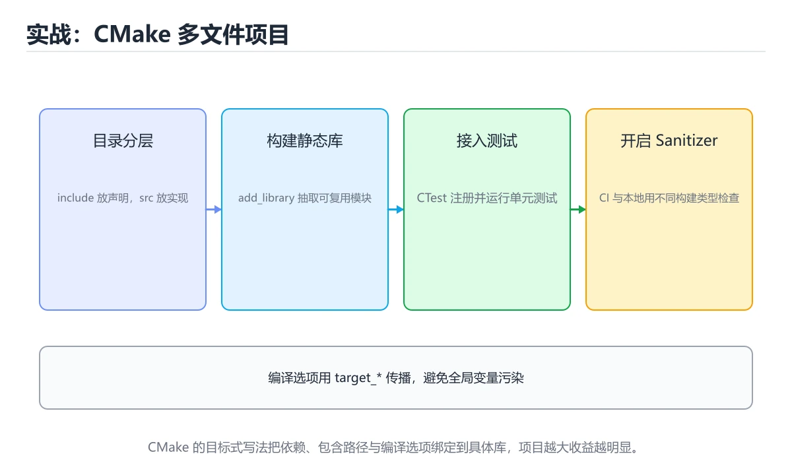

# 实战：CMake 多文件项目




> 内容更新时间：2026-10-06 · 学习阶段：高级 · 预计用时：130 分钟

## 学习目标

- 能用自己的话解释实战：CMake 多文件项目解决了什么问题，而不是只背术语。
- 能说清 「实战」、「CMake」、「CTest」、「sanitizer」 之间的关系，并分别举出一个例子。
- 能把 实战 放回「实战：CMake 多文件项目」的知识体系，说明它和 CMake 的边界。
- 能完成本课练习，并用验收标准检查自己的结果。

> 一句话摘要：include/src 分层、静态库、CTest 与 sanitizer。

## 前置知识

- 先完成上一课《构建、调试与工程实践》；如果已经掌握，可以直接用本课练习自测。
- 开始前先复习：实战、CMake、CTest。
- 看不懂就直接缩小例子：只保留 实战 相关的两行输入，跑通后再加回其余部分。

## 项目结构

```text
project/
├── CMakeLists.txt
├── include/
│   └── stats.h
├── src/
│   ├── main.cpp
│   └── stats.cpp
└── tests/
    └── stats_test.cpp
```

约定：`include/` 放对外头文件，`src/` 放实现，`tests/` 放测试，避免头文件与源文件混在一起。

## 头文件与实现

```cpp
// include/stats.h
#pragma once
#include <vector>

double mean(const std::vector<double>& values);
double median(std::vector<double> values);
double stddev(const std::vector<double>& values);
```

```cpp
// src/stats.cpp
#include "stats.h"
#include <algorithm>
#include <cmath>
#include <numeric>
#include <stdexcept>

double mean(const std::vector<double>& values) {
    if (values.empty()) throw std::invalid_argument("empty");
    return std::accumulate(values.begin(), values.end(), 0.0) / values.size();
}

double median(std::vector<double> values) {
    if (values.empty()) throw std::invalid_argument("empty");
    std::sort(values.begin(), values.end());
    const auto n = values.size();
    return n % 2 ? values[n / 2] : (values[n / 2 - 1] + values[n / 2]) / 2.0;
}

double stddev(const std::vector<double>& values) {
    const double m = mean(values);
    double sum = 0.0;
    for (double v : values) sum += (v - m) * (v - m);
    return std::sqrt(sum / values.size());
}
```

## CMakeLists

```cmake
cmake_minimum_required(VERSION 3.20)
project(stats LANGUAGES CXX)
set(CMAKE_CXX_STANDARD 20)
set(CMAKE_CXX_STANDARD_REQUIRED ON)
set(CMAKE_EXPORT_COMPILE_COMMANDS ON)

add_library(stats_core src/stats.cpp)
target_include_directories(stats_core PUBLIC include)
target_compile_options(stats_core PRIVATE -Wall -Wextra -Wpedantic)

add_executable(app src/main.cpp)
target_link_libraries(app PRIVATE stats_core)

enable_testing()
add_executable(stats_test tests/stats_test.cpp)
target_link_libraries(stats_test PRIVATE stats_core)
add_test(NAME stats_test COMMAND stats_test)
```

```bash
cmake -S . -B build -G Ninja -DCMAKE_BUILD_TYPE=Debug
cmake --build build -j
ctest --test-dir build --output-on-failure
```

## 测试与检查

```cpp
// tests/stats_test.cpp
#include "stats.h"
#include <cassert>
#include <iostream>

int main() {
    assert(std::abs(mean({1, 2, 3}) - 2.0) < 1e-9);
    assert(std::abs(median({3, 1, 2}) - 2.0) < 1e-9);
    assert(std::abs(median({4, 1, 2, 3}) - 2.5) < 1e-9);
    std::cout << "all tests passed\n";
}
```

```bash
g++ -fsanitize=address,undefined -g ...    # 或给 CMake 加编译选项跑 sanitizer
clang-tidy src/*.cpp -- -Iinclude
```

## 工程习惯

1. 编译警告全开并当作错误（`-Werror`）。
2. Debug 与 Release 分开构建目录。
3. 第三方依赖用 vcpkg/Conan 管理，锁定版本。
4. CI 中跑 `cmake --build` + `ctest` + sanitizer。

## 本课小结

多文件 + CMake + 测试 + sanitizer 是现代 C++ 项目的最小骨架；把它固化成模板，新项目直接复用。

## 目录结构速查

```text
project/
├── CMakeLists.txt          # 顶层构建脚本
├── include/app/            # 对外头文件
│   └── calculator.h
├── src/
│   ├── calculator.cpp      # 实现
│   └── main.cpp            # 程序入口
├── tests/
│   └── calculator_test.cpp
├── third_party/            # 第三方依赖（或由包管理器管理）
└── build/                  # 构建产物（加入 .gitignore）
```

| 约定 | 说明 |
| --- | --- |
| 头文件对外、实现对内 | `include/` 暴露接口，`src/` 放细节 |
| 一个类一个文件对 | `foo.h` + `foo.cpp`，便于定位 |
| 入口只有一处 | `main.cpp` 只做参数解析与调用 |
| 测试与源码分离 | `tests/` 独立，接入 ctest |
| 构建目录不入库 | `build/` 写进 `.gitignore` |

## 顶层 CMakeLists 参考

```cmake
cmake_minimum_required(VERSION 3.20)
project(code_learn LANGUAGES CXX)

set(CMAKE_CXX_STANDARD 20)
set(CMAKE_CXX_STANDARD_REQUIRED ON)
set(CMAKE_EXPORT_COMPILE_COMMANDS ON)      # 供 clangd / clang-tidy 使用

add_library(calc STATIC src/calculator.cpp)
target_include_directories(calc PUBLIC include)
target_compile_options(calc PRIVATE -Wall -Wextra -Werror)

add_executable(app src/main.cpp)
target_link_libraries(app PRIVATE calc)

enable_testing()
add_executable(calc_test tests/calculator_test.cpp)
target_link_libraries(calc_test PRIVATE calc)
add_test(NAME calc_test COMMAND calc_test)
```

测试与 CI 速查：

| 目的 | 做法 |
| --- | --- |
| 单元测试框架 | GoogleTest、Catch2、doctest |
| 运行测试 | `ctest --test-dir build --output-on-failure` |
| 覆盖率 | `-fprofile-instr-generate -fcoverage-mapping` 或 gcov |
| 静态检查 | clang-tidy + `compile_commands.json` |
| 流水线步骤 | 配置 → 构建 → 测试 → 静态检查 → 打包 |

## 常见错误与排查

| 现象 | 原因 | 处理方式 |
| --- | --- | --- |
| 测试可执行文件找不到头文件 | 未声明 include 目录 | 用 `target_include_directories` |
| 修改头文件后没有重新编译 | 依赖未声明 | 让目标正确声明头文件目录 |
| `main.cpp` 里塞满业务逻辑 | 无法测试 | 逻辑抽到库，`main` 只做编排 |
| 头文件里 `using namespace std;` | 污染所有包含者 | 在源文件局部使用，或写全限定名 |
| 在头文件定义全局变量 | 多重定义 | 用 `inline` 或放源文件 + `extern` |
| 直接提交 `build/` | 仓库臃肿 | 加入 `.gitignore` |
| 依赖靠手工下载 | 环境不可复现 | 用 FetchContent / vcpkg / Conan |
| 只在本地跑测试 | 回归无人发现 | 接入 CI 并设为合并门禁 |
| 用 Debug 构建做性能测试 | 数据无意义 | 用 Release 并固定编译选项 |

## 复习与自测

- [ ] 目录分为 `include/`、`src/`、`tests/`。
- [ ] `main.cpp` 只做编排，业务逻辑在库里可被测试。
- [ ] CMake 用 target 指令管理头文件与选项。
- [ ] ctest 能一条命令跑完全部测试。
- [ ] CI 覆盖构建、测试与静态检查。

## 零基础详解：C++ 项目实战骨架

### 一句话说清它是什么

一个可交付的 C++ 项目要有：**CMake 构建、依赖管理、测试、静态检查、Sanitizer、CI**。
下面用一个「日志解析库」把这些串起来。

### 用生活比喻理解

| 工具 | 比喻 | 作用 |
| --- | --- | --- |
| CMake | 施工图 | 描述怎么编译与链接 |
| 预设 preset | 标准工法 | 团队用同一套参数 |
| 依赖管理 | 进货渠道 | vcpkg 或 Conan |
| 测试框架 | 验收员 | Catch2 或 GoogleTest |
| Sanitizer | 安检仪 | 发现越界、泄漏、数据竞争 |

### 目录结构

```text
logparser/
  CMakeLists.txt
  CMakePresets.json
  include/logparser/parser.hpp     对外头文件
  src/parser.cpp                   实现
  tests/parser_test.cpp
  benchmarks/parse_bench.cpp
  cmake/                           自定义 cmake 模块
```

**头文件与实现分离**：`include/` 暴露给使用方，`src/` 只放实现。

### 顶层 CMakeLists.txt

```cmake
cmake_minimum_required(VERSION 3.24)
project(logparser VERSION 0.1.0 LANGUAGES CXX)

set(CMAKE_CXX_STANDARD 20)
set(CMAKE_CXX_STANDARD_REQUIRED ON)
set(CMAKE_CXX_EXTENSIONS OFF)

# 警告即错误，从源头保证质量
add_library(logparser src/parser.cpp)
target_include_directories(logparser PUBLIC include)
target_compile_options(logparser PRIVATE
    $<$<CXX_COMPILER_ID:GNU,Clang>:-Wall -Wextra -Wpedantic -Werror>)

# 测试
include(CTest)
if(BUILD_TESTING)
    find_package(Catch2 3 REQUIRED)
    add_executable(parser_test tests/parser_test.cpp)
    target_link_libraries(parser_test PRIVATE logparser Catch2::Catch2WithMain)
    include(CTest)
    include(Catch)
    catch_discover_tests(parser_test)
endif()
```

### CMakePresets.json：团队统一参数

```json
{
  "version": 6,
  "configurePresets": [
    {
      "name": "debug",
      "generator": "Ninja",
      "binaryDir": "${sourceDir}/build/debug",
      "cacheVariables": {
        "CMAKE_BUILD_TYPE": "Debug",
        "CMAKE_EXPORT_COMPILE_COMMANDS": "ON"
      }
    },
    {
      "name": "release",
      "generator": "Ninja",
      "binaryDir": "${sourceDir}/build/release",
      "cacheVariables": { "CMAKE_BUILD_TYPE": "Release" }
    },
    {
      "name": "asan",
      "inherits": "debug",
      "binaryDir": "${sourceDir}/build/asan",
      "cacheVariables": {
        "CMAKE_CXX_FLAGS": "-fsanitize=address,undefined -fno-omit-frame-pointer"
      }
    }
  ]
}
```

```bash
cmake --preset debug
cmake --build build/debug
ctest --test-dir build/debug --output-on-failure
```

### 依赖管理

```cmake
# 方式一：CMake 自带的 FetchContent（小项目够用）
include(FetchContent)
FetchContent_Declare(
    catch2
    GIT_REPOSITORY https://github.com/catchorg/Catch2.git
    GIT_TAG v3.7.0
)
FetchContent_MakeAvailable(catch2)

# 方式二：vcpkg 清单模式（推荐用于中大型项目）
# vcpkg.json 里声明依赖，CMake 用 CMAKE_TOOLCHAIN_FILE 指向 vcpkg
```

```json
{
  "name": "logparser",
  "version": "0.1.0",
  "dependencies": [
    "catch2",
    { "name": "fmt", "version>=": "11.0.2" }
  ]
}
```

### 测试：先测纯函数

```cpp
// tests/parser_test.cpp
#include <catch2/catch_test_macros.hpp>
#include "logparser/parser.hpp"

TEST_CASE("解析合法日志行", "[parser]") {
    const auto entry = logparser::parse("2026-01-01 10:00:00 ERROR 连接失败");
    REQUIRE(entry.has_value());
    CHECK(entry->level == logparser::Level::Error);
    CHECK(entry->message == "连接失败");
}

TEST_CASE("非法行返回空", "[parser]") {
    CHECK_FALSE(logparser::parse("这不是日志").has_value());
}

TEST_CASE("容忍首尾空格", "[parser]") {
    CHECK(logparser::parse("  2026-01-01 10:00:00 INFO 启动  ").has_value());
}
```

用 `std::optional` 表达「可能解析失败」，比返回特殊值更清楚。

### 三种 Sanitizer 各查什么

| Sanitizer | 检查 | 编译参数 |
| --- | --- | --- |
| AddressSanitizer | 越界、释放后使用、泄漏 | `-fsanitize=address` |
| UndefinedBehaviorSanitizer | 整数溢出、空指针、未对齐 | `-fsanitize=undefined` |
| ThreadSanitizer | 数据竞争 | `-fsanitize=thread` |

**注意**：ASan 与 TSan 不能同时开，要分成两个预设跑。

### CI 流水线

```yaml
name: cpp-ci
on: [push, pull_request]

jobs:
  build-and-test:
    strategy:
      matrix:
        preset: [debug, release, asan]
    runs-on: ubuntu-latest
    steps:
      - uses: actions/checkout@v4
      - run: sudo apt-get update && sudo apt-get install -y ninja-build
      - run: cmake --preset ${{ matrix.preset }}
      - run: cmake --build build/${{ matrix.preset }} -j
      - run: ctest --test-dir build/${{ matrix.preset }} --output-on-failure

  format-check:
    runs-on: ubuntu-latest
    steps:
      - run: pip install clang-format
      - run: clang-format --dry-run --Werror src/*.cpp include/**/*.hpp
```

### 静态分析与格式化

```bash
clang-format -i src/*.cpp include/**/*.hpp     # 统一格式
clang-tidy src/parser.cpp -- -std=c++20 -Iinclude
cppcheck --enable=warning,performance src
```

把 `.clang-format` 与 `.clang-tidy` 提交到仓库，团队格式化结果才会一致。

### 新手最容易踩的八个坑

| 坑 | 现象 | 正确做法 |
| --- | --- | --- |
| 头文件里 `using namespace std` | 污染使用方 | 写全限定名 |
| 目录结构混乱 | 找不到头文件 | `include/` 与 `src/` 分离 |
| 每次手工敲编译参数 | 结果不一致 | 用 CMakePresets |
| 不开警告 | 隐患积累 | `-Wall -Wextra -Werror` |
| 只在 Release 测 | 断言被优化掉 | Debug 与 Release 都跑 |
| 不跑 Sanitizer | 越界与泄漏漏检 | CI 加 asan 预设 |
| 依赖版本不固定 | 今天能编明天不行 | 固定 tag 或用 vcpkg 清单 |
| 忘记提交 `.clang-format` | 格式各写一套 | 提交配置文件 |

### 学完自测

- [ ] 能说出 `include/` 与 `src/` 分离的好处。
- [ ] 知道 CMakePresets 解决什么问题。
- [ ] 能说出三种 Sanitizer 各自查什么。
- [ ] 知道为什么 ASan 与 TSan 不能同时开。
- [ ] 能列出 CI 里至少要跑的三种配置。

## 动手练习

> 本课练习重点：围绕「实战、CMake、CTest」完成复述、实验和交付，每个结果都要能被别人检查。

为 CMake 打开内存检查工具跑一遍，确认没有越界与泄漏。

### 练习 1：建立心智模型（10 分钟）

合上教程，用 3～5 句话回答：

1. 实战：CMake 多文件项目解决了什么问题？
2. 如果没有它，会出现什么具体后果？
3. 它和「CMake」是什么关系？

验收标准：用自己的话解释 实战，并给出一个它不成立的反例。

### 练习 2：做一次可控实验（20 分钟）

从正文中选一个最小示例，完成以下操作：

1. 先预测修改一个参数、输入或步骤后的结果。
2. 再实际执行或逐步推演，记录真实结果。
3. 如果结果与预测不同，写出差异原因。

**验收标准**：五步记录要写进笔记——原例是 CMAKE_CXX_STANDARD，改动落在实战上，结论必须能被他人在同一环境里复现。

### 练习 3：交付一个小结果（30 分钟）

把 CMAKE_CXX_STANDARD 抽成一个单文件示例，在开启警告的编译选项下构建。

任务要求：

- 结果必须能被别人检查，不能只写“我已经理解了”。
- 至少覆盖「实战」和「CMake」两个关键词。
- 写出 1 个仍然不确定的问题，以及下一步如何验证。

> 提示：时间有限时优先做练习 1 和练习 2；练习 3 可以拆成两次完成。

## 验证命令与预期输出

实战 的交付物要能用固定命令复现；下表是本项目的最低验证集：

| 阶段 | 命令 | 预期输出 |
| --- | --- | --- |
| 配置构建 | `cmake -S . -B build -DCMAKE_BUILD_TYPE=Debug` | 生成 CMake 缓存且无错误 |
| 编译 | `cmake --build build --parallel` | 目标全部编译成功且无警告 |
| 运行测试 | `ctest --test-dir build --output-on-failure` | 所有 CTest 用例通过 |

### 验收证据

- [ ] 保存依赖安装和启动命令的完整输出。
- [ ] 测试覆盖 CMake 的核心规则，并包含一次可预期的失败。
- [ ] 重复执行 实战 的操作两次，确认没有重复写入或副作用。
- [ ] 记录一次失败状态码、错误日志和恢复步骤。
- [ ] 记录 CMAKE_CXX_STANDARD 的运行环境与复现命令，并补一段回滚说明。

### 回归与回滚

1. 先在可丢弃的目录或临时库里跑 实战，避免污染真实数据。
2. 修改一处逻辑后重跑全部验证命令，确认没有回归。
3. 若失败，回滚到上一个可运行版本并保留失败日志。
4. 定位原因后补一条自动化测试，再重新执行发布流程。
5. 把教训写入项目复盘或本课笔记，形成下一次的检查项。

## 可运行练习

### 任务 1：先跑通，再解释

```cpp
// include/stats.h
#pragma once
#include <vector>

double mean(const std::vector<double>& values);
double median(std::vector<double> values);
double stddev(const std::vector<double>& values);
```

### 任务 2：只改一个条件

把「实战：CMake 多文件项目」的最小示例复制一份，只改一个条件再跑一次：

- 改动点：只调整 CMAKE_CXX_STANDARD 的一个参数，其余条件一律不动。
- 预测：先写下「实战：CMake 多文件项目」在改动后的输出或错误信息，再运行。
- 记录：对照改动前后的结果，指出差异出在哪一步。
- 验收：换回原条件能复现原结果，改动只影响实战。

### 任务 3：迁移到自己的数据

把 CMAKE_CXX_STANDARD 换成你自己的输入，先保持步骤不变，再比较输出差异。

## 故障现场

### 现场 1：测试可执行文件找不到头文件

**症状**：在《实战：CMake 多文件项目》的复现场景中，未声明 include 目录。

**根因**：触发点是把“测试可执行文件找不到头文件”当成安全做法。它没有满足《实战：CMake 多文件项目》要求的前提，因此先表现为“未声明 include 目录”；排查时先完整复现这一段，再核对输入、配置与依赖。

**修复**：针对《实战：CMake 多文件项目》的问题，用 target_include_directories。

**验证**：在《实战：CMake 多文件项目》中按“用 target_include_directories”调整后，从“测试可执行文件找不到头文件”的触发条件重放同一条路径，确认“未声明 include 目录”不再出现，并补一个相邻边界用例检查没有引入新问题。

### 现场 2：头文件里 using namespace std

**症状**：在《实战：CMake 多文件项目》的复现场景中，污染所有包含者。

**根因**：当出现“头文件里 using namespace std”时，执行路径已经绕过了《实战：CMake 多文件项目》的关键约束，最终以“污染所有包含者”暴露出来；修复前必须先确认约束在哪里失效。

**修复**：针对《实战：CMake 多文件项目》的问题，在源文件局部使用，或写全限定名。

**验证**：在《实战：CMake 多文件项目》中按“在源文件局部使用，或写全限定名”调整后，从“头文件里 using namespace std”的触发条件重放同一条路径，确认“污染所有包含者”不再出现，并补一个相邻边界用例检查没有引入新问题。

### 现场 3：依赖靠手工下载

**症状**：在《实战：CMake 多文件项目》的复现场景中，环境不可复现。

**根因**：触发点是把“依赖靠手工下载”当成安全做法。它没有满足《实战：CMake 多文件项目》要求的前提，因此先表现为“环境不可复现”；排查时先完整复现这一段，再核对输入、配置与依赖。

**修复**：针对《实战：CMake 多文件项目》的问题，用 FetchContent / vcpkg / Conan。

**验证**：保留《实战：CMake 多文件项目》里触发“环境不可复现”的输入、版本和日志，按“用 FetchContent / vcpkg / Conan”完成修改后原样重放；只有失败现象消失且相邻场景仍可解释，才保留改动。

## 版本与时效

- 标准版本会影响 实战 的写法与可用库，升级前先用现有工具链编译一次。
- 升级前确认 实战 的兼容范围，把不可回退的改动单独拆成一次提交。

### 升级检查清单

- 先固定当前版本，跑通全部示例与测验，再升级工具链。
- 一次只改一个版本条件，把 实战 相关的差异单独记成一条结论。
- 回归范围锁定 CMAKE_CXX_STANDARD 的默认行为，并确认弃用警告是否出现在构建输出里。
- 升级完成后更新本课「最后复核 / 下次复核」日期，并记录 实战 的版本变化。

## 本课复习清单

离开本课前，逐项确认：

- [ ] 不看解析，能说出「C++ 项目中对外的头文件通常放在？」的判断依据。
- [ ] 不看解析，能说出「CTest 的作用是？」的判断依据。
- [ ] 不看解析，能说出「把单元测试接入 CI 的主要价值是？」的判断依据。
- [ ] 跑通「实战：CMake 多文件项目」的最小示例，并记录一次失败输入的处理方式。
- [ ] 把本课最容易混淆的两个概念写成一句话对照。

| 复盘项 | 记录 |
| --- | --- |
| 已经能独立解释的考点 |  |
| 仍然说不清的概念 |  |
| 下一步验证动作 |  |

## 术语速查

| 术语 | 一句话说明 |
| --- | --- |
| `ctest` | CI 中跑 `cmake --build` + `ctest` + sanitizer。 |
| `实战` | 实战：CMake 多文件项目解决了什么问题，而不是只背术语。 |
| `CMake 目标` | 用 target 描述可执行文件、库以及它们之间的依赖，是现代 CMake 的组织单位。 |
| `断言` | 测试里用断言表达期望，失败时输出实际值与期望值，便于快速定位。 |

## 考点精讲

### 考点 1：多选辨析·实战

- **题目**：围绕“实战：CMake 多文件项目”中的 实战、CMake、CTest，下列哪两项是本课强调的实践判断？
- **判断依据**：在「实战：CMake 多文件项目」里，学习 实战 时要同时说明输入、输出和失败路径，不能只看正常流程。在实战：CMake 多文件项目里，判断 CMake 时要固定版本与边界输入，所以“验证 CMake 时要固定版本并覆盖边界输入，结论才可复现”才可复现。「实战：CMake 多文件项目」要求先交代实战、CMake、CTest的前提再下结论，所以“学习 实战 时要同时说明输入”只在题干“围绕实战”给定的条件下成立。

### 考点 2：代码补全·实战

- **题目**：下面这段 C++ 代码摘自「实战：CMake 多文件项目」的正文示例。关于这段代码，下面哪一项说法与实际内容相符？
- **判断依据**：在「实战：CMake 多文件项目」里，这段代码只做静态声明，没有循环、分支或可观察输出。这段代码出自「实战：CMake 多文件项目」的正文示例，围绕实战、CMake、CTest展开；把输入或边界换成空值、极值或失败情况后，结论要以「实战：CMake 多文件项目」的实际运行结果为准。

### 考点 3：概念判断·实战

- **题目**：在 CMake 项目中开启 AddressSanitizer 和 UndefinedBehaviorSanitizer，最合理的做法是？
- **判断依据**：在「实战：CMake 多文件项目」里，在 Debug/CI 构建中开启并链接运行时。Sanitizer 适合在开发、测试和 CI 构建中启用，它需要编译与链接阶段同时加入对应参数。回到「实战：CMake 多文件项目」的正文示例，用“在 CMake 项目中开启 Addr”走一遍实战、CMake、CTest的完整流程，能复现的结论才可以保留。

### 考点 4：概念判断·实战

- **题目**：CMake 中 target_link_libraries(app PRIVATE fmt) 的作用是？
- **判断依据**：在「实战：CMake 多文件项目」里，结论应落在「给 app 目标声明需要链接的库及其传递属性」。基于目标（target）的写法会携带 include 路径等使用要求，比全局变量更清晰。在「实战：CMake 多文件项目」里，这道题要求区分概念与边界，「给 app 目标声明需要链接的库及其传递属性」只有在题干给出的前提下才成立，而「把 fmt 源码拷进项目，需要额外的验证与维护」、「设置 C++ 标准」缺少同一组条件。

### 考点 5：概念判断·实战

- **题目**：把单元测试接入 CI 的主要价值是？
- **判断依据**：在「实战：CMake 多文件项目」里，每次提交自动验证。CI 上跑 ctest 能保证「测试在别人机器上也通过」，是团队协作的质量底线。把“每次提交自动验证”代回「实战：CMake 多文件项目」里“把单元测试接入 CI 的主要价值是”的例子核对，条件一旦改变，结论就要用实战、CMake、CTest重新推导。

### 考点 6：填空·实战

- **题目**：补全代码：「实战：CMake 多文件项目」示例中，下面这行代码缺少哪个关键字或函数名？请填入 ____。 `____(app PRIVATE stats_core)`
- **判断依据**：空格应填写「target_link_libraries」。「实战：CMake 多文件项目」要求先交代实战、CMake、CTest的前提再下结论，所以“targetlinklibraries”只在题干“实战：CMake 多文件项目示例中，下面这行代码缺少哪个关键”给定的条件下成立。

## English Overview

**Title:** Project: CMake Layout

**Summary:** Layout, library target, CTest and sanitizers.

**Category:** C++
**Level:** 高级
**Key terms:** 实战, CMake, CTest, sanitizer, 工程结构

## 内容元数据

- 内容版本：v2.0
- 最后更新：2026-10-06
- 学习阶段：高级
- 适用环境：C++20 / GCC 13+ 或 Clang 17+
；本课聚焦 实战。
- 内容来源：内置结构化课程与工程实践整理
- 相关主题：实战、CMake、CTest、sanitizer、工程结构
- 质量版本：P0 测验标准 + P1 覆盖扩展 + P2 体验补全

## 项目专属规格：实战：CMake 多文件项目

### 核心场景

include/src 分层、静态库、CTest 与 sanitizer。 项目目标是把「实战、CMake、CTest、sanitizer、工程结构」落实为可运行、可测试、可回滚的交付物。

### 架构与数据流

```text
用户/输入 → 接口或命令 → 领域逻辑 → 存储/外部依赖 → 输出与监控
                         ↘ 失败分类 → 重试/补偿 → 回滚
```

### 最小数据模型

| 对象 | 关键字段 | 约束 |
| --- | --- | --- |
| 输入实体 | 实战、时间、来源 | 必填校验、长度限制、幂等键 |
| 任务实体 | 状态、优先级、创建时间 | 状态迁移合法、不可重复执行 |
| 结果实体 | 输出、错误码、耗时 | 可序列化、错误可解释 |
| 审计记录 | 操作者、动作、结果、时间 | 不可篡改、可查询、脱敏 |

### 验收场景

1. 正常路径：最小输入得到预期输出，并留下日志与指标。
2. 边界路径：把 CMAKE_CXX_STANDARD 的输入推到上下限，确认返回结果可解释。
3. 失败路径：依赖超时或不可用时能快速失败、重试或降级。
4. 幂等路径：同一请求执行两次不会产生重复副作用。
5. 回滚路径：实战 回滚后数据一致，且能说明恢复时间和影响范围。

## 项目交付物

### 建议仓库结构

```text
src/
include/
tests/
CMakeLists.txt
README.md
```

### 测试矩阵

| 层级 | 覆盖内容 | 最低数量 | 通过标准 |
| --- | --- | ---: | --- |
| 单元测试 | 领域规则、边界和错误分类 | 8 | 正常、边界、失败路径全部通过 |
| 集成测试 | 数据库、网络、文件或平台边界 | 3 | 使用真实边界且可重复运行 |
| 端到端测试 | 核心用户路径 | 1 | 从输入到输出完整跑通 |
| 手动验收 | 文档中列出的 5 个场景 | 5 | 有命令、输出和结论记录 |

### 验收数据

```json
{
  "project": "cpp_project",
  "scenario": "实战的正常路径",
  "input": {"case": "normal", "value": "CMAKE_CXX_STANDARD"},
  "expected": {"ok": true, "checks": ["实战可复现", "CMake有记录"]},
  "failure_case": {"case": "CMake越界或缺失", "error": "validation_error"},
  "idempotency_key": "cpp_project-001"
}
```

### 复盘模板

| 问题 | 记录 |
| --- | --- |
| 原目标是什么？ | 用一句话描述可验收目标 |
| 实际发生了什么？ | 时间线、指标和关键日志 |
| 哪个假设被推翻？ | 根因与促成因素 |
| 如何回滚？ | 步骤、耗时和数据校验 |
| 下一步做什么？ | 负责人、期限和验证方式 |

> 项目验收围绕「实战、CMake、CTest」：至少完成一次正常路径、一次边界输入、一次失败恢复和一次幂等检查。

## Full English Study Guide

### Overview

**Project: CMake Layout** focuses on Layout, library target, CTest and sanitizers.

### Learning Outcomes

- Explain what **Project: CMake Layout** solves and when it should be used.

### Glossary

- Topic: **Project: CMake Layout**
- Related terms: 实战, CMake, CTest, sanitizer

## Bilingual Section Outline

| 中文小节 | English section |
| --- | --- |
| 学习目标 | Learning objectives |
| 前置知识 | Prerequisites |
| 项目结构 | 项目结构 |
| 头文件与实现 | 头文件与实现 |
| CMakeLists | CMakeLists |
| 测试与检查 | Testing与检查 |
| 工程习惯 | 工程习惯 |
| 本课小结 | Summary |
| 目录结构速查 | 目录结构速查 |
| 顶层 CMakeLists 参考 | 顶层 CMakeLists 参考 |

## 参考资料与复核

- 最后复核：2026-10-04
- 下次复核：2027-05-24
- 复核范围：版本兼容、API 行为、安全建议与工程实践
- 来源性质：官方文档、标准或权威教材；正文为离线教学重组

| 参考资料 | 本课用途 |
| --- | --- |
| [CMake 文档](https://cmake.org/documentation/) | 跨平台构建与依赖管理 |
| [C++ 模板](https://en.cppreference.com/w/cpp/language/templates) | 模板、推导与泛型编程 |
| [cppreference 标准库](https://en.cppreference.com/w/cpp/standard_library) | 标准库组件索引 |

> 「实战：CMake 多文件项目」的链接用于离线阅读后的延伸核对；App 不会自动联网。

<!-- p1-project-review:start -->
## 交付评审：评分表、决策记录与证据链

「实战：CMake 多文件项目」的验收不能只看功能能不能跑通。下面把正文里的交付物、验证命令和关键设计点整理成一张评审表，按表逐项留下证据即可。

### 一、「实战：CMake 多文件项目」的交付物评分表

| 交付物 | 权重 | 合格线 | 需要的证据 |
| --- | ---: | --- | --- |
| 核心链路 | 34% | 能在干净环境复现，且失败路径有明确处理 | 命令与输出、对应测试、一次失败与恢复记录 |
| 测试与验收记录 | 33% | 能在干净环境复现，且失败路径有明确处理 | 命令与输出、对应测试、一次失败与恢复记录 |
| 运行与回滚说明 | 33% | 能在干净环境复现，且失败路径有明确处理 | 命令与输出、对应测试、一次失败与恢复记录 |

「实战：CMake 多文件项目」的评分先看证据再打分：任意一项只要拿不出可复现的命令或测试，该项按 0 分计，不允许用「基本完成」代替。

### 二、需要写下来的决策（ADR）

| 决策点 | 本课给出的做法 | 备选方案 | 代价与回滚 |
| --- | --- | --- | --- |
| 架构与数据流 | 用户/输入 → 接口或命令 → 领域逻辑 → 存储/外部依赖 → 输出与监控 | 不做「架构与数据流」，沿用最朴素的实现（需要额外补一次对照实验） | 若「架构与数据流」出问题，回到上一版本并按本课验收场景重跑 |

ADR 不需要长：每个决策三行就够——选了什么、放弃了什么、出问题怎么退。评审时只检查这三行是否和「实战：CMake 多文件项目」的实际代码一致。

### 三、「实战：CMake 多文件项目」的交付证据链

本课未给出可执行命令，用下面的最小证据集代替：

1. 一条从零开始的环境准备命令。
2. 一条跑通核心链路的命令及其完整输出。
3. 一条触发失败的命令，以及恢复后的验证结果。

把「实战：CMake 多文件项目」的上表整理成一个 evidence/ 目录：每条命令一个文件，文件名带日期，内容包含版本、命令与输出。评审时直接按目录核对，不再口头确认。

### 四、「实战：CMake 多文件项目」的验收指标

| 指标 | 目标值 | 测量方式 | 不达标时的动作 |
| --- | --- | --- | --- |
| 实战 的核心路径耗时与失败率 | 用本课正文给出的阈值，没有就写实测基线 | 固定环境重复三次取中位数 | 回到对应小节定位，先修原因再重测 |
| 资源占用峰值与回收情况 | 用本课正文给出的阈值，没有就写实测基线 | 固定环境重复三次取中位数 | 回到对应小节定位，先修原因再重测 |
| 验收场景的通过率 | 用本课正文给出的阈值，没有就写实测基线 | 固定环境重复三次取中位数 | 回到对应小节定位，先修原因再重测 |

指标必须能用一条命令或一次操作测出来；写不出测量方式的指标，在「实战：CMake 多文件项目」的评审里一律视为未定义。

### 五、评审记录模板

| 记录项 | 填写要求 |
| --- | --- |
| 项目标识 | `cpp_project` |
| 本次范围 | 说明这一轮交付了「实战：CMake 多文件项目」的哪些部分 |
| 未完成项 | 列出与 实战 相关但本轮未做的内容 |
| 证据位置 | 指向 evidence/ 目录下的具体文件 |
| 风险与回滚 | 写清剩余风险、回滚步骤和验证方式 |
| 结论 | 通过 / 有条件通过 / 不通过，三者选一 |

「实战：CMake 多文件项目」评审结束后把这张表填完并归档；下一轮迭代直接读上一次的「未完成项」与「风险与回滚」，避免重复讨论同一个问题。
<!-- p1-project-review:end -->
