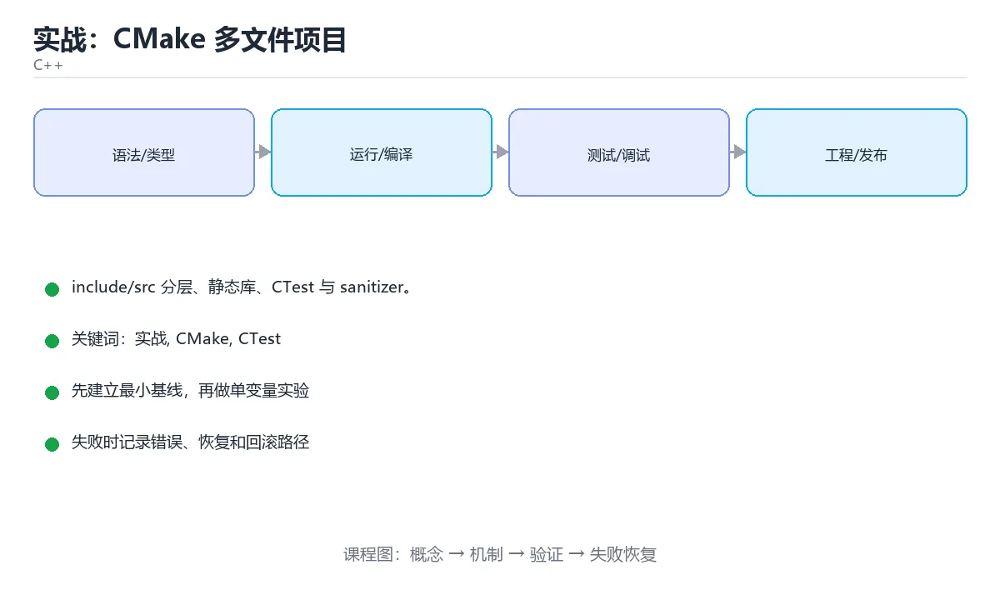

# 实战：用 CMake 组织多文件项目



> 内容更新时间：2026-10-03 · 学习阶段：高级 · 预计用时：18 分钟

## 学习目标

- 能用自己的话解释「实战：CMake 多文件项目」解决了什么问题，而不是只背术语。
- 能说清 「实战」、「CMake」、「CTest」、「sanitizer」 之间的关系，并分别举出一个例子。
- 能把本课知识放回「C++」的知识体系，说明它和相邻主题的边界。
- 能完成本课练习，并用验收标准检查自己的结果。

> 一句话摘要：include/src 分层、静态库、CTest 与 sanitizer。

## 前置知识

- 先完成上一课《构建、调试与工程实践》；如果已经掌握，可以直接用本课练习自测。
- 本课阶段：高级。建议具备同一方向的完整基础，能阅读较长的代码、配置或系统设计说明。
- 开始前先复习：实战、CMake、CTest。
- 如果某一步看不懂，先记录具体卡点，完成练习后再回头读一遍。


## 项目结构

```text
project/
├── CMakeLists.txt
├── include/
│   └── stats.h
├── src/
│   ├── main.cpp
│   └── stats.cpp
└── tests/
    └── stats_test.cpp
```

约定：`include/` 放对外头文件，`src/` 放实现，`tests/` 放测试，避免头文件与源文件混在一起。

## 头文件与实现

```cpp
// include/stats.h
#pragma once
#include <vector>

double mean(const std::vector<double>& values);
double median(std::vector<double> values);
double stddev(const std::vector<double>& values);
```

```cpp
// src/stats.cpp
#include "stats.h"
#include <algorithm>
#include <cmath>
#include <numeric>
#include <stdexcept>

double mean(const std::vector<double>& values) {
    if (values.empty()) throw std::invalid_argument("empty");
    return std::accumulate(values.begin(), values.end(), 0.0) / values.size();
}

double median(std::vector<double> values) {
    if (values.empty()) throw std::invalid_argument("empty");
    std::sort(values.begin(), values.end());
    const auto n = values.size();
    return n % 2 ? values[n / 2] : (values[n / 2 - 1] + values[n / 2]) / 2.0;
}

double stddev(const std::vector<double>& values) {
    const double m = mean(values);
    double sum = 0.0;
    for (double v : values) sum += (v - m) * (v - m);
    return std::sqrt(sum / values.size());
}
```

## CMakeLists

```cmake
cmake_minimum_required(VERSION 3.20)
project(stats LANGUAGES CXX)
set(CMAKE_CXX_STANDARD 20)
set(CMAKE_CXX_STANDARD_REQUIRED ON)
set(CMAKE_EXPORT_COMPILE_COMMANDS ON)

add_library(stats_core src/stats.cpp)
target_include_directories(stats_core PUBLIC include)
target_compile_options(stats_core PRIVATE -Wall -Wextra -Wpedantic)

add_executable(app src/main.cpp)
target_link_libraries(app PRIVATE stats_core)

enable_testing()
add_executable(stats_test tests/stats_test.cpp)
target_link_libraries(stats_test PRIVATE stats_core)
add_test(NAME stats_test COMMAND stats_test)
```

```bash
cmake -S . -B build -G Ninja -DCMAKE_BUILD_TYPE=Debug
cmake --build build -j
ctest --test-dir build --output-on-failure
```

## 测试与检查

```cpp
// tests/stats_test.cpp
#include "stats.h"
#include <cassert>
#include <iostream>

int main() {
    assert(std::abs(mean({1, 2, 3}) - 2.0) < 1e-9);
    assert(std::abs(median({3, 1, 2}) - 2.0) < 1e-9);
    assert(std::abs(median({4, 1, 2, 3}) - 2.5) < 1e-9);
    std::cout << "all tests passed\n";
}
```

```bash
g++ -fsanitize=address,undefined -g ...    # 或给 CMake 加编译选项跑 sanitizer
clang-tidy src/*.cpp -- -Iinclude
```

## 工程习惯

1. 编译警告全开并当作错误（`-Werror`）。
2. Debug 与 Release 分开构建目录。
3. 第三方依赖用 vcpkg/Conan 管理，锁定版本。
4. CI 中跑 `cmake --build` + `ctest` + sanitizer。

## 本课小结
多文件 + CMake + 测试 + sanitizer 是现代 C++ 项目的最小骨架；把它固化成模板，新项目直接复用。


## 目录结构速查

```text
project/
├── CMakeLists.txt          # 顶层构建脚本
├── include/app/            # 对外头文件
│   └── calculator.h
├── src/
│   ├── calculator.cpp      # 实现
│   └── main.cpp            # 程序入口
├── tests/
│   └── calculator_test.cpp
├── third_party/            # 第三方依赖（或由包管理器管理）
└── build/                  # 构建产物（加入 .gitignore）
```

| 约定 | 说明 |
| --- | --- |
| 头文件对外、实现对内 | `include/` 暴露接口，`src/` 放细节 |
| 一个类一个文件对 | `foo.h` + `foo.cpp`，便于定位 |
| 入口只有一处 | `main.cpp` 只做参数解析与调用 |
| 测试与源码分离 | `tests/` 独立，接入 ctest |
| 构建目录不入库 | `build/` 写进 `.gitignore` |

## 顶层 CMakeLists 参考

```cmake
cmake_minimum_required(VERSION 3.20)
project(code_learn LANGUAGES CXX)

set(CMAKE_CXX_STANDARD 20)
set(CMAKE_CXX_STANDARD_REQUIRED ON)
set(CMAKE_EXPORT_COMPILE_COMMANDS ON)      # 供 clangd / clang-tidy 使用

add_library(calc STATIC src/calculator.cpp)
target_include_directories(calc PUBLIC include)
target_compile_options(calc PRIVATE -Wall -Wextra -Werror)

add_executable(app src/main.cpp)
target_link_libraries(app PRIVATE calc)

enable_testing()
add_executable(calc_test tests/calculator_test.cpp)
target_link_libraries(calc_test PRIVATE calc)
add_test(NAME calc_test COMMAND calc_test)
```

测试与 CI 速查：

| 目的 | 做法 |
| --- | --- |
| 单元测试框架 | GoogleTest、Catch2、doctest |
| 运行测试 | `ctest --test-dir build --output-on-failure` |
| 覆盖率 | `-fprofile-instr-generate -fcoverage-mapping` 或 gcov |
| 静态检查 | clang-tidy + `compile_commands.json` |
| 流水线步骤 | 配置 → 构建 → 测试 → 静态检查 → 打包 |

## 常见错误对照表

| 现象 | 原因 | 处理方式 |
| --- | --- | --- |
| 测试可执行文件找不到头文件 | 未声明 include 目录 | 用 `target_include_directories` |
| 修改头文件后没有重新编译 | 依赖未声明 | 让目标正确声明头文件目录 |
| `main.cpp` 里塞满业务逻辑 | 无法测试 | 逻辑抽到库，`main` 只做编排 |
| 头文件里 `using namespace std;` | 污染所有包含者 | 在源文件局部使用，或写全限定名 |
| 在头文件定义全局变量 | 多重定义 | 用 `inline` 或放源文件 + `extern` |
| 直接提交 `build/` | 仓库臃肿 | 加入 `.gitignore` |
| 依赖靠手工下载 | 环境不可复现 | 用 FetchContent / vcpkg / Conan |
| 只在本地跑测试 | 回归无人发现 | 接入 CI 并设为合并门禁 |
| 用 Debug 构建做性能测试 | 数据无意义 | 用 Release 并固定编译选项 |

## 自测清单

- [ ] 目录分为 `include/`、`src/`、`tests/`。
- [ ] `main.cpp` 只做编排，业务逻辑在库里可被测试。
- [ ] CMake 用 target 指令管理头文件与选项。
- [ ] ctest 能一条命令跑完全部测试。
- [ ] CI 覆盖构建、测试与静态检查。


## 零基础详解：C++ 项目实战骨架

### 一句话说清它是什么

一个可交付的 C++ 项目要有：**CMake 构建、依赖管理、测试、静态检查、Sanitizer、CI**。
下面用一个「日志解析库」把这些串起来。

### 用生活比喻理解

| 工具 | 比喻 | 作用 |
| --- | --- | --- |
| CMake | 施工图 | 描述怎么编译与链接 |
| 预设 preset | 标准工法 | 团队用同一套参数 |
| 依赖管理 | 进货渠道 | vcpkg 或 Conan |
| 测试框架 | 验收员 | Catch2 或 GoogleTest |
| Sanitizer | 安检仪 | 发现越界、泄漏、数据竞争 |

### 目录结构

```text
logparser/
  CMakeLists.txt
  CMakePresets.json
  include/logparser/parser.hpp     对外头文件
  src/parser.cpp                   实现
  tests/parser_test.cpp
  benchmarks/parse_bench.cpp
  cmake/                           自定义 cmake 模块
```

**头文件与实现分离**：`include/` 暴露给使用方，`src/` 只放实现。

### 顶层 CMakeLists.txt

```cmake
cmake_minimum_required(VERSION 3.24)
project(logparser VERSION 0.1.0 LANGUAGES CXX)

set(CMAKE_CXX_STANDARD 20)
set(CMAKE_CXX_STANDARD_REQUIRED ON)
set(CMAKE_CXX_EXTENSIONS OFF)

# 警告即错误，从源头保证质量
add_library(logparser src/parser.cpp)
target_include_directories(logparser PUBLIC include)
target_compile_options(logparser PRIVATE
    $<$<CXX_COMPILER_ID:GNU,Clang>:-Wall -Wextra -Wpedantic -Werror>)

# 测试
include(CTest)
if(BUILD_TESTING)
    find_package(Catch2 3 REQUIRED)
    add_executable(parser_test tests/parser_test.cpp)
    target_link_libraries(parser_test PRIVATE logparser Catch2::Catch2WithMain)
    include(CTest)
    include(Catch)
    catch_discover_tests(parser_test)
endif()
```

### CMakePresets.json：团队统一参数

```json
{
  "version": 6,
  "configurePresets": [
    {
      "name": "debug",
      "generator": "Ninja",
      "binaryDir": "${sourceDir}/build/debug",
      "cacheVariables": {
        "CMAKE_BUILD_TYPE": "Debug",
        "CMAKE_EXPORT_COMPILE_COMMANDS": "ON"
      }
    },
    {
      "name": "release",
      "generator": "Ninja",
      "binaryDir": "${sourceDir}/build/release",
      "cacheVariables": { "CMAKE_BUILD_TYPE": "Release" }
    },
    {
      "name": "asan",
      "inherits": "debug",
      "binaryDir": "${sourceDir}/build/asan",
      "cacheVariables": {
        "CMAKE_CXX_FLAGS": "-fsanitize=address,undefined -fno-omit-frame-pointer"
      }
    }
  ]
}
```

```bash
cmake --preset debug
cmake --build build/debug
ctest --test-dir build/debug --output-on-failure
```

### 依赖管理

```cmake
# 方式一：CMake 自带的 FetchContent（小项目够用）
include(FetchContent)
FetchContent_Declare(
    catch2
    GIT_REPOSITORY https://github.com/catchorg/Catch2.git
    GIT_TAG v3.7.0
)
FetchContent_MakeAvailable(catch2)

# 方式二：vcpkg 清单模式（推荐用于中大型项目）
# vcpkg.json 里声明依赖，CMake 用 CMAKE_TOOLCHAIN_FILE 指向 vcpkg
```

```json
{
  "name": "logparser",
  "version": "0.1.0",
  "dependencies": [
    "catch2",
    { "name": "fmt", "version>=": "11.0.2" }
  ]
}
```

### 测试：先测纯函数

```cpp
// tests/parser_test.cpp
#include <catch2/catch_test_macros.hpp>
#include "logparser/parser.hpp"

TEST_CASE("解析合法日志行", "[parser]") {
    const auto entry = logparser::parse("2026-01-01 10:00:00 ERROR 连接失败");
    REQUIRE(entry.has_value());
    CHECK(entry->level == logparser::Level::Error);
    CHECK(entry->message == "连接失败");
}

TEST_CASE("非法行返回空", "[parser]") {
    CHECK_FALSE(logparser::parse("这不是日志").has_value());
}

TEST_CASE("容忍首尾空格", "[parser]") {
    CHECK(logparser::parse("  2026-01-01 10:00:00 INFO 启动  ").has_value());
}
```

用 `std::optional` 表达「可能解析失败」，比返回特殊值更清楚。

### 三种 Sanitizer 各查什么

| Sanitizer | 检查 | 编译参数 |
| --- | --- | --- |
| AddressSanitizer | 越界、释放后使用、泄漏 | `-fsanitize=address` |
| UndefinedBehaviorSanitizer | 整数溢出、空指针、未对齐 | `-fsanitize=undefined` |
| ThreadSanitizer | 数据竞争 | `-fsanitize=thread` |

**注意**：ASan 与 TSan 不能同时开，要分成两个预设跑。

### CI 流水线

```yaml
name: cpp-ci
on: [push, pull_request]

jobs:
  build-and-test:
    strategy:
      matrix:
        preset: [debug, release, asan]
    runs-on: ubuntu-latest
    steps:
      - uses: actions/checkout@v4
      - run: sudo apt-get update && sudo apt-get install -y ninja-build
      - run: cmake --preset ${{ matrix.preset }}
      - run: cmake --build build/${{ matrix.preset }} -j
      - run: ctest --test-dir build/${{ matrix.preset }} --output-on-failure

  format-check:
    runs-on: ubuntu-latest
    steps:
      - uses: actions/checkout@v4
      - run: pip install clang-format
      - run: clang-format --dry-run --Werror src/*.cpp include/**/*.hpp
```

### 静态分析与格式化

```bash
clang-format -i src/*.cpp include/**/*.hpp     # 统一格式
clang-tidy src/parser.cpp -- -std=c++20 -Iinclude
cppcheck --enable=warning,performance src
```

把 `.clang-format` 与 `.clang-tidy` 提交到仓库，团队格式化结果才会一致。

### 新手最容易踩的八个坑

| 坑 | 现象 | 正确做法 |
| --- | --- | --- |
| 头文件里 `using namespace std` | 污染使用方 | 写全限定名 |
| 目录结构混乱 | 找不到头文件 | `include/` 与 `src/` 分离 |
| 每次手工敲编译参数 | 结果不一致 | 用 CMakePresets |
| 不开警告 | 隐患积累 | `-Wall -Wextra -Werror` |
| 只在 Release 测 | 断言被优化掉 | Debug 与 Release 都跑 |
| 不跑 Sanitizer | 越界与泄漏漏检 | CI 加 asan 预设 |
| 依赖版本不固定 | 今天能编明天不行 | 固定 tag 或用 vcpkg 清单 |
| 忘记提交 `.clang-format` | 格式各写一套 | 提交配置文件 |

### 学完自测

- [ ] 能说出 `include/` 与 `src/` 分离的好处。
- [ ] 知道 CMakePresets 解决什么问题。
- [ ] 能说出三种 Sanitizer 各自查什么。
- [ ] 知道为什么 ASan 与 TSan 不能同时开。
- [ ] 能列出 CI 里至少要跑的三种配置。

## 动手练习


> 本课练习重点：围绕「实战、CMake、CTest」完成复述、实验和交付，每个结果都要能被别人检查。

先开启警告编译最小程序，再验证内存与边界，最后用 Sanitizer 跑一遍。

### 练习 1：建立心智模型（10 分钟）

合上教程，用 3～5 句话回答：

1. 「实战：CMake 多文件项目」解决了什么问题？
2. 如果没有它，会出现什么具体后果？
3. 它和「CMake」是什么关系？

**验收标准**：至少出现一个本课关键词，并写出一个反例、边界条件或失效场景。

### 练习 2：做一次可控实验（20 分钟）

从正文中选一个最小示例，完成以下操作：

1. 先预测修改一个参数、输入或步骤后的结果。
2. 再实际执行或逐步推演，记录真实结果。
3. 如果结果与预测不同，写出差异原因。

**验收标准**：留下「原例 → 改动 → 预测 → 结果 → 原因」五步记录。

### 练习 3：交付一个小结果（30 分钟）

写一个可独立编译的小程序，开启 `-Wall -Wextra`，确保没有警告。

任务要求：

- 结果必须能被别人检查，不能只写“我已经理解了”。
- 至少覆盖「实战」和「CMake」两个关键词。
- 写出 1 个仍然不确定的问题，以及下一步如何验证。

> 提示：时间有限时优先做练习 1 和练习 2；练习 3 可以拆成两次完成。


## 验证命令与预期输出

项目代码不能只看“能编译”，还要能按固定命令复现结果。下表给出最低验证集：

| 阶段 | 命令 | 预期输出 |
| --- | --- | --- |
| 配置构建 | `cmake -S . -B build -DCMAKE_BUILD_TYPE=Debug` | 生成 CMake 缓存且无错误 |
| 编译 | `cmake --build build --parallel` | 目标全部编译成功且无警告 |
| 运行测试 | `ctest --test-dir build --output-on-failure` | 所有 CTest 用例通过 |

### 验收证据

- [ ] 保存依赖安装和启动命令的完整输出。
- [ ] 至少运行 3 条测试，其中包含一条非法输入或失败路径。
- [ ] 重复执行同一操作两次，确认没有重复写入或副作用。
- [ ] 记录一次失败状态码、错误日志和恢复步骤。
- [ ] 在 README 中写明环境版本、启动方式和回滚方式。

### 回归与回滚

1. 先在一个可丢弃的目录或临时数据库执行，避免污染真实数据。
2. 修改一处逻辑后重跑全部验证命令，确认没有回归。
3. 若失败，回滚到上一个可运行版本并保留失败日志。
4. 定位原因后补一条自动化测试，再重新执行发布流程。
5. 把教训写入项目复盘或本课笔记，形成下一次的检查项。


## 考点精讲：把测验题还原成判断过程

本课有 5 个判断点。先自己作答，再看「判断依据」；如果结论正确但理由不完整，回到正文对应章节补足概念。

### 考点 1：C++ 项目中对外的头文件通常放在？

- **正确判断**：include/
- **判断依据**：include 放对外头文件，src 放实现，职责清晰也方便安装导出。其他选项：include/ 放对外头文件，src/ 放实现，tests/ 放测试，build/ 是构建产物并应加入 .gitignore。正确项「include/」既符合定义也满足题干限定的场景，因此应当选择。把题干「C++ 项目中对外的头文件通常放在？」放回《实战：CMake 多文件项目》的「include/src 分层、静态库、CTest 与 sanitizer」语境，逐项对照定义与边界条件，就能排除其余说法。
- **迁移检查**：遮住选项，只根据定义复述一次答案，再回来看哪个选项与复述一致。

### 考点 2：CTest 的作用是？

- **正确判断**：运行并管理测试
- **判断依据**：enable_testing + add_test 后可用 ctest 一键运行测试。其他选项：CTest 负责运行并汇总测试结果。格式化、优化、文档生成属于其他工具。正确项「运行并管理测试」抓住了题干的核心条件，是经得起边界检验的表述。错误项「编译优化」把不同概念混在一起，缺少题干限定的前提。错误项「生成文档」与课程给出的定义相冲突，不能回答题目所问。错误项「格式化代码」在边界或失败路径上会得出错误结果。把题干「CTest 的作用是？」放回《实战：CMake 多文件项目》的「include/src 分层、静态库、CTest 与 sanitizer」语境，逐项对照定义与边界条件，就能排除其余说法。
- **迁移检查**：把题干里的一个条件换成边界值，原来的结论还成立吗？写出判断过程。

### 考点 3：在 CMake 项目中开启 AddressSanitizer 和 UndefinedBehaviorSanitizer，最合理的做法是？

- **正确判断**：在 Debug/CI 构建中加入 -fsanitize=address,undefined 并链接 sanitizer 运行时
- **判断依据**：Sanitizer 适合在开发、测试和 CI 构建中启用，它需要编译与链接阶段同时加入对应参数。Release 产物通常不开启以避免性能与部署依赖问题。关闭警告或替换类型都无法发现越界、泄漏和未定义行为。正确项「在 Debug/CI 构建中加入 -fsanitize=address,undefined 并链接 sanitizer 运行时」是该问题的规范说法，换成其他表述都会丢失条件。错误项「用宏替换所有类型」把因果关系颠倒了，不能作为正确结论。错误项「关闭所有编译器警告」忽略了题目中的限制条件，因此不成立。错误项「只在 Release 构建中开启（只在 Release 或个别边界场景下成立，混淆了相邻概念，也没有覆盖题干给出的全部条件，不能作为答案）」属于相邻主题的说法，范围与本题要求不一致。把题干「在 CMake 项目中开启 AddressSanitizer 和 UndefinedBehaviorSanitizer，最合理的做法是？」放回《实战：CMake 多文件项目》的「include/src 分层、静态库、CTest 与 sanitizer」语境，逐项对照定义与边界条件，就能排除其余说法。
- **迁移检查**：遮住选项，只根据定义复述一次答案，再回来看哪个选项与复述一致。

### 考点 4：CMake 中 target_link_libraries(app PRIVATE fmt) 的作用是？

- **正确判断**：给 app 目标声明需要链接的库及其传递属性
- **判断依据**：基于目标（target）的写法会携带 include 路径等使用要求，比全局变量更清晰。其他选项：target_link_libraries 声明链接依赖及其使用要求（含 include 路径），不会拷贝源码或设置语言标准。正确项「给 app 目标声明需要链接的库及其传递属性」既符合定义也满足题干限定的场景，因此应当选择。错误项「把 fmt 源码拷进项目（仅部分场景成立）」把因果关系颠倒了，不能作为正确结论。错误项「设置 C++ 标准」忽略了题目中的限制条件，因此不成立。错误项「开启调试符号」属于相邻主题的说法，范围与本题要求不一致。把题干「CMake 中 target_link_libraries(app PRIVATE fmt) 的作用是？」放回《实战：CMake 多文件项目》的「include/src 分层、静态库、CTest 与 sanitizer」语境，逐项对照定义与边界条件，就能排除其余说法。
- **迁移检查**：把题干里的一个条件换成边界值，原来的结论还成立吗？写出判断过程。

### 考点 5：把单元测试接入 CI 的主要价值是？

- **正确判断**：每次提交自动验证，尽早发现回归
- **判断依据**：CI 上跑 ctest 能保证「测试在别人机器上也通过」，是团队协作的质量底线。其他选项：CI 的价值是每次提交自动验证。它不能替代评审或自动修 bug，也不会让代码运行更快。正确项「每次提交自动验证，尽早发现回归」抓住了题干的核心条件，是经得起边界检验的表述。错误项「自动修复 bug」把不同概念混在一起，缺少题干限定的前提。错误项「替代代码评审」在边界或失败路径上会得出错误结果。把题干「把单元测试接入 CI 的主要价值是？」放回《实战：CMake 多文件项目》的「include/src 分层、静态库、CTest 与 sanitizer」语境，逐项对照定义与边界条件，就能排除其余说法。
- **迁移检查**：如果给某个错误选项去掉一个限定词，它会不会变成正确？说明理由。

## 本课复习清单

离开本课前，逐项确认：

- [ ] 不看解析，能说出「C++ 项目中对外的头文件通常放在？」的判断依据。
- [ ] 不看解析，能说出「CTest 的作用是？」的判断依据。
- [ ] 不看解析，能说出「在 CMake 项目中开启 AddressSanitizer 和 Undefin…」的判断依据。
- [ ] 不看解析，能说出「CMake 中 target_link_libraries(app PRIVAT…」的判断依据。
- [ ] 不看解析，能说出「把单元测试接入 CI 的主要价值是？」的判断依据。
- [ ] 至少运行一次本课示例，记录输入、输出和一个边界情况。
- [ ] 把本课最容易混淆的两个概念写成一句话对照。

| 复盘项 | 记录 |
| --- | --- |
| 已经能独立解释的考点 |  |
| 仍然说不清的概念 |  |
| 下一步验证动作 |  |

## English Overview

**Title:** Project: CMake Layout

**Summary:** Layout, library target, CTest and sanitizers.

**Category:** C++  
**Level:** 高级  
**Key terms:** 实战, CMake, CTest, sanitizer, 工程结构

> The full tutorial is written in Chinese. This bilingual overview helps English readers identify the topic, scope and key terms before studying the detailed examples.

## 内容元数据

- 内容版本：v2.0
- 最后更新：2026-10-03
- 学习阶段：高级
- 适用环境：C++20 / GCC 13+ 或 Clang 17+
- 内容来源：内置结构化课程与工程实践整理
- 相关主题：实战、CMake、CTest、sanitizer、工程结构
- 质量版本：P0 测验标准 + P1 覆盖扩展 + P2 体验补全

## 项目专属规格：实战：CMake 多文件项目

### 核心场景

include/src 分层、静态库、CTest 与 sanitizer。 项目目标是把「实战、CMake、CTest、sanitizer、工程结构」落实为可运行、可测试、可回滚的交付物。

### 架构与数据流

```text
用户/输入 → 接口或命令 → 领域逻辑 → 存储/外部依赖 → 输出与监控
                         ↘ 失败分类 → 重试/补偿 → 回滚
```

### 最小数据模型

| 对象 | 关键字段 | 约束 |
| --- | --- | --- |
| 输入实体 | 实战、时间、来源 | 必填校验、长度限制、幂等键 |
| 任务实体 | 状态、优先级、创建时间 | 状态迁移合法、不可重复执行 |
| 结果实体 | 输出、错误码、耗时 | 可序列化、错误可解释 |
| 审计记录 | 操作者、动作、结果、时间 | 不可篡改、可查询、脱敏 |

### 验收场景

1. 正常路径：最小输入得到预期输出，并留下日志与指标。
2. 边界路径：空值、最大值、重复数据和超长内容得到明确处理。
3. 失败路径：依赖超时或不可用时能快速失败、重试或降级。
4. 幂等路径：同一请求执行两次不会产生重复副作用。
5. 回滚路径：回滚后数据一致，且能说明恢复时间和影响范围。


## 项目交付物

### 建议仓库结构

```text
src/
include/
tests/
CMakeLists.txt
README.md
```

### 测试矩阵

| 层级 | 覆盖内容 | 最低数量 | 通过标准 |
| --- | --- | ---: | --- |
| 单元测试 | 领域规则、边界和错误分类 | 8 | 正常、边界、失败路径全部通过 |
| 集成测试 | 数据库、网络、文件或平台边界 | 3 | 使用真实边界且可重复运行 |
| 端到端测试 | 核心用户路径 | 1 | 从输入到输出完整跑通 |
| 手动验收 | 文档中列出的 5 个场景 | 5 | 有命令、输出和结论记录 |

### 验收数据

```json
{
  "project": "cpp_project",
  "input": {"case": "normal", "value": 5},
  "expected": {"ok": true, "result": 5},
  "failure_case": {"value": -1, "error": "validation_error"},
  "idempotency_key": "demo-001"
}
```

### 复盘模板

| 问题 | 记录 |
| --- | --- |
| 原目标是什么？ | 用一句话描述可验收目标 |
| 实际发生了什么？ | 时间线、指标和关键日志 |
| 哪个假设被推翻？ | 根因与促成因素 |
| 如何回滚？ | 步骤、耗时和数据校验 |
| 下一步做什么？ | 负责人、期限和验证方式 |

> 项目验收围绕「实战、CMake、CTest」：至少完成一次正常路径、一次边界输入、一次失败恢复和一次幂等检查。


## Full English Study Guide

### Overview

**Project: CMake Layout** focuses on Layout, library target, CTest and sanitizers.

### Learning Outcomes

- Explain what **Project: CMake Layout** solves and when it should be used.
- Identify inputs, outputs, state and failure boundaries.
- Build a minimal reproducible example and observe the real result.
- Test normal, boundary and failure paths.
- Measure performance, resource cost or security impact before optimizing.
- Document the decision, rollback path and remaining uncertainty.

### Core Mental Model

1. **Problem first:** define the exact problem before choosing a tool or pattern.
2. **Smallest example:** reduce the system to one input and one observable output.
3. **State and flow:** trace how data, control or responsibility moves through the system.
4. **Boundaries:** identify invalid input, resource limits, timeouts and permission edges.
5. **Evidence:** use tests, logs, metrics or reproductions instead of intuition.
6. **Trade-offs:** compare correctness, latency, cost, complexity and operability.

### Step-by-step Study Plan

1. Read the Chinese lesson once and write down the main problem in one sentence.
2. Run the smallest example and save the exact command and output.
3. Change only one input or parameter and predict the result before running it.
4. Introduce one failure and record how the system detects, reports and recovers.
5. Write one test or checklist item for the normal, boundary and failure paths.
6. Complete the quiz and explain every wrong answer in your own words.

### Practice Tasks

- Rebuild the minimal example from an empty directory.
- Add one boundary test and one failure test.
- Produce a short report containing the baseline, change, result and rollback.

### Common Failure Modes

- Treating a happy-path demo as production readiness.
- Skipping boundary values and invalid inputs.
- Optimizing before establishing a measurable baseline.
- Hiding errors, permissions or resource limits.

### Self-check Questions

1. What is the smallest observable result that proves this lesson works?
2. What input or state is most likely to break it?
3. Which metric or test would reveal a regression?
4. What is the rollback path?
5. What is the cost of using this approach at 10x scale?
6. Which adjacent topic is most often confused with this one?

### Glossary

- Topic: **Project: CMake Layout**
- Related terms: 实战, CMake, CTest, sanitizer
- Primary evidence: command output, tests, logs, metrics or reproductions

> This guide is an English study companion for the detailed Chinese lesson. It covers the learning path, mental model and acceptance questions; code examples and engineering details remain in the main tutorial.


## Bilingual Section Outline

| 中文小节 | English section |
| --- | --- |
| 学习目标 | Learning objectives |
| 前置知识 | Prerequisites |
| 项目结构 | 项目结构 |
| 头文件与实现 | 头文件与实现 |
| CMakeLists | CMakeLists |
| 测试与检查 | Testing与检查 |
| 工程习惯 | 工程习惯 |
| 本课小结 | Summary |
| 目录结构速查 | 目录结构速查 |
| 顶层 CMakeLists 参考 | 顶层 CMakeLists 参考 |

> 该大纲把每个中文小节映射为英文标题，配合 Full English Study Guide 使用。


## 参考资料与复核

- 最后复核：2026-10-04
- 下次复核：2027-04-04
- 复核范围：版本兼容、API 行为、安全建议与工程实践
- 来源性质：官方文档与标准；本课正文为离线教学重组，不复制原文

| 参考资料 | 本课用途 |
| --- | --- |
| [C++ 标准库参考](https://en.cppreference.com/w/cpp) | 语言、标准库与并发 |
| [ISO C++](https://isocpp.org/) | 标准动态、指南与最佳实践 |

> 本课主题：include/src 分层、静态库、CTest 与 sanitizer。

> App 完全离线展示文字链接，不会自动联网；需要延伸阅读时可复制链接到浏览器。

