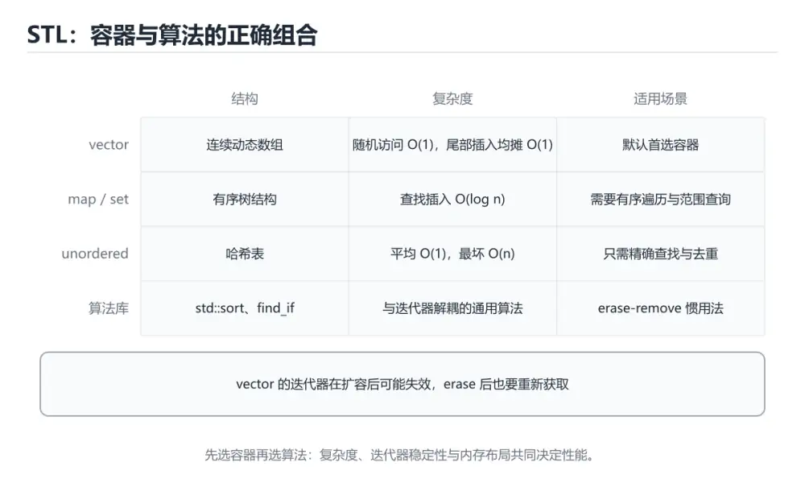
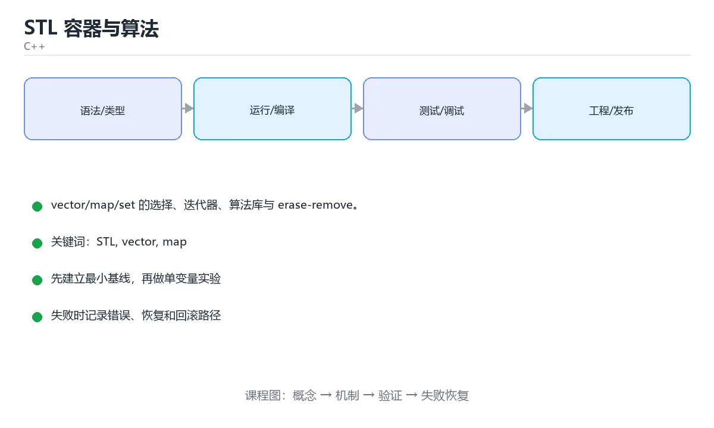

# STL 容器与算法

> 内容更新时间：2026-10-03





## 学习目标

- 能用自己的话解释STL 容器与算法解决了什么问题，而不是只背术语。
- 能说清 「STL」、「vector」、「map」、「unordered_map」 之间的关系，并分别举出一个例子。
- 能把本课知识放回「C++」的知识体系，说明它和相邻主题的边界。
- 能完成本课练习，并用验收标准检查自己的结果。

> 一句话摘要：vector/map/set 的选择、迭代器、算法库与 erase-remove。

## 前置知识

- 先完成上一课《模板与泛型编程》；如果已经掌握，可以直接用本课练习自测。
- 本课阶段：进阶。建议先掌握同一分类的基础课程，并能独立运行正文中的最小示例。
- 开始前先复习：STL、vector、map。
- 如果某一步看不懂，先记录具体卡点，完成练习后再回头读一遍。

## 常用容器

| 容器 | 结构 | 典型用途 |
| --- | --- | --- |
| `vector` | 动态数组 | 默认选择，随机访问快 |
| `array` | 固定数组 | 长度已知，无堆分配 |
| `deque` | 双端队列 | 两端频繁插入删除 |
| `list` | 双向链表 | 中间频繁插删 |
| `map` / `set` | 红黑树 | 有序、按 key 查找 |
| `unordered_map` / `unordered_set` | 哈希表 | 平均 O(1) 查找 |
| `stack` / `queue` | 容器适配器 | LIFO / FIFO |

```cpp
#include <vector>
#include <unordered_map>
#include <string>

std::vector<int> nums{3, 1, 2};
nums.push_back(4);
nums[0] = 9;

std::unordered_map<std::string, int> ages;
ages["小明"] = 18;
if (auto it = ages.find("小明"); it != ages.end()) {   // C++17 带初始化的 if
    std::cout << it->second;
}
```

## 迭代器

迭代器是容器与算法之间的统一接口。

```cpp
for (auto it = nums.begin(); it != nums.end(); ++it) {
    std::cout << *it << ' ';
}

nums.erase(std::remove(nums.begin(), nums.end(), 1), nums.end());  // erase-remove 惯用法
```

注意：修改容器结构（如 `push_back`）可能让迭代器失效。

## 算法库

```cpp
#include <algorithm>
#include <numeric>

std::sort(nums.begin(), nums.end());                   // 升序
std::sort(nums.begin(), nums.end(), std::greater<int>());

auto it = std::find(nums.begin(), nums.end(), 4);
bool has = it != nums.end();

std::reverse(nums.begin(), nums.end());
int total = std::accumulate(nums.begin(), nums.end(), 0);
auto [min_it, max_it] = std::minmax_element(nums.begin(), nums.end());

bool all_positive = std::all_of(nums.begin(), nums.end(),
                                [](int x) { return x > 0; });
```

## lambda 与算法配合

```cpp
std::vector<std::string> names{"tom", "alice", "bob"};

std::sort(names.begin(), names.end(),
          [](const std::string& a, const std::string& b) {
              return a.size() < b.size();
          });

auto count = std::count_if(names.begin(), names.end(),
                           [](const auto& n) { return n.size() > 3; });
```

## 选择容器的思路

1. 不确定就用 `vector`。
2. 需要按键查找 → `unordered_map`（无需有序）或 `map`（需要有序遍历）。
3. 需要去重 → `set` / `unordered_set`。
4. 频繁在中间插删 → `list`（但缓存不友好，往往仍不如 vector）。

## 复杂度与常见坑

| 容器 | 查找 | 插入 | 删除 | 备注 |
| --- | --- | --- | --- | --- |
| vector | O(n) | 尾部均摊 O(1) | 尾部 O(1) | 内存连续、缓存友好 |
| deque | O(n) | 两端 O(1) | 两端 O(1) | 分段连续 |
| list | O(n) | 已知位置 O(1) | 已知位置 O(1) | 缓存不友好，实际少用 |
| map/set | O(log n) | O(log n) | O(log n) | 红黑树，有序 |
| unordered_map/set | 平均 O(1) | 平均 O(1) | 平均 O(1) | 哈希，需自定义哈希时注意 |

四个高频坑：① **迭代器失效**（vector 扩容、erase 后继续用旧迭代器）；② **erase-remove 遗漏 erase**（remove 只移动元素不改变大小）；③ `map[key]` 会**默认构造**不存在的键（查询应用 find/at）；④ **自定义类型作 map 键**需提供严格弱序比较（operator< 要满足传递性，否则行为未定义）。

## 本课小结
STL 的价值在于**容器 + 迭代器 + 算法**三者解耦。先把 `vector`、`unordered_map`、`sort`、`find` 用熟，再按需扩展。

## 容器选型速查

| 需求 | 容器 | 复杂度 | 说明 |
| --- | --- | --- | --- |
| 默认顺序容器 | `std::vector` | 尾部均摊 O(1) | 连续内存、缓存友好 |
| 频繁两端插入删除 | `std::deque` | 两端 O(1) | 分段连续存储 |
| 频繁中间插入删除 | `std::list` | 已知位置 O(1) | 缓存不友好，谨慎使用 |
| 固定大小、栈上分配 | `std::array` | 访问 O(1) | 编译期确定大小 |
| 有序键值 | `std::map` | O(log n) | 红黑树，可范围遍历 |
| 无序键值、只求快 | `std::unordered_map` | 平均 O(1) | 哈希表，最坏 O(n) |
| 有序去重集合 | `std::set` | O(log n) | 需要排序或范围查询时用 |
| 无序去重集合 | `std::unordered_set` | 平均 O(1) | 判存在性最快 |
| 优先级队列 | `std::priority_queue` | 入出 O(log n) | 默认大顶堆 |
| 只读视图 | `std::string_view` / `std::span` | O(1) 构造 | C++17 / C++20，注意生命周期 |

## 常用算法速查

| 目的 | 算法 | 备注 |
| --- | --- | --- |
| 查找元素 | `std::find` | 顺序查找 O(n) |
| 有序容器二分 | `std::lower_bound` / `upper_bound` | O(log n)，需已排序 |
| 排序 | `std::sort` | 平均 O(n log n)，不稳定 |
| 稳定排序 | `std::stable_sort` | 保留相等元素顺序 |
| 条件计数 | `std::count_if` | 配合 lambda |
| 变换 | `std::transform` | 类似 map |
| 过滤并删除 | `erase-remove` 惯用法 | `v.erase(remove_if(...), v.end())` |
| 累加 | `std::accumulate` | 注意初始值类型决定结果类型 |
| 最值 | `std::min_element` / `max_element` | 返回迭代器 |
| 并行版本 | `std::sort(std::execution::par, ...)` | C++17，需链接 TBB |

```cpp
#include <algorithm>
#include <numeric>
#include <vector>

std::vector<int> v{5, 1, 4, 2, 3};
std::sort(v.begin(), v.end());                      // 1 2 3 4 5
v.erase(std::remove_if(v.begin(), v.end(),
                       [](int x) { return x % 2 == 0; }),
        v.end());                                   // 删除偶数
auto sum = std::accumulate(v.begin(), v.end(), 0);  // 初始值 0 决定返回 int
```

## 常见错误对照表

| 容易写错的做法 | 实际现象 | 原因与正确做法 |
| --- | --- | --- |
| 在 `vector` 上 `erase` 后继续用旧迭代器 | 崩溃或跳过元素 | 用 `it = v.erase(it)` 接收返回值 |
| 循环中反复 `v.push_back` 并持有引用 | 引用失效（扩容后悬空） | 扩容会让所有指针/引用失效；先 `reserve` 或改用下标 |
| `map` 用 `operator[]` 查询 | 不存在时插入默认值，size 变大 | 只读查询用 `find` / `at` |
| 用 `std::list` 当默认容器 | 遍历慢、内存碎片多 | 默认用 `vector`，测过再换 |
| 用 `std::sort` 排 `std::list` | 编译报错 | `list` 用成员函数 `sort()` |
| 比较函数写 `<=` | 触发断言或未定义行为 | 严格弱序要求用 `<` |
| 遍历容器时删除元素 | 迭代器失效 | 用 `erase-remove` 惯用法，或先记录再删 |
| `unordered_map` 用自定义类型作键 | 编译或链接错误 | 需要提供 `std::hash` 特化与 `operator==` |
| `std::accumulate` 初始值写 `0` 累加 `double` | 结果被截断 | 初始值写 `0.0` |
| `string_view` 指向临时字符串 | 悬空，读到垃圾数据 | 确保被引用对象生命周期长于视图 |

## 自测清单

- [ ] 默认选 `vector`，能说出 `map` 与 `unordered_map` 的取舍。
- [ ] 会写 `erase-remove` 惯用法删除元素。
- [ ] 知道哪些操作会让孩子迭代器 / 引用失效。
- [ ] 只读查询 `map` 时用 `find` 或 `at`，不用 `operator[]`。
- [ ] 记得 `accumulate` 的初始值类型决定结果类型。

## 零基础详解：STL 容器、迭代器与算法

### 一句话说清它是什么

STL 把「存数据」和「处理数据」分开：
容器负责存，迭代器负责遍历，算法负责加工。三者用统一的接口拼在一起，所以你学会一套就能通用。

### 用生活比喻理解

| 组件 | 比喻 | 说明 |
| --- | --- | --- |
| 容器 | 各种收纳盒 | vector、map、set 各有取舍 |
| 迭代器 | 手指 | 指向某个位置，能前后移动 |
| 算法 | 加工机器 | sort、find、transform |
| 仿函数或 Lambda | 加工参数 | 告诉算法「按什么规则」 |

### 容器选择表

| 容器 | 结构 | 查找 | 插入删除 | 典型用途 |
| --- | --- | --- | --- | --- |
| `vector` | 动态数组 | O(n) | 尾部 O(1) | **默认选择** |
| `deque` | 双端队列 | O(n) | 两端 O(1) | 双端进出 |
| `list` | 双向链表 | O(n) | 已知位置 O(1) | 频繁中间插入 |
| `map` / `set` | 红黑树 | O(log n) | O(log n) | 需要有序 |
| `unordered_map` | 哈希表 | 平均 O(1) | 平均 O(1) | 需要极速查找 |
| `array` | 固定数组 | O(n) | 长度不可变 | 编译期确定大小 |

### 一段代码走完常用操作

```cpp
#include <algorithm>
#include <iostream>
#include <map>
#include <numeric>
#include <string>
#include <unordered_map>
#include <vector>

int main() {
    std::vector<int> nums{5, 3, 1, 4, 2};
    std::sort(nums.begin(), nums.end());                  // 排序
    auto it = std::find(nums.begin(), nums.end(), 4);     // 查找
    int sum = std::accumulate(nums.begin(), nums.end(), 0);
    std::cout << "和为 " << sum << "，找到 " << *it << '\n';

    // 统计词频：unordered_map 是首选
    std::unordered_map<std::string, int> freq;
    for (const auto& word : {"a", "b", "a", "c", "a"}) {
        ++freq[word];
    }
    for (const auto& [word, count] : freq) {
        std::cout << word << '=' << count << ' ';
    }
    std::cout << '\n';

    // 有序遍历用 map
    std::map<std::string, int> ordered(freq.begin(), freq.end());
    for (const auto& [word, count] : ordered) {
        std::cout << word << ':' << count << ' ';
    }
}
```

### 迭代器的三种类型

| 类型 | 写法 | 能否修改 |
| --- | --- | --- |
| `begin()` / `end()` | `auto it = v.begin()` | 能 |
| `cbegin()` / `cend()` | 只读迭代器 | 不能 |
| 反向 `rbegin()` / `rend()` | 从后往前 | 能 |

通用遍历建议（既安全又简洁）：

```cpp
for (const auto& item : container) { /* 只读 */ }
for (auto& item : container) { /* 需要修改 */ }
```

### 常用算法速查

| 算法 | 作用 |
| --- | --- |
| `sort` / `stable_sort` | 排序 |
| `find` / `find_if` | 查找 |
| `count` / `count_if` | 计数 |
| `transform` | 映射变换 |
| `remove_if` + `erase` | 删除符合条件的元素 |
| `accumulate` | 求和或自定义聚合 |
| `min_element` / `max_element` | 取极值 |
| `any_of` / `all_of` | 条件判断 |

```cpp
std::erase_if(nums, [](int n) { return n % 2 == 0; });   // C++20 起可直接删
```

### 性能与安全习惯

```cpp
std::vector<int> v;
v.reserve(1000);          // 预分配，避免多次扩容与拷贝
v.push_back(1);
v.emplace_back(2);        // 原地构造，少一次移动
v.at(0);                  // 带越界检查，越界抛异常
v[0];                     // 不检查，追求速度时用
```

### 新手最容易踩的八个坑

| 坑 | 现象 | 正确做法 |
| --- | --- | --- |
| 扩容后继续用旧迭代器 | 迭代器失效，崩溃 | 扩容后重新获取迭代器 |
| 遍历中删元素 | 迭代器失效 | 用 erase 的返回值或 erase_if |
| 在 `unordered_map` 里存自定义键 | 编译错误 | 提供 `std::hash` 与 `operator==` |
| 用 `map` 当极速查找 | 比哈希慢 | 无顺序需求就用 `unordered_map` |
| 忘了 `reserve` | 反复扩容影响性能 | 已知规模就预留 |
| `vector<bool>` 当普通容器 | 行为特殊 | 用 `deque<bool>` 或 `vector<char>` |
| 用 `[]` 越界访问 | 未定义行为 | 关键路径用 `at()` |
| 拷贝大容器 | 性能差 | 传 `const&`，或用移动 |

### 手把手练习：词频统计前五名

```cpp
#include <algorithm>
#include <iostream>
#include <sstream>
#include <string>
#include <unordered_map>
#include <vector>

int main() {
    const std::string text = "the quick brown fox jumps over the lazy dog the fox";
    std::unordered_map<std::string, int> freq;

    std::istringstream stream(text);
    for (std::string word; stream >> word; ) {
        ++freq[word];
    }

    std::vector<std::pair<std::string, int>> items(freq.begin(), freq.end());
    std::sort(items.begin(), items.end(), [](const auto& a, const auto& b) {
        return a.second != b.second ? a.second > b.second : a.first < b.first;
    });

    for (std::size_t i = 0; i < std::min<std::size_t>(5, items.size()); ++i) {
        std::cout << items[i].first << ": " << items[i].second << '\n';
    }
    std::cout << "不同单词数：" << freq.size() << '\n';
}
```

### 学完自测

- [ ] 能说出 vector、map、unordered_map 各自的复杂度。
- [ ] 能说出迭代器失效的常见原因。
- [ ] 知道 `reserve` 与 `emplace_back` 各优化了什么。
- [ ] 能用 `accumulate` 或 `sort` 加工容器。
- [ ] 知道为什么要传 `const&` 而不是按值传递容器。

## 动手练习

> 本课练习重点：围绕「STL、vector、map」完成复述、实验和交付，每个结果都要能被别人检查。

先开启警告编译最小程序，再验证内存与边界，最后用 Sanitizer 跑一遍。

### 练习 1：建立心智模型（10 分钟）

合上教程，用 3～5 句话回答：

1. STL 容器与算法解决了什么问题？
2. 如果没有它，会出现什么具体后果？
3. 它和「vector」是什么关系？

**验收标准**：至少出现一个本课关键词，并写出一个反例、边界条件或失效场景。

### 练习 2：做一次可控实验（20 分钟）

从正文中选一个最小示例，完成以下操作：

1. 先预测修改一个参数、输入或步骤后的结果。
2. 再实际执行或逐步推演，记录真实结果。
3. 如果结果与预测不同，写出差异原因。

**验收标准**：留下「原例 → 改动 → 预测 → 结果 → 原因」五步记录。

### 练习 3：交付一个小结果（30 分钟）

写一个可独立编译的小程序，开启 `-Wall -Wextra`，确保没有警告。

任务要求：

- 结果必须能被别人检查，不能只写“我已经理解了”。
- 至少覆盖「STL」和「vector」两个关键词。
- 写出 1 个仍然不确定的问题，以及下一步如何验证。

> 提示：时间有限时优先做练习 1 和练习 2；练习 3 可以拆成两次完成。

## 可运行练习

### 任务 1：先跑通，再解释

```cpp
#include <vector>
#include <unordered_map>
#include <string>

std::vector<int> nums{3, 1, 2};
nums.push_back(4);
nums[0] = 9;

std::unordered_map<std::string, int> ages;
ages["小明"] = 18;
if (auto it = ages.find("小明"); it != ages.end()) {   // C++17 带初始化的 if
    std::cout << it->second;
}
```

### 任务 2：只改一个条件

### 任务 3：迁移到自己的数据

用同一套思路处理一组你自己的数据或场景，保持输出格式与任务 1 一致。

## 故障现场

### 现场 1：本课的 STL 常规用例通过，但边界用例失败

**症状**：在本课的练习或生产场景里出现“本课的 STL 常规用例通过，但边界用例失败”。

**复现**：准备一组最小输入，只保留触发“本课的 STL 常规用例通过，但边界用例失败”的必要条件，连续运行两次确认结果稳定。

**定位**：围绕“STL 的前置条件与取值边界没有写进代码，默认值掩盖了空值和极值”检查调用链、输入数据和环境配置，先验证假设再改代码。

**预防**：把“本课的 STL 常规用例通过，但边界用例失败”写成一条自动化用例，并在本课的验收清单里保留对应检查项。

### 现场 2：本课的 vector 结果在两次运行之间不一致

**症状**：在本课的练习或生产场景里出现“本课的 vector 结果在两次运行之间不一致”。

**复现**：准备一组最小输入，只保留触发“本课的 vector 结果在两次运行之间不一致”的必要条件，连续运行两次确认结果稳定。

**定位**：围绕“vector 依赖了当前版本、执行顺序或共享状态，单次运行无法暴露差异”检查调用链、输入数据和环境配置，先验证假设再改代码。

**预防**：把“本课的 vector 结果在两次运行之间不一致”写成一条自动化用例，并在本课的验收清单里保留对应检查项。

### 现场 3：本课的验证只在开发机通过

**症状**：在本课的练习或生产场景里出现“本课的验证只在开发机通过”。

**定位**：围绕“环境版本、配置和输入规模与目标环境不同，STL 缺少可重复的验证记录”检查调用链、输入数据和环境配置，先验证假设再改代码。

## 版本与时效

- C++23 已在主流工具链落地，C++26 进入定稿阶段
- 升级前先统一编译器与标准库版本，再逐模块打开新标准

### 升级检查清单

- 先固定当前版本，跑通全部示例与测验，再升级工具链。
- 只改一个版本变量，记录编译、测试、性能与产物体积的变化。
- 重点回归默认值、弃用警告、序列化格式、并发语义和错误信息。
- 升级完成后更新本课的“最后复核 / 下次复核”日期与版本说明。

## 本课复习清单

离开本课前，逐项确认：

- [ ] 不看解析，能说出「没有特殊需求时，默认选择哪个容器？」的判断依据。
- [ ] 不看解析，能说出「需要按 key 快速查找且不要求有序，应该用？」的判断依据。
- [ ] 不看解析，能说出「erase-remove 惯用法的作用是？」的判断依据。
- [ ] 不看解析，能说出「std::map 与 std::unordered_map 的底层结构区别是？」的判断依据。
- [ ] 不看解析，能说出「下面哪种操作最容易让 vector 的迭代器失效？」的判断依据。
- [ ] 至少运行一次本课示例，记录输入、输出和一个边界情况。
- [ ] 把本课最容易混淆的两个概念写成一句话对照。

| 复盘项 | 记录 |
| --- | --- |
| 已经能独立解释的考点 |  |
| 仍然说不清的概念 |  |
| 下一步验证动作 |  |

## 术语速查

把「STL 容器与算法」里反复出现的术语集中放在一起。复习时先遮住右列，尝试用自己的话解释，再回到正文核对。

| 术语 | 本课语境 |
| --- | --- |
| `[STL, vector, map, unordered_map, 迭代器, algorithm][index]` | 在「STL 容器与算法」里理解它的定义、输入和输出。 |
| `[STL, vector, map, unordered_map, 迭代器, algorithm][index]` | 本课用它说明边界条件与失败路径。 |
| `[STL, vector, map, unordered_map, 迭代器, algorithm][index]` | 结合「STL 容器与算法」的正文示例确认它的适用条件。 |
| `[STL, vector, map, unordered_map, 迭代器, algorithm][index]` | 在「STL 容器与算法」里理解它的定义、输入和输出。 |
| `[STL, vector, map, unordered_map, 迭代器, algorithm][index]` | 本课用它说明边界条件与失败路径。 |
| `[STL, vector, map, unordered_map, 迭代器, algorithm][index]` | 结合「STL 容器与算法」的正文示例确认它的适用条件。 |

## 考点精讲

### 考点 1：下面这段 C++ 代码摘自「STL 容器与算法」的正文示例。关于这段代码，下面哪一项说法与实际内容相符？

- **判断依据**：在「STL 容器与算法」里，这段代码包含循环结构，同一段逻辑会被重复执行。这段代码出自「STL 容器与算法」的正文示例，围绕STL、vector、map展开；把输入或边界换成空值、极值或失败情况后，结论要以「STL 容器与算法」的实际运行结果为准。在「STL 容器与算法」里判断这道题，要把STL、vector、map的条件、过程与失败路径逐项对齐，换成“下面这段 C++ 代码摘自STL 容”这个场景，只有满足前提的结论才成立。

### 考点 2：围绕“STL 容器与算法”中的 STL、vector、map，下列哪两项是本课强调的实践判断？

- **判断依据**：本课把STL 容器与算法拆成概念、示例与故障现场三部分，因此判断 STL 时必须同时交代输入、输出和失败路径，这使“学习 STL 时要同时说明输入、输出和失败路径，不能只看正常流程”成立。在STL 容器与算法里，判断 vector 时要固定版本与边界输入，所以“验证 vector 时要固定版本并覆盖边界输入，结论才可复现”才可复现。

### 考点 3：erase-remove 惯用法的作用是？

- **判断依据**：在「STL 容器与算法」里，删除满足条件的元素。std::remove 把保留元素前移并返回新末尾，再用 erase 真正缩短容器。回到「STL 容器与算法」的正文示例，用“erase-remove 惯用法的作”走一遍STL、vector、map的完整流程，能复现的结论才可以保留。

### 考点 4：std::map 与 std::unordered_map 的底层结构区别是？

- **判断依据**：在「STL 容器与算法」里，结论应落在「map 通常用红黑树（有序）」。需要按 key 顺序遍历时选 map，只追求平均查找速度时选 unorderedmap。在「STL 容器与算法」里，这道题要求区分概念与边界，「map 通常用红黑树（有序）」只有在题干给出的前提下才成立，而「两者底层都是数组」、「map 用哈希表，unordered_map 用树」缺少同一组条件。

### 考点 5：下面哪种操作最容易让 vector 的迭代器失效？

- **判断依据**：在「STL 容器与算法」里，插入元素触发扩容。删除元素常用 it = v.erase(it) 接收返回的新迭代器来避免悬空。这道题的关键在「STL 容器与算法」的STL、vector、map：先确认题干“下面哪种操作最容易让 vector”问的是哪一步，再排除偷换前提的选项。把“插入元素触发扩容”代回「STL 容器与算法」里“下面哪种操作最容易让 vector 的迭代器失效”的例子核对，条件一旦改变，结论就要用STL、vector、map重新推导。

### 考点 6：补全代码：「STL 容器与算法」示例中，下面这行代码缺少哪个关键字或函数名？请填入 ____。

`v.____(2); // 原地构造，少一次移动`

- **判断依据**：空格应填写「emplace_back」。在「STL 容器与算法」里判断这道题，要把STL、vector、map的条件、过程与失败路径逐项对齐，换成“补全代码”这个场景，只有满足前提的结论才成立。“容器与算法示例中”与「STL 容器与算法」的术语表相呼应，只有符合STL、vector、map约束的“emplaceback”才是正文支持的结论。

## English Overview

**Title:** STL Containers & Algorithms

**Summary:** Containers, iterators, algorithms and erase-remove.

**Category:** C++
**Level:** 进阶
**Key terms:** STL, vector, map, unordered_map, 迭代器, algorithm

## 内容元数据

- 内容版本：v2.0
- 最后更新：2026-10-03
- 学习阶段：进阶
- 适用环境：C++20 / GCC 13+ 或 Clang 17+
- 内容来源：内置结构化课程与工程实践整理
- 相关主题：STL、vector、map、unordered_map、迭代器、algorithm
- 质量版本：P0 测验标准 + P1 覆盖扩展 + P2 体验补全

## 参考资料与复核

- 最后复核：2026-10-04
- 下次复核：2027-04-04
- 复核范围：版本兼容、API 行为、安全建议与工程实践
- 来源性质：官方文档、标准或权威教材；正文为离线教学重组

| 参考资料 | 本课用途 |
| --- | --- |
| [cppreference 标准库](https://en.cppreference.com/w/cpp/standard_library) | 标准库组件索引 |
| [C++ 内存管理](https://en.cppreference.com/w/cpp/memory) | RAII、智能指针与所有权 |
| [CMake 文档](https://cmake.org/documentation/) | 跨平台构建与依赖管理 |

> 「STL 容器与算法」的链接用于离线阅读后的延伸核对；App 不会自动联网。
