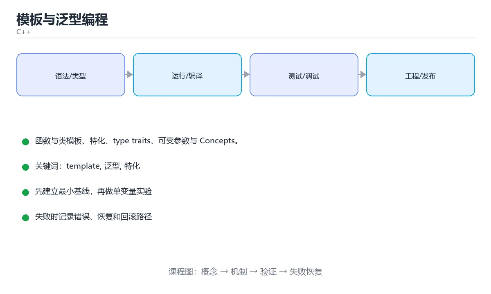

# 模板与泛型编程



> 内容更新时间：2026-10-03 · 学习阶段：进阶 · 预计用时：16 分钟

## 学习目标

- 能用自己的话解释「模板与泛型编程」解决了什么问题，而不是只背术语。
- 能说清 「template」、「泛型」、「特化」、「type_traits」 之间的关系，并分别举出一个例子。
- 能把本课知识放回「C++」的知识体系，说明它和相邻主题的边界。
- 能完成本课练习，并用验收标准检查自己的结果。

> 一句话摘要：函数与类模板、特化、type traits、可变参数与 Concepts。

## 前置知识

- 先完成上一课《类与面向对象》；如果已经掌握，可以直接用本课练习自测。
- 本课阶段：进阶。建议先掌握同一分类的基础课程，并能独立运行正文中的最小示例。
- 开始前先复习：template、泛型、特化。
- 如果某一步看不懂，先记录具体卡点，完成练习后再回头读一遍。


## 函数模板

```cpp
#include <iostream>

template <typename T>
T max_of(T a, T b) {
    return a > b ? a : b;
}

int main() {
    std::cout << max_of(3, 7);          // 推导 T = int
    std::cout << max_of(3.5, 1.2);      // 推导 T = double
    std::cout << max_of<int>(3, 7);     // 显式指定
}
```

模板在编译期为每种类型生成一份代码，因此**零运行时开销**，但也可能让编译变慢、体积变大。

## 类模板

```cpp
template <typename T, std::size_t N>
class Array {
public:
    T& operator[](std::size_t index) { return data_[index]; }
    constexpr std::size_t size() const { return N; }
private:
    T data_[N]{};
};

Array<int, 4> values;
```

## 模板特化与 type traits

```cpp
template <typename T>
struct Printer {
    static void print(const T& value) { std::cout << value; }
};

template <>                                    // 全特化
struct Printer<bool> {
    static void print(bool value) { std::cout << (value ? "true" : "false"); }
};

#include <type_traits>
static_assert(std::is_integral_v<int>);
static_assert(!std::is_integral_v<double>);
```

常见 traits：`is_integral`、`is_same`、`is_base_of`、`enable_if`。它们让模板根据类型属性选择不同实现。

## 可变参数模板与折叠表达式

```cpp
template <typename... Args>
void print_all(const Args&... args) {
    ((std::cout << args << ' '), ...);        // C++17 折叠表达式
}
```

## Concepts（C++20）

用 Concepts 给模板参数加约束，错误信息比 SFINAE 友好得多。

```cpp
#include <concepts>

template <typename T>
concept Addable = requires(T a, T b) {
    { a + b } -> std::convertible_to<T>;
};

template <Addable T>
T add(T a, T b) { return a + b; }
```

## 静态多态与 CRTP

模板实现的是**编译期多态**（静态多态），虚函数是运行期多态。CRTP 让派生类作为模板参数传回基类，实现零开销的接口复用：

```cpp
template <typename Derived>
struct Comparable {
    bool operator!=(const Derived& other) const {
        return !(static_cast<const Derived&>(*this) == other);
    }
};
```

## 模板的编译期错误与调试

| 报错现象 | 原因 | 处理 |
| --- | --- | --- |
| 一屏几十行模板展开错误 | 实例化失败时编译器列出所有候选 | 从**第一行**读起，通常"required from here"指明了调用点 |
| `could not deduce template argument` | 参数类型无法推导 | 显式指定 `<T>` 或补充重载 |
| 链接错误 multiple definition | 模板定义放在 .cpp 中，其他文件看不到 | 定义放头文件或用显式实例化 |
| `static_assert` 失败 | 类型不满足约束 | 读 static_assert 的提示信息，通常是约束写错 |

调试技巧：用 `static_assert(false)` 强制在编译期报错定位实例化点；`if constexpr` 分支只实例化命中的那一支，可用来隔离错误；C++20 的 Concepts 能让错误信息从"模板展开栈"变成一行"T 不满足 Addable"。

## 本课小结
模板是 C++ 泛型编程的核心：**一次编写、多种类型复用、零运行时开销**。代价是编译时间与错误信息复杂度，因此 C++20 之后优先使用 Concepts 做约束。


## 模板语法速查

| 场景 | 写法 |
| --- | --- |
| 函数模板 | `template <typename T> T max(T a, T b);` |
| 类模板 | `template <typename T> class Box { T value; };` |
| 多个参数 | `template <typename K, typename V> class Map;` |
| 非类型参数 | `template <int N> class FixedArray;` |
| 默认参数 | `template <typename T = int> class Vec;` |
| 特化 | `template <> class Box<bool> { ... };` |
| 可变参数 | `template <typename... Args> void log(Args&&... args);` |
| C++20 约束 | `template <std::integral T> T add(T a, T b);` |
| requires 子句 | `template <typename T> requires requires(T t) { t.size(); }` |

```cpp
#include <concepts>
#include <string>
#include <type_traits>

// C++20 concepts：错误信息更清晰，约束写在接口上
template <std::integral T>
T gcd(T a, T b) {
    while (b != 0) {
        T t = a % b;
        a = b;
        b = t;
    }
    return a;
}

// 自定义 concept
template <typename T>
concept Printable = requires(const T& value, std::ostream& os) {
    { os << value } -> std::same_as<std::ostream&>;
};

template <Printable T>
void printAll(const std::vector<T>& items) {
    for (const auto& item : items) std::cout << item << '\n';
}
```

## 编译期技巧速查

| 目的 | 写法 |
| --- | --- |
| 编译期分支 | `if constexpr (std::is_integral_v<T>) { ... }` |
| 类型萃取 | `std::is_same_v<T, int>`、`std::decay_t<T>` |
| 完美转发 | `std::forward<T>(arg)` |
| 折叠表达式 | `(args + ...)` |
| 编译期常量 | `constexpr`、`consteval` |
| 静态断言 | `static_assert(sizeof(T) >= 4, "T 太小");` |
| 可变参数展开 | `(std::cout << ... << args);` |

## 常见错误对照表

| 报错或现象 | 含义 | 处理方式 |
| --- | --- | --- |
| `undefined reference to Foo<int>::bar()` | 模板定义不可见 | 定义放头文件，或显式实例化 |
| 报错信息长达几百行 | 约束失败被层层展开 | 用 C++20 concepts 前置约束 |
| `template <typename T> T add(T a, T b)` 传入 `1, 2.0` | 推导冲突 | 显式指定类型，或让两个参数独立推导 |
| `>>` 写法在旧标准报错 | 与右移混淆 | 现代 C++ 已修复，升级标准即可 |
| 类模板的静态成员未定义 | 链接错误 | 在头文件内定义，或显式实例化 |
| 依赖模板参数的类型名没用 `typename` | 编译错误 | 写成 `typename T::value_type` |
| 模板代码编译变慢、体积变大 | 每个类型实例化一份 | 抽出与类型无关的逻辑到非模板函数 |
| 用模板做运行时多态 | 代码膨胀 | 运行时多态用虚函数，编译期用模板 |
| 特化写错位置 | 编译错误 | 特化必须与主模板在同一命名空间 |

## 自测清单

- [ ] 模板定义与声明都放在头文件里。
- [ ] 会用 concepts 给模板参数加约束。
- [ ] 会用 `if constexpr` 按类型分支。
- [ ] 知道模板实例化会导致代码膨胀，能抽出公共逻辑。
- [ ] 完美转发场景使用 `std::forward`。


## 零基础详解：模板与泛型编程

### 一句话说清它是什么

模板是「让编译器替你生成代码的模具」：
你写一份逻辑，编译器按实际类型生成多份具体实现，所以既通用又快（零运行时开销）。

### 用生活比喻理解

| 概念 | 比喻 | 说明 |
| --- | --- | --- |
| 函数模板 | 可调模具 | 一份逻辑适配多种类型 |
| 类模板 | 通用容器图纸 | `vector<T>`、`map<K,V>` |
| 模板参数 | 模具的尺寸规格 | `T`、`N`、`typename` |
| 特化 | 特殊订单特殊处理 | 对特定类型给不同实现 |
| 概念（concepts） | 模具的使用条件 | 限定 T 必须具备什么能力 |

### 函数模板与类型推导

```cpp
#include <iostream>
#include <string>
#include <vector>

template <typename T>
T maxOf(const T& a, const T& b) {
    return a > b ? a : b;
}

template <typename T>
void printAll(const std::vector<T>& items) {
    for (const auto& item : items) std::cout << item << ' ';
    std::cout << '\n';
}

int main() {
    std::cout << maxOf(3, 7) << '\n';               // T 推导为 int
    std::cout << maxOf(std::string("a"), std::string("b")) << '\n';
    printAll(std::vector{1, 2, 3});                 // C++17 类模板参数推导
}
```

**注意**：模板的定义通常要放在头文件里，因为编译器需要在实例化时看到完整实现。

### 类模板：写一个自己的容器

```cpp
#include <array>
#include <cstddef>

template <typename T, std::size_t N>
class FixedArray {
public:
    constexpr std::size_t size() const { return N; }
    T& operator[](std::size_t i) { return data_[i]; }
    const T& operator[](std::size_t i) const { return data_[i]; }

private:
    T data_[N]{};
};

FixedArray<int, 5> nums;
nums[0] = 1;
```

`std::array` 就是这个思路的工业级实现。

### 可变参数模板与折叠表达式

```cpp
template <typename... Args>
auto sum(Args... args) {
    return (args + ...);            // C++17 折叠表达式，一行搞定
}

std::cout << sum(1, 2, 3, 4);       // 10
std::cout << sum(1.5, 2.5);         // 4
```

### 概念（C++20）：让报错看得懂

```cpp
#include <concepts>

template <typename T>
concept Addable = requires(T a, T b) {
    { a + b } -> std::same_as<T>;
};

template <Addable T>
T addTwice(T a, T b) { return a + b; }
```

传不支持的类型时，报错会明确指出「不满足 Addable」，而不是几百行模板栈。

| 约束写法 | 可读性 | 报错质量 |
| --- | --- | --- |
| 只用 `typename T` | 一般 | 很差 |
| `enable_if` 技巧 | 差 | 差 |
| `std::integral` 等标准概念 | 好 | 好 |
| 自定义 `concept` | 最好 | 最好 |

### 新手最容易踩的八个坑

| 坑 | 现象 | 正确做法 |
| --- | --- | --- |
| 模板定义放 `.cpp` | 链接错误 | 放头文件或显式实例化 |
| 忘写 `typename` | 依赖名解析失败 | 模板内的嵌套类型前加 `typename` |
| 报错几百行 | 找不到真正原因 | 从最上面第一条错误看起 |
| 模板参数推导失败 | 提示没有匹配的函数 | 显式指定类型或加约束 |
| 过度使用模板 | 编译慢、难调试 | 能用普通函数就别模板 |
| 递归模板太深 | 编译期爆栈 | 用折叠表达式或循环 |
| 特化与主模板不一致 | 行为诡异 | 保持接口一致 |
| 头文件里用 `using namespace` | 污染使用方 | 写全限定名 |

### 手把手练习：泛型统计函数

```cpp
#include <concepts>
#include <iostream>
#include <numeric>
#include <vector>

template <typename T>
concept Numeric = std::integral<T> || std::floating_point<T>;

template <Numeric T>
struct Stats {
    T min;
    T max;
    double average;
};

template <Numeric T>
Stats<T> analyze(const std::vector<T>& data) {
    if (data.empty()) throw std::invalid_argument("数据不能为空");

    const auto [lo, hi] = std::minmax_element(data.begin(), data.end());
    const double avg =
        static_cast<double>(std::accumulate(data.begin(), data.end(), T{0})) /
        static_cast<double>(data.size());
    return {*lo, *hi, avg};
}

int main() {
    const auto s = analyze(std::vector{88, 92, 79, 95});
    std::cout << "最小 " << s.min << " 最大 " << s.max
              << " 平均 " << s.average << '\n';
}
```

### 学完自测

- [ ] 能解释模板为什么没有运行时开销。
- [ ] 知道模板定义为什么通常放头文件。
- [ ] 能写出一个带 `concept` 约束的模板函数。
- [ ] 能说出折叠表达式解决什么问题。
- [ ] 知道模板报错时应该从哪一条开始看。

## 动手练习


> 本课练习重点：围绕「template、泛型、特化」完成复述、实验和交付，每个结果都要能被别人检查。

先开启警告编译最小程序，再验证内存与边界，最后用 Sanitizer 跑一遍。

### 练习 1：建立心智模型（10 分钟）

合上教程，用 3～5 句话回答：

1. 「模板与泛型编程」解决了什么问题？
2. 如果没有它，会出现什么具体后果？
3. 它和「泛型」是什么关系？

**验收标准**：至少出现一个本课关键词，并写出一个反例、边界条件或失效场景。

### 练习 2：做一次可控实验（20 分钟）

从正文中选一个最小示例，完成以下操作：

1. 先预测修改一个参数、输入或步骤后的结果。
2. 再实际执行或逐步推演，记录真实结果。
3. 如果结果与预测不同，写出差异原因。

**验收标准**：留下「原例 → 改动 → 预测 → 结果 → 原因」五步记录。

### 练习 3：交付一个小结果（30 分钟）

写一个可独立编译的小程序，开启 `-Wall -Wextra`，确保没有警告。

任务要求：

- 结果必须能被别人检查，不能只写“我已经理解了”。
- 至少覆盖「template」和「泛型」两个关键词。
- 写出 1 个仍然不确定的问题，以及下一步如何验证。

> 提示：时间有限时优先做练习 1 和练习 2；练习 3 可以拆成两次完成。


## 考点精讲：把测验题还原成判断过程

本课有 6 个判断点。先自己作答，再看「判断依据」；如果结论正确但理由不完整，回到正文对应章节补足概念。

### 考点 1：模板的类型推导和实例化发生在什么时候？

- **正确判断**：编译期
- **判断依据**：模板在编译期为每种类型生成代码，因此没有运行时开销，但会增加编译时间与体积。其他选项：模板在编译期实例化，不涉及 JIT。针对「模板的类型推导和实例化发生在什么时候，」，本课在「函数模板」中说明：模板在编译期为每种类型生成一份代码，因此零运行时开销，但也可能让编译变慢、体积变大。本课还在「本课小结」中说明：模板是 C++ 泛型编程的核心：一次编写、多种类型复用、零运行时开销。本课还在「模板的编译期错误与调试」中说明：调试技巧：用 staticassert(false) 强制在编译期报错定位实例化点。
- **迁移检查**：把题干里的一个条件换成边界值，原来的结论还成立吗？写出判断过程。

### 考点 2：C++20 中用于给模板参数加约束的特性是？

- **正确判断**：Concepts
- **判断依据**：Concepts 让模板约束可读、错误信息更友好，替代了大量 SFINAE 技巧。其他选项：Concepts（C++20）为模板参数提供约束与更清晰的报错信息。针对「C++20 中用于给模板参数加约束的特性是，」，本课在「Concepts（C++20）」中说明：用 Concepts 给模板参数加约束，错误信息比 SFINAE 友好得多。本课还在「静态多态与 CRTP」中说明：CRTP 让派生类作为模板参数传回基类，实现零开销的接口复用。
- **迁移检查**：如果给某个错误选项去掉一个限定词，它会不会变成正确？说明理由。

### 考点 3：模板的主要代价是？

- **正确判断**：编译时间变长、代码体积可能变大
- **判断依据**：正确答案是「编译时间变长、代码体积可能变大」，本课在「本课小结」中说明：模板是 C++ 泛型编程的核心：一次编写、多种类型复用、零运行时开销。每个实例化类型都会生成一份代码，属于典型的「用编译期换运行期」。本课还在「本课小结」中说明：代价是编译时间与错误信息复杂度，因此 C++20 之后优先使用 Concepts 做约束。本课还在「函数模板」中说明：模板在编译期为每种类型生成一份代码，因此零运行时开销，但也可能让编译变慢、体积变大。
- **迁移检查**：遮住选项，只根据定义复述一次答案，再回来看哪个选项与复述一致。

### 考点 4：模板的实现通常要写在头文件里的原因是？

- **正确判断**：实例化点必须能看到完整定义才能生成代码
- **判断依据**：正确答案是「实例化点必须能看到完整定义才能生成代码」，本课在「零基础详解：模板与泛型编程」中说明：注意：模板的定义通常要放在头文件里，因为编译器需要在实例化时看到完整实现。也可用显式实例化把定义放进 .cpp，但会限制可用的类型集合。本课还在「模板的编译期错误与调试」中说明：调试技巧：用 staticassert(false) 强制在编译期报错定位实例化点。本课还在「静态多态与 CRTP」中说明：模板实现的是编译期多态（静态多态），虚函数是运行期多态。
- **迁移检查**：如果给某个错误选项去掉一个限定词，它会不会变成正确？说明理由。

### 考点 5：std::vector<int> 在编译过程中属于？

- **正确判断**：由类模板实例化出来的具体类型
- **判断依据**：正确答案是「由类模板实例化出来的具体类型」，本课在「零基础详解：模板与泛型编程」中说明：你写一份逻辑，编译器按实际类型生成多份具体实现，所以既通用又快（零运行时开销）。模板本身不产生代码，实例化才会为具体类型生成一份实现。本课还在「零基础详解：模板与泛型编程」中说明：传不支持的类型时，报错会明确指出「不满足 Addable」，而不是几百行模板栈。本课还在「静态多态与 CRTP」中说明：模板实现的是编译期多态（静态多态），虚函数是运行期多态。
- **迁移检查**：把题干里的一个条件换成边界值，原来的结论还成立吗？写出判断过程。

### 考点 6：补全代码：「模板与泛型编程」示例中，下面这行代码缺少哪个关键字或函数名？请填入 ____。 `____(std::is_integral_v<int>);`

- **正确判断**：static_assert
- **判断依据**：正确答案是「static_assert」，本课在「零基础详解：模板与泛型编程」中说明：能写出一个带 concept 约束的模板函数。本课还在「模板特化与 type traits」中说明：常见 traits：isintegral、issame、isbaseof、enableif。本课还在「零基础详解：模板与泛型编程」中说明：std::array 就是这个思路的工业级实现。
- **迁移检查**：不看题干，用自己的话补全这句话，再与标准答案对照。

## 本课复习清单

离开本课前，逐项确认：

- [ ] 不看解析，能说出「模板的类型推导和实例化发生在什么时候？」的判断依据。
- [ ] 不看解析，能说出「C++20 中用于给模板参数加约束的特性是？」的判断依据。
- [ ] 不看解析，能说出「模板的主要代价是？」的判断依据。
- [ ] 不看解析，能说出「模板的实现通常要写在头文件里的原因是？」的判断依据。
- [ ] 不看解析，能说出「std::vector<int> 在编译过程中属于？」的判断依据。
- [ ] 不看解析，能说出「补全代码：「模板与泛型编程」示例中，下面这行代码缺少哪个关键字或函数名？请填入 …」的判断依据。
- [ ] 至少运行一次本课示例，记录输入、输出和一个边界情况。
- [ ] 把本课最容易混淆的两个概念写成一句话对照。

| 复盘项 | 记录 |
| --- | --- |
| 已经能独立解释的考点 |  |
| 仍然说不清的概念 |  |
| 下一步验证动作 |  |

## English Overview

**Title:** Templates

**Summary:** Function/class templates, specialization, traits and concepts.

**Category:** C++  
**Level:** 进阶  
**Key terms:** template, 泛型, 特化, type_traits, Concepts, CRTP

> The full tutorial is written in Chinese. This bilingual overview helps English readers identify the topic, scope and key terms before studying the detailed examples.

## 内容元数据

- 内容版本：v2.0
- 最后更新：2026-10-03
- 学习阶段：进阶
- 适用环境：C++20 / GCC 13+ 或 Clang 17+
- 内容来源：内置结构化课程与工程实践整理
- 相关主题：template、泛型、特化、type_traits、Concepts、CRTP
- 质量版本：P0 测验标准 + P1 覆盖扩展 + P2 体验补全


## 参考资料与复核

- 最后复核：2026-10-04
- 下次复核：2027-04-04
- 复核范围：版本兼容、API 行为、安全建议与工程实践
- 来源性质：官方文档与标准；本课正文为离线教学重组，不复制原文

| 参考资料 | 本课用途 |
| --- | --- |
| [C++ 标准库参考](https://en.cppreference.com/w/cpp) | 语言、标准库与并发 |
| [ISO C++](https://isocpp.org/) | 标准动态、指南与最佳实践 |

> 本课主题：函数与类模板、特化、type traits、可变参数与 Concepts。

> App 完全离线展示文字链接，不会自动联网；需要延伸阅读时可复制链接到浏览器。

