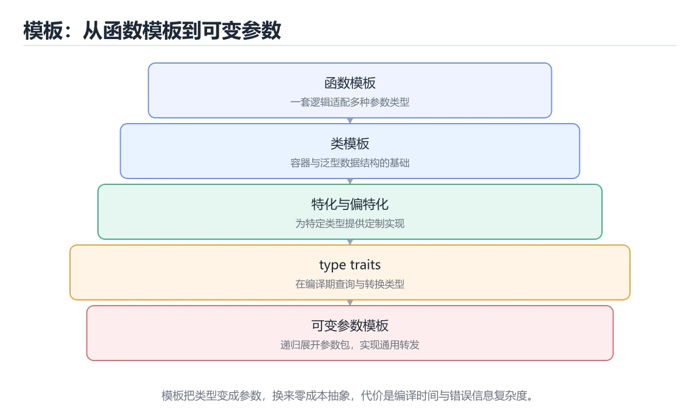

# 模板与泛型编程

> 内容更新时间：2026-10-06 · 学习阶段：进阶 · 预计用时：40 分钟




## 学习目标

- 能用自己的话解释模板与泛型编程解决了什么问题，而不是只背术语。
- 能说清 「template」、「泛型」、「特化」、「type_traits」 之间的关系，并分别举出一个例子。
- 能把 template 放回「模板与泛型编程」的知识体系，说明它和 泛型 的边界。
- 能完成本课练习，并用验收标准检查自己的结果。

> 一句话摘要：函数与类模板、特化、type traits、可变参数与 Concepts。

## 前置知识

- 先完成上一课《类与面向对象》；如果已经掌握，可以直接用本课练习自测。
- 本课阶段：进阶。建议先完成「类与面向对象」，或确认自己能独立跑通正文里的 convertible_to 示例。
- 开始前先复习：template、泛型、特化。
- 如果 函数模板 这一步看不懂，先记录具体卡点，再用 convertible_to 复现一遍。

## 函数模板

```cpp
#include <iostream>

template <typename T>
T max_of(T a, T b) {
    return a > b ? a : b;
}

int main() {
    std::cout << max_of(3, 7);          // 推导 T = int
    std::cout << max_of(3.5, 1.2);      // 推导 T = double
    std::cout << max_of<int>(3, 7);     // 显式指定
}
```

模板在编译期为每种类型生成一份代码，因此**零运行时开销**，但也可能让编译变慢、体积变大。

## 类模板

```cpp
template <typename T, std::size_t N>
class Array {
public:
    T& operator[](std::size_t index) { return data_[index]; }
    constexpr std::size_t size() const { return N; }
private:
    T data_[N]{};
};

Array<int, 4> values;
```

## 模板特化与 type traits

```cpp
template <typename T>
struct Printer {
    static void print(const T& value) { std::cout << value; }
};

template <>                                    // 全特化
struct Printer<bool> {
    static void print(bool value) { std::cout << (value ? "true" : "false"); }
};

#include <type_traits>
static_assert(std::is_integral_v<int>);
static_assert(!std::is_integral_v<double>);
```

常见 traits：`is_integral`、`is_same`、`is_base_of`、`enable_if`。它们让模板根据类型属性选择不同实现。

## 可变参数模板与折叠表达式

```cpp
template <typename... Args>
void print_all(const Args&... args) {
    ((std::cout << args << ' '), ...);        // C++17 折叠表达式
}
```

## Concepts（C++20）

用 Concepts 给模板参数加约束，错误信息比 SFINAE 友好得多。

```cpp
#include <concepts>

template <typename T>
concept Addable = requires(T a, T b) {
    { a + b } -> std::convertible_to<T>;
};

template <Addable T>
T add(T a, T b) { return a + b; }
```

## 静态多态与 CRTP

模板实现的是**编译期多态**（静态多态），虚函数是运行期多态。CRTP 让派生类作为模板参数传回基类，实现零开销的接口复用：

```cpp
template <typename Derived>
struct Comparable {
    bool operator!=(const Derived& other) const {
        return !(static_cast<const Derived&>(*this) == other);
    }
};
```

## 模板的编译期错误与调试

| 报错现象 | 原因 | 处理 |
| --- | --- | --- |
| 一屏几十行模板展开错误 | 实例化失败时编译器列出所有候选 | 从**第一行**读起，通常"required from here"指明了调用点 |
| `could not deduce template argument` | 参数类型无法推导 | 显式指定 `<T>` 或补充重载 |
| 链接错误 multiple definition | 模板定义放在 .cpp 中，其他文件看不到 | 定义放头文件或用显式实例化 |
| `static_assert` 失败 | 类型不满足约束 | 读 static_assert 的提示信息，通常是约束写错 |

调试技巧：用 `static_assert(false)` 强制在编译期报错定位实例化点；`if constexpr` 分支只实例化命中的那一支，可用来隔离错误；C++20 的 Concepts 能让错误信息从"模板展开栈"变成一行"T 不满足 Addable"。

## 本课小结

模板是 C++ 泛型编程的核心：**一次编写、多种类型复用、零运行时开销**。代价是编译时间与错误信息复杂度，因此 C++20 之后优先使用 Concepts 做约束。

## 模板语法速查

| 场景 | 写法 |
| --- | --- |
| 函数模板 | `template <typename T> T max(T a, T b);` |
| 类模板 | `template <typename T> class Box { T value; };` |
| 多个参数 | `template <typename K, typename V> class Map;` |
| 非类型参数 | `template <int N> class FixedArray;` |
| 默认参数 | `template <typename T = int> class Vec;` |
| 特化 | `template <> class Box<bool> { ... };` |
| 可变参数 | `template <typename... Args> void log(Args&&... args);` |
| C++20 约束 | `template <std::integral T> T add(T a, T b);` |
| requires 子句 | `template <typename T> requires requires(T t) { t.size(); }` |

```cpp
#include <concepts>
#include <string>
#include <type_traits>

// C++20 concepts：错误信息更清晰，约束写在接口上
template <std::integral T>
T gcd(T a, T b) {
    while (b != 0) {
        T t = a % b;
        a = b;
        b = t;
    }
    return a;
}

// 自定义 concept
template <typename T>
concept Printable = requires(const T& value, std::ostream& os) {
    { os << value } -> std::same_as<std::ostream&>;
};

template <Printable T>
void printAll(const std::vector<T>& items) {
    for (const auto& item : items) std::cout << item << '\n';
}
```

## 编译期技巧速查

| 目的 | 写法 |
| --- | --- |
| 编译期分支 | `if constexpr (std::is_integral_v<T>) { ... }` |
| 类型萃取 | `std::is_same_v<T, int>`、`std::decay_t<T>` |
| 完美转发 | `std::forward<T>(arg)` |
| 折叠表达式 | `(args + ...)` |
| 编译期常量 | `constexpr`、`consteval` |
| 静态断言 | `static_assert(sizeof(T) >= 4, "T 太小");` |
| 可变参数展开 | `(std::cout << ... << args);` |

## 常见错误与排查

| 报错或现象 | 含义 | 处理方式 |
| --- | --- | --- |
| `undefined reference to Foo<int>::bar()` | 模板定义不可见 | 定义放头文件，或显式实例化 |
| 报错信息长达几百行 | 约束失败被层层展开 | 用 C++20 concepts 前置约束 |
| `template <typename T> T add(T a, T b)` 传入 `1, 2.0` | 推导冲突 | 显式指定类型，或让两个参数独立推导 |
| `>>` 写法在旧标准报错 | 与右移混淆 | 现代 C++ 已修复，升级标准即可 |
| 类模板的静态成员未定义 | 链接错误 | 在头文件内定义，或显式实例化 |
| 依赖模板参数的类型名没用 `typename` | 编译错误 | 写成 `typename T::value_type` |
| 模板代码编译变慢、体积变大 | 每个类型实例化一份 | 抽出与类型无关的逻辑到非模板函数 |
| 用模板做运行时多态 | 代码膨胀 | 运行时多态用虚函数，编译期用模板 |
| 特化写错位置 | 编译错误 | 特化必须与主模板在同一命名空间 |

## 复习与自测

- [ ] 模板定义与声明都放在头文件里。
- [ ] 会用 concepts 给模板参数加约束。
- [ ] 会用 `if constexpr` 按类型分支。
- [ ] 知道模板实例化会导致代码膨胀，能抽出公共逻辑。
- [ ] 完美转发场景使用 `std::forward`。

## 零基础详解：模板与泛型编程

### 一句话说清它是什么

模板是「让编译器替你生成代码的模具」：
你写一份逻辑，编译器按实际类型生成多份具体实现，所以既通用又快（零运行时开销）。

### 用生活比喻理解

| 概念 | 比喻 | 说明 |
| --- | --- | --- |
| 函数模板 | 可调模具 | 一份逻辑适配多种类型 |
| 类模板 | 通用容器图纸 | `vector<T>`、`map<K,V>` |
| 模板参数 | 模具的尺寸规格 | `T`、`N`、`typename` |
| 特化 | 特殊订单特殊处理 | 对特定类型给不同实现 |
| 概念（concepts） | 模具的使用条件 | 限定 T 必须具备什么能力 |

### 函数模板与类型推导

```cpp
#include <iostream>
#include <string>
#include <vector>

template <typename T>
T maxOf(const T& a, const T& b) {
    return a > b ? a : b;
}

template <typename T>
void printAll(const std::vector<T>& items) {
    for (const auto& item : items) std::cout << item << ' ';
    std::cout << '\n';
}

int main() {
    std::cout << maxOf(3, 7) << '\n';               // T 推导为 int
    std::cout << maxOf(std::string("a"), std::string("b")) << '\n';
    printAll(std::vector{1, 2, 3});                 // C++17 类模板参数推导
}
```

**注意**：模板的定义通常要放在头文件里，因为编译器需要在实例化时看到完整实现。

### 类模板：写一个自己的容器

```cpp
#include <array>
#include <cstddef>

template <typename T, std::size_t N>
class FixedArray {
public:
    constexpr std::size_t size() const { return N; }
    T& operator[](std::size_t i) { return data_[i]; }
    const T& operator[](std::size_t i) const { return data_[i]; }

private:
    T data_[N]{};
};

FixedArray<int, 5> nums;
nums[0] = 1;
```

`std::array` 就是这个思路的工业级实现。

### 可变参数模板与折叠表达式

```cpp
template <typename... Args>
auto sum(Args... args) {
    return (args + ...);            // C++17 折叠表达式，一行搞定
}

std::cout << sum(1, 2, 3, 4);       // 10
std::cout << sum(1.5, 2.5);         // 4
```

### 概念（C++20）：让报错看得懂

```cpp
#include <concepts>

template <typename T>
concept Addable = requires(T a, T b) {
    { a + b } -> std::same_as<T>;
};

template <Addable T>
T addTwice(T a, T b) { return a + b; }
```

传不支持的类型时，报错会明确指出「不满足 Addable」，而不是几百行模板栈。

| 约束写法 | 可读性 | 报错质量 |
| --- | --- | --- |
| 只用 `typename T` | 一般 | 很差 |
| `enable_if` 技巧 | 差 | 差 |
| `std::integral` 等标准概念 | 好 | 好 |
| 自定义 `concept` | 最好 | 最好 |

### 新手最容易踩的八个坑

| 坑 | 现象 | 正确做法 |
| --- | --- | --- |
| 模板定义放 `.cpp` | 链接错误 | 放头文件或显式实例化 |
| 忘写 `typename` | 依赖名解析失败 | 模板内的嵌套类型前加 `typename` |
| 报错几百行 | 找不到真正原因 | 从最上面第一条错误看起 |
| 模板参数推导失败 | 提示没有匹配的函数 | 显式指定类型或加约束 |
| 过度使用模板 | 编译慢、难调试 | 能用普通函数就别模板 |
| 递归模板太深 | 编译期爆栈 | 用折叠表达式或循环 |
| 特化与主模板不一致 | 行为诡异 | 保持接口一致 |
| 头文件里用 `using namespace` | 污染使用方 | 写全限定名 |

### 手把手练习：泛型统计函数

```cpp
#include <concepts>
#include <iostream>
#include <numeric>
#include <vector>

template <typename T>
concept Numeric = std::integral<T> || std::floating_point<T>;

template <Numeric T>
struct Stats {
    T min;
    T max;
    double average;
};

template <Numeric T>
Stats<T> analyze(const std::vector<T>& data) {
    if (data.empty()) throw std::invalid_argument("数据不能为空");

    const auto [lo, hi] = std::minmax_element(data.begin(), data.end());
    const double avg =
        static_cast<double>(std::accumulate(data.begin(), data.end(), T{0})) /
        static_cast<double>(data.size());
    return {*lo, *hi, avg};
}

int main() {
    const auto s = analyze(std::vector{88, 92, 79, 95});
    std::cout << "最小 " << s.min << " 最大 " << s.max
              << " 平均 " << s.average << '\n';
}
```

### 学完自测

- [ ] 能解释模板为什么没有运行时开销。
- [ ] 知道模板定义为什么通常放头文件。
- [ ] 能写出一个带 `concept` 约束的模板函数。
- [ ] 能说出折叠表达式解决什么问题。
- [ ] 知道模板报错时应该从哪一条开始看。

## 动手练习

> 本课练习重点：围绕「template、泛型、特化」完成复述、实验和交付，每个结果都要能被别人检查。

先开启警告编译 template 的最小程序，再验证内存与边界，最后用 Sanitizer 复查。

### 练习 1：建立心智模型（10 分钟）

合上教程，用 3～5 句话回答：

1. 模板与泛型编程解决了什么问题？
2. 如果没有它，会出现什么具体后果？
3. 它和「泛型」是什么关系？

验收标准：回答里必须出现 template，并写出一个让结论失效的边界条件。

### 练习 2：做一次可控实验（20 分钟）

从正文中选一个最小示例，完成以下操作：

1. 先预测修改一个参数、输入或步骤后的结果。
2. 再实际执行或逐步推演，记录真实结果。
3. 如果结果与预测不同，写出差异原因。

**验收标准**：围绕「函数模板」小节做一次五步记录，原例取自 convertible_to，改动只允许动一处template，原因要能指回正文的判断依据。

### 练习 3：交付一个小结果（30 分钟）

写一个可独立编译的小程序演示 template，开启 -Wall -Wextra 并确保没有警告。

任务要求：

- 结果必须能被别人检查，不能只写“我已经理解了”。
- 至少覆盖「template」和「泛型」两个关键词。
- 写出 1 个仍然不确定的问题，以及下一步如何验证。

> 提示：时间有限时优先做练习 1 和练习 2；练习 3 可以拆成两次完成。

## 可运行练习

### 任务 1：先跑通，再解释

```cpp
template <typename T>
struct Printer {
    static void print(const T& value) { std::cout << value; }
};

template <>                                    // 全特化
struct Printer<bool> {
    static void print(bool value) { std::cout << (value ? "true" : "false"); }
};

#include <type_traits>
static_assert(std::is_integral_v<int>);
static_assert(!std::is_integral_v<double>);
```

### 任务 2：只改一个条件

把「模板与泛型编程」的最小示例复制一份，只改一个条件再跑一次：

- 改动点：把 泛型 换成边界值，其他输入保持原样。
- 预测：先写下「模板与泛型编程」在改动后的输出或错误信息，再运行。
- 记录：对照改动前后的结果，指出差异出在哪一步。
- 验收：换回原条件能复现原结果，改动只影响template。

### 任务 3：迁移到自己的数据

用同一套思路处理一组你自己的 template 数据，保持输出格式与任务 1 一致。

## 故障现场

### 现场 1：undefined reference to Foo<int>::bar()

**症状**：在《模板与泛型编程》的复现场景中，模板定义不可见。

**根因**：“模板定义不可见”只是表层结果。向上追溯会落到“undefined reference to Foo<int>::bar()”这一步，因为它省略了《模板与泛型编程》的约束，使实现行为和预期模型发生了偏离。

**修复**：针对《模板与泛型编程》的问题，定义放头文件，或显式实例化。

**验证**：保留《模板与泛型编程》里触发“模板定义不可见”的输入、版本和日志，按“定义放头文件，或显式实例化”完成修改后原样重放；只有失败现象消失且相邻场景仍可解释，才保留改动。

### 现场 2：报错信息长达几百行

**症状**：在《模板与泛型编程》的复现场景中，约束失败被层层展开。

**根因**：触发点是把“报错信息长达几百行”当成安全做法。它没有满足《模板与泛型编程》要求的前提，因此先表现为“约束失败被层层展开”；排查时先完整复现这一段，再核对输入、配置与依赖。

**修复**：针对《模板与泛型编程》的问题，用 C++20 concepts 前置约束。

**验证**：先在《模板与泛型编程》中记录“报错信息长达几百行”留下的失败证据，再执行“用 C++20 concepts 前置约束”并重放；确认错误路径变为明确结果，且修复没有掩盖同类故障。

### 现场 3：模板代码编译变慢、体积变大

**症状**：在《模板与泛型编程》的复现场景中，每个类型实例化一份。

**根因**：“每个类型实例化一份”只是表层结果。向上追溯会落到“模板代码编译变慢、体积变大”这一步，因为它省略了《模板与泛型编程》的约束，使实现行为和预期模型发生了偏离。

**修复**：针对《模板与泛型编程》的问题，抽出与类型无关的逻辑到非模板函数。

**验证**：在《模板与泛型编程》中按“抽出与类型无关的逻辑到非模板函数”调整后，从“模板代码编译变慢、体积变大”的触发条件重放同一条路径，确认“每个类型实例化一份”不再出现，并补一个相邻边界用例检查没有引入新问题。

## 版本与时效

- convertible_to 用到的语言特性要对照编译器支持矩阵，再决定采用哪一版标准。
- 升级「模板与泛型编程」涉及的依赖前，先用 convertible_to 复现当前行为，再逐项核对版本说明与破坏性变更。

### 升级检查清单

- 先固定当前版本，跑通全部示例与测验，再升级工具链。
- 一次只改一个版本条件，把 template 相关的差异单独记成一条结论。
- 先回归 template 与 泛型 的默认行为和错误信息，再扩大测试范围。
- 升级完成后记录 template 的新旧版本差异，并据此调整下次复核时间。

## 本课复习清单

离开本课前，逐项确认：

- [ ] 不看解析，能说出「模板的类型推导和实例化发生在什么时候？」的判断依据。
- [ ] 不看解析，能说出「C++20 中用于给模板参数加约束的特性是？」的判断依据。
- [ ] 不看解析，能说出「模板的主要代价是？」的判断依据。
- [ ] 不看解析，能说出「模板的实现通常要写在头文件里的原因是？」的判断依据。
- [ ] 不看解析，能说出「std::vector<int> 在编译过程中属于？」的判断依据。
- [ ] 至少运行一次 convertible_to 的示例，记录输入、输出和 template 的边界情况。
- [ ] 把本课最容易混淆的两个概念写成一句话对照。

| 复盘项 | 记录 |
| --- | --- |
| 已经能独立解释的考点 |  |
| 仍然说不清的概念 |  |
| 下一步验证动作 |  |

## 术语速查

把「模板与泛型编程」里反复出现的术语集中放在一起。复习时先遮住右列，尝试用自己的话解释，再回到正文核对。

| 术语 | 一句话说明 |
| --- | --- |
| `template` | C++ 声明模板的关键字，让函数或类按类型和值参数生成具体版本。 |
| `泛型` | 把类型作为参数复用同一套逻辑，同时让编译器保留类型检查。 |
| `特化` | 为特定类型或模板参数提供更高效或更合适的实现。 |
| `type_traits` | C++ 标准库头文件，用模板在编译期查询和变换类型属性。 |
| `Concepts` | C++20 的编译期约束：用命名要求限定模板参数，让报错指向真正不满足的条件。 |
| `CRTP` | CRTP 让派生类作为模板参数传回基类，实现零开销的接口复用。 |

## 考点精讲

### 考点 1：多选辨析·template

- **题目**：围绕“模板与泛型编程”中的 template、泛型、特化，下列哪两项是本课强调的实践判断？
- **判断依据**：本课把模板与泛型编程拆成概念、示例与故障现场三部分，因此判断 template 时必须同时交代输入、输出和失败路径，这使“学习 template 时要同时说明输入、输出和失败路径，不能只看正常流程”成立。在模板与泛型编程里，判断 泛型 时要固定版本与边界输入，所以“验证 泛型 时要固定版本并覆盖边界输入，结论才可复现”才可复现。

### 考点 2：概念判断·template

- **题目**：C++20 中用于给模板参数加约束的特性是？
- **判断依据**：在「模板与泛型编程」里，Concepts 让模板约束可读、错误信息更友好，替代了大量 SFINAE 技巧。在「模板与泛型编程」里，其他选项：Concepts（C++20）为模板参数提供约束与更清晰的报错信息。「模板与泛型编程」要求先交代template、泛型、特化的前提再下结论，所以“Concepts”只在题干“C++20 中用于给模板参数加约束的特性是”给定的条件下成立。

### 考点 3：概念判断·template

- **题目**：模板的主要代价是？
- **判断依据**：在「模板与泛型编程」里，编译时间变长、代码体积可能变大。每个实例化类型都会生成一份代码，属于典型的「用编译期换运行期」。「模板与泛型编程」要求先交代template、泛型、特化的前提再下结论，所以“编译时间变长、代码体积可能变大”只在题干“模板的主要代价是”给定的条件下成立。把“编译时间变长、代码体积可能变大”代回「模板与泛型编程」里“模板的主要代价是”的例子核对，条件一旦改变，结论就要用template、泛型、特化重新推导。

### 考点 4：代码补全·template

- **题目**：这段 C++ 代码是「模板与泛型编程」的示例片段，下面哪一项描述与它一致？
- **判断依据**：在「模板与泛型编程」里，题干的正确项是这段代码会产生可观察的输出，运行后能看到结果，在「模板与泛型编程」里要结合template核对输出是否符合预期。把输入或边界换成空值、极值或失败情况后，结论要以「模板与泛型编程」的实际运行结果为准。这道题的关键在「模板与泛型编程」的template、泛型、特化：先确认题干“这段 C++ 代码是模板与泛型编程的”问的是哪一步，再排除偷换前提的选项。

### 考点 5：概念判断·template

- **题目**：std::vector<int> 在编译过程中属于？
- **判断依据**：在「模板与泛型编程」里，由类模板实例化出来的具体类型。模板本身不产生代码，实例化才会为具体类型生成一份实现。「模板与泛型编程」要求先交代template、泛型、特化的前提再下结论，所以“由类模板实例化出来的具体类型”只在题干“vector<int”给定的条件下成立。把“由类模板实例化出来的具体类型”代回「模板与泛型编程」里“vector<int”的例子核对，条件一旦改变，结论就要用template、泛型、特化重新推导。

### 考点 6：填空·template

- **题目**：补全代码：「模板与泛型编程」示例中，下面这行代码缺少哪个关键字或函数名？请填入 ____。 `____(std::is_integral_v<int>);`
- **判断依据**：空格应填写「static_assert」。这道题的关键在「模板与泛型编程」的template、泛型、特化：先确认题干“补全代码”问的是哪一步，再排除偷换前提的选项。回到template、泛型、特化本身再看一遍：只有“staticassert”与题干“staticassert”的前提一致，结论才成立。

## English Overview

**Title:** Templates

**Summary:** Function/class templates, specialization, traits and concepts.

**Category:** C++
**Level:** 进阶
**Key terms:** template, 泛型, 特化, type_traits, Concepts, CRTP

## 内容元数据

- 内容版本：v2.0
- 最后更新：2026-10-06
- 学习阶段：进阶
- 适用环境：C++20 / GCC 13+ 或 Clang 17+；本课聚焦 template。
- 内容来源：内置结构化课程与工程实践整理
- 相关主题：template、泛型、特化、type_traits、Concepts、CRTP
- 质量版本：P0 测验标准 + P1 覆盖扩展 + P2 体验补全

## 参考资料与复核

- 最后复核：2026-10-04
- 下次复核：2027-05-24
- 复核范围：版本兼容、API 行为、安全建议与工程实践
- 来源性质：官方文档、标准或权威教材；正文为离线教学重组

| 参考资料 | 本课用途 |
| --- | --- |
| [C++ 模板](https://en.cppreference.com/w/cpp/language/templates) | 模板、推导与泛型编程 |
| [cppreference C++ 语言](https://en.cppreference.com/w/cpp/language) | C++ 语言规则与语义 |
| [C++ 标准委员会](https://isocpp.org/) | 标准演进与提案动态 |

> 「模板与泛型编程」的链接用于离线阅读后的延伸核对；App 不会自动联网。
