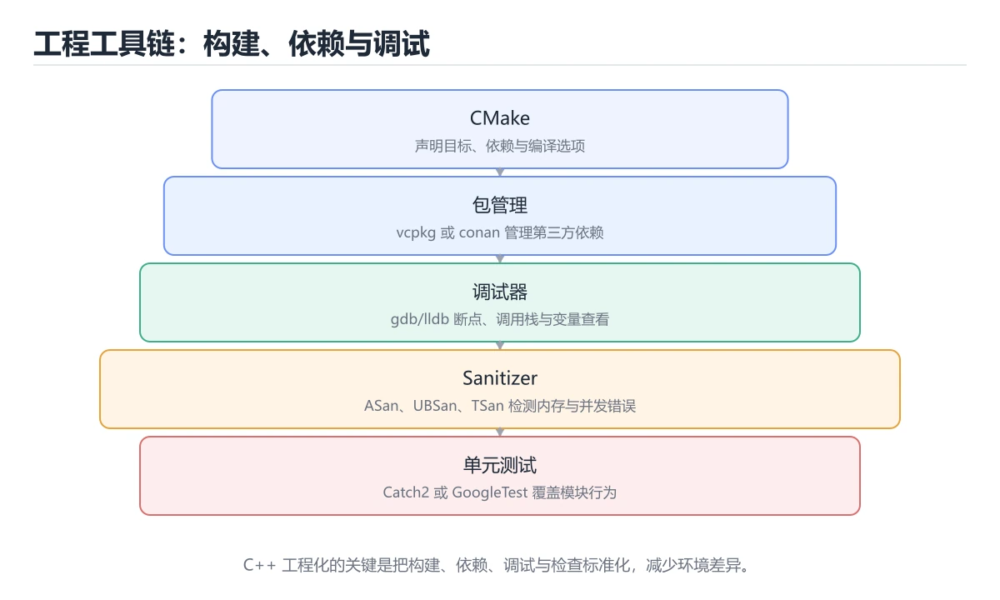
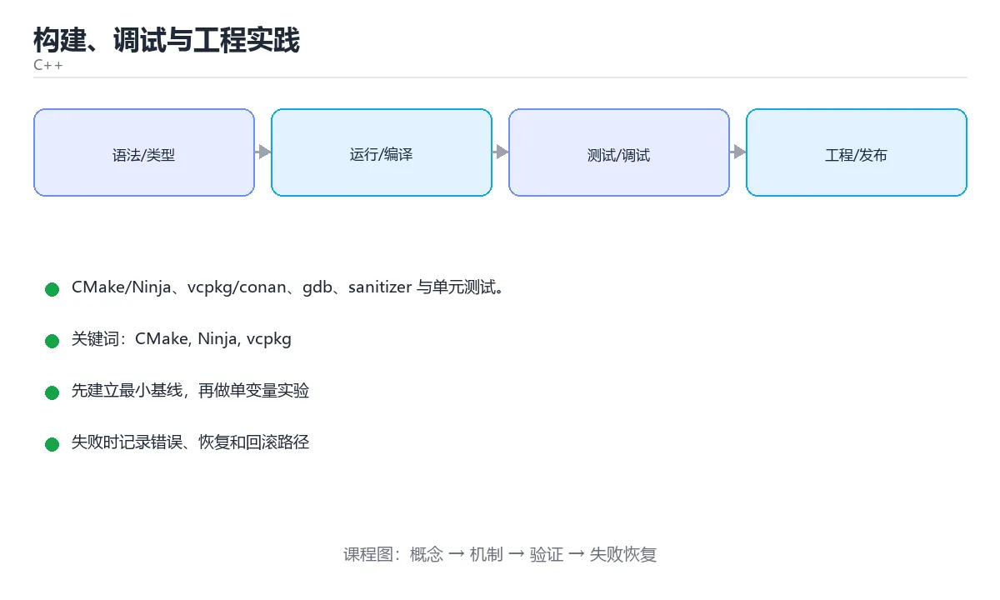

# 构建、调试与工程实践





> 内容更新时间：2026-10-03 · 学习阶段：进阶 · 预计用时：16 分钟

## 学习目标

- 能用自己的话解释「构建、调试与工程实践」解决了什么问题，而不是只背术语。
- 能说清 「CMake」、「Ninja」、「vcpkg」、「gdb」 之间的关系，并分别举出一个例子。
- 能把本课知识放回「C++」的知识体系，说明它和相邻主题的边界。
- 能完成本课练习，并用验收标准检查自己的结果。

> 一句话摘要：CMake/Ninja、vcpkg/conan、gdb、sanitizer 与单元测试。

## 前置知识

- 先完成上一课《现代 C++ 特性》；如果已经掌握，可以直接用本课练习自测。
- 本课阶段：进阶。建议先掌握同一分类的基础课程，并能独立运行正文中的最小示例。
- 开始前先复习：CMake、Ninja、vcpkg。
- 如果某一步看不懂，先记录具体卡点，完成练习后再回头读一遍。


## 编译与构建系统

多文件项目不适合手写 g++ 命令，需要构建系统：

```cmake
# CMakeLists.txt
cmake_minimum_required(VERSION 3.20)
project(code_learn LANGUAGES CXX)

set(CMAKE_CXX_STANDARD 20)
set(CMAKE_CXX_STANDARD_REQUIRED ON)

add_executable(app src/main.cpp src/math_utils.cpp)
target_include_directories(app PRIVATE include)
target_compile_options(app PRIVATE -Wall -Wextra)

find_package(fmt CONFIG REQUIRED)
target_link_libraries(app PRIVATE fmt::fmt)
```

```bash
cmake -S . -B build -G Ninja -DCMAKE_BUILD_TYPE=Release
cmake --build build -j
```

常用工具对比：

| 工具 | 定位 |
| --- | --- |
| Make | 经典构建工具，手写规则繁琐 |
| CMake | 跨平台构建生成器，事实标准 |
| Ninja | 快速执行器，常与 CMake 搭配 |
| Bazel | 大型多语言仓库 |

## 包管理

```bash
vcpkg install fmt spdlog            # 微软生态常用
conan install . --build=missing     # 另一种主流方案
```

团队中应固定依赖版本（`vcpkg.json` / `conanfile.txt`），避免「我这儿能编译」。

## 调试

```bash
g++ -g -O0 main.cpp -o main
gdb ./main
```

常用命令：`break main`、`run`、`next`、`step`、`print var`、`bt`（调用栈）。

崩溃时先看调用栈；段错误优先怀疑空指针、越界、悬垂指针、栈溢出。

## 动态分析工具

```bash
g++ -fsanitize=address,undefined -g main.cpp -o main    # AddressSanitizer + UBSan
g++ -fsanitize=thread -g main.cpp -o main               # ThreadSanitizer
valgrind --leak-check=full ./main
```

建议在 CI 中始终跑一遍 sanitizer 构建，很多内存与并发问题只有它能发现。

## 测试与静态检查

```cpp
// 使用 Catch2 的示例
#define CATCH_CONFIG_MAIN
#include <catch2/catch.hpp>

int add(int a, int b) { return a + b; }

TEST_CASE("add works") {
    REQUIRE(add(2, 3) == 5);
}
```

静态分析：`clang-tidy`、`cppcheck`、编译器警告全开（`-Wall -Wextra -Wpedantic`）。

## 本课小结
工程化的关键是可复现：**CMake 统一构建、包管理器锁定依赖、sanitizer + 单测守住质量、clang-tidy 统一风格**。


## 编译器与告警速查

| 选项 | 作用 |
| --- | --- |
| `-std=c++20` | 指定语言标准 |
| `-Wall -Wextra` | 打开常用告警 |
| `-Werror` | 告警视为错误（CI 推荐） |
| `-g` | 生成调试信息 |
| `-O0` / `-O2` / `-O3` | 优化级别 |
| `-fsanitize=address` | 内存错误检测 |
| `-fsanitize=undefined` | 未定义行为检测 |
| `-fno-omit-frame-pointer` | 保留栈帧，便于性能分析 |
| `-pthread` | 启用线程支持 |
| `-I path` | 头文件搜索路径 |
| `-L path` / `-lname` | 库路径与库名 |

## 调试与诊断速查

| 目的 | 工具 / 命令 |
| --- | --- |
| 断点调试 | `gdb ./app`，`break file:line`、`run`、`bt`、`print var` |
| 查看崩溃栈 | `gdb -batch -ex run -ex bt ./app` |
| 查看 core dump | `coredumpctl gdb` 或 `gdb ./app core` |
| 反汇编 | `objdump -d -M intel app` |
| 查看符号 | `nm -C app` |
| 查看动态依赖 | `ldd app` |
| 静态检查 | `clang-tidy src/*.cpp -- -std=c++20` |
| 格式化 | `clang-format -i src/*.cpp` |
| 内存泄漏 | `valgrind --leak-check=full ./app` |
| 性能剖析 | `perf record ./app` + `perf report` |

```bash
# 推荐的开发期编译命令
g++ -std=c++20 -Wall -Wextra -Werror -g -O0 \
    -fsanitize=address,undefined \
    src/main.cpp src/util.cpp -o build/app

# 发布构建
g++ -std=c++20 -O2 -DNDEBUG src/*.cpp -o build/app
```

## CMake 速查

| 指令 | 作用 |
| --- | --- |
| `cmake_minimum_required(VERSION 3.20)` | 声明最低版本 |
| `project(app LANGUAGES CXX)` | 定义项目 |
| `add_executable(app src/main.cpp)` | 生成可执行目标 |
| `add_library(util STATIC src/util.cpp)` | 生成静态库 |
| `target_link_libraries(app PRIVATE util)` | 链接库 |
| `target_include_directories(app PRIVATE include)` | 头文件目录 |
| `target_compile_features(app PRIVATE cxx_std_20)` | 要求 C++20 |
| `target_compile_options(app PRIVATE -Wall -Wextra)` | 编译选项 |
| `set(CMAKE_BUILD_TYPE Release)` | 构建类型 |
| `enable_testing()` + `add_test(...)` | 注册测试 |
| `find_package(fmt REQUIRED)` | 查找依赖 |

常用命令：

| 目的 | 命令 |
| --- | --- |
| 配置（生成构建文件） | `cmake -S . -B build -DCMAKE_BUILD_TYPE=Release` |
| 构建 | `cmake --build build -j` |
| 运行测试 | `ctest --test-dir build --output-on-failure` |
| 安装 | `cmake --install build --prefix dist` |
| 清理 | `rm -rf build` |

## 常见错误对照表

| 现象 | 原因 | 处理方式 |
| --- | --- | --- |
| 编译通过但运行时崩溃 | 未定义行为 | 开启 ASan/UBSan 重新运行 |
| `undefined reference` | 缺源文件或库顺序不对 | 补文件；被依赖的库放在后面 |
| 改了代码但行为没变 | 构建缓存或没重新编译 | 清理 `build/` 重新配置 |
| 本地能编过、CI 失败 | 编译器或标准版本不同 | 固定工具链版本与 `-std` |
| 告警被忽略 | 潜在 bug 被掩盖 | CI 用 `-Werror` |
| 头文件改了却只有部分文件重编 | 依赖关系缺失 | 用 CMake 的 `target_include_directories` 正确声明 |
| `Debug` 版本性能极差 | 未开优化 | 性能测试用 `Release` |
| 静态库与动态库混用混乱 | 链接行为不一致 | 明确 `STATIC` / `SHARED` 并在文档里说明 |
| 直接把所有源文件写死在构建脚本 | 维护困难 | 用 CMake 目标管理 |

## 自测清单

- [ ] 开发期开启 `-Wall -Wextra -Werror -g` 与 sanitizer。
- [ ] 会用 gdb 看栈与变量，会读 core dump。
- [ ] CMake 用 target 系列指令而非全局变量。
- [ ] ctest 已接入 CI 并覆盖核心用例。
- [ ] clang-format 与 clang-tidy 纳入流水线。


## 零基础详解：C++ 工具链全景

### 一句话说清它是什么

C++ 没有「官方全家桶」，工具链由几件独立工具拼成：
**编译器、构建系统、包管理、格式化、静态分析、调试器、Sanitizer**。

### 用生活比喻理解

| 工具 | 比喻 | 作用 |
| --- | --- | --- |
| 编译器 | 翻译官 | 把源码变成机器码 |
| CMake | 施工图 | 描述怎么编译与链接 |
| vcpkg / Conan | 进货渠道 | 管理第三方依赖 |
| clang-format | 排版员 | 统一代码格式 |
| clang-tidy | 审查员 | 静态发现坏味道 |
| gdb / lldb | 现场勘查 | 断点调试 |
| Sanitizer | 安检仪 | 运行时发现越界与竞争 |

### 三个主流编译器怎么选

| 编译器 | 平台 | 特点 |
| --- | --- | --- |
| GCC | Linux 通用 | 兼容性最好，报错偏保守 |
| Clang | 跨平台 | 报错友好，工具链完整 |
| MSVC | Windows | 与 Visual Studio 集成最好 |

**建议**：本地用 Clang 开发（报错清晰），CI 上三个都跑一遍（发现可移植性问题）。

```bash
# 查看编译器与标准支持
g++ --version
clang++ --version
echo | clang++ -std=c++20 -x c++ - -fsyntax-only && echo "支持 C++20"
```

### CMake：最通用的构建系统

```cmake
cmake_minimum_required(VERSION 3.24)
project(demo VERSION 0.1.0 LANGUAGES CXX)

set(CMAKE_CXX_STANDARD 20)
set(CMAKE_CXX_STANDARD_REQUIRED ON)
set(CMAKE_EXPORT_COMPILE_COMMANDS ON)      # 生成编译数据库，供 clangd 使用

add_library(core src/core.cpp)
target_include_directories(core PUBLIC include)

add_executable(app src/main.cpp)
target_link_libraries(app PRIVATE core)

# 现代写法：按目标设置属性
target_compile_options(core PRIVATE
    $<$<CXX_COMPILER_ID:GNU,Clang>:-Wall -Wextra -Wpedantic>)
```

```bash
cmake -S . -B build -G Ninja -DCMAKE_BUILD_TYPE=Release
cmake --build build -j
ctest --test-dir build --output-on-failure
```

### 依赖管理：三种方式

| 方式 | 适合 | 优缺点 |
| --- | --- | --- |
| `FetchContent` | 少量依赖、小项目 | 简单直接，但每次都要下载 |
| vcpkg 清单模式 | 中大型项目 | 版本集中声明，跨平台好 |
| Conan | 复杂依赖与二进制包 | 功能强，学习成本高 |

```json
// vcpkg.json
{
  "name": "demo",
  "version": "0.1.0",
  "dependencies": ["fmt", "spdlog", "catch2"]
}
```

```bash
vcpkg install
cmake -S . -B build -DCMAKE_TOOLCHAIN_FILE=$VCPKG_ROOT/scripts/buildsystems/vcpkg.cmake
```

### 格式化与静态分析

```bash
# 统一格式（团队必须提交 .clang-format）
clang-format -i src/*.cpp include/**/*.hpp
clang-format --dry-run --Werror src/*.cpp      # CI 里检查

# 静态分析（需要 compile_commands.json）
clang-tidy -p build src/core.cpp
cppcheck --enable=warning,performance --std=c++20 src

# 编译数据库供编辑器使用
ln -s build/compile_commands.json compile_commands.json
```

### 调试：三种手段配合用

| 手段 | 何时用 | 说明 |
| --- | --- | --- |
| 日志 | 生产与长时间运行 | 结构化输出，能开关 |
| 断点调试 | 本地复现 | gdb 或 IDE，看变量与调用栈 |
| Sanitizer | 崩溃与内存问题 | 越界、泄漏、竞争 |

```bash
# 带调试符号编译，才能看到变量与行号
cmake -S . -B build/debug -DCMAKE_BUILD_TYPE=Debug

# gdb 常用命令
gdb ./build/debug/app
(gdb) break main
(gdb) run
(gdb) bt          # 调用栈
(gdb) print x     # 查看变量
(gdb) continue
```

### 性能工具

```bash
perf record -g ./app && perf report      # Linux 采样分析
valgrind --leak-check=full ./app         # 内存泄漏（较慢）
hyperfine './app --mode fast' './app --mode slow'   # 基准对比
```

### 新手最容易踩的八个坑

| 坑 | 现象 | 正确做法 |
| --- | --- | --- |
| Debug 与 Release 行为不同 | 只在 Release 崩溃 | 两种配置都测 |
| 忘了 `-g` | 调试看不到变量 | Debug 配置加调试符号 |
| 手工敲编译命令 | 参数不一致 | 全部走 CMake |
| 依赖版本不固定 | 今天能编明天不行 | 固定 tag 或用清单 |
| 不提交 `.clang-format` | 格式各写一套 | 提交配置文件 |
| 只在 GCC 上测 | Clang 或 MSVC 编不过 | CI 跑三种编译器 |
| 忽略警告 | 隐患积累 | `-Wall -Wextra` 并逐步收敛 |
| 不用 compile_commands | 编辑器补全不准 | 开启 `CMAKE_EXPORT_COMPILE_COMMANDS` |

### 学完自测

- [ ] 能说出 GCC、Clang、MSVC 各自的特点。
- [ ] 知道 `CMAKE_EXPORT_COMPILE_COMMANDS` 有什么用处。
- [ ] 能说出三种依赖管理方式的取舍。
- [ ] 知道 Debug 与 Release 都要测的原因。
- [ ] 能说出 clang-format、clang-tidy、Sanitizer 各自的作用。

## 动手练习


> 本课练习重点：围绕「CMake、Ninja、vcpkg」完成复述、实验和交付，每个结果都要能被别人检查。

先开启警告编译最小程序，再验证内存与边界，最后用 Sanitizer 跑一遍。

### 练习 1：建立心智模型（10 分钟）

合上教程，用 3～5 句话回答：

1. 「构建、调试与工程实践」解决了什么问题？
2. 如果没有它，会出现什么具体后果？
3. 它和「Ninja」是什么关系？

**验收标准**：至少出现一个本课关键词，并写出一个反例、边界条件或失效场景。

### 练习 2：做一次可控实验（20 分钟）

从正文中选一个最小示例，完成以下操作：

1. 先预测修改一个参数、输入或步骤后的结果。
2. 再实际执行或逐步推演，记录真实结果。
3. 如果结果与预测不同，写出差异原因。

**验收标准**：留下「原例 → 改动 → 预测 → 结果 → 原因」五步记录。

### 练习 3：交付一个小结果（30 分钟）

写一个可独立编译的小程序，开启 `-Wall -Wextra`，确保没有警告。

任务要求：

- 结果必须能被别人检查，不能只写“我已经理解了”。
- 至少覆盖「CMake」和「Ninja」两个关键词。
- 写出 1 个仍然不确定的问题，以及下一步如何验证。

> 提示：时间有限时优先做练习 1 和练习 2；练习 3 可以拆成两次完成。


## 可运行练习

下面 3 个任务围绕“构建、调试与工程实践”展开，代码可以直接粘贴到 App 的离线沙箱里运行；如果示例会读取标准输入，请按代码注释在沙箱的 stdin 区域填入同样格式的数据。

### 任务 1：先跑通，再解释

```bash
# 查看编译器与标准支持
g++ --version
clang++ --version
echo | clang++ -std=c++20 -x c++ - -fsyntax-only && echo "支持 C++20"
```

**预期输出**：支持 C++20

**验收标准**：代码能正常运行；逐行解释每个变量的值如何变化，并指出哪一行决定了最终结果。

### 任务 2：只改一个条件

复制上面的代码，只修改一个输入、边界或参数（例如空值、最大值、循环次数、过滤条件），先写出你的预测，再实际运行。

**验收标准**：留下“原结果 → 改动 → 预测 → 实际结果 → 差异原因”五步记录；如果预测错误，要写出修正后的心智模型。

### 任务 3：迁移到自己的数据

用同一套思路处理一组你自己的数据或场景，保持输出格式与任务 1 一致。

**验收标准**：代码不少于 10 行，至少包含 1 个边界检查；把代码和运行结果保存到笔记或片段库。


## 故障现场

这一节把“构建、调试与工程实践”最常见的失败方式还原成现场记录，练习时按“症状 → 复现 → 定位 → 修复 → 预防”的顺序排查。

### 现场 1：“构建、调试与工程实践”的 CMake 常规用例通过，但边界用例失败

**症状**：在“构建、调试与工程实践”的练习或生产场景里出现““构建、调试与工程实践”的 CMake 常规用例通过，但边界用例失败”。

**复现**：准备一组最小输入，只保留触发““构建、调试与工程实践”的 CMake 常规用例通过，但边界用例失败”的必要条件，连续运行两次确认结果稳定。

**定位**：围绕“CMake 的前置条件与取值边界没有写进代码，默认值掩盖了空值和极值”检查调用链、输入数据和环境配置，先验证假设再改代码。

**修复**：为“构建、调试与工程实践”补一条空值或极值用例，把前置条件写成断言，并让失败信息直接指出是哪个输入越界

**预防**：把““构建、调试与工程实践”的 CMake 常规用例通过，但边界用例失败”写成一条自动化用例，并在“构建、调试与工程实践”的验收清单里保留对应检查项。


### 现场 2：“构建、调试与工程实践”的 Ninja 结果在两次运行之间不一致

**症状**：在“构建、调试与工程实践”的练习或生产场景里出现““构建、调试与工程实践”的 Ninja 结果在两次运行之间不一致”。

**复现**：准备一组最小输入，只保留触发““构建、调试与工程实践”的 Ninja 结果在两次运行之间不一致”的必要条件，连续运行两次确认结果稳定。

**定位**：围绕“Ninja 依赖了当前版本、执行顺序或共享状态，单次运行无法暴露差异”检查调用链、输入数据和环境配置，先验证假设再改代码。

**修复**：固定“构建、调试与工程实践”使用的版本与随机种子，记录两次运行的完整输入和输出，再逐项消除非确定性来源

**预防**：把““构建、调试与工程实践”的 Ninja 结果在两次运行之间不一致”写成一条自动化用例，并在“构建、调试与工程实践”的验收清单里保留对应检查项。


### 现场 3：“构建、调试与工程实践”的验证只在开发机通过

**症状**：在“构建、调试与工程实践”的练习或生产场景里出现““构建、调试与工程实践”的验证只在开发机通过”。

**复现**：准备一组最小输入，只保留触发““构建、调试与工程实践”的验证只在开发机通过”的必要条件，连续运行两次确认结果稳定。

**定位**：围绕“环境版本、配置和输入规模与目标环境不同，CMake 缺少可重复的验证记录”检查调用链、输入数据和环境配置，先验证假设再改代码。

**修复**：把“构建、调试与工程实践”的运行环境、输入样本和预期输出写成清单，并在另一套环境复跑同一条命令

**预防**：把““构建、调试与工程实践”的验证只在开发机通过”写成一条自动化用例，并在“构建、调试与工程实践”的验收清单里保留对应检查项。


## 版本与时效

这一节记录“构建、调试与工程实践”涉及的版本基线与升级检查点，避免把某个版本的默认行为当成永久结论。

- C++23 已在主流工具链落地，C++26 进入定稿阶段
- 模块、协程、ranges、std::expected 与 constexpr 能力持续增强
- 升级前先统一编译器与标准库版本，再逐模块打开新标准
- 编译器支持：https://en.cppreference.com/w/cpp/compiler_support

### 升级检查清单

- 先固定当前版本，跑通全部示例与测验，再升级工具链。
- 只改一个版本变量，记录编译、测试、性能与产物体积的变化。
- 重点回归默认值、弃用警告、序列化格式、并发语义和错误信息。
- 升级完成后更新本课的“最后复核 / 下次复核”日期与版本说明。


## 考点精讲：把测验题还原成判断过程

本课有 6 个判断点。先自己作答，再看「判断依据」；如果结论正确但理由不完整，回到正文对应章节补足概念。

### 考点 1：CMake 的定位是？

- **正确判断**：跨平台的构建系统生成器
- **判断依据**：正确答案是「跨平台的构建系统生成器」，本课在「零基础详解：C++ 工具链全景」中说明：编译器、构建系统、包管理、格式化、静态分析、调试器、Sanitizer。CMake 生成 Makefile 或 Ninja 等构建文件，再调用编译器完成构建。本课还在「本课小结」中说明：工程化的关键是可复现：CMake 统一构建、包管理器锁定依赖、sanitizer + 单测守住质量、clang-tidy 统一风格。
- **迁移检查**：如果给某个错误选项去掉一个限定词，它会不会变成正确？说明理由。

### 考点 2：AddressSanitizer 能发现哪类问题？

- **正确判断**：越界访问
- **判断依据**：正确答案是「越界访问」，本课在「动态分析工具」中说明：建议在 CI 中始终跑一遍 sanitizer 构建，很多内存与并发问题只有它能发现。ASan 在运行时检测内存错误，配合 -g 能直接给出出错代码位置。本课还在「包管理」中说明：团队中应固定依赖版本（vcpkg.json / conanfile.txt），避免「我这儿能编译」。本课还在「测试与静态检查」中说明：静态分析：clang-tidy、cppcheck、编译器警告全开（-Wall -Wextra -Wpedantic）。
- **迁移检查**：把题干里的一个条件换成边界值，原来的结论还成立吗？写出判断过程。

### 考点 3：用 gdb 调试时，编译需要加哪个选项？

- **正确判断**：-g
- **判断依据**：-g 生成调试符号，调试构建通常同时使用 -O0 -g。其他选项：-g 生成调试信息，gdb 才能显示源码行号。针对「用 gdb 调试时，编译需要加哪个选项，」，本课在「本课小结」中说明：工程化的关键是可复现：CMake 统一构建、包管理器锁定依赖、sanitizer + 单测守住质量、clang-tidy 统一风格。本课还在「编译与构建系统」中说明：多文件项目不适合手写 g++ 命令，需要构建系统。
- **迁移检查**：如果给某个错误选项去掉一个限定词，它会不会变成正确？说明理由。

### 考点 4：clang-format 的典型用途是？

- **正确判断**：按统一配置自动格式化代码风格
- **判断依据**：正确答案是「按统一配置自动格式化代码风格」，本课在「包管理」中说明：团队中应固定依赖版本（vcpkg.json / conanfile.txt），避免「我这儿能编译」。把 .clang-format 提交到仓库并接入 CI，能省掉大量风格争论。本课还在「零基础详解：C++ 工具链全景」中说明：编译器、构建系统、包管理、格式化、静态分析、调试器、Sanitizer。本课还在「动态分析工具」中说明：建议在 CI 中始终跑一遍 sanitizer 构建，很多内存与并发问题只有它能发现。
- **迁移检查**：把题干里的一个条件换成边界值，原来的结论还成立吗？写出判断过程。

### 考点 5：clang-tidy 与 AddressSanitizer 的区别是？

- **正确判断**：clang-tidy 做静态检查（不运行程序）
- **判断依据**：正确答案是「clang-tidy 做静态检查（不运行程序）」，本课在「零基础详解：C++ 工具链全景」中说明：能说出 clang-format、clang-tidy、Sanitizer 各自的作用。静态检查 + 运行时检测互补，配合使用覆盖的问题面更广。本课还在「测试与静态检查」中说明：静态分析：clang-tidy、cppcheck、编译器警告全开（-Wall -Wextra -Wpedantic）。
- **迁移检查**：如果给某个错误选项去掉一个限定词，它会不会变成正确？说明理由。

### 考点 6：补全代码：「构建、调试与工程实践」示例中，下面这行代码缺少哪个关键字或函数名？请填入 ____。 `____(VERSION 3.20)`

- **正确判断**：cmake_minimum_required
- **判断依据**：正确答案是「cmake_minimum_required」，这道题在问补全代码：构建、调试与工程实践示例中，下面这行代码缺…，`____(VERSION3.20)`，判断时要把题干限定的输入、边界与目标逐项对齐。(VERSION 3.20) 限定的语境来判断。
- **迁移检查**：把答案换成另一种等价写法，是否仍然正确？说明依据。

### 补充自测（2 题）

1. 围绕“构建、调试与工程实践”中的 CMake、Ninja、vcpkg，下列哪两项是本课强调的实践判断？
2. 下面这段 C++ 代码复现了“构建、调试与工程实践”中 CMake、Ninja、vcpkg 相关的一个常见故障，哪一项最准确地解释了问题？

这些题按“先定位概念、再排除边界错误、最后核对答案”的顺序作答；每题解析都给出了判断依据。


## 本课复习清单

离开本课前，逐项确认：

- [ ] 不看解析，能说出「CMake 的定位是？」的判断依据。
- [ ] 不看解析，能说出「AddressSanitizer 能发现哪类问题？」的判断依据。
- [ ] 不看解析，能说出「用 gdb 调试时，编译需要加哪个选项？」的判断依据。
- [ ] 不看解析，能说出「clang-format 的典型用途是？」的判断依据。
- [ ] 不看解析，能说出「clang-tidy 与 AddressSanitizer 的区别是？」的判断依据。
- [ ] 不看解析，能说出「补全代码：「构建、调试与工程实践」示例中，下面这行代码缺少哪个关键字或函数名？请…」的判断依据。
- [ ] 至少运行一次本课示例，记录输入、输出和一个边界情况。
- [ ] 把本课最容易混淆的两个概念写成一句话对照。

| 复盘项 | 记录 |
| --- | --- |
| 已经能独立解释的考点 |  |
| 仍然说不清的概念 |  |
| 下一步验证动作 |  |

## 术语速查

把本课反复出现的术语集中放在一起。复习时先遮住右列，尝试用自己的话解释，再回到正文核对。

| 术语 | 本课语境 |
| --- | --- |
| `vcpkg.json` | 团队中应固定依赖版本（`vcpkg.json` / `conanfile.txt`），避免「我这儿能编译」。 |
| `conanfile.txt` | 团队中应固定依赖版本（`vcpkg.json` / `conanfile.txt`），避免「我这儿能编译」。 |
| `break main` | 常用命令：`break main`、`run`、`next`、`step`、`print var`、`bt`（调用栈）。 |
| `run` | 常用命令：`break main`、`run`、`next`、`step`、`print var`、`bt`（调用栈）。 |
| `next` | 常用命令：`break main`、`run`、`next`、`step`、`print var`、`bt`（调用栈）。 |
| `step` | 常用命令：`break main`、`run`、`next`、`step`、`print var`、`bt`（调用栈）。 |
| `print var` | 常用命令：`break main`、`run`、`next`、`step`、`print var`、`bt`（调用栈）。 |
| `bt` | 常用命令：`break main`、`run`、`next`、`step`、`print var`、`bt`（调用栈）。 |
| `clang-tidy` | 静态分析：`clang-tidy`、`cppcheck`、编译器警告全开（`-Wall -Wextra -Wpedantic`）。 |
| `cppcheck` | 静态分析：`clang-tidy`、`cppcheck`、编译器警告全开（`-Wall -Wextra -Wpedantic`）。 |
| `-Wall -Wextra -Wpedantic` | 静态分析：`clang-tidy`、`cppcheck`、编译器警告全开（`-Wall -Wextra -Wpedantic`）。 |
| `-std=c++20` | \| `-std=c++20` \| 指定语言标准 \| |

## 面试问答与自测

下面把本课考点换成面试追问。先口述自己的答案，
再对照参考回答检查是否遗漏了前提、边界或失败路径。

### 追问 1：CMake 的定位是？

**参考回答**：正确答案是「跨平台的构建系统生成器」，本课在「零基础详解·C++ 工具链全景」中说明：编译器、构建系统、包管理、格式化、静态分析、调试器、Sanitizer。CMake 生成 Makefile 或 Ninja 等构建文件，再调用编译器完成构建。本课还在「本课小结」中说明：工程化的关键是可复现：CMake 统一构建、包管理器锁定依赖、sanitizer + 单测守住质量、clang-tidy 统一风格。

### 追问 2：AddressSanitizer 能发现哪类问题？

**参考回答**：正确答案是「越界访问」，本课在「动态分析工具」中说明：建议在 CI 中始终跑一遍 sanitizer 构建，很多内存与并发问题只有它能发现。ASan 在运行时检测内存错误，配合 -g 能直接给出出错代码位置。本课还在「包管理」中说明：团队中应固定依赖版本（vcpkg.json / conanfile.txt），避免「我这儿能编译」。本课还在「测试与静态检查」中说明：静态分析：clang-tidy、cppcheck、编译器警告全开（-Wall -Wextra -Wpedantic）。

### 追问 3：用 gdb 调试时，编译需要加哪个选项？

**参考回答**：-g 生成调试符号，调试构建通常同时使用 -O0 -g。其他选项：-g 生成调试信息，gdb 才能显示源码行号。针对「用 gdb 调试时，编译需要加哪个选项，」，本课在「本课小结」中说明：工程化的关键是可复现：CMake 统一构建、包管理器锁定依赖、sanitizer + 单测守住质量、clang-tidy 统一风格。本课还在「编译与构建系统」中说明：多文件项目不适合手写 g++ 命令，需要构建系统。

### 追问 4：clang-format 的典型用途是？

**参考回答**：正确答案是「按统一配置自动格式化代码风格」，本课在「包管理」中说明：团队中应固定依赖版本（vcpkg.json / conanfile.txt），避免「我这儿能编译」。把 .clang-format 提交到仓库并接入 CI，能省掉大量风格争论。本课还在「零基础详解·C++ 工具链全景」中说明：编译器、构建系统、包管理、格式化、静态分析、调试器、Sanitizer。本课还在「动态分析工具」中说明：建议在 CI 中始终跑一遍 sanitizer 构建，很多内存与并发问题只有它能发现。

### 追问 5：clang-tidy 与 AddressSanitizer 的区别是？

**参考回答**：正确答案是「clang-tidy 做静态检查（不运行程序）」，本课在「零基础详解·C++ 工具链全景」中说明：能说出 clang-format、clang-tidy、Sanitizer 各自的作用。静态检查 + 运行时检测互补，配合使用覆盖的问题面更广。本课还在「测试与静态检查」中说明：静态分析：clang-tidy、cppcheck、编译器警告全开（-Wall -Wextra -Wpedantic）。

## English Overview

**Title:** Build & Tooling

**Summary:** CMake, package managers, gdb, sanitizers and testing.

**Category:** C++  
**Level:** 进阶  
**Key terms:** CMake, Ninja, vcpkg, gdb, sanitizer, Catch2

> The full tutorial is written in Chinese. This bilingual overview helps English readers identify the topic, scope and key terms before studying the detailed examples.

## 内容元数据

- 内容版本：v2.0
- 最后更新：2026-10-03
- 学习阶段：进阶
- 适用环境：C++20 / GCC 13+ 或 Clang 17+
- 内容来源：内置结构化课程与工程实践整理
- 相关主题：CMake、Ninja、vcpkg、gdb、sanitizer、Catch2
- 质量版本：P0 测验标准 + P1 覆盖扩展 + P2 体验补全


## 参考资料与复核

- 最后复核：2026-10-04
- 下次复核：2027-04-04
- 复核范围：版本兼容、API 行为、安全建议与工程实践
- 来源性质：官方文档与标准；本课正文为离线教学重组，不复制原文

| 参考资料 | 本课用途 |
| --- | --- |
| [C++ 标准库参考](https://en.cppreference.com/w/cpp) | 语言、标准库与并发 |
| [ISO C++](https://isocpp.org/) | 标准动态、指南与最佳实践 |

> 本课主题：CMake/Ninja、vcpkg/conan、gdb、sanitizer 与单元测试。

> App 完全离线展示文字链接，不会自动联网；需要延伸阅读时可复制链接到浏览器。
