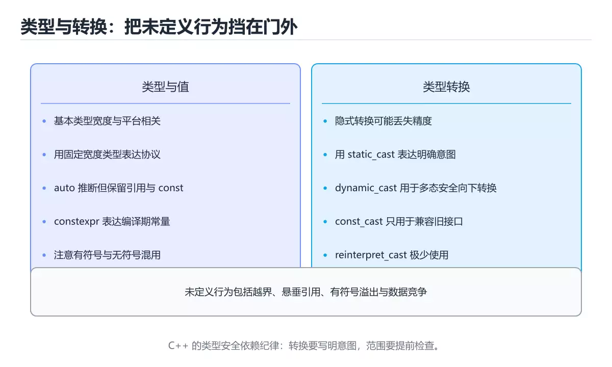
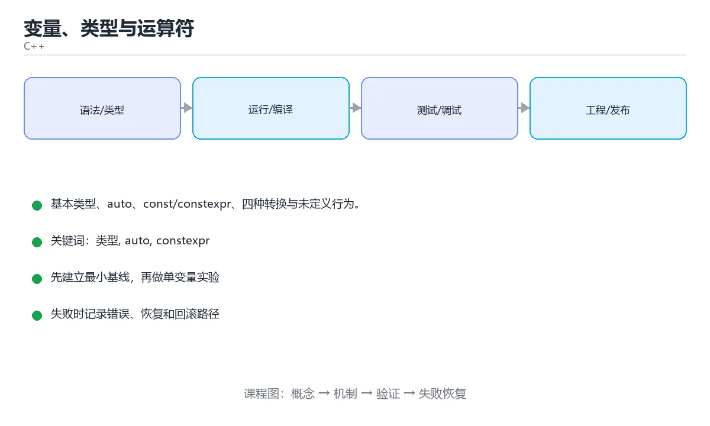

# 变量、类型与运算符

> 内容更新时间：2026-10-06 · 学习阶段：基础 · 预计用时：35 分钟





## 学习目标

- 能用自己的话解释变量、类型与运算符解决了什么问题，而不是只背术语。
- 能说清 「类型」、「auto」、「constexpr」、「static_cast」 之间的关系，并分别举出一个例子。
- 能把本课知识放回「C++」的知识体系，说明它和相邻主题的边界。
- 能完成本课练习，并用验收标准检查自己的结果。

> 一句话摘要：基本类型、auto、const/constexpr、四种转换与未定义行为。

## 前置知识

- 先完成上一课《环境与编译流程》；如果已经掌握，可以直接用本课练习自测。
- 本课阶段：进阶。建议先掌握同一分类的基础课程，并能独立运行正文中的最小示例。
- 开始前先复习：类型、auto、constexpr。
- 如果某一步看不懂，先记录具体卡点，完成练习后再回头读一遍。

## 基本类型

```cpp
int          count = 42;          // 通常 4 字节
long long    big = 9'000'000'000; // 至少 8 字节
double       pi = 3.14159;        // 双精度浮点
float        ratio = 0.5f;        // 注意 f 后缀
bool         ok = true;
char         letter = 'A';

unsigned int mask = 0xFF;
auto         inferred = 3.14;     // 自动推导为 double
```

`auto` 只是让编译器推导类型，不会降低类型安全；`decltype(x)` 用于取表达式的类型。

## const 与 constexpr

```cpp
const int max_size = 100;              // 运行期常量，不可修改
constexpr int square(int x) { return x * x; }   // 编译期可求值

const int* p1;          // 指向常量的指针：不能通过 p1 改值
int* const p2 = nullptr; // 常量指针：不能改指向
const int* const p3 = nullptr;  // 两者都不能改
```

能用 `constexpr` 就优先用它，编译期计算不占运行时开销。

## 类型转换

```cpp
double d = 3.9;
int i = static_cast<int>(d);        // 3，明确的截断

const char* text = "hello";
void* raw = const_cast<void*>(static_cast<const void*>(text));

Base* base = new Derived();
Derived* derived = dynamic_cast<Derived*>(base);   // 多态类型的安全向下转换

auto bits = reinterpret_cast<std::uintptr_t>(base); // 重新解释位模式，慎用
```

避免 C 风格强转 `(int)d`：四种具名转换能表达意图，也更容易被检索。

## 运算符

```cpp
int a = 7, b = 2;
std::cout << a / b << ' ' << a % b << '\n';   // 3 1，整数除法会截断
a += 3;  ++a;  a--;                            // 复合与自增自减

bool both = (a > 0) && (b > 0);                // 短路求值
int  flags = 0b1010 & 0b0110;                  // 位运算
```

`&&` 和 `||` 会短路：左边能确定结果时右边不会执行，因此可写成 `if (ptr && ptr->valid())`。

## 未定义行为（UB）

以下行为编译器不做保证，可能崩溃也可能「看起来正常」：

- 访问越界数组元素
- 使用未初始化变量
- 有符号整数溢出
- 释放后继续使用指针（悬垂指针）

## 本课小结

类型决定内存布局与运算规则。坚持「显式初始化、优先 const/constexpr、用具名转换」这三条，能避开大多数底层陷阱。

## 类型速查

| 类型 | 典型大小 | 范围 / 说明 | 字面量 |
| --- | --- | --- | --- |
| `bool` | 1 字节 | true / false | `true` |
| `char` | 1 字节 | 单个字符或小整数 | `'a'` |
| `int` | 4 字节 | 约 ±21 亿 | `42` |
| `long long` | 8 字节 | 更大整数 | `42LL` |
| `float` | 4 字节 | 精度约 7 位 | `3.14f` |
| `double` | 8 字节 | 精度约 15 位 | `3.14` |
| `size_t` | 平台相关 | 无符号，表示大小 | `sizeof(int)` |
| `std::string` | 动态 | 拥有字符串 | `std::string{"hi"}` |
| `auto` | 推导 | 编译期确定 | `auto x = 1;` |

类型转换速查（推荐优先级从高到低）：

| 场景 | 写法 |
| --- | --- |
| 数值间明确转换 | `static_cast<double>(n)` |
| 去 const | `const_cast<T*>(p)`（极少用，通常是设计问题） |
| 继承体系向下转换 | `dynamic_cast<Derived*>(base)`（失败返回 `nullptr`） |
| 重新解释二进制 | `reinterpret_cast<T*>(p)`（危险） |
| 初始化列表转换 | `T{value}`（禁止窄化转换） |

```cpp
int n = 7;
double d = static_cast<double>(n) / 2;   // 3.5，注意先转换再运算

int big = 3'000'000'000;                 // 字面量分隔符提高可读性
auto hex = 0xFF;                         // 255
auto bin = 0b1010;                       // 10
constexpr double kPi = 3.14159265358979323846;
```

## 常见错误与排查

| 容易写错的做法 | 实际现象 | 原因与正确做法 |
| --- | --- | --- |
| `int a = 1 / 2;` | 得到 0 | 整数除法截断，写 `1.0 / 2` |
| `double x = 5 / 2;` | 得到 2.0 而不是 2.5 | 右侧先按整数运算，改成 `5.0 / 2` |
| `int` 溢出 | 结果变成负数或未定义行为 | 用 `long long`，或运算前检查 |
| 有符号与无符号混用比较 | 负数被当成巨大正数 | 统一类型，或明确 `static_cast` |
| `float` 比较相等 | 结果不稳定 | 用误差范围，或改用整数 |
| `0.1 + 0.2 == 0.3` | `false` | 浮点表示误差，用容差比较 |
| `const int*` 与 `int* const` 混淆 | 编译错误或语义不符 | const 在 `*` 左边修饰值，右边修饰指针 |
| 隐式窄化 `int x = 3.9;` | 截断为 3 | 用 `static_cast<int>(3.9)` 明确意图 |
| 用 `#define` 定义常量 | 无类型、难调试 | 用 `constexpr` |
| `std::string` 与 C 字符串相加 | 编译或行为异常 | 至少一侧是 `std::string` |

## 复习与自测

- [ ] 知道整数除法与浮点除法的区别，并能写出正确表达式。
- [ ] 优先使用 `static_cast`，避免 C 风格强制转换。
- [ ] 用 `constexpr` 替代 `#define` 定义常量。
- [ ] 清楚 `size_t` 是无符号类型及混用风险。
- [ ] 浮点比较使用误差范围而非 `==`。

## 零基础详解：类型是「给内存规定一个解读方式」

### 一句话说清它是什么

计算机里只有 0 和 1。类型告诉编译器：**这段二进制要按整数读、按小数读、还是按字符读**，
同时决定它占多少字节、能做哪些运算。

### 常用类型速览

| 类型 | 典型大小 | 表示范围（约） | 常见用途 |
| --- | --- | --- | --- |
| `bool` | 1 字节 | `true` / `false` | 条件判断 |
| `char` | 1 字节 | -128 ~ 127 | 单个字符、原始字节 |
| `int` | 4 字节 | ±21 亿 | 一般计数 |
| `long long` | 8 字节 | ±9.2×10¹⁸ | 大整数、时间戳 |
| `float` | 4 字节 | 约 7 位有效数字 | 图形计算（省内存） |
| `double` | 8 字节 | 约 15 位有效数字 | 默认浮点选择 |
| `std::string` | 动态 | 不定 | 文本 |

用 `sizeof(类型)` 可以在自己机器上验证大小，别死记。

### 有无符号：最容易出事故的一对

```cpp
unsigned int a = 0;
a = a - 1;              // 不是 -1，而是 4294967295
```

原因是无符号数用「回绕」规则：减到 0 之后绕回最大值。
**经验法则：计数和下标用 `size_t`，需要负数的场景一律用有符号类型。**

### 浮点数的真相

```cpp
double x = 0.1 + 0.2;
std::cout << (x == 0.3);            // 0（false）
std::cout << std::setprecision(17) << x;   // 0.30000000000000004
```

浮点是二进制近似表示，所以：

- 永远不要用 `==` 比较两个浮点数。
- 判断相等要设误差：`std::abs(a - b) < 1e-9`。
- 涉及金额用整数分存储，或用定点数/高精度库。

### 四种类型转换：优先用 `static_cast`

| 写法 | 名称 | 使用场景 | 风险 |
| --- | --- | --- | --- |
| `static_cast<double>(n)` | 静态转换 | 数值互转，最常用 | 低 |
| `const_cast<T*>(p)` | 去常量 | 兼容旧接口 | 高，能改坏常量 |
| `reinterpret_cast<T*>(p)` | 重新解释 | 底层二进制处理 | 很高 |
| `dynamic_cast<T*>(p)` | 动态转换 | 多态类型安全向下转换 | 需要 RTTI |

```cpp
int total = 7, count = 2;
double avg = static_cast<double>(total) / count;   // 3.5，而不是 3
```

### `const` 与 `auto`：现代 C++ 的两个好习惯

```cpp
const double PI = 3.14159;        // 常量，编译期就防止被改
const int& ref = bigObject;       // 常量引用，避免拷贝又不允许修改
auto count = users.size();        // 让编译器推导类型，写起来更省事
```

`auto` 不是「动态类型」，推导在编译期完成，运行时没有额外开销。

### 新手最容易踩的七个坑

| 坑 | 现象 | 正确做法 |
| --- | --- | --- |
| 整数除法丢小数 | `5 / 2 == 2` | 至少一侧转成 `double` |
| 有符号与无符号混用 | 比较结果反直觉 | 统一类型，或用 `std::ssize` |
| 整数溢出 | 结果变成负数 | 换 `long long`，或提前判断范围 |
| 未初始化变量 | 输出垃圾值 | 定义即赋初值 |
| 字符串用 `==` | 比较的是地址 | `std::string` 用 `==`，C 风格字符串用 `strcmp` |
| `char` 当整数用 | 输出成乱码字符 | 需要数值时先 `static_cast<int>` |
| 忘记包含头文件 | 找不到 `std::string` | 加上 `#include <string>` |

### 手把手练习：安全计算平均分

```cpp
#include <iostream>
#include <vector>

int main() {
    std::vector<int> scores{88, 92, 79};
    if (scores.empty()) {
        std::cout << "没有成绩\n";
        return 0;
    }

    long long total = 0;
    for (int s : scores) total += s;

    double average = static_cast<double>(total) / scores.size();
    std::cout << "总分 " << total << "，平均 " << average << '\n';
    return 0;
}
```

注意 `total` 用 `long long` 防溢出，除法前先转 `double`——这两点就是类型意识。

### 学完自测

- [ ] 能说出 `int`、`long long`、`double` 大致占用多少字节。
- [ ] 能解释为什么 `0.1 + 0.2 != 0.3`。
- [ ] 知道整数除法丢小数的原因和修法。
- [ ] 能说出 `const` 和 `constexpr` 的区别。
- [ ] 遇到类型转换时，优先写 `static_cast`。

## 动手练习

> 本课练习重点：围绕「类型、auto、constexpr」完成复述、实验和交付，每个结果都要能被别人检查。

先开启警告编译最小程序，再验证内存与边界，最后用 Sanitizer 跑一遍。

### 练习 1：建立心智模型（10 分钟）

合上教程，用 3～5 句话回答：

1. 变量、类型与运算符解决了什么问题？
2. 如果没有它，会出现什么具体后果？
3. 它和「auto」是什么关系？

**验收标准**：至少出现一个本课关键词，并写出一个反例、边界条件或失效场景。

### 练习 2：做一次可控实验（20 分钟）

从正文中选一个最小示例，完成以下操作：

1. 先预测修改一个参数、输入或步骤后的结果。
2. 再实际执行或逐步推演，记录真实结果。
3. 如果结果与预测不同，写出差异原因。

**验收标准**：留下「原例 → 改动 → 预测 → 结果 → 原因」五步记录。

### 练习 3：交付一个小结果（30 分钟）

写一个可独立编译的小程序，开启 `-Wall -Wextra`，确保没有警告。

任务要求：

- 结果必须能被别人检查，不能只写“我已经理解了”。
- 至少覆盖「类型」和「auto」两个关键词。
- 写出 1 个仍然不确定的问题，以及下一步如何验证。

> 提示：时间有限时优先做练习 1 和练习 2；练习 3 可以拆成两次完成。

## 可运行练习

### 任务 1：先跑通，再解释

```cpp
int          count = 42;          // 通常 4 字节
long long    big = 9'000'000'000; // 至少 8 字节
double       pi = 3.14159;        // 双精度浮点
float        ratio = 0.5f;        // 注意 f 后缀
bool         ok = true;
char         letter = 'A';

unsigned int mask = 0xFF;
auto         inferred = 3.14;     // 自动推导为 double
```

### 任务 2：只改一个条件

把「变量、类型与运算符」的最小示例复制一份，只改一个条件再跑一次：

- 改动点：只把类型的输入换成空值、极值或错误输入，其余保持不变。
- 预测：先写下「变量、类型与运算符」在改动后的输出或错误信息，再运行。
- 记录：对照改动前后的结果，指出差异出在哪一步。
- 验收：换回原条件能复现原结果，改动只影响类型。

### 任务 3：迁移到自己的数据

用同一套思路处理一组你自己的数据或场景，保持输出格式与任务 1 一致。

## 故障现场

### 现场 1：本课的 类型 常规用例通过，但边界用例失败

**症状**：在本课的练习或生产场景里出现“本课的 类型 常规用例通过，但边界用例失败”。

**复现**：准备一组最小输入，只保留触发“本课的 类型 常规用例通过，但边界用例失败”的必要条件，连续运行两次确认结果稳定。

**定位**：围绕“类型 的前置条件与取值边界没有写进代码，默认值掩盖了空值和极值”检查调用链、输入数据和环境配置，先验证假设再改代码。

**预防**：把“本课的 类型 常规用例通过，但边界用例失败”写成一条自动化用例，并在本课的验收清单里保留对应检查项。

### 现场 2：本课的 auto 结果在两次运行之间不一致

**症状**：在本课的练习或生产场景里出现“本课的 auto 结果在两次运行之间不一致”。

**复现**：准备一组最小输入，只保留触发“本课的 auto 结果在两次运行之间不一致”的必要条件，连续运行两次确认结果稳定。

**定位**：围绕“auto 依赖了当前版本、执行顺序或共享状态，单次运行无法暴露差异”检查调用链、输入数据和环境配置，先验证假设再改代码。

**预防**：把“本课的 auto 结果在两次运行之间不一致”写成一条自动化用例，并在本课的验收清单里保留对应检查项。

### 现场 3：本课的验证只在开发机通过

**症状**：在本课的练习或生产场景里出现“本课的验证只在开发机通过”。

**定位**：围绕“环境版本、配置和输入规模与目标环境不同，类型 缺少可重复的验证记录”检查调用链、输入数据和环境配置，先验证假设再改代码。

## 版本与时效

- C++23 已在主流工具链落地，C++26 进入定稿阶段
- 升级前先统一编译器与标准库版本，再逐模块打开新标准

### 升级检查清单

- 先固定当前版本，跑通全部示例与测验，再升级工具链。
- 只改一个版本变量，记录编译、测试、性能与产物体积的变化。
- 重点回归默认值、弃用警告、序列化格式、并发语义和错误信息。
- 升级完成后更新本课的“最后复核 / 下次复核”日期与版本说明。

## 本课复习清单

离开本课前，逐项确认：

- [ ] 不看解析，能说出「constexpr 与 const 的主要区别是？」的判断依据。
- [ ] 不看解析，能说出「有符号整数溢出在 C++ 中属于？」的判断依据。
- [ ] 不看解析，能说出「把 double 转成 int 并明确表示截断，推荐使用？」的判断依据。
- [ ] 不看解析，能说出「C++ 中 auto 的含义是？」的判断依据。
- [ ] 不看解析，能说出「把负数赋给 size_t 或无符号变量时会发生什么？」的判断依据。
- [ ] 至少运行一次本课示例，记录输入、输出和一个边界情况。
- [ ] 把本课最容易混淆的两个概念写成一句话对照。

| 复盘项 | 记录 |
| --- | --- |
| 已经能独立解释的考点 |  |
| 仍然说不清的概念 |  |
| 下一步验证动作 |  |

## 术语速查

| 术语 | 一句话说明 |
| --- | --- |
| `auto` | `auto` 只是让编译器推导类型，不会降低类型安全；`decltype(x)` 用于取表达式的类型。 |
| `decltype(x)` | `auto` 只是让编译器推导类型，不会降低类型安全；`decltype(x)` 用于取表达式的类型。 |
| `constexpr` | 能用 `constexpr` 就优先用它，编译期计算不占运行时开销。 |
| `(int)d` | 避免 C 风格强转 `(int)d`：四种具名转换能表达意图，也更容易被检索。 |
| `&&` | `&&` 和 `\|\|` 会短路：左边能确定结果时右边不会执行，因此可写成 `if (ptr && ptr->valid())`。 |
| `||` | `&&` 和 `\|\|` 会短路：左边能确定结果时右边不会执行，因此可写成 `if (ptr && ptr->valid())`。 |

## 考点精讲

### 考点 1：代码补全·类型

- **题目**：下面这段 C++ 代码摘自「变量、类型与运算符」的正文示例。关于这段代码，下面哪一项说法与实际内容相符？
- **判断依据**：题干的正确项是这段代码只做静态声明，没有循环、分支或可观察输出，在「变量、类型与运算符」里它只能证明类型相关约束存在，不能替代真实运行证据。这段代码出自「变量、类型与运算符」的正文示例，围绕类型、auto、constexpr展开；把输入或边界换成空值、极值或失败情况后，结论要以「变量、类型与运算符」的实际运行结果为准。回到「变量、类型与运算符」的正文示例，用“下面这段 C++ 代码摘自变量、类型”走一遍类型、auto、constexpr的完整流程，能复现的结论才可以保留。

### 考点 2：概念判断·类型

- **题目**：有符号整数溢出在 C++ 中属于？
- **判断依据**：有符号溢出是未定义行为，编译器可以做任意假设，必须自行避免。其他选项：有符号溢出是未定义行为，编译器可以假设它不发生并据此优化。在「变量、类型与运算符」里判断这道题，要把类型、auto、constexpr的条件、过程与失败路径逐项对齐，换成“有符号整数溢出在 C++ 中属于”这个场景，只有满足前提的结论才成立。

### 考点 3：多选辨析·类型

- **题目**：围绕“变量、类型与运算符”中的 类型、auto、constexpr，下列哪两项是本课强调的实践判断？
- **判断依据**：本课把变量、类型与运算符拆成概念、示例与故障现场三部分，因此判断 类型 时必须同时交代输入、输出和失败路径，这使“学习 类型 时要同时说明输入、输出和失败路径，不能只看正常流程”成立。在变量、类型与运算符里，判断 auto 时要固定版本与边界输入，所以“验证 auto 时要固定版本并覆盖边界输入，结论才可复现”才可复现。

### 考点 4：概念判断·类型

- **题目**：C++ 中 auto 的含义是？
- **判断依据**：在「变量、类型与运算符」里，结论应落在「由编译器根据初始化表达式推导出的静态类型」。auto 只是省写类型，类型在编译期确定，与 Python 的动态类型完全不同。在「变量、类型与运算符」里，这道题要求区分概念与边界，「由编译器根据初始化表达式推导出的静态类型」只有在题干给出的前提下才成立，而「任意类型（不做检查）（仅部分场景成立）」、「运行时动态类型」缺少同一组条件。

### 考点 5：概念判断·类型

- **题目**：把负数赋给 size_t 或无符号变量时会发生什么？
- **判断依据**：在「变量、类型与运算符」里，按模转换成一个很大的正数。有符号与无符号混用是经典陷阱，例如 for (sizet i = n - 1。在「变量、类型与运算符」里判断这道题，要把类型、auto、constexpr的条件、过程与失败路径逐项对齐，换成“把负数赋给 sizet 或无符号变量”这个场景，只有满足前提的结论才成立。

### 考点 6：填空·类型

- **题目**：补全代码：「变量、类型与运算符」示例中，下面这行代码缺少哪个关键字或函数名？请填入 ____。 `auto bits = ____<std::uintptr_t>(base); // 重新解释位模式，慎用`
- **判断依据**：空格应填写「reinterpret_cast」。在「变量、类型与运算符」里判断这道题，要把类型、auto、constexpr的条件、过程与失败路径逐项对齐，换成“补全代码”这个场景，只有满足前提的结论才成立。回到「变量、类型与运算符」的正文示例，用“补全代码”走一遍类型、auto、constexpr的完整流程，能复现的结论才可以保留。

## English Overview

**Title:** Types & Operators

**Summary:** Fundamental types, auto, const, casts and undefined behaviour.

**Category:** C++
**Level:** 进阶
**Key terms:** 类型, auto, constexpr, static_cast, 未定义行为

## 内容元数据

- 内容版本：v2.0
- 最后更新：2026-10-06
- 学习阶段：基础
- 适用环境：C++20 / GCC 13+ 或 Clang 17+
- 内容来源：内置结构化课程与工程实践整理
- 相关主题：类型、auto、constexpr、static_cast、未定义行为
- 质量版本：P0 测验标准 + P1 覆盖扩展 + P2 体验补全

## 参考资料与复核

- 最后复核：2026-10-04
- 下次复核：2027-04-04
- 复核范围：版本兼容、API 行为、安全建议与工程实践
- 来源性质：官方文档、标准或权威教材；正文为离线教学重组

| 参考资料 | 本课用途 |
| --- | --- |
| [cppreference C++ 语言](https://en.cppreference.com/w/cpp/language) | C++ 语言规则与语义 |
| [CMake 文档](https://cmake.org/documentation/) | 跨平台构建与依赖管理 |
| [Google C++ 风格指南](https://google.github.io/styleguide/cppguide.html) | 命名、接口与工程约束 |

> 「变量、类型与运算符」的链接用于离线阅读后的延伸核对；App 不会自动联网。
