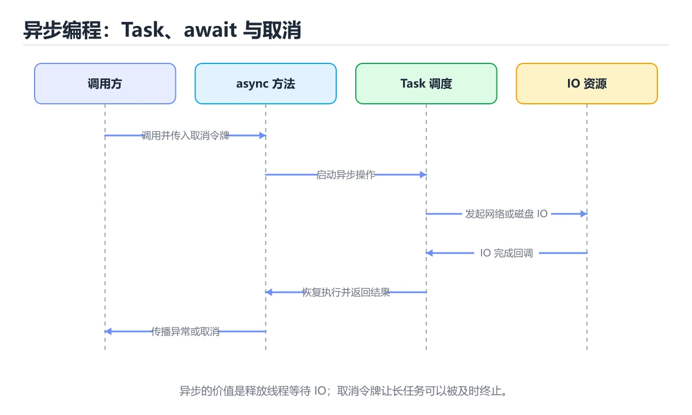
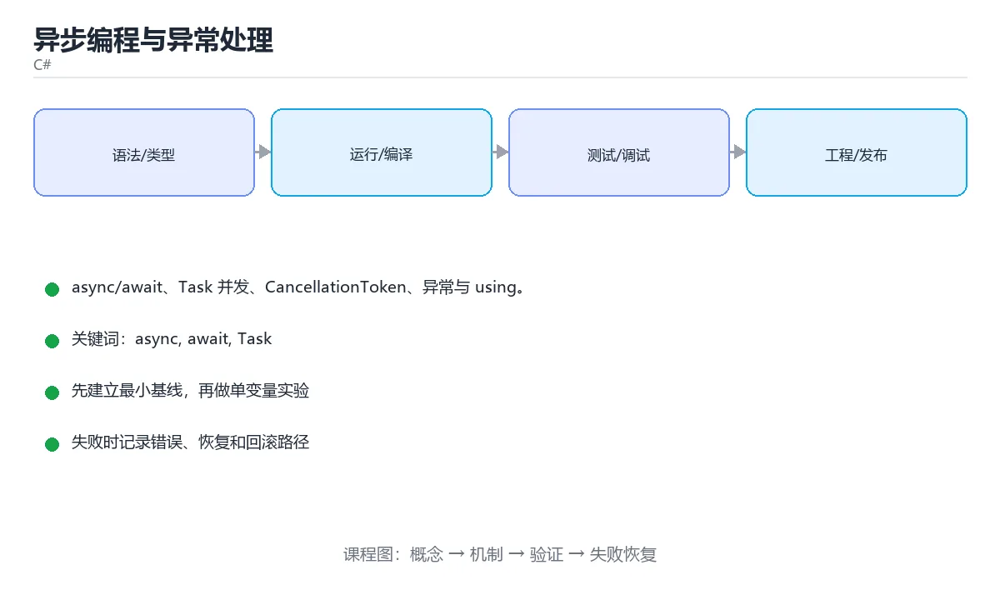

# 异步编程与异常处理

> 内容更新时间：2026-10-06





## 学习目标

- 能用自己的话解释异步编程与异常处理解决了什么问题，而不是只背术语。
- 能说清 「async」、「await」、「Task」、「CancellationToken」 之间的关系，并分别举出一个例子。
- 能把本课知识放回「C#」的知识体系，说明它和相邻主题的边界。
- 能完成本课练习，并用验收标准检查自己的结果。

> 一句话摘要：async/await、Task 并发、CancellationToken、异常与 using。

## 前置知识

- 先完成上一课《集合、委托与 LINQ》；如果已经掌握，可以直接用本课练习自测。
- 本课阶段：进阶。建议先掌握同一分类的基础课程，并能独立运行正文中的最小示例。
- 开始前先复习：async、await、Task。
- 如果某一步看不懂，先记录具体卡点，完成练习后再回头读一遍。

## async / await

```csharp
public async Task<string> LoadAsync(string url, CancellationToken token)
{
    using var client = new HttpClient();
    string content = await client.GetStringAsync(url, token);
    return content;
}

public async Task RunAsync()
{
    try
    {
        string data = await LoadAsync("https://example.com", CancellationToken.None);
        Console.WriteLine(data.Length);
    }
    catch (HttpRequestException ex)
    {
        Console.WriteLine($"网络错误：{ex.Message}");
    }
}
```

`async` 方法返回 `Task` / `Task<T>`；`await` 在等待期间释放线程，因此特别适合 IO 密集场景。

## 并发与取消

```csharp
Task<string> a = LoadAsync(urlA, token);
Task<string> b = LoadAsync(urlB, token);
string[] results = await Task.WhenAll(a, b);      // 并行等待全部完成

Task<Task<string>> first = await Task.WhenAny(a, b);   // 谁先完成用谁
```

用 `CancellationTokenSource` 实现超时：

```csharp
using var cts = new CancellationTokenSource(TimeSpan.FromSeconds(5));
await LoadAsync(url, cts.Token);
```

## 异常与资源释放

```csharp
try
{
    await ProcessAsync();
}
catch (InvalidOperationException ex) when (ex.Message.Contains("retry"))
{
    // 异常筛选器：只处理特定情况
}
catch (Exception ex)
{
    Console.Error.WriteLine(ex);
    throw;                       // 保留原始堆栈重新抛出
}
finally
{
    Console.WriteLine("清理完成");
}
```

实现 `IDisposable` 的对象用 `using` 自动释放：

```csharp
using var stream = File.OpenRead("data.txt");
using var reader = new StreamReader(stream);
string? line;
while ((line = await reader.ReadLineAsync()) != null)
{
    Console.WriteLine(line);
}
```

## 常见陷阱

1. 用 `.Result` 或 `.Wait()` 阻塞异步代码，容易死锁，应一路 `await`。
2. `async void` 只用于事件处理器，异常无法被捕获。
3. 忘记 `await` 会让异常被吞掉，任务在后台失败。
4. 大量并发要限制数量，可用 `SemaphoreSlim`。

## 并发控制与常见误用

| 需求 | 做法 |
| --- | --- |
| 限制并发数 | `SemaphoreSlim` 控制同时执行数（如限制 10 个并发请求） |
| 批量并行 | `Task.WhenAll`；不要用 `Task.WaitAll`（同步阻塞） |
| 超时 | `CancellationTokenSource(TimeSpan.FromSeconds(5))` |
| 顺序流式处理 | `await foreach` 配合 `IAsyncEnumerable` |
| 周期性后台任务 | `PeriodicTimer` 或 `BackgroundService` |

**五种常见误用**：① `.Result` / `.Wait()` 阻塞异步代码导致死锁；② `async void`（除事件处理器外无法捕获异常）；③ 忘记 `ConfigureAwait(false)` 在库代码中（非 UI 场景可减少上下文切换，但要看具体框架约定）；④ 在循环里逐个 await 造成串行（应收集 Task 后 WhenAll）；⑤ 忘了传 CancellationToken，导致请求取消后后台仍继续算。

**线程安全**：多个 Task 修改共享状态要用锁（`lock`/`SemaphoreSlim`）或并发集合（`ConcurrentDictionary`）；跨线程更新 UI 必须回到 UI 上下文（在 WPF/WinForms 中通过 Dispatcher/Invoke）。

## 本课小结
异步的目标是**不阻塞线程**：IO 用 `async/await`、并发用 `Task.WhenAll`、可取消用 `CancellationToken`，异常与资源交给 try/catch 与 using。

## async / await 速查

| 写法 | 含义 | 建议 |
| --- | --- | --- |
| `async Task FooAsync()` | 无返回值的异步方法 | 默认选择 |
| `async Task<T> FooAsync()` | 有返回值的异步方法 | 默认选择 |
| `async void FooAsync()` | 只能用于事件处理器 | 异常无法捕获，尽量不用 |
| `await task` | 异步等待，不阻塞线程 | 首选 |
| `task.Result` / `task.Wait()` | 同步阻塞等待 | 容易死锁，禁止在 UI/请求线程使用 |
| `Task.Run(() => ...)` | 把 CPU 密集工作丢到线程池 | IO 操作不需要它 |
| `Task.Delay(ms)` | 异步等待 | 别用 `Thread.Sleep` 阻塞线程 |
| `Task.WhenAll(tasks)` | 并发等待全部完成 | 注意收集每个任务的异常 |
| `Task.WhenAny(tasks)` | 等待最快完成的一个 | 常用于超时控制 |
| `CancellationToken` | 协作式取消 | 逐层传递，定期检查 |
| `ConfigureAwait(false)` | 不回到原同步上下文 | 库代码常用；UI 层一般不需要 |
| `await using` | 异步释放资源 | 适用于 `IAsyncDisposable` |

超时 + 取消的常见写法：

```csharp
using var cts = new CancellationTokenSource(TimeSpan.FromSeconds(3));
try
{
    var data = await client.GetStringAsync(url, cts.Token);
    Console.WriteLine(data.Length);
}
catch (OperationCanceledException)
{
    Console.WriteLine("请求超时或被取消");
}
```

并发执行多个请求：

```csharp
var tasks = urls.Select(u => client.GetStringAsync(u)).ToList();
string[] results = await Task.WhenAll(tasks);   // 总耗时接近最慢的一个
```

## 常见错误对照表

| 容易写错的做法 | 实际现象 | 原因与正确做法 |
| --- | --- | --- |
| `var s = FooAsync();` 没有 `await` | 拿到的是 `Task`，异常被吞 | 加上 `await`，或明确保存任务稍后处理 |
| `task.Result` | 可能死锁、线程被占满 | 改成 `await task` |
| `async void` 抛异常 | 进程可能直接崩溃 | 只用于事件处理器，并在内部 `try/catch` 全部包住 |
| `Thread.Sleep(1000)` 在异步方法里 | 阻塞线程 | 改成 `await Task.Delay(1000)` |
| `foreach` 里逐个 `await` | 串行执行，总耗时相加 | 无依赖时先收集任务，再 `WhenAll` |
| 忘记传 `CancellationToken` | 用户取消后请求仍在跑 | 逐层传递 token 并检查 |
| 在 `finally` 里 `await` 释放资源 | 代码冗长 | 用 `await using` |
| 并发访问同一个 `DbContext` | `InvalidOperationException` | DbContext 不是线程安全的，每个请求一个实例 |
| `.Wait()` 在 ASP.NET Core 请求线程 | 线程池饥饿 | 全链路异步：`async` 到底 |
| `Task.Run` 包住 IO 调用 | 白白占用线程池线程 | IO 本身是异步的，直接 `await` 即可 |

## 自测清单

- [ ] 默认返回 `Task` / `Task<T>`，只有事件处理器才用 `async void`。
- [ ] 全程 `await`，不使用 `.Result` 与 `.Wait()`。
- [ ] IO 密集用异步 API，CPU 密集才考虑 `Task.Run`。
- [ ] 对外方法都接受并传递 `CancellationToken`。
- [ ] 多个独立任务用 `Task.WhenAll` 并发执行。

## 零基础详解：async/await 与任务并行

### 一句话说清它是什么

`async/await` 让「等待 IO」的代码写起来像同步代码，但线程不会被卡住。
核心区别只有一句话：**IO 密集用 async，CPU 密集用并行任务**。

### 用生活比喻理解

| 概念 | 比喻 | 说明 |
| --- | --- | --- |
| `Task` | 取件凭条 | 代表一件正在做的事 |
| `await` | 等叫号 | 等待期间可以去做别的 |
| `Task.WhenAll` | 一起等所有单子 | 并发而不是串行 |
| `CancellationToken` | 取消按钮 | 让任务可以中途停止 |
| `ConfigureAwait(false)` | 不指定回到原岗位 | 库代码里减少上下文切换 |

### 从阻塞到异步

```csharp
// 阻塞写法：线程被占用，无法处理其它请求
string text = File.ReadAllText("data.txt");

// 异步写法：等待期间线程可以去做别的事
string text2 = await File.ReadAllTextAsync("data.txt");
```

**口诀**：方法名以 `Async` 结尾、返回 `Task` 或 `Task<T>`、内部有 `await`。

### 三种返回类型

| 返回类型 | 何时用 |
| --- | --- |
| `Task` | 异步但没有返回值 |
| `Task<T>` | 异步且有返回值 |
| `ValueTask<T>` | 高频调用且常常同步完成（进阶） |
| `async void` | **只用于事件处理器**，异常无法被捕获 |

### 串行与并发的差别

```csharp
// 串行：总耗时约等于各任务之和
var a = await FetchAsync("a");
var b = await FetchAsync("b");
var c = await FetchAsync("c");

// 并发：总耗时约等于最慢的那个
var tasks = new[] { FetchAsync("a"), FetchAsync("b"), FetchAsync("c") };
var results = await Task.WhenAll(tasks);
```

| 方法 | 行为 |
| --- | --- |
| `Task.WhenAll` | 等全部完成；任一失败则抛异常 |
| `Task.WhenAny` | 等第一个完成 |
| `Task.WhenEach` | 完成一个就处理一个（.NET 9+） |
| `Task.Run` | 把 CPU 密集工作丢到线程池 |

### 取消与超时

```csharp
using var cts = new CancellationTokenSource(TimeSpan.FromSeconds(3));

try
{
    var data = await FetchAsync(url, cts.Token);
    Console.WriteLine(data);
}
catch (OperationCanceledException)
{
    Console.WriteLine("请求超时或被取消");
}

static async Task<string> FetchAsync(string url, CancellationToken token)
{
    using var http = new HttpClient();
    var res = await http.GetStringAsync(url, token);     // 把 token 传到底
    return res;
}
```

**取消要一路传下去**：只在外层判断 `token.IsCancellationRequested` 而不传给底层调用，是无效取消。

### 什么时候不需要 async

```csharp
// 只是转发：不用 async，直接返回 Task 更省一次状态机
public Task<string> GetAsync() => _client.GetStringAsync("/api");

// 反例：包一层却没有任何额外逻辑
public async Task<string> GetAsyncBad()
    => await _client.GetStringAsync("/api");
```

### 新手最容易踩的八个坑

| 坑 | 现象 | 正确做法 |
| --- | --- | --- |
| 用 `.Result` 或 `.Wait()` | 可能死锁、线程被占用 | 一路 `await` 到底 |
| `async void` | 异常无法捕获，进程崩溃 | 除事件处理器外都用 `Task` |
| 循环里逐个 await | 慢几倍 | 收集任务后用 `WhenAll` |
| 忘了传 `CancellationToken` | 取消失效 | 参数一路传到底 |
| 在锁里 `await` | 死锁或异常 | 不在锁内等待异步 |
| 并发访问 `HttpClient` 时反复 new | 端口耗尽 | 复用静态 `HttpClient` 或工厂 |
| 把 CPU 密集任务直接 async | 那只是同步阻塞 | 用 `Task.Run` 放到线程池 |
| 库代码到处 `ConfigureAwait(true)` | 上下文切换开销 | 库内用 `ConfigureAwait(false)` |

### 手把手练习：并发抓取并容错

```csharp
using System.Net.Http.Json;

record Post(int Id, string Title);

static async Task Main()
{
    using var cts = new CancellationTokenSource(TimeSpan.FromSeconds(5));
    using var http = new HttpClient { BaseAddress = new Uri("https://example.com") };

    var ids = Enumerable.Range(1, 5);
    var tasks = ids.Select(async id =>
    {
        try
        {
            var post = await http.GetFromJsonAsync<Post>(
                $"/api/posts/{id}", cts.Token);
            return (Id: id, Title: post?.Title ?? "无标题", Error: (string?)null);
        }
        catch (Exception ex) when (ex is HttpRequestException or TaskCanceledException)
        {
            return (Id: id, Title: "", Error: ex.Message);
        }
    });

    var results = await Task.WhenAll(tasks);
    foreach (var r in results)
    {
        Console.WriteLine(r.Error is null
            ? $"{r.Id}: {r.Title}"
            : $"{r.Id}: 失败 - {r.Error}");
    }
}
```

### 学完自测

- [ ] 能说出同步阻塞与异步等待的区别。
- [ ] 知道 `async void` 为什么危险。
- [ ] 能说出串行 await 与 `Task.WhenAll` 的性能差异。
- [ ] 知道取消为什么要一路传递 `CancellationToken`。
- [ ] 能判断一个场景该用 async 还是 `Task.Run`。

## 动手练习

### 练习 1：概念复述（10 分钟）

合上教程，用 3～5 句话解释异步编程与异常处理解决什么问题，并写出一个边界条件。

**验收标准**：至少使用一个本课关键词，并给出一个反例。

### 练习 2：示例改写（20 分钟）

从正文选一个最小示例，先预测修改一个输入后的结果，再实际验证并记录差异。

**验收标准**：留下「原例 → 改动 → 预测 → 结果 → 原因」五步记录。

### 练习 3：迁移任务（30 分钟）

写一个控制台小程序，补一个正例、一个边界值和一个异常路径。

- 至少覆盖「async」和「await」两个关键词。
- 产出一个别人可以检查的结果。
- 写出一个仍不确定的问题和验证方法。

## 实践任务

本节围绕异步编程与异常处理安排 3 个可交付任务，每个任务都要求留下可以复查的记录。

### 任务 1：用自己的话画出结构

不看书，用一张图说清「异步编程与异常处理」的结构，画完再对照骨架：

- 主干：并发与取消 → 异常与资源释放 → 常见陷阱 → 并发控制与常见误用
- 连接线：在每条边上标出输入、输出与失败路径。
- 自检：能否用一句话说明async与await的关系？

### 任务 2：做一次对比实验

**验收标准**：表格里两个方案的结论不能完全一样；写下“在什么条件下应该换方案”。

### 任务 3：迁移到自己的场景

**验收标准**：至少有一个可复现的命令、代码片段或数据样例；结论能被别人独立检查。

## 故障现场

### 现场 1：本课的 async 常规用例通过，但边界用例失败

**症状**：在本课的练习或生产场景里出现“本课的 async 常规用例通过，但边界用例失败”。

**复现**：准备一组最小输入，只保留触发“本课的 async 常规用例通过，但边界用例失败”的必要条件，连续运行两次确认结果稳定。

**定位**：围绕“async 的前置条件与取值边界没有写进代码，默认值掩盖了空值和极值”检查调用链、输入数据和环境配置，先验证假设再改代码。

**预防**：把“本课的 async 常规用例通过，但边界用例失败”写成一条自动化用例，并在本课的验收清单里保留对应检查项。

### 现场 2：本课的 await 结果在两次运行之间不一致

**症状**：在本课的练习或生产场景里出现“本课的 await 结果在两次运行之间不一致”。

**复现**：准备一组最小输入，只保留触发“本课的 await 结果在两次运行之间不一致”的必要条件，连续运行两次确认结果稳定。

**定位**：围绕“await 依赖了当前版本、执行顺序或共享状态，单次运行无法暴露差异”检查调用链、输入数据和环境配置，先验证假设再改代码。

**预防**：把“本课的 await 结果在两次运行之间不一致”写成一条自动化用例，并在本课的验收清单里保留对应检查项。

### 现场 3：本课的验证只在开发机通过

**症状**：在本课的练习或生产场景里出现“本课的验证只在开发机通过”。

**定位**：围绕“环境版本、配置和输入规模与目标环境不同，async 缺少可重复的验证记录”检查调用链、输入数据和环境配置，先验证假设再改代码。

## 版本与时效

- .NET 10 是当前 LTS 主线，C# 版本随 SDK 一起演进
- 主构造函数、集合表达式、模式匹配与 AOT/裁剪是升级重点
- 升级前检查 NuGet 依赖、序列化行为与运行时标识
- 官方说明：https://learn.microsoft.com/dotnet/core/whats-new/

### 升级检查清单

- 先固定当前版本，跑通全部示例与测验，再升级工具链。
- 只改一个版本变量，记录编译、测试、性能与产物体积的变化。
- 重点回归默认值、弃用警告、序列化格式、并发语义和错误信息。
- 升级完成后更新本课的“最后复核 / 下次复核”日期与版本说明。

## 本课复习清单

离开本课前，逐项确认：

- [ ] 不看解析，能说出「使用 await 等待 IO 的主要好处是？」的判断依据。
- [ ] 不看解析，能说出「在异步代码中使用 .Result 或 .Wait() 的风险是？」的判断依据。
- [ ] 不看解析，能说出「async void 只适合用在什么场景？」的判断依据。
- [ ] 不看解析，能说出「CancellationToken 的作用是？」的判断依据。
- [ ] 不看解析，能说出「Task.WhenAll 相比逐个 await 的优势是？」的判断依据。
- [ ] 至少运行一次本课示例，记录输入、输出和一个边界情况。
- [ ] 把本课最容易混淆的两个概念写成一句话对照。

| 复盘项 | 记录 |
| --- | --- |
| 已经能独立解释的考点 |  |
| 仍然说不清的概念 |  |
| 下一步验证动作 |  |

## 术语速查

| 术语 | 本课语境 |
| --- | --- |
| `async` | `async` 方法返回 `Task` / `Task<T>`；`await` 在等待期间释放线程，因此特别适合 IO 密集场景。 |
| `Task` | `async` 方法返回 `Task` / `Task<T>`；`await` 在等待期间释放线程，因此特别适合 IO 密集场景。 |
| `Task<T>` | `async` 方法返回 `Task` / `Task<T>`；`await` 在等待期间释放线程，因此特别适合 IO 密集场景。 |
| `await` | `async` 方法返回 `Task` / `Task<T>`；`await` 在等待期间释放线程，因此特别适合 IO 密集场景。 |
| `CancellationTokenSource` | 用 `CancellationTokenSource` 实现超时： |
| `IDisposable` | 实现 `IDisposable` 的对象用 `using` 自动释放： |

## 考点精讲

### 考点 1：概念判断·async

- **题目**：使用 await 等待 IO 的主要好处是？
- **判断依据**：在「异步编程与异常处理」里，等待期间不阻塞线程。await 在等待期间释放当前线程，线程可以去处理其他请求，从而提高吞吐量。这道题的关键在「异步编程与异常处理」的async、await、Task：先确认题干“使用 await 等待 IO 的主要”问的是哪一步，再排除偷换前提的选项。

### 考点 2：概念判断·async

- **题目**：在异步代码中使用 .Result 或 .Wait 的风险是？
- **判断依据**：在「异步编程与异常处理」里，可能死锁并阻塞线程。同步阻塞等待异步任务容易造成死锁，正确做法是一路 await 到底。这道题的关键在「异步编程与异常处理」的async、await、Task：先确认题干“在异步代码中使用 .Result 或”问的是哪一步，再排除偷换前提的选项。把“可能死锁并阻塞线程”代回「异步编程与异常处理」里“在异步代码中使用 .Result 或 .Wait 的风险是”的例子核对，条件一旦改变，结论就要用async、await、Task重新推导。

### 考点 3：代码补全·async

- **题目**：阅读「异步编程与异常处理」正文里的这段 C# 代码，下面哪一项判断是正确的？
- **判断依据**：在「异步编程与异常处理」里，题干的正确项是这段代码包含异常处理分支，失败时会走专门的补救路径。把输入或边界换成空值、极值或失败情况后，结论要以「异步编程与异常处理」的实际运行结果为准。「异步编程与异常处理」要求先交代async、await、Task的前提再下结论，所以“这段代码包含异常处理分支”只在题干“阅读异步编程与异常处理正文里的这段 C 代码”给定的条件下成立。

### 考点 4：多选辨析·async

- **题目**：围绕“异步编程与异常处理”中的 async、await、Task，下列哪两项是本课强调的实践判断？
- **判断依据**：结论应落在验证 await 时要固定版本并覆盖边界输入。本课把异步编程与异常处理拆成概念、示例与故障现场三部分，因此判断 async 时必须同时交代输入、输出和失败路径，这使“学习 async 时要同时说明输入、输出和失败路径，不能只看正常流程”成立。在异步编程与异常处理里，判断 await 时要固定版本与边界输入，所以“验证 await 时要固定版本并覆盖边界输入，结论才可复现”才可复现。

### 考点 5：概念判断·async

- **题目**：Task.WhenAll 相比逐个 await 的优势是？
- **判断依据**：在「异步编程与异常处理」里，多个任务同时进行。多个异常会被包装在 AggregateException 中，需要逐个检查各任务的异常。「异步编程与异常处理」要求先交代async、await、Task的前提再下结论，所以“多个任务同时进行”只在题干“Task.WhenAll 相比逐个 await 的优势是”给定的条件下成立。

### 考点 6：填空·async

- **题目**：补全代码：「异步编程与异常处理」示例中，下面这行代码缺少哪个关键字或函数名？请填入 ____。 `using var cts = new ____(TimeSpan.FromSeconds(5));`
- **判断依据**：空格应填写「CancellationTokenSource」、「cancellationtokensource」。在「异步编程与异常处理」里判断这道题，要把async、await、Task的条件、过程与失败路径逐项对齐，换成“补全代码”这个场景，只有满足前提的结论才成立。回到「异步编程与异常处理」的正文示例，用“补全代码”走一遍async、await、Task的完整流程，能复现的结论才可以保留。

## English Overview

**Title:** Async & Exceptions

**Summary:** async/await, Task concurrency, cancellation and exceptions.

**Category:** C#
**Level:** 进阶
**Key terms:** async, await, Task, CancellationToken, IDisposable

## 内容元数据

- 内容版本：v2.0
- 最后更新：2026-10-06
- 学习阶段：进阶
- 适用环境：.NET 9 / C# 13
- 内容来源：内置结构化课程与工程实践整理
- 相关主题：async、await、Task、CancellationToken、IDisposable
- 质量版本：P0 测验标准 + P1 覆盖扩展 + P2 体验补全

## Full English Study Guide

### Overview

**Async & Exceptions** focuses on async/await, Task concurrency, cancellation and exceptions.

### Learning Outcomes

- Explain what **Async & Exceptions** solves and when it should be used.

### Glossary

- Topic: **Async & Exceptions**
- Related terms: async, await, Task, CancellationToken

## Bilingual Section Outline

| 中文小节 | English section |
| --- | --- |
| 学习目标 | Learning objectives |
| 前置知识 | Prerequisites |
| async / await | async / await |
| 并发与取消 | Concurrency与取消 |
| 异常与资源释放 | 异常与资源释放 |
| 常见陷阱 | 常见陷阱 |
| 并发控制与常见误用 | Concurrency控制与常见误用 |
| 本课小结 | Summary |
| async / await 速查 | async / await 速查 |
| 常见错误对照表 | Common mistakes对照表 |

## 参考资料与复核

- 最后复核：2026-10-04
- 下次复核：2027-04-04
- 复核范围：版本兼容、API 行为、安全建议与工程实践
- 来源性质：官方文档、标准或权威教材；正文为离线教学重组

| 参考资料 | 本课用途 |
| --- | --- |
| [C# 异步编程](https://learn.microsoft.com/dotnet/csharp/asynchronous-programming/) | async/await 与取消 |
| [Blazor 文档](https://learn.microsoft.com/aspnet/core/blazor/) | 组件、状态与交互 |
| [C# 指南](https://learn.microsoft.com/dotnet/csharp/) | 语言语法与类型系统 |

> 「异步编程与异常处理」的链接用于离线阅读后的延伸核对；App 不会自动联网。
