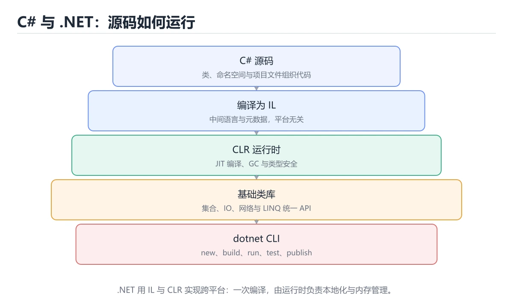
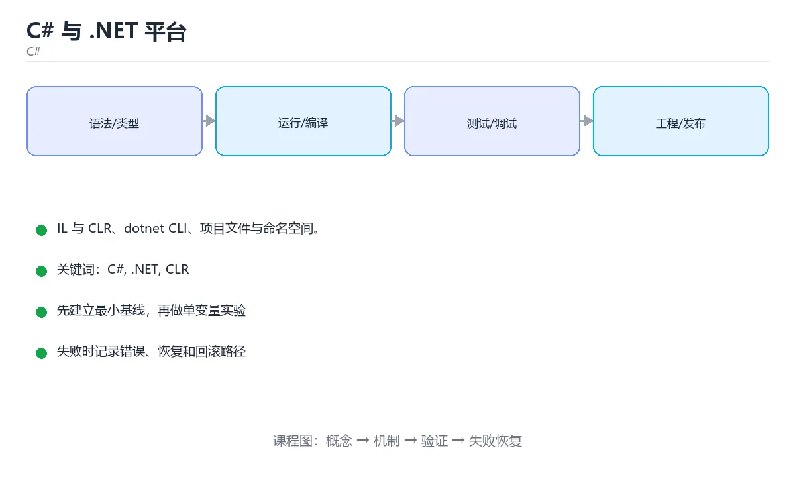

# C# 与 .NET 平台





> 内容更新时间：2026-10-06 · 学习阶段：基础 · 预计用时：50 分钟

## 本节知识框架

**课程定位**：所属分类为「C#」，课程主题为「C# 与 .NET 平台」，学习阶段为「基础」，建议用时 50 分钟。

**本课要解决的主问题**：IL 与 CLR、dotnet CLI、项目文件与命名空间。

| 学习层次 | 要回答的问题 | 完成判据 |
| --- | --- | --- |
| 概念层 | 「C# 与 .NET 平台」有哪些必须区分的对象与术语？ | 能用自己的话定义核心术语，并各举一个正例和一个反例。 |
| 机制层 | 这些对象按什么顺序发生作用，输入如何变成输出？ | 能画出或写出机制步骤，并说明每一步的失败条件。 |
| 应用层 | 什么场景适合使用「C# 与 .NET 平台」，什么场景不适合？ | 能给出一个真实场景、一个最小示例和一个边界案例。 |
| 性能层 | 时间、空间、吞吐或延迟受哪些量影响？ | 能说出复杂度或性能瓶颈的证据来源；没有证据时明确写“材料未提供”。 |
| 复习层 | 怎样确认自己不是只记住了结论？ | 能独立完成本课自测，并把错误定位到概念、机制、示例或边界。 |

### 阅读路线

1. 先读「核心概念定义」，建立「C#」等对象的精确定义。
2. 再读「原理与运行机制」，把定义串成可重复的过程。
3. 用「代码/协议/SQL 示例」验证过程，并只改一个条件观察结果变化。
4. 最后检查性能、易错点、知识关系与自测题，形成可复习的证据链。

**前置知识**：没有硬性先修课；仍建议先具备本分类的基础阅读与操作能力。

**学习位置**：本课位于《C# 方法入门》之后；如果前一课的自测不能通过，应先回补再继续。

**后续衔接**：下一课《变量、类型与字符串》会继续使用本课术语，学完后建议立即完成一次自测。

**教材衔接：学习目标**

- 能用自己的话解释C# 与 .NET 平台解决了什么问题，而不是只背术语。
- 能说清 「C#」、「.NET」、「CLR」、「IL」 之间的关系，并分别举出一个例子。
- 能把 C# 放回「C# 与 .NET 平台」的知识体系，说明它和 .NET 的边界。
- 能完成本课练习，并用验收标准检查自己的结果。

> 一句话摘要：IL 与 CLR、dotnet CLI、项目文件与命名空间。

**教材衔接：前置知识**

- 会进行基本的文件、命令行或浏览器操作；遇到不熟悉的术语先查 C# 的词条。
- 本课阶段：基础。建议先掌握同一分类的基础课程，并能独立运行正文里的 TargetFramework 示例。
- 开始前先复习：C#、.NET、CLR。
- 卡在 C# 上时不要跳过：把输入、预期和实际输出写成三行，再回头读正文。

**教材衔接：本课小结**

C# 代码跑在 .NET 上：**编译成 IL、由 CLR 托管执行**。掌握 `dotnet` CLI 与 csproj 配置即可开始任何类型的项目。

## 核心概念定义

> 阅读约定：本课先给「C# 与 .NET 平台」相关术语的操作性定义与适用边界；正文里的口语化说法与定义冲突时，以定义和可复现示例为准。

| 术语 | 操作性定义 | 本课中的边界 |
| --- | --- | --- |
| Nullable | 开启 Nullable 后编译器会检查可能的空引用，新项目建议默认打开。 | 仅在「C# 与 .NET 平台」明确给出的输入、版本与资源条件下成立。 |
| dotnet | C# 代码跑在 .NET 上：**编译成 IL、由 CLR 托管执行**。掌握 dotnet CLI 与 csproj 配置即可开始任何类型的项目。 | 仅在「C# 与 .NET 平台」明确给出的输入、版本与资源条件下成立。 |
| C# | C# 是运行在 .NET 平台上的编译型语言：源码编译成中间语言（IL）。 | 仅在「C# 与 .NET 平台」明确给出的输入、版本与资源条件下成立。 |
| .csproj | C# 项目文件：声明目标框架、依赖与编译项，dotnet build 依据它生成程序集。 | 仅在「C# 与 .NET 平台」明确给出的输入、版本与资源条件下成立。 |

### 定义如何使用

在「C# 与 .NET 平台」中判断一个说法是否成立，先确认它使用的是哪个对象的定义，再检查输入规模、运行环境与失败路径。定义不是口号，而是后续推导、代码示例和自测题共享的约束。

## 原理与运行机制

### 机制总览

1. **建立输入**：把「Nullable」按本课定义整理成可观察、可重复的输入条件。
2. **执行转换**：围绕「dotnet」执行本课的核心步骤；每一步都记录中间状态，避免只看最终输出。
3. **产生输出**：得到「C#」后，用正文示例或协议/SQL 结果核对输出是否符合预期。
4. **改变一个条件**：只替换一个边界条件或环境参数，观察「C# 与 .NET 平台」的结论是否仍然成立。

| 阶段 | 关注对象 | 失败时应检查 |
| --- | --- | --- |
| 输入 | Nullable | 类型、范围、编码、版本或前置状态是否满足定义。 |
| 处理 | dotnet | 顺序、可见性、锁、路由、事务或调度规则是否被破坏。 |
| 输出 | C# | 结果是否可复现，错误是否被正确传播而不是被吞掉。 |

本课的机制结论要用「C# 与 .NET 平台」自己的示例验证。「C# 与 .NET 平台」没有给出某个数量级、吞吐或内存数据时，本课把该判断标为“材料未提供”，不从相邻主题外推。

**教材衔接：.NET 平台速查**

| 概念 | 说明 |
| --- | --- |
| CLR | 公共语言运行时，负责执行 IL 与内存管理 |
| IL / MSIL | 编译后的中间语言，存放在程序集里 |
| JIT | 运行时把 IL 编译成机器码 |
| AOT | 提前编译成原生代码，启动快、体积大 |
| 程序集（Assembly） | `.dll` / `.exe`，部署与版本单位 |
| NuGet | 包管理器，依赖写在 `.csproj` |
| 目标框架（TFM） | 如 `net8.0`、`net8.0-windows` |
| SDK 样式项目 | 现代 `.csproj`，默认包含源码与隐式 using |

**教材衔接：版本与时效**

- 先确认 SDK 版本，再决定 TargetFramework 是否可以使用新语法或新 API。
- 若使用 AOT 或裁剪，TargetFramework 的反射与动态加载路径需要重点验证。
- 升级前先用 TargetFramework 建立基线：记录版本、命令和输出，升级后只比较这些可观察量。
- 官方说明：https://learn.microsoft.com/dotnet/core/whats-new/

### 升级检查清单

- 先固定当前版本，跑通全部示例与测验，再升级工具链。
- 只改 C# 的版本变量，记录编译、测试与产物体积的变化。
- 升级后重点回归 C# 的默认值、警告信息与错误格式。
- 升级后把 TargetFramework 的实测版本写进「内容元数据」，再更新复核日期。

## 典型应用场景

| 场景 | 典型输入或前提 | 期望产物 |
| --- | --- | --- |
| 学习验证 | 使用本课最小示例和 C#、.NET | 能复现正文结论，并解释每一步。 |
| 工程落地 | 把「C# 与 .NET 平台」放入真实模块或服务边界 | 输出可观测、失败可定位、参数可配置。 |
| 故障排查 | 只改一个版本、规模、输入或依赖条件 | 能区分概念错误、实现错误和环境差异。 |

判断「C# 与 .NET 平台」的场景是否成立，标准是能否写出输入、处理、输出和失败路径；材料中没有出现的数据在本课标注为“材料未提供”，不用推测替代证据。

**课程内置实验入口**：`sandbox:csharp`，用于动手验证《C# 与 .NET 平台》的机制；实验结论不替代概念定义与复杂度分析。

**教材衔接：项目文件**

```xml
<Project Sdk="Microsoft.NET.Sdk">
  <PropertyGroup>
    <OutputType>Exe</OutputType>
    <TargetFramework>net8.0</TargetFramework>
    <Nullable>enable</Nullable>
    <ImplicitUsings>enable</ImplicitUsings>
  </PropertyGroup>
</Project>
```

开启 `Nullable` 后编译器会检查可能的空引用，新项目建议默认打开。

## 代码/协议/SQL 示例

### 最小可验证示例

下面保留《C# 与 .NET 平台》原文中的最小示例。先预测《C# 与 .NET 平台》示例的输出，再按正文步骤运行或推演；示例依赖外部环境时，同时记录版本与输入。

```text
源码 .cs -> Roslyn 编译 -> IL（dll / exe）-> CLR 加载 + JIT -> 本机代码执行
```

**教材衔接：.NET 是什么**

C# 运行在 .NET 平台之上：源码先编译成中间语言（IL），运行时由 CLR（公共语言运行时）通过 JIT 编译成本机代码，并负责垃圾回收与类型安全。

```text
源码 .cs -> Roslyn 编译 -> IL（dll / exe）-> CLR 加载 + JIT -> 本机代码执行
```

常见应用类型：控制台程序、ASP.NET Core Web API、桌面（WPF/WinUI）、游戏（Unity）、移动（MAUI）。

**教材衔接：第一个程序**

```csharp
// Program.cs
namespace Demo;

public class Program
{
    public static void Main(string[] args)
    {
        Console.WriteLine("Hello, C#!");
    }
}
```

也可以使用顶层语句，编译器会自动生成入口方法：

```csharp
Console.WriteLine("Hello, C#!");
```

**教材衔接：dotnet CLI**

```bash
dotnet new console -o Hello          # 新建控制台项目
dotnet run                           # 编译并运行
dotnet build -c Release              # Release 配置构建
dotnet publish -c Release -o out     # 发布产物
dotnet add package Newtonsoft.Json   # 添加 NuGet 包
```

**教材衔接：命名空间**

```csharp
using System.Text;

namespace Demo.Utils
{
    public static class TextHelper
    {
        public static string Repeat(string value, int times) => string.Concat(Enumerable.Repeat(value, times));
    }
}
```

命名空间用点号分层，通常与目录结构对应，用来避免类名冲突。

**教材衔接：dotnet CLI 速查**

| 目的 | 命令 |
| --- | --- |
| 查看版本与 SDK | `dotnet --info` |
| 新建项目 | `dotnet new console -o Hello` |
| 新建 Web API | `dotnet new webapi -o Api` |
| 新建解决方案 | `dotnet new sln -n App` |
| 添加项目到解决方案 | `dotnet sln add Api/Api.csproj` |
| 还原依赖 | `dotnet restore` |
| 编译 | `dotnet build -c Release` |
| 运行 | `dotnet run --project Api` |
| 测试 | `dotnet test` |
| 发布 | `dotnet publish -c Release -o out` |
| 添加包 | `dotnet add package Serilog` |
| 查看过期包 | `dotnet list package --outdated` |
| 全局工具 | `dotnet tool install -g dotnet-ef` |

常用 csproj 配置：

```xml
<Project Sdk="Microsoft.NET.Sdk.Web">
  <PropertyGroup>
    <TargetFramework>net8.0</TargetFramework>
    <Nullable>enable</Nullable>              <!-- 开启可空引用类型分析 -->
    <ImplicitUsings>enable</ImplicitUsings>  <!-- 隐式 using -->
    <TreatWarningsAsErrors>true</TreatWarningsAsErrors>
    <InvariantGlobalization>false</InvariantGlobalization>
  </PropertyGroup>
</Project>
```

**教材衔接：零基础详解：.NET、CLI 与第一个 C# 程序**

### 一句话说清它是什么

C# 是运行在 **.NET** 平台上的编译型语言：源码编译成中间语言（IL），
再由运行时（CLR）在目标机器上即时编译并执行，兼顾性能与跨平台。

### 四个名词一次讲清

| 名词 | 全称 | 比喻 | 说明 |
| --- | --- | --- | --- |
| .NET | 平台 | 一整套工具箱 + 工厂 | 含运行时、类库与工具 |
| CLR | 公共语言运行时 | 工厂里的发动机 | 负责加载、JIT、垃圾回收 |
| IL | 中间语言 | 通用图纸 | 所有 .NET 语言都编译成它 |
| NuGet | 包管理器 | 零件商店 | 装第三方库的地方 |

### 两个文件撑起一个项目

```csharp
// Program.cs
Console.WriteLine("Hello, World!");
```

```xml
<!-- Demo.csproj -->
<Project Sdk="Microsoft.NET.Sdk">
  <PropertyGroup>
    <OutputType>Exe</OutputType>
    <TargetFramework>net9.0</TargetFramework>
    <Nullable>enable</Nullable>
    <ImplicitUsings>enable</ImplicitUsings>
  </PropertyGroup>
</Project>
```

| 配置 | 作用 | 建议 |
| --- | --- | --- |
| `OutputType` | 生成可执行程序还是库 | 控制台程序用 `Exe` |
| `TargetFramework` | 目标框架版本 | 按团队统一，别随意跳 |
| `Nullable` | 开启可空引用类型检查 | **一定开启** |
| `ImplicitUsings` | 自动引入常用命名空间 | 开启后代码更短 |

### 常用命令

```bash
dotnet new console -o Demo     # 新建控制台项目
cd Demo
dotnet run                     # 编译并运行
dotnet build -c Release        # 发布配置构建
dotnet publish -c Release -r linux-x64 --self-contained false
```

### 类、命名空间与入口

```csharp
namespace Demo;                 // 文件作用域命名空间，省一层缩进

public class Greeter
{
    public string Build(string name) => $"你好，{name}！";
}

public static class Program
{
    public static void Main()
    {
        var greeter = new Greeter();
        Console.WriteLine(greeter.Build("小明"));
    }
}
```

顶层语句（直接写 `Console.WriteLine`）适合小脚本；
项目变大后，显式写 `Main` 更清楚。

### 新手最容易踩的八个坑

| 坑 | 现象 | 正确做法 |
| --- | --- | --- |
| 顶层语句与 `Main` 混用 | 报「已定义多个入口点」 | 二选一 |
| 忘写 `using` | 找不到类型 | 补命名空间或开启隐式 using |
| 可空警告被忽略 | 运行时空引用崩溃 | 认真处理 `?` 与 `!` |
| 值类型与引用类型混淆 | 改了副本没生效 | 明确 struct / class 语义 |
| 中文标点 | 编译错误 | 全用英文半角 |
| 命名空间与文件夹不一致 | 类型找不到 | 目录结构跟命名空间对齐 |
| 忘记 `Nullable enable` | 空引用问题逃过检查 | 在 csproj 中开启 |
| 用 `==` 比较字符串 | 结果不确定 | C# 中 `==` 对 string 已重载为比值，但仍要注意 null |

### 手把手练习：命令行小工具

```csharp
using System.Globalization;

Console.Write("请输入摄氏温度：");
var raw = Console.ReadLine();

if (!double.TryParse(raw, CultureInfo.InvariantCulture, out var celsius))
{
    Console.WriteLine("请输入数字，例如 25.5");
    return;
}

var fahrenheit = celsius * 9 / 5 + 32;
Console.WriteLine($"{celsius:F1}℃ = {fahrenheit:F1}℉");
```

`TryParse` 模式是 C# 处理用户输入的规范写法：不抛异常、直接得到布尔结果。

### 学完自测

- [ ] 能说出 .NET、CLR、IL、NuGet 各自是什么。
- [ ] 知道 `dotnet run`、`dotnet build`、`dotnet publish` 的区别。
- [ ] 能解释为什么要开启 `Nullable`。
- [ ] 能说出顶层语句和显式 `Main` 的取舍。
- [ ] 会用 `TryParse` 安全地解析用户输入。

## 时间/空间复杂度或性能分析

**复杂度证据**：「C# 与 .NET 平台」的现有材料没有给出渐近时间或空间复杂度的明确结论，本课只做定性检查，不补写未经验证的 $O$ 记号。

| 维度 | 本课关注点 | 判断依据 |
| --- | --- | --- |
| 时间/延迟 | 「C# 与 .NET 平台」的主要步骤是否会随输入规模、并发度或网络往返增长。 | 以正文复杂度、基准数据或可重复测量为准。 |
| 空间/内存 | 中间状态、缓存、副本、连接或索引是否随规模增长。 | 记录峰值内存与数据副本，不只看最终结果。 |
| 吞吐/资源 | 版本、调度、锁、IO、序列化或协议开销是否成为瓶颈。 | 固定环境做对照实验，改变一个变量。 |

评估「C# 与 .NET 平台」时要区分“正确性成立”和“性能达标”两件事；材料没有给出基准时，本课只保留量级来源与测量方法，不写不可验证的绝对数字。

## 常见误区与易错点

> 复核《C# 与 .NET 平台》的易错点时，优先保留原文的错误表、故障现场与排错路径；每条修正都要能用本课示例复验。

| 易错点 | 常见表现 | 正确做法 |
| --- | --- | --- |
| 只背结论 | 能复述「C# 与 .NET 平台」的定义，却说不清输入、输出与边界。 | 回到机制步骤，用最小示例逐一验证。 |
| 混淆相邻概念 | 把本课对象与相邻主题的对象当成同一类。 | 先比较定义、资源归属、生命周期和失败模式。 |
| 忽略版本与环境 | 在开发机通过后直接外推到生产环境。 | 固定版本、输入和资源条件，再记录可复现结果。 |

**教材衔接：常见错误与排查**

| 报错或现象 | 原因 | 处理方式 |
| --- | --- | --- |
| `The type or namespace name could not be found` | 缺 using 或没装包 | 补 `using` 或 `dotnet add package` |
| `Nullable` 警告大量出现 | 开启可空分析后暴露空值风险 | 逐个处理，不要用 `!` 掩盖 |
| `Program does not contain a static 'Main'` | 入口点缺失 | 补 `Main`，或用顶级语句 |
| 修改代码后运行结果没变 | 运行了旧构建 | `dotnet build` 后确认目标框架与配置 |
| `error NETSDK1045` | SDK 版本低于目标框架 | 安装对应 SDK 或降低 TargetFramework |
| 发布后缺少配置文件 | 未复制到输出目录 | 在 csproj 中设置 `CopyToOutputDirectory` |
| 依赖版本冲突 | 传递依赖不一致 | `dotnet list package --include-transitive` 定位并统一 |
| 本地能跑、服务器报缺运行时 | 服务器只装运行时 | 安装 ASP.NET Core Runtime 或改为自包含发布 |
| `TreatWarningsAsErrors` 打开后构建失败 | 已有告警 | 先清零告警再开启门禁 |
| 用 `dotnet run` 做生产部署 | 环境不一致 | 用 `dotnet publish` 产物部署 |

**教材衔接：故障现场**

### 现场 1：The type or namespace name could not be found

**症状**：在《C# 与 .NET 平台》的复现场景中，缺 using 或没装包。

**根因**：触发点是把“The type or namespace name could not be found”当成安全做法。它没有满足《C# 与 .NET 平台》要求的前提，因此先表现为“缺 using 或没装包”；排查时先完整复现这一段，再核对输入、配置与依赖。

**修复**：针对《C# 与 .NET 平台》的问题，补 using 或 dotnet add package。

**验证**：在《C# 与 .NET 平台》中按“补 using 或 dotnet add package”调整后，从“The type or namespace name could not be found”的触发条件重放同一条路径，确认“缺 using 或没装包”不再出现，并补一个相邻边界用例检查没有引入新问题。

### 现场 2：Nullable 警告大量出现

**症状**：在《C# 与 .NET 平台》的复现场景中，开启可空分析后暴露空值风险。

**根因**：当出现“Nullable 警告大量出现”时，执行路径已经绕过了《C# 与 .NET 平台》的关键约束，最终以“开启可空分析后暴露空值风险”暴露出来；修复前必须先确认约束在哪里失效。

**修复**：针对《C# 与 .NET 平台》的问题，逐个处理，不要用 ! 掩盖。

**验证**：先在《C# 与 .NET 平台》中记录“Nullable 警告大量出现”留下的失败证据，再执行“逐个处理，不要用 ! 掩盖”并重放；确认错误路径变为明确结果，且修复没有掩盖同类故障。

### 现场 3：修改代码后运行结果没变

**症状**：在《C# 与 .NET 平台》的复现场景中，运行了旧构建。

**根因**：“运行了旧构建”只是表层结果。向上追溯会落到“修改代码后运行结果没变”这一步，因为它省略了《C# 与 .NET 平台》的约束，使实现行为和预期模型发生了偏离。

**修复**：针对《C# 与 .NET 平台》的问题，dotnet build 后确认目标框架与配置。

**验证**：在《C# 与 .NET 平台》中按“dotnet build 后确认目标框架与配置”调整后，从“修改代码后运行结果没变”的触发条件重放同一条路径，确认“运行了旧构建”不再出现，并补一个相邻边界用例检查没有引入新问题。

## 与其他知识点的关系

| 关系 | 课程 | 为什么 |
| --- | --- | --- |
| 关联 | 《变量、类型与字符串》 | 用于横向比较或把本课结论迁移到相邻主题。 |
| 前置顺序 | 《C# 方法入门》 | 同分类中安排在本课之前，建议先完成其自测。 |
| 后续顺序 | 《变量、类型与字符串》 | 同分类中安排在本课之后，会继续使用本课术语。 |

把「C# 与 .NET 平台」放回知识体系时，不只要记住“前面学过什么”，还要说明两个主题在输入、机制、资源边界和失败模式上的差异。这样才能把单课知识迁移到项目、排障和后续课程。

## 自测题与参考答案

> 先独立作答《C# 与 .NET 平台》的自测题，再对照答案与解析；每处判断都要能在本课正文或示例中找到依据。

### 自测 1

阅读「C# 与 .NET 平台」正文里的这段 C# 代码，下面哪一项判断是正确的？

```csharp
// Program.cs
namespace Demo;

public class Program
{
    public static void Main(string[] args)
    {
        Console.WriteLine("Hello, C#!");
    }
}
```

A. 这段代码会读取外部输入，结果依赖传入的数据。
B. 这段代码把主要逻辑封装在函数或方法里，需要被调用才会执行。
C. 这段代码包含条件分支，不同输入会走不同的执行路径。
D. 这段代码包含异常处理分支，失败时会走专门的补救路径。

**参考答案**：这段代码把主要逻辑封装在函数或方法里，需要被调用才会执行。

**解析**：题干的正确项是这段代码把主要逻辑封装在函数或方法里，需要被调用才会执行，在「C# 与 .NET 平台」里封装边界决定C#从哪一步开始生效。这段代码出自「C# 与 .NET 平台」的正文示例，围绕C#、.NET、CLR展开；把输入或边界换成空值、极值或失败情况后，结论要以「C# 与 .NET 平台」的实际运行结果为准。“.NET”与「C# 与 .NET 平台」的术语表相呼应，只有符合C#、.NET、CLR约束的“这段代码把主要逻辑封装在函数或方法里”才是正文支持的结论。

### 自测 2

dotnet run 的作用是？

A. 只还原依赖
B. 编译并运行当前项目
C. 启动数据库
D. 发布到 NuGet

**参考答案**：编译并运行当前项目

**解析**：dotnet run 会先构建再运行。在「C# 与 .NET 平台」里，作答时，先用C#建立输入与输出的基线，再把编译并运行当前项目代入边界条件核对，结论才能复现。回到「C# 与 .NET 平台」的正文示例，用“dotnet run 的作用是”走一遍C#、.NET、CLR的完整流程，能复现的结论才可以保留。

### 自测 3

围绕“C# 与 .NET 平台”中的 C#、.NET、CLR，下列哪两项是本课强调的实践判断？

A. 把 .NET 的单次运行结果当成所有版本和规模都成立
B. 学习 C# 时要同时说明输入、输出和失败路径，不能只看正常流程
C. 只要 C# 的常规示例通过，就可以跳过边界与异常路径
D. 验证 .NET 时要固定版本并覆盖边界输入，结论才可复现

**参考答案**：学习 C# 时要同时说明输入、输出和失败路径，不能只看正常流程；验证 .NET 时要固定版本并覆盖边界输入，结论才可复现

**解析**：本课把C# 与 .NET 平台拆成概念、示例与故障现场三部分，因此判断 C# 时必须同时交代输入、输出和失败路径，这使“学习 C# 时要同时说明输入、输出和失败路径，不能只看正常流程”成立。在C# 与 .NET 平台里，判断 .NET 时要固定版本与边界输入，所以“验证 .NET 时要固定版本并覆盖边界输入，结论才可复现”才可复现。

**教材衔接：复习与自测**

- [ ] 能说清 CLR、IL、JIT 与程序集的关系。
- [ ] 会用 `dotnet new`、`build`、`run`、`test`、`publish`。
- [ ] 项目开启 `<Nullable>enable</Nullable>` 并处理告警。
- [ ] 依赖用 NuGet 管理，版本集中在 csproj。
- [ ] 部署使用 `dotnet publish` 的产物。

**教材衔接：动手练习**

> 本课练习重点：围绕「C#、.NET、CLR」完成复述、实验和交付，每个结果都要能被别人检查。

先建最小控制台程序演示 C#，再补异常路径，最后用 dotnet test 验证。

### 练习 1：建立心智模型（10 分钟）

合上教程，用 3～5 句话回答：

1. C# 与 .NET 平台解决了什么问题？
2. 如果没有它，会出现什么具体后果？
3. 它和「.NET」是什么关系？

验收标准：用自己的话解释 C#，并给出一个它不成立的反例。

### 练习 2：做一次可控实验（20 分钟）

从正文中选一个最小示例，完成以下操作：

1. 先预测修改一个参数、输入或步骤后的结果。
2. 再实际执行或逐步推演，记录真实结果。
3. 如果结果与预测不同，写出差异原因。

**验收标准**：五步记录要写进笔记——原例是 TargetFramework，改动落在C#上，结论必须能被他人在同一环境里复现。

### 练习 3：交付一个小结果（30 分钟）

写一个控制台小程序，补一个正例、一个边界值和一个异常路径。

任务要求：

- 结果必须能被别人检查，不能只写“我已经理解了”。
- 至少覆盖「C#」和「.NET」两个关键词。
- 写出 1 个仍然不确定的问题，以及下一步如何验证。

> 提示：时间有限时优先做练习 1 和练习 2；练习 3 可以拆成两次完成。

**教材衔接：可运行练习**

### 任务 1：先跑通，再解释

```bash
dotnet new console -o Hello          # 新建控制台项目
dotnet run                           # 编译并运行
dotnet build -c Release              # Release 配置构建
dotnet publish -c Release -o out     # 发布产物
dotnet add package Newtonsoft.Json   # 添加 NuGet 包
```

### 任务 2：只改一个条件

把「C# 与 .NET 平台」的最小示例复制一份，只改一个条件再跑一次：

- 改动点：把 .NET 换成边界值，其他输入保持原样。
- 预测：先写下「C# 与 .NET 平台」在改动后的输出或错误信息，再运行。
- 记录：对照改动前后的结果，指出差异出在哪一步。
- 验收：换回原条件能复现原结果，改动只影响C#。

### 任务 3：迁移到自己的数据

把 TargetFramework 换成你自己的输入，先保持步骤不变，再比较输出差异。

**教材衔接：本课复习清单**

离开本课前，逐项确认：

- [ ] 不看解析，能说出「C# 源码编译后生成什么？」的判断依据。
- [ ] 不看解析，能说出「dotnet run 的作用是？」的判断依据。
- [ ] 不看解析，能说出「C# 中 using 指令与 using 语句的区别是？」的判断依据。
- [ ] 不看解析，能说出「.NET SDK 与运行时的区别是？」的判断依据。
- [ ] 跑通「C# 与 .NET 平台」的最小示例，并记录一次失败输入的处理方式。
- [ ] 把本课最容易混淆的两个概念写成一句话对照。

| 复盘项 | 记录 |
| --- | --- |
| 已经能独立解释的考点 |  |
| 仍然说不清的概念 |  |
| 下一步验证动作 |  |

---

## 术语速查

| 术语 | 一句话说明 |
| --- | --- |
| `Nullable` | 开启 `Nullable` 后编译器会检查可能的空引用，新项目建议默认打开。 |
| `dotnet` | C# 代码跑在 .NET 上：**编译成 IL、由 CLR 托管执行**。掌握 `dotnet` CLI 与 csproj 配置即可开始任何类型的项目。 |
| `C#` | C# 是运行在 .NET 平台上的编译型语言：源码编译成中间语言（IL）。 |
| `.csproj` | C# 项目文件：声明目标框架、依赖与编译项，dotnet build 依据它生成程序集。 |

## 考点精讲

### 考点 1：代码补全·C#

- **题目**：阅读「C# 与 .NET 平台」正文里的这段 C# 代码，下面哪一项判断是正确的？
- **判断依据**：题干的正确项是这段代码把主要逻辑封装在函数或方法里，需要被调用才会执行，在「C# 与 .NET 平台」里封装边界决定C#从哪一步开始生效。这段代码出自「C# 与 .NET 平台」的正文示例，围绕C#、.NET、CLR展开；把输入或边界换成空值、极值或失败情况后，结论要以「C# 与 .NET 平台」的实际运行结果为准。“.NET”与「C# 与 .NET 平台」的术语表相呼应，只有符合C#、.NET、CLR约束的“这段代码把主要逻辑封装在函数或方法里”才是正文支持的结论。

### 考点 2：概念判断·C#

- **题目**：dotnet run 的作用是？
- **判断依据**：dotnet run 会先构建再运行。在「C# 与 .NET 平台」里，作答时，先用C#建立输入与输出的基线，再把编译并运行当前项目代入边界条件核对，结论才能复现。回到「C# 与 .NET 平台」的正文示例，用“dotnet run 的作用是”走一遍C#、.NET、CLR的完整流程，能复现的结论才可以保留。

### 考点 3：多选辨析·C#

- **题目**：围绕“C# 与 .NET 平台”中的 C#、.NET、CLR，下列哪两项是本课强调的实践判断？
- **判断依据**：本课把C# 与 .NET 平台拆成概念、示例与故障现场三部分，因此判断 C# 时必须同时交代输入、输出和失败路径，这使“学习 C# 时要同时说明输入、输出和失败路径，不能只看正常流程”成立。在C# 与 .NET 平台里，判断 .NET 时要固定版本与边界输入，所以“验证 .NET 时要固定版本并覆盖边界输入，结论才可复现”才可复现。

### 考点 4：概念判断·C#

- **题目**：C# 中 using 指令与 using 语句的区别是？
- **判断依据**：在「C# 与 .NET 平台」里，结论应落在「using 指令引入命名空间」。using 语句会编译成 try/finally 调用 Dispose，是 C# 资源管理的标准写法。在「C# 与 .NET 平台」里，这道题要求区分概念与边界，「using 指令引入命名空间」只有在题干给出的前提下才成立，而「using 语句只能用于文件 IO」、「两者完全一样」缺少同一组条件。

### 考点 5：概念判断·C#

- **题目**：.NET SDK 与运行时的区别是？
- **判断依据**：在「C# 与 .NET 平台」里，SDK 包含编译器与 CLI 工具可以开发，运行时只能执行已编译程序。服务器部署可以只装 ASP.NET Core 运行时，开发机则装 SDK。这道题的关键在「C# 与 .NET 平台」的C#、.NET、CLR：先确认题干“.NET SDK 与运行时的区别是”问的是哪一步，再排除偷换前提的选项。

### 考点 6：填空·C#

- **题目**：补全代码：「C# 与 .NET 平台」示例中，下面这行代码缺少哪个关键字或函数名？请填入 ____。 `Console.____($"{celsius:F1}℃ = {fahrenheit:F1}℉");`
- **判断依据**：在「C# 与 .NET 平台」里，WriteLine。在「C# 与 .NET 平台」里判断这道题，要把C#、.NET、CLR的条件、过程与失败路径逐项对齐，换成“补全代码”这个场景，只有满足前提的结论才成立。“.NET”与「C# 与 .NET 平台」的术语表相呼应，只有符合C#、.NET、CLR约束的“WriteLine”才是正文支持的结论。

## English Overview

**Title:** C# & .NET

**Summary:** IL/CLR, dotnet CLI, project files and namespaces.

**Category:** C#
**Level:** 基础
**Key terms:** C#, .NET, CLR, IL, dotnet, csproj

## 内容元数据

- 内容版本：v2.0
- 最后更新：2026-10-06
- 学习阶段：基础
- 适用环境：.NET 9 / C# 13
；本课聚焦 C#。
- 内容来源：内置结构化课程与工程实践整理
- 相关主题：C#、.NET、CLR、IL、dotnet、csproj
- 质量版本：P0 测验标准 + P1 覆盖扩展 + P2 体验补全

## Full English Study Guide

### Overview

**C# & .NET** focuses on IL/CLR, dotnet CLI, project files and namespaces.

### Learning Outcomes

- Explain what **C# & .NET** solves and when it should be used.

### Glossary

- Topic: **C# & .NET**
- Related terms: C#, .NET, CLR, IL

## Bilingual Section Outline

| 中文小节 | English section |
| --- | --- |
| 学习目标 | Learning objectives |
| 前置知识 | Prerequisites |
| .NET 是什么 | .NET 是什么 |
| 第一个程序 | 第一个程序 |
| dotnet CLI | dotnet CLI |
| 项目文件 | 项目文件 |
| 命名空间 | 命名空间 |
| 本课小结 | Summary |
| .NET 平台速查 | .NET 平台速查 |
| dotnet CLI 速查 | dotnet CLI 速查 |

## 参考资料与复核

- 最后复核：2026-10-04
- 下次复核：2027-03-10
- 复核范围：版本兼容、API 行为、安全建议与工程实践
- 来源性质：官方文档、标准或权威教材；正文为离线教学重组

| 参考资料 | 本课用途 |
| --- | --- |
| [dotnet CLI](https://learn.microsoft.com/dotnet/core/tools/) | 构建、运行与发布命令 |
| [.NET 文档](https://learn.microsoft.com/dotnet/) | 运行时、库与工具链 |
| [C# 指南](https://learn.microsoft.com/dotnet/csharp/) | 语言语法与类型系统 |

> 「C# 与 .NET 平台」的链接用于离线阅读后的延伸核对；App 不会自动联网。
