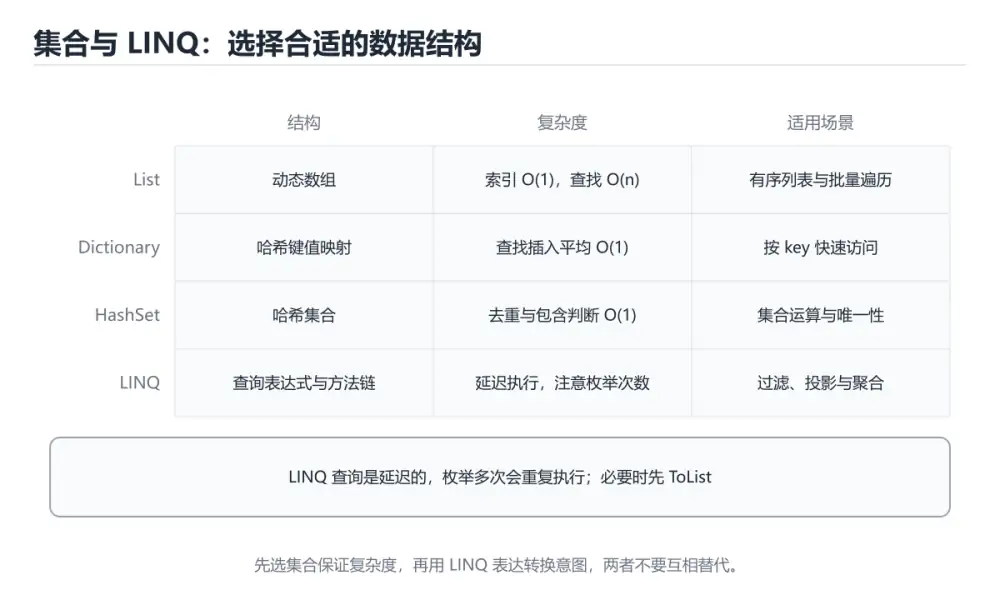

# 集合、委托与 LINQ

> 内容更新时间：2026-10-06 · 学习阶段：进阶 · 预计用时：55 分钟




## 本节知识框架

**课程定位**：所属分类 `csharp`（C#），课程主题 `集合、委托与 LINQ`，学习阶段 进阶，建议用时 50 分钟。

本课主线：List/Dictionary/HashSet、Action/Func/event 与 LINQ 查询。

**学完本课应当能够**
- 说清 `List` 与 `Dictionary` 的含义与区别，并各举一个正例和一个反例。
- 用本课示例验证 `LINQ` 的行为，记录输入、输出与失败条件。
- 遇到「同一个查询反复遍历」这类问题时，能说出触发条件与修复顺序。

### 从概念到验证的学习链条

1. `List`：先掌握 选择原则：有序可重复用 List<T>，键值查找用 Dictionary<TKey,TValue>，去重用 HashSet<T>，再用它解释 `Dictionary` 为什么会出现。
2. `Dictionary`：先掌握 C# 中的键值映射集合，按键快速查找且键通常唯一，再用它解释 `LINQ` 为什么会出现。
3. `LINQ`：先掌握 LINQ 是延迟执行：只写 Where 不会立刻计算，直到 foreach、ToList()、Count() 之类的操作才真正跑，再用它解释 `延迟执行` 为什么会出现。
4. `延迟执行`：先掌握 LINQ 查询在枚举时才真正执行，多次枚举会重复查询，必要时先物化成集合，再用它解释 本课示例的观察结果 为什么会出现。

**先修与衔接**：本课是「C#」分类的第 11 课。先修内容：《继承、接口与多态》。《继承、接口与多态》里的 `virtual`、`is` 是本课的前提。相关或后续课程：《异步编程与异常处理》。

### 完成判据

- **定义关**：不看正文也能说明 `List` 是 选择原则：有序可重复用 List<T>，键值查找用 Dictionary<TKey,TValue>，去重用 HashSet<T>，并指出一个反例。
- **机制关**：能按“输入 → 转换 → 输出 → 验证”复述 `集合、委托与 LINQ`，而不是只背结论。
- **示例关**：能运行或推演 `集合、委托与 LINQ` 的 `csharp` 示例，并说明一个真实出现的标识符或字面量。
- **证据关**：能指出 `集合、委托与 LINQ` 示例里的 调用了 `Add()`，并说明它支持或反驳了本课的哪一条结论。
- **排错关**：能复现 同一个查询反复遍历，记录现象并按 需要复用先 `ToList()` 物化 修复。
- **迁移关**：能把 `List`、`Dictionary`、`HashSet`、`委托` 放进一个与 `集合、委托与 LINQ` 不同的项目场景，并保持输入与验证条件可追踪。
- **复盘关**：学完 `集合、委托与 LINQ` 后，用一句话写下仍然不确定的结论，并列出下一次验证需要的输入、环境和成功判据。

### 复习清单

- [ ] 能不看正文复述本课核心术语，并指出一个边界或反例。
- [ ] 能运行或推演本课示例，记录输入、输出与失败现象。
- [ ] 能完成一次自测，并把错题对照错误表定位原因。

## 核心概念定义

| 术语 | 操作性定义 | 常见边界与风险 |
| --- | --- | --- |
| List | 选择原则：有序可重复用 List<T>，键值查找用 Dictionary<TKey,TValue>，去重用 HashSet<T>。 | 易错：每次都重新计算（延迟执行）；正确做法是需要复用先 `ToList()` 物化。 |
| Dictionary | C# 中的键值映射集合，按键快速查找且键通常唯一。 | 易错：`KeyNotFoundException`；正确做法是用 `TryGetValue`。 |
| LINQ | LINQ 是延迟执行：只写 Where 不会立刻计算，直到 foreach、ToList()、Count() 之类的操作才真正跑。 | 易错：有时不如手写循环；正确做法是热点路径实测。 |
| 延迟执行 | LINQ 查询在枚举时才真正执行，多次枚举会重复查询，必要时先物化成集合。 | 易错：每次都重新计算（延迟执行）；正确做法是需要复用先 `ToList()` 物化。 |

## 原理与运行机制

### 机制总览

**教材衔接：LINQ 常见误用与集合选型**

| 误用 | 后果 | 正确做法 |
| --- | --- | --- |
| 同一个查询反复遍历 | 每次都重新计算（延迟执行） | 需要复用先 `ToList()` 物化 |
| 在循环里查数据库 | N+1 问题，往返次数爆炸 | 先批量取回再内存过滤/分组 |
| 用 `Count() > 0` 判空 | 遍历整个集合 | 用 `Any()`，命中即返回 |
| `Where(...).First()` | 可能抛异常 | 不确定用 `FirstOrDefault()` 并判空 |
| 对已排序数据再 OrderBy | 重复排序开销 | 复用已排序结果或改用 SortedSet |

集合选型速查：需要按下标访问用 `List<T>`；需要按键 O(1) 查找用 `Dictionary<TKey,TValue>`；需要去重或集合运算用 `HashSet<T>`；需要先进先出用 `Queue<T>`、后进先出用 `Stack<T>`；需要并发访问用 `ConcurrentDictionary`。**可变集合不要跨线程共享**，要么加锁，要么用不可变集合（System.Collections.Immutable）。

**教材衔接：集合选型速查**

| 需求 | 首选 | 关键复杂度 | 说明 |
| --- | --- | --- | --- |
| 有序、可重复、按下标访问 | `List<T>` | 访问 O(1) | 默认选择 |
| 去重且不关心顺序 | `HashSet<T>` | 平均 O(1) | 判存在最快 |
| 有序去重 | `SortedSet<T>` | O(log n) | 需要范围查询时用 |
| 键值映射 | `Dictionary<TKey,TValue>` | 平均 O(1) | 键必须可哈希 |
| 有序键值 | `SortedDictionary<TKey,TValue>` | O(log n) | 需要按键排序遍历 |
| 先进先出 | `Queue<T>` | O(1) | 队列 |
| 后进先出 | `Stack<T>` | O(1) | 栈 |
| 双端操作 | `LinkedList<T>` / `Deque`（第三方） | O(1) | 中间插删才考虑链表 |
| 不可变 | `ImmutableArray<T>` / `ImmutableList<T>` | 复制换安全 | 并发共享场景 |
| 线程安全字典 | `ConcurrentDictionary<TKey,TValue>` | 平均 O(1) | 多线程共享 |

**教材衔接：版本与时效**

- .NET 10 是当前 LTS 主线，List 的可用语法取决于 SDK 版本。
- 若使用 AOT 或裁剪，TryGetValue 的反射与动态加载路径需要重点验证。
- 升级前先用 TryGetValue 建立基线：记录版本、命令和输出，升级后只比较这些可观察量。
- 官方说明：https://learn.microsoft.com/dotnet/core/whats-new/

### 升级检查清单

- 先固定当前版本，跑通全部示例与测验，再升级工具链。
- 升级时只动一个依赖版本，用 TryGetValue 记录构建与运行结果。
- 先回归 List 与 Dictionary 的默认行为和错误信息，再扩大测试范围。
- 升级完成后更新本课「最后复核 / 下次复核」日期，并记录 List 的版本变化。

### 机制拆解：每一步的输入、动作与输出

#### 1. `List`
- 输入：`List`；本步把 选择原则：有序可重复用 List<T>，键值查找用 Dictionary<TKey,TValue>，去重用 HashSet<T> 当作判断规则。
- 动作：围绕 `List` 保留中间状态，并记录它与 `Dictionary` 的对应关系。
- 输出：`Dictionary`，它可以被下一段代码、测试或记录继续使用。
- `List` 的失败条件：当同一个查询反复遍历时，会出现每次都重新计算（延迟执行）。

#### 2. `Dictionary`
- 输入：`List`；本步把 C# 中的键值映射集合，按键快速查找且键通常唯一 当作判断规则。
- 动作：围绕 `Dictionary` 保留中间状态，并记录它与 `LINQ` 的对应关系。
- 输出：`LINQ`，它可以被下一段代码、测试或记录继续使用。
- `Dictionary` 的失败条件：当`Dictionary` 用 `[]` 取不存在的键时，会出现`KeyNotFoundException`。

#### 3. `LINQ`
- 输入：`Dictionary`；本步把 LINQ 是延迟执行：只写 Where 不会立刻计算，直到 foreach、ToList()、Count() 之类的操作才真正跑 当作判断规则。
- 动作：围绕 `LINQ` 保留中间状态，并记录它与 `延迟执行` 的对应关系。
- 输出：`延迟执行`，它可以被下一段代码、测试或记录继续使用。
- `LINQ` 的失败条件：当以为 LINQ 一定更快时，会出现有时不如手写循环。

#### 4. `延迟执行`
- 输入：`LINQ`；本步把 LINQ 查询在枚举时才真正执行，多次枚举会重复查询，必要时先物化成集合 当作判断规则。
- 动作：围绕 `延迟执行` 保留中间状态，并记录它与 `Add` 的对应关系。
- 输出：`Add`，它可以被下一段代码、测试或记录继续使用。
- `延迟执行` 的失败条件：当同一个查询反复遍历时，会出现每次都重新计算（延迟执行）。

### 示例中的可观察事实

1. 调用了 `Add()`；它对应的课程主题是 `集合、委托与 LINQ`。
2. 调用了 `Sort()`；它对应的课程主题是 `集合、委托与 LINQ`。
3. 调用了 `TryGetValue()`；它对应的课程主题是 `集合、委托与 LINQ`。
4. 出现字面量 `math`；它对应的课程主题是 `集合、委托与 LINQ`。
5. 出现字面量 `english`；它对应的课程主题是 `集合、委托与 LINQ`。
6. 调用了 `Calculator()`；它对应的课程主题是 `集合、委托与 LINQ`。
7. 调用了 `WriteLine()`；它对应的课程主题是 `集合、委托与 LINQ`。
8. 调用了 `Click()`；它对应的课程主题是 `集合、委托与 LINQ`。

### 复现实验记录

- 环境：`集合、委托与 LINQ` 使用 `csharp` 示例，固定 `List`、`Dictionary`、`HashSet`、`委托` 作为第一组条件。
- 首轮输入：先确认 调用了 `Add()`，预测 `List` 会怎样变化。
- 基线观察：记录命令、输入、输出和错误原文，不用截图代替可复制的文本。
- 单变量修改：只改变 `List`，观察 `延迟执行` 是否仍满足定义。
- 失败注入：复现 同一个查询反复遍历，确认现象是 每次都重新计算（延迟执行）。
- 记录结论：把“修改前、修改后、预期变化、实际变化”写成四列表，这样复盘 `集合、委托与 LINQ` 时才能区分概念错误与实现错误。

## 典型应用场景

**课程内置实验入口**：`sandbox:csharp`，用于动手验证《集合、委托与 LINQ》的机制；实验结论不替代概念定义与复杂度分析。

- **同一个查询反复遍历**：典型现象是每次都重新计算（延迟执行）；正确做法是需要复用先 `ToList()` 物化。
- **在循环里查数据库**：典型现象是N+1 问题，往返次数爆炸；正确做法是先批量取回再内存过滤/分组。
- **用 `Count() > 0` 判空**：典型现象是遍历整个集合；正确做法是用 `Any()`，命中即返回。
- **`Where(...).First()`**：典型现象是可能抛异常；正确做法是不确定用 `FirstOrDefault()` 并判空。

### 最小验证场景

- 准备：保留 `csharp` 示例的原始输入，先记录 `集合、委托与 LINQ` 的基线输出和完整运行命令。
- 观察：先核对 调用了 `Add()`，再改变一个与 `List` 相关的条件。
- 判定：新结果与 `集合、委托与 LINQ` 的基线不同不等于错误；只有当差异破坏了 `List` 的定义或错误表中的约束，才判定为失败。

### 选择与边界

- 使用 `List` 时，先满足它的定义：选择原则：有序可重复用 List<T>，键值查找用 Dictionary<TKey,TValue>，去重用 HashSet<T>；易错：每次都重新计算（延迟执行）；正确做法是需要复用先 `ToList()` 物化。
- 使用 `Dictionary` 时，先满足它的定义：C# 中的键值映射集合，按键快速查找且键通常唯一；易错：`KeyNotFoundException`；正确做法是用 `TryGetValue`。
- 使用 `LINQ` 时，先满足它的定义：LINQ 是延迟执行：只写 Where 不会立刻计算，直到 foreach、ToList()、Count() 之类的操作才真正跑；易错：有时不如手写循环；正确做法是热点路径实测。
- 使用 `延迟执行` 时，先满足它的定义：LINQ 查询在枚举时才真正执行，多次枚举会重复查询，必要时先物化成集合；易错：每次都重新计算（延迟执行）；正确做法是需要复用先 `ToList()` 物化。

## 代码/协议/SQL 示例

### 最小可验证示例

```csharp
var list = new List<int> { 3, 1, 2 };
list.Add(4);
list.Sort();

var map = new Dictionary<string, int> { ["math"] = 90 };
map.TryGetValue("english", out int score);       // 安全取值，不抛异常

var set = new HashSet<string> { "a", "a", "b" }; // 去重
var queue = new Queue<int>();                    // 先进先出
var stack = new Stack<int>();                    // 后进先出
```

**教材衔接：常用集合**

选择原则：有序可重复用 `List<T>`，键值查找用 `Dictionary<TKey,TValue>`，去重用 `HashSet<T>`。

**教材衔接：委托、Lambda 与事件**

```csharp
delegate int Calculator(int a, int b);           // 自定义委托
Calculator add = (a, b) => a + b;

Action<string> log = message => Console.WriteLine(message);   // 无返回值
Func<int, int, int> multiply = (a, b) => a * b;              // 有返回值
Predicate<int> isEven = n => n % 2 == 0;

public class Button
{
    public event Action? Clicked;                 // 事件：基于委托
    public void Click() => Clicked?.Invoke();
}
```

委托是类型安全的方法指针，lambda 是匿名方法的简写，事件是对委托的封装（外部只能订阅/取消）。

**教材衔接：LINQ 查询**

```csharp
var users = new[]
{
    new { Name = "tom", Age = 18 },
    new { Name = "alice", Age = 25 },
    new { Name = "bob", Age = 30 },
};

var names = users.Where(u => u.Age >= 20)
                 .OrderBy(u => u.Age)
                 .Select(u => u.Name)
                 .ToList();

int total = users.Sum(u => u.Age);
var groups = users.GroupBy(u => u.Age >= 20 ? "adult" : "teen");
var first = users.FirstOrDefault(u => u.Name == "nobody");

// 查询语法
var result = from u in users
             where u.Age > 20
             orderby u.Age descending
             select u.Name;
```

LINQ 是**延迟执行**的：只有遍历或调用 `ToList`/`Count`/`Sum` 时才真正执行。多次遍历同一个查询会重复计算，需要复用就提前 `ToList()`。

**教材衔接：LINQ 速查**

| 目的 | 写法 |
| --- | --- |
| 过滤 | `Where(x => x.Active)` |
| 映射 | `Select(x => x.Name)` |
| 展平 | `SelectMany(x => x.Items)` |
| 排序 | `OrderBy(x => x.Age).ThenBy(x => x.Name)` |
| 取前 N | `Take(10)`、`Skip(20).Take(10)` |
| 判断存在 | `Any()`、`Any(x => x.Age > 18)` |
| 全部满足 | `All(x => x.Active)` |
| 首个匹配 | `FirstOrDefault(x => x.Id == id)` |
| 聚合 | `Sum()`、`Average()`、`Max()`、`Count()` |
| 归约 | `Aggregate(seed, (acc, x) => ...)` |
| 分组 | `GroupBy(x => x.Category)` |
| 去重 | `Distinct()`、`DistinctBy(x => x.Id)` |
| 转集合 | `ToList()`、`ToArray()`、`ToDictionary(x => x.Id)` |
| 连接 | `Join`、`GroupJoin` |
| 集合运算 | `Union`、`Intersect`、`Except` |

```csharp
// 分组统计：每个类目的总额与数量
var summary = orders
    .Where(o => o.Paid)
    .GroupBy(o => o.Category)
    .Select(g => new
    {
        Category = g.Key,
        Count = g.Count(),
        Total = g.Sum(o => o.Amount),
    })
    .OrderByDescending(x => x.Total)
    .ToList();

// 用字典做 O(1) 查找，避免嵌套循环
var usersById = users.ToDictionary(u => u.Id);
foreach (var order in orders)
{
    if (usersById.TryGetValue(order.UserId, out var user))
    {
        Console.WriteLine($"{user.Name}: {order.Amount}");
    }
}
```

**教材衔接：零基础详解：集合选择与 LINQ 查询**

### 一句话说清它是什么

集合负责存数据，LINQ 负责查数据。
LINQ 是 C# 的杀手锏：**用一串链式方法描述「我要什么」，而不是写循环描述「怎么找」**。

### 集合怎么选

| 集合 | 特点 | 什么时候用 |
| --- | --- | --- |
| `List<T>` | 有序、可重复、按下标访问 | **默认选择** |
| `Dictionary<K,V>` | 键值对、按 key 查找 O(1) | 需要快速查找或去重 |
| `HashSet<T>` | 不重复、无序 | 去重、判断存在 |
| `Queue<T>` | 先进先出 | 任务队列、广度优先 |
| `Stack<T>` | 后进先出 | 撤销、括号匹配 |
| `LinkedList<T>` | 频繁中间插入删除 | 少用，先测性能 |

```csharp
using System.Collections.Generic;

var names = new List<string> { "小明", "小红" };
names.Add("小刚");
names.Remove("小红");

var ages = new Dictionary<string, int> { ["小明"] = 18 };
ages["小红"] = 20;
if (ages.TryGetValue("小刚", out var age)) { }

var tags = new HashSet<string> { "csharp", "dotnet" };
tags.Add("csharp");                 // 重复，不生效
Console.WriteLine(tags.Count);       // 2
```

### LINQ 的两套写法

```csharp
var scores = new[] { 88, 95, 59, 72, 95 };

// 1. 方法语法（最常用）
var passed = scores.Where(s => s >= 60).OrderByDescending(s => s).ToList();

// 2. 查询语法（贴近 SQL，复杂连接时可读性更好）
var query = from s in scores
            where s >= 60
            orderby s descending
            select s;
```

两种写法完全等价，选一种保持统一即可。

### 常用方法速查

| 方法 | 作用 | 返回 |
| --- | --- | --- |
| `Where` | 过滤 | 序列 |
| `Select` | 映射或投影 | 序列 |
| `OrderBy` / `ThenBy` | 排序 | 序列 |
| `FirstOrDefault` | 取第一个，可能没有 | 元素或默认值 |
| `Any` / `All` | 是否存在或是否全部 | bool |
| `GroupBy` | 分组 | 分组序列 |
| `Sum` / `Average` / `Max` | 聚合 | 数值 |
| `Distinct` | 去重 | 序列 |
| `Take` / `Skip` | 分页 | 序列 |

**LINQ 是延迟执行**：只写 `Where` 不会立刻计算，直到 `foreach`、`ToList()`、`Count()` 之类的操作才真正跑。

### 一个完整的查询例子

```csharp
record Student(string Name, string Team, int Score);

var students = new[]
{
    new Student("小明", "A", 88),
    new Student("小红", "B", 95),
    new Student("小刚", "A", 59),
    new Student("小美", "B", 72),
};

var report = students
    .Where(s => s.Score >= 60)
    .GroupBy(s => s.Team)
    .Select(g => new
    {
        Team = g.Key,
        Count = g.Count(),
        Average = Math.Round(g.Average(s => s.Score), 1),
        Top = g.OrderByDescending(s => s.Score).First().Name,
    })
    .OrderByDescending(x => x.Average)
    .ToList();

foreach (var row in report)
{
    Console.WriteLine($"{row.Team} 队：{row.Count} 人，均分 {row.Average}，最高 {row.Top}");
}
```

### 新手最容易踩的八个坑

| 坑 | 现象 | 正确做法 |
| --- | --- | --- |
| 忘了 `ToList()` | 每次遍历都重新查询 | 需要复用结果就固化 |
| 在循环里反复查数据库 | 性能极差 | 一次查出来再遍历，或用 `Contains` 批量 |
| 用 `First()` 取可能为空的数据 | 抛 `InvalidOperationException` | 用 `FirstOrDefault()` |
| `OrderBy` 后想二次排序 | 只按第一个键 | 接 `ThenBy` |
| 修改集合时遍历 | 抛 `InvalidOperationException` | 先 `ToList()` 再改 |
| 用 `Count()` 判空 | 大集合要遍历完整 | 用 `Any()` |
| 以为 LINQ 一定更快 | 有时不如手写循环 | 热点路径实测 |
| 忽略延迟执行 | 数据源变了结果也变 | 需要快照就 `ToList()` |

### 手把手练习：分页与统计

```csharp
var all = Enumerable.Range(1, 53).Select(i => new { Id = i, Score = (i * 37) % 100 });

int pageSize = 10, page = 2;

var pageItems = all
    .OrderByDescending(x => x.Score)
    .Skip((page - 1) * pageSize)
    .Take(pageSize)
    .ToList();

Console.WriteLine($"共 {all.Count()} 条，第 {page} 页 {pageItems.Count} 条");
Console.WriteLine($"最高分 {all.Max(x => x.Score)}，平均 {all.Average(x => x.Score):F1}");
Console.WriteLine($"及格 {all.Count(x => x.Score >= 60)} 人");
```

### 学完自测

- [ ] 能说出 List、Dictionary、HashSet 各自适合的场景。
- [ ] 能写出方法语法和查询语法的等价写法。
- [ ] 知道 LINQ 的延迟执行意味着什么。
- [ ] 知道为什么判空要用 `Any()` 而不是 `Count() > 0`。
- [ ] 能用 `GroupBy` 加 `Select` 生成分组报表。

**运行方式**：运行 `集合、委托与 LINQ` 的示例时，用 `dotnet run` 运行；先确认 SDK 版本与项目文件一致。

### 示例精读：先找证据，再改一个条件

1. 调用了 `Add()`；它出现在 `集合、委托与 LINQ` 的示例中，阅读时先确认它前后各发生了什么。
2. 调用了 `Sort()`；它出现在 `集合、委托与 LINQ` 的示例中，阅读时先确认它前后各发生了什么。
3. 调用了 `TryGetValue()`；它出现在 `集合、委托与 LINQ` 的示例中，阅读时先确认它前后各发生了什么。
4. 出现字面量 `math`；它出现在 `集合、委托与 LINQ` 的示例中，阅读时先确认它前后各发生了什么。
5. 出现字面量 `english`；它出现在 `集合、委托与 LINQ` 的示例中，阅读时先确认它前后各发生了什么。
6. 调用了 `Calculator()`；它出现在 `集合、委托与 LINQ` 的示例中，阅读时先确认它前后各发生了什么。
7. 调用了 `WriteLine()`；它出现在 `集合、委托与 LINQ` 的示例中，阅读时先确认它前后各发生了什么。
8. 调用了 `Click()`；它出现在 `集合、委托与 LINQ` 的示例中，阅读时先确认它前后各发生了什么。
- 在 `集合、委托与 LINQ` 中与 `List` 对照：示例必须能支持 选择原则：有序可重复用 List<T>，键值查找用 Dictionary<TKey,TValue>，去重用 HashSet<T>，否则说明这一段还缺少实现或验证步骤。
- 在 `集合、委托与 LINQ` 中与 `Dictionary` 对照：示例必须能支持 C# 中的键值映射集合，按键快速查找且键通常唯一，否则说明这一段还缺少实现或验证步骤。
- 在 `集合、委托与 LINQ` 中与 `LINQ` 对照：示例必须能支持 LINQ 是延迟执行：只写 Where 不会立刻计算，直到 foreach、ToList()、Count() 之类的操作才真正跑，否则说明这一段还缺少实现或验证步骤。
- 在 `集合、委托与 LINQ` 中与 `延迟执行` 对照：示例必须能支持 LINQ 查询在枚举时才真正执行，多次枚举会重复查询，必要时先物化成集合，否则说明这一段还缺少实现或验证步骤。

## 时间/空间复杂度或性能分析

**复杂度证据**：本课正文出现 `O(1)`、`O(log n)` 等量级表达式；使用前要同时确认输入规模、最好/平均/最坏情况以及常数项来源。

**测量方法**：以 `集合、委托与 LINQ` 的 `List` 场景为对象，固定输入跑一遍记录基线，再把规模或并发度提高一个数量级复测；两次结果的差值与波动范围才是结论依据。

### 需要控制的变量与记录项

- `集合、委托与 LINQ` 的 `List`：固定它的版本、输入范围和资源上限，分别记录速度、内存与失败率的变化。
- `集合、委托与 LINQ` 的 `Dictionary`：固定它的版本、输入范围和资源上限，分别记录速度、内存与失败率的变化。
- `集合、委托与 LINQ` 的 `HashSet`：固定它的版本、输入范围和资源上限，分别记录速度、内存与失败率的变化。
- `集合、委托与 LINQ` 的 `委托`：固定它的版本、输入范围和资源上限，分别记录速度、内存与失败率的变化。
- `集合、委托与 LINQ` 的 `LINQ`：固定它的版本、输入范围和资源上限，分别记录速度、内存与失败率的变化。
- `集合、委托与 LINQ` 中 `List` 的边界：易错：每次都重新计算（延迟执行）；正确做法是需要复用先 `ToList()` 物化。达到边界时不要外推，必须重新测量。
- `集合、委托与 LINQ` 中 `Dictionary` 的边界：易错：`KeyNotFoundException`；正确做法是用 `TryGetValue`。达到边界时不要外推，必须重新测量。
- `集合、委托与 LINQ` 中 `LINQ` 的边界：易错：有时不如手写循环；正确做法是热点路径实测。达到边界时不要外推，必须重新测量。
- `集合、委托与 LINQ` 中 `延迟执行` 的边界：易错：每次都重新计算（延迟执行）；正确做法是需要复用先 `ToList()` 物化。达到边界时不要外推，必须重新测量。
- `集合、委托与 LINQ` 的代码证据：先验证 调用了 `Add()`，再记录该路径的输入规模与耗时；只看代码行数不能推出复杂度。

## 常见误区与易错点

| 容易写错的做法 | 实际现象 | 原因与正确做法 |
| --- | --- | --- |
| 同一个查询反复遍历 | 每次都重新计算（延迟执行） | 需要复用先 `ToList()` 物化 |
| 在循环里查数据库 | N+1 问题，往返次数爆炸 | 先批量取回再内存过滤/分组 |
| 用 `Count() > 0` 判空 | 遍历整个集合 | 用 `Any()`，命中即返回 |
| `Where(...).First()` | 可能抛异常 | 不确定用 `FirstOrDefault()` 并判空 |
| 对已排序数据再 OrderBy | 重复排序开销 | 复用已排序结果或改用 SortedSet |
| 忘了 `ToList()` | 每次遍历都重新查询 | 需要复用结果就固化 |
| 在循环里反复查数据库 | 性能极差 | 一次查出来再遍历，或用 `Contains` 批量 |
| 用 `First()` 取可能为空的数据 | 抛 `InvalidOperationException` | 用 `FirstOrDefault()` |
| `OrderBy` 后想二次排序 | 只按第一个键 | 接 `ThenBy` |
| 修改集合时遍历 | 抛 `InvalidOperationException` | 先 `ToList()` 再改 |
| 用 `Count()` 判空 | 大集合要遍历完整 | 用 `Any()` |
| 以为 LINQ 一定更快 | 有时不如手写循环 | 热点路径实测 |
| 忽略延迟执行 | 数据源变了结果也变 | 需要快照就 `ToList()` |
| 反复枚举同一个 `IEnumerable` | 重复查询数据库，性能差 | 用 `ToList()` 物化一次 |
| 忘记 LINQ 是延迟执行 | 数据变化后才执行、异常延后抛出 | 明确物化时机 |
| 在循环里 `FirstOrDefault` 查数据库 | N+1 查询 | 先批量取回，再用字典查找 |
| 用 `Count() > 0` 判存在 | 可能遍历整个序列 | 用 `Any()` |
| `SingleOrDefault` 用在可能多条的场景 | 抛 `InvalidOperationException` | 需要首条用 `FirstOrDefault` |
| `First()` 找不到时 | 抛异常 | 用 `FirstOrDefault` 并判空 |
| `Dictionary` 用 `[]` 取不存在的键 | `KeyNotFoundException` | 用 `TryGetValue` |
| 修改正在遍历的集合 | `InvalidOperationException` | 先收集改动或遍历副本 |
| 自定义类型做 `HashSet` 元素 | 去重失效 | 重写 `Equals` + `GetHashCode`，或用 record |
| 多线程共享 `Dictionary` | 数据损坏或异常 | 用 `ConcurrentDictionary` |
| 反复枚举同一个 IEnumerable | 重复查询数据库，性能差。 | 用 ToList() 物化一次。 |
| 在循环里 FirstOrDefault 查数据库 | N+1 查询。 | 先批量取回，再用字典查找。 |

### 现场 1：同一个查询反复遍历

**症状**：每次都重新计算（延迟执行）。

**根因与修复**：需要复用先 `ToList()` 物化。

**自检**：在本课示例里复现「同一个查询反复遍历」，改成需要复用先 `ToList()` 物化后重跑；如果症状消失且失败路径按预期变化，说明定位正确。

### 现场 2：在循环里查数据库

**症状**：N+1 问题，往返次数爆炸。

**根因与修复**：先批量取回再内存过滤/分组。

**自检**：在本课示例里复现「在循环里查数据库」，改成先批量取回再内存过滤/分组后重跑；如果症状消失且失败路径按预期变化，说明定位正确。

### 现场 3：用 `Count() > 0` 判空

**症状**：遍历整个集合。

**根因与修复**：用 `Any()`，命中即返回。

**自检**：在本课示例里复现「用 `Count() > 0` 判空」，改成用 `Any()`，命中即返回后重跑；如果症状消失且失败路径按预期变化，说明定位正确。

### 现场 4：`Where(...).First()`

**症状**：可能抛异常。

**根因与修复**：不确定用 `FirstOrDefault()` 并判空。

**自检**：在本课示例里复现「`Where(...).First()`」，改成不确定用 `FirstOrDefault()` 并判空后重跑；如果症状消失且失败路径按预期变化，说明定位正确。

### 现场 5：对已排序数据再 OrderBy

**症状**：重复排序开销。

**根因与修复**：复用已排序结果或改用 SortedSet。

**自检**：在本课示例里复现「对已排序数据再 OrderBy」，改成复用已排序结果或改用 SortedSet后重跑；如果症状消失且失败路径按预期变化，说明定位正确。

### 现场 6：忘了 `ToList()`

**症状**：每次遍历都重新查询。

**根因与修复**：需要复用结果就固化。

**自检**：在本课示例里复现「忘了 `ToList()`」，改成需要复用结果就固化后重跑；如果症状消失且失败路径按预期变化，说明定位正确。

### 现场 7：在循环里反复查数据库

**症状**：性能极差。

**根因与修复**：一次查出来再遍历，或用 `Contains` 批量。

**自检**：在本课示例里复现「在循环里反复查数据库」，改成一次查出来再遍历，或用 `Contains` 批量后重跑；如果症状消失且失败路径按预期变化，说明定位正确。

### 现场 8：用 `First()` 取可能为空的数据

**症状**：抛 `InvalidOperationException`。

**根因与修复**：用 `FirstOrDefault()`。

**自检**：在本课示例里复现「用 `First()` 取可能为空的数据」，改成用 `FirstOrDefault()`后重跑；如果症状消失且失败路径按预期变化，说明定位正确。

### 现场 9：`OrderBy` 后想二次排序

**症状**：只按第一个键。

**根因与修复**：接 `ThenBy`。

**自检**：在本课示例里复现「`OrderBy` 后想二次排序」，改成接 `ThenBy`后重跑；如果症状消失且失败路径按预期变化，说明定位正确。

## 与其他知识点的关系

- **先修**：`继承、接口与多态`。本课默认这些内容已经掌握。
- **相关或后续**：`异步编程与异常处理`。本课术语会在这些课程里继续使用。
- **术语归属**：`List`、`Dictionary`、`LINQ` 的定义以本课「核心概念定义」为准，换到其他课程时先确认定义是否被改写。

### 先修与后续术语接口

- `继承、接口与多态`：两者通过本分类的学习顺序衔接，阅读时重点比较各自的输入与失败条件。
- `异步编程与异常处理`：两者通过本分类的学习顺序衔接，阅读时重点比较各自的输入与失败条件。

### 容易混淆的相邻概念

- `List` 与 `Dictionary`：前者强调 选择原则：有序可重复用 List<T>，键值查找用 Dictionary<TKey,TValue>，去重用 HashSet<T>；后者强调 C# 中的键值映射集合，按键快速查找且键通常唯一。判断时分别检查两条定义的适用范围，不要只看名称相似就互换。
- `Dictionary` 与 `LINQ`：前者强调 C# 中的键值映射集合，按键快速查找且键通常唯一；后者强调 LINQ 是延迟执行：只写 Where 不会立刻计算，直到 foreach、ToList()、Count() 之类的操作才真正跑。判断时分别检查两条定义的适用范围，不要只看名称相似就互换。
- `LINQ` 与 `延迟执行`：前者强调 LINQ 是延迟执行：只写 Where 不会立刻计算，直到 foreach、ToList()、Count() 之类的操作才真正跑；后者强调 LINQ 查询在枚举时才真正执行，多次枚举会重复查询，必要时先物化成集合。判断时分别检查两条定义的适用范围，不要只看名称相似就互换。

## 自测题与参考答案

> 先独立作答，再对照参考答案；答案都能在本课正文、术语表或错误表里找到依据。

### 自测 1（概念复述）

不看正文，写出 `List` 的操作性定义，并说明它与 `Dictionary` 的区别。

**参考答案**：选择原则：有序可重复用 List<T>，键值查找用 Dictionary<TKey,TValue>，去重用 HashSet<T>。

`Dictionary` 的定位是：C# 中的键值映射集合，按键快速查找且键通常唯一；两者的差别要从适用对象与失败模式上说明。

### 自测 2（排错）

本课错误表记录了「同一个查询反复遍历」这类做法。请写出它会出现的现象、根因，以及修复顺序。

**参考答案**：现象是每次都重新计算（延迟执行）；正确做法是需要复用先 `ToList()` 物化。修复时先复现现象并保留证据，再改动一处假设重跑，确认现象消失。

### 自测 3（动手验证）

运行本课的 `csharp` 示例，把其中的 `"math"` 换成一个边界值后重新运行，记录输出与错误信息。

**参考答案**：正常输入下 `csharp` 示例应当复现正文给出的结果；把 `"math"` 换成边界值后，如果结果改变或报错，先核对它是否满足 `集合、委托与 LINQ` 中`List` 的适用范围，再检查错误表里是否有同类现象。

### 自测 4（代码阅读）

阅读本课开头的 `csharp` 示例，说明它体现了`List` 的哪一条性质，并指出改动哪个输入会让这条性质不再成立。

**参考答案**：`List` 的定义是 选择原则：有序可重复用 List<T>，键值查找用 Dictionary<TKey,TValue>，去重用 HashSet<T>，示例正是在实现这条定义。改动与 `List` 有关的一个输入后，如果结果不再符合 `集合、委托与 LINQ` 的正文描述，就说明该性质只在当前前提成立。

### 自测 5（迁移）

把 `集合、委托与 LINQ` 的方法迁移到自己的项目：围绕 `List` 写出一个与错误表同类的风险点，并说明触发条件和检验方式。

**参考答案**：例如「在循环里 FirstOrDefault 查数据库」，它会导致N+1 查询；检验方式是按先批量取回，再用字典查找改一处再复现，确认现象消失且没有引入新的失败分支。

### 自测 6（对比）

用一个表格对比 `List` 与 `Dictionary`：各写一行适用场景、一行失败表现。

**参考答案**：`List` 的定义是选择原则：有序可重复用 List<T>，键值查找用 Dictionary<TKey,TValue>，去重用 HashSet<T>；`Dictionary` 的定义是C# 中的键值映射集合，按键快速查找且键通常唯一。两者的失败表现分别对应本课错误表里与本术语相关的行。

### 自测 7（排错顺序）

面对「同一个查询反复遍历」引发的问题，请把“复现 每次都重新计算（延迟执行） → 保留证据 → 需要复用先 `ToList()` 物化 → 回归验证”四步写成可执行的检查清单。

**参考答案**：第一步按每次都重新计算（延迟执行）复现；第二步记录输入、版本与完整报错；第三步按需要复用先 `ToList()` 物化只改一处；第四步重跑并确认失败路径也按预期变化。

### 自测 8（边界判断）

针对 `延迟执行`，分别写出“可以使用”的条件和“结论不再成立”的条件。

**参考答案**：易错：每次都重新计算（延迟执行）；正确做法是需要复用先 `ToList()` 物化。 同时要把 `延迟执行` 的定义 LINQ 查询在枚举时才真正执行，多次枚举会重复查询，必要时先物化成集合 与实际输入逐项对照。

### 自测 9（机制重建）

不看正文，按输入、转换、输出、验证四段重建 `List` → `Dictionary` → `LINQ` → `延迟执行` 的作用链。

**参考答案**：起点是 `List` 的定义 选择原则：有序可重复用 List<T>，键值查找用 Dictionary<TKey,TValue>，去重用 HashSet<T>；中间每一步都保留可观察状态；终点由 `延迟执行` 检查，失败时回到错误表定位第一个偏离定义的步骤。

### 自测 10（综合排错）

在 `集合、委托与 LINQ` 中，现象是 N+1 查询。请围绕 在循环里 FirstOrDefault 查数据库 写出最小复现、关键证据、修复动作和回归验证，并说明为什么不能只凭一次运行下结论。

**参考答案**：先复现 在循环里 FirstOrDefault 查数据库，记录输入与完整错误；再按 先批量取回，再用字典查找 只改一处。回归时同时跑正常路径和边界路径，只有两次结果都可解释，才把修复视为完成。

### 自测 11（一分钟复述）

用每分钟约 200 字的速度复述 `集合、委托与 LINQ`：先给主问题，再按顺序说出 `List`、`Dictionary`、`LINQ`、`延迟执行`，最后给一个失败案例。

**自评标准**：主问题必须对应 List/Dictionary/HashSet、Action/Func/event 与 LINQ 查询；每个术语都要能接上一句定义或边界；失败案例必须写成可观察现象，不能用“可能有风险”代替证据。

## 术语速查

| 术语 | 一句话说明 |
| --- | --- |
| `List` | 选择原则：有序可重复用 List<T>，键值查找用 Dictionary<TKey,TValue>，去重用 HashSet<T>。 |
| `Dictionary` | C# 中的键值映射集合，按键快速查找且键通常唯一。 |
| `LINQ` | LINQ 是延迟执行：只写 Where 不会立刻计算，直到 foreach、ToList()、Count() 之类的操作才真正跑。 |
| `延迟执行` | LINQ 查询在枚举时才真正执行，多次枚举会重复查询，必要时先物化成集合。 |

**术语关系**：`List`（选择原则：有序可重复用 List<T>） → `Dictionary`（C# 中的键值映射集合） → `LINQ`（LINQ 是延迟执行：只写 Where 不会立刻计算） → `延迟执行`（LINQ 查询在枚举时才真正执行）。

## 考点精讲

`集合、委托与 LINQ` 的题库有 6 道题，下面逐题给出题干、正确项与判断依据：先自己作答，再核对正确项，最后回到正文对应小节复核。

### 考点 1：第 1 题

- **题目**：阅读 `集合、委托与 LINQ` 的 `List` 示例。它服务于List/Dictionary/HashSet、Action/Func/event 与 LINQ 查询。代码中实际包含下列哪一项？
- **正确项**：调用了 `Click()`
- **判断依据**：这道题落在术语 `List` 上：选择原则：有序可重复用 List<T>，键值查找用 Dictionary<TKey,TValue>，去重用 HashSet<T>。复习时把 `List` 的定义、适用边界和一个反例一起说清楚，再回到「核心概念定义」核对原文。

### 考点 2：第 2 题

- **题目**：LINQ 查询是什么时候执行的？
- **正确项**：遍历结果或调用 ToList/Count 等终止操作时
- **判断依据**：这道题落在术语 `List` 上：选择原则：有序可重复用 List<T>，键值查找用 Dictionary<TKey,TValue>，去重用 HashSet<T>。复习时把 `List` 的定义、适用边界和一个反例一起说清楚，再回到「核心概念定义」核对原文。

### 考点 3：第 3 题

- **题目**：Func<int, int, int> 表示什么？
- **正确项**：接收两个 int 返回 int 的委托
- **判断依据**：这道题检验本课主问题：List/Dictionary/HashSet、Action/Func/event 与 LINQ 查询。复习时先复述本课主问题，再举一个会让结论失效的输入。

### 考点 4：第 4 题

- **题目**：围绕“集合、委托与 LINQ”中的 List、Dictionary、HashSet，下列哪两项是本课强调的实践判断？
- **正确项**：学习 List 时要同时说明输入、输出和失败路径，不能只看正常流程；验证 Dictionary 时要固定版本并覆盖边界输入，结论才可复现
- **判断依据**：这道题落在术语 `List` 上：选择原则：有序可重复用 List<T>，键值查找用 Dictionary<TKey,TValue>，去重用 HashSet<T>。复习时把 `List` 的定义、适用边界和一个反例一起说清楚，再回到「核心概念定义」核对原文。

### 考点 5：第 5 题

- **题目**：LINQ 中先 Where 再 Select 的顺序为什么更好？
- **正确项**：先过滤掉不需要的元素
- **判断依据**：这道题落在术语 `LINQ` 上：LINQ 是延迟执行：只写 Where 不会立刻计算，直到 foreach、ToList()、Count() 之类的操作才真正跑。复习时把 `LINQ` 的定义、适用边界和一个反例一起说清楚，再回到「核心概念定义」核对原文。

### 考点 6：第 6 题

- **题目**：填空：补齐下面这段术语说明中的空缺。课程 `List/Dictionary/HashSet、Action/Func/event 与 LINQ 查询。`，这段说明是：`____`：LINQ 查询在枚举时才真正执行，多次枚举会重复查询，必要时先物化成集合。空缺处应填哪个术语？
- **正确项**：延迟执行
- **判断依据**：这道题落在术语 `List` 上：选择原则：有序可重复用 List<T>，键值查找用 Dictionary<TKey,TValue>，去重用 HashSet<T>。复习时把 `List` 的定义、适用边界和一个反例一起说清楚，再回到「核心概念定义」核对原文。

### 考点 7：`List`

- **要点**：选择原则：有序可重复用 List<T>，键值查找用 Dictionary<TKey,TValue>，去重用 HashSet<T>。
- **List 的边界**：易错：每次都重新计算（延迟执行）；正确做法是需要复用先 `ToList()` 物化。

### 考点 8：`Dictionary`

- **要点**：C# 中的键值映射集合，按键快速查找且键通常唯一。
- **Dictionary 的边界**：易错：`KeyNotFoundException`；正确做法是用 `TryGetValue`。

### 考点 9：`LINQ`

- **要点**：LINQ 是延迟执行：只写 Where 不会立刻计算，直到 foreach、ToList()、Count() 之类的操作才真正跑。
- **LINQ 的边界**：易错：有时不如手写循环；正确做法是热点路径实测。

### 考点 10：`延迟执行`

- **要点**：LINQ 查询在枚举时才真正执行，多次枚举会重复查询，必要时先物化成集合。
- **延迟执行 的边界**：易错：每次都重新计算（延迟执行）；正确做法是需要复用先 `ToList()` 物化。

### 考点 11：排错——同一个查询反复遍历

- **现象**：每次都重新计算（延迟执行）。
- **处理**：需要复用先 `ToList()` 物化。

### 考点 12：排错——在循环里查数据库

- **现象**：N+1 问题，往返次数爆炸。
- **处理**：先批量取回再内存过滤/分组。

### 考点 13：综合辨析——`List` 与 `延迟执行`

- **辨析点**：`List` 的定义是 选择原则：有序可重复用 List<T>，键值查找用 Dictionary<TKey,TValue>，去重用 HashSet<T>；`延迟执行` 的定义是 LINQ 查询在枚举时才真正执行，多次枚举会重复查询，必要时先物化成集合。
- **答题要求**：面对 `集合、委托与 LINQ` 的题目，先判断描述的是 `List` 还是 `延迟执行`，再归到对应定义，最后写出一个会让该定义失效的边界输入。

### 考点 14：排错评分点

- **现象分**：能写出 每次都重新计算（延迟执行），而不是只写“程序有错”。
- **证据分**：保留触发 同一个查询反复遍历 的输入、版本和错误原文。
- **修复分**：按 需要复用先 `ToList()` 物化 只改一处，并同时回归正常路径与边界路径。

## 内容元数据

- 内容版本：v2.0
- 最后更新：2026-10-06
- 学习阶段：进阶
- 适用环境：.NET 9 / C# 13；本课聚焦 List。
- 内容来源：内置结构化课程与工程实践整理
- 相关主题：List、Dictionary、HashSet、委托、LINQ、延迟执行
- 质量版本：P0 测验标准 + P1 覆盖扩展 + P2 体验补全

## 参考资料与复核

- 最后复核：2026-10-04
- 下次复核：2027-03-10
- 复核范围：版本兼容、API 行为、安全建议与工程实践
- 来源性质：官方文档、标准或权威教材；本课核对关键词：List、Dictionary、HashSet、委托、LINQ、延迟执行。

| 参考资料 | 本课用途 |
| --- | --- |
| [LINQ 文档](https://learn.microsoft.com/dotnet/csharp/linq/) | 查询、延迟执行与投影 |
| [Blazor 文档](https://learn.microsoft.com/aspnet/core/blazor/) | 组件、状态与交互 |
| [dotnet CLI](https://learn.microsoft.com/dotnet/core/tools/) | 构建、运行与发布命令 |

| [本课术语索引：集合、委托与 LINQ](#核心概念定义) | 按本课输入、术语边界和错误表现逐项核对 |
> 「集合、委托与 LINQ」的链接用于离线阅读后的延伸核对；App 不会自动联网。