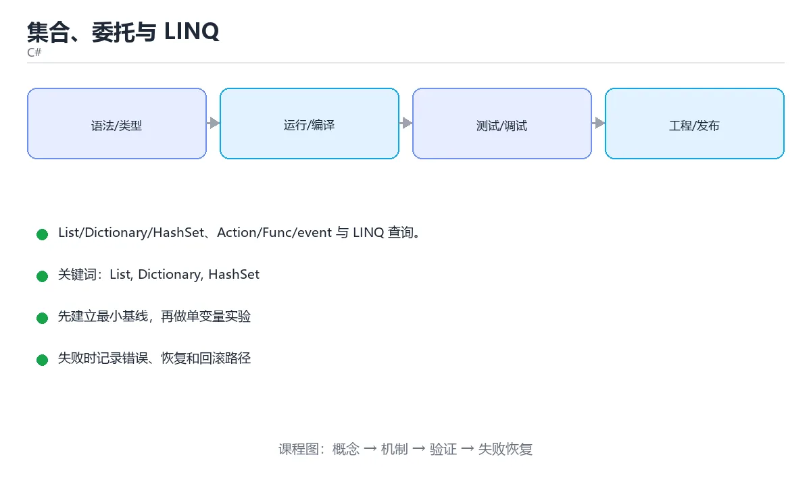

# 集合、委托与 LINQ



> 内容更新时间：2026-10-03 · 学习阶段：进阶 · 预计用时：16 分钟

## 学习目标

- 能用自己的话解释「集合、委托与 LINQ」解决了什么问题，而不是只背术语。
- 能说清 「List」、「Dictionary」、「HashSet」、「委托」 之间的关系，并分别举出一个例子。
- 能把本课知识放回「C#」的知识体系，说明它和相邻主题的边界。
- 能完成本课练习，并用验收标准检查自己的结果。

> 一句话摘要：List/Dictionary/HashSet、Action/Func/event 与 LINQ 查询。

## 前置知识

- 先完成上一课《继承、接口与多态》；如果已经掌握，可以直接用本课练习自测。
- 本课阶段：进阶。建议先掌握同一分类的基础课程，并能独立运行正文中的最小示例。
- 开始前先复习：List、Dictionary、HashSet。
- 如果某一步看不懂，先记录具体卡点，完成练习后再回头读一遍。


## 常用集合

```csharp
var list = new List<int> { 3, 1, 2 };
list.Add(4);
list.Sort();

var map = new Dictionary<string, int> { ["math"] = 90 };
map.TryGetValue("english", out int score);       // 安全取值，不抛异常

var set = new HashSet<string> { "a", "a", "b" }; // 去重
var queue = new Queue<int>();                    // 先进先出
var stack = new Stack<int>();                    // 后进先出
```

选择原则：有序可重复用 `List<T>`，键值查找用 `Dictionary<TKey,TValue>`，去重用 `HashSet<T>`。

## 委托、Lambda 与事件

```csharp
delegate int Calculator(int a, int b);           // 自定义委托
Calculator add = (a, b) => a + b;

Action<string> log = message => Console.WriteLine(message);   // 无返回值
Func<int, int, int> multiply = (a, b) => a * b;              // 有返回值
Predicate<int> isEven = n => n % 2 == 0;

public class Button
{
    public event Action? Clicked;                 // 事件：基于委托
    public void Click() => Clicked?.Invoke();
}
```

委托是类型安全的方法指针，lambda 是匿名方法的简写，事件是对委托的封装（外部只能订阅/取消）。

## LINQ 查询

```csharp
var users = new[]
{
    new { Name = "tom", Age = 18 },
    new { Name = "alice", Age = 25 },
    new { Name = "bob", Age = 30 },
};

var names = users.Where(u => u.Age >= 20)
                 .OrderBy(u => u.Age)
                 .Select(u => u.Name)
                 .ToList();

int total = users.Sum(u => u.Age);
var groups = users.GroupBy(u => u.Age >= 20 ? "adult" : "teen");
var first = users.FirstOrDefault(u => u.Name == "nobody");

// 查询语法
var result = from u in users
             where u.Age > 20
             orderby u.Age descending
             select u.Name;
```

LINQ 是**延迟执行**的：只有遍历或调用 `ToList`/`Count`/`Sum` 时才真正执行。多次遍历同一个查询会重复计算，需要复用就提前 `ToList()`。

## LINQ 常见误用与集合选型

| 误用 | 后果 | 正确做法 |
| --- | --- | --- |
| 同一个查询反复遍历 | 每次都重新计算（延迟执行） | 需要复用先 `ToList()` 物化 |
| 在循环里查数据库 | N+1 问题，往返次数爆炸 | 先批量取回再内存过滤/分组 |
| 用 `Count() > 0` 判空 | 遍历整个集合 | 用 `Any()`，命中即返回 |
| `Where(...).First()` | 可能抛异常 | 不确定用 `FirstOrDefault()` 并判空 |
| 对已排序数据再 OrderBy | 重复排序开销 | 复用已排序结果或改用 SortedSet |

集合选型速查：需要按下标访问用 `List<T>`；需要按键 O(1) 查找用 `Dictionary<TKey,TValue>`；需要去重或集合运算用 `HashSet<T>`；需要先进先出用 `Queue<T>`、后进先出用 `Stack<T>`；需要并发访问用 `ConcurrentDictionary`。**可变集合不要跨线程共享**，要么加锁，要么用不可变集合（System.Collections.Immutable）。

## 本课小结
集合负责存储，委托与 lambda 负责传行为，LINQ 负责声明式查询。三者组合是 C# 处理数据的主力。

<!-- appendix:v1 -->

## 集合选型速查

| 需求 | 首选 | 关键复杂度 | 说明 |
| --- | --- | --- | --- |
| 有序、可重复、按下标访问 | `List<T>` | 访问 O(1) | 默认选择 |
| 去重且不关心顺序 | `HashSet<T>` | 平均 O(1) | 判存在最快 |
| 有序去重 | `SortedSet<T>` | O(log n) | 需要范围查询时用 |
| 键值映射 | `Dictionary<TKey,TValue>` | 平均 O(1) | 键必须可哈希 |
| 有序键值 | `SortedDictionary<TKey,TValue>` | O(log n) | 需要按键排序遍历 |
| 先进先出 | `Queue<T>` | O(1) | 队列 |
| 后进先出 | `Stack<T>` | O(1) | 栈 |
| 双端操作 | `LinkedList<T>` / `Deque`（第三方） | O(1) | 中间插删才考虑链表 |
| 不可变 | `ImmutableArray<T>` / `ImmutableList<T>` | 复制换安全 | 并发共享场景 |
| 线程安全字典 | `ConcurrentDictionary<TKey,TValue>` | 平均 O(1) | 多线程共享 |

## LINQ 速查

| 目的 | 写法 |
| --- | --- |
| 过滤 | `Where(x => x.Active)` |
| 映射 | `Select(x => x.Name)` |
| 展平 | `SelectMany(x => x.Items)` |
| 排序 | `OrderBy(x => x.Age).ThenBy(x => x.Name)` |
| 取前 N | `Take(10)`、`Skip(20).Take(10)` |
| 判断存在 | `Any()`、`Any(x => x.Age > 18)` |
| 全部满足 | `All(x => x.Active)` |
| 首个匹配 | `FirstOrDefault(x => x.Id == id)` |
| 聚合 | `Sum()`、`Average()`、`Max()`、`Count()` |
| 归约 | `Aggregate(seed, (acc, x) => ...)` |
| 分组 | `GroupBy(x => x.Category)` |
| 去重 | `Distinct()`、`DistinctBy(x => x.Id)` |
| 转集合 | `ToList()`、`ToArray()`、`ToDictionary(x => x.Id)` |
| 连接 | `Join`、`GroupJoin` |
| 集合运算 | `Union`、`Intersect`、`Except` |

```csharp
// 分组统计：每个类目的总额与数量
var summary = orders
    .Where(o => o.Paid)
    .GroupBy(o => o.Category)
    .Select(g => new
    {
        Category = g.Key,
        Count = g.Count(),
        Total = g.Sum(o => o.Amount),
    })
    .OrderByDescending(x => x.Total)
    .ToList();

// 用字典做 O(1) 查找，避免嵌套循环
var usersById = users.ToDictionary(u => u.Id);
foreach (var order in orders)
{
    if (usersById.TryGetValue(order.UserId, out var user))
    {
        Console.WriteLine($"{user.Name}: {order.Amount}");
    }
}
```

## 常见错误对照表

| 容易写错的做法 | 实际现象 | 原因与正确做法 |
| --- | --- | --- |
| 反复枚举同一个 `IEnumerable` | 重复查询数据库，性能差 | 用 `ToList()` 物化一次 |
| 忘记 LINQ 是延迟执行 | 数据变化后才执行、异常延后抛出 | 明确物化时机 |
| 在循环里 `FirstOrDefault` 查数据库 | N+1 查询 | 先批量取回，再用字典查找 |
| 用 `Count() > 0` 判存在 | 可能遍历整个序列 | 用 `Any()` |
| `SingleOrDefault` 用在可能多条的场景 | 抛 `InvalidOperationException` | 需要首条用 `FirstOrDefault` |
| `First()` 找不到时 | 抛异常 | 用 `FirstOrDefault` 并判空 |
| `Dictionary` 用 `[]` 取不存在的键 | `KeyNotFoundException` | 用 `TryGetValue` |
| 修改正在遍历的集合 | `InvalidOperationException` | 先收集改动或遍历副本 |
| 自定义类型做 `HashSet` 元素 | 去重失效 | 重写 `Equals` + `GetHashCode`，或用 record |
| 多线程共享 `Dictionary` | 数据损坏或异常 | 用 `ConcurrentDictionary` |

## 自测清单

- [ ] 能按「是否去重、是否有序、是否并发」选对集合。
- [ ] 会用 `GroupBy` + `Select` 做分组统计。
- [ ] 知道 LINQ 延迟执行，必要时 `ToList()` 物化。
- [ ] 查找用字典 `TryGetValue`，避免嵌套循环。
- [ ] 判存在用 `Any()` 而不是 `Count() > 0`。

<!-- appendix:v3 -->

## 零基础详解：集合选择与 LINQ 查询

### 一句话说清它是什么

集合负责存数据，LINQ 负责查数据。
LINQ 是 C# 的杀手锏：**用一串链式方法描述「我要什么」，而不是写循环描述「怎么找」**。

### 集合怎么选

| 集合 | 特点 | 什么时候用 |
| --- | --- | --- |
| `List<T>` | 有序、可重复、按下标访问 | **默认选择** |
| `Dictionary<K,V>` | 键值对、按 key 查找 O(1) | 需要快速查找或去重 |
| `HashSet<T>` | 不重复、无序 | 去重、判断存在 |
| `Queue<T>` | 先进先出 | 任务队列、广度优先 |
| `Stack<T>` | 后进先出 | 撤销、括号匹配 |
| `LinkedList<T>` | 频繁中间插入删除 | 少用，先测性能 |

```csharp
using System.Collections.Generic;

var names = new List<string> { "小明", "小红" };
names.Add("小刚");
names.Remove("小红");

var ages = new Dictionary<string, int> { ["小明"] = 18 };
ages["小红"] = 20;
if (ages.TryGetValue("小刚", out var age)) { }

var tags = new HashSet<string> { "csharp", "dotnet" };
tags.Add("csharp");                 // 重复，不生效
Console.WriteLine(tags.Count);       // 2
```

### LINQ 的两套写法

```csharp
var scores = new[] { 88, 95, 59, 72, 95 };

// 1. 方法语法（最常用）
var passed = scores.Where(s => s >= 60).OrderByDescending(s => s).ToList();

// 2. 查询语法（贴近 SQL，复杂连接时可读性更好）
var query = from s in scores
            where s >= 60
            orderby s descending
            select s;
```

两种写法完全等价，选一种保持统一即可。

### 常用方法速查

| 方法 | 作用 | 返回 |
| --- | --- | --- |
| `Where` | 过滤 | 序列 |
| `Select` | 映射或投影 | 序列 |
| `OrderBy` / `ThenBy` | 排序 | 序列 |
| `FirstOrDefault` | 取第一个，可能没有 | 元素或默认值 |
| `Any` / `All` | 是否存在或是否全部 | bool |
| `GroupBy` | 分组 | 分组序列 |
| `Sum` / `Average` / `Max` | 聚合 | 数值 |
| `Distinct` | 去重 | 序列 |
| `Take` / `Skip` | 分页 | 序列 |

**LINQ 是延迟执行**：只写 `Where` 不会立刻计算，直到 `foreach`、`ToList()`、`Count()` 之类的操作才真正跑。

### 一个完整的查询例子

```csharp
record Student(string Name, string Team, int Score);

var students = new[]
{
    new Student("小明", "A", 88),
    new Student("小红", "B", 95),
    new Student("小刚", "A", 59),
    new Student("小美", "B", 72),
};

var report = students
    .Where(s => s.Score >= 60)
    .GroupBy(s => s.Team)
    .Select(g => new
    {
        Team = g.Key,
        Count = g.Count(),
        Average = Math.Round(g.Average(s => s.Score), 1),
        Top = g.OrderByDescending(s => s.Score).First().Name,
    })
    .OrderByDescending(x => x.Average)
    .ToList();

foreach (var row in report)
{
    Console.WriteLine($"{row.Team} 队：{row.Count} 人，均分 {row.Average}，最高 {row.Top}");
}
```

### 新手最容易踩的八个坑

| 坑 | 现象 | 正确做法 |
| --- | --- | --- |
| 忘了 `ToList()` | 每次遍历都重新查询 | 需要复用结果就固化 |
| 在循环里反复查数据库 | 性能极差 | 一次查出来再遍历，或用 `Contains` 批量 |
| 用 `First()` 取可能为空的数据 | 抛 `InvalidOperationException` | 用 `FirstOrDefault()` |
| `OrderBy` 后想二次排序 | 只按第一个键 | 接 `ThenBy` |
| 修改集合时遍历 | 抛 `InvalidOperationException` | 先 `ToList()` 再改 |
| 用 `Count()` 判空 | 大集合要遍历完整 | 用 `Any()` |
| 以为 LINQ 一定更快 | 有时不如手写循环 | 热点路径实测 |
| 忽略延迟执行 | 数据源变了结果也变 | 需要快照就 `ToList()` |

### 手把手练习：分页与统计

```csharp
var all = Enumerable.Range(1, 53).Select(i => new { Id = i, Score = (i * 37) % 100 });

int pageSize = 10, page = 2;

var pageItems = all
    .OrderByDescending(x => x.Score)
    .Skip((page - 1) * pageSize)
    .Take(pageSize)
    .ToList();

Console.WriteLine($"共 {all.Count()} 条，第 {page} 页 {pageItems.Count} 条");
Console.WriteLine($"最高分 {all.Max(x => x.Score)}，平均 {all.Average(x => x.Score):F1}");
Console.WriteLine($"及格 {all.Count(x => x.Score >= 60)} 人");
```

### 学完自测

- [ ] 能说出 List、Dictionary、HashSet 各自适合的场景。
- [ ] 能写出方法语法和查询语法的等价写法。
- [ ] 知道 LINQ 的延迟执行意味着什么。
- [ ] 知道为什么判空要用 `Any()` 而不是 `Count() > 0`。
- [ ] 能用 `GroupBy` 加 `Select` 生成分组报表。

## 动手练习

<!-- practice-diversified:v1 -->

> 本课练习重点：围绕「List、Dictionary、HashSet」完成复述、实验和交付，每个结果都要能被别人检查。

先建最小控制台程序，再补类型、异步和异常路径，最后用 dotnet test 验证。

### 练习 1：建立心智模型（10 分钟）

合上教程，用 3～5 句话回答：

1. 「集合、委托与 LINQ」解决了什么问题？
2. 如果没有它，会出现什么具体后果？
3. 它和「Dictionary」是什么关系？

**验收标准**：至少出现一个本课关键词，并写出一个反例、边界条件或失效场景。

### 练习 2：做一次可控实验（20 分钟）

从正文中选一个最小示例，完成以下操作：

1. 先预测修改一个参数、输入或步骤后的结果。
2. 再实际执行或逐步推演，记录真实结果。
3. 如果结果与预测不同，写出差异原因。

**验收标准**：留下「原例 → 改动 → 预测 → 结果 → 原因」五步记录。

### 练习 3：交付一个小结果（30 分钟）

写一个控制台小程序，补一个正例、一个边界值和一个异常路径。

任务要求：

- 结果必须能被别人检查，不能只写“我已经理解了”。
- 至少覆盖「List」和「Dictionary」两个关键词。
- 写出 1 个仍然不确定的问题，以及下一步如何验证。

> 提示：时间有限时优先做练习 1 和练习 2；练习 3 可以拆成两次完成。

<!-- scaffold:v1 -->

<!-- p2-enrichment:v1 -->

## English Overview

**Title:** Collections, Delegates & LINQ

**Summary:** Collections, delegates, events and LINQ.

**Category:** C#  
**Level:** 进阶  
**Key terms:** List, Dictionary, HashSet, 委托, LINQ, 延迟执行

> The full tutorial is written in Chinese. This bilingual overview helps English readers identify the topic, scope and key terms before studying the detailed examples.

## 内容元数据

- 内容版本：v2.0
- 最后更新：2026-10-03
- 学习阶段：进阶
- 适用环境：.NET 9 / C# 13
- 内容来源：内置结构化课程与工程实践整理
- 相关主题：List、Dictionary、HashSet、委托、LINQ、延迟执行
- 质量版本：P0 测验标准 + P1 覆盖扩展 + P2 体验补全

<!-- p2-references:v1 -->

## 参考资料与复核

- 最后复核：2026-10-04
- 下次复核：2027-04-04
- 复核范围：版本兼容、API 行为、安全建议与工程实践
- 来源性质：官方文档与标准；本课正文为离线教学重组，不复制原文

| 参考资料 | 本课用途 |
| --- | --- |
| [C# 官方指南](https://learn.microsoft.com/dotnet/csharp/) | 语言、异步与模式匹配 |
| [.NET 文档](https://learn.microsoft.com/dotnet/) | 运行时、GC 与发布 |

> 本课主题：List/Dictionary/HashSet、Action/Func/event 与 LINQ 查询。

> App 完全离线展示文字链接，不会自动联网；需要延伸阅读时可复制链接到浏览器。

