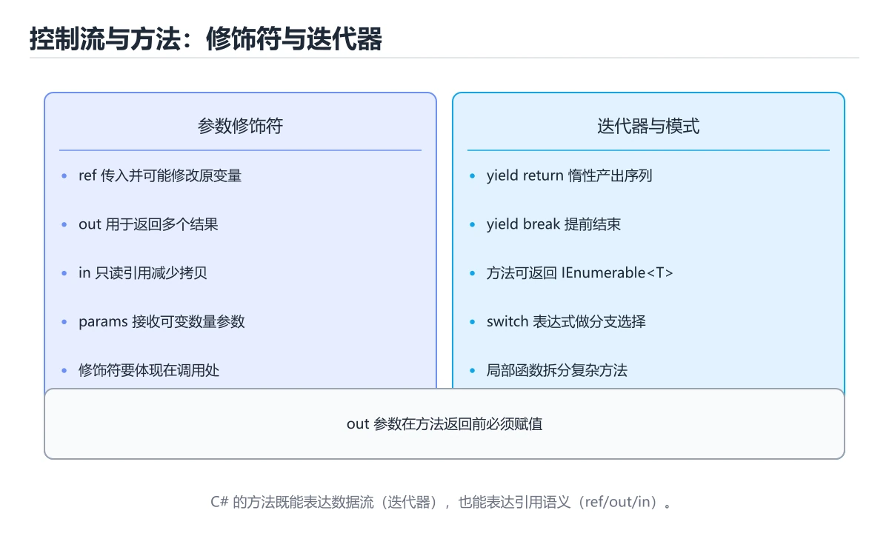
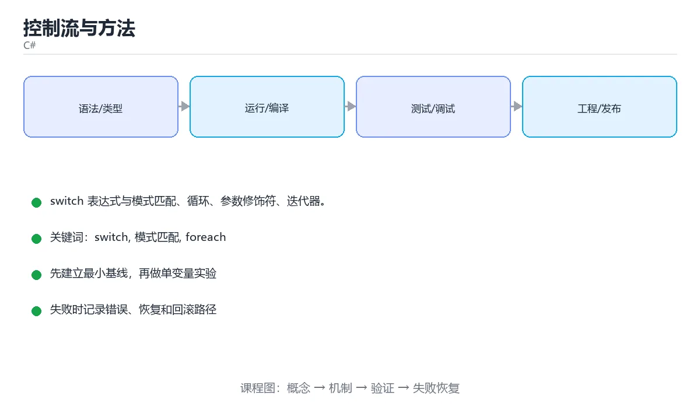

# 控制流与方法





> 内容更新时间：2026-10-03 · 学习阶段：基础 · 预计用时：15 分钟

## 学习目标

- 能用自己的话解释「控制流与方法」解决了什么问题，而不是只背术语。
- 能说清 「switch」、「模式匹配」、「foreach」、「ref」 之间的关系，并分别举出一个例子。
- 能把本课知识放回「C#」的知识体系，说明它和相邻主题的边界。
- 能完成本课练习，并用验收标准检查自己的结果。

> 一句话摘要：switch 表达式与模式匹配、循环、参数修饰符、迭代器。

## 前置知识

- 先完成上一课《变量、类型与字符串》；如果已经掌握，可以直接用本课练习自测。
- 本课阶段：基础。建议会读写简单代码或命令，并理解变量、输入输出等基本概念。
- 开始前先复习：switch、模式匹配、foreach。
- 如果某一步看不懂，先记录具体卡点，完成练习后再回头读一遍。


## 分支与模式匹配

```csharp
int score = 78;

if (score >= 90) Console.WriteLine("优秀");
else if (score >= 60) Console.WriteLine("及格");
else Console.WriteLine("不及格");

string grade = score switch
{
    >= 90 => "A",
    >= 60 => "B",
    _ => "C"                 // 兜底分支
};

switch (value)
{
    case int n when n > 0:
        Console.WriteLine($"正整数 {n}");
        break;
    case string s:
        Console.WriteLine($"字符串 {s}");
        break;
    case null:
        break;
}
```

`switch` 表达式更紧凑；模式匹配能同时完成类型判断与变量声明。

## 循环

```csharp
for (int i = 0; i < 5; i++) { }
foreach (var item in items) { }             // 遍历 IEnumerable

int n = 3;
while (n-- > 0) { }
do { } while (false);

foreach (var (key, value) in dictionary) { }   // 解构键值对
```

遍历集合时不要修改集合结构，否则会抛 `InvalidOperationException`；需要增删就遍历副本。

## 方法

```csharp
public static int Add(int a, int b = 0) => a + b;

public static void Swap(ref int a, ref int b) => (a, b) = (b, a);

public static bool TryDivide(int a, int b, out int result)
{
    if (b == 0) { result = 0; return false; }
    result = a / b;
    return true;
}

public static int Sum(params int[] numbers) => numbers.Sum();
```

参数修饰符：`ref` 传入并可能修改、`out` 用于输出、`in` 只读引用（大结构体避免拷贝）、`params` 可变参数。

## 局部函数与迭代器

```csharp
public static IEnumerable<int> Evens(int limit)
{
    return Iterator();

    IEnumerable<int> Iterator()          // 局部函数，可访问外层变量
    {
        for (int i = 0; i < limit; i += 2) yield return i;
    }
}
```

`yield return` 实现惰性求值，数据量大时能显著节省内存。

## 本课小结
现代 C# 的写法：**switch 表达式做分支、表达式主体写短方法、ref/out/params 精确表达参数语义**。


## 控制流速查

| 结构 | 写法 | 注意 |
| --- | --- | --- |
| `if / else if / else` | 条件分支 | 条件必须是 `bool` |
| `switch` 语句 | 传统分支 | 每个 `case` 需 `break` / `return` |
| `switch` 表达式 | `value switch { ... }` | 无穿透，支持模式匹配 |
| `for` / `foreach` | 计次与遍历 | `foreach` 中不能修改集合结构 |
| `while` / `do...while` | 条件循环 | `do...while` 至少执行一次 |
| `break` / `continue` | 跳出 / 跳过 | 只影响最近一层循环 |
| `goto case` | 跳到另一个 case | 少数场景使用 |

```csharp
// switch 表达式 + 模式匹配 + when 子句
string Grade(int score) => score switch
{
    >= 90 => "优秀",
    >= 80 => "良好",
    >= 60 when score % 10 == 0 => "及格（整十）",
    >= 60 => "及格",
    _ => "需努力",
};

// 类型模式与属性模式
string Describe(object value) => value switch
{
    int n when n < 0 => "负整数",
    int n => $"整数 {n}",
    string { Length: 0 } => "空字符串",
    string s => $"字符串长度 {s.Length}",
    null => "空值",
    _ => "其他类型",
};
```

## 方法速查

| 概念 | 说明 |
| --- | --- |
| 重载 | 同名不同参数列表 |
| 可选参数 | `void F(int a, int b = 1)`，默认值必须是编译期常量 |
| 命名参数 | `F(b: 2, a: 1)`，提高可读性 |
| `ref` | 传入前必须初始化，方法内可读写 |
| `out` | 不需初始化，方法内必须赋值 |
| `in` | 只读引用，适合较大的结构体 |
| `params` | 可变参数，必须是最后一个 |
| 本地函数 | 方法内的命名函数，可递归、可静态 |
| 表达式体成员 | `int Square(int x) => x * x;` |
| `yield return` | 逐项产出，实现惰性序列 |

```csharp
// out 参数：TryXxx 模式的经典写法
bool TryParseAge(string? text, out int age) =>
    int.TryParse(text, out age) && age is >= 0 and <= 150;

// 本地函数 + yield：惰性读取大文件
IEnumerable<string> ReadNonEmpty(string path)
{
    foreach (var line in File.ReadLines(path))
    {
        if (!string.IsNullOrWhiteSpace(line))
        {
            yield return line.Trim();
        }
    }
}
```

## 常见错误对照表

| 容易写错的做法 | 实际现象 | 原因与正确做法 |
| --- | --- | --- |
| `switch` 分支漏 `break` | 编译错误（C# 禁止隐式穿透） | 加 `break` / `return`，或用 switch 表达式 |
| 可选参数使用非编译期常量 | 编译错误 | 用常量或改用重载 |
| `params` 放在参数中间 | 编译错误 | `params` 必须是最后一个 |
| `out` 参数在方法内没赋值 | 编译错误 | 所有路径都要赋值 |
| `foreach` 中修改集合 | `InvalidOperationException` | 先收集改动，循环后统一处理 |
| 用 `yield` 的方法返回 `List<T>` | 类型错误 | 返回类型应为 `IEnumerable<T>` |
| 忘了 `return` 的分支 | 编译错误：并非所有代码路径都返回值 | 补 `default` 分支或抛异常 |
| `switch` 表达式漏 `_` 而值超出范围 | 运行时抛异常 | 加 `_` 兜底分支 |
| 用 `goto` 跳转控制流程 | 可读性差 | 改用循环 + 条件判断 |
| 方法过长（几百行） | 难以测试与复用 | 拆成多个小方法或服务 |

## 自测清单

- [ ] 会用 `switch` 表达式与模式匹配。
- [ ] 可选参数与命名参数使用得当。
- [ ] 会用 `out` 实现 `TryXxx` 模式，不用异常控制流程。
- [ ] 大数据用 `yield return` 惰性返回。
- [ ] 方法保持短小且职责单一。


## 零基础详解：判断、循环与方法

### 一句话说清它是什么

判断决定走哪条分支，循环负责重复，方法把逻辑封装并命名。
C# 在这三块提供了不少「更少代码、更少出错」的现代写法。

### 判断：从 `if` 到 `switch` 表达式

```csharp
// 传统写法
string level;
if (score >= 90) level = "优秀";
else if (score >= 60) level = "及格";
else level = "不及格";

// switch 表达式：把「值 → 结果」写成一张表
string level2 = score switch
{
    >= 90 => "优秀",
    >= 60 => "及格",
    _ => "不及格",          // _ 是兜底
};
```

| 场景 | 推荐写法 |
| --- | --- |
| 范围或复杂条件 | `if / else if` |
| 一个值映射到结果 | `switch` 表达式 |
| 空值兜底 | `??`、`??=` |
| 逐层取属性 | `?.` |

### 循环的四种选择

| 循环 | 适合 | 特点 |
| --- | --- | --- |
| `for` | 需要下标或次数 | 最灵活 |
| `foreach` | 遍历集合 | 不能边遍历边改集合 |
| `while` | 条件驱动 | 可能一次都不执行 |
| `do...while` | 至少执行一次 | 先做后判断 |

```csharp
foreach (var item in items)
{
    if (item.IsSkip) continue;   // 跳过这一项
    if (item.IsStop) break;      // 结束整个循环
    Console.WriteLine(item.Name);
}
```

### 方法的四种参数修饰符

| 修饰符 | 含义 | 例子 |
| --- | --- | --- |
| 无 | 值传递（副本） | `void F(int x)` |
| `ref` | 传入并可能修改原变量 | `void F(ref int x)` |
| `out` | 用于「返回多个值」 | `bool TryParse(string s, out int n)` |
| `in` | 只读引用，避免拷贝大结构 | `void F(in BigStruct s)` |

```csharp
bool TryDivide(int a, int b, out double result)
{
    if (b == 0) { result = 0; return false; }
    result = (double)a / b;
    return true;
}

if (TryDivide(10, 3, out var value))
    Console.WriteLine($"{value:F2}");
```

`TryXxx + out` 是 .NET 的经典模式：不抛异常，用返回值表示成功与否。

### 可选参数、命名参数与重载

```csharp
void Send(string to, string subject = "无主题", bool urgent = false) { }

Send("a@b.com");                                  // 用默认值
Send("a@b.com", urgent: true);                    // 命名参数，跳过中间项

// 重载：同名不同参
int Add(int a, int b) => a + b;
double Add(double a, double b) => a + b;
```

可选参数要放在参数列表末尾；调用处用命名参数能显著提高可读性。

### 表达式体成员：一行写完小方法

```csharp
public int Square(int x) => x * x;
public string Name => _name;                 // 只读属性
public override string ToString() => $"User({Id})";
```

短方法用表达式体更清爽，逻辑一长就换回大括号。

### 新手最容易踩的七个坑

| 坑 | 现象 | 正确做法 |
| --- | --- | --- |
| `foreach` 里改集合 | `InvalidOperationException` | 先收集要改的项，循环外处理 |
| `out` 变量没赋值 | 编译错误 | 所有分支都要赋值 |
| 递归无出口 | `StackOverflowException` | 先写终止条件 |
| 参数顺序记错 | 传错值 | 用命名参数 |
| 方法过长 | 难测难改 | 按职责拆分 |
| 忽略返回值 | 以为对象被改了 | 接收返回值或改用可变对象 |
| `switch` 忘兜底 | 运行期没匹配到 | 用 `_` 分支 |

### 手把手练习：成绩统计与素数筛选

```csharp
static bool IsPrime(int n)
{
    if (n < 2) return false;
    for (var d = 2; d * d <= n; d++)
    {
        if (n % d == 0) return false;
    }
    return true;
}

static (int Count, double Average, string Level) Summarize(int[] scores)
{
    if (scores.Length == 0) return (0, 0, "无数据");
    var total = scores.Sum();
    var avg = (double)total / scores.Length;
    var level = avg switch
    {
        >= 90 => "优秀",
        >= 60 => "及格",
        _ => "不及格",
    };
    return (scores.Length, Math.Round(avg, 1), level);
}

Console.WriteLine(string.Join(", ", Enumerable.Range(2, 30).Where(IsPrime)));
var (count, average, level) = Summarize(new[] { 88, 92, 79 });
Console.WriteLine($"{count} 人，平均 {average}，等级 {level}");
```

### 学完自测

- [ ] 能写出一个 `switch` 表达式并说明 `_` 的作用。
- [ ] 能说出 `ref`、`out`、`in` 的区别。
- [ ] 知道 `TryParse` 模式为什么比抛异常更好。
- [ ] 能写出带可选参数与命名参数的调用。
- [ ] 能返回一个元组来同时给出多个结果。

## 动手练习


> 本课练习重点：围绕「switch、模式匹配、foreach」完成复述、实验和交付，每个结果都要能被别人检查。

先建最小控制台程序，再补类型、异步和异常路径，最后用 dotnet test 验证。

### 练习 1：建立心智模型（10 分钟）

合上教程，用 3～5 句话回答：

1. 「控制流与方法」解决了什么问题？
2. 如果没有它，会出现什么具体后果？
3. 它和「模式匹配」是什么关系？

**验收标准**：至少出现一个本课关键词，并写出一个反例、边界条件或失效场景。

### 练习 2：做一次可控实验（20 分钟）

从正文中选一个最小示例，完成以下操作：

1. 先预测修改一个参数、输入或步骤后的结果。
2. 再实际执行或逐步推演，记录真实结果。
3. 如果结果与预测不同，写出差异原因。

**验收标准**：留下「原例 → 改动 → 预测 → 结果 → 原因」五步记录。

### 练习 3：交付一个小结果（30 分钟）

写一个控制台小程序，补一个正例、一个边界值和一个异常路径。

任务要求：

- 结果必须能被别人检查，不能只写“我已经理解了”。
- 至少覆盖「switch」和「模式匹配」两个关键词。
- 写出 1 个仍然不确定的问题，以及下一步如何验证。

> 提示：时间有限时优先做练习 1 和练习 2；练习 3 可以拆成两次完成。


## 实践任务

本节围绕“控制流与方法”安排 3 个可交付任务，每个任务都要求留下可以复查的记录。

### 任务 1：用自己的话画出结构

合上教程，用 5 句话说明“控制流与方法”解决什么问题、输入是什么、输出是什么、失败时会怎样、与相邻概念的边界在哪里。画一张流程图或状态图，把每个节点标注成“输入 / 处理 / 输出 / 失败路径”之一。

**验收标准**：图里至少有 5 个节点和 1 条失败路径；每个节点都能在正文中找到依据。

### 任务 2：做一次对比实验

从正文里选两个差异最小的方案，列成 4 列表格：方案、前提、代价、适用边界。然后只改变一个条件（数据规模、并发度、精度或资源上限），记录结果变化。

**验收标准**：表格里两个方案的结论不能完全一样；写下“在什么条件下应该换方案”。

### 任务 3：迁移到自己的场景

把“控制流与方法”的核心方法用到你熟悉的一个真实场景，写出一份 300 字以内的实施记录：目标、步骤、验证方式、仍然不确定的问题。

**验收标准**：至少有一个可复现的命令、代码片段或数据样例；结论能被别人独立检查。


## 故障现场

这一节把“控制流与方法”最常见的失败方式还原成现场记录，练习时按“症状 → 复现 → 定位 → 修复 → 预防”的顺序排查。

### 现场 1：“控制流与方法”的 switch 常规用例通过，但边界用例失败

**症状**：在“控制流与方法”的练习或生产场景里出现““控制流与方法”的 switch 常规用例通过，但边界用例失败”。

**复现**：准备一组最小输入，只保留触发““控制流与方法”的 switch 常规用例通过，但边界用例失败”的必要条件，连续运行两次确认结果稳定。

**定位**：围绕“switch 的前置条件与取值边界没有写进代码，默认值掩盖了空值和极值”检查调用链、输入数据和环境配置，先验证假设再改代码。

**修复**：为“控制流与方法”补一条空值或极值用例，把前置条件写成断言，并让失败信息直接指出是哪个输入越界

**预防**：把““控制流与方法”的 switch 常规用例通过，但边界用例失败”写成一条自动化用例，并在“控制流与方法”的验收清单里保留对应检查项。


### 现场 2：“控制流与方法”的 模式匹配 结果在两次运行之间不一致

**症状**：在“控制流与方法”的练习或生产场景里出现““控制流与方法”的 模式匹配 结果在两次运行之间不一致”。

**复现**：准备一组最小输入，只保留触发““控制流与方法”的 模式匹配 结果在两次运行之间不一致”的必要条件，连续运行两次确认结果稳定。

**定位**：围绕“模式匹配 依赖了当前版本、执行顺序或共享状态，单次运行无法暴露差异”检查调用链、输入数据和环境配置，先验证假设再改代码。

**修复**：固定“控制流与方法”使用的版本与随机种子，记录两次运行的完整输入和输出，再逐项消除非确定性来源

**预防**：把““控制流与方法”的 模式匹配 结果在两次运行之间不一致”写成一条自动化用例，并在“控制流与方法”的验收清单里保留对应检查项。


### 现场 3：“控制流与方法”的验证只在开发机通过

**症状**：在“控制流与方法”的练习或生产场景里出现““控制流与方法”的验证只在开发机通过”。

**复现**：准备一组最小输入，只保留触发““控制流与方法”的验证只在开发机通过”的必要条件，连续运行两次确认结果稳定。

**定位**：围绕“环境版本、配置和输入规模与目标环境不同，switch 缺少可重复的验证记录”检查调用链、输入数据和环境配置，先验证假设再改代码。

**修复**：把“控制流与方法”的运行环境、输入样本和预期输出写成清单，并在另一套环境复跑同一条命令

**预防**：把““控制流与方法”的验证只在开发机通过”写成一条自动化用例，并在“控制流与方法”的验收清单里保留对应检查项。


## 版本与时效

这一节记录“控制流与方法”涉及的版本基线与升级检查点，避免把某个版本的默认行为当成永久结论。

- .NET 10 是当前 LTS 主线，C# 版本随 SDK 一起演进
- 主构造函数、集合表达式、模式匹配与 AOT/裁剪是升级重点
- 升级前检查 NuGet 依赖、序列化行为与运行时标识
- 官方说明：https://learn.microsoft.com/dotnet/core/whats-new/

### 升级检查清单

- 先固定当前版本，跑通全部示例与测验，再升级工具链。
- 只改一个版本变量，记录编译、测试、性能与产物体积的变化。
- 重点回归默认值、弃用警告、序列化格式、并发语义和错误信息。
- 升级完成后更新本课的“最后复核 / 下次复核”日期与版本说明。


## 考点精讲：把测验题还原成判断过程

本课有 6 个判断点。先自己作答，再看「判断依据」；如果结论正确但理由不完整，回到正文对应章节补足概念。

### 考点 1：方法参数用 out 修饰，表示？

- **正确判断**：参数用于输出结果，方法内必须赋值
- **判断依据**：正确答案是「参数用于输出结果，方法内必须赋值」，本课在「方法」中说明：参数修饰符：ref 传入并可能修改、out 用于输出、in 只读引用（大结构体避免拷贝）、params 可变参数。out 参数由方法负责赋值并可返回多个结果，TryParse 就是典型用法。本课还在「本课小结」中说明：现代 C# 的写法：switch 表达式做分支、表达式主体写短方法、ref/out/params 精确表达参数语义。
- **迁移检查**：遮住选项，只根据定义复述一次答案，再回来看哪个选项与复述一致。

### 考点 2：方法体中使用 yield return 的效果是？

- **正确判断**：惰性生成序列，按需产出元素
- **判断依据**：正确答案是「惰性生成序列，按需产出元素」，本课在「局部函数与迭代器」中说明：yield return 实现惰性求值，数据量大时能显著节省内存。迭代器按需计算，适合处理大数据或无限序列，能节省内存。本课还在「零基础详解：判断、循环与方法」中说明：TryXxx + out 是 .NET 的经典模式：不抛异常，用返回值表示成功与否。本课还在「本课小结」中说明：现代 C# 的写法：switch 表达式做分支、表达式主体写短方法、ref/out/params 精确表达参数语义。
- **迁移检查**：如果给某个错误选项去掉一个限定词，它会不会变成正确？说明理由。

### 考点 3：switch 表达式中 _ 分支的作用是？

- **正确判断**：兜底分支，匹配所有其他情况
- **判断依据**：正确答案是「兜底分支，匹配所有其他情况」，本课在「零基础详解：判断、循环与方法」中说明：能写出一个 switch 表达式并说明 的作用。弃元 作为默认分支，保证表达式在所有情况下都有返回值。本课还在「零基础详解：判断、循环与方法」中说明：短方法用表达式体更清爽，逻辑一长就换回大括号。本课还在「零基础详解：判断、循环与方法」中说明：判断决定走哪条分支，循环负责重复，方法把逻辑封装并命名。
- **迁移检查**：如果给某个错误选项去掉一个限定词，它会不会变成正确？说明理由。

### 考点 4：ref、out、in 三个参数修饰符的区别是？

- **正确判断**：ref 传入前必须初始化且可读写
- **判断依据**：正确答案是「ref 传入前必须初始化且可读写」，本课在「方法」中说明：参数修饰符：ref 传入并可能修改、out 用于输出、in 只读引用（大结构体避免拷贝）、params 可变参数。out 适合返回多个结果，in 适合传递较大的只读结构体避免拷贝。本课还在「零基础详解：判断、循环与方法」中说明：TryXxx + out 是 .NET 的经典模式：不抛异常，用返回值表示成功与否。本课还在「循环」中说明：遍历集合时不要修改集合结构，否则会抛 InvalidOperationException。
- **迁移检查**：把题干里的一个条件换成边界值，原来的结论还成立吗？写出判断过程。

### 考点 5：模式匹配 if (obj is int n) 的作用是？

- **正确判断**：判断类型并在为真时把值赋给变量 n
- **判断依据**：正确答案是「判断类型并在为真时把值赋给变量 n」，本课在「零基础详解：判断、循环与方法」中说明：能写出一个 switch 表达式并说明 的作用。类型判断与取值合并成一步，配合 switch 表达式可以写出简洁的分支逻辑。本课还在「零基础详解：判断、循环与方法」中说明：知道 TryParse 模式为什么比抛异常更好。
- **迁移检查**：如果给某个错误选项去掉一个限定词，它会不会变成正确？说明理由。

### 考点 6：补全代码：「控制流与方法」示例中，下面这行代码缺少哪个关键字或函数名？请填入 ____。 `int.____(text, out age) && age is >= 0 and <= 150;`

- **正确判断**：TryParse / tryparse
- **判断依据**：正确答案是「TryParse」，本课在「零基础详解：判断、循环与方法」中说明：知道 TryParse 模式为什么比抛异常更好。本课还在「零基础详解：判断、循环与方法」中说明：C# 在这三块提供了不少「更少代码、更少出错」的现代写法。本课示例中还能看到 `bool TryParseAge(string? text, out int age) =>` 这样的用法，说明该关键字在本课代码中承担实际功能。
- **迁移检查**：不看题干，用自己的话补全这句话，再与标准答案对照。

### 补充自测（2 题）

1. 围绕“控制流与方法”中的 switch、模式匹配、foreach，下列哪两项是本课强调的实践判断？
2. 下面这段 C# 代码复现了“控制流与方法”中 switch、模式匹配、foreach 相关的一个常见故障，哪一项最准确地解释了问题？

这些题按“先定位概念、再排除边界错误、最后核对答案”的顺序作答；每题解析都给出了判断依据。


## 本课复习清单

离开本课前，逐项确认：

- [ ] 不看解析，能说出「方法参数用 out 修饰，表示？」的判断依据。
- [ ] 不看解析，能说出「方法体中使用 yield return 的效果是？」的判断依据。
- [ ] 不看解析，能说出「switch 表达式中 _ 分支的作用是？」的判断依据。
- [ ] 不看解析，能说出「ref、out、in 三个参数修饰符的区别是？」的判断依据。
- [ ] 不看解析，能说出「模式匹配 if (obj is int n) 的作用是？」的判断依据。
- [ ] 不看解析，能说出「补全代码：「控制流与方法」示例中，下面这行代码缺少哪个关键字或函数名？请填入 _…」的判断依据。
- [ ] 至少运行一次本课示例，记录输入、输出和一个边界情况。
- [ ] 把本课最容易混淆的两个概念写成一句话对照。

| 复盘项 | 记录 |
| --- | --- |
| 已经能独立解释的考点 |  |
| 仍然说不清的概念 |  |
| 下一步验证动作 |  |

## 术语速查

把本课反复出现的术语集中放在一起。复习时先遮住右列，尝试用自己的话解释，再回到正文核对。

| 术语 | 本课语境 |
| --- | --- |
| `switch` | `switch` 表达式更紧凑；模式匹配能同时完成类型判断与变量声明。 |
| `InvalidOperationException` | 遍历集合时不要修改集合结构，否则会抛 `InvalidOperationException`；需要增删就遍历副本。 |
| `ref` | 参数修饰符：`ref` 传入并可能修改、`out` 用于输出、`in` 只读引用（大结构体避免拷贝）、`params` 可变参数。 |
| `out` | 参数修饰符：`ref` 传入并可能修改、`out` 用于输出、`in` 只读引用（大结构体避免拷贝）、`params` 可变参数。 |
| `in` | 参数修饰符：`ref` 传入并可能修改、`out` 用于输出、`in` 只读引用（大结构体避免拷贝）、`params` 可变参数。 |
| `params` | 参数修饰符：`ref` 传入并可能修改、`out` 用于输出、`in` 只读引用（大结构体避免拷贝）、`params` 可变参数。 |
| `yield return` | `yield return` 实现惰性求值，数据量大时能显著节省内存。 |
| `if / else if / else` | \| `if / else if / else` \| 条件分支 \| 条件必须是 `bool` \| |
| `bool` | \| `if / else if / else` \| 条件分支 \| 条件必须是 `bool` \| |
| `case` | \| `switch` 语句 \| 传统分支 \| 每个 `case` 需 `break` / `return` \| |
| `break` | \| `switch` 语句 \| 传统分支 \| 每个 `case` 需 `break` / `return` \| |
| `return` | \| `switch` 语句 \| 传统分支 \| 每个 `case` 需 `break` / `return` \| |

## 面试问答与自测

下面把本课考点换成面试追问。先口述自己的答案，
再对照参考回答检查是否遗漏了前提、边界或失败路径。

### 追问 1：方法参数用 out 修饰，表示？

**参考回答**：正确答案是「参数用于输出结果，方法内必须赋值」，本课在「方法」中说明：参数修饰符：ref 传入并可能修改、out 用于输出、in 只读引用（大结构体避免拷贝）、params 可变参数。out 参数由方法负责赋值并可返回多个结果，TryParse 就是典型用法。本课还在「本课小结」中说明：现代 C# 的写法：switch 表达式做分支、表达式主体写短方法、ref/out/params 精确表达参数语义。

### 追问 2：方法体中使用 yield return 的效果是？

**参考回答**：正确答案是「惰性生成序列，按需产出元素」，本课在「局部函数与迭代器」中说明：yield return 实现惰性求值，数据量大时能显著节省内存。迭代器按需计算，适合处理大数据或无限序列，能节省内存。本课还在「零基础详解·判断、循环与方法」中说明：TryXxx + out 是 .NET 的经典模式：不抛异常，用返回值表示成功与否。本课还在「本课小结」中说明：现代 C# 的写法：switch 表达式做分支、表达式主体写短方法、ref/out/params 精确表达参数语义。

### 追问 3：switch 表达式中 _ 分支的作用是？

**参考回答**：正确答案是「兜底分支，匹配所有其他情况」，本课在「零基础详解·判断、循环与方法」中说明：能写出一个 switch 表达式并说明 的作用。弃元 作为默认分支，保证表达式在所有情况下都有返回值。本课还在「零基础详解·判断、循环与方法」中说明：短方法用表达式体更清爽，逻辑一长就换回大括号。本课还在「零基础详解·判断、循环与方法」中说明：判断决定走哪条分支，循环负责重复，方法把逻辑封装并命名。

### 追问 4：ref、out、in 三个参数修饰符的区别是？

**参考回答**：正确答案是「ref 传入前必须初始化且可读写」，本课在「方法」中说明：参数修饰符：ref 传入并可能修改、out 用于输出、in 只读引用（大结构体避免拷贝）、params 可变参数。out 适合返回多个结果，in 适合传递较大的只读结构体避免拷贝。本课还在「零基础详解·判断、循环与方法」中说明：TryXxx + out 是 .NET 的经典模式：不抛异常，用返回值表示成功与否。本课还在「循环」中说明：遍历集合时不要修改集合结构，否则会抛 InvalidOperationException。

### 追问 5：模式匹配 if (obj is int n) 的作用是？

**参考回答**：正确答案是「判断类型并在为真时把值赋给变量 n」，本课在「零基础详解·判断、循环与方法」中说明：能写出一个 switch 表达式并说明 的作用。类型判断与取值合并成一步，配合 switch 表达式可以写出简洁的分支逻辑。本课还在「零基础详解·判断、循环与方法」中说明：知道 TryParse 模式为什么比抛异常更好。

## English Overview

**Title:** Control Flow & Methods

**Summary:** Switch expressions, patterns, loops, parameters and iterators.

**Category:** C#  
**Level:** 基础  
**Key terms:** switch, 模式匹配, foreach, ref, out, yield

> The full tutorial is written in Chinese. This bilingual overview helps English readers identify the topic, scope and key terms before studying the detailed examples.

## 内容元数据

- 内容版本：v2.0
- 最后更新：2026-10-03
- 学习阶段：基础
- 适用环境：.NET 9 / C# 13
- 内容来源：内置结构化课程与工程实践整理
- 相关主题：switch、模式匹配、foreach、ref、out、yield
- 质量版本：P0 测验标准 + P1 覆盖扩展 + P2 体验补全


## 参考资料与复核

- 最后复核：2026-10-04
- 下次复核：2027-04-04
- 复核范围：版本兼容、API 行为、安全建议与工程实践
- 来源性质：官方文档与标准；本课正文为离线教学重组，不复制原文

| 参考资料 | 本课用途 |
| --- | --- |
| [C# 官方指南](https://learn.microsoft.com/dotnet/csharp/) | 语言、异步与模式匹配 |
| [.NET 文档](https://learn.microsoft.com/dotnet/) | 运行时、GC 与发布 |

> 本课主题：switch 表达式与模式匹配、循环、参数修饰符、迭代器。

> App 完全离线展示文字链接，不会自动联网；需要延伸阅读时可复制链接到浏览器。

<!-- code-practice:v1:start -->

## 代码练习（6 题）

下面题目与课程测验同源：覆盖代码输出、排错与场景判断。建议先自己写出答案，再到「测验」里核对成绩。

### 练习 1 · 代码输出

在 C# 课程“控制流与方法”的输入输出实验里，这段代码运行后输出什么？

```csharp
using System;

class Program {
    static void Main() {
        int total = 0;
        for (int i = 1; i <= 5; i++) {
            total += i;
        }
        Console.WriteLine(total);
    }
}
```

- A. 14
- B. 15
- C. 30
- D. 16

**参考答案**：B. 15
**参考输出**：`15`

**解析**

在 C# 课程“控制流与方法”的输入输出代码实验里，程序先完成赋值、循环或函数调用，再把结果写到标准输出，因此正确结果是 15。
判断 C# 课程“控制流与方法”的代码输出时，要把“源码写了什么”和“运行时实际打印什么”分开；变量值和循环边界都会直接改变最终结果。
把 15 当作基线后，可以只改一个输入或一个边界，再观察 C# 课程“控制流与方法”的输出如何变化，这就是验证掌握程度的方法。

### 练习 2 · 代码输出

在 C# 课程“控制流与方法”的错误处理实验里，这段代码运行后输出什么？

```csharp
using System;

class Program {
    static void Main() {
        int x = 4;
        Console.WriteLine(x);
    }
}
```

- A. 5
- B. 8
- C. 4
- D. 3

**参考答案**：C. 4
**参考输出**：`4`

**解析**

在 C# 课程“控制流与方法”的错误处理代码实验里，程序先完成赋值、循环或函数调用，再把结果写到标准输出，因此正确结果是 4。
判断 C# 课程“控制流与方法”的代码输出时，要把“源码写了什么”和“运行时实际打印什么”分开；变量值和循环边界都会直接改变最终结果。
把 4 当作基线后，可以只改一个输入或一个边界，再观察 C# 课程“控制流与方法”的输出如何变化，这就是验证掌握程度的方法。

### 练习 3 · 代码输出

在 C# 课程“控制流与方法”的边界实验里，这段代码运行后输出什么？

```csharp
using System;

class Program {
    static int DoubleValue(int value) => value * 2;

    static void Main() {
        Console.WriteLine(DoubleValue(5));
    }
}
```

- A. 10
- B. 9
- C. 20
- D. 11

**参考答案**：A. 10
**参考输出**：`10`

**解析**

在 C# 课程“控制流与方法”的边界代码实验里，程序先完成赋值、循环或函数调用，再把结果写到标准输出，因此正确结果是 10。
判断 C# 课程“控制流与方法”的代码输出时，要把“源码写了什么”和“运行时实际打印什么”分开；变量值和循环边界都会直接改变最终结果。
把 10 当作基线后，可以只改一个输入或一个边界，再观察 C# 课程“控制流与方法”的输出如何变化，这就是验证掌握程度的方法。

### 练习 4 · 代码排错

C# 课程“控制流与方法”的下面这段代码无法运行，最可能的修复是什么？

```csharp
using System;

class Program {
    static void Main() {
        int x = 4
        Console.WriteLine(x);
    }
}
```

- A. 把输出语句整段删除，代码就会自动修复
- B. 重新安装运行时并清空所有缓存
- C. 把变量名改成另一个单词即可
- D. 在 int x = 4 这一行末尾补上分号

**参考答案**：D. 在 int x = 4 这一行末尾补上分号

**解析**

C# 课程“控制流与方法”里的这段代码无法通过编译或解析，关键原因是缺少了必要语法结构，正确修复是在 int x = 4 这一行末尾补上分号。
在 C# 课程“控制流与方法”中，错误信息通常会指出出错行和期望符号；先读第一条错误，再检查这一行的括号、冒号、分号或花括号。
修复后还要重新运行 C# 课程“控制流与方法”的最小示例，确认输出恢复，并记录这次问题属于语法错误而不是逻辑错误。

### 练习 5 · 代码排错

C# 课程“控制流与方法”的这段代码结果偏小，应该怎样修改？

```csharp
using System;

class Program {
    static void Main() {
        int total = 0;
        for (int i = 1; i < 5; i++) {
            total += i;
        }
        Console.WriteLine(total);
    }
}
```

- A. 把循环变量从 1 改成 0，其余保持不变
- B. 把循环条件 i < 5 改成 i <= 5
- C. 把累加操作改成减法操作
- D. 把输出语句移到循环体内部

**参考答案**：B. 把循环条件 i < 5 改成 i <= 5
**修复后输出**：`15`

**解析**

C# 课程“控制流与方法”里的循环边界少算了最后一项，当前输出是 10，而完整求和应为 15。
正确修复是把循环条件 i < 5 改成 i <= 5；这类错误属于边界问题，代码能运行但结果偏离，所以比语法错误更隐蔽。
验证 C# 课程“控制流与方法”时至少选择首项、中间值和末尾值三个输入，比较手算结果与程序输出，才能发现类似偏差。

### 练习 6 · 概念判断

在 C# 课程“控制流与方法”的学习或项目场景中，哪种做法最有助于得到可验证、可迁移的结果？

- A. 先围绕「switch」写最小可运行示例，再用边界输入验证“控制流与方法”的结果
- B. 一次改完所有变量和依赖，再统一观察是否报错
- C. 只背下「控制流与方法」的结论，遇到新输入时凭感觉修改代码
- D. 跳过错误信息，直接复制另一段代码直到能运行

**参考答案**：A. 先围绕「switch」写最小可运行示例，再用边界输入验证“控制流与方法”的结果

**解析**

在 C# 课程“控制流与方法”里，switch不是孤立的名词，而是一组可以用输入、过程、输出和边界验证的行为。
对 C# 课程“控制流与方法”来说，先写最小可运行示例，再逐步增加边界输入，能把“感觉会了”转化成可以重复的证据。
如果只背结论或一次改很多变量，出错时就无法判断是哪一步破坏了 C# 课程“控制流与方法”的预期；先把变化隔离出来才容易定位。

<!-- code-practice:v1:end -->
