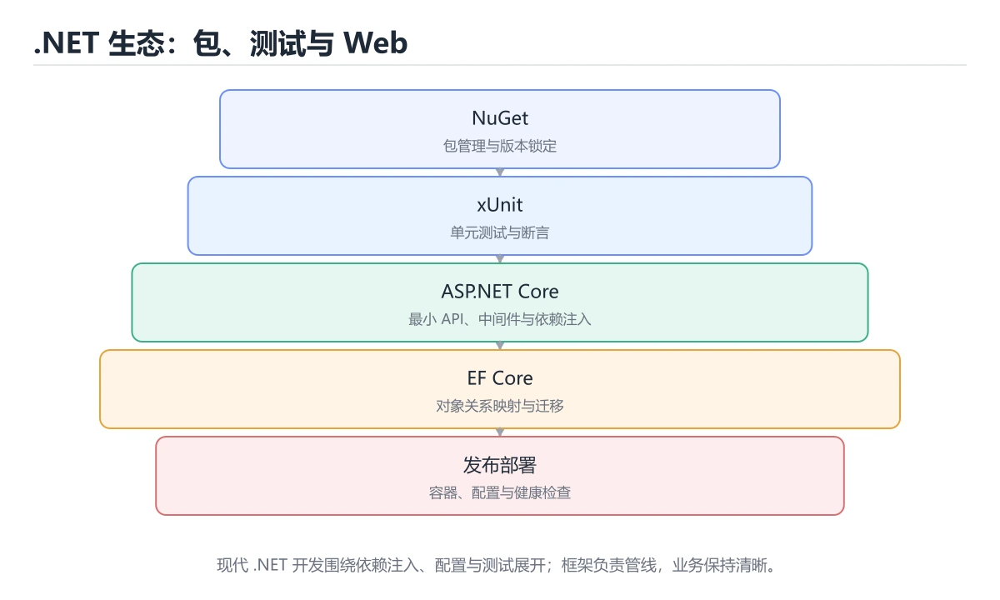

# 生态、测试与 Web 开发

> 内容更新时间：2026-10-06 · 学习阶段：进阶 · 预计用时：70 分钟




## 本节知识框架

**课程定位**：所属分类 `csharp`（C#），课程主题 `生态、测试与 Web 开发`，学习阶段 进阶，建议用时 65 分钟。

本课主线：NuGet、xUnit 测试、ASP.NET Core 最小 API 与 EF Core。

**学完本课应当能够**
- 说清 `dotnet restore` 与 `Add-Migration` 的含义与区别，并各举一个正例和一个反例。
- 用本课示例验证 `EF Core` 的行为，记录输入、输出与失败条件。
- 遇到「Singleton 注入 Scoped」这类问题时，能说出触发条件与修复顺序。

### 从概念到验证的学习链条

1. `dotnet restore`：先掌握 版本号尽量显式固定；`dotnet restore` 会按 lock 文件还原依赖，保证 CI 与本地一致，再用它解释 `Add-Migration` 为什么会出现。
2. `Add-Migration`：先掌握 EF Core 把 LINQ 翻译成 SQL，配合迁移（`Add-Migration` / `Database.Migrate()`）管理表结构，再用它解释 `EF Core` 为什么会出现。
3. `EF Core`：先掌握 EF Core 把 LINQ 翻译成 SQL，配合迁移（Add-Migration / Database.Migrate()）管理表结构，再用它解释 `NuGet` 为什么会出现。
4. `NuGet`：先掌握 .NET 的包管理器，restore 按项目文件解析并下载依赖，锁文件用于固定版本，再用它解释 本课示例的观察结果 为什么会出现。

**先修与衔接**：本课是「C#」分类的第 13 课。先修内容：《异步编程与异常处理》。《异步编程与异常处理》里的 `async`、`CancellationTokenSource` 是本课的前提。相关或后续课程：《实战：Web API + EF Core》。

### 完成判据

- **定义关**：不看正文也能说明 `dotnet restore` 是 版本号尽量显式固定，`dotnet restore` 会按 lock 文件还原依赖，保证 CI 与本地一致，并指出一个反例。
- **机制关**：能按“输入 → 转换 → 输出 → 验证”复述 `生态、测试与 Web 开发`，而不是只背结论。
- **示例关**：能运行或推演 `生态、测试与 Web 开发` 的 `bash` 示例，并说明一个真实出现的标识符或字面量。
- **证据关**：能指出 `生态、测试与 Web 开发` 示例里的 出现字面量 `Serilog`，并说明它支持或反驳了本课的哪一条结论。
- **排错关**：能复现 Singleton 注入 Scoped，记录现象并按 按生命周期匹配，或注入 `IServiceScopeFactory` 修复。
- **迁移关**：能把 `NuGet`、`xUnit`、`ASP.NET Core`、`EF Core` 放进一个与 `生态、测试与 Web 开发` 不同的项目场景，并保持输入与验证条件可追踪。
- **复盘关**：学完 `生态、测试与 Web 开发` 后，用一句话写下仍然不确定的结论，并列出下一次验证需要的输入、环境和成功判据。

### 复习清单

- [ ] 能不看正文复述本课核心术语，并指出一个边界或反例。
- [ ] 能运行或推演本课示例，记录输入、输出与失败现象。
- [ ] 能完成一次自测，并把错题对照错误表定位原因。

## 核心概念定义

| 术语 | 操作性定义 | 常见边界与风险 |
| --- | --- | --- |
| dotnet restore | 版本号尽量显式固定；dotnet restore 会按 lock 文件还原依赖，保证 CI 与本地一致。 | 不同版本与依赖组合的行为可能不同，升级或换环境前要按官方变更说明重新验证。 |
| Add-Migration | EF Core 把 LINQ 翻译成 SQL，配合迁移（Add-Migration / Database.Migrate()）管理表结构。 | 索引命中与数据分布决定实际开销，判断前先看执行计划而不是只看结果是否正确。 |
| EF Core | EF Core 把 LINQ 翻译成 SQL，配合迁移（Add-Migration / Database.Migrate()）管理表结构。 | 索引命中与数据分布决定实际开销，判断前先看执行计划而不是只看结果是否正确。 |
| NuGet | .NET 的包管理器，restore 按项目文件解析并下载依赖，锁文件用于固定版本。 | 不同版本与依赖组合的行为可能不同，升级或换环境前要按官方变更说明重新验证。 |

## 原理与运行机制

### 机制总览

**教材衔接：常用生态速览**

| 领域 | 常用选择 |
| --- | --- |
| Web / API | ASP.NET Core、Minimal API、Blazor |
| ORM | EF Core、Dapper |
| 日志 | Serilog、NLog、内置 ILogger |
| 测试 | xUnit、NUnit、Moq |
| 序列化 | System.Text.Json、Newtonsoft.Json |
| 桌面 / 移动 | WPF、WinUI、MAUI |

**教材衔接：EF Core 速查**

| 目的 | 写法 |
| --- | --- |
| 定义实体 | `public class Order { public int Id { get; set; } }` |
| 查询 | `await db.Orders.Where(o => o.Paid).ToListAsync()` |
| 单条查询 | `await db.Orders.FindAsync(id)` |
| 只读查询 | `.AsNoTracking()` 减少跟踪开销 |
| 分页 | `.OrderBy(o => o.Id).Skip(20).Take(10)` |
| 投影 | `.Select(o => new OrderDto { Id = o.Id })` |
| 预加载关联 | `.Include(o => o.Items)` |
| 避免 N+1 | `Include` / `Select` 投影一次取回 |
| 模型配置 | `IEntityTypeConfiguration<T>` 或 Fluent API |
| 迁移 | `dotnet ef migrations add Init`、`dotnet ef database update` |
| 并发控制 | 并发令牌（`[ConcurrencyCheck]` / `RowVersion`） |

**教材衔接：版本与时效**

- 先确认 SDK 版本，再决定 Add_WorksForManyCases 是否可以使用新语法或新 API。
- 若使用 AOT 或裁剪，Add_WorksForManyCases 的反射与动态加载路径需要重点验证。
- 升级「生态、测试与 Web 开发」涉及的依赖前，先用 Add_WorksForManyCases 复现当前行为，再逐项核对版本说明与破坏性变更。
- 官方说明：https://learn.microsoft.com/dotnet/core/whats-new/

### 升级检查清单

- 先固定当前版本，跑通全部示例与测验，再升级工具链。
- 只改 NuGet 的版本变量，记录编译、测试与产物体积的变化。
- 先回归 NuGet 与 xUnit 的默认行为和错误信息，再扩大测试范围。
- 升级完成后更新本课「最后复核 / 下次复核」日期，并记录 NuGet 的版本变化。

### 机制拆解：每一步的输入、动作与输出

#### 1. `dotnet restore`
- 输入：`NuGet`；本步把 版本号尽量显式固定；`dotnet restore` 会按 lock 文件还原依赖，保证 CI 与本地一致 当作判断规则。
- 动作：围绕 `dotnet restore` 保留中间状态，并记录它与 `Add-Migration` 的对应关系。
- 输出：`Add-Migration`，它可以被下一段代码、测试或记录继续使用。
- `dotnet restore` 的失败条件：不同版本与依赖组合的行为可能不同，升级或换环境前要按官方变更说明重新验证。

#### 2. `Add-Migration`
- 输入：`dotnet restore`；本步把 EF Core 把 LINQ 翻译成 SQL，配合迁移（`Add-Migration` / `Database.Migrate()`）管理表结构 当作判断规则。
- 动作：围绕 `Add-Migration` 保留中间状态，并记录它与 `EF Core` 的对应关系。
- 输出：`EF Core`，它可以被下一段代码、测试或记录继续使用。
- `Add-Migration` 的失败条件：索引命中与数据分布决定实际开销，判断前先看执行计划而不是只看结果是否正确。

#### 3. `EF Core`
- 输入：`Add-Migration`；本步把 EF Core 把 LINQ 翻译成 SQL，配合迁移（Add-Migration / Database.Migrate()）管理表结构 当作判断规则。
- 动作：围绕 `EF Core` 保留中间状态，并记录它与 `NuGet` 的对应关系。
- 输出：`NuGet`，它可以被下一段代码、测试或记录继续使用。
- `EF Core` 的失败条件：索引命中与数据分布决定实际开销，判断前先看执行计划而不是只看结果是否正确。

#### 4. `NuGet`
- 输入：`EF Core`；本步把 .NET 的包管理器，restore 按项目文件解析并下载依赖，锁文件用于固定版本 当作判断规则。
- 动作：围绕 `NuGet` 保留中间状态，并记录它与 `Serilog` 的对应关系。
- 输出：`Serilog`，它可以被下一段代码、测试或记录继续使用。
- `NuGet` 的失败条件：不同版本与依赖组合的行为可能不同，升级或换环境前要按官方变更说明重新验证。

### 示例中的可观察事实

1. 出现字面量 `Serilog`；它对应的课程主题是 `生态、测试与 Web 开发`。
2. 出现字面量 `3.1.1`；它对应的课程主题是 `生态、测试与 Web 开发`。

### 复现实验记录

- 环境：`生态、测试与 Web 开发` 使用 `bash` 示例，固定 `NuGet`、`xUnit`、`ASP.NET Core`、`EF Core` 作为第一组条件。
- 首轮输入：先确认 出现字面量 `Serilog`，预测 `dotnet restore` 会怎样变化。
- 基线观察：记录命令、输入、输出和错误原文，不用截图代替可复制的文本。
- 单变量修改：只改变 `NuGet`，观察 `NuGet` 是否仍满足定义。
- 失败注入：复现 Singleton 注入 Scoped，确认现象是 启动时报错或运行异常。
- 记录结论：把“修改前、修改后、预期变化、实际变化”写成四列表，这样复盘 `生态、测试与 Web 开发` 时才能区分概念错误与实现错误。

## 典型应用场景

**课程内置实验入口**：`sandbox:csharp`，用于动手验证《生态、测试与 Web 开发》的机制；实验结论不替代概念定义与复杂度分析。

- **Singleton 注入 Scoped**：典型现象是启动时报错或运行异常；正确做法是按生命周期匹配，或注入 `IServiceScopeFactory`。
- **用 `new` 创建服务**：典型现象是绕过依赖注入，难以测试；正确做法是全部从容器解析。
- **配置不校验**：典型现象是运行到一半才崩；正确做法是`ValidateOnStart()`。
- **忘记 `TreatWarningsAsErrors`**：典型现象是警告越积越多；正确做法是在 props 里统一开启。

### 最小验证场景

- 准备：保留 `bash` 示例的原始输入，先记录 `生态、测试与 Web 开发` 的基线输出和完整运行命令。
- 观察：先核对 出现字面量 `Serilog`，再改变一个与 `dotnet restore` 相关的条件。
- 判定：新结果与 `生态、测试与 Web 开发` 的基线不同不等于错误；只有当差异破坏了 `dotnet restore` 的定义或错误表中的约束，才判定为失败。

### 选择与边界

- 使用 `dotnet restore` 时，先满足它的定义：版本号尽量显式固定；`dotnet restore` 会按 lock 文件还原依赖，保证 CI 与本地一致；不同版本与依赖组合的行为可能不同，升级或换环境前要按官方变更说明重新验证。
- 使用 `Add-Migration` 时，先满足它的定义：EF Core 把 LINQ 翻译成 SQL，配合迁移（`Add-Migration` / `Database.Migrate()`）管理表结构；索引命中与数据分布决定实际开销，判断前先看执行计划而不是只看结果是否正确。
- 使用 `EF Core` 时，先满足它的定义：EF Core 把 LINQ 翻译成 SQL，配合迁移（Add-Migration / Database.Migrate()）管理表结构；索引命中与数据分布决定实际开销，判断前先看执行计划而不是只看结果是否正确。
- 使用 `NuGet` 时，先满足它的定义：.NET 的包管理器，restore 按项目文件解析并下载依赖，锁文件用于固定版本；不同版本与依赖组合的行为可能不同，升级或换环境前要按官方变更说明重新验证。

## 代码/协议/SQL 示例

### 最小可验证示例

```bash
dotnet add package Serilog              # 添加依赖
dotnet list package                    # 查看已安装包
dotnet remove package Serilog
```

**教材衔接：NuGet 包管理**

项目文件中的引用：

```xml
<ItemGroup>
  <PackageReference Include="Serilog" Version="3.1.1" />
</ItemGroup>
```

版本号尽量显式固定；`dotnet restore` 会按 lock 文件还原依赖，保证 CI 与本地一致。

**教材衔接：单元测试**

```csharp
// 使用 xUnit
public class CalculatorTests
{
    [Fact]
    public void Add_ReturnsSum()
    {
        Assert.Equal(5, Calculator.Add(2, 3));
    }

    [Theory]
    [InlineData(1, 2, 3)]
    [InlineData(-1, 1, 0)]
    public void Add_WorksForManyCases(int a, int b, int expected)
    {
        Assert.Equal(expected, Calculator.Add(a, b));
    }
}
```

```bash
dotnet new xunit -o Tests
dotnet test --collect:"XPlat Code Coverage"
```

测试命名建议「方法_场景_期望」，一个测试只验证一件事。

**教材衔接：ASP.NET Core 最小 API**

```csharp
var builder = WebApplication.CreateBuilder(args);
builder.Services.AddSingleton<ITodoService, TodoService>();   // 依赖注入

var app = builder.Build();

app.MapGet("/todos/{id:int}", (int id, ITodoService service) =>
    service.Find(id) is { } todo ? Results.Ok(todo) : Results.NotFound());

app.MapPost("/todos", (Todo todo, ITodoService service) =>
{
    service.Add(todo);
    return Results.Created($"/todos/{todo.Id}", todo);
});

app.Run();
```

内置依赖注入、配置、日志与中间件管道，是 .NET 后端开发的主流框架。

**教材衔接：EF Core 数据访问**

```csharp
public class AppDbContext : DbContext
{
    public DbSet<User> Users => Set<User>();
    public AppDbContext(DbContextOptions<AppDbContext> options) : base(options) { }
}

var user = await db.Users.FirstOrDefaultAsync(u => u.Id == id);
db.Users.Add(new User { Name = "tom" });
await db.SaveChangesAsync();
```

EF Core 把 LINQ 翻译成 SQL，配合迁移（`Add-Migration` / `Database.Migrate()`）管理表结构。

**教材衔接：依赖注入速查**

| 生命周期 | 行为 | 适用 |
| --- | --- | --- |
| `AddSingleton` | 整个应用一个实例 | 无状态服务、配置、缓存 |
| `AddScoped` | 每个请求一个实例 | `DbContext`、请求级服务 |
| `AddTransient` | 每次解析都新建 | 轻量无状态工具类 |

```csharp
var builder = WebApplication.CreateBuilder(args);

builder.Services.AddSingleton<IClock, SystemClock>();
builder.Services.AddScoped<IOrderRepository, EfOrderRepository>();
builder.Services.AddScoped<OrderService>();          // 构造器注入依赖
builder.Services.AddDbContext<AppDbContext>(options =>
    options.UseNpgsql(builder.Configuration.GetConnectionString("Db")));

var app = builder.Build();

app.UseExceptionHandler("/error");                   // 中间件顺序很关键
app.UseAuthentication();
app.UseAuthorization();
app.MapControllers();
app.Run();
```

**教材衔接：测试速查（xUnit）**

| 目的 | 写法 |
| --- | --- |
| 定义测试 | `[Fact]` |
| 参数化 | `[Theory]` + `[InlineData]` / `[MemberData]` |
| 断言相等 | `Assert.Equal(expected, actual)` |
| 断言异常 | `Assert.Throws<InvalidOperationException>(() => ...)` |
| 断言集合包含 | `Assert.Contains(item, list)` |
| 断言区间 | `Assert.InRange(value, low, high)` |
| 异步测试 | `async Task` + `await Assert.ThrowsAsync<...>(...)` |
| 共享夹具 | `IClassFixture<T>` |
| 跳过测试 | `[Fact(Skip = "待实现")]` |

```csharp
public class PriceTests
{
    [Theory]
    [InlineData(100, 10)]
    [InlineData(300, 0)]
    public void ShippingFee_ByAmount(int amount, int expected)
    {
        var calculator = new PriceCalculator();
        Assert.Equal(expected, calculator.ShippingFee("normal", amount));
    }
}
```

**教材衔接：零基础详解：.NET 生态与工程实践**

### 一句话说清它是什么

.NET 生态的日常可以概括为四件事：**建项目、装依赖、跑测试、发布**。
`dotnet` 命令把这四件事串起来，不用装额外的构建工具。

### 用生活比喻理解

| 组件 | 比喻 | 说明 |
| --- | --- | --- |
| SDK | 整套车间 | 编译、运行、模板、包管理 |
| NuGet | 零件超市 | 第三方库来源 |
| NuGet.config | 指定去哪家超市 | 配置私服镜像 |
| `dotnet test` | 验收 | 跑单元测试 |
| `dotnet publish` | 打包发货 | 生成可部署产物 |

### 常用命令速查

```bash
dotnet --info                       # 查看 SDK 与运行时版本
dotnet new list                     # 列出可用模板
dotnet new webapi -o MyApi          # 新建 Web API 项目
dotnet new xunit -o MyApi.Tests     # 新建测试项目
dotnet new sln -n MyApp             # 新建解决方案
dotnet sln add src/MyApi            # 把项目加进解决方案

dotnet restore                      # 还原依赖
dotnet build -c Release             # 构建
dotnet test --collect:"XPlat Code Coverage"   # 测试 + 覆盖率
dotnet run --project src/MyApi      # 运行
dotnet publish -c Release -o out    # 发布
dotnet add package Serilog          # 添加依赖
dotnet list package --outdated      # 检查可升级包
```

### 解决方案结构

```text
MyApp/
  MyApp.sln
  Directory.Build.props        统一编译属性（所有项目共用）
  src/
    MyApp.Api/                 Web API
    MyApp.Core/                业务逻辑
    MyApp.Infrastructure/      数据库与外部服务
  tests/
    MyApp.UnitTests/
    MyApp.IntegrationTests/
```

### Directory.Build.props：一处配置全仓库生效

```xml
<Project>
  <PropertyGroup>
    <TargetFramework>net9.0</TargetFramework>
    <Nullable>enable</Nullable>
    <ImplicitUsings>enable</ImplicitUsings>
    <TreatWarningsAsErrors>true</TreatWarningsAsErrors>
    <EnforceCodeStyleInBuild>true</EnforceCodeStyleInBuild>
    <AnalysisLevel>latest-recommended</AnalysisLevel>
  </PropertyGroup>
</Project>
```

| 配置 | 作用 |
| --- | --- |
| `Nullable` | 开启可空引用类型检查 |
| `TreatWarningsAsErrors` | 警告即失败，防止劣化 |
| `EnforceCodeStyleInBuild` | 构建时执行代码风格规则 |
| `AnalysisLevel` | 启用推荐的分析器规则 |

### 配置文件与选项模式

```json
// appsettings.json
{
  "Database": {
    "Host": "localhost",
    "Port": 5432
  },
  "Logging": { "LogLevel": { "Default": "Information" } }
}
```

```csharp
public sealed class DatabaseOptions
{
    public const string Section = "Database";
    public required string Host { get; init; }
    public int Port { get; init; } = 5432;
}

// Program.cs
builder.Services
    .AddOptions<DatabaseOptions>()
    .Bind(builder.Configuration.GetSection(DatabaseOptions.Section))
    .ValidateDataAnnotations()
    .ValidateOnStart();          // 启动时校验，而不是运行到一半才崩
```

### 日志与依赖注入

```csharp
var builder = WebApplication.CreateBuilder(args);

builder.Services.AddSingleton<IClock, SystemClock>();
builder.Services.AddScoped<IUserRepository, UserRepository>();   // 每个请求一个
builder.Services.AddHttpClient<IPaymentClient, PaymentClient>()
    .AddStandardResilienceHandler();      // 内建重试、超时、熔断

var app = builder.Build();

app.MapGet("/users/{id:int}", async (int id, IUserRepository repo, ILogger<Program> logger) =>
{
    logger.LogInformation("查询用户 {UserId}", id);
    var user = await repo.FindAsync(id);
    return user is null ? Results.NotFound() : Results.Ok(user);
});

app.Run();
```

### 生命周期的选择（最常见的坑）

| 生命周期 | 何时创建 | 适用 |
| --- | --- | --- |
| Singleton | 应用启动一次 | 无状态工具、配置 |
| Scoped | 每个请求一个 | 数据库上下文、仓储 |
| Transient | 每次注入都新建 | 轻量无状态服务 |

**规则**：Singleton 不能直接依赖 Scoped，否则捕获了短生命周期对象。

### 测试项目

```csharp
public class PriceTests
{
    [Theory]
    [InlineData(19.9, "19.90")]
    [InlineData(0, "0.00")]
    public void FormatsWithTwoDecimals(decimal value, string expected)
    {
        Assert.Equal(expected, Price.Format(value));
    }

    [Fact]
    public void ThrowsOnNegative()
    {
        var ex = Assert.Throws<ArgumentOutOfRangeException>(() => Price.Format(-1));
        Assert.Contains("不能为负", ex.Message);
    }
}
```

### 新手最容易踩的八个坑

| 坑 | 现象 | 正确做法 |
| --- | --- | --- |
| Singleton 注入 Scoped | 启动时报错或运行异常 | 按生命周期匹配，或注入 `IServiceScopeFactory` |
| 用 `new` 创建服务 | 绕过依赖注入，难以测试 | 全部从容器解析 |
| 配置不校验 | 运行到一半才崩 | `ValidateOnStart()` |
| 忘记 `TreatWarningsAsErrors` | 警告越积越多 | 在 props 里统一开启 |
| 每个项目各写版本 | 版本不一致 | 用 `Directory.Packages.props` 集中管理 |
| 直接 `dotnet publish` 不跑测试 | 带病发布 | CI 先 `dotnet test` |
| 用 `DateTime.Now` | 时区与测试问题 | 注入 `IClock` 或统一用 UTC |
| 大项目不分层 | 业务与基础设施耦合 | 按 Api / Core / Infrastructure 分层 |

### 手把手练习：集中管理依赖版本

```xml
<!-- Directory.Packages.props -->
<Project>
  <PropertyGroup>
    <ManagePackageVersionsCentrally>true</ManagePackageVersionsCentrally>
  </PropertyGroup>
  <ItemGroup>
    <PackageVersion Include="Serilog.AspNetCore" Version="8.0.3" />
    <PackageVersion Include="xunit" Version="2.9.2" />
    <PackageVersion Include="Microsoft.NET.Test.Sdk" Version="17.12.0" />
  </ItemGroup>
</Project>
```

之后各项目只写包名，不写版本，升级时改一处即可：

```xml
<ItemGroup>
  <PackageReference Include="Serilog.AspNetCore" />
</ItemGroup>
```

```bash
dotnet build -c Release
dotnet test --collect:"XPlat Code Coverage"
dotnet publish src/MyApp.Api -c Release -o out
```

### 学完自测

- [ ] 能说出 SDK 与运行时的区别。
- [ ] 知道三种服务生命周期各自适用什么场景。
- [ ] 能说出 `ValidateOnStart` 的好处。
- [ ] 知道为什么要集中管理包版本。
- [ ] 能说出 Singleton 依赖 Scoped 会有什么问题。

**运行方式**：运行 `生态、测试与 Web 开发` 的示例时，用 `bash 文件名.sh` 运行；先 `bash -n` 做语法检查更稳妥。

### 示例精读：先找证据，再改一个条件

1. 出现字面量 `Serilog`；它出现在 `生态、测试与 Web 开发` 的示例中，阅读时先确认它前后各发生了什么。
2. 出现字面量 `3.1.1`；它出现在 `生态、测试与 Web 开发` 的示例中，阅读时先确认它前后各发生了什么。
- 在 `生态、测试与 Web 开发` 中与 `dotnet restore` 对照：示例必须能支持 版本号尽量显式固定；`dotnet restore` 会按 lock 文件还原依赖，保证 CI 与本地一致，否则说明这一段还缺少实现或验证步骤。
- 在 `生态、测试与 Web 开发` 中与 `Add-Migration` 对照：示例必须能支持 EF Core 把 LINQ 翻译成 SQL，配合迁移（`Add-Migration` / `Database.Migrate()`）管理表结构，否则说明这一段还缺少实现或验证步骤。
- 在 `生态、测试与 Web 开发` 中与 `EF Core` 对照：示例必须能支持 EF Core 把 LINQ 翻译成 SQL，配合迁移（Add-Migration / Database.Migrate()）管理表结构，否则说明这一段还缺少实现或验证步骤。
- 在 `生态、测试与 Web 开发` 中与 `NuGet` 对照：示例必须能支持 .NET 的包管理器，restore 按项目文件解析并下载依赖，锁文件用于固定版本，否则说明这一段还缺少实现或验证步骤。

## 时间/空间复杂度或性能分析

**性能关注点（生态、测试与 Web 开发）**：GC 与异步调度影响开销：记录吞吐、延迟与分配速率。

**本课特有开销（生态、测试与 Web 开发 · NuGet）**：小文件看元数据开销，大文件看吞吐，两者要分别测量。

**测量方法**：以 `生态、测试与 Web 开发` 的 `NuGet` 场景为对象，固定输入跑一遍记录基线，再把规模或并发度提高一个数量级复测；两次结果的差值与波动范围才是结论依据。

### 需要控制的变量与记录项

- `生态、测试与 Web 开发` 的 `NuGet`：固定它的版本、输入范围和资源上限，分别记录速度、内存与失败率的变化。
- `生态、测试与 Web 开发` 的 `xUnit`：固定它的版本、输入范围和资源上限，分别记录速度、内存与失败率的变化。
- `生态、测试与 Web 开发` 的 `ASP.NET Core`：固定它的版本、输入范围和资源上限，分别记录速度、内存与失败率的变化。
- `生态、测试与 Web 开发` 的 `EF Core`：固定它的版本、输入范围和资源上限，分别记录速度、内存与失败率的变化。
- `生态、测试与 Web 开发` 的 `依赖注入`：固定它的版本、输入范围和资源上限，分别记录速度、内存与失败率的变化。
- `生态、测试与 Web 开发` 中 `dotnet restore` 的边界：不同版本与依赖组合的行为可能不同，升级或换环境前要按官方变更说明重新验证。达到边界时不要外推，必须重新测量。
- `生态、测试与 Web 开发` 中 `Add-Migration` 的边界：索引命中与数据分布决定实际开销，判断前先看执行计划而不是只看结果是否正确。达到边界时不要外推，必须重新测量。
- `生态、测试与 Web 开发` 中 `EF Core` 的边界：索引命中与数据分布决定实际开销，判断前先看执行计划而不是只看结果是否正确。达到边界时不要外推，必须重新测量。
- `生态、测试与 Web 开发` 中 `NuGet` 的边界：不同版本与依赖组合的行为可能不同，升级或换环境前要按官方变更说明重新验证。达到边界时不要外推，必须重新测量。
- `生态、测试与 Web 开发` 的代码证据：先验证 出现字面量 `Serilog`，再记录该路径的输入规模与耗时；只看代码行数不能推出复杂度。

## 常见误区与易错点

| 容易写错的做法 | 实际现象 | 原因与正确做法 |
| --- | --- | --- |
| Singleton 注入 Scoped | 启动时报错或运行异常 | 按生命周期匹配，或注入 `IServiceScopeFactory` |
| 用 `new` 创建服务 | 绕过依赖注入，难以测试 | 全部从容器解析 |
| 配置不校验 | 运行到一半才崩 | `ValidateOnStart()` |
| 忘记 `TreatWarningsAsErrors` | 警告越积越多 | 在 props 里统一开启 |
| 每个项目各写版本 | 版本不一致 | 用 `Directory.Packages.props` 集中管理 |
| 直接 `dotnet publish` 不跑测试 | 带病发布 | CI 先 `dotnet test` |
| 用 `DateTime.Now` | 时区与测试问题 | 注入 `IClock` 或统一用 UTC |
| 大项目不分层 | 业务与基础设施耦合 | 按 Api / Core / Infrastructure 分层 |
| `DbContext` 注册为 Singleton | 并发访问异常、状态错乱 | 必须用 `AddScoped` |
| 在后台线程用请求内的 `DbContext` | `ObjectDisposedException` | 每个作用域解析自己的实例 |
| 生命周期倒挂（Singleton 依赖 Scoped） | 启动时报错 | 检查依赖方向，必要时用工厂 |
| 中间件顺序错误 | 认证/授权不生效 | 按框架推荐顺序注册 |
| 在循环里查询数据库 | N+1 查询 | 批量查询或 `Include` |
| 修改实体后忘记 `SaveChangesAsync` | 数据没保存 | 明确提交点 |
| 用 `FirstOrDefault` 后不判空 | `NullReferenceException` | 判空或返回 404 |
| 测试里连真实数据库 | 慢且不稳定 | 用内存库、容器或测试替身 |
| 直接用 `Console.WriteLine` | 生产日志无法收集 | 用 `ILogger<T>` 结构化日志 |
| 连接字符串写死在代码里 | 泄漏与无法切换环境 | 用配置与环境变量 |
| DbContext 注册为 Singleton | 并发访问异常、状态错乱。 | 必须用 AddScoped。 |
| 在后台线程用请求内的 DbContext | ObjectDisposedException。 | 每个作用域解析自己的实例。 |

### 现场 1：Singleton 注入 Scoped

**症状**：启动时报错或运行异常。

**根因与修复**：按生命周期匹配，或注入 `IServiceScopeFactory`。

**自检**：在本课示例里复现「Singleton 注入 Scoped」，改成按生命周期匹配，或注入 `IServiceScopeFactory`后重跑；如果症状消失且失败路径按预期变化，说明定位正确。

### 现场 2：用 `new` 创建服务

**症状**：绕过依赖注入，难以测试。

**根因与修复**：全部从容器解析。

**自检**：在本课示例里复现「用 `new` 创建服务」，改成全部从容器解析后重跑；如果症状消失且失败路径按预期变化，说明定位正确。

### 现场 3：配置不校验

**症状**：运行到一半才崩。

**根因与修复**：`ValidateOnStart()`。

**自检**：在本课示例里复现「配置不校验」，改成`ValidateOnStart()`后重跑；如果症状消失且失败路径按预期变化，说明定位正确。

### 现场 4：忘记 `TreatWarningsAsErrors`

**症状**：警告越积越多。

**根因与修复**：在 props 里统一开启。

**自检**：在本课示例里复现「忘记 `TreatWarningsAsErrors`」，改成在 props 里统一开启后重跑；如果症状消失且失败路径按预期变化，说明定位正确。

### 现场 5：每个项目各写版本

**症状**：版本不一致。

**根因与修复**：用 `Directory.Packages.props` 集中管理。

**自检**：在本课示例里复现「每个项目各写版本」，改成用 `Directory.Packages.props` 集中管理后重跑；如果症状消失且失败路径按预期变化，说明定位正确。

### 现场 6：直接 `dotnet publish` 不跑测试

**症状**：带病发布。

**根因与修复**：CI 先 `dotnet test`。

**自检**：在本课示例里复现「直接 `dotnet publish` 不跑测试」，改成CI 先 `dotnet test`后重跑；如果症状消失且失败路径按预期变化，说明定位正确。

### 现场 7：用 `DateTime.Now`

**症状**：时区与测试问题。

**根因与修复**：注入 `IClock` 或统一用 UTC。

**自检**：在本课示例里复现「用 `DateTime.Now`」，改成注入 `IClock` 或统一用 UTC后重跑；如果症状消失且失败路径按预期变化，说明定位正确。

### 现场 8：大项目不分层

**症状**：业务与基础设施耦合。

**根因与修复**：按 Api / Core / Infrastructure 分层。

**自检**：在本课示例里复现「大项目不分层」，改成按 Api / Core / Infrastructure 分层后重跑；如果症状消失且失败路径按预期变化，说明定位正确。

### 现场 9：`DbContext` 注册为 Singleton

**症状**：并发访问异常、状态错乱。

**根因与修复**：必须用 `AddScoped`。

**自检**：在本课示例里复现「`DbContext` 注册为 Singleton」，改成必须用 `AddScoped`后重跑；如果症状消失且失败路径按预期变化，说明定位正确。

## 与其他知识点的关系

- **先修**：`异步编程与异常处理`。本课默认这些内容已经掌握。
- **相关或后续**：`实战：Web API + EF Core`。本课术语会在这些课程里继续使用。
- **术语归属**：`dotnet restore`、`Add-Migration`、`EF Core` 的定义以本课「核心概念定义」为准，换到其他课程时先确认定义是否被改写。
- 同一分类的《实战：Web API + EF Core》也涉及 `ASP.NET Core`；两课衔接时先确认这个术语的定义是否一致。
- 同一分类的《实战：C# 库存管理 CLI》也涉及 `xUnit`；两课衔接时先确认这个术语的定义是否一致。

### 先修与后续术语接口

- `异步编程与异常处理`：两者通过本分类的学习顺序衔接，阅读时重点比较各自的输入与失败条件。
- `实战：Web API + EF Core`：共同关键词 `ASP.NET Core`、`EF Core`、`xUnit`。

### 容易混淆的相邻概念

- `dotnet restore` 与 `Add-Migration`：前者强调 版本号尽量显式固定；`dotnet restore` 会按 lock 文件还原依赖，保证 CI 与本地一致；后者强调 EF Core 把 LINQ 翻译成 SQL，配合迁移（`Add-Migration` / `Database.Migrate()`）管理表结构。判断时分别检查两条定义的适用范围，不要只看名称相似就互换。
- `Add-Migration` 与 `EF Core`：前者强调 EF Core 把 LINQ 翻译成 SQL，配合迁移（`Add-Migration` / `Database.Migrate()`）管理表结构；后者强调 EF Core 把 LINQ 翻译成 SQL，配合迁移（Add-Migration / Database.Migrate()）管理表结构。判断时分别检查两条定义的适用范围，不要只看名称相似就互换。
- `EF Core` 与 `NuGet`：前者强调 EF Core 把 LINQ 翻译成 SQL，配合迁移（Add-Migration / Database.Migrate()）管理表结构；后者强调 .NET 的包管理器，restore 按项目文件解析并下载依赖，锁文件用于固定版本。判断时分别检查两条定义的适用范围，不要只看名称相似就互换。

## 自测题与参考答案

> 先独立作答，再对照参考答案；答案都能在本课正文、术语表或错误表里找到依据。

### 自测 1（概念复述）

不看正文，写出 `dotnet restore` 的操作性定义，并说明它与 `Add-Migration` 的区别。

**参考答案**：版本号尽量显式固定；`dotnet restore` 会按 lock 文件还原依赖，保证 CI 与本地一致。

`Add-Migration` 的定位是：EF Core 把 LINQ 翻译成 SQL，配合迁移（`Add-Migration` / `Database.Migrate()`）管理表结构；两者的差别要从适用对象与失败模式上说明。

### 自测 2（排错）

本课错误表记录了「Singleton 注入 Scoped」这类做法。请写出它会出现的现象、根因，以及修复顺序。

**参考答案**：现象是启动时报错或运行异常；正确做法是按生命周期匹配，或注入 `IServiceScopeFactory`。修复时先复现现象并保留证据，再改动一处假设重跑，确认现象消失。

### 自测 3（动手验证）

运行本课的 `bash` 示例，改动其中一个输入后重新运行，记录输出与错误信息。

**参考答案**：正常输入下 `bash` 示例应当复现正文给出的结果；改动输入后，如果结果改变或报错，先核对它是否满足 `生态、测试与 Web 开发` 中`dotnet restore` 的适用范围，再检查错误表里是否有同类现象。

### 自测 4（代码阅读）

阅读本课开头的 `bash` 示例，说明它体现了`dotnet restore` 的哪一条性质，并指出改动哪个输入会让这条性质不再成立。

**参考答案**：`dotnet restore` 的定义是 版本号尽量显式固定，`dotnet restore` 会按 lock 文件还原依赖，保证 CI 与本地一致，示例正是在实现这条定义。改动与 `dotnet restore` 有关的一个输入后，如果结果不再符合 `生态、测试与 Web 开发` 的正文描述，就说明该性质只在当前前提成立。

### 自测 5（迁移）

把 `生态、测试与 Web 开发` 的方法迁移到自己的项目：围绕 `dotnet restore` 写出一个与错误表同类的风险点，并说明触发条件和检验方式。

**参考答案**：例如「在后台线程用请求内的 DbContext」，它会导致ObjectDisposedException；检验方式是按每个作用域解析自己的实例改一处再复现，确认现象消失且没有引入新的失败分支。

### 自测 6（对比）

用一个表格对比 `dotnet restore` 与 `Add-Migration`：各写一行适用场景、一行失败表现。

**参考答案**：`dotnet restore` 的定义是版本号尽量显式固定；`dotnet restore` 会按 lock 文件还原依赖，保证 CI 与本地一致；`Add-Migration` 的定义是EF Core 把 LINQ 翻译成 SQL，配合迁移（`Add-Migration` / `Database.Migrate()`）管理表结构。两者的失败表现分别对应本课错误表里与本术语相关的行。

### 自测 7（排错顺序）

面对「Singleton 注入 Scoped」引发的问题，请把“复现 启动时报错或运行异常 → 保留证据 → 按生命周期匹配，或注入 `IServiceScopeFactory` → 回归验证”四步写成可执行的检查清单。

**参考答案**：第一步按启动时报错或运行异常复现；第二步记录输入、版本与完整报错；第三步按按生命周期匹配，或注入 `IServiceScopeFactory`只改一处；第四步重跑并确认失败路径也按预期变化。

### 自测 8（边界判断）

针对 `NuGet`，分别写出“可以使用”的条件和“结论不再成立”的条件。

**参考答案**：不同版本与依赖组合的行为可能不同，升级或换环境前要按官方变更说明重新验证。 同时要把 `NuGet` 的定义 .NET 的包管理器，restore 按项目文件解析并下载依赖，锁文件用于固定版本 与实际输入逐项对照。

### 自测 9（机制重建）

不看正文，按输入、转换、输出、验证四段重建 `dotnet restore` → `Add-Migration` → `EF Core` → `NuGet` 的作用链。

**参考答案**：起点是 `dotnet restore` 的定义 版本号尽量显式固定；`dotnet restore` 会按 lock 文件还原依赖，保证 CI 与本地一致；中间每一步都保留可观察状态；终点由 `NuGet` 检查，失败时回到错误表定位第一个偏离定义的步骤。

### 自测 10（综合排错）

在 `生态、测试与 Web 开发` 中，现象是 ObjectDisposedException。请围绕 在后台线程用请求内的 DbContext 写出最小复现、关键证据、修复动作和回归验证，并说明为什么不能只凭一次运行下结论。

**参考答案**：先复现 在后台线程用请求内的 DbContext，记录输入与完整错误；再按 每个作用域解析自己的实例 只改一处。回归时同时跑正常路径和边界路径，只有两次结果都可解释，才把修复视为完成。

### 自测 11（一分钟复述）

用每分钟约 200 字的速度复述 `生态、测试与 Web 开发`：先给主问题，再按顺序说出 `dotnet restore`、`Add-Migration`、`EF Core`、`NuGet`，最后给一个失败案例。

**自评标准**：主问题必须对应 NuGet、xUnit 测试、ASP.NET Core 最小 API 与 EF Core；每个术语都要能接上一句定义或边界；失败案例必须写成可观察现象，不能用“可能有风险”代替证据。

## 术语速查

| 术语 | 一句话说明 |
| --- | --- |
| `dotnet restore` | 版本号尽量显式固定；`dotnet restore` 会按 lock 文件还原依赖，保证 CI 与本地一致。 |
| `Add-Migration` | EF Core 把 LINQ 翻译成 SQL，配合迁移（`Add-Migration` / `Database.Migrate()`）管理表结构。 |
| `EF Core` | EF Core 把 LINQ 翻译成 SQL，配合迁移（Add-Migration / Database.Migrate()）管理表结构。 |
| `NuGet` | .NET 的包管理器，restore 按项目文件解析并下载依赖，锁文件用于固定版本。 |

**术语关系**：`dotnet restore`（版本号尽量显式固定） → `Add-Migration`（EF Core 把 LINQ 翻译成 SQL） → `EF Core`（EF Core 把 LINQ 翻译成 SQL） → `NuGet`（.NET 的包管理器）。

## 考点精讲

`生态、测试与 Web 开发` 的题库有 6 道题，下面逐题给出题干、正确项与判断依据：先自己作答，再核对正确项，最后回到正文对应小节复核。

### 考点 1：第 1 题

- **题目**：下面这段 `csharp` 代码来自 `生态、测试与 Web 开发`。课程主线是NuGet、xUnit 测试、ASP.NET Core 最小 API 与 EF Core。代码与 `dotnet restore` 有关。哪一项是代码里真实出现的内容？
- **正确项**：出现字面量 `3.1.1`
- **判断依据**：这道题落在术语 `dotnet restore` 上：版本号尽量显式固定，`dotnet restore` 会按 lock 文件还原依赖，保证 CI 与本地一致。复习时把 `dotnet restore` 的定义、适用边界和一个反例一起说清楚，再回到「核心概念定义」核对原文。

### 考点 2：第 2 题

- **题目**：xUnit 中 [Theory] 配合 [InlineData] 用于？
- **正确项**：参数化测试
- **判断依据**：这道题检验本课主问题：NuGet、xUnit 测试、ASP.NET Core 最小 API 与 EF Core。复习时先复述本课主问题，再举一个会让结论失效的输入。

### 考点 3：第 3 题

- **题目**：EF Core 的主要作用是？
- **正确项**：ORM：把对象与 LINQ 映射到数据库
- **判断依据**：这道题落在术语 `EF Core` 上：EF Core 把 LINQ 翻译成 SQL，配合迁移（Add-Migration / Database.Migrate()）管理表结构。复习时把 `EF Core` 的定义、适用边界和一个反例一起说清楚，再回到「核心概念定义」核对原文。

### 考点 4：第 4 题

- **题目**：ASP.NET Core 中间件的执行方式是？
- **正确项**：按注册顺序组成管道依次调用
- **判断依据**：这道题检验本课主问题：NuGet、xUnit 测试、ASP.NET Core 最小 API 与 EF Core。复习时先复述本课主问题，再举一个会让结论失效的输入。

### 考点 5：第 5 题

- **题目**：围绕“生态、测试与 Web 开发”中的 NuGet、xUnit、ASP.NET Core，下列哪两项是本课强调的实践判断？
- **正确项**：验证 xUnit 时要固定版本并覆盖边界输入，结论才可复现；学习 NuGet 时要同时说明输入、输出和失败路径，不能只看正常流程
- **判断依据**：这道题落在术语 `NuGet` 上：.NET 的包管理器，restore 按项目文件解析并下载依赖，锁文件用于固定版本。复习时把 `NuGet` 的定义、适用边界和一个反例一起说清楚，再回到「核心概念定义」核对原文。

### 考点 6：第 6 题

- **题目**：填空：补齐下面这段术语说明中的空缺。课程 `NuGet、xUnit 测试、ASP.NET Core 最小 API 与 EF Core。`，这段说明是：EF Core 把 LINQ 翻译成 SQL，配合迁移（``____`` / `Database.Migrate()`）管理表结构。空缺处应填哪个术语？
- **正确项**：Add-Migration
- **判断依据**：这道题落在术语 `Add-Migration` 上：EF Core 把 LINQ 翻译成 SQL，配合迁移（`Add-Migration` / `Database.Migrate()`）管理表结构。复习时把 `Add-Migration` 的定义、适用边界和一个反例一起说清楚，再回到「核心概念定义」核对原文。

### 考点 7：`dotnet restore`

- **要点**：版本号尽量显式固定；`dotnet restore` 会按 lock 文件还原依赖，保证 CI 与本地一致。
- **dotnet restore 的边界**：不同版本与依赖组合的行为可能不同，升级或换环境前要按官方变更说明重新验证。

### 考点 8：`Add-Migration`

- **要点**：EF Core 把 LINQ 翻译成 SQL，配合迁移（`Add-Migration` / `Database.Migrate()`）管理表结构。
- **Add-Migration 的边界**：索引命中与数据分布决定实际开销，判断前先看执行计划而不是只看结果是否正确。

### 考点 9：`EF Core`

- **要点**：EF Core 把 LINQ 翻译成 SQL，配合迁移（Add-Migration / Database.Migrate()）管理表结构。
- **EF Core 的边界**：索引命中与数据分布决定实际开销，判断前先看执行计划而不是只看结果是否正确。

### 考点 10：`NuGet`

- **要点**：.NET 的包管理器，restore 按项目文件解析并下载依赖，锁文件用于固定版本。
- **NuGet 的边界**：不同版本与依赖组合的行为可能不同，升级或换环境前要按官方变更说明重新验证。

### 考点 11：排错——Singleton 注入 Scoped

- **现象**：启动时报错或运行异常。
- **处理**：按生命周期匹配，或注入 `IServiceScopeFactory`。

### 考点 12：排错——用 `new` 创建服务

- **现象**：绕过依赖注入，难以测试。
- **处理**：全部从容器解析。

### 考点 13：综合辨析——`dotnet restore` 与 `NuGet`

- **辨析点**：`dotnet restore` 的定义是 版本号尽量显式固定；`dotnet restore` 会按 lock 文件还原依赖，保证 CI 与本地一致；`NuGet` 的定义是 .NET 的包管理器，restore 按项目文件解析并下载依赖，锁文件用于固定版本。
- **答题要求**：面对 `生态、测试与 Web 开发` 的题目，先判断描述的是 `dotnet restore` 还是 `NuGet`，再归到对应定义，最后写出一个会让该定义失效的边界输入。

### 考点 14：排错评分点

- **现象分**：能写出 启动时报错或运行异常，而不是只写“程序有错”。
- **证据分**：保留触发 Singleton 注入 Scoped 的输入、版本和错误原文。
- **修复分**：按 按生命周期匹配，或注入 `IServiceScopeFactory` 只改一处，并同时回归正常路径与边界路径。

## 内容元数据

- 内容版本：v2.0
- 最后更新：2026-10-06
- 学习阶段：进阶
- 适用环境：.NET 9 / C# 13
；本课聚焦 NuGet。
- 内容来源：内置结构化课程与工程实践整理
- 相关主题：NuGet、xUnit、ASP.NET Core、EF Core、依赖注入
- 质量版本：P0 测验标准 + P1 覆盖扩展 + P2 体验补全

## 参考资料与复核

- 最后复核：2026-10-04
- 下次复核：2027-03-10
- 复核范围：版本兼容、API 行为、安全建议与工程实践
- 来源性质：官方文档、标准或权威教材；本课核对关键词：NuGet、xUnit、ASP.NET Core、EF Core、依赖注入。

| 参考资料 | 本课用途 |
| --- | --- |
| [.NET 文档](https://learn.microsoft.com/dotnet/) | 运行时、库与工具链 |
| [ASP.NET Core 文档](https://learn.microsoft.com/aspnet/core/) | Web API 与中间件 |
| [EF Core 文档](https://learn.microsoft.com/ef/core/) | ORM、迁移与并发 |

| [本课术语索引：生态、测试与 Web 开发](#核心概念定义) | 按本课输入、术语边界和错误表现逐项核对 |
> 「生态、测试与 Web 开发」的链接用于离线阅读后的延伸核对；App 不会自动联网。