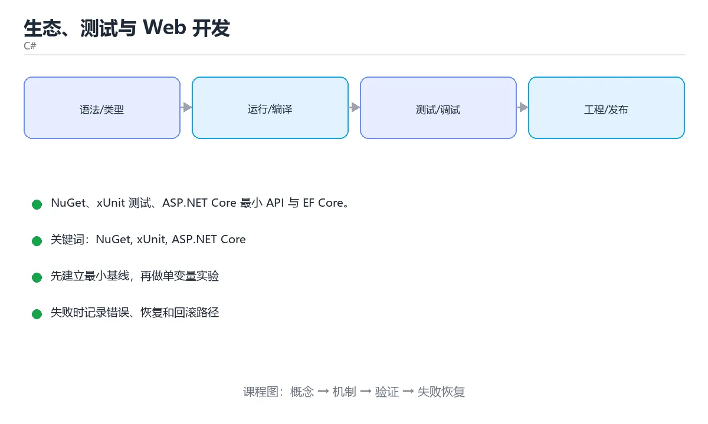

# 生态、测试与 Web 开发



> 内容更新时间：2026-10-03 · 学习阶段：进阶 · 预计用时：16 分钟

## 学习目标

- 能用自己的话解释「生态、测试与 Web 开发」解决了什么问题，而不是只背术语。
- 能说清 「NuGet」、「xUnit」、「ASP.NET Core」、「EF Core」 之间的关系，并分别举出一个例子。
- 能把本课知识放回「C#」的知识体系，说明它和相邻主题的边界。
- 能完成本课练习，并用验收标准检查自己的结果。

> 一句话摘要：NuGet、xUnit 测试、ASP.NET Core 最小 API 与 EF Core。

## 前置知识

- 先完成上一课《异步编程与异常处理》；如果已经掌握，可以直接用本课练习自测。
- 本课阶段：进阶。建议先掌握同一分类的基础课程，并能独立运行正文中的最小示例。
- 开始前先复习：NuGet、xUnit、ASP.NET Core。
- 如果某一步看不懂，先记录具体卡点，完成练习后再回头读一遍。


## NuGet 包管理

```bash
dotnet add package Serilog              # 添加依赖
dotnet list package                    # 查看已安装包
dotnet remove package Serilog
```

项目文件中的引用：

```xml
<ItemGroup>
  <PackageReference Include="Serilog" Version="3.1.1" />
</ItemGroup>
```

版本号尽量显式固定；`dotnet restore` 会按 lock 文件还原依赖，保证 CI 与本地一致。

## 单元测试

```csharp
// 使用 xUnit
public class CalculatorTests
{
    [Fact]
    public void Add_ReturnsSum()
    {
        Assert.Equal(5, Calculator.Add(2, 3));
    }

    [Theory]
    [InlineData(1, 2, 3)]
    [InlineData(-1, 1, 0)]
    public void Add_WorksForManyCases(int a, int b, int expected)
    {
        Assert.Equal(expected, Calculator.Add(a, b));
    }
}
```

```bash
dotnet new xunit -o Tests
dotnet test --collect:"XPlat Code Coverage"
```

测试命名建议「方法_场景_期望」，一个测试只验证一件事。

## ASP.NET Core 最小 API

```csharp
var builder = WebApplication.CreateBuilder(args);
builder.Services.AddSingleton<ITodoService, TodoService>();   // 依赖注入

var app = builder.Build();

app.MapGet("/todos/{id:int}", (int id, ITodoService service) =>
    service.Find(id) is { } todo ? Results.Ok(todo) : Results.NotFound());

app.MapPost("/todos", (Todo todo, ITodoService service) =>
{
    service.Add(todo);
    return Results.Created($"/todos/{todo.Id}", todo);
});

app.Run();
```

内置依赖注入、配置、日志与中间件管道，是 .NET 后端开发的主流框架。

## EF Core 数据访问

```csharp
public class AppDbContext : DbContext
{
    public DbSet<User> Users => Set<User>();
    public AppDbContext(DbContextOptions<AppDbContext> options) : base(options) { }
}

var user = await db.Users.FirstOrDefaultAsync(u => u.Id == id);
db.Users.Add(new User { Name = "tom" });
await db.SaveChangesAsync();
```

EF Core 把 LINQ 翻译成 SQL，配合迁移（`Add-Migration` / `Database.Migrate()`）管理表结构。

## 常用生态速览

| 领域 | 常用选择 |
| --- | --- |
| Web / API | ASP.NET Core、Minimal API、Blazor |
| ORM | EF Core、Dapper |
| 日志 | Serilog、NLog、内置 ILogger |
| 测试 | xUnit、NUnit、Moq |
| 序列化 | System.Text.Json、Newtonsoft.Json |
| 桌面 / 移动 | WPF、WinUI、MAUI |

## 本课小结
C# 的工程能力 = **NuGet 管依赖、xUnit 写测试、ASP.NET Core 做服务、EF Core 访问数据库**。先把这几件用熟，再按业务扩展。


## 依赖注入速查

| 生命周期 | 行为 | 适用 |
| --- | --- | --- |
| `AddSingleton` | 整个应用一个实例 | 无状态服务、配置、缓存 |
| `AddScoped` | 每个请求一个实例 | `DbContext`、请求级服务 |
| `AddTransient` | 每次解析都新建 | 轻量无状态工具类 |

```csharp
var builder = WebApplication.CreateBuilder(args);

builder.Services.AddSingleton<IClock, SystemClock>();
builder.Services.AddScoped<IOrderRepository, EfOrderRepository>();
builder.Services.AddScoped<OrderService>();          // 构造器注入依赖
builder.Services.AddDbContext<AppDbContext>(options =>
    options.UseNpgsql(builder.Configuration.GetConnectionString("Db")));

var app = builder.Build();

app.UseExceptionHandler("/error");                   // 中间件顺序很关键
app.UseAuthentication();
app.UseAuthorization();
app.MapControllers();
app.Run();
```

## 测试速查（xUnit）

| 目的 | 写法 |
| --- | --- |
| 定义测试 | `[Fact]` |
| 参数化 | `[Theory]` + `[InlineData]` / `[MemberData]` |
| 断言相等 | `Assert.Equal(expected, actual)` |
| 断言异常 | `Assert.Throws<InvalidOperationException>(() => ...)` |
| 断言集合包含 | `Assert.Contains(item, list)` |
| 断言区间 | `Assert.InRange(value, low, high)` |
| 异步测试 | `async Task` + `await Assert.ThrowsAsync<...>(...)` |
| 共享夹具 | `IClassFixture<T>` |
| 跳过测试 | `[Fact(Skip = "待实现")]` |

```csharp
public class PriceTests
{
    [Theory]
    [InlineData(100, 10)]
    [InlineData(300, 0)]
    public void ShippingFee_ByAmount(int amount, int expected)
    {
        var calculator = new PriceCalculator();
        Assert.Equal(expected, calculator.ShippingFee("normal", amount));
    }
}
```

## EF Core 速查

| 目的 | 写法 |
| --- | --- |
| 定义实体 | `public class Order { public int Id { get; set; } }` |
| 查询 | `await db.Orders.Where(o => o.Paid).ToListAsync()` |
| 单条查询 | `await db.Orders.FindAsync(id)` |
| 只读查询 | `.AsNoTracking()` 减少跟踪开销 |
| 分页 | `.OrderBy(o => o.Id).Skip(20).Take(10)` |
| 投影 | `.Select(o => new OrderDto { Id = o.Id })` |
| 预加载关联 | `.Include(o => o.Items)` |
| 避免 N+1 | `Include` / `Select` 投影一次取回 |
| 模型配置 | `IEntityTypeConfiguration<T>` 或 Fluent API |
| 迁移 | `dotnet ef migrations add Init`、`dotnet ef database update` |
| 并发控制 | 并发令牌（`[ConcurrencyCheck]` / `RowVersion`） |

## 常见错误对照表

| 容易踩的做法 | 实际现象 | 原因与正确做法 |
| --- | --- | --- |
| `DbContext` 注册为 Singleton | 并发访问异常、状态错乱 | 必须用 `AddScoped` |
| 在后台线程用请求内的 `DbContext` | `ObjectDisposedException` | 每个作用域解析自己的实例 |
| 生命周期倒挂（Singleton 依赖 Scoped） | 启动时报错 | 检查依赖方向，必要时用工厂 |
| 中间件顺序错误 | 认证/授权不生效 | 按框架推荐顺序注册 |
| 在循环里查询数据库 | N+1 查询 | 批量查询或 `Include` |
| 修改实体后忘记 `SaveChangesAsync` | 数据没保存 | 明确提交点 |
| 用 `FirstOrDefault` 后不判空 | `NullReferenceException` | 判空或返回 404 |
| 测试里连真实数据库 | 慢且不稳定 | 用内存库、容器或测试替身 |
| 直接用 `Console.WriteLine` | 生产日志无法收集 | 用 `ILogger<T>` 结构化日志 |
| 连接字符串写死在代码里 | 泄漏与无法切换环境 | 用配置与环境变量 |

## 自测清单

- [ ] 能说清 Singleton / Scoped / Transient 的取舍。
- [ ] `DbContext` 使用 Scoped 生命周期。
- [ ] 会用 `AsNoTracking` 优化只读查询，并避免 N+1。
- [ ] 单元测试覆盖正常、边界与异常路径。
- [ ] 日志用 `ILogger<T>`，配置来自环境变量。


## 零基础详解：.NET 生态与工程实践

### 一句话说清它是什么

.NET 生态的日常可以概括为四件事：**建项目、装依赖、跑测试、发布**。
`dotnet` 命令把这四件事串起来，不用装额外的构建工具。

### 用生活比喻理解

| 组件 | 比喻 | 说明 |
| --- | --- | --- |
| SDK | 整套车间 | 编译、运行、模板、包管理 |
| NuGet | 零件超市 | 第三方库来源 |
| NuGet.config | 指定去哪家超市 | 配置私服镜像 |
| `dotnet test` | 验收 | 跑单元测试 |
| `dotnet publish` | 打包发货 | 生成可部署产物 |

### 常用命令速查

```bash
dotnet --info                       # 查看 SDK 与运行时版本
dotnet new list                     # 列出可用模板
dotnet new webapi -o MyApi          # 新建 Web API 项目
dotnet new xunit -o MyApi.Tests     # 新建测试项目
dotnet new sln -n MyApp             # 新建解决方案
dotnet sln add src/MyApi            # 把项目加进解决方案

dotnet restore                      # 还原依赖
dotnet build -c Release             # 构建
dotnet test --collect:"XPlat Code Coverage"   # 测试 + 覆盖率
dotnet run --project src/MyApi      # 运行
dotnet publish -c Release -o out    # 发布
dotnet add package Serilog          # 添加依赖
dotnet list package --outdated      # 检查可升级包
```

### 解决方案结构

```text
MyApp/
  MyApp.sln
  Directory.Build.props        统一编译属性（所有项目共用）
  src/
    MyApp.Api/                 Web API
    MyApp.Core/                业务逻辑
    MyApp.Infrastructure/      数据库与外部服务
  tests/
    MyApp.UnitTests/
    MyApp.IntegrationTests/
```

### Directory.Build.props：一处配置全仓库生效

```xml
<Project>
  <PropertyGroup>
    <TargetFramework>net9.0</TargetFramework>
    <Nullable>enable</Nullable>
    <ImplicitUsings>enable</ImplicitUsings>
    <TreatWarningsAsErrors>true</TreatWarningsAsErrors>
    <EnforceCodeStyleInBuild>true</EnforceCodeStyleInBuild>
    <AnalysisLevel>latest-recommended</AnalysisLevel>
  </PropertyGroup>
</Project>
```

| 配置 | 作用 |
| --- | --- |
| `Nullable` | 开启可空引用类型检查 |
| `TreatWarningsAsErrors` | 警告即失败，防止劣化 |
| `EnforceCodeStyleInBuild` | 构建时执行代码风格规则 |
| `AnalysisLevel` | 启用推荐的分析器规则 |

### 配置文件与选项模式

```json
// appsettings.json
{
  "Database": {
    "Host": "localhost",
    "Port": 5432
  },
  "Logging": { "LogLevel": { "Default": "Information" } }
}
```

```csharp
public sealed class DatabaseOptions
{
    public const string Section = "Database";
    public required string Host { get; init; }
    public int Port { get; init; } = 5432;
}

// Program.cs
builder.Services
    .AddOptions<DatabaseOptions>()
    .Bind(builder.Configuration.GetSection(DatabaseOptions.Section))
    .ValidateDataAnnotations()
    .ValidateOnStart();          // 启动时校验，而不是运行到一半才崩
```

### 日志与依赖注入

```csharp
var builder = WebApplication.CreateBuilder(args);

builder.Services.AddSingleton<IClock, SystemClock>();
builder.Services.AddScoped<IUserRepository, UserRepository>();   // 每个请求一个
builder.Services.AddHttpClient<IPaymentClient, PaymentClient>()
    .AddStandardResilienceHandler();      // 内建重试、超时、熔断

var app = builder.Build();

app.MapGet("/users/{id:int}", async (int id, IUserRepository repo, ILogger<Program> logger) =>
{
    logger.LogInformation("查询用户 {UserId}", id);
    var user = await repo.FindAsync(id);
    return user is null ? Results.NotFound() : Results.Ok(user);
});

app.Run();
```

### 生命周期的选择（最常见的坑）

| 生命周期 | 何时创建 | 适用 |
| --- | --- | --- |
| Singleton | 应用启动一次 | 无状态工具、配置 |
| Scoped | 每个请求一个 | 数据库上下文、仓储 |
| Transient | 每次注入都新建 | 轻量无状态服务 |

**规则**：Singleton 不能直接依赖 Scoped，否则捕获了短生命周期对象。

### 测试项目

```csharp
public class PriceTests
{
    [Theory]
    [InlineData(19.9, "19.90")]
    [InlineData(0, "0.00")]
    public void FormatsWithTwoDecimals(decimal value, string expected)
    {
        Assert.Equal(expected, Price.Format(value));
    }

    [Fact]
    public void ThrowsOnNegative()
    {
        var ex = Assert.Throws<ArgumentOutOfRangeException>(() => Price.Format(-1));
        Assert.Contains("不能为负", ex.Message);
    }
}
```

### 新手最容易踩的八个坑

| 坑 | 现象 | 正确做法 |
| --- | --- | --- |
| Singleton 注入 Scoped | 启动时报错或运行异常 | 按生命周期匹配，或注入 `IServiceScopeFactory` |
| 用 `new` 创建服务 | 绕过依赖注入，难以测试 | 全部从容器解析 |
| 配置不校验 | 运行到一半才崩 | `ValidateOnStart()` |
| 忘记 `TreatWarningsAsErrors` | 警告越积越多 | 在 props 里统一开启 |
| 每个项目各写版本 | 版本不一致 | 用 `Directory.Packages.props` 集中管理 |
| 直接 `dotnet publish` 不跑测试 | 带病发布 | CI 先 `dotnet test` |
| 用 `DateTime.Now` | 时区与测试问题 | 注入 `IClock` 或统一用 UTC |
| 大项目不分层 | 业务与基础设施耦合 | 按 Api / Core / Infrastructure 分层 |

### 手把手练习：集中管理依赖版本

```xml
<!-- Directory.Packages.props -->
<Project>
  <PropertyGroup>
    <ManagePackageVersionsCentrally>true</ManagePackageVersionsCentrally>
  </PropertyGroup>
  <ItemGroup>
    <PackageVersion Include="Serilog.AspNetCore" Version="8.0.3" />
    <PackageVersion Include="xunit" Version="2.9.2" />
    <PackageVersion Include="Microsoft.NET.Test.Sdk" Version="17.12.0" />
  </ItemGroup>
</Project>
```

之后各项目只写包名，不写版本，升级时改一处即可：

```xml
<ItemGroup>
  <PackageReference Include="Serilog.AspNetCore" />
</ItemGroup>
```

```bash
dotnet build -c Release
dotnet test --collect:"XPlat Code Coverage"
dotnet publish src/MyApp.Api -c Release -o out
```

### 学完自测

- [ ] 能说出 SDK 与运行时的区别。
- [ ] 知道三种服务生命周期各自适用什么场景。
- [ ] 能说出 `ValidateOnStart` 的好处。
- [ ] 知道为什么要集中管理包版本。
- [ ] 能说出 Singleton 依赖 Scoped 会有什么问题。

## 动手练习


> 本课练习重点：围绕「NuGet、xUnit、ASP.NET Core」完成复述、实验和交付，每个结果都要能被别人检查。

先建最小控制台程序，再补类型、异步和异常路径，最后用 dotnet test 验证。

### 练习 1：建立心智模型（10 分钟）

合上教程，用 3～5 句话回答：

1. 「生态、测试与 Web 开发」解决了什么问题？
2. 如果没有它，会出现什么具体后果？
3. 它和「xUnit」是什么关系？

**验收标准**：至少出现一个本课关键词，并写出一个反例、边界条件或失效场景。

### 练习 2：做一次可控实验（20 分钟）

从正文中选一个最小示例，完成以下操作：

1. 先预测修改一个参数、输入或步骤后的结果。
2. 再实际执行或逐步推演，记录真实结果。
3. 如果结果与预测不同，写出差异原因。

**验收标准**：留下「原例 → 改动 → 预测 → 结果 → 原因」五步记录。

### 练习 3：交付一个小结果（30 分钟）

写一个控制台小程序，补一个正例、一个边界值和一个异常路径。

任务要求：

- 结果必须能被别人检查，不能只写“我已经理解了”。
- 至少覆盖「NuGet」和「xUnit」两个关键词。
- 写出 1 个仍然不确定的问题，以及下一步如何验证。

> 提示：时间有限时优先做练习 1 和练习 2；练习 3 可以拆成两次完成。


## 考点精讲：把测验题还原成判断过程

本课有 5 个判断点。先自己作答，再看「判断依据」；如果结论正确但理由不完整，回到正文对应章节补足概念。

### 考点 1：.NET 的包管理器是？

- **正确判断**：NuGet
- **判断依据**：NuGet 是 .NET 的包管理器，用 dotnet add package 安装依赖。其他选项：NuGet 是 .NET 的包管理器。Maven 属 Java、npm 属 Node、pip 属 Python。正确项「NuGet」与题干要求一致，是本课知识点的准确定义。把题干「.NET 的包管理器是？」放回《生态、测试与 Web 开发》的「NuGet、xUnit 测试、ASP.NET Core 最小 API 与 EF Core」语境，逐项对照定义与边界条件，就能排除其余说法。
- **迁移检查**：如果给某个错误选项去掉一个限定词，它会不会变成正确？说明理由。

### 考点 2：xUnit 中 [Theory] 配合 [InlineData] 用于？

- **正确判断**：参数化测试
- **判断依据**：Theory 表示数据驱动测试，InlineData 提供每组参数，减少重复代码。其他选项：[Theory] 与 [InlineData] 提供参数化测试。异步、跳过与性能测试各由其他特性承担。正确项「参数化测试」与题干要求一致，是本课知识点的准确定义。错误项「跳过测试」属于相邻主题的说法，范围与本题要求不一致。错误项「异步测试」与课程给出的定义相冲突，不能回答题目所问。把题干「xUnit 中 [Theory] 配合 [InlineData] 用于？」放回《生态、测试与 Web 开发》的「NuGet、xUnit 测试、ASP.NET Core 最小 API 与 EF Core」语境，逐项对照定义与边界条件，就能排除其余说法。
- **迁移检查**：如果给某个错误选项去掉一个限定词，它会不会变成正确？说明理由。

### 考点 3：EF Core 的主要作用是？

- **正确判断**：ORM：把对象与 LINQ 映射到数据库
- **判断依据**：EF Core 负责对象关系映射，把 LINQ 翻译成 SQL，并配合迁移管理表结构。其他选项：EF Core 是 ORM，把对象与 LINQ 映射为 SQL。它不是版本控制、图像压缩或前端框架。正确项「ORM：把对象与 LINQ 映射到数据库」正面回答了题目所问，符合课程给出的定义与适用范围。错误项「压缩图片」属于相邻主题的说法，范围与本题要求不一致。错误项「生成前端页面」与课程给出的定义相冲突，不能回答题目所问。错误项「管理 Git 分支（仅部分场景成立）」只看到了表面现象，没有解释题干真正考查的机制。把题干「EF Core 的主要作用是？」放回《生态、测试与 Web 开发》的「NuGet、xUnit 测试、ASP.NET Core 最小 API 与 EF Core」语境，逐项对照定义与边界条件，就能排除其余说法。
- **迁移检查**：把题干里的一个条件换成边界值，原来的结论还成立吗？写出判断过程。

### 考点 4：ASP.NET Core 中间件的执行方式是？

- **正确判断**：按注册顺序组成管道依次调用
- **判断依据**：顺序很关键：异常处理、认证、授权、静态文件、路由都有惯用的注册次序。其他选项：中间件按注册顺序组成管道，顺序错误会让鉴权或异常处理失效。它既不是随机执行，也不限数量。正确项「按注册顺序组成管道依次调用」描述正确，能够解释题干场景中的现象与结果。错误项「随机顺序执行」与课程给出的定义相冲突，不能回答题目所问。错误项「只执行最后一个」只看到了表面现象，没有解释题干真正考查的机制。错误项「只能注册一个」在边界或失败路径上会得出错误结果。把题干「ASP.NET Core 中间件的执行方式是？」放回《生态、测试与 Web 开发》的「NuGet、xUnit 测试、ASP.NET Core 最小 API 与 EF Core」语境，逐项对照定义与边界条件，就能排除其余说法。
- **迁移检查**：如果给某个错误选项去掉一个限定词，它会不会变成正确？说明理由。

### 考点 5：IConfiguration 读取配置的特点（如 appsettings.json）是？

- **正确判断**：可组合多个配置源
- **判断依据**：用「键:子键」的格式读取嵌套值，部署时用环境变量覆盖敏感配置更安全。其他选项：IConfiguration 支持多来源组合与嵌套键读取，环境变量可覆盖 JSON 中的同名项。正确项「可组合多个配置源」完整覆盖了题目要求的关键点，没有遗漏前提。错误项「修改 JSON 后必须重新编译」在边界或失败路径上会得出错误结果。错误项「不能读取嵌套结构」适用于其他场景，但与本题的前提不匹配。错误项「只能读取环境变量」忽略了题目中的限制条件，因此不成立。把题干「IConfiguration 读取配置的特点（如 appsettings.json）是？」放回《生态、测试与 Web 开发》的「NuGet、xUnit 测试、ASP.NET Core 最小 API 与 EF Core」语境，逐项对照定义与边界条件，就能排除其余说法。
- **迁移检查**：遮住选项，只根据定义复述一次答案，再回来看哪个选项与复述一致。

## 本课复习清单

离开本课前，逐项确认：

- [ ] 不看解析，能说出「.NET 的包管理器是？」的判断依据。
- [ ] 不看解析，能说出「xUnit 中 [Theory] 配合 [InlineData] 用于？」的判断依据。
- [ ] 不看解析，能说出「EF Core 的主要作用是？」的判断依据。
- [ ] 不看解析，能说出「ASP.NET Core 中间件的执行方式是？」的判断依据。
- [ ] 不看解析，能说出「IConfiguration 读取配置的特点（如 appsettings.jso…」的判断依据。
- [ ] 至少运行一次本课示例，记录输入、输出和一个边界情况。
- [ ] 把本课最容易混淆的两个概念写成一句话对照。

| 复盘项 | 记录 |
| --- | --- |
| 已经能独立解释的考点 |  |
| 仍然说不清的概念 |  |
| 下一步验证动作 |  |

## English Overview

**Title:** Ecosystem & Web

**Summary:** NuGet, xUnit, ASP.NET Core and EF Core.

**Category:** C#  
**Level:** 进阶  
**Key terms:** NuGet, xUnit, ASP.NET Core, EF Core, 依赖注入

> The full tutorial is written in Chinese. This bilingual overview helps English readers identify the topic, scope and key terms before studying the detailed examples.

## 内容元数据

- 内容版本：v2.0
- 最后更新：2026-10-03
- 学习阶段：进阶
- 适用环境：.NET 9 / C# 13
- 内容来源：内置结构化课程与工程实践整理
- 相关主题：NuGet、xUnit、ASP.NET Core、EF Core、依赖注入
- 质量版本：P0 测验标准 + P1 覆盖扩展 + P2 体验补全


## 参考资料与复核

- 最后复核：2026-10-04
- 下次复核：2027-04-04
- 复核范围：版本兼容、API 行为、安全建议与工程实践
- 来源性质：官方文档与标准；本课正文为离线教学重组，不复制原文

| 参考资料 | 本课用途 |
| --- | --- |
| [C# 官方指南](https://learn.microsoft.com/dotnet/csharp/) | 语言、异步与模式匹配 |
| [.NET 文档](https://learn.microsoft.com/dotnet/) | 运行时、GC 与发布 |

> 本课主题：NuGet、xUnit 测试、ASP.NET Core 最小 API 与 EF Core。

> App 完全离线展示文字链接，不会自动联网；需要延伸阅读时可复制链接到浏览器。

