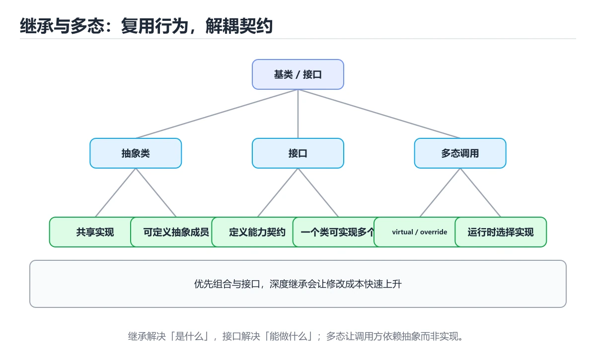
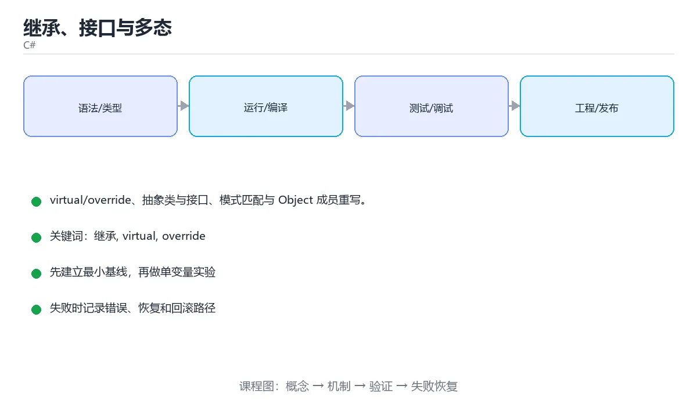

# 继承、接口与多态

> 内容更新时间：2026-10-06 · 学习阶段：进阶 · 预计用时：35 分钟





## 学习目标

- 能用自己的话解释继承、接口与多态解决了什么问题，而不是只背术语。
- 能说清 「继承」、「virtual」、「override」、「接口」 之间的关系，并分别举出一个例子。
- 能把本课知识放回「C#」的知识体系，说明它和相邻主题的边界。
- 能完成本课练习，并用验收标准检查自己的结果。

> 一句话摘要：virtual/override、抽象类与接口、模式匹配与 Object 成员重写。

## 前置知识

- 先完成上一课《类、属性与对象》；如果已经掌握，可以直接用本课练习自测。
- 本课阶段：进阶。建议先掌握同一分类的基础课程，并能独立运行正文中的最小示例。
- 开始前先复习：继承、virtual、override。
- 如果某一步看不懂，先记录具体卡点，完成练习后再回头读一遍。

## 继承与虚方法

```csharp
public class Animal
{
    public Animal(string name) => Name = name;
    public string Name { get; }
    public virtual string Speak() => "...";
}
public class Dog : Animal
{
    public Dog(string name) : base(name) { }
    public override string Speak() => $"{Name}：汪";
}
Animal animal = new Dog("旺财");
Console.WriteLine(animal.Speak());
```

C# 类只能单继承；`virtual` 允许重写，`override` 重写，`sealed override` 禁止继续重写。

## 抽象类与接口

```csharp
public abstract class Shape
{
    public abstract double Area();
    public string Describe() => $"面积 {Area():F2}";
}
public interface IRepository<T>
{
    T? FindById(int id);
    void Save(T entity);
    void Delete(int id) => Console.WriteLine("默认实现");
}
public class Circle : Shape
{
    private readonly double _radius;
    public Circle(double radius) => _radius = radius;
    public override double Area() => Math.PI * _radius * _radius;
}
```

抽象类描述「是什么」，可含字段与实现；接口描述「能做什么」，一个类可以实现多个接口。

## 类型判断与安全转换

```csharp
if (animal is Dog dog)
{
    Console.WriteLine(dog.Speak());
}
Dog? dog2 = animal as Dog;
if (dog2 is not null) { Console.WriteLine(dog2.Name); }
```

`is` 配合模式匹配是最推荐的写法，`as` 失败返回 null 而不是抛异常。

## 重写 Object 成员

```csharp
public override string ToString() => $"Point({X}, {Y})";
public override bool Equals(object? obj) => obj is Point p && p.X == X && p.Y == Y;
public override int GetHashCode() => HashCode.Combine(X, Y);
```

## 本课小结

继承复用实现，接口定义契约，`virtual/override` 实现多态。实践中**优先组合与接口，避免深层继承树**。

## 继承与接口速查

| 概念 | 写法 | 说明 |
| --- | --- | --- |
| 基类继承 | `class Dog : Animal` | C# 只能单继承类 |
| 接口实现 | `class Repo : IRepo, IDisposable` | 可实现多个接口 |
| 抽象类 | `abstract class Shape` | 不能实例化，可含实现 |
| 抽象方法 | `public abstract double Area();` | 子类必须重写 |
| 虚方法 | `public virtual string Name() => "shape";` | 子类可选重写 |
| 重写 | `public override double Area() => ...;` | 强烈建议加 `override` |
| 密封 | `public sealed override void F()` | 禁止继续重写 |
| 接口默认实现 | `void Log() => Console.WriteLine();` | C# 8+ 支持 |
| 显式实现 | `void IDisposable.Dispose() { }` | 避免公开成员污染 |

类型转换与模式速查：

| 目的 | 写法 | 失败行为 |
| --- | --- | --- |
| 类型判断 | `obj is User u` | 返回 `false`，`u` 为 `null` |
| 安全转换 | `obj as User` | 返回 `null` |
| 强制转换 | `(User)obj` | 抛 `InvalidCastException` |
| 空值兜底 | `obj as User ?? fallback` | 使用兜底值 |
| 属性模式 | `obj is User { Age: > 18 }` | `false` |

```csharp
public abstract class Shape
{
    public abstract double Area();

    public virtual string Describe() => $"{GetType().Name}: {Area():F2}";
}

public sealed class Circle : Shape
{
    private readonly double _radius;
    public Circle(double radius) => _radius = radius;

    public override double Area() => Math.PI * _radius * _radius;
}

// 依赖接口而不是具体类，便于替换与测试
public interface IClock
{
    DateTime UtcNow { get; }
}

public sealed class SystemClock : IClock
{
    public DateTime UtcNow => DateTime.UtcNow;
}
```

## 常见错误与排查

| 容易写错的做法 | 实际现象 | 原因与正确做法 |
| --- | --- | --- |
| 重写忘写 `override` | 变成隐藏成员，行为不符合预期 | 加 `override` 并开 `noImplicitOverride` 风格告警 |
| 子类构造器未调用基类构造 | 编译错误 | 用 `: base(...)` 显式调用 |
| 强制转换不判断 | `InvalidCastException` | 用 `is` / `as` 先判断 |
| 接口成员遗漏实现 | 编译错误 | 全部实现，或声明为 abstract |
| 用继承表达「有一个」之外的复用 | 层级僵化 | 优先组合（注入依赖） |
| 基类构造器调用虚方法 | 子类字段未初始化 | 构造器只做本类初始化 |
| 抽象类里塞太多实现 | 子类被迫继承不需要的行为 | 拆成小接口 |
| 用 `new` 隐藏父类成员 | 调用结果取决于引用类型 | 用 `override` 或改名 |
| 忘记 `sealed` 导致被随意继承 | 行为被破坏 | 不打算扩展的类加 `sealed` |
| 自定义 `Equals` 后仍用 `==` 比较 | 结果不一致 | 明确重载 `==` 或统一用 `Equals` |

## 复习与自测

- [ ] 能分辨 `abstract` / `virtual` / `override` / `sealed`。
- [ ] 类型转换优先用模式匹配，而不是强制转换。
- [ ] 优先组合而不是继承复用代码。
- [ ] 面向接口编程，便于替换与单元测试。
- [ ] 不打算被继承的类标记 `sealed`。

## 零基础详解：继承、接口与多态

### 一句话说清它是什么

继承表达「是一种」，接口表达「能做什么」。C# 只允许单继承类，但可以实现多个接口。
多态让父类变量在运行时表现出子类的行为。

### 用生活比喻理解

| 概念 | 比喻 | 说明 |
| --- | --- | --- |
| 基类 | 通用说明书 | 所有子类共有的部分 |
| 抽象类 | 未完成的说明书 | 不能直接使用，必须补全 |
| 接口 | 岗位要求 | 谁满足谁就能上岗，可多个 |
| `virtual` / `override` | 允许改写 | 子类可以给出自己的实现 |
| `sealed` | 到此为止 | 禁止继续被继承或重写 |

### 抽象类与接口的取舍

| 对比 | 抽象类 `abstract class` | 接口 `interface` |
| --- | --- | --- |
| 数量限制 | 只能继承一个 | 可以实现多个 |
| 字段 | 可以有实例字段 | 只能有常量，属性可以用默认实现 |
| 方法 | 抽象方法 + 具体实现 | 抽象成员 + 默认实现 |
| 表达 | 「是什么」 | 「能做什么」 |
| 何时用 | 子类共享状态与实现 | 跨类型统一能力 |

### 完整示例：形状与面积

```csharp
public interface IShape
{
    string Name { get; }
    double Area();
}

public abstract class Shape : IShape
{
    protected Shape(string name) => Name = name;

    public string Name { get; }

    public abstract double Area();                 // 子类必须实现

    public virtual string Describe() => $"{Name} 面积 {Area():F2}";
}

public sealed class Circle : Shape
{
    private readonly double _radius;
    public Circle(double radius) : base("圆形") => _radius = radius;
    public override double Area() => Math.PI * _radius * _radius;
}

public sealed class Rectangle : Shape
{
    private readonly double _w, _h;
    public Rectangle(double w, double h) : base("矩形") => (_w, _h) = (w, h);
    public override double Area() => _w * _h;
    public override string Describe() => base.Describe() + "（四边形）";
}

var shapes = new List<Shape> { new Circle(2), new Rectangle(3, 4) };
foreach (var shape in shapes)
{
    Console.WriteLine(shape.Describe());           // 多态调用
}
```

### 五种关键修饰符

| 修饰符 | 作用 | 使用建议 |
| --- | --- | --- |
| `abstract` | 声明必须由子类实现 | 只放真正共有的成员 |
| `virtual` | 允许子类重写 | 需要扩展点时使用 |
| `override` | 重写父类成员 | 总是写上，让编译器检查 |
| `sealed` | 禁止继续继承或重写 | 明确不希望被扩展时 |
| `new` | 隐藏父类成员 | **尽量别用**，容易造成困惑 |

### 用模式匹配替代类型判断

```csharp
static string Describe(Shape shape) => shape switch
{
    Circle c => $"半径圆，面积 {c.Area():F2}",
    Rectangle { } r => $"矩形，面积 {r.Area():F2}",
    _ => shape.Describe(),
};
```

比一串 `if (x is Circle)` 更清晰，编译器还能检查是否漏了情况。

### 扩展方法与默认接口实现

```csharp
public static class ShapeExtensions
{
    public static bool IsLarge(this IShape shape) => shape.Area() > 100;
}

// 调用时像实例方法一样
if (shape.IsLarge()) Console.WriteLine("大图形");
```

扩展方法必须写在静态类里，第一个参数带 `this`。

### 新手最容易踩的八个坑

| 坑 | 现象 | 正确做法 |
| --- | --- | --- |
| 忘了 `override` | 变成新方法，多态失效 | 加 `override` 让编译器检查 |
| 用 `new` 隐藏成员 | 行为依赖变量类型 | 改成 `override` |
| 继承层次过深 | 牵一发动全身 | 优先组合，层次不过两层 |
| 在构造函数里调虚方法 | 子类字段还没初始化 | 构造完再调用 |
| 抽象类放太多实现 | 子类被迫继承不需要的成员 | 抽小接口 |
| 接口太大 | 实现类要写一堆空方法 | 按能力拆小 |
| 用 `as` 后不判空 | 空引用异常 | 用 `is` 模式匹配 |
| 把可空引用警告当噪音 | 运行时空引用 | 认真处理 `?` 与判空 |

### 手把手练习：支付方式多态

```csharp
public interface IPayment
{
    string Name { get; }
    decimal Fee(decimal amount);
}

public sealed class Alipay : IPayment
{
    public string Name => "支付宝";
    public decimal Fee(decimal amount) => Math.Round(amount * 0.006m, 2);
}

public sealed class BankCard : IPayment
{
    public string Name => "银行卡";
    public decimal Fee(decimal amount) => amount >= 1000m ? 0m : 2m;
}

var methods = new List<IPayment> { new Alipay(), new BankCard() };
decimal amount = 800m;

foreach (var m in methods)
{
    Console.WriteLine($"{m.Name} 手续费 {m.Fee(amount):C}，实收 {amount - m.Fee(amount):C}");
}
```

### 学完自测

- [ ] 能说出抽象类与接口的三点区别。
- [ ] 知道 `virtual` 与 `override` 必须成对出现。
- [ ] 能解释为什么不该用 `new` 隐藏父类成员。
- [ ] 能用 `switch` 模式匹配替代类型判断。
- [ ] 能说出扩展方法的定义要求。

## 动手练习

> 本课练习重点：围绕「继承、virtual、override」完成复述、实验和交付，每个结果都要能被别人检查。

先建最小控制台程序，再补类型、异步和异常路径，最后用 dotnet test 验证。

### 练习 1：建立心智模型（10 分钟）

合上教程，用 3～5 句话回答：

1. 继承、接口与多态解决了什么问题？
2. 如果没有它，会出现什么具体后果？
3. 它和「virtual」是什么关系？

**验收标准**：至少出现一个本课关键词，并写出一个反例、边界条件或失效场景。

### 练习 2：做一次可控实验（20 分钟）

从正文中选一个最小示例，完成以下操作：

1. 先预测修改一个参数、输入或步骤后的结果。
2. 再实际执行或逐步推演，记录真实结果。
3. 如果结果与预测不同，写出差异原因。

**验收标准**：留下「原例 → 改动 → 预测 → 结果 → 原因」五步记录。

### 练习 3：交付一个小结果（30 分钟）

写一个控制台小程序，补一个正例、一个边界值和一个异常路径。

任务要求：

- 结果必须能被别人检查，不能只写“我已经理解了”。
- 至少覆盖「继承」和「virtual」两个关键词。
- 写出 1 个仍然不确定的问题，以及下一步如何验证。

> 提示：时间有限时优先做练习 1 和练习 2；练习 3 可以拆成两次完成。

## 可运行练习

本节围绕继承、接口与多态安排 3 个可交付任务，每个任务都要求留下可以复查的记录。

### 任务 1：用自己的话画出结构

不看书，用一张图说清「继承、接口与多态」的结构，画完再对照骨架：

- 主干：继承与虚方法 → 抽象类与接口 → 类型判断与安全转换 → 重写 Object 成员
- 连接线：在每条边上标出输入、输出与失败路径。
- 自检：能否用一句话说明继承与virtual的关系？

### 任务 2：做一次对比实验

**验收标准**：表格里两个方案的结论不能完全一样；写下“在什么条件下应该换方案”。

### 任务 3：迁移到自己的场景

**验收标准**：至少有一个可复现的命令、代码片段或数据样例；结论能被别人独立检查。

## 故障现场

### 现场 1：本课的 继承 常规用例通过，但边界用例失败

**症状**：在本课的练习或生产场景里出现“本课的 继承 常规用例通过，但边界用例失败”。

**复现**：准备一组最小输入，只保留触发“本课的 继承 常规用例通过，但边界用例失败”的必要条件，连续运行两次确认结果稳定。

**定位**：围绕“继承 的前置条件与取值边界没有写进代码，默认值掩盖了空值和极值”检查调用链、输入数据和环境配置，先验证假设再改代码。

**预防**：把“本课的 继承 常规用例通过，但边界用例失败”写成一条自动化用例，并在本课的验收清单里保留对应检查项。

### 现场 2：本课的 virtual 结果在两次运行之间不一致

**症状**：在本课的练习或生产场景里出现“本课的 virtual 结果在两次运行之间不一致”。

**复现**：准备一组最小输入，只保留触发“本课的 virtual 结果在两次运行之间不一致”的必要条件，连续运行两次确认结果稳定。

**定位**：围绕“virtual 依赖了当前版本、执行顺序或共享状态，单次运行无法暴露差异”检查调用链、输入数据和环境配置，先验证假设再改代码。

**预防**：把“本课的 virtual 结果在两次运行之间不一致”写成一条自动化用例，并在本课的验收清单里保留对应检查项。

### 现场 3：本课的验证只在开发机通过

**症状**：在本课的练习或生产场景里出现“本课的验证只在开发机通过”。

**定位**：围绕“环境版本、配置和输入规模与目标环境不同，继承 缺少可重复的验证记录”检查调用链、输入数据和环境配置，先验证假设再改代码。

## 版本与时效

- .NET 10 是当前 LTS 主线，C# 版本随 SDK 一起演进
- 主构造函数、集合表达式、模式匹配与 AOT/裁剪是升级重点
- 升级前检查 NuGet 依赖、序列化行为与运行时标识
- 官方说明：https://learn.microsoft.com/dotnet/core/whats-new/

### 升级检查清单

- 先固定当前版本，跑通全部示例与测验，再升级工具链。
- 只改一个版本变量，记录编译、测试、性能与产物体积的变化。
- 重点回归默认值、弃用警告、序列化格式、并发语义和错误信息。
- 升级完成后更新本课的“最后复核 / 下次复核”日期与版本说明。

## 本课复习清单

离开本课前，逐项确认：

- [ ] 不看解析，能说出「重写基类虚方法使用的关键字是？」的判断依据。
- [ ] 不看解析，能说出「一个 C# 类可以实现多少个接口？」的判断依据。
- [ ] 不看解析，能说出「使用 as 进行类型转换失败时返回？」的判断依据。
- [ ] 不看解析，能说出「抽象方法与虚方法的区别是？」的判断依据。
- [ ] 不看解析，能说出「类型转换时 is 与 as 的使用差别是？」的判断依据。
- [ ] 至少运行一次本课示例，记录输入、输出和一个边界情况。
- [ ] 把本课最容易混淆的两个概念写成一句话对照。

| 复盘项 | 记录 |
| --- | --- |
| 已经能独立解释的考点 |  |
| 仍然说不清的概念 |  |
| 下一步验证动作 |  |

## 术语速查

| 术语 | 本课语境 |
| --- | --- |
| `virtual` | C# 类只能单继承；`virtual` 允许重写，`override` 重写，`sealed override` 禁止继续重写。 |
| `override` | C# 类只能单继承；`virtual` 允许重写，`override` 重写，`sealed override` 禁止继续重写。 |
| `sealed override` | C# 类只能单继承；`virtual` 允许重写，`override` 重写，`sealed override` 禁止继续重写。 |
| `is` | `is` 配合模式匹配是最推荐的写法，`as` 失败返回 null 而不是抛异常。 |
| `as` | `is` 配合模式匹配是最推荐的写法，`as` 失败返回 null 而不是抛异常。 |
| `virtual/override` | 继承复用实现，接口定义契约，`virtual/override` 实现多态。实践中**优先组合与接口，避免深层继承树**。 |

## 考点精讲

### 考点 1：概念判断·继承

- **题目**：重写基类虚方法使用的关键字是？
- **判断依据**：在「继承、接口与多态」里，基类用 virtual 声明可重写，子类用 override 重写。在「继承、接口与多态」里，作答时，先用继承建立输入与输出的基线，再把override代入边界条件核对，结论才能复现。回到「继承、接口与多态」的正文示例，用“重写基类虚方法使用的关键字是”走一遍继承、virtual、override的完整流程，能复现的结论才可以保留。

### 考点 2：概念判断·继承

- **题目**：一个 C# 类可以实现多少个接口？
- **判断依据**：类只能单继承父类，但可以实现任意多个接口。其他选项：C# 类只能单继承，但接口可以任意多实现。这道题的关键在「继承、接口与多态」的继承、virtual、override：先确认题干“一个 C 类可以实现多少个接口”问的是哪一步，再排除偷换前提的选项。

### 考点 3：概念判断·继承

- **题目**：使用 as 进行类型转换失败时返回？
- **判断依据**：as 失败返回 null，因此转换后要判空。强制转换 (T) 失败会抛 InvalidCastException。如果只凭关键词作答，很容易把「默认实例」、「false」与「null」混在一起；这道题的关键在「继承、接口与多态」的继承、virtual、override：先确认题干“使用 as 进行类型转换失败时返回”问的是哪一步，再排除偷换前提的选项。

### 考点 4：多选辨析·继承

- **题目**：围绕“继承、接口与多态”中的 继承、virtual、override，下列哪两项是本课强调的实践判断？
- **判断依据**：结论应落在学习 继承 时要同时说明输入、输出和失败路径。本课把继承、接口与多态拆成概念、示例与故障现场三部分，因此判断 继承 时必须同时交代输入、输出和失败路径，这使“学习 继承 时要同时说明输入、输出和失败路径，不能只看正常流程”成立。在继承、接口与多态里，判断 virtual 时要固定版本与边界输入，所以“验证 virtual 时要固定版本并覆盖边界输入，结论才可复现”才可复现。

### 考点 5：代码补全·继承

- **题目**：这段 C# 代码是「继承、接口与多态」的示例片段，下面哪一项描述与它一致？
- **判断依据**：在「继承、接口与多态」里，题干的正确项是这段代码把主要逻辑封装在函数或方法里，需要被调用才会执行，在「继承、接口与多态」里封装边界决定继承从哪一步开始生效。把输入或边界换成空值、极值或失败情况后，结论要以「继承、接口与多态」的实际运行结果为准。把“这段代码把主要逻辑封装在函数或方法里”代回「继承、接口与多态」里“这段 C 代码是继承、接口与多态的示例片段”的例子核对，条件一旦改变，结论就要用继承、virtual、override重新推导。

### 考点 6：填空·继承

- **题目**：补全代码：「继承、接口与多态」示例中，下面这行代码缺少哪个关键字或函数名？请填入 ____。 `void Delete(int id) => Console.____("默认实现");`
- **判断依据**：在「继承、接口与多态」里，WriteLine。这道题的关键在「继承、接口与多态」的继承、virtual、override：先确认题干“补全代码”问的是哪一步，再排除偷换前提的选项。回到继承、virtual、override本身再看一遍：只有“WriteLine”与题干“接口与多态示例中”的前提一致，结论才成立。

## English Overview

**Title:** Inheritance & Interfaces

**Summary:** Virtual methods, abstract classes, interfaces and patterns.

**Category:** C#
**Level:** 进阶
**Key terms:** 继承, virtual, override, 接口, 多态, is/as

## 内容元数据

- 内容版本：v2.0
- 最后更新：2026-10-06
- 学习阶段：进阶
- 适用环境：.NET 9 / C# 13
- 内容来源：内置结构化课程与工程实践整理
- 相关主题：继承、virtual、override、接口、多态、is/as
- 质量版本：P0 测验标准 + P1 覆盖扩展 + P2 体验补全

## 参考资料与复核

- 最后复核：2026-10-04
- 下次复核：2027-04-04
- 复核范围：版本兼容、API 行为、安全建议与工程实践
- 来源性质：官方文档、标准或权威教材；正文为离线教学重组

| 参考资料 | 本课用途 |
| --- | --- |
| [C# 指南](https://learn.microsoft.com/dotnet/csharp/) | 语言语法与类型系统 |
| [ASP.NET Core 文档](https://learn.microsoft.com/aspnet/core/) | Web API 与中间件 |
| [EF Core 文档](https://learn.microsoft.com/ef/core/) | ORM、迁移与并发 |

> 「继承、接口与多态」的链接用于离线阅读后的延伸核对；App 不会自动联网。
