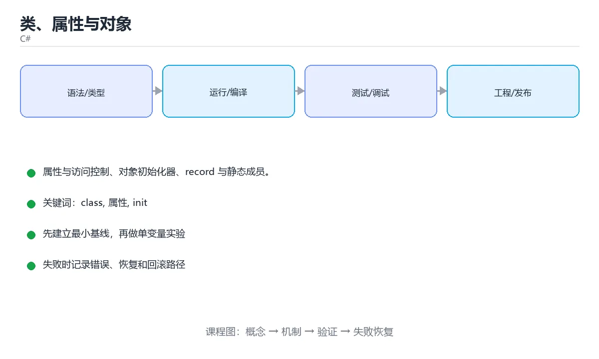

# 类、属性与对象



> 内容更新时间：2026-10-03 · 学习阶段：进阶 · 预计用时：15 分钟

## 学习目标

- 能用自己的话解释「类、属性与对象」解决了什么问题，而不是只背术语。
- 能说清 「class」、「属性」、「init」、「record」 之间的关系，并分别举出一个例子。
- 能把本课知识放回「C#」的知识体系，说明它和相邻主题的边界。
- 能完成本课练习，并用验收标准检查自己的结果。

> 一句话摘要：属性与访问控制、对象初始化器、record 与静态成员。

## 前置知识

- 先完成上一课《控制流与方法》；如果已经掌握，可以直接用本课练习自测。
- 本课阶段：进阶。建议先掌握同一分类的基础课程，并能独立运行正文中的最小示例。
- 开始前先复习：class、属性、init。
- 如果某一步看不懂，先记录具体卡点，完成练习后再回头读一遍。


## 定义类

```csharp
public class Account
{
    private decimal _balance;
    public Account(string owner, decimal balance)
    {
        Owner = owner;
        _balance = balance;
    }
    public string Owner { get; }
    public decimal Balance => _balance;
    public void Deposit(decimal amount)
    {
        if (amount <= 0) throw new ArgumentOutOfRangeException(nameof(amount));
        _balance += amount;
    }
    public static Account CreateDefault(string owner) => new(owner, 0);
}
```

属性是字段的受控访问器，常见写法：`{ get; set; }`、`{ get; init; }`（仅初始化时赋值）、`{ get; private set; }`。

## 对象初始化

```csharp
var account = new Account("小明", 100);
account.Deposit(50);
Console.WriteLine(account.Balance);
var person = new Person { Name = "tom", Age = 18 };
```

## record：不可变数据模型

```csharp
public record Person(string Name, int Age)
{
    public string Display => $"{Name} ({Age})";
}
var a = new Person("tom", 18);
var b = a with { Age = 19 };
Console.WriteLine(a == new Person("tom", 18));
```

record 自动生成构造器、`Equals`、`GetHashCode`、`ToString` 与 `with`，适合 DTO 与值对象。

## 静态成员与常量

```csharp
public class Config
{
    public const string Version = "1.0";
    public static readonly DateTime StartTime = DateTime.UtcNow;
    public static int Count { get; private set; }
}
```

`const` 必须是编译期常量且隐式静态；`static readonly` 可在运行时初始化一次。

## 本课小结
C# 面向对象的核心：**属性暴露状态、方法表达行为、record 表达不可变数据**，不要直接公开字段。

<!-- appendix:v1 -->

## 类成员速查

| 成员 | 写法 | 说明 |
| --- | --- | --- |
| 字段 | `private readonly int _id;` | 私有、只读，`_camelCase` 命名 |
| 自动属性 | `public string Name { get; set; }` | 最常用 |
| 只读属性 | `public string Id { get; }` | 构造器内赋值 |
| 初始化属性 | `public string Name { get; init; }` | 对象初始化后不可改 |
| 计算属性 | `public string Full => $"{First} {Last}";` | 没有存储 |
| 静态成员 | `public static int Count { get; }` | 属于类型 |
| 常量 | `public const double Pi = 3.14;` | 编译期内联 |
| 静态只读 | `public static readonly DateTime Start = DateTime.UtcNow;` | 运行期赋值 |
| 索引器 | `public T this[int i] => _items[i];` | 支持下标访问 |
| 事件 | `public event EventHandler? Changed;` | 发布订阅 |

```csharp
// 不可变数据对象：init + 必填 + 校验
public sealed record User
{
    public required string Id { get; init; }
    public required string Name { get; init; }
    public int Age { get; init; }

    public User WithAge(int age) => this with { Age = age };
}

var user = new User { Id = "u1", Name = "小明" };
var older = user.WithAge(19);      // 生成新对象，原对象不变

// 属性访问器中的校验
public sealed class Account
{
    private decimal _balance;

    public decimal Balance
    {
        get => _balance;
        private set => _balance = value >= 0
            ? value
            : throw new ArgumentOutOfRangeException(nameof(value));
    }
}
```

## 常见错误对照表

| 容易写错的做法 | 实际现象 | 原因与正确做法 |
| --- | --- | --- |
| 用 public 字段 | 无法校验、无法数据绑定 | 用属性封装 |
| `const` 存运行期值 | 编译错误 | 用 `static readonly` |
| record 里定义可变的 `set` | 失去不可变优势 | 用 `init` + `with` |
| 属性里做耗时 IO | 访问像字段但很慢 | 改成显式方法 |
| `required` 成员未赋值 | 编译错误 | 初始化时全部赋值 |
| 忘记实现 `IDisposable` | 资源泄漏 | 实现 `Dispose`，或改用 `using` |
| 事件订阅后不取消 | 内存泄漏 | 在合适时机 `-=` 取消订阅 |
| 静态字段存可变状态 | 并发问题、实例互相影响 | 用实例字段或注入的服务 |
| 重写 `Equals` 不重写 `GetHashCode` | 集合行为异常 | 两者成对重写，或用 record |
| 用 `sealed` 修饰可继承类 | 无法继承 | 明确设计意图，需要扩展时去掉 |

## 自测清单

- [ ] 用属性而不是公开字段。
- [ ] 不可变数据用 record + `init` + `with`。
- [ ] 知道 `const` 与 `static readonly` 的区别。
- [ ] 实现 `IDisposable` 并用 `using` 释放资源。
- [ ] 事件订阅与取消成对出现。

<!-- appendix:v3 -->

## 零基础详解：类、属性与封装

### 一句话说清它是什么

C# 的类把数据和行为打包，属性（property）是它最优雅的封装手段：
对外看起来像字段，内部其实可以带校验、只读或计算逻辑。

### 用生活比喻理解

| 概念 | 比喻 | 说明 |
| --- | --- | --- |
| 类 | 图纸 | 定义有哪些字段与方法 |
| 对象 | 实物 | `new` 出来的实例 |
| 字段 | 内部零件 | 通常 private |
| 属性 | 带门禁的窗口 | 读写可控，可加校验 |
| 方法 | 能做的事 | 对外提供的操作 |
| record | 一次性信息卡 | 天生带比较与打印 |

### 从字段到属性的三种写法

```csharp
public class Account
{
    private decimal _balance;                         // 1. 字段：内部存储
    public decimal Balance => _balance;               // 2. 只读计算属性
    public string Owner { get; private set; } = "";   // 3. 对外只读、类内可写

    public Account(string owner, decimal initial)
    {
        Owner = owner;
        Deposit(initial);
    }

    public void Deposit(decimal amount)
    {
        if (amount <= 0) throw new ArgumentOutOfRangeException(nameof(amount));
        _balance += amount;
    }
}
```

| 写法 | 含义 |
| --- | --- |
| `{ get; set; }` | 可读可写 |
| `{ get; private set; }` | 外部只能读，类内可写 |
| `=> _balance` | 只读计算属性，没有存储 |
| 带 `init` | 只在对象初始化时赋值 |

### 带校验的属性

```csharp
public class User
{
    private string _email = "";

    public required string Email
    {
        get => _email;
        set
        {
            if (string.IsNullOrWhiteSpace(value) || !value.Contains('@'))
                throw new ArgumentException("邮箱格式不正确", nameof(value));
            _email = value.Trim().ToLowerInvariant();
        }
    }

    public string Display { get; init; } = "";
}
```

`required` 让编译器强制调用方初始化该属性，`init` 让属性只在创建时能赋值。

### record：数据搬运的首选

```csharp
public record User(string Name, int Age)
{
    public bool IsAdult => Age >= 18;
}

var a = new User("小明", 18);
var b = a with { Age = 19 };                     // 非破坏性修改
Console.WriteLine(a == new User("小明", 18));    // True：按值比较
Console.WriteLine(b);                            // User { Name = 小明, Age = 19 }
```

| 类型 | 比较方式 | 适用场景 |
| --- | --- | --- |
| `class` | 默认引用比较 | 有身份与生命周期的实体 |
| `record` | 按值比较 | DTO、消息、配置、不可变数据 |
| `struct` | 按值比较 | 小且短命的数据 |

### 静态成员与常量

```csharp
public static class MathTools
{
    public const double Epsilon = 1e-9;                        // 编译期常量
    public static readonly DateTime Start = DateTime.UtcNow;    // 运行时只读

    public static bool NearlyEqual(double a, double b)
        => Math.Abs(a - b) < Epsilon;
}
```

### 新手最容易踩的八个坑

| 坑 | 现象 | 正确做法 |
| --- | --- | --- |
| 字段公开 | 外部随意改，校验被绕过 | 用属性封装 |
| 在属性 getter 里做重活 | 调试时反复触发 | 用方法或缓存 |
| 忘了 `required` | 对象可能缺关键字段 | 关键字段加 `required` |
| 用 `==` 比较普通 class | 比的是引用 | 需要值语义就用 `record` |
| 在 struct 里放大对象 | 频繁复制，性能差 | 改 class 或 record |
| 静态可变状态 | 并发问题难查 | 尽量用只读静态 |
| 不校验构造参数 | 错误延后暴露 | 尽早校验并明确异常类型 |
| 属性与字段同名 | 语法冲突 | 字段加下划线前缀 |

### 手把手练习：订单与金额校验

```csharp
public record OrderLine(string Name, decimal UnitPrice, int Quantity)
{
    public decimal Subtotal => UnitPrice * Quantity;
}

public class Order
{
    private readonly List<OrderLine> _lines = new();

    public required string Customer { get; init; }
    public IReadOnlyList<OrderLine> Lines => _lines;
    public decimal Total => _lines.Sum(l => l.Subtotal);

    public void Add(string name, decimal price, int quantity)
    {
        if (price < 0) throw new ArgumentOutOfRangeException(nameof(price));
        if (quantity <= 0) throw new ArgumentOutOfRangeException(nameof(quantity));
        _lines.Add(new OrderLine(name, price, quantity));
    }
}

var order = new Order { Customer = "小明" };
order.Add("键盘", 199m, 1);
order.Add("鼠标", 89.5m, 2);

Console.WriteLine($"{order.Customer} 合计 {order.Total:C}");
foreach (var line in order.Lines)
{
    Console.WriteLine($"  {line.Name} x{line.Quantity} = {line.Subtotal:C}");
}
```

### 学完自测

- [ ] 能说出字段与属性的区别。
- [ ] 知道 `private set` 与 `init` 分别限制了什么。
- [ ] 能说出 class 与 record 在比较语义上的差别。
- [ ] 知道 `required` 帮你避免什么问题。
- [ ] 能写一个带校验的只读属性。

## 动手练习

<!-- practice-diversified:v1 -->

> 本课练习重点：围绕「class、属性、init」完成复述、实验和交付，每个结果都要能被别人检查。

先建最小控制台程序，再补类型、异步和异常路径，最后用 dotnet test 验证。

### 练习 1：建立心智模型（10 分钟）

合上教程，用 3～5 句话回答：

1. 「类、属性与对象」解决了什么问题？
2. 如果没有它，会出现什么具体后果？
3. 它和「属性」是什么关系？

**验收标准**：至少出现一个本课关键词，并写出一个反例、边界条件或失效场景。

### 练习 2：做一次可控实验（20 分钟）

从正文中选一个最小示例，完成以下操作：

1. 先预测修改一个参数、输入或步骤后的结果。
2. 再实际执行或逐步推演，记录真实结果。
3. 如果结果与预测不同，写出差异原因。

**验收标准**：留下「原例 → 改动 → 预测 → 结果 → 原因」五步记录。

### 练习 3：交付一个小结果（30 分钟）

写一个控制台小程序，补一个正例、一个边界值和一个异常路径。

任务要求：

- 结果必须能被别人检查，不能只写“我已经理解了”。
- 至少覆盖「class」和「属性」两个关键词。
- 写出 1 个仍然不确定的问题，以及下一步如何验证。

> 提示：时间有限时优先做练习 1 和练习 2；练习 3 可以拆成两次完成。

<!-- scaffold:v1 -->

<!-- p2-enrichment:v1 -->

## English Overview

**Title:** Classes & Objects

**Summary:** Properties, initializers, records and statics.

**Category:** C#  
**Level:** 进阶  
**Key terms:** class, 属性, init, record, with, static

> The full tutorial is written in Chinese. This bilingual overview helps English readers identify the topic, scope and key terms before studying the detailed examples.

## 内容元数据

- 内容版本：v2.0
- 最后更新：2026-10-03
- 学习阶段：进阶
- 适用环境：.NET 9 / C# 13
- 内容来源：内置结构化课程与工程实践整理
- 相关主题：class、属性、init、record、with、static
- 质量版本：P0 测验标准 + P1 覆盖扩展 + P2 体验补全

<!-- p2-references:v1 -->

## 参考资料与复核

- 最后复核：2026-10-04
- 下次复核：2027-04-04
- 复核范围：版本兼容、API 行为、安全建议与工程实践
- 来源性质：官方文档与标准；本课正文为离线教学重组，不复制原文

| 参考资料 | 本课用途 |
| --- | --- |
| [C# 官方指南](https://learn.microsoft.com/dotnet/csharp/) | 语言、异步与模式匹配 |
| [.NET 文档](https://learn.microsoft.com/dotnet/) | 运行时、GC 与发布 |

> 本课主题：属性与访问控制、对象初始化器、record 与静态成员。

> App 完全离线展示文字链接，不会自动联网；需要延伸阅读时可复制链接到浏览器。

