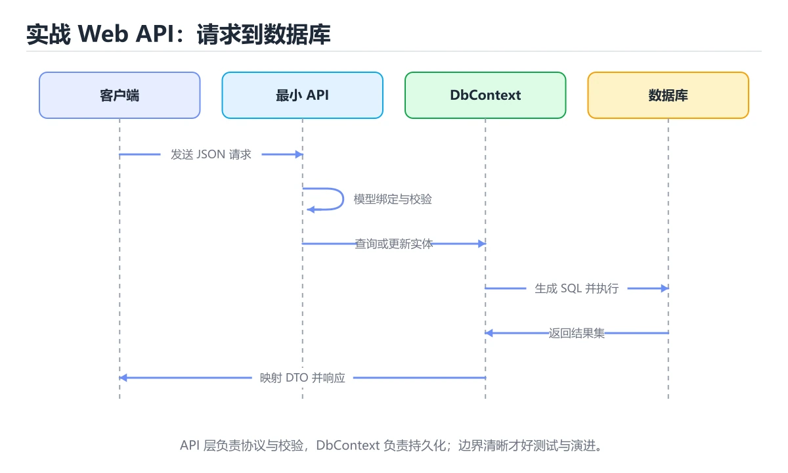
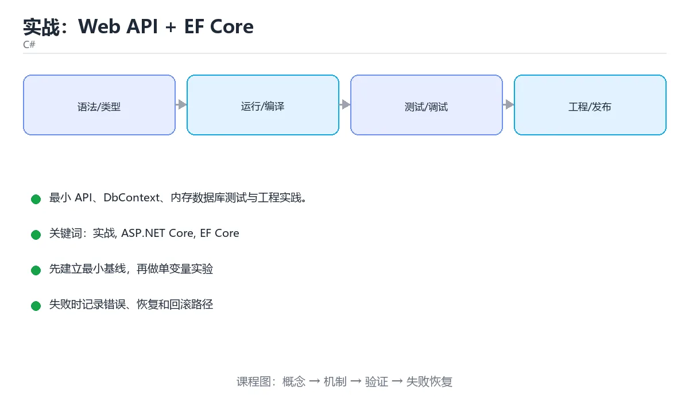

# 实战：Web API + EF Core





> 内容更新时间：2026-10-06 · 学习阶段：高级 · 预计用时：95 分钟

## 本节知识框架

**课程定位**：所属分类 `csharp`（C#），课程主题 `实战：Web API + EF Core`，学习阶段 高级，建议用时 120 分钟。

本课主线：最小 API、DbContext、内存数据库测试与工程实践。

**学完本课应当能够**
- 说清 `dotnet ef migrations add Init` 与 `UseExceptionHandler` 的含义与区别，并各举一个正例和一个反例。
- 用本课示例验证 `dotnet test` 的行为，记录输入、输出与失败条件。
- 遇到「Entity 直接返回」这类问题时，能说出触发条件与修复顺序。

### 从概念到验证的学习链条

1. `dotnet ef migrations add Init`：先掌握 生产环境应使用 EF Core 迁移（`dotnet ef migrations add Init`）而不是 `EnsureCreated`，再用它解释 `UseExceptionHandler` 为什么会出现。
2. `UseExceptionHandler`：先掌握 加 `UseExceptionHandler` 统一错误响应，日志用 ILogger，再用它解释 `dotnet test` 为什么会出现。
3. `dotnet test`：先掌握 CI 中执行 `dotnet format --verify-no-changes` 与 `dotnet test`，再用它解释 `实战` 为什么会出现。
4. `实战`：先掌握 实战：Web API + EF Core解决了什么问题，而不是只背术语，再用它解释 `错误处理` 为什么会出现。
5. `错误处理`：先掌握 识别、传播并恢复异常或失败路径，避免错误被吞掉或扩大影响，再用它解释 本课示例的观察结果 为什么会出现。

**先修与衔接**：本课是「C#」分类的第 14 课。先修内容：《生态、测试与 Web 开发》。《生态、测试与 Web 开发》里的 `dotnet restore`、`Add-Migration` 是本课的前提。相关或后续课程：《实战：C# 库存管理 CLI》。

### 完成判据

- **定义关**：不看正文也能说明 `dotnet ef migrations add Init` 是 生产环境应使用 EF Core 迁移（`dotnet ef migrations add Init`）而不是 `EnsureCreated`，并指出一个反例。
- **机制关**：能按“输入 → 转换 → 输出 → 验证”复述 `实战：Web API + EF Core`，而不是只背结论。
- **示例关**：能运行或推演 `实战：Web API + EF Core` 的 `csharp` 示例，并说明一个真实出现的标识符或字面量。
- **证据关**：能指出 `实战：Web API + EF Core` 示例里的 调用了 `Todo()`，并说明它支持或反驳了本课的哪一条结论。
- **排错关**：能复现 Entity 直接返回，记录现象并按 用 DTO 修复。
- **迁移关**：能把 `实战`、`ASP.NET Core`、`EF Core`、`xUnit` 放进一个与 `实战：Web API + EF Core` 不同的项目场景，并保持输入与验证条件可追踪。
- **复盘关**：学完 `实战：Web API + EF Core` 后，用一句话写下仍然不确定的结论，并列出下一次验证需要的输入、环境和成功判据。

### 复习清单

- [ ] 能不看正文复述本课核心术语，并指出一个边界或反例。
- [ ] 能运行或推演本课示例，记录输入、输出与失败现象。
- [ ] 能完成一次自测，并把错题对照错误表定位原因。

## 核心概念定义

| 术语 | 操作性定义 | 常见边界与风险 |
| --- | --- | --- |
| dotnet ef migrations add Init | 生产环境应使用 EF Core 迁移（dotnet ef migrations add Init）而不是 EnsureCreated。 | 只在「生产环境应使用 EF Core 迁移（dotnet ef migrations add Init）而不是 EnsureCreated」这一前提下成立，换输入或换环境要重新验证。 |
| UseExceptionHandler | 加 UseExceptionHandler 统一错误响应，日志用 ILogger。 | 网络延迟、超时与版本协商会改变行为，只在真实链路或多版本客户端上验证才算数。 |
| dotnet test | CI 中执行 dotnet format --verify-no-changes 与 dotnet test。 | 只在「CI 中执行 dotnet format --verify-no-changes 与 dotnet test」这一前提下成立，换输入或换环境要重新验证。 |
| 实战 | 实战：Web API + EF Core解决了什么问题，而不是只背术语。 | 不同版本与依赖组合的行为可能不同，升级或换环境前要按官方变更说明重新验证。 |
| 错误处理 | 识别、传播并恢复异常或失败路径，避免错误被吞掉或扩大影响 | 只在「识别、传播并恢复异常或失败路径，避免错误被吞掉或扩大影响」这一前提下成立，换输入或换环境要重新验证。 |

## 原理与运行机制

### 机制总览

**教材衔接：接口实现**

```csharp
app.MapGet("/api/todos", async (AppDbContext db) =>
    await db.Todos.OrderByDescending(t => t.CreatedAt).ToListAsync());
app.MapPost("/api/todos", async (TodoRequest request, AppDbContext db) =>
{
    if (string.IsNullOrWhiteSpace(request.Title))
    {
        return Results.ValidationProblem(new Dictionary<string, string[]>
        {
            ["title"] = new[] { "标题不能为空" }
        });
    }
    var todo = new Todo(0, request.Title.Trim(), false, DateTime.UtcNow);
    db.Todos.Add(todo);
    await db.SaveChangesAsync();
    return Results.Created($"/api/todos/{todo.Id}", todo);
});
app.MapDelete("/api/todos/{id:int}", async (int id, AppDbContext db) =>
{
    var todo = await db.Todos.FindAsync(id);
    if (todo is null) return Results.NotFound();
    db.Todos.Remove(todo);
    await db.SaveChangesAsync();
    return Results.NoContent();
});
```

**教材衔接：工程实践**

1. 用 DTO 隔离数据库实体与 API 契约，避免直接暴露表结构。
2. 入口做校验（DataAnnotations / FluentValidation），业务规则放服务层。
3. 配置分环境，密钥用 User Secrets 或环境变量。
4. 加 `UseExceptionHandler` 统一错误响应，日志用 ILogger。
5. CI 中执行 `dotnet format --verify-no-changes` 与 `dotnet test`。

**教材衔接：实践要点速查**

| 主题 | 建议 |
| --- | --- |
| 请求校验 | `[Required]`、`[Range]` 等数据注解 + `ModelState` |
| 错误响应 | 统一 ProblemDetails，映射业务异常到状态码 |
| 数据库迁移 | `dotnet ef migrations add` 生成脚本，CI 中执行 |
| 事务 | 在 Service 层使用 `IDbContextTransaction` 或 `SaveChanges` 一次提交 |
| 并发 | 乐观并发令牌 + 冲突重试 |
| 分页 | `Skip/Take` + 总数查询，或基于游标 |
| 缓存 | `IMemoryCache` / `IDistributedCache`，注意失效策略 |
| 健康检查 | `AddHealthChecks` 暴露 `/health`（区分 live 与 ready） |
| 配置 | `appsettings.json` + 环境变量覆盖，密钥不进仓库 |
| 可观测 | 结构化日志 + 请求 ID + 指标 |

**教材衔接：版本与时效**

- C# 版本随 SDK 演进，升级前把 ASP.NET Core 的兼容性纳入检查清单。
- 升级重点在语法与裁剪行为；先为 ASP.NET Core 补一组回归用例。
- 升级前先用 EntityFrameworkCore 建立基线：记录版本、命令和输出，升级后只比较这些可观察量。
- 官方说明：https://learn.microsoft.com/dotnet/core/whats-new/

### 升级检查清单

- 先固定当前版本，跑通全部示例与测验，再升级工具链。
- 只改 实战 的版本变量，记录编译、测试与产物体积的变化。
- 升级后重点回归 实战 的默认值、警告信息与错误格式。
- 升级完成后更新本课「最后复核 / 下次复核」日期，并记录 实战 的版本变化。

**教材衔接：交付评审：评分表、决策记录与证据链**


### 三、「实战：Web API + EF Core」的交付证据链

本课未给出可执行命令，用下面的最小证据集代替：


### 五、评审记录模板

| 记录项 | 填写要求 |
| --- | --- |
| 项目标识 | `csharp_project` |
| 本次范围 | 说明这一轮交付了「实战：Web API + EF Core」的哪些部分 |
| 未完成项 | 列出与 实战 相关但本轮未做的内容 |
| 证据位置 | 指向 evidence/ 目录下的具体文件 |
| 风险与回滚 | 写清剩余风险、回滚步骤和验证方式 |
| 结论 | 通过 / 有条件通过 / 不通过，三者选一 |

### 机制拆解：每一步的输入、动作与输出

#### 1. `dotnet ef migrations add Init`
- 输入：`实战`；本步把 生产环境应使用 EF Core 迁移（`dotnet ef migrations add Init`）而不是 `EnsureCreated` 当作判断规则。
- 动作：围绕 `dotnet ef migrations add Init` 保留中间状态，并记录它与 `UseExceptionHandler` 的对应关系。
- 输出：`UseExceptionHandler`，它可以被下一段代码、测试或记录继续使用。
- `dotnet ef migrations add Init` 的失败条件：只在「生产环境应使用 EF Core 迁移（`dotnet ef migrations add Init`）而不是 `EnsureCreated`」这一前提下成立，换输入或换环境要重新验证。

#### 2. `UseExceptionHandler`
- 输入：`dotnet ef migrations add Init`；本步把 加 `UseExceptionHandler` 统一错误响应，日志用 ILogger 当作判断规则。
- 动作：围绕 `UseExceptionHandler` 保留中间状态，并记录它与 `dotnet test` 的对应关系。
- 输出：`dotnet test`，它可以被下一段代码、测试或记录继续使用。
- `UseExceptionHandler` 的失败条件：网络延迟、超时与版本协商会改变行为，只在真实链路或多版本客户端上验证才算数。

#### 3. `dotnet test`
- 输入：`UseExceptionHandler`；本步把 CI 中执行 `dotnet format --verify-no-changes` 与 `dotnet test` 当作判断规则。
- 动作：围绕 `dotnet test` 保留中间状态，并记录它与 `实战` 的对应关系。
- 输出：`实战`，它可以被下一段代码、测试或记录继续使用。
- `dotnet test` 的失败条件：只在「CI 中执行 `dotnet format --verify-no-changes` 与 `dotnet test`」这一前提下成立，换输入或换环境要重新验证。

#### 4. `实战`
- 输入：`dotnet test`；本步把 实战：Web API + EF Core解决了什么问题，而不是只背术语 当作判断规则。
- 动作：围绕 `实战` 保留中间状态，并记录它与 `错误处理` 的对应关系。
- 输出：`错误处理`，它可以被下一段代码、测试或记录继续使用。
- `实战` 的失败条件：不同版本与依赖组合的行为可能不同，升级或换环境前要按官方变更说明重新验证。

#### 5. `错误处理`
- 输入：`实战`；本步把 识别、传播并恢复异常或失败路径，避免错误被吞掉或扩大影响 当作判断规则。
- 动作：围绕 `错误处理` 保留中间状态，并记录它与 `Todo` 的对应关系。
- 输出：`Todo`，它可以被下一段代码、测试或记录继续使用。
- `错误处理` 的失败条件：只在「识别、传播并恢复异常或失败路径，避免错误被吞掉或扩大影响」这一前提下成立，换输入或换环境要重新验证。

### 示例中的可观察事实

1. 调用了 `Todo()`；它对应的课程主题是 `实战：Web API + EF Core`。
2. 调用了 `TodoRequest()`；它对应的课程主题是 `实战：Web API + EF Core`。
3. 调用了 `AppDbContext()`；它对应的课程主题是 `实战：Web API + EF Core`。
4. 调用了 `base()`；它对应的课程主题是 `实战：Web API + EF Core`。
5. 调用了 `MapGet()`；它对应的课程主题是 `实战：Web API + EF Core`。
6. 调用了 `async()`；它对应的课程主题是 `实战：Web API + EF Core`。
7. 调用了 `OrderByDescending()`；它对应的课程主题是 `实战：Web API + EF Core`。
8. 调用了 `ToListAsync()`；它对应的课程主题是 `实战：Web API + EF Core`。

### 复现实验记录

- 环境：`实战：Web API + EF Core` 使用 `csharp` 示例，固定 `实战`、`ASP.NET Core`、`EF Core`、`xUnit` 作为第一组条件。
- 首轮输入：先确认 调用了 `Todo()`，预测 `dotnet ef migrations add Init` 会怎样变化。
- 基线观察：记录命令、输入、输出和错误原文，不用截图代替可复制的文本。
- 单变量修改：只改变 `实战`，观察 `错误处理` 是否仍满足定义。
- 失败注入：复现 Entity 直接返回，确认现象是 泄露字段。
- 记录结论：把“修改前、修改后、预期变化、实际变化”写成四列表，这样复盘 `实战：Web API + EF Core` 时才能区分概念错误与实现错误。

## 典型应用场景

**课程内置实验入口**：`sandbox:csharp`，用于动手验证《实战：Web API + EF Core》的机制；实验结论不替代概念定义与复杂度分析。

**教材衔接：创建项目**

```bash
dotnet new webapi -o TodoApi --use-minimal-apis
cd TodoApi
dotnet add package Microsoft.EntityFrameworkCore.Sqlite
dotnet add package Microsoft.EntityFrameworkCore.Design
dotnet new xunit -o ../TodoApi.Tests
dotnet add ../TodoApi.Tests reference ../TodoApi
```

**教材衔接：零基础详解：ASP.NET Core 项目实战**

### 一句话说清它是什么

一个可交付的 ASP.NET Core 服务要具备：**分层清晰、依赖注入规范、配置校验、统一错误处理、健康检查、测试、容器化**。

### 用生活比喻理解

| 层 | 比喻 | 职责 |
| --- | --- | --- |
| Endpoints | 前台 | 收请求、返回响应 |
| Services | 后厨 | 业务规则 |
| Repositories | 仓库 | 数据访问 |
| DTO | 表单 | 对外数据结构 |
| Entities | 台账 | 与表结构对应 |

### 项目结构

```text
MyApp/
  src/
    MyApp.Api/                Endpoints、DI 装配、中间件
    MyApp.Core/               领域模型与服务接口
    MyApp.Infrastructure/     EF Core、外部服务实现
  tests/
    MyApp.UnitTests/
    MyApp.IntegrationTests/
```

### 最小 API 的规范写法

```csharp
var builder = WebApplication.CreateBuilder(args);

builder.Services.AddProblemDetails();
builder.Services.AddHealthChecks()
    .AddCheck("self", () => HealthCheckResult.Healthy());

builder.Services.AddOptions<DatabaseOptions>()
    .Bind(builder.Configuration.GetSection(DatabaseOptions.Section))
    .ValidateDataAnnotations()
    .ValidateOnStart();

builder.Services.AddScoped<IOrderRepository, OrderRepository>();
builder.Services.AddScoped<OrderService>();

var app = builder.Build();

app.UseExceptionHandler();        // 统一转成 ProblemDetails
app.MapHealthChecks("/healthz/live", new HealthCheckOptions
{
    Predicate = _ => false,        // 只表示进程存活
});
app.MapHealthChecks("/healthz/ready");

app.MapPost("/api/orders", async (
    CreateOrderRequest request,
    OrderService service,
    CancellationToken ct) =>
{
    var order = await service.CreateAsync(request, ct);
    return Results.Created($"/api/orders/{order.Id}", order);
});

app.Run();
```

### 统一错误处理

```csharp
public sealed class OrderNotFoundException(int id)
    : Exception($"订单 {id} 不存在");

public sealed class DomainExceptionHandler(ILogger<DomainExceptionHandler> logger)
    : IExceptionHandler
{
    public async ValueTask<bool> TryHandleAsync(
        HttpContext context, Exception exception, CancellationToken ct)
    {
        var (status, code) = exception switch
        {
            OrderNotFoundException => (StatusCodes.Status404NotFound, "ORDER_NOT_FOUND"),
            ArgumentException => (StatusCodes.Status400BadRequest, "INVALID_ARGUMENT"),
            _ => (StatusCodes.Status500InternalServerError, "INTERNAL_ERROR"),
        };

        if (status == StatusCodes.Status500InternalServerError)
            logger.LogError(exception, "未预期异常");

        context.Response.StatusCode = status;
        await context.Response.WriteAsJsonAsync(new
        {
            code,
            message = status == StatusCodes.Status500InternalServerError
                ? "服务内部错误"
                : exception.Message,
        }, ct);
        return true;
    }
}
```

**内部堆栈只进日志，响应只给安全信息。**

### 数据访问：EF Core 的三条纪律

```csharp
public sealed class OrderRepository(AppDbContext db) : IOrderRepository
{
    public async Task<Order?> FindAsync(int id, CancellationToken ct) =>
        await db.Orders
            .AsNoTracking()                 // 只读查询关掉跟踪，更快
            .FirstOrDefaultAsync(o => o.Id == id, ct);

    public async Task AddAsync(Order order, CancellationToken ct)
    {
        db.Orders.Add(order);
        await db.SaveChangesAsync(ct);
    }
}
```

| 纪律 | 原因 |
| --- | --- |
| 只读查询用 `AsNoTracking` | 减少内存与跟踪开销 |
| 分页一定带 `OrderBy` | 数据库不保证默认顺序 |
| 迁移脚本进版本库 | 环境之间结构一致 |

```bash
dotnet ef migrations add AddOrderIndex
dotnet ef database update
dotnet ef migrations script --idempotent -o migrate.sql   # 生产用脚本
```

### 配置校验与容器化

```csharp
public sealed class DatabaseOptions
{
    public const string Section = "Database";
    [Required] public string Host { get; init; } = "";
    [Range(1, 65535)] public int Port { get; init; } = 5432;
}
```

```dockerfile
FROM mcr.microsoft.com/dotnet/sdk:9.0 AS build
WORKDIR /src
COPY . .
RUN dotnet publish src/MyApp.Api -c Release -o /app

FROM mcr.microsoft.com/dotnet/aspnet:9.0
WORKDIR /app
COPY --from=build /app .
RUN useradd -r -u 1001 appuser && chown -R appuser /app
USER appuser
EXPOSE 8080
ENV ASPNETCORE_URLS=http://+:8080
ENTRYPOINT ["dotnet", "MyApp.Api.dll"]
```

### 测试三层

| 层级 | 方式 | 覆盖 |
| --- | --- | --- |
| 单元 | xUnit 加手写桩 | 业务规则 |
| 集成 | `WebApplicationFactory` | 路由、序列化、DI |
| 端到端 | Testcontainers 起真数据库 | SQL 与迁移 |

```csharp
public class OrderEndpointTests(WebApplicationFactory<Program> factory)
    : IClassFixture<WebApplicationFactory<Program>>
{
    [Fact]
    public async Task 数量为零时返回 400()
    {
        var client = factory.CreateClient();
        var res = await client.PostAsJsonAsync("/api/orders",
            new { customer = "小明", quantity = 0 });
        Assert.Equal(HttpStatusCode.BadRequest, res.StatusCode);
    }
}
```

### 新手最容易踩的八个坑

| 坑 | 现象 | 正确做法 |
| --- | --- | --- |
| Entity 直接返回 | 泄露字段 | 用 DTO |
| Singleton 注入 Scoped | 启动报错 | 按生命周期匹配 |
| 只读查询未用 AsNoTracking | 性能差 | 显式关闭跟踪 |
| 异常堆栈返回给用户 | 泄露细节 | 统一错误响应 |
| 迁移不版本化 | 环境结构不一致 | 迁移进版本库 |
| 分页不排序 | 结果重复或跳项 | 带 `OrderBy` |
| 存活探针查数据库 | 重启风暴 | 存活与就绪分开 |
| 容器以 root 运行 | 安全风险 | 建普通用户并 `USER` |

### 学完自测

- [ ] 能说出 Api、Core、Infrastructure 的职责。
- [ ] 知道 `ValidateOnStart` 的好处。
- [ ] 能说出 EF Core 的三条纪律。
- [ ] 知道存活探针为什么不检查数据库。
- [ ] 能说出三种测试层级各自覆盖什么。

**教材衔接：项目专属规格：实战：Web API + EF Core**

### 核心场景

最小 API、DbContext、内存数据库测试与工程实践。 项目目标是把「实战、ASP.NET Core、EF Core、xUnit、DTO」落实为可运行、可测试、可回滚的交付物。


### 验收场景

1. 正常路径：最小输入得到预期输出，并留下日志与指标。
2. 边界路径：把 EntityFrameworkCore 的输入推到上下限，确认返回结果可解释。
3. 失败路径：依赖超时或不可用时能快速失败、重试或降级。
4. 幂等路径：同一请求执行两次不会产生重复副作用。
5. 回滚路径：撤掉 EntityFrameworkCore 的变更后，数据与资源都回到变更前的状态。

**教材衔接：项目交付物**

### 建议仓库结构

```text
src/App/
src/Domain/
tests/App.Tests/
App.sln
README.md
```


### 验收数据

```json
{
  "project": "csharp_project",
  "scenario": "实战的正常路径",
  "input": {"case": "normal", "value": "EntityFrameworkCore"},
  "expected": {"ok": true, "checks": ["实战可复现", "ASP.NET Core有记录"]},
  "failure_case": {"case": "ASP.NET Core越界或缺失", "error": "validation_error"},
  "idempotency_key": "csharp_project-001"
}
```

### 复盘模板

- **Entity 直接返回**：典型现象是泄露字段；正确做法是用 DTO。
- **Singleton 注入 Scoped**：典型现象是启动报错；正确做法是按生命周期匹配。
- **只读查询未用 AsNoTracking**：典型现象是性能差；正确做法是显式关闭跟踪。
- **异常堆栈返回给用户**：典型现象是泄露细节；正确做法是统一错误响应。

### 最小验证场景

- 准备：保留 `csharp` 示例的原始输入，先记录 `实战：Web API + EF Core` 的基线输出和完整运行命令。
- 观察：先核对 调用了 `Todo()`，再改变一个与 `dotnet ef migrations add Init` 相关的条件。
- 判定：新结果与 `实战：Web API + EF Core` 的基线不同不等于错误；只有当差异破坏了 `dotnet ef migrations add Init` 的定义或错误表中的约束，才判定为失败。

### 选择与边界

- 使用 `dotnet ef migrations add Init` 时，先满足它的定义：生产环境应使用 EF Core 迁移（`dotnet ef migrations add Init`）而不是 `EnsureCreated`；只在「生产环境应使用 EF Core 迁移（`dotnet ef migrations add Init`）而不是 `EnsureCreated`」这一前提下成立，换输入或换环境要重新验证。
- 使用 `UseExceptionHandler` 时，先满足它的定义：加 `UseExceptionHandler` 统一错误响应，日志用 ILogger；网络延迟、超时与版本协商会改变行为，只在真实链路或多版本客户端上验证才算数。
- 使用 `dotnet test` 时，先满足它的定义：CI 中执行 `dotnet format --verify-no-changes` 与 `dotnet test`；只在「CI 中执行 `dotnet format --verify-no-changes` 与 `dotnet test`」这一前提下成立，换输入或换环境要重新验证。
- 使用 `实战` 时，先满足它的定义：实战：Web API + EF Core解决了什么问题，而不是只背术语；不同版本与依赖组合的行为可能不同，升级或换环境前要按官方变更说明重新验证。
- 使用 `错误处理` 时，先满足它的定义：识别、传播并恢复异常或失败路径，避免错误被吞掉或扩大影响；只在「识别、传播并恢复异常或失败路径，避免错误被吞掉或扩大影响」这一前提下成立，换输入或换环境要重新验证。

## 代码/协议/SQL 示例

### 最小可验证示例

**教材衔接：注册服务**

```csharp
var builder = WebApplication.CreateBuilder(args);
builder.Services.AddDbContext<AppDbContext>(o => o.UseSqlite("Data Source=todo.db"));
builder.Services.AddEndpointsApiExplorer();
var app = builder.Build();
using (var scope = app.Services.CreateScope())
{
    scope.ServiceProvider.GetRequiredService<AppDbContext>().Database.EnsureCreated();
}
```

生产环境应使用 EF Core 迁移（`dotnet ef migrations add Init`）而不是 `EnsureCreated`。

**教材衔接：测试**

```csharp
public class TodoTests
{
    private static AppDbContext CreateDb()
    {
        var options = new DbContextOptionsBuilder<AppDbContext>()
            .UseInMemoryDatabase(Guid.NewGuid().ToString())
            .Options;
        return new AppDbContext(options);
    }
    [Fact]
    public async Task AddsTodo()
    {
        await using var db = CreateDb();
        db.Todos.Add(new Todo(0, "学习 C#", false, DateTime.UtcNow));
        await db.SaveChangesAsync();
        Assert.Equal(1, await db.Todos.CountAsync());
    }
}
```

**教材衔接：Web API 分层速查**

| 层 | 职责 | 不该做的事 |
| --- | --- | --- |
| Controller / Endpoint | 参数绑定、校验、状态码 | 写业务规则、直接操作数据库 |
| Service | 业务规则与事务编排 | 依赖 HTTP 细节 |
| Repository / DbContext | 数据访问 | 写业务判断 |
| DTO | 对外的请求与响应结构 | 暴露实体与敏感字段 |
| Entity | 持久化模型 | 作为接口返回类型 |

```csharp
[ApiController]
[Route("api/orders")]
public sealed class OrdersController : ControllerBase
{
    private readonly OrderService _service;
    private readonly ILogger<OrdersController> _logger;

    public OrdersController(OrderService service, ILogger<OrdersController> logger)
    {
        _service = service;
        _logger = logger;
    }

    [HttpGet("{id:long}")]
    public async Task<ActionResult<OrderDto>> Get(long id, CancellationToken ct)
    {
        var order = await _service.FindAsync(id, ct);
        return order is null ? NotFound() : Ok(order);
    }

    [HttpPost]
    public async Task<ActionResult<OrderDto>> Create(
        [FromBody] CreateOrderRequest request, CancellationToken ct)
    {
        var created = await _service.CreateAsync(request, ct);
        _logger.LogInformation("订单已创建 id={OrderId}", created.Id);
        return CreatedAtAction(nameof(Get), new { id = created.Id }, created);
    }
}
```

**教材衔接：验证命令与预期输出**

「实战：Web API + EF Core」不能只看「能编译」，还要能按固定命令复现结果。下表给出最低验证集：

| 阶段 | 命令 | 预期输出 |
| --- | --- | --- |
| 还原依赖 | `dotnet restore` | 依赖还原成功 |
| 运行测试 | `dotnet test` | 所有 xUnit 测试通过 |
| 启动示例 | `dotnet run` | 应用启动并输出预期结果 |

### 验收证据

- [ ] 保存依赖安装和启动命令的完整输出。
- [ ] 至少运行 3 条 实战 相关测试，其中一条是非法输入或失败路径。
- [ ] 连续两次触发 ASP.NET Core，检查数据与计数是否被重复累加。
- [ ] 记录一次失败状态码、错误日志和恢复步骤。
- [ ] 交付说明包含版本、启动、验证与回滚四部分。

### 回归与回滚

1. 先在可丢弃的目录或临时库里跑 实战，避免污染真实数据。
2. 修改一处逻辑后重跑全部验证命令，确认没有回归。
3. 若失败，回滚到上一个可运行版本并保留失败日志。
4. 定位原因后补一条自动化测试，再重新执行发布流程。
5. 把教训写入项目复盘或本课笔记，形成下一次的检查项。

**运行方式**：运行 `实战：Web API + EF Core` 的示例时，用 `dotnet run` 运行；先确认 SDK 版本与项目文件一致。

### 示例精读：先找证据，再改一个条件

1. 调用了 `Todo()`；它出现在 `实战：Web API + EF Core` 的示例中，阅读时先确认它前后各发生了什么。
2. 调用了 `TodoRequest()`；它出现在 `实战：Web API + EF Core` 的示例中，阅读时先确认它前后各发生了什么。
3. 调用了 `AppDbContext()`；它出现在 `实战：Web API + EF Core` 的示例中，阅读时先确认它前后各发生了什么。
4. 调用了 `base()`；它出现在 `实战：Web API + EF Core` 的示例中，阅读时先确认它前后各发生了什么。
5. 调用了 `MapGet()`；它出现在 `实战：Web API + EF Core` 的示例中，阅读时先确认它前后各发生了什么。
6. 调用了 `async()`；它出现在 `实战：Web API + EF Core` 的示例中，阅读时先确认它前后各发生了什么。
7. 调用了 `OrderByDescending()`；它出现在 `实战：Web API + EF Core` 的示例中，阅读时先确认它前后各发生了什么。
8. 调用了 `ToListAsync()`；它出现在 `实战：Web API + EF Core` 的示例中，阅读时先确认它前后各发生了什么。
- 在 `实战：Web API + EF Core` 中与 `dotnet ef migrations add Init` 对照：示例必须能支持 生产环境应使用 EF Core 迁移（`dotnet ef migrations add Init`）而不是 `EnsureCreated`，否则说明这一段还缺少实现或验证步骤。
- 在 `实战：Web API + EF Core` 中与 `UseExceptionHandler` 对照：示例必须能支持 加 `UseExceptionHandler` 统一错误响应，日志用 ILogger，否则说明这一段还缺少实现或验证步骤。
- 在 `实战：Web API + EF Core` 中与 `dotnet test` 对照：示例必须能支持 CI 中执行 `dotnet format --verify-no-changes` 与 `dotnet test`，否则说明这一段还缺少实现或验证步骤。
- 在 `实战：Web API + EF Core` 中与 `实战` 对照：示例必须能支持 实战：Web API + EF Core解决了什么问题，而不是只背术语，否则说明这一段还缺少实现或验证步骤。

## 时间/空间复杂度或性能分析

**性能关注点（实战：Web API + EF Core）**：GC 与异步调度影响开销：记录吞吐、延迟与分配速率。

**本课特有开销（实战：Web API + EF Core · 实战）**：缓存命中率比缓存实现本身更关键，先记录命中率与失效策略再谈优化。

**测量方法**：以 `实战：Web API + EF Core` 的 `实战` 场景为对象，固定输入跑一遍记录基线，再把规模或并发度提高一个数量级复测；两次结果的差值与波动范围才是结论依据。

### 需要控制的变量与记录项

- `实战：Web API + EF Core` 的 `实战`：固定它的版本、输入范围和资源上限，分别记录速度、内存与失败率的变化。
- `实战：Web API + EF Core` 的 `ASP.NET Core`：固定它的版本、输入范围和资源上限，分别记录速度、内存与失败率的变化。
- `实战：Web API + EF Core` 的 `EF Core`：固定它的版本、输入范围和资源上限，分别记录速度、内存与失败率的变化。
- `实战：Web API + EF Core` 的 `xUnit`：固定它的版本、输入范围和资源上限，分别记录速度、内存与失败率的变化。
- `实战：Web API + EF Core` 的 `DTO`：固定它的版本、输入范围和资源上限，分别记录速度、内存与失败率的变化。
- `实战：Web API + EF Core` 中 `dotnet ef migrations add Init` 的边界：只在「生产环境应使用 EF Core 迁移（`dotnet ef migrations add Init`）而不是 `EnsureCreated`」这一前提下成立，换输入或换环境要重新验证。达到边界时不要外推，必须重新测量。
- `实战：Web API + EF Core` 中 `UseExceptionHandler` 的边界：网络延迟、超时与版本协商会改变行为，只在真实链路或多版本客户端上验证才算数。达到边界时不要外推，必须重新测量。
- `实战：Web API + EF Core` 中 `dotnet test` 的边界：只在「CI 中执行 `dotnet format --verify-no-changes` 与 `dotnet test`」这一前提下成立，换输入或换环境要重新验证。达到边界时不要外推，必须重新测量。
- `实战：Web API + EF Core` 中 `实战` 的边界：不同版本与依赖组合的行为可能不同，升级或换环境前要按官方变更说明重新验证。达到边界时不要外推，必须重新测量。
- `实战：Web API + EF Core` 中 `错误处理` 的边界：只在「识别、传播并恢复异常或失败路径，避免错误被吞掉或扩大影响」这一前提下成立，换输入或换环境要重新验证。达到边界时不要外推，必须重新测量。
- `实战：Web API + EF Core` 的代码证据：先验证 调用了 `Todo()`，再记录该路径的输入规模与耗时；只看代码行数不能推出复杂度。

## 常见误区与易错点

| 容易写错的做法 | 实际现象 | 原因与正确做法 |
| --- | --- | --- |
| Entity 直接返回 | 泄露字段 | 用 DTO |
| Singleton 注入 Scoped | 启动报错 | 按生命周期匹配 |
| 只读查询未用 AsNoTracking | 性能差 | 显式关闭跟踪 |
| 异常堆栈返回给用户 | 泄露细节 | 统一错误响应 |
| 迁移不版本化 | 环境结构不一致 | 迁移进版本库 |
| 分页不排序 | 结果重复或跳项 | 带 `OrderBy` |
| 存活探针查数据库 | 重启风暴 | 存活与就绪分开 |
| 容器以 root 运行 | 安全风险 | 建普通用户并 `USER` |
| 返回实体而不是 DTO | 泄漏字段、循环引用 | 用 DTO 投影 |
| Controller 里写业务逻辑 | 无法复用与测试 | 移到 Service |
| 用异常做正常流程控制 | 性能差、语义混乱 | 用返回值或 `TryXxx` |
| 忘记 `CancellationToken` | 客户端断开后仍继续执行 | 全链路透传 |
| 事务里发 HTTP 请求 | 事务时间过长、连接被占 | 外部调用放事务外 |
| 迁移脚本手工改数据库 | 环境不一致 | 迁移脚本纳入版本控制与 CI |
| 分页不分页直接返回全部 | 大表拖垮服务 | 强制分页并设上限 |
| 日志记录完整请求体 | 泄漏隐私 | 只记录必要字段并脱敏 |
| 用 `DateTime.Now` 存时间 | 跨时区不一致 | 统一 `DateTimeOffset.UtcNow` |
| 乐观并发冲突不处理 | 用户数据被覆盖 | 捕获冲突并提示重试 |

### 现场 1：Entity 直接返回

**症状**：泄露字段。

**根因与修复**：用 DTO。

**自检**：在本课示例里复现「Entity 直接返回」，改成用 DTO后重跑；如果症状消失且失败路径按预期变化，说明定位正确。

### 现场 2：Singleton 注入 Scoped

**症状**：启动报错。

**根因与修复**：按生命周期匹配。

**自检**：在本课示例里复现「Singleton 注入 Scoped」，改成按生命周期匹配后重跑；如果症状消失且失败路径按预期变化，说明定位正确。

### 现场 3：只读查询未用 AsNoTracking

**症状**：性能差。

**根因与修复**：显式关闭跟踪。

**自检**：在本课示例里复现「只读查询未用 AsNoTracking」，改成显式关闭跟踪后重跑；如果症状消失且失败路径按预期变化，说明定位正确。

### 现场 4：异常堆栈返回给用户

**症状**：泄露细节。

**根因与修复**：统一错误响应。

**自检**：在本课示例里复现「异常堆栈返回给用户」，改成统一错误响应后重跑；如果症状消失且失败路径按预期变化，说明定位正确。

### 现场 5：迁移不版本化

**症状**：环境结构不一致。

**根因与修复**：迁移进版本库。

**自检**：在本课示例里复现「迁移不版本化」，改成迁移进版本库后重跑；如果症状消失且失败路径按预期变化，说明定位正确。

### 现场 6：分页不排序

**症状**：结果重复或跳项。

**根因与修复**：带 `OrderBy`。

**自检**：在本课示例里复现「分页不排序」，改成带 `OrderBy`后重跑；如果症状消失且失败路径按预期变化，说明定位正确。

### 现场 7：存活探针查数据库

**症状**：重启风暴。

**根因与修复**：存活与就绪分开。

**自检**：在本课示例里复现「存活探针查数据库」，改成存活与就绪分开后重跑；如果症状消失且失败路径按预期变化，说明定位正确。

### 现场 8：容器以 root 运行

**症状**：安全风险。

**根因与修复**：建普通用户并 `USER`。

**自检**：在本课示例里复现「容器以 root 运行」，改成建普通用户并 `USER`后重跑；如果症状消失且失败路径按预期变化，说明定位正确。

### 现场 9：返回实体而不是 DTO

**症状**：泄漏字段、循环引用。

**根因与修复**：用 DTO 投影。

**自检**：在本课示例里复现「返回实体而不是 DTO」，改成用 DTO 投影后重跑；如果症状消失且失败路径按预期变化，说明定位正确。

## 与其他知识点的关系

- **先修**：`生态、测试与 Web 开发`。本课默认这些内容已经掌握。
- **相关或后续**：`实战：C# 库存管理 CLI`。本课术语会在这些课程里继续使用。
- **术语归属**：`dotnet ef migrations add Init`、`UseExceptionHandler`、`dotnet test` 的定义以本课「核心概念定义」为准，换到其他课程时先确认定义是否被改写。
- 同一分类的《生态、测试与 Web 开发》也涉及 `xUnit`；两课衔接时先确认这个术语的定义是否一致。
- 同一分类的《实战：C# 库存管理 CLI》也涉及 `xUnit`；两课衔接时先确认这个术语的定义是否一致。

### 先修与后续术语接口

- `生态、测试与 Web 开发`：共同关键词 `xUnit`、`ASP.NET Core`、`EF Core`。
- `实战：C# 库存管理 CLI`：共同关键词 `xUnit`。

### 容易混淆的相邻概念

- `dotnet ef migrations add Init` 与 `UseExceptionHandler`：前者强调 生产环境应使用 EF Core 迁移（`dotnet ef migrations add Init`）而不是 `EnsureCreated`；后者强调 加 `UseExceptionHandler` 统一错误响应，日志用 ILogger。判断时分别检查两条定义的适用范围，不要只看名称相似就互换。
- `UseExceptionHandler` 与 `dotnet test`：前者强调 加 `UseExceptionHandler` 统一错误响应，日志用 ILogger；后者强调 CI 中执行 `dotnet format --verify-no-changes` 与 `dotnet test`。判断时分别检查两条定义的适用范围，不要只看名称相似就互换。
- `dotnet test` 与 `实战`：前者强调 CI 中执行 `dotnet format --verify-no-changes` 与 `dotnet test`；后者强调 实战：Web API + EF Core解决了什么问题，而不是只背术语。判断时分别检查两条定义的适用范围，不要只看名称相似就互换。
- `实战` 与 `错误处理`：前者强调 实战：Web API + EF Core解决了什么问题，而不是只背术语；后者强调 识别、传播并恢复异常或失败路径，避免错误被吞掉或扩大影响。判断时分别检查两条定义的适用范围，不要只看名称相似就互换。

## 自测题与参考答案

> 先独立作答，再对照参考答案；答案都能在本课正文、术语表或错误表里找到依据。

### 自测 1（概念复述）

不看正文，写出 `dotnet ef migrations add Init` 的操作性定义，并说明它与 `UseExceptionHandler` 的区别。

**参考答案**：生产环境应使用 EF Core 迁移（`dotnet ef migrations add Init`）而不是 `EnsureCreated`。

`UseExceptionHandler` 的定位是：加 `UseExceptionHandler` 统一错误响应，日志用 ILogger；两者的差别要从适用对象与失败模式上说明。

### 自测 2（排错）

本课错误表记录了「Entity 直接返回」这类做法。请写出它会出现的现象、根因，以及修复顺序。

**参考答案**：现象是泄露字段；正确做法是用 DTO。修复时先复现现象并保留证据，再改动一处假设重跑，确认现象消失。

### 自测 3（动手验证）

运行本课的 `csharp` 示例，改动其中一个输入后重新运行，记录输出与错误信息。

**参考答案**：正常输入下 `csharp` 示例应当复现正文给出的结果；改动输入后，如果结果改变或报错，先核对它是否满足 `实战：Web API + EF Core` 中`dotnet ef migrations add Init` 的适用范围，再检查错误表里是否有同类现象。

### 自测 4（代码阅读）

阅读本课开头的 `csharp` 示例，说明它体现了`dotnet ef migrations add Init` 的哪一条性质，并指出改动哪个输入会让这条性质不再成立。

**参考答案**：`dotnet ef migrations add Init` 的定义是 生产环境应使用 EF Core 迁移（`dotnet ef migrations add Init`）而不是 `EnsureCreated`，示例正是在实现这条定义。改动与 `dotnet ef migrations add Init` 有关的一个输入后，如果结果不再符合 `实战：Web API + EF Core` 的正文描述，就说明该性质只在当前前提成立。

### 自测 5（迁移）

把 `实战：Web API + EF Core` 的方法迁移到自己的项目：围绕 `dotnet ef migrations add Init` 写出一个与错误表同类的风险点，并说明触发条件和检验方式。

**参考答案**：例如「乐观并发冲突不处理」，它会导致用户数据被覆盖；检验方式是按捕获冲突并提示重试改一处再复现，确认现象消失且没有引入新的失败分支。

### 自测 6（对比）

用一个表格对比 `dotnet ef migrations add Init` 与 `UseExceptionHandler`：各写一行适用场景、一行失败表现。

**参考答案**：`dotnet ef migrations add Init` 的定义是生产环境应使用 EF Core 迁移（`dotnet ef migrations add Init`）而不是 `EnsureCreated`；`UseExceptionHandler` 的定义是加 `UseExceptionHandler` 统一错误响应，日志用 ILogger。两者的失败表现分别对应本课错误表里与本术语相关的行。

### 自测 7（排错顺序）

面对「Entity 直接返回」引发的问题，请把“复现 泄露字段 → 保留证据 → 用 DTO → 回归验证”四步写成可执行的检查清单。

**参考答案**：第一步按泄露字段复现；第二步记录输入、版本与完整报错；第三步按用 DTO只改一处；第四步重跑并确认失败路径也按预期变化。

### 自测 8（边界判断）

针对 `错误处理`，分别写出“可以使用”的条件和“结论不再成立”的条件。

**参考答案**：只在「识别、传播并恢复异常或失败路径，避免错误被吞掉或扩大影响」这一前提下成立，换输入或换环境要重新验证。 同时要把 `错误处理` 的定义 识别、传播并恢复异常或失败路径，避免错误被吞掉或扩大影响 与实际输入逐项对照。

### 自测 9（机制重建）

不看正文，按输入、转换、输出、验证四段重建 `dotnet ef migrations add Init` → `UseExceptionHandler` → `dotnet test` → `实战` 的作用链。

**参考答案**：起点是 `dotnet ef migrations add Init` 的定义 生产环境应使用 EF Core 迁移（`dotnet ef migrations add Init`）而不是 `EnsureCreated`；中间每一步都保留可观察状态；终点由 `错误处理` 检查，失败时回到错误表定位第一个偏离定义的步骤。

### 自测 10（综合排错）

在 `实战：Web API + EF Core` 中，现象是 用户数据被覆盖。请围绕 乐观并发冲突不处理 写出最小复现、关键证据、修复动作和回归验证，并说明为什么不能只凭一次运行下结论。

**参考答案**：先复现 乐观并发冲突不处理，记录输入与完整错误；再按 捕获冲突并提示重试 只改一处。回归时同时跑正常路径和边界路径，只有两次结果都可解释，才把修复视为完成。

### 自测 11（一分钟复述）

用每分钟约 200 字的速度复述 `实战：Web API + EF Core`：先给主问题，再按顺序说出 `dotnet ef migrations add Init`、`UseExceptionHandler`、`dotnet test`、`实战`，最后给一个失败案例。

**自评标准**：主问题必须对应 最小 API、DbContext、内存数据库测试与工程实践；每个术语都要能接上一句定义或边界；失败案例必须写成可观察现象，不能用“可能有风险”代替证据。

## 术语速查

| 术语 | 一句话说明 |
| --- | --- |
| `dotnet ef migrations add Init` | 生产环境应使用 EF Core 迁移（`dotnet ef migrations add Init`）而不是 `EnsureCreated`。 |
| `UseExceptionHandler` | 加 `UseExceptionHandler` 统一错误响应，日志用 ILogger。 |
| `dotnet test` | CI 中执行 `dotnet format --verify-no-changes` 与 `dotnet test`。 |
| `实战` | 实战：Web API + EF Core解决了什么问题，而不是只背术语。 |
| `错误处理` | 识别、传播并恢复异常或失败路径，避免错误被吞掉或扩大影响。 |

**术语关系**：`dotnet ef migrations add Init`（生产环境应使用 EF Core 迁移（`dotnet ef migrations add Init`）而不是 `EnsureCreated`） → `UseExceptionHandler`（加 `UseExceptionHandler` 统一错误响应） → `dotnet test`（CI 中执行 `dotnet format --verify-no-changes` 与 `dotnet test`） → `实战`（实战：Web API + EF Core解决了什么问题）。

## 考点精讲

`实战：Web API + EF Core` 的题库有 6 道题，下面逐题给出题干、正确项与判断依据：先自己作答，再核对正确项，最后回到正文对应小节复核。

### 考点 1：第 1 题

- **题目**：下面这段 `csharp` 代码来自 `实战：Web API + EF Core`。课程主线是最小 API、DbContext、内存数据库测试与工程实践。代码与 `dotnet ef migrations add Init` 有关。哪一项是代码里真实出现的内容？
- **正确项**：出现字面量 `标题不能为空`
- **判断依据**：这道题落在术语 `dotnet ef migrations add Init` 上：生产环境应使用 EF Core 迁移（`dotnet ef migrations add Init`）而不是 `EnsureCreated`。复习时把 `dotnet ef migrations add Init` 的定义、适用边界和一个反例一起说清楚，再回到「核心概念定义」核对原文。

### 考点 2：第 2 题

- **题目**：使用 DTO 而不是直接暴露实体，主要好处是？
- **正确项**：隔离数据库结构与 API 契约
- **判断依据**：这道题检验本课主问题：最小 API、DbContext、内存数据库测试与工程实践。复习时先复述本课主问题，再举一个会让结论失效的输入。

### 考点 3：第 3 题

- **题目**：ASP.NET Core 中注册在依赖注入容器里的 DbContext 默认生命周期是？
- **正确项**：Scoped（每请求一个）
- **判断依据**：这道题检验本课主问题：最小 API、DbContext、内存数据库测试与工程实践。复习时先复述本课主问题，再举一个会让结论失效的输入。

### 考点 4：第 4 题

- **题目**：围绕“实战：Web API + EF Core”中的 实战、ASP.NET Core、EF Core，下列哪两项是本课强调的实践判断？
- **正确项**：学习 实战 时要同时说明输入、输出和失败路径，不能只看正常流程；验证 ASP.NET Core 时要固定版本并覆盖边界输入，结论才可复现
- **判断依据**：这道题落在术语 `实战` 上：实战：Web API + EF Core解决了什么问题，而不是只背术语。复习时把 `实战` 的定义、适用边界和一个反例一起说清楚，再回到「核心概念定义」核对原文。

### 考点 5：第 5 题

- **题目**：创建资源成功后返回 201 Created 并结合 CreatedAtAction 的好处是？
- **正确项**：既符合 REST 语义
- **判断依据**：这道题检验本课主问题：最小 API、DbContext、内存数据库测试与工程实践。复习时先复述本课主问题，再举一个会让结论失效的输入。

### 考点 6：第 6 题

- **题目**：填空：补齐下面这段术语说明中的空缺。课程 `最小 API、DbContext、内存数据库测试与工程实践。`，这段说明是：加 ``____`` 统一错误响应，日志用 ILogger。空缺处应填哪个术语？
- **正确项**：UseExceptionHandler
- **判断依据**：这道题落在术语 `UseExceptionHandler` 上：加 `UseExceptionHandler` 统一错误响应，日志用 ILogger。复习时把 `UseExceptionHandler` 的定义、适用边界和一个反例一起说清楚，再回到「核心概念定义」核对原文。

### 考点 7：`dotnet ef migrations add Init`

- **要点**：生产环境应使用 EF Core 迁移（`dotnet ef migrations add Init`）而不是 `EnsureCreated`。
- **dotnet ef migrations add Init 的边界**：只在「生产环境应使用 EF Core 迁移（`dotnet ef migrations add Init`）而不是 `EnsureCreated`」这一前提下成立，换输入或换环境要重新验证。

### 考点 8：`UseExceptionHandler`

- **要点**：加 `UseExceptionHandler` 统一错误响应，日志用 ILogger。
- **UseExceptionHandler 的边界**：网络延迟、超时与版本协商会改变行为，只在真实链路或多版本客户端上验证才算数。

### 考点 9：`dotnet test`

- **要点**：CI 中执行 `dotnet format --verify-no-changes` 与 `dotnet test`。
- **dotnet test 的边界**：只在「CI 中执行 `dotnet format --verify-no-changes` 与 `dotnet test`」这一前提下成立，换输入或换环境要重新验证。

### 考点 10：`实战`

- **要点**：实战：Web API + EF Core解决了什么问题，而不是只背术语。
- **实战 的边界**：不同版本与依赖组合的行为可能不同，升级或换环境前要按官方变更说明重新验证。

### 考点 11：`错误处理`

- **要点**：识别、传播并恢复异常或失败路径，避免错误被吞掉或扩大影响
- **错误处理 的边界**：只在「识别、传播并恢复异常或失败路径，避免错误被吞掉或扩大影响」这一前提下成立，换输入或换环境要重新验证。

### 考点 12：排错——Entity 直接返回

- **现象**：泄露字段。
- **处理**：用 DTO。

### 考点 13：排错——Singleton 注入 Scoped

- **现象**：启动报错。
- **处理**：按生命周期匹配。

### 考点 14：综合辨析——`dotnet ef migrations add Init` 与 `错误处理`

- **辨析点**：`dotnet ef migrations add Init` 的定义是 生产环境应使用 EF Core 迁移（`dotnet ef migrations add Init`）而不是 `EnsureCreated`；`错误处理` 的定义是 识别、传播并恢复异常或失败路径，避免错误被吞掉或扩大影响。
- **答题要求**：面对 `实战：Web API + EF Core` 的题目，先判断描述的是 `dotnet ef migrations add Init` 还是 `错误处理`，再归到对应定义，最后写出一个会让该定义失效的边界输入。

### 考点 15：排错评分点

- **现象分**：能写出 泄露字段，而不是只写“程序有错”。
- **证据分**：保留触发 Entity 直接返回 的输入、版本和错误原文。
- **修复分**：按 用 DTO 只改一处，并同时回归正常路径与边界路径。

## 内容元数据

- 内容版本：v2.0
- 最后更新：2026-10-06
- 学习阶段：高级
- 适用环境：.NET 9 / C# 13
；本课聚焦 实战。
- 内容来源：内置结构化课程与工程实践整理
- 相关主题：实战、ASP.NET Core、EF Core、xUnit、DTO
- 质量版本：P0 测验标准 + P1 覆盖扩展 + P2 体验补全

## 参考资料与复核

- 最后复核：2026-10-04
- 下次复核：2027-03-10
- 复核范围：版本兼容、API 行为、安全建议与工程实践
- 来源性质：官方文档、标准或权威教材；本课核对关键词：实战、ASP.NET Core、EF Core、xUnit、DTO。

| 参考资料 | 本课用途 |
| --- | --- |
| [.NET 文档](https://learn.microsoft.com/dotnet/) | 运行时、库与工具链 |
| [.NET 测试文档](https://learn.microsoft.com/dotnet/core/testing/) | 单元测试与集成测试 |
| [EF Core 文档](https://learn.microsoft.com/ef/core/) | ORM、迁移与并发 |

| [本课术语索引：实战：Web API + EF Core](#核心概念定义) | 按本课输入、术语边界和错误表现逐项核对 |
> 「实战：Web API + EF Core」的链接用于离线阅读后的延伸核对；App 不会自动联网。

<!-- p1-project-review:start -->