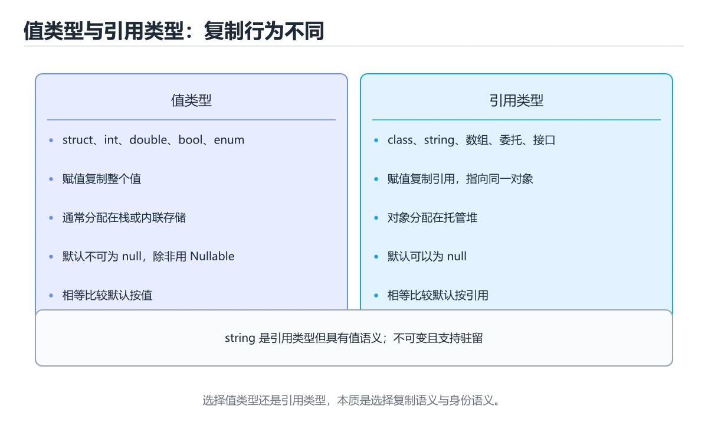
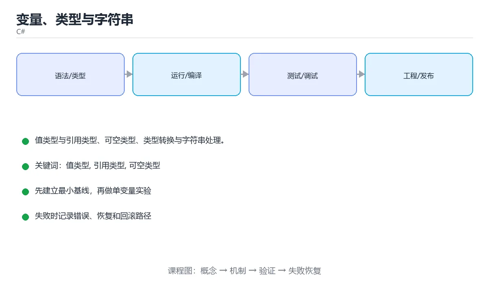

# 变量、类型与字符串





> 内容更新时间：2026-10-03 · 学习阶段：基础 · 预计用时：15 分钟

## 学习目标

- 能用自己的话解释「变量、类型与字符串」解决了什么问题，而不是只背术语。
- 能说清 「值类型」、「引用类型」、「可空类型」、「TryParse」 之间的关系，并分别举出一个例子。
- 能把本课知识放回「C#」的知识体系，说明它和相邻主题的边界。
- 能完成本课练习，并用验收标准检查自己的结果。

> 一句话摘要：值类型与引用类型、可空类型、类型转换与字符串处理。

## 前置知识

- 先完成上一课《C# 与 .NET 平台》；如果已经掌握，可以直接用本课练习自测。
- 本课阶段：基础。建议会读写简单代码或命令，并理解变量、输入输出等基本概念。
- 开始前先复习：值类型、引用类型、可空类型。
- 如果某一步看不懂，先记录具体卡点，完成练习后再回头读一遍。


## 值类型与引用类型

```csharp
int count = 42;             // 值类型：直接存数据
double pi = 3.14159;
bool ok = true;
char letter = 'A';
decimal money = 19.99m;     // 高精度十进制，适合金额

string name = "tom";        // 引用类型：存对象引用
int[] nums = { 1, 2, 3 };
var list = new List<int>();
```

值类型赋值复制数据；引用类型赋值只复制引用，两个变量指向同一对象。

## 可空类型

```csharp
int? maybeCount = null;
Console.WriteLine(maybeCount ?? 0);              // 空值合并
Console.WriteLine(maybeCount?.ToString() ?? "无");

string? nickname = null;
int length = nickname?.Length ?? 0;              // 安全访问
```

开启可空引用类型后，编译器会警告「可能为 null 的解引用」，这是 C# 减少空指针异常的核心手段。

## 类型转换

```csharp
int small = 100;
long big = small;                      // 隐式转换（安全）

double d = 3.99;
int truncated = (int)d;                // 显式转换：3

string text = "123";
int parsed = int.Parse(text);           // 失败抛 FormatException
bool success = int.TryParse(text, out int value);   // 更安全的写法

object boxed = 42;                      // 装箱
int unboxed = (int)boxed;               // 拆箱
```

优先使用 `TryParse`，避免用异常控制正常流程。

## 字符串

```csharp
string name = "小明";
int age = 18;

string message = $"你好 {name}，明年 {age + 1} 岁";   // 字符串插值
string joined = string.Join(", ", new[] { "a", "b" });
bool same = string.Equals("abc", "ABC", StringComparison.OrdinalIgnoreCase);

string raw = """
    多行文本
    保留格式
    """;
```

字符串不可变，循环拼接应使用 `StringBuilder`：

```csharp
var sb = new StringBuilder();
for (int i = 0; i < 3; i++) sb.Append(i).Append(',');
Console.WriteLine(sb.ToString());
```

## 本课小结
记住三点：**值类型复制数据、引用类型共享对象、可空类型用 `?.` 与 `??` 安全处理**。


## 类型速查

| 类型 | 大小 | 说明 | 字面量示例 |
| --- | --- | --- | --- |
| `bool` | 1 字节 | 真假 | `true` |
| `char` | 2 字节 | UTF-16 字符 | `'a'` |
| `int` | 4 字节 | 最常用整数 | `42` |
| `long` | 8 字节 | 大整数，需后缀 | `42L` |
| `double` | 8 字节 | 默认浮点 | `3.14` |
| `float` | 4 字节 | 需后缀 | `3.14f` |
| `decimal` | 16 字节 | 金额，精度高 | `19.99m` |
| `string` | 引用类型 | 不可变字符串 | `"hello"` |
| `DateTime` | 结构体 | 时间点 | `DateTime.UtcNow` |
| `Guid` | 结构体 | 唯一标识 | `Guid.NewGuid()` |
| `object` | 引用类型 | 所有类型的基类 | 装箱后使用 |

值类型与引用类型对照：

| 维度 | 值类型（struct / int） | 引用类型（class / string） |
| --- | --- | --- |
| 赋值 | 复制内容 | 复制引用 |
| 存储位置 | 通常在栈或内联 | 托管堆 |
| 可为 null | 需 `int?` 等可空类型 | 默认可为 null（开启可空注解后需声明） |
| 相等比较 | 默认按内容 | 默认按引用，`string` 重写为按内容 |

## 字符串与格式化速查

| 目的 | 写法 |
| --- | --- |
| 插值 | `$"你好 {name}"` |
| 格式化数字 | `$"{price:F2}"`、`$"{count:N0}"` |
| 对齐 | `$"{name,-10}\|"`（左对齐 10 位） |
| 逐字字符串 | `@"C:\temp\a.txt"` |
| 多行字符串 | `"""..."""`（C# 11+） |
| 拼接大文本 | `StringBuilder` |
| 拆分与连接 | `string.Split(',')`、`string.Join(",", list)` |
| 忽略大小写比较 | `string.Equals(a, b, StringComparison.OrdinalIgnoreCase)` |
| 判空 | `string.IsNullOrWhiteSpace(s)` |

```csharp
decimal price = 19.9m;
int count = 3;
Console.WriteLine($"总价：{price * count:F2}");      // 总价：59.70

string? input = null;
int value = int.TryParse(input, out var parsed) ? parsed : 0;   // 不抛异常

if (string.IsNullOrWhiteSpace(input))
{
    Console.WriteLine("请填写内容");
}
```

## 常见错误对照表

| 容易写错的做法 | 实际现象 | 原因与正确做法 |
| --- | --- | --- |
| 用 `double` 算金额 | 出现 0.30000000000000004 之类的误差 | 金额一律用 `decimal`，并明确舍入模式 |
| `int.Parse("abc")` | `FormatException` | 用户输入用 `int.TryParse` |
| `left == right` 比较字符串 | 大多数情况可用，但受文化影响 | 明确指定 `StringComparison.Ordinal` 或 `OrdinalIgnoreCase` |
| 循环里用 `+=` 拼字符串 | 生成大量临时对象 | 用 `StringBuilder` |
| 大量修改 `string` | 每次都是新对象 | 需要可变时用 `Span<char>` 或 `StringBuilder` |
| 溢出未检查 | 结果静默回绕 | 用 `checked` 块，或使用 `long` / `BigInteger` |
| `int?` 直接参与运算 | 编译错误或结果为 null | 用 `?? 0` 或先判 `HasValue` |
| 忽略可空引用警告 | 运行时 `NullReferenceException` | 开启 `<Nullable>enable</Nullable>` 并处理警告 |
| 用 `==` 比较浮点 | 结果不稳定 | 用容差比较，或改用 `decimal` |
| 隐式类型转换丢精度 | 数据被截断 | 显式 `checked` 转换或用更大类型 |

## 自测清单

- [ ] 金额一律用 `decimal`，不用 `double`。
- [ ] 用户输入用 `TryParse`，不依赖异常控制流程。
- [ ] 字符串比较明确指定 `StringComparison`。
- [ ] 知道值类型与引用类型在赋值时的差异。
- [ ] 开启了可空引用类型并认真对待警告。


## 零基础详解：值类型、引用类型与可空类型

### 一句话说清它是什么

C# 把类型分成两类：**值类型**（数据直接放在变量里）和**引用类型**（变量存地址，数据在堆上）。
再配上可空类型 `?`，空引用问题就能在编译期被大量拦下。

### 值类型 vs 引用类型

| 对比 | 值类型 | 引用类型 |
| --- | --- | --- |
| 常见类型 | `int`、`double`、`bool`、`char`、`struct`、`enum` | `string`、`class`、`array`、`record`、委托 |
| 存放 | 变量本身含数据 | 变量存引用，对象在堆上 |
| 赋值 | 复制一份，互不影响 | 复制引用，指向同一对象 |
| 能否为 null | 默认不能（可加 `?`） | 可以 |
| 释放 | 随作用域结束 | 由垃圾回收器管理 |

```csharp
int a = 1;
int b = a;
b = 2;                 // a 仍是 1

var list1 = new List<int> { 1 };
var list2 = list1;
list2.Add(2);          // list1 也变成 [1, 2]
```

### 可空类型：让编译器帮你防空

```csharp
string? maybeName = null;

// 1. 判空
if (maybeName is not null)
{
    Console.WriteLine(maybeName.Length);
}

// 2. 空合并与空条件
var name = maybeName ?? "匿名";
var length = maybeName?.Length ?? 0;
```

| 写法 | 含义 |
| --- | --- |
| `string?` | 这个变量可能为 null |
| `?.` | 为空就返回 null，不再往下取 |
| `??` | 为空时取右边的默认值 |
| `??=` | 为空时赋值 |
| `!` | 告诉编译器「我确定不为空」（慎用） |

### `var`、`dynamic`、`object` 三者别混

| 关键字 | 类型确定时机 | 类型安全 | 建议 |
| --- | --- | --- | --- |
| `var` | 编译期（由右侧推导） | 安全 | **日常首选** |
| `object` | 编译期（基类） | 需要拆箱转换 | 少用 |
| `dynamic` | 运行时 | 不安全 | 只在互操作时用 |

### 常用类型与精度

| 类型 | 用途 | 注意 |
| --- | --- | --- |
| `int` / `long` | 整数 | 默认 int，超大用 long |
| `double` | 科学计算 | 有精度误差，别比相等 |
| `decimal` | **金额** | 精度高、范围小，金融场景首选 |
| `char` / `string` | 字符与文本 | string 不可变 |
| `DateTime` / `DateTimeOffset` | 时间 | 跨时区用 Offset |
| `Guid` | 唯一标识 | 分布式 ID 常用 |

```csharp
decimal price = 19.99m;        // 金额必须加 m 后缀
double ratio = 1.0 / 3;
Console.WriteLine(price * 3);            // 59.97
Console.WriteLine($"{ratio:F4}");        // 0.3333
```

### 字符串处理三件套

```csharp
string raw = "  Hello, C#  ";
var trimmed = raw.Trim();                       // 去首尾空格
var upper = trimmed.ToUpperInvariant();         // 大写
var parts = trimmed.Split(", ");                // 拆分

// 大量拼接用 StringBuilder，避免产生大量临时字符串
var sb = new System.Text.StringBuilder();
foreach (var p in parts) sb.Append(p).Append('|');
Console.WriteLine(sb);
```

### 新手最容易踩的七个坑

| 坑 | 现象 | 正确做法 |
| --- | --- | --- |
| 金额用 `double` | 出现 0.30000000000000004 | 改用 `decimal` 并加 `m` |
| 浮点直接比相等 | 条件几乎不成立 | 用误差或 `decimal` |
| 忘了 `?` | 可空警告或运行时空引用 | 声明可空类型并显式处理 |
| 滥用 `!` | 掩盖真实空值风险 | 优先判空或用 `??` |
| `int` 溢出 | 结果异常 | 用 `long` 或 `checked` |
| 字符串循环拼接 | 性能差 | 用 `StringBuilder` |
| `var` 用过头 | 阅读时看不出类型 | 类型不明显时写全类型 |

### 手把手练习：金额结算

```csharp
using System.Globalization;

decimal unitPrice = 19.99m;
int quantity = 3;
decimal discountRate = 0.9m;

decimal total = unitPrice * quantity * discountRate;
decimal rounded = Math.Round(total, 2, MidpointRounding.AwayFromZero);

Console.WriteLine($"原价 {unitPrice * quantity:C}");
Console.WriteLine($"折扣后 {rounded:C}");
Console.WriteLine($"格式化示例 {rounded.ToString("N2", CultureInfo.InvariantCulture)}");
```

### 学完自测

- [ ] 能说出值类型和引用类型在赋值时的差别。
- [ ] 能解释 `?.`、`??`、`??=` 各自的含义。
- [ ] 知道金额为什么必须用 `decimal`。
- [ ] 能说出 `var`、`object`、`dynamic` 的区别。
- [ ] 知道什么时候该用 `StringBuilder`。

## 动手练习


> 本课练习重点：围绕「值类型、引用类型、可空类型」完成复述、实验和交付，每个结果都要能被别人检查。

先建最小控制台程序，再补类型、异步和异常路径，最后用 dotnet test 验证。

### 练习 1：建立心智模型（10 分钟）

合上教程，用 3～5 句话回答：

1. 「变量、类型与字符串」解决了什么问题？
2. 如果没有它，会出现什么具体后果？
3. 它和「引用类型」是什么关系？

**验收标准**：至少出现一个本课关键词，并写出一个反例、边界条件或失效场景。

### 练习 2：做一次可控实验（20 分钟）

从正文中选一个最小示例，完成以下操作：

1. 先预测修改一个参数、输入或步骤后的结果。
2. 再实际执行或逐步推演，记录真实结果。
3. 如果结果与预测不同，写出差异原因。

**验收标准**：留下「原例 → 改动 → 预测 → 结果 → 原因」五步记录。

### 练习 3：交付一个小结果（30 分钟）

写一个控制台小程序，补一个正例、一个边界值和一个异常路径。

任务要求：

- 结果必须能被别人检查，不能只写“我已经理解了”。
- 至少覆盖「值类型」和「引用类型」两个关键词。
- 写出 1 个仍然不确定的问题，以及下一步如何验证。

> 提示：时间有限时优先做练习 1 和练习 2；练习 3 可以拆成两次完成。


## 考点精讲：把测验题还原成判断过程

本课有 6 个判断点。先自己作答，再看「判断依据」；如果结论正确但理由不完整，回到正文对应章节补足概念。

### 考点 1：decimal 最适合表示哪类数据？

- **正确判断**：金额等需要精确十进制的数据
- **判断依据**：正确答案是「金额等需要精确十进制的数据」，本课在「本课小结」中说明：记住三点：值类型复制数据、引用类型共享对象、可空类型用 ?. 与 ?? 安全处理。decimal 是十进制浮点，精度高但运算较慢，适合金额与财务计算。本课还在「零基础详解：值类型、引用类型与可空类型」中说明：C# 把类型分成两类：值类型（数据直接放在变量里）和引用类型（变量存地址，数据在堆上）。本课还在「值类型与引用类型」中说明：引用类型赋值只复制引用，两个变量指向同一对象。
- **迁移检查**：遮住选项，只根据定义复述一次答案，再回来看哪个选项与复述一致。

### 考点 2：相比 int.Parse，int.TryParse 的优势是？

- **正确判断**：解析失败返回 false 而不抛异常
- **判断依据**：正确答案是「解析失败返回 false 而不抛异常」，本课在「本课小结」中说明：记住三点：值类型复制数据、引用类型共享对象、可空类型用 ?. 与 ?? 安全处理。TryParse 用返回值表达成功与否，避免用异常控制正常流程。本课还在「可空类型」中说明：开启可空引用类型后，编译器会警告「可能为 null 的解引用」，这是 C# 减少空指针异常的核心手段。本课还在「零基础详解：值类型、引用类型与可空类型」中说明：C# 把类型分成两类：值类型（数据直接放在变量里）和引用类型（变量存地址，数据在堆上）。
- **迁移检查**：如果给某个错误选项去掉一个限定词，它会不会变成正确？说明理由。

### 考点 3：循环中拼接大量字符串应使用？

- **正确判断**：StringBuilder
- **判断依据**：字符串不可变，+ 会不断创建新对象。StringBuilder 在缓冲区中追加。针对「循环中拼接大量字符串应使用，」，本课在「字符串」中说明：字符串不可变，循环拼接应使用 StringBuilder。本课还在「零基础详解：值类型、引用类型与可空类型」中说明：再配上可空类型 ?，空引用问题就能在编译期被大量拦下。本课还在「值类型与引用类型」中说明：引用类型赋值只复制引用，两个变量指向同一对象。
- **迁移检查**：遮住选项，只根据定义复述一次答案，再回来看哪个选项与复述一致。

### 考点 4：C# 中 var 声明的变量类型是？

- **正确判断**：编译期由初始化表达式推断的静态类型
- **判断依据**：正确答案是「编译期由初始化表达式推断的静态类型」，本课在「零基础详解：值类型、引用类型与可空类型」中说明：再配上可空类型 ?，空引用问题就能在编译期被大量拦下。var 只是省写类型，仍受强类型约束。本课还在「可空类型」中说明：开启可空引用类型后，编译器会警告「可能为 null 的解引用」，这是 C# 减少空指针异常的核心手段。本课还在「零基础详解：值类型、引用类型与可空类型」中说明：能说出 var、object、dynamic 的区别。
- **迁移检查**：遮住选项，只根据定义复述一次答案，再回来看哪个选项与复述一致。

### 考点 5：开启可空引用类型后，string? 表示？

- **正确判断**：明确声明该引用可能为 null
- **判断依据**：正确答案是「明确声明该引用可能为 null」，本课在「字符串」中说明：字符串不可变，循环拼接应使用 StringBuilder。可空注解能在编译期暴露潜在的空引用风险，是减少 NullReferenceException 的有效手段。课程摘要指出值类型与引用类型，可空类型，类型转换与字符串处理，本课要判断的正是开启可空引用类型后，string?表示。
- **迁移检查**：如果给某个错误选项去掉一个限定词，它会不会变成正确？说明理由。

### 考点 6：补全代码：「变量、类型与字符串」示例中，下面这行代码缺少哪个关键字或函数名？请填入 ____。 `if (string.____(input))`

- **正确判断**：IsNullOrWhiteSpace / isnullorwhitespace
- **判断依据**：正确答案是「IsNullOrWhiteSpace」，这道题在问补全代码：变量、类型与字符串示例中，下面这行代码缺少…string.____(input))`，判断时要把题干限定的输入、边界与目标逐项对齐。本课示例中还能看到 `if (string.IsNullOrWhiteSpace(input))` 这样的用法，说明该关键字在本课代码中承担实际功能。
- **迁移检查**：不看题干，用自己的话补全这句话，再与标准答案对照。

## 本课复习清单

离开本课前，逐项确认：

- [ ] 不看解析，能说出「decimal 最适合表示哪类数据？」的判断依据。
- [ ] 不看解析，能说出「相比 int.Parse，int.TryParse 的优势是？」的判断依据。
- [ ] 不看解析，能说出「循环中拼接大量字符串应使用？」的判断依据。
- [ ] 不看解析，能说出「C# 中 var 声明的变量类型是？」的判断依据。
- [ ] 不看解析，能说出「开启可空引用类型后，string? 表示？」的判断依据。
- [ ] 不看解析，能说出「补全代码：「变量、类型与字符串」示例中，下面这行代码缺少哪个关键字或函数名？请填…」的判断依据。
- [ ] 至少运行一次本课示例，记录输入、输出和一个边界情况。
- [ ] 把本课最容易混淆的两个概念写成一句话对照。

| 复盘项 | 记录 |
| --- | --- |
| 已经能独立解释的考点 |  |
| 仍然说不清的概念 |  |
| 下一步验证动作 |  |

## 术语速查

把本课反复出现的术语集中放在一起。复习时先遮住右列，尝试用自己的话解释，再回到正文核对。

| 术语 | 本课语境 |
| --- | --- |
| `TryParse` | 优先使用 `TryParse`，避免用异常控制正常流程。 |
| `StringBuilder` | 字符串不可变，循环拼接应使用 `StringBuilder`： |
| `?.` | 记住三点：**值类型复制数据、引用类型共享对象、可空类型用 `?.` 与 `??` 安全处理**。 |
| `??` | 记住三点：**值类型复制数据、引用类型共享对象、可空类型用 `?.` 与 `??` 安全处理**。 |
| `bool` | \| `bool` \| 1 字节 \| 真假 \| `true` \| |
| `true` | \| `bool` \| 1 字节 \| 真假 \| `true` \| |
| `char` | \| `char` \| 2 字节 \| UTF-16 字符 \| `'a'` \| |
| `'a'` | \| `char` \| 2 字节 \| UTF-16 字符 \| `'a'` \| |
| `int` | \| `int` \| 4 字节 \| 最常用整数 \| `42` \| |
| `long` | \| `long` \| 8 字节 \| 大整数，需后缀 \| `42L` \| |
| `42L` | \| `long` \| 8 字节 \| 大整数，需后缀 \| `42L` \| |
| `double` | \| `double` \| 8 字节 \| 默认浮点 \| `3.14` \| |

## 面试问答与自测

下面把本课考点换成面试追问。先口述自己的答案，
再对照参考回答检查是否遗漏了前提、边界或失败路径。

### 追问 1：decimal 最适合表示哪类数据？

**参考回答**：正确答案是「金额等需要精确十进制的数据」，本课在「本课小结」中说明：记住三点：值类型复制数据、引用类型共享对象、可空类型用 ?. 与 ?? 安全处理。decimal 是十进制浮点，精度高但运算较慢，适合金额与财务计算。本课还在「零基础详解·值类型、引用类型与可空类型」中说明：C# 把类型分成两类：值类型（数据直接放在变量里）和引用类型（变量存地址，数据在堆上）。本课还在「值类型与引用类型」中说明：引用类型赋值只复制引用，两个变量指向同一对象。

### 追问 2：相比 int.Parse，int.TryParse 的优势是？

**参考回答**：正确答案是「解析失败返回 false 而不抛异常」，本课在「本课小结」中说明：记住三点：值类型复制数据、引用类型共享对象、可空类型用 ?. 与 ?? 安全处理。TryParse 用返回值表达成功与否，避免用异常控制正常流程。本课还在「可空类型」中说明：开启可空引用类型后，编译器会警告「可能为 null 的解引用」，这是 C# 减少空指针异常的核心手段。本课还在「零基础详解·值类型、引用类型与可空类型」中说明：C# 把类型分成两类：值类型（数据直接放在变量里）和引用类型（变量存地址，数据在堆上）。

### 追问 3：循环中拼接大量字符串应使用？

**参考回答**：字符串不可变，+ 会不断创建新对象。StringBuilder 在缓冲区中追加。针对「循环中拼接大量字符串应使用，」，本课在「字符串」中说明：字符串不可变，循环拼接应使用 StringBuilder。本课还在「零基础详解·值类型、引用类型与可空类型」中说明：再配上可空类型 ?，空引用问题就能在编译期被大量拦下。本课还在「值类型与引用类型」中说明：引用类型赋值只复制引用，两个变量指向同一对象。

### 追问 4：C# 中 var 声明的变量类型是？

**参考回答**：正确答案是「编译期由初始化表达式推断的静态类型」，本课在「零基础详解·值类型、引用类型与可空类型」中说明：再配上可空类型 ?，空引用问题就能在编译期被大量拦下。var 只是省写类型，仍受强类型约束。本课还在「可空类型」中说明：开启可空引用类型后，编译器会警告「可能为 null 的解引用」，这是 C# 减少空指针异常的核心手段。本课还在「零基础详解·值类型、引用类型与可空类型」中说明：能说出 var、object、dynamic 的区别。

### 追问 5：开启可空引用类型后，string? 表示？

**参考回答**：正确答案是「明确声明该引用可能为 null」，本课在「字符串」中说明：字符串不可变，循环拼接应使用 StringBuilder。可空注解能在编译期暴露潜在的空引用风险，是减少 NullReferenceException 的有效手段。课程摘要指出值类型与引用类型，可空类型，类型转换与字符串处理，本课要判断的正是开启可空引用类型后，string?表示。

## English Overview

**Title:** Types & Strings

**Summary:** Value/reference types, nullable, casting and strings.

**Category:** C#  
**Level:** 基础  
**Key terms:** 值类型, 引用类型, 可空类型, TryParse, StringBuilder

> The full tutorial is written in Chinese. This bilingual overview helps English readers identify the topic, scope and key terms before studying the detailed examples.

## 内容元数据

- 内容版本：v2.0
- 最后更新：2026-10-03
- 学习阶段：基础
- 适用环境：.NET 9 / C# 13
- 内容来源：内置结构化课程与工程实践整理
- 相关主题：值类型、引用类型、可空类型、TryParse、StringBuilder
- 质量版本：P0 测验标准 + P1 覆盖扩展 + P2 体验补全


## 参考资料与复核

- 最后复核：2026-10-04
- 下次复核：2027-04-04
- 复核范围：版本兼容、API 行为、安全建议与工程实践
- 来源性质：官方文档与标准；本课正文为离线教学重组，不复制原文

| 参考资料 | 本课用途 |
| --- | --- |
| [C# 官方指南](https://learn.microsoft.com/dotnet/csharp/) | 语言、异步与模式匹配 |
| [.NET 文档](https://learn.microsoft.com/dotnet/) | 运行时、GC 与发布 |

> 本课主题：值类型与引用类型、可空类型、类型转换与字符串处理。

> App 完全离线展示文字链接，不会自动联网；需要延伸阅读时可复制链接到浏览器。

<!-- code-practice:v1:start -->

## 代码练习（6 题）

下面题目与课程测验同源：覆盖代码输出、排错与场景判断。建议先自己写出答案，再到「测验」里核对成绩。

### 练习 1 · 代码输出

在 C# 课程“变量、类型与字符串”的输入输出实验里，这段代码运行后输出什么？

```csharp
using System;

class Program {
    static void Main() {
        int x = 7;
        Console.WriteLine(x);
    }
}
```

- A. 14
- B. 6
- C. 7
- D. 8

**参考答案**：C. 7
**参考输出**：`7`

**解析**

在 C# 课程“变量、类型与字符串”的输入输出代码实验里，程序先完成赋值、循环或函数调用，再把结果写到标准输出，因此正确结果是 7。
判断 C# 课程“变量、类型与字符串”的代码输出时，要把“源码写了什么”和“运行时实际打印什么”分开；变量值和循环边界都会直接改变最终结果。
把 7 当作基线后，可以只改一个输入或一个边界，再观察 C# 课程“变量、类型与字符串”的输出如何变化，这就是验证掌握程度的方法。

### 练习 2 · 代码输出

在 C# 课程“变量、类型与字符串”的边界实验里，这段代码运行后输出什么？

```csharp
using System;

class Program {
    static void Main() {
        int total = 0;
        for (int i = 1; i <= 5; i++) {
            total += i;
        }
        Console.WriteLine(total);
    }
}
```

- A. 14
- B. 15
- C. 30
- D. 16

**参考答案**：B. 15
**参考输出**：`15`

**解析**

在 C# 课程“变量、类型与字符串”的边界代码实验里，程序先完成赋值、循环或函数调用，再把结果写到标准输出，因此正确结果是 15。
判断 C# 课程“变量、类型与字符串”的代码输出时，要把“源码写了什么”和“运行时实际打印什么”分开；变量值和循环边界都会直接改变最终结果。
把 15 当作基线后，可以只改一个输入或一个边界，再观察 C# 课程“变量、类型与字符串”的输出如何变化，这就是验证掌握程度的方法。

### 练习 3 · 代码输出

在 C# 课程“变量、类型与字符串”的变量实验里，这段代码运行后输出什么？

```csharp
using System;

class Program {
    static int DoubleValue(int value) => value * 2;

    static void Main() {
        Console.WriteLine(DoubleValue(5));
    }
}
```

- A. 10
- B. 20
- C. 11
- D. 9

**参考答案**：A. 10
**参考输出**：`10`

**解析**

在 C# 课程“变量、类型与字符串”的变量代码实验里，程序先完成赋值、循环或函数调用，再把结果写到标准输出，因此正确结果是 10。
判断 C# 课程“变量、类型与字符串”的代码输出时，要把“源码写了什么”和“运行时实际打印什么”分开；变量值和循环边界都会直接改变最终结果。
把 10 当作基线后，可以只改一个输入或一个边界，再观察 C# 课程“变量、类型与字符串”的输出如何变化，这就是验证掌握程度的方法。

### 练习 4 · 代码排错

C# 课程“变量、类型与字符串”的下面这段代码无法运行，最可能的修复是什么？

```csharp
using System;

class Program {
    static void Main() {
        int x = 7
        Console.WriteLine(x);
    }
}
```

- A. 在 int x = 7 这一行末尾补上分号
- B. 把输出语句整段删除，代码就会自动修复
- C. 把变量名改成另一个单词即可
- D. 重新安装运行时并清空所有缓存

**参考答案**：A. 在 int x = 7 这一行末尾补上分号

**解析**

C# 课程“变量、类型与字符串”里的这段代码无法通过编译或解析，关键原因是缺少了必要语法结构，正确修复是在 int x = 7 这一行末尾补上分号。
在 C# 课程“变量、类型与字符串”中，错误信息通常会指出出错行和期望符号；先读第一条错误，再检查这一行的括号、冒号、分号或花括号。
修复后还要重新运行 C# 课程“变量、类型与字符串”的最小示例，确认输出恢复，并记录这次问题属于语法错误而不是逻辑错误。

### 练习 5 · 代码排错

C# 课程“变量、类型与字符串”的这段代码结果偏小，应该怎样修改？

```csharp
using System;

class Program {
    static void Main() {
        int total = 0;
        for (int i = 1; i < 5; i++) {
            total += i;
        }
        Console.WriteLine(total);
    }
}
```

- A. 把循环变量从 1 改成 0，其余保持不变
- B. 把累加操作改成减法操作
- C. 把循环条件 i < 5 改成 i <= 5
- D. 把输出语句移到循环体内部

**参考答案**：C. 把循环条件 i < 5 改成 i <= 5
**修复后输出**：`15`

**解析**

C# 课程“变量、类型与字符串”里的循环边界少算了最后一项，当前输出是 10，而完整求和应为 15。
正确修复是把循环条件 i < 5 改成 i <= 5；这类错误属于边界问题，代码能运行但结果偏离，所以比语法错误更隐蔽。
验证 C# 课程“变量、类型与字符串”时至少选择首项、中间值和末尾值三个输入，比较手算结果与程序输出，才能发现类似偏差。

### 练习 6 · 概念判断

在 C# 课程“变量、类型与字符串”的学习或项目场景中，哪种做法最有助于得到可验证、可迁移的结果？

- A. 一次改完所有变量和依赖，再统一观察是否报错
- B. 跳过错误信息，直接复制另一段代码直到能运行
- C. 先围绕「值类型」写最小可运行示例，再用边界输入验证“变量、类型与字符串”的结果
- D. 只背下「变量、类型与字符串」的结论，遇到新输入时凭感觉修改代码

**参考答案**：C. 先围绕「值类型」写最小可运行示例，再用边界输入验证“变量、类型与字符串”的结果

**解析**

在 C# 课程“变量、类型与字符串”里，值类型不是孤立的名词，而是一组可以用输入、过程、输出和边界验证的行为。
对 C# 课程“变量、类型与字符串”来说，先写最小可运行示例，再逐步增加边界输入，能把“感觉会了”转化成可以重复的证据。
如果只背结论或一次改很多变量，出错时就无法判断是哪一步破坏了 C# 课程“变量、类型与字符串”的预期；先把变化隔离出来才容易定位。

<!-- code-practice:v1:end -->
