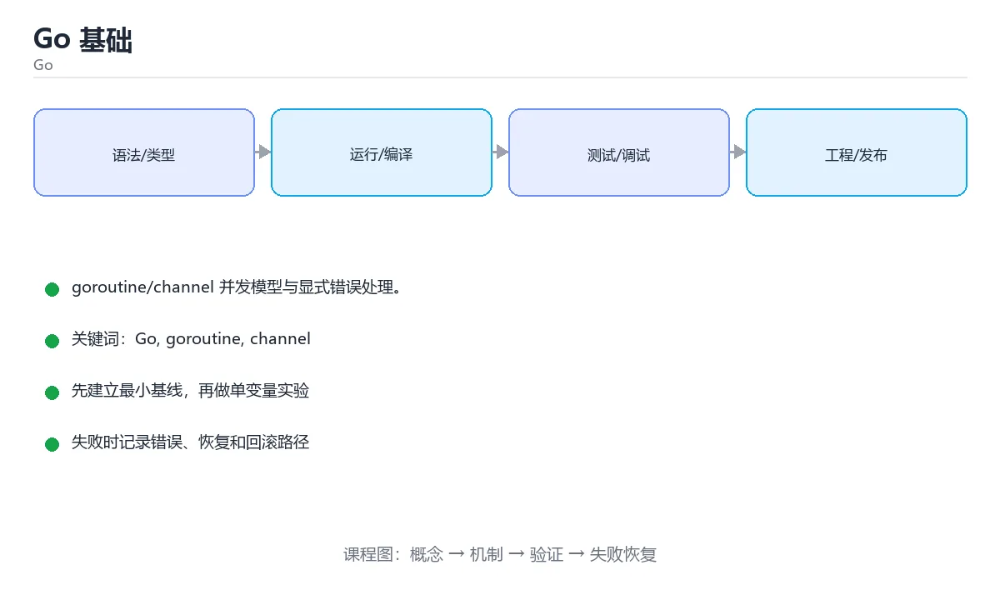

# Go 基础




> 内容更新时间：2026-10-03 · 学习阶段：基础 · 预计用时：15 分钟

## 学习目标

- 能用自己的话解释「Go 基础」解决了什么问题，而不是只背术语。
- 能说清 「Go」、「goroutine」、「channel」、「并发」 之间的关系，并分别举出一个例子。
- 能把本课知识放回「Go」的知识体系，说明它和相邻主题的边界。
- 能完成本课练习，并用验收标准检查自己的结果。

> 一句话摘要：goroutine/channel 并发模型与显式错误处理。

## 前置知识

- 会进行基本的文件、命令行或浏览器操作；遇到不熟悉的术语先查本课关键词。
- 本课阶段：基础。建议会读写简单代码或命令，并理解变量、输入输出等基本概念。
- 开始前先复习：Go、goroutine、channel。
- 如果某一步看不懂，先记录具体卡点，完成练习后再回头读一遍。


## 语言定位

Go（Golang）由 Google 设计，主打**简单、编译快、并发友好、部署方便**：编译成单个静态可执行文件，自带垃圾回收与标准库，非常适合云原生、微服务与 CLI 工具（Docker、Kubernetes、etcd 都用它写）。

## 基础语法要点

| 特性 | 说明 |
| --- | --- |
| 变量声明 | `var x int = 1` 或短变量声明 `x := 1`（函数内可用） |
| 类型 | 静态强类型，零值明确（int 为 0、string 为 ""、指针为 nil） |
| 多返回值 | 函数可返回多个值，错误通常作为最后一个返回值 |
| 错误处理 | 显式 `if err != nil`，没有异常机制（panic 仅用于不可恢复错误） |
| 结构体 | 值类型，方法可定义在值或指针接收者上 |
| 接口 | 隐式实现：只要方法集匹配就满足接口 |
| 包管理 | go mod init / go get / go mod tidy |

## 并发模型

Go 用 **goroutine** 与 **channel** 实现 CSP 模型：不要通过共享内存来通信，而要通过通信来共享内存。

| 原语 | 用途 |
| --- | --- |
| goroutine | 轻量协程，`go f()` 即启动 |
| channel | 类型安全的管道，用于传递数据与同步 |
| select | 多路复用，可配合超时与退出信号 |
| sync 包 | Mutex、WaitGroup、Once、原子操作 |

关键实践：用 context 传递取消与超时；用 WaitGroup 等待一组任务；channel 要有明确的关闭方，避免向已关闭的 channel 发送数据导致 panic。

## 工程实践

1. 错误要带上文：`fmt.Errorf("load config: %w", err)`，用 `errors.Is/As` 判断。
2. 用 `defer` 释放资源（关闭文件、解锁），注意它在函数返回时执行。
3. 目录结构常用 `cmd/`（入口）、`internal/`（私有包）、`pkg/`（可复用包）。
4. 工具链：`go fmt` 统一格式、`go vet` 静态检查、`go test -race` 竞态检测。
5. 性能优化先看 pprof（CPU/内存/阻塞分析），再改代码。

## 常见坑

1. 循环变量捕获（Go 1.22 之前需显式复制）。
2. nil map 写入会 panic，必须 make 初始化。
3. goroutine 泄漏：启动后无人回收，要用 context 控制生命周期。
4. 接口值为 nil 但底层类型非 nil，判断时容易出错。

## 本课小结
Go 的设计哲学是**少即是多**：语法小、工具链统一、并发原语内置。掌握 goroutine + channel + 显式错误处理，就能写出可维护的云原生服务。


## 基础语法速查

| 概念 | 写法 | 说明 |
| --- | --- | --- |
| 变量声明 | `var name string` / `name := "x"` | `:=` 只能用在函数内 |
| 常量 | `const Pi = 3.14` | 编译期确定 |
| 多返回值 | `func f() (int, error)` | 错误作为最后一个返回值 |
| 零值 | 声明未赋值即零值 | `int` 为 0、`string` 为 ""、`map` 为 nil |
| 切片 | `s := []int{1, 2, 3}` | 动态数组，最常用 |
| 数组 | `a := [3]int{}` | 固定长度，赋值会整体拷贝 |
| 映射 | `m := map[string]int{}` | 必须 `make` 后才能写入 |
| 结构体 | `type User struct { ID int }` | 值语义，传参默认拷贝 |
| 指针 | `&user`、`*p` | 需要改原对象时用 |
| 接口 | `type Reader interface { Read() }` | 隐式实现 |
| 类型断言 | `v, ok := x.(T)` | 双返回值避免 panic |
| 空接口 | `any` | 可存任意类型，使用前需断言 |

```go
package main

import (
	"errors"
	"fmt"
)

type User struct {
	ID   int
	Name string
}

// 错误作为最后一个返回值，是 Go 的惯例
func findUser(users []User, id int) (User, error) {
	for _, u := range users {
		if u.ID == id {
			return u, nil
		}
	}
	return User{}, fmt.Errorf("user %d: %w", id, errors.New("not found"))
}

func main() {
	users := []User{{ID: 1, Name: "小明"}}
	user, err := findUser(users, 2)
	if err != nil {
		fmt.Println("查询失败：", err)
		return
	}
	fmt.Println(user.Name)
}
```

## 常用命令速查

| 目的 | 命令 |
| --- | --- |
| 初始化模块 | `go mod init example.com/app` |
| 整理依赖 | `go mod tidy` |
| 运行 | `go run .` |
| 构建 | `go build -o bin/app .` |
| 测试 | `go test ./...` |
| 竞态检测 | `go test -race ./...` |
| 覆盖率 | `go test -coverprofile=cover.out ./...` |
| 格式化 | `gofmt -w .`、`go fmt ./...` |
| 静态检查 | `go vet ./...` |
| 交叉编译 | `GOOS=linux GOARCH=amd64 go build` |
| 查看文档 | `go doc fmt.Println` |

## 常见错误对照表

| 容易写错的做法 | 实际现象 | 原因与正确做法 |
| --- | --- | --- |
| 向 nil map 写入 | panic：`assignment to entry in nil map` | 用 `make(map[string]int)` 初始化 |
| 读取 nil map | 返回零值，不 panic | 读取安全，写入才需要初始化 |
| 忽略返回的 `error` | 问题被隐藏 | 显式检查并处理或返回 |
| 用 `_` 丢弃错误变量名 | 掩盖错误 | 只在确定无需处理时使用 |
| 未使用的变量或 import | 编译错误 | Go 强制整洁，删掉或用 `_` |
| `:=` 重复声明同一变量 | 至少一个新变量才合法 | 检查左侧是否已有新变量 |
| 切片追加后原切片未更新 | 数据丢失 | `s = append(s, x)` 必须赋值回去 |
| 遍历时取 `&v` 的地址 | 拿到同一个地址 | 用下标取址或先复制到局部变量 |
| 用 `==` 比较含不可比较字段的结构体 | 编译错误 | 用 `reflect.DeepEqual` 或逐字段比较 |
| 用 `nil` 判断接口是否为「空实现」 | 结果非 nil | 接口与具体值都为 nil 时才等于 nil |

## 自测清单

- [ ] 会用 `:=` 与 `var`，知道零值规则。
- [ ] 函数返回错误作为最后一个值，并逐层处理。
- [ ] 切片、映射、结构体的差异与初始化方式清楚。
- [ ] 提交前跑 `gofmt`、`go vet`、`go test`。
- [ ] 知道接口的隐式实现与类型断言的安全写法。


## 零基础详解：Go 程序的骨架与「显式」哲学

### 一句话说清它是什么

Go 是一门**为工程而生**的语言：语法少、编译快、自带并发和垃圾回收。
它的核心哲学是「显式」——错误要显式返回。变量要显式使用，别指望编译器猜你的意图。

### 用生活比喻理解

| 概念 | 比喻 | 说明 |
| --- | --- | --- |
| 包 package | 一个抽屉 | 相关代码放一起 |
| 模块 module | 一个项目文件夹 | 由 `go.mod` 定义，管理依赖 |
| 入口 `main` | 大门 | 程序从 `main.main` 开始执行 |
| goroutine | 轻量临时工 | 几 KB 栈，能开成千上万个 |
| error 返回值 | 签收回执 | 每次调用都要看看有没有出错 |

### 逐行拆解第一个程序

```go
package main                    // 声明这是可执行程序所在的包

import (
    "errors"                    // 标准库：构造错误
    "fmt"                       // 标准库：格式化输入输出
)

func main() {                   // 程序入口
    name, err := greet("")
    if err != nil {             // Go 的固定写法：先判错误
        fmt.Println("出错：", err)
        return
    }
    fmt.Println(name)
}

func greet(name string) (string, error) {
    if name == "" {
        return "", errors.New("名字不能为空")   // 显式返回错误
    }
    return "你好，" + name, nil
}
```

| 语法点 | 说明 |
| --- | --- |
| `package main` | 可执行程序必须叫 `main`，库用别的名字 |
| `import (...)` | 多个包用括号分组，不用逗号 |
| `:=` | 声明并推导类型，只能用在函数内 |
| `(string, error)` | 多返回值，Go 没有异常，靠它表达失败 |
| `if err != nil` | 最常出现的三行代码，别偷懒忽略 |

### 变量与零值

```go
var a int          // 0
var s string       // ""（不是 nil）
var p *int         // nil
var m map[string]int   // nil，读可以，写会 panic！

b := 10            // 短声明，最常用
const MaxRetry = 3 // 常量
```

**Go 没有「未初始化」的变量，只有零值。** 危险的是 `nil map` 和 `nil slice`：
读没问题，写要先用 `make`。

### 工具链三件套

```bash
go mod init example/demo    # 初始化模块，生成 go.mod
go run .                    # 编译并运行
go build -o demo .          # 生成可执行文件
go test ./...               # 跑全部测试
gofmt -w .                  # 格式化（Go 强制统一风格）
```

### 新手最容易踩的八个坑

| 坑 | 现象 | 正确做法 |
| --- | --- | --- |
| 声明了变量不用 | 编译不过 | Go 不允许未使用变量，删掉或使用 |
| 向 nil map 写入 | panic | 先 `make(map[string]int)` |
| 忽略 error | 问题被掩盖 | 每个 error 都要处理 |
| 循环变量取地址 | 所有指针指向同一个值 | 循环内复制一份 `v := v`（Go 1.22 前） |
| `defer` 参数立即求值 | 拿到的是旧值 | 用闭包 `defer func(){ ... }()` |
| 大写首字母才导出 | 别的包看不到 | 需要外部访问就首字母大写 |
| 包名与目录不一致 | 导入混乱 | 包名尽量与目录同名 |
| 忘记 `go mod tidy` | 依赖缺失或多余 | 提交前执行一次 |

### 接口与错误的两条惯例

```go
// 1. 接口定义在使用方，且保持很小
type Reader interface {
    Read(p []byte) (int, error)
}

// 2. 包装错误保留上下文，便于 errors.Is / errors.As 判断
if err != nil {
    return fmt.Errorf("读取配置失败: %w", err)
}
```

### 手把手练习：命令行问候与统计

```go
package main

import (
    "errors"
    "fmt"
)

func average(nums []float64) (float64, error) {
    if len(nums) == 0 {
        return 0, errors.New("数组不能为空")
    }
    var sum float64
    for _, n := range nums {
        sum += n
    }
    return sum / float64(len(nums)), nil

}

func main() {
    avg, err := average([]float64{88, 92, 79})
    if err != nil {
        fmt.Println("计算失败：", err)
        return
    }
    fmt.Printf("平均分：%.1f\n", avg)
}
```

### 学完自测

- [ ] 能说出 `:=` 与 `var` 的使用场合。
- [ ] 能解释为什么 Go 不允许有未使用的变量。
- [ ] 知道向 nil map 写入会发生什么。
- [ ] 能写出返回 `(值, error)` 的函数并正确处理错误。
- [ ] 能说清 `defer` 的执行顺序和参数求值时机。

## 动手练习


> 本课练习重点：围绕「Go、goroutine、channel」完成复述、实验和交付，每个结果都要能被别人检查。

先写最小程序并用 go test 验证，再补 context、并发上限和错误传播。

### 练习 1：建立心智模型（10 分钟）

合上教程，用 3～5 句话回答：

1. 「Go 基础」解决了什么问题？
2. 如果没有它，会出现什么具体后果？
3. 它和「goroutine」是什么关系？

**验收标准**：至少出现一个本课关键词，并写出一个反例、边界条件或失效场景。

### 练习 2：做一次可控实验（20 分钟）

从正文中选一个最小示例，完成以下操作：

1. 先预测修改一个参数、输入或步骤后的结果。
2. 再实际执行或逐步推演，记录真实结果。
3. 如果结果与预测不同，写出差异原因。

**验收标准**：留下「原例 → 改动 → 预测 → 结果 → 原因」五步记录。

### 练习 3：交付一个小结果（30 分钟）

写一个可运行的小程序，并用 `go test` 或 `go vet` 验证结果。

任务要求：

- 结果必须能被别人检查，不能只写“我已经理解了”。
- 至少覆盖「Go」和「goroutine」两个关键词。
- 写出 1 个仍然不确定的问题，以及下一步如何验证。

> 提示：时间有限时优先做练习 1 和练习 2；练习 3 可以拆成两次完成。


## 考点精讲：把测验题还原成判断过程

本课有 6 个判断点。先自己作答，再看「判断依据」；如果结论正确但理由不完整，回到正文对应章节补足概念。

### 考点 1：Go 的并发模型基于什么？

- **正确判断**：goroutine + channel（CSP）
- **判断依据**：正确答案是「goroutine + channel（CSP）」，本课在「并发模型」中说明：Go 用 goroutine 与 channel 实现 CSP 模型：不要通过共享内存来通信，而要通过通信来共享内存。Go 提倡通过通信共享内存，而不是通过共享内存通信。本课还在「本课小结」中说明：掌握 goroutine + channel + 显式错误处理，就能写出可维护的云原生服务。本课还在「常见坑」中说明：goroutine 泄漏：启动后无人回收，要用 context 控制生命周期。
- **迁移检查**：如果给某个错误选项去掉一个限定词，它会不会变成正确？说明理由。

### 考点 2：Go 的错误处理方式是？

- **正确判断**：函数显式返回 error 并检查
- **判断依据**：正确答案是「函数显式返回 error 并检查」，本课在「本课小结」中说明：掌握 goroutine + channel + 显式错误处理，就能写出可维护的云原生服务。Go 用 error 返回值表达可预期失败，panic 只用于不可恢复错误。本课还在「零基础详解：Go 程序的骨架与「显式」哲学」中说明：它的核心哲学是「显式」——错误要显式返回。本课还在「零基础详解：Go 程序的骨架与「显式」哲学」中说明：能写出返回 (值, error) 的函数并正确处理错误。
- **迁移检查**：如果给某个错误选项去掉一个限定词，它会不会变成正确？说明理由。

### 考点 3：向 nil map 写入会怎样？

- **正确判断**：panic，必须先 make
- **判断依据**：正确答案是「panic，必须先 make」，本课在「常见坑」中说明：nil map 写入会 panic，必须 make 初始化。map 必须用 make 或字面量初始化后才能写入。本课还在「并发模型」中说明：channel 要有明确的关闭方，避免向已关闭的 channel 发送数据导致 panic。本课还在「并发模型」中说明：Go 用 goroutine 与 channel 实现 CSP 模型：不要通过共享内存来通信，而要通过通信来共享内存。
- **迁移检查**：把题干里的一个条件换成边界值，原来的结论还成立吗？写出判断过程。

### 考点 4：Go 中 := 与 = 的区别是？

- **正确判断**：:= 声明并推导类型（只能用在函数内），= 只做赋值
- **判断依据**：正确答案是「:= 声明并推导类型（只能用在函数内），= 只做赋值」，本课在「工程实践」中说明：用 defer 释放资源（关闭文件、解锁），注意它在函数返回时执行。:= 至少要有左侧一个新变量，重复声明同一变量会编译报错。本课还在「工程实践」中说明：错误要带上文：fmt.Errorf("load config: %w", err)，用 errors.Is/As 判断。本课还在「语言定位」中说明：Go（Golang）由 Google 设计，主打简单、编译快、并发友好、部署方便：编译成单个静态可执行文件，自带垃圾回收与标准库，非常适合云原生、微服务与 CLI 工具（Docker、Kubernetes、etcd 都用它写）。
- **迁移检查**：如果给某个错误选项去掉一个限定词，它会不会变成正确？说明理由。

### 考点 5：defer 语句的执行时机与顺序是？

- **正确判断**：函数返回前执行
- **判断依据**：正确答案是「函数返回前执行」，本课在「工程实践」中说明：用 defer 释放资源（关闭文件、解锁），注意它在函数返回时执行。defer 常用于释放锁、关闭文件。本课还在「零基础详解：Go 程序的骨架与「显式」哲学」中说明：能说清 defer 的执行顺序和参数求值时机。本课还在「并发模型」中说明：channel 要有明确的关闭方，避免向已关闭的 channel 发送数据导致 panic。
- **迁移检查**：如果给某个错误选项去掉一个限定词，它会不会变成正确？说明理由。

### 考点 6：补全代码：「Go 基础」示例中，下面这行代码缺少哪个关键字或函数名？请填入 ____。 `fmt.____("查询失败：", err)`

- **正确判断**：Println / println
- **判断依据**：正确答案是「Println」，本课在「零基础详解：Go 程序的骨架与「显式」哲学」中说明：能写出返回 (值, error) 的函数并正确处理错误。本课还在「工程实践」中说明：错误要带上文：fmt.Errorf("load config: %w", err)，用 errors.Is/As 判断。本课还在「并发模型」中说明：关键实践：用 context 传递取消与超时。
- **迁移检查**：如果填成相近的另一个函数或关键字，程序会在哪一步出错？

## 本课复习清单

离开本课前，逐项确认：

- [ ] 不看解析，能说出「Go 的并发模型基于什么？」的判断依据。
- [ ] 不看解析，能说出「Go 的错误处理方式是？」的判断依据。
- [ ] 不看解析，能说出「向 nil map 写入会怎样？」的判断依据。
- [ ] 不看解析，能说出「Go 中 := 与 = 的区别是？」的判断依据。
- [ ] 不看解析，能说出「defer 语句的执行时机与顺序是？」的判断依据。
- [ ] 不看解析，能说出「补全代码：「Go 基础」示例中，下面这行代码缺少哪个关键字或函数名？请填入 __…」的判断依据。
- [ ] 至少运行一次本课示例，记录输入、输出和一个边界情况。
- [ ] 把本课最容易混淆的两个概念写成一句话对照。

| 复盘项 | 记录 |
| --- | --- |
| 已经能独立解释的考点 |  |
| 仍然说不清的概念 |  |
| 下一步验证动作 |  |

## 术语速查

把本课反复出现的术语集中放在一起。复习时先遮住右列，尝试用自己的话解释，再回到正文核对。

| 术语 | 本课语境 |
| --- | --- |
| `var x int = 1` | \| 变量声明 \| `var x int = 1` 或短变量声明 `x := 1`（函数内可用） \| |
| `x := 1` | \| 变量声明 \| `var x int = 1` 或短变量声明 `x := 1`（函数内可用） \| |
| `if err != nil` | \| 错误处理 \| 显式 `if err != nil`，没有异常机制（panic 仅用于不可恢复错误） \| |
| `go f()` | \| goroutine \| 轻量协程，`go f()` 即启动 \| |
| `fmt.Errorf("load config: %w", err)` | 错误要带上文：`fmt.Errorf("load config: %w", err)`，用 `errors.Is/As` 判断。 |
| `errors.Is/As` | 错误要带上文：`fmt.Errorf("load config: %w", err)`，用 `errors.Is/As` 判断。 |
| `defer` | 用 `defer` 释放资源（关闭文件、解锁），注意它在函数返回时执行。 |
| `cmd/` | 目录结构常用 `cmd/`（入口）、`internal/`（私有包）、`pkg/`（可复用包）。 |
| `internal/` | 目录结构常用 `cmd/`（入口）、`internal/`（私有包）、`pkg/`（可复用包）。 |
| `pkg/` | 目录结构常用 `cmd/`（入口）、`internal/`（私有包）、`pkg/`（可复用包）。 |
| `go fmt` | 工具链：`go fmt` 统一格式、`go vet` 静态检查、`go test -race` 竞态检测。 |
| `go vet` | 工具链：`go fmt` 统一格式、`go vet` 静态检查、`go test -race` 竞态检测。 |

## 面试问答与自测

下面把本课考点换成面试追问。先口述自己的答案，
再对照参考回答检查是否遗漏了前提、边界或失败路径。

### 追问 1：Go 的并发模型基于什么？

**参考回答**：正确答案是「goroutine + channel（CSP）」，本课在「并发模型」中说明：Go 用 goroutine 与 channel 实现 CSP 模型：不要通过共享内存来通信，而要通过通信来共享内存。Go 提倡通过通信共享内存，而不是通过共享内存通信。本课还在「本课小结」中说明：掌握 goroutine + channel + 显式错误处理，就能写出可维护的云原生服务。本课还在「常见坑」中说明：goroutine 泄漏：启动后无人回收，要用 context 控制生命周期。

### 追问 2：Go 的错误处理方式是？

**参考回答**：正确答案是「函数显式返回 error 并检查」，本课在「本课小结」中说明：掌握 goroutine + channel + 显式错误处理，就能写出可维护的云原生服务。Go 用 error 返回值表达可预期失败，panic 只用于不可恢复错误。本课还在「零基础详解·Go 程序的骨架与「显式」哲学」中说明：它的核心哲学是「显式」——错误要显式返回。本课还在「零基础详解·Go 程序的骨架与「显式」哲学」中说明：能写出返回 (值, error) 的函数并正确处理错误。

### 追问 3：向 nil map 写入会怎样？

**参考回答**：正确答案是「panic，必须先 make」，本课在「常见坑」中说明：nil map 写入会 panic，必须 make 初始化。map 必须用 make 或字面量初始化后才能写入。本课还在「并发模型」中说明：channel 要有明确的关闭方，避免向已关闭的 channel 发送数据导致 panic。本课还在「并发模型」中说明：Go 用 goroutine 与 channel 实现 CSP 模型：不要通过共享内存来通信，而要通过通信来共享内存。

### 追问 4：Go 中 := 与 = 的区别是？

**参考回答**：正确答案是「:= 声明并推导类型（只能用在函数内），= 只做赋值」，本课在「工程实践」中说明：用 defer 释放资源（关闭文件、解锁），注意它在函数返回时执行。:= 至少要有左侧一个新变量，重复声明同一变量会编译报错。本课还在「工程实践」中说明：错误要带上文：fmt.Errorf("load config: %w", err)，用 errors.Is/As 判断。本课还在「语言定位」中说明：Go（Golang）由 Google 设计，主打简单、编译快、并发友好、部署方便：编译成单个静态可执行文件，自带垃圾回收与标准库，非常适合云原生、微服务与 CLI 工具（Docker、Kubernetes、etcd 都用它写）。

### 追问 5：defer 语句的执行时机与顺序是？

**参考回答**：正确答案是「函数返回前执行」，本课在「工程实践」中说明：用 defer 释放资源（关闭文件、解锁），注意它在函数返回时执行。defer 常用于释放锁、关闭文件。本课还在「零基础详解·Go 程序的骨架与「显式」哲学」中说明：能说清 defer 的执行顺序和参数求值时机。本课还在「并发模型」中说明：channel 要有明确的关闭方，避免向已关闭的 channel 发送数据导致 panic。

## English Overview

**Title:** Go Basics

**Summary:** Goroutines, channels and explicit errors.

**Category:** Go  
**Level:** 基础  
**Key terms:** Go, goroutine, channel, 并发, error

> The full tutorial is written in Chinese. This bilingual overview helps English readers identify the topic, scope and key terms before studying the detailed examples.

## 内容元数据

- 内容版本：v2.0
- 最后更新：2026-10-03
- 学习阶段：基础
- 适用环境：Go 1.24+
- 内容来源：内置结构化课程与工程实践整理
- 相关主题：Go、goroutine、channel、并发、error
- 质量版本：P0 测验标准 + P1 覆盖扩展 + P2 体验补全


## Full English Study Guide

### Overview

**Go Basics** focuses on Goroutines, channels and explicit errors.

### Learning Outcomes

- Explain what **Go Basics** solves and when it should be used.
- Identify inputs, outputs, state and failure boundaries.
- Build a minimal reproducible example and observe the real result.
- Test normal, boundary and failure paths.
- Measure performance, resource cost or security impact before optimizing.
- Document the decision, rollback path and remaining uncertainty.

### Core Mental Model

1. **Problem first:** define the exact problem before choosing a tool or pattern.
2. **Smallest example:** reduce the system to one input and one observable output.
3. **State and flow:** trace how data, control or responsibility moves through the system.
4. **Boundaries:** identify invalid input, resource limits, timeouts and permission edges.
5. **Evidence:** use tests, logs, metrics or reproductions instead of intuition.
6. **Trade-offs:** compare correctness, latency, cost, complexity and operability.

### Step-by-step Study Plan

1. Read the Chinese lesson once and write down the main problem in one sentence.
2. Run the smallest example and save the exact command and output.
3. Change only one input or parameter and predict the result before running it.
4. Introduce one failure and record how the system detects, reports and recovers.
5. Write one test or checklist item for the normal, boundary and failure paths.
6. Complete the quiz and explain every wrong answer in your own words.

### Practice Tasks

- Rebuild the minimal example from an empty directory.
- Add one boundary test and one failure test.
- Produce a short report containing the baseline, change, result and rollback.

### Common Failure Modes

- Treating a happy-path demo as production readiness.
- Skipping boundary values and invalid inputs.
- Optimizing before establishing a measurable baseline.
- Hiding errors, permissions or resource limits.

### Self-check Questions

1. What is the smallest observable result that proves this lesson works?
2. What input or state is most likely to break it?
3. Which metric or test would reveal a regression?
4. What is the rollback path?
5. What is the cost of using this approach at 10x scale?
6. Which adjacent topic is most often confused with this one?

### Glossary

- Topic: **Go Basics**
- Related terms: Go, goroutine, channel, 并发
- Primary evidence: command output, tests, logs, metrics or reproductions

> This guide is an English study companion for the detailed Chinese lesson. It covers the learning path, mental model and acceptance questions; code examples and engineering details remain in the main tutorial.


## Bilingual Section Outline

| 中文小节 | English section |
| --- | --- |
| 学习目标 | Learning objectives |
| 前置知识 | Prerequisites |
| 语言定位 | 语言定位 |
| 基础语法要点 | 基础语法要点 |
| 并发模型 | ConcurrencyModel |
| 工程实践 | 工程实践 |
| 常见坑 | 常见坑 |
| 本课小结 | Summary |
| 基础语法速查 | 基础语法速查 |
| 常用命令速查 | 常用命令速查 |

> 该大纲把每个中文小节映射为英文标题，配合 Full English Study Guide 使用。


## 参考资料与复核

- 最后复核：2026-10-04
- 下次复核：2027-04-04
- 复核范围：版本兼容、API 行为、安全建议与工程实践
- 来源性质：官方文档与标准；本课正文为离线教学重组，不复制原文

| 参考资料 | 本课用途 |
| --- | --- |
| [Go 官方文档](https://go.dev/doc/) | 语言、并发与工具链 |
| [Go 标准库](https://pkg.go.dev/std) | 标准库 API |

> 本课主题：goroutine/channel 并发模型与显式错误处理。

> App 完全离线展示文字链接，不会自动联网；需要延伸阅读时可复制链接到浏览器。
